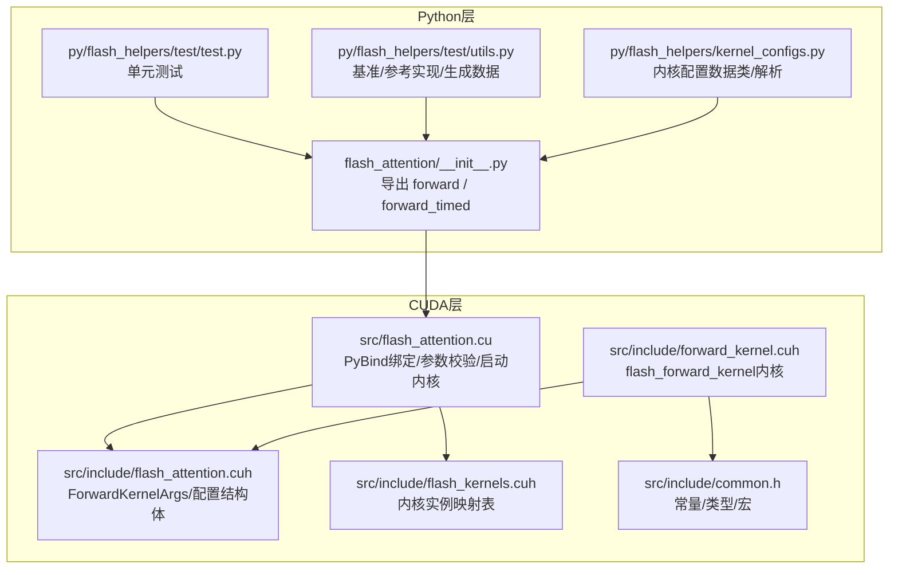
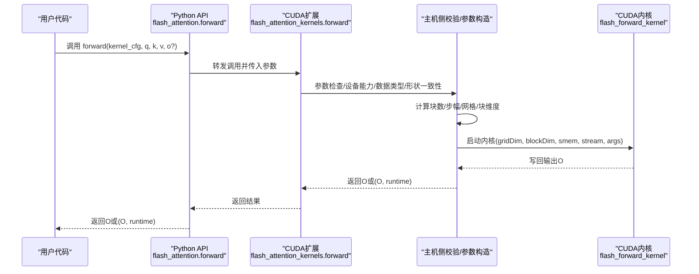
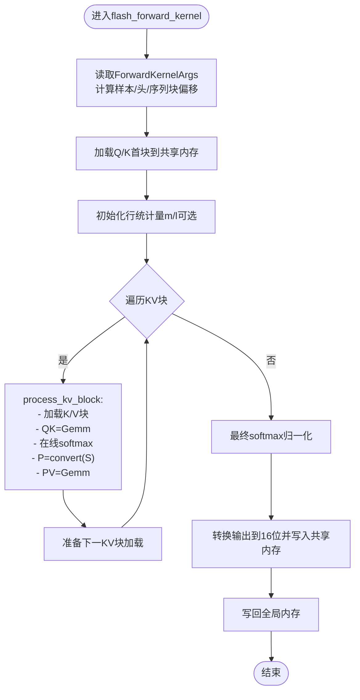
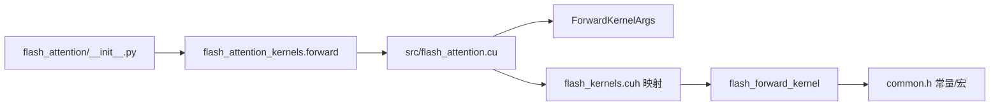

# API参考

<cite>
**本文引用的文件**
- [flash_attention/__init__.py](file://flash_attention/__init__.py)
- [src/flash_attention.cu](file://src/flash_attention.cu)
- [src/include/flash_attention.cuh](file://src/include/flash_attention.cuh)
- [src/include/forward_kernel.cuh](file://src/include/forward_kernel.cuh)
- [src/include/flash_kernels.cuh](file://src/include/flash_kernels.cuh)
- [src/include/common.h](file://src/include/common.h)
- [py/flash_helpers/test/test.py](file://py/flash_helpers/test/test.py)
- [py/flash_helpers/test/utils.py](file://py/flash_helpers/test/utils.py)
- [py/flash_helpers/kernel_configs.py](file://py/flash_helpers/kernel_configs.py)
- [setup.py](file://setup.py)
- [README.md](file://README.md)
</cite>

## 目录
1. [简介](#简介)
2. [项目结构](#项目结构)
3. [核心组件](#核心组件)
4. [架构总览](#架构总览)
5. [详细组件分析](#详细组件分析)
6. [依赖关系分析](#依赖关系分析)
7. [性能考量](#性能考量)
8. [故障排查指南](#故障排查指南)
9. [结论](#结论)
10. [附录](#附录)

## 简介
本API参考面向Python与CUDA两个层面，系统性地文档化了Flash Attention前向计算接口：
- Python API：flash_attention.forward与flash_attention.forward_timed函数的参数、返回值、数据类型与形状约束、异常处理与使用示例。
- CUDA API：flash_forward_kernel内核的函数签名、调用约定、内存布局要求以及ForwardKernelArgs结构体字段语义。

同时，结合内核配置对象FlashForwardKernelConfig，给出常见使用场景与最佳实践，帮助开发者正确集成与优化。

## 项目结构
该仓库采用“Python包装层 + CUDA内核实现”的分层组织：
- Python层：提供用户友好的入口函数，封装底层CUDA扩展调用。
- CUDA层：包含内核实现、内核配置映射、内核参数结构体与通用常量定义。
- 工具与测试：提供内核配置生成、自动调优、基准测试与验证工具。

图表来源
- [flash_attention/__init__.py](file://flash_attention/__init__.py#L1-L18)
- [src/flash_attention.cu](file://src/flash_attention.cu#L1-L150)
- [src/include/flash_attention.cuh](file://src/include/flash_attention.cuh#L1-L110)
- [src/include/forward_kernel.cuh](file://src/include/forward_kernel.cuh#L1-L207)
- [src/include/flash_kernels.cuh](file://src/include/flash_kernels.cuh#L1-L187)
- [src/include/common.h](file://src/include/common.h#L1-L83)
- [py/flash_helpers/test/test.py](file://py/flash_helpers/test/test.py#L1-L104)
- [py/flash_helpers/test/utils.py](file://py/flash_helpers/test/utils.py#L1-L202)
- [py/flash_helpers/kernel_configs.py](file://py/flash_helpers/kernel_configs.py#L1-L486)

章节来源
- [README.md](file://README.md#L1-L63)
- [setup.py](file://setup.py#L1-L76)

## 核心组件
- Python API入口
  - forward(kernel_cfg, q, k, v, o=None)：返回输出张量O。
  - forward_timed(kernel_cfg, q, k, v, o=None)：返回(输出张量O, 运行时ms)二元组。
- CUDA内核
  - flash_forward_kernel：执行注意力前向计算的CUDA内核。
- 内核参数结构体
  - ForwardKernelArgs：描述内核运行所需的指针、步幅、维度与块计数。
- 内核配置
  - FlashForwardKernelConfig：描述内核块大小、线程束数量、异步拷贝、预加载、Swizzle、MMA加载瓦片数、双缓冲、优化softmax等配置项。

章节来源
- [flash_attention/__init__.py](file://flash_attention/__init__.py#L1-L18)
- [src/include/flash_attention.cuh](file://src/include/flash_attention.cuh#L1-L110)
- [src/include/forward_kernel.cuh](file://src/include/forward_kernel.cuh#L1-L207)
- [src/include/flash_kernels.cuh](file://src/include/flash_kernels.cuh#L1-L187)

## 架构总览
下图展示了从Python调用到CUDA内核执行的端到端流程。

图表来源
- [flash_attention/__init__.py](file://flash_attention/__init__.py#L1-L18)
- [src/flash_attention.cu](file://src/flash_attention.cu#L1-L150)
- [src/include/forward_kernel.cuh](file://src/include/forward_kernel.cuh#L1-L207)

## 详细组件分析

### Python API：forward 与 forward_timed
- 函数签名与行为
  - forward(kernel_cfg, q, k, v, o=None) -> torch.Tensor
  - forward_timed(kernel_cfg, q, k, v, o=None) -> (torch.Tensor, float)
- 参数
  - kernel_cfg：内核配置对象，包含dtype、d_head、B_r、B_c、n_warps、async_copy、eager_load_blocks、swizzled、Q/K/V_mma_load_K_tiles、mma_double_buffer_loads、optimized_softmax等字段。
  - q, k, v：形状为[batch, seq_len, n_heads, d_head]的张量；必须在同一CUDA设备上且为同一dtype。
  - o：可选输出张量，若提供则需与q/k/v形状一致且dtype相同。
- 返回值
  - forward：返回输出张量O，形状与q相同。
  - forward_timed：返回(O, runtime_ms)，其中runtime_ms为内核运行时间。
- 数据类型与形状约束
  - 输入dtype：仅支持torch.float16与torch.bfloat16。
  - 形状：q/k/v均为[batch, seq_len, n_heads, d_head]；q与k、v形状完全一致。
  - 步幅：默认按连续内存布局（行主序）排列，内核假设所有张量具有相同的步幅模式。
- 异常处理
  - 设备能力：要求SM_80及以上。
  - 数据类型：若输入dtype不为fp16/bf16或与kernel_cfg不一致，抛出错误。
  - 形状一致性：q/k/v形状必须一致；seq_len需能被B_r与B_c整除。
  - 内核映射：若kernel_cfg未在内核映射表中，抛出错误。
- 使用示例（路径）
  - 基础调用与断言差异：参见 [py/flash_helpers/test/test.py](file://py/flash_helpers/test/test.py#L51-L62)
  - 生成QKV与参考实现：参见 [py/flash_helpers/test/utils.py](file://py/flash_helpers/test/utils.py#L112-L163)
  - 内核配置生成与筛选：参见 [py/flash_helpers/kernel_configs.py](file://py/flash_helpers/kernel_configs.py#L389-L486)

章节来源
- [flash_attention/__init__.py](file://flash_attention/__init__.py#L1-L18)
- [src/flash_attention.cu](file://src/flash_attention.cu#L34-L135)
- [py/flash_helpers/test/test.py](file://py/flash_helpers/test/test.py#L51-L62)
- [py/flash_helpers/test/utils.py](file://py/flash_helpers/test/utils.py#L112-L163)
- [py/flash_helpers/kernel_configs.py](file://py/flash_helpers/kernel_configs.py#L389-L486)

### CUDA API：flash_forward_kernel 与 ForwardKernelArgs
- 内核函数签名
  - 模板内核：flash_forward_kernel<Kernel>(__grid_constant__ const ForwardKernelArgs args)
  - 入口参数：args为ForwardKernelArgs结构体的只读引用。
- 调用约定
  - 网格维度：gridDim = (n_Q_blocks, n_heads, batch_size)，其中n_Q_blocks = ceil_div(seq_len, B_r)，n_KV_blocks = ceil_div(seq_len, B_c)。
  - 块维度：blockDim = n_warps * WARP_SIZE。
  - 动态共享内存：smem_bytes由配置决定，必要时通过cudaFuncSetAttribute设置最大动态共享内存。
  - 流：使用当前CUDA流。
- 内存布局与步幅
  - 行主序：内核假设所有张量为行主序，且batch_stride、seq_stride、head_stride一致。
  - 指针：Q/K/V/O为指向对应元素类型的void指针，按步幅偏移访问。
- ForwardKernelArgs 字段语义
  - Q/K/V/O：输入/输出张量基址指针。
  - batch_stride、seq_stride、head_stride：各维度的内存步幅（以元素为单位）。
  - seq_len、n_heads：序列长度与头数。
  - n_Q_blocks、n_KV_blocks：按B_r与B_c划分的块数。
- 内核内部要点
  - 初始化softmax缩放因子：使用d_head的平方根倒数与换底公式。
  - 分块处理：先加载Q与K的首块，随后循环处理KV块，执行在线softmax与P*V矩阵乘。
  - 输出写回：先写入共享内存再向全局内存进行向量化存储。

图表来源
- [src/include/forward_kernel.cuh](file://src/include/forward_kernel.cuh#L1-L207)
- [src/flash_attention.cu](file://src/flash_attention.cu#L100-L135)

章节来源
- [src/include/forward_kernel.cuh](file://src/include/forward_kernel.cuh#L1-L207)
- [src/include/flash_attention.cuh](file://src/include/flash_attention.cuh#L1-L110)
- [src/flash_attention.cu](file://src/flash_attention.cu#L100-L135)

### 内核配置对象：FlashForwardKernelConfig
- 字段含义（来自Python侧数据类）
  - dtype：输入数据类型（DType.FP16/BF16）。
  - d_head：每头维度（固定128）。
  - B_r、B_c：Q与KV序列分块大小。
  - n_warps：每CTA使用的线程束数。
  - async_copy、eager_load_blocks、swizzled：异步拷贝、预加载、Swizzle开关。
  - Q_mma_load_K_tiles、K_mma_load_K_tiles、V_mma_load_K_tiles：Q/K/V参与GEMM的K瓦片加载数。
  - mma_double_buffer_loads：MMA双缓冲加载开关。
  - optimized_softmax：是否启用优化softmax。
- 配置生成与筛选
  - 支持按“内核演进路径”与“自动调优参数空间”生成配置集合。
  - 提供短格式字符串表示，便于日志与调试。

章节来源
- [py/flash_helpers/kernel_configs.py](file://py/flash_helpers/kernel_configs.py#L106-L175)
- [py/flash_helpers/kernel_configs.py](file://py/flash_helpers/kernel_configs.py#L389-L486)

## 依赖关系分析
- Python层依赖
  - flash_attention_kernels模块：由CUDAExtension编译生成，提供forward函数。
  - torch：用于张量、设备、dtype与CUDA上下文管理。
- CUDA层依赖
  - PyBind绑定：将C++函数暴露为Python可调用。
  - 内核映射：根据FlashForwardKernelConfig选择具体实例化模板。
  - 常量与宏：统一的WARP_SIZE、向量化访问、寄存器/共享内存布局等。

图表来源
- [flash_attention/__init__.py](file://flash_attention/__init__.py#L1-L18)
- [src/flash_attention.cu](file://src/flash_attention.cu#L137-L150)
- [src/include/flash_kernels.cuh](file://src/include/flash_kernels.cuh#L1-L187)
- [src/include/forward_kernel.cuh](file://src/include/forward_kernel.cuh#L1-L207)
- [src/include/common.h](file://src/include/common.h#L1-L83)

章节来源
- [setup.py](file://setup.py#L45-L76)
- [src/flash_attention.cu](file://src/flash_attention.cu#L137-L150)

## 性能考量
- 计算能力要求：仅支持SM_80及以上（A100、RTX 3090/4090等）。
- 内核动态共享内存：当配置所需共享内存超过阈值时，会设置最大动态共享内存属性。
- 块大小与线程束：B_r/B_c与n_warps影响吞吐与寄存器占用，应结合设备资源与数据规模选择。
- 异步拷贝与预加载：开启async_copy与eager_load_blocks通常提升带宽利用率。
- Swizzle与MMA双缓冲：有助于减少访存冲突与提高计算-访存重叠度。
- 精度与缩放：内核使用fp32中间计算与d_head的平方根倒数缩放，保证数值稳定与精度。

章节来源
- [src/flash_attention.cu](file://src/flash_attention.cu#L42-L83)
- [src/flash_attention.cu](file://src/flash_attention.cu#L117-L149)
- [src/include/forward_kernel.cuh](file://src/include/forward_kernel.cuh#L149-L198)
- [README.md](file://README.md#L1-L63)

## 故障排查指南
- 设备能力不足
  - 现象：抛出“需要SM_80或更高”的错误。
  - 处理：确认GPU计算能力满足要求。
- 数据类型不匹配
  - 现象：输入dtype非fp16/bf16或与kernel_cfg不一致。
  - 处理：统一输入dtype为fp16或bf16，并确保kernel_cfg.dtype与输入一致。
- 形状不一致或不可整除
  - 现象：q/k/v形状不一致，或seq_len不能被B_r/B_c整除。
  - 处理：确保q/k/v形状一致，且seq_len能被B_r与B_c整除。
- 内核映射缺失
  - 现象：kernel_cfg不在映射表中。
  - 处理：使用已生成的kernel_cfg，或检查配置是否在映射表中。
- 输出张量不匹配
  - 现象：提供o但其dtype或形状与输入不一致。
  - 处理：确保o.dtype与输入一致且形状匹配。

章节来源
- [src/flash_attention.cu](file://src/flash_attention.cu#L42-L83)
- [src/flash_attention.cu](file://src/flash_attention.cu#L88-L109)

## 结论
本API参考覆盖了从Python到CUDA的完整接口链路，明确了参数约束、异常处理与典型使用场景。通过合理的内核配置与内存布局，可在目标硬件上获得接近官方实现的性能表现。建议在生产环境中优先使用已验证的kernel_cfg集合，并结合设备能力与数据规模进行微调。

## 附录

### Python API 参数与返回值速查
- 函数
  - forward(kernel_cfg, q, k, v, o=None) -> torch.Tensor
  - forward_timed(kernel_cfg, q, k, v, o=None) -> (torch.Tensor, float)
- 参数
  - kernel_cfg：包含dtype、d_head、B_r、B_c、n_warps、async_copy、eager_load_blocks、swizzled、Q/K/V_mma_load_K_tiles、mma_double_buffer_loads、optimized_softmax。
  - q/k/v：[batch, seq_len, n_heads, d_head]，dtype为fp16或bf16。
  - o：可选，形状与q一致，dtype与q一致。
- 返回
  - forward：输出张量O。
  - forward_timed：(O, runtime_ms)。
- 异常
  - 设备能力不足、dtype不支持、形状不一致、内核映射缺失、输出张量不匹配。

章节来源
- [flash_attention/__init__.py](file://flash_attention/__init__.py#L1-L18)
- [src/flash_attention.cu](file://src/flash_attention.cu#L34-L135)
- [py/flash_helpers/test/test.py](file://py/flash_helpers/test/test.py#L51-L62)

### CUDA 内核参数结构体字段速查
- ForwardKernelArgs
  - Q/K/V/O：输入/输出张量基址指针。
  - batch_stride、seq_stride、head_stride：各维度步幅（元素数）。
  - seq_len、n_heads：序列长度与头数。
  - n_Q_blocks、n_KV_blocks：按B_r与B_c划分的块数。

章节来源
- [src/include/flash_attention.cuh](file://src/include/flash_attention.cuh#L1-L110)

### 使用场景与示例（路径）
- 标准调用与差异对比
  - 参考：[py/flash_helpers/test/test.py](file://py/flash_helpers/test/test.py#L51-L62)
- 生成QKV与参考实现（einsum）
  - 参考：[py/flash_helpers/test/utils.py](file://py/flash_helpers/test/utils.py#L112-L163)
- 内核配置生成与筛选
  - 参考：[py/flash_helpers/kernel_configs.py](file://py/flash_helpers/kernel_configs.py#L389-L486)
- 安装与构建
  - 参考：[setup.py](file://setup.py#L45-L76)