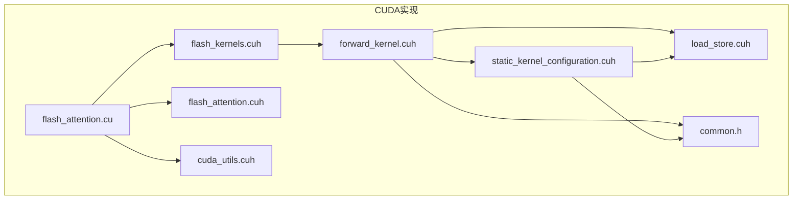
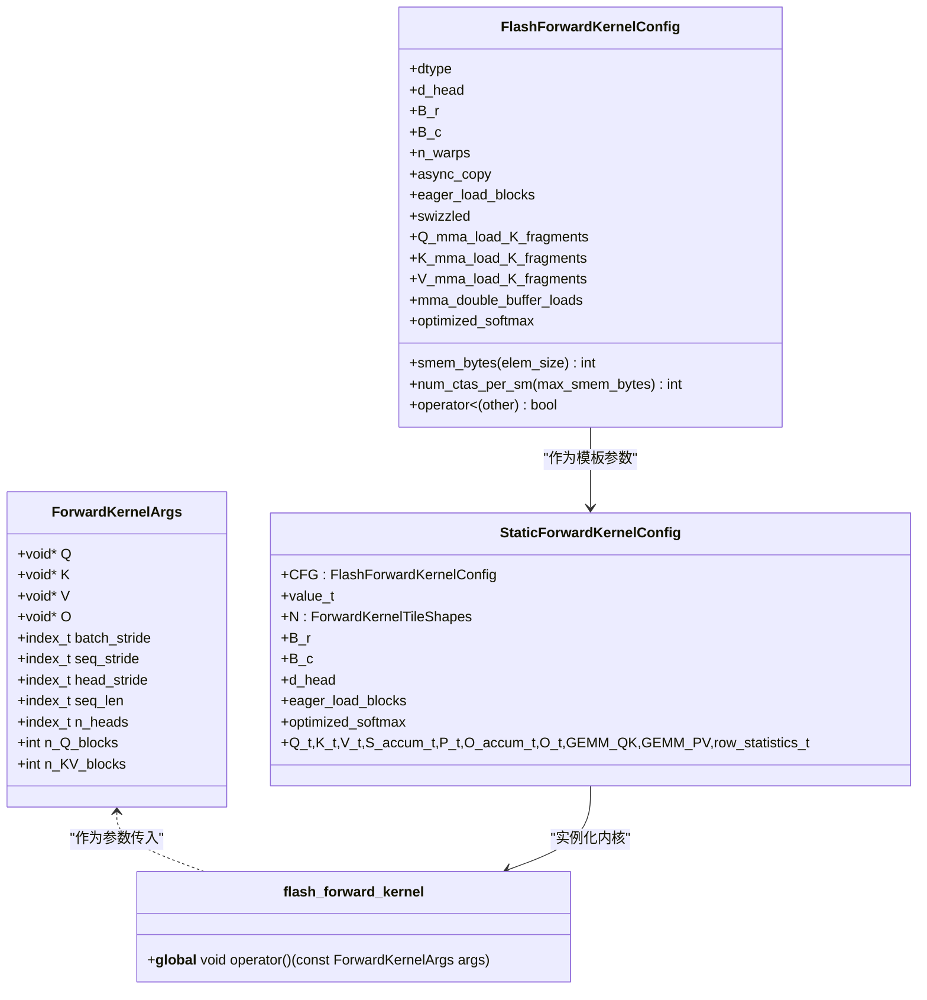
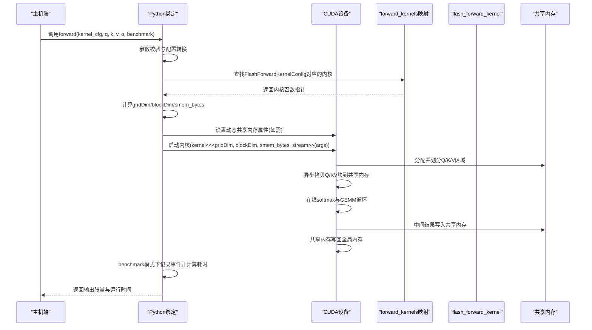
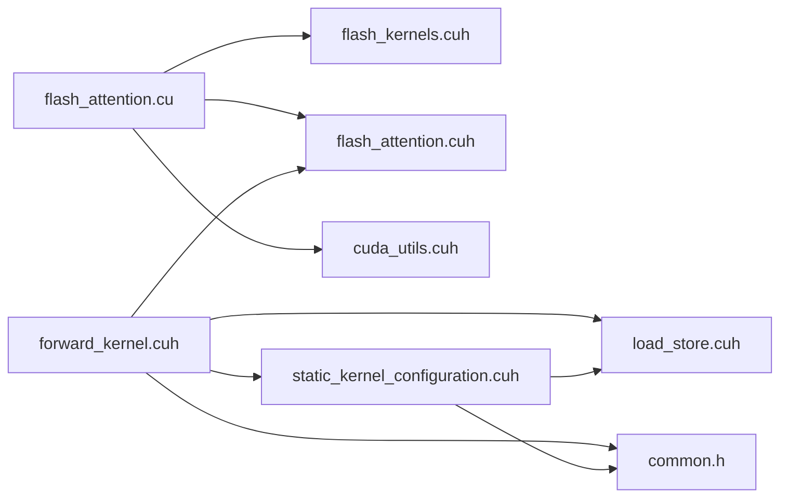

# CUDA API

<cite>
**本文引用的文件**
- [flash_kernels.cuh](file://src/include/flash_kernels.cuh)
- [forward_kernel.cuh](file://src/include/forward_kernel.cuh)
- [flash_attention.cuh](file://src/include/flash_attention.cuh)
- [flash_attention.cu](file://src/flash_attention.cu)
- [static_kernel_configuration.cuh](file://src/include/static_kernel_configuration.cuh)
- [load_store.cuh](file://src/include/load_store.cuh)
- [common.h](file://src/include/common.h)
- [cuda_utils.cuh](file://src/include/cuda_utils.cuh)
</cite>

## 目录
1. [简介](#简介)
2. [项目结构](#项目结构)
3. [核心组件](#核心组件)
4. [架构总览](#架构总览)
5. [详细组件分析](#详细组件分析)
6. [依赖关系分析](#依赖关系分析)
7. [性能考量](#性能考量)
8. [故障排查指南](#故障排查指南)
9. [结论](#结论)
10. [附录](#附录)

## 简介
本文件面向需要深入理解CUDA层Flash Attention前向内核实现的开发者，聚焦于flash_forward_kernel内核函数及其调用机制。内容涵盖：
- ForwardKernelArgs结构体各字段的含义与用途（Q/K/V/O指针、stride信息、序列长度、头数、Q块与KV块数量）
- 内核启动配置（gridDim与blockDim）的计算方式
- 共享内存大小（smem_bytes）的确定逻辑
- flash_kernels.cuh中forward_kernels映射表的作用及如何依据FlashForwardKernelConfig查找对应实例化内核
- 动态共享内存属性设置（cudaFuncSetAttribute）对大共享内存内核的支持
- 完整的内核调用流程示例（参数准备、流管理、事件计时）

## 项目结构
该仓库采用“头文件定义 + CUDA源文件实现”的组织方式，核心CUDA实现位于src目录下，包含：
- include目录：内核配置、数据布局、加载存储、通用常量等头文件
- flash_attention.cu：Python绑定入口、内核选择与启动、事件计时、动态共享内存属性设置

图表来源
- [flash_attention.cu](file://src/flash_attention.cu#L1-L150)
- [flash_kernels.cuh](file://src/include/flash_kernels.cuh#L1-L187)
- [forward_kernel.cuh](file://src/include/forward_kernel.cuh#L1-L207)
- [flash_attention.cuh](file://src/include/flash_attention.cuh#L1-L110)
- [static_kernel_configuration.cuh](file://src/include/static_kernel_configuration.cuh#L1-L294)
- [load_store.cuh](file://src/include/load_store.cuh#L1-L200)
- [common.h](file://src/include/common.h#L1-L83)
- [cuda_utils.cuh](file://src/include/cuda_utils.cuh#L29-L48)

章节来源
- [flash_attention.cu](file://src/flash_attention.cu#L1-L150)
- [flash_kernels.cuh](file://src/include/flash_kernels.cuh#L1-L187)
- [forward_kernel.cuh](file://src/include/forward_kernel.cuh#L1-L207)
- [flash_attention.cuh](file://src/include/flash_attention.cuh#L1-L110)
- [static_kernel_configuration.cuh](file://src/include/static_kernel_configuration.cuh#L1-L294)
- [load_store.cuh](file://src/include/load_store.cuh#L1-L200)
- [common.h](file://src/include/common.h#L1-L83)
- [cuda_utils.cuh](file://src/include/cuda_utils.cuh#L29-L48)

## 核心组件
- ForwardKernelArgs：内核参数容器，承载输入输出指针与张量布局stride、序列长度、头数、Q块与KV块数量等
- FlashForwardKernelConfig：内核配置键，包含数据类型、维度、块尺寸、线程束数、异步拷贝、预加载、swizzle、mma双缓冲、优化softmax等
- flash_forward_kernel：前向注意力内核，基于模板实例化配置，执行QK与PV两阶段GEMM、在线softmax与归一化、结果写回
- forward_kernels映射表：以配置为键，映射到具体实例化后的内核函数指针
- flash_attention_forward：Python绑定入口，负责参数校验、内核选择、gridDim/blockDim/smem_bytes计算、流与事件管理、动态共享内存属性设置

章节来源
- [flash_attention.cuh](file://src/include/flash_attention.cuh#L1-L110)
- [flash_kernels.cuh](file://src/include/flash_kernels.cuh#L1-L187)
- [forward_kernel.cuh](file://src/include/forward_kernel.cuh#L85-L205)
- [flash_attention.cu](file://src/flash_attention.cu#L34-L150)

## 架构总览
下面的类图展示了内核配置、静态配置、内核参数与内核之间的关系。

图表来源
- [flash_attention.cuh](file://src/include/flash_attention.cuh#L1-L110)
- [static_kernel_configuration.cuh](file://src/include/static_kernel_configuration.cuh#L104-L294)
- [forward_kernel.cuh](file://src/include/forward_kernel.cuh#L85-L205)

## 详细组件分析

### ForwardKernelArgs结构体字段详解
- 指针字段
  - Q/K/V/O：分别指向查询、键、值、输出张量的设备内存起始地址
- stride信息
  - batch_stride、head_stride、seq_stride：按批、头、序列维的内存步长，用于在多维张量中定位块偏移
- 序列与头信息
  - seq_len：序列长度
  - n_heads：头数
- 块数量
  - n_Q_blocks：Q分块数量（seq_len/B_r）
  - n_KV_blocks：KV分块数量（seq_len/B_c）

这些字段共同决定内核的gridDim与块内偏移计算，以及张量访问的全局索引。

章节来源
- [flash_attention.cuh](file://src/include/flash_attention.cuh#L8-L27)

### 内核启动配置（gridDim与blockDim）计算
- blockDim
  - 由配置中的n_warps与WARP_SIZE决定：blockDim.x = n_warps × WARP_SIZE
- gridDim
  - 三维网格：[n_Q_blocks, n_heads, batch_size]
  - blockIdx.x对应Q序列块，blockIdx.y对应头，blockIdx.z对应批次
- n_Q_blocks与n_KV_blocks
  - n_Q_blocks = ceil_div(seq_len, B_r)
  - n_KV_blocks = ceil_div(seq_len, B_c)

上述配置确保每个CTA覆盖一个样本、一个头、一个Q序列块的计算。

章节来源
- [flash_attention.cu](file://src/flash_attention.cu#L100-L113)

### 共享内存大小（smem_bytes）确定逻辑
- FlashForwardKernelConfig提供smem_bytes(elem_size)方法，返回共享内存字节数
- 计算公式：(B_r + B_c × 2) × d_head × elem_size
  - 解释：Q占用B_r×d_head空间；K与V各占用B_c×d_head空间；elem_size为元素字节数（默认2）
- flash_attention.cu在启动内核时使用cfg.smem_bytes()作为动态共享内存字节数
- 对于超过48KB的动态共享内存需求，模块初始化时通过cudaFuncSetAttribute设置最大动态共享内存

章节来源
- [flash_attention.cuh](file://src/include/flash_attention.cuh#L54-L56)
- [flash_attention.cu](file://src/flash_attention.cu#L117-L149)

### forward_kernels映射表的作用与查找机制
- 映射表以FlashForwardKernelConfig为键，以内核函数指针为值
- 通过py_to_cpp_kernel_config从Python侧传入的配置转换为C++配置对象
- 使用forward_kernels.contains检查配置是否存在，不存在则报错
- 若存在，则取forward_kernels[cfg]得到具体实例化内核函数指针

章节来源
- [flash_kernels.cuh](file://src/include/flash_kernels.cuh#L12-L186)
- [flash_attention.cu](file://src/flash_attention.cu#L16-L32)
- [flash_attention.cu](file://src/flash_attention.cu#L58-L66)

### 动态共享内存属性设置（cudaFuncSetAttribute）
- 在模块初始化时遍历forward_kernels映射，对smem_used > 48KB的内核调用cudaFuncSetAttribute设置MaxDynamicSharedMemorySize
- 这样可以支持大于默认opt-in共享内存限制的大内核

章节来源
- [flash_attention.cu](file://src/flash_attention.cu#L142-L149)

### flash_forward_kernel内核处理流程
- 参数解析
  - 从__grid_constant__ ForwardKernelArgs读取Q/K/V/O指针与stride、seq_len、n_heads、n_Q_blocks、n_KV_blocks
  - 计算当前样本、头、Q序列块对应的全局偏移
- 共享内存布局
  - 将共享内存划分为Q、K、V三段，分别放置对应块
- 异步拷贝与同步
  - 启动Q与最后一个KV块的异步拷贝，并commit
  - 根据配置决定是否预加载K/V块
  - 在需要时等待并同步，保证后续计算安全
- 在线softmax与GEMM
  - 首次迭代初始化统计量m、l
  - 对每个KV块执行：QK矩阵乘法、在线softmax更新、S转P、PV矩阵乘法累加
- 结果写回
  - 最终对O进行归一化
  - 将累加器转换为16位并先写入共享内存，再统一写回全局内存

图表来源
- [flash_attention.cu](file://src/flash_attention.cu#L34-L150)
- [flash_kernels.cuh](file://src/include/flash_kernels.cuh#L12-L186)
- [forward_kernel.cuh](file://src/include/forward_kernel.cuh#L85-L205)

章节来源
- [forward_kernel.cuh](file://src/include/forward_kernel.cuh#L85-L205)
- [flash_attention.cu](file://src/flash_attention.cu#L100-L135)

### 内核内部数据流与内存访问
- 加载/存储配置
  - load_store.cuh定义了GSMemLdstConfig、SRMemLdstConfig等布局与步幅配置
  - 支持swizzle、向量化访问、warp级独立加载/存储等
- 静态内核配置
  - static_kernel_configuration.cuh将FlashForwardKernelConfig映射为具体的张量类型、GEMM算子、寄存器/共享内存布局等
- 常量与宏
  - common.h定义了WARP_SIZE、LDMATRIX相关常量、向量化宽度等

章节来源
- [load_store.cuh](file://src/include/load_store.cuh#L1-L200)
- [static_kernel_configuration.cuh](file://src/include/static_kernel_configuration.cuh#L1-L294)
- [common.h](file://src/include/common.h#L1-L83)

## 依赖关系分析
- 头文件依赖
  - flash_attention.cu依赖flash_kernels.cuh、flash_attention.cuh、cuda_utils.cuh
  - forward_kernel.cuh依赖flash_attention.cuh、static_kernel_configuration.cuh、load_store.cuh、common.h等
  - static_kernel_configuration.cuh依赖common.h、load_store.cuh等
- 运行时依赖
  - Python绑定通过pybind11导出forward接口
  - CUDA运行时负责流、事件、共享内存属性设置

图表来源
- [flash_attention.cu](file://src/flash_attention.cu#L1-L150)
- [forward_kernel.cuh](file://src/include/forward_kernel.cuh#L1-L207)
- [flash_kernels.cuh](file://src/include/flash_kernels.cuh#L1-L187)
- [flash_attention.cuh](file://src/include/flash_attention.cuh#L1-L110)
- [static_kernel_configuration.cuh](file://src/include/static_kernel_configuration.cuh#L1-L294)
- [load_store.cuh](file://src/include/load_store.cuh#L1-L200)
- [common.h](file://src/include/common.h#L1-L83)
- [cuda_utils.cuh](file://src/include/cuda_utils.cuh#L29-L48)

章节来源
- [flash_attention.cu](file://src/flash_attention.cu#L1-L150)
- [forward_kernel.cuh](file://src/include/forward_kernel.cuh#L1-L207)
- [flash_kernels.cuh](file://src/include/flash_kernels.cuh#L1-L187)
- [flash_attention.cuh](file://src/include/flash_attention.cuh#L1-L110)
- [static_kernel_configuration.cuh](file://src/include/static_kernel_configuration.cuh#L1-L294)
- [load_store.cuh](file://src/include/load_store.cuh#L1-L200)
- [common.h](file://src/include/common.h#L1-L83)
- [cuda_utils.cuh](file://src/include/cuda_utils.cuh#L29-L48)

## 性能考量
- 块尺寸与线程束数
  - B_r、B_c、n_warps影响每CTA覆盖的序列行数与KV块数，进而影响吞吐与寄存器/共享内存占用
- 异步拷贝与预加载
  - async_copy与eager_load_blocks可减少流水线停顿，但会增加共享内存占用
- swizzle与向量化
  - swizzled布局与128位向量访问提升带宽利用率
- 动态共享内存上限
  - 对于smem_used > 48KB的内核，必须设置MaxDynamicSharedMemorySize以避免启动失败

章节来源
- [flash_attention.cuh](file://src/include/flash_attention.cuh#L34-L109)
- [flash_attention.cu](file://src/flash_attention.cu#L117-L149)
- [load_store.cuh](file://src/include/load_store.cuh#L1-L200)

## 故障排查指南
- 内核配置未找到
  - 现象：forward_kernels.contains(cfg)为假
  - 排查：确认Python侧传入的kernel_cfg与生成的实例化配置一致
- 数据类型不匹配
  - 现象：cfg.dtype与输入张量dtype不一致
  - 排查：确保Q/K/V均为fp16或bf16且一致
- 序列长度不满足块对齐
  - 现象：seq_len % B_r != 0 或 seq_len % B_c != 0
  - 排查：调整B_r或B_c，或对序列长度做padding
- 设备能力不足
  - 现象：compute_capability < 80
  - 排查：升级GPU至SM_80及以上
- 共享内存不足
  - 现象：内核启动失败或性能异常
  - 排查：确认已设置MaxDynamicSharedMemorySize且小于设备限制

章节来源
- [flash_attention.cu](file://src/flash_attention.cu#L42-L66)
- [flash_attention.cu](file://src/flash_attention.cu#L77-L83)
- [flash_attention.cu](file://src/flash_attention.cu#L142-L149)
- [cuda_utils.cuh](file://src/include/cuda_utils.cuh#L29-L48)

## 结论
本文系统梳理了Flash Attention前向内核在CUDA层的实现要点，重点围绕flash_forward_kernel内核与其调用链路展开，明确了ForwardKernelArgs字段语义、gridDim/blockDim与smem_bytes的计算方式、forward_kernels映射表的查找机制、动态共享内存属性设置策略，并提供了完整的内核调用流程示例。对于开发者而言，理解这些机制有助于在不同硬件与数据规模下选择合适的内核配置，获得最佳性能与稳定性。

## 附录
- 关键路径参考
  - 内核参数结构体定义：[flash_attention.cuh](file://src/include/flash_attention.cuh#L8-L27)
  - 内核配置结构体与共享内存计算：[flash_attention.cuh](file://src/include/flash_attention.cuh#L34-L66)
  - 实例化内核映射表：[flash_kernels.cuh](file://src/include/flash_kernels.cuh#L12-L186)
  - 前向内核实现：[forward_kernel.cuh](file://src/include/forward_kernel.cuh#L85-L205)
  - 内核启动与动态共享内存设置：[flash_attention.cu](file://src/flash_attention.cu#L100-L149)
  - 加载/存储配置与布局：[load_store.cuh](file://src/include/load_store.cuh#L1-L200)
  - 静态内核配置与张量类型映射：[static_kernel_configuration.cuh](file://src/include/static_kernel_configuration.cuh#L104-L294)
  - 常量与宏定义：[common.h](file://src/include/common.h#L1-L83)
  - 设备属性工具函数：[cuda_utils.cuh](file://src/include/cuda_utils.cuh#L29-L48)