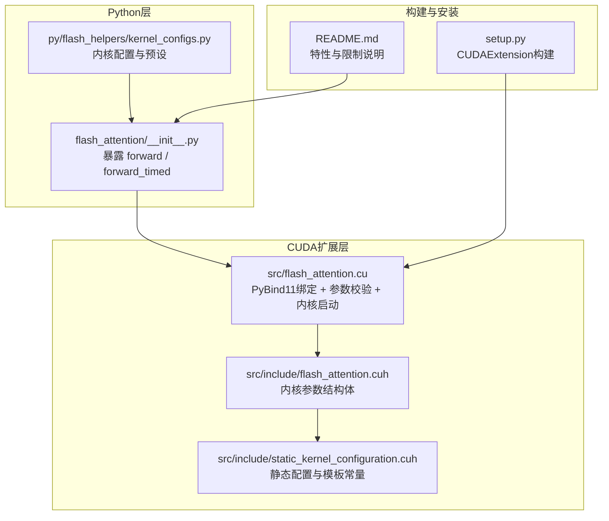
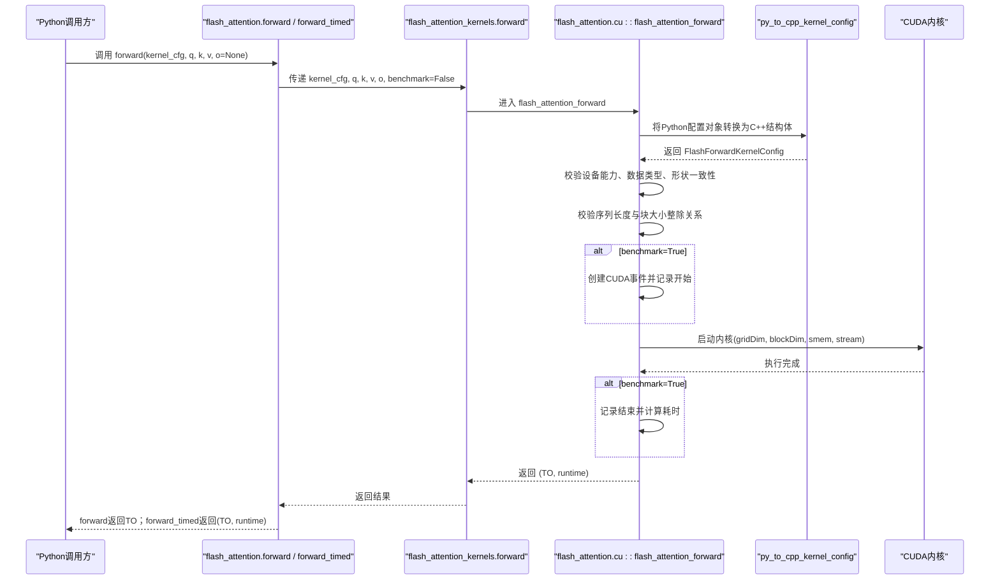
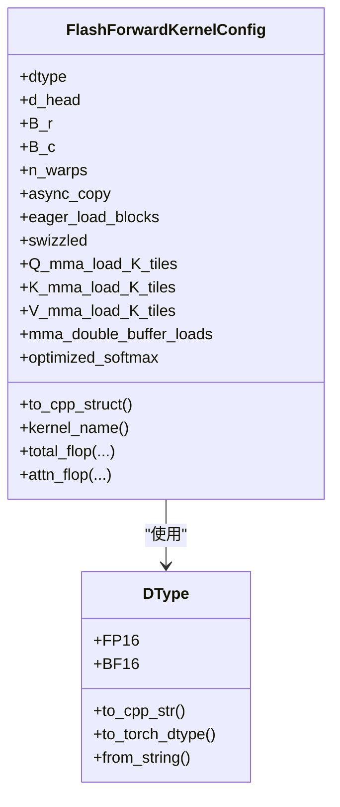
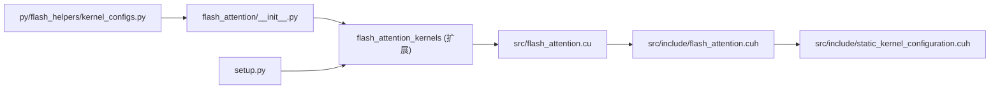

# Python API

<cite>
**本文引用的文件**
- [flash_attention/__init__.py](file://flash_attention/__init__.py)
- [src/flash_attention.cu](file://src/flash_attention.cu)
- [src/include/flash_attention.cuh](file://src/include/flash_attention.cuh)
- [src/include/static_kernel_configuration.cuh](file://src/include/static_kernel_configuration.cuh)
- [py/flash_helpers/kernel_configs.py](file://py/flash_helpers/kernel_configs.py)
- [setup.py](file://setup.py)
- [README.md](file://README.md)
- [py/flash_helpers/test/test.py](file://py/flash_helpers/test/test.py)
- [py/flash_helpers/test/utils.py](file://py/flash_helpers/test/utils.py)
</cite>

## 目录
1. [简介](#简介)
2. [项目结构](#项目结构)
3. [核心组件](#核心组件)
4. [架构总览](#架构总览)
5. [详细组件分析](#详细组件分析)
6. [依赖关系分析](#依赖关系分析)
7. [性能考量](#性能考量)
8. [故障排查指南](#故障排查指南)
9. [结论](#结论)
10. [附录](#附录)

## 简介
本文件面向Python用户，系统性地文档化flash_attention模块的Python API，重点覆盖两个函数：
- forward：执行前向注意力计算，返回输出张量
- forward_timed：在benchmark模式下运行，返回输出张量与执行时间

文档将解释参数语义（kernel_cfg、q/k/v输入张量、可选输出张量o、benchmark模式），参数验证逻辑（数据类型、形状、块大小整除约束），以及Python配置对象到C++结构体的转换流程，并给出基于flash_helpers.kernel_configs的使用示例路径与最佳实践。

## 项目结构
该仓库采用“Python包装层 + CUDA扩展内核”的分层设计：
- Python层：提供flash_attention.forward/forward_timed接口，封装对底层CUDA扩展的调用
- CUDA扩展层：实现Flash Attention前向内核，负责参数校验、调度、事件计时与内核启动
- 配置工具层：提供内核配置对象与预设配置生成器，便于选择不同块大小、线程束、加载策略等

图表来源
- [flash_attention/__init__.py](file://flash_attention/__init__.py#L1-L18)
- [src/flash_attention.cu](file://src/flash_attention.cu#L1-L150)
- [src/include/flash_attention.cuh](file://src/include/flash_attention.cuh#L1-L110)
- [src/include/static_kernel_configuration.cuh](file://src/include/static_kernel_configuration.cuh#L1-L294)
- [py/flash_helpers/kernel_configs.py](file://py/flash_helpers/kernel_configs.py#L1-L486)
- [setup.py](file://setup.py#L1-L76)
- [README.md](file://README.md#L1-L63)

章节来源
- [README.md](file://README.md#L1-L63)
- [setup.py](file://setup.py#L1-L76)

## 核心组件
- Python API入口：位于flash_attention/__init__.py，导出forward与forward_timed两个函数，分别对应非benchmark与benchmark模式的调用
- CUDA扩展绑定：位于src/flash_attention.cu，完成Python配置对象到C++结构体的转换、输入校验、内核启动与可选计时
- 内核参数结构体：位于src/include/flash_attention.cuh，定义ForwardKernelArgs与FlashForwardKernelConfig
- 静态配置与模板常量：位于src/include/static_kernel_configuration.cuh，用于编译期常量推导与tile形状计算
- 配置生成器：位于py/flash_helpers/kernel_configs.py，提供DType枚举、FlashForwardKernelConfig数据类、短形式字符串、C++结构体映射、自动调优与进度配置集合等

章节来源
- [flash_attention/__init__.py](file://flash_attention/__init__.py#L1-L18)
- [src/flash_attention.cu](file://src/flash_attention.cu#L1-L150)
- [src/include/flash_attention.cuh](file://src/include/flash_attention.cuh#L1-L110)
- [src/include/static_kernel_configuration.cuh](file://src/include/static_kernel_configuration.cuh#L1-L294)
- [py/flash_helpers/kernel_configs.py](file://py/flash_helpers/kernel_configs.py#L1-L486)

## 架构总览
下面的序列图展示了从Python调用到CUDA内核执行的关键流程，包括参数验证、benchmark计时与返回值处理。

图表来源
- [flash_attention/__init__.py](file://flash_attention/__init__.py#L1-L18)
- [src/flash_attention.cu](file://src/flash_attention.cu#L1-L150)
- [py/flash_helpers/kernel_configs.py](file://py/flash_helpers/kernel_configs.py#L1-L486)

## 详细组件分析

### Python API：forward 与 forward_timed
- 函数签名与行为
  - forward：接收kernel_cfg、q、k、v、可选o，benchmark=False，返回输出张量
  - forward_timed：接收相同参数，benchmark=True，返回(输出张量, 执行时间)
- 返回值差异
  - forward仅返回输出张量
  - forward_timed额外返回一次内核执行的耗时（毫秒）
- 使用场景
  - 性能基准：使用forward_timed获取内核耗时
  - 正常推理：使用forward获得纯输出

章节来源
- [flash_attention/__init__.py](file://flash_attention/__init__.py#L1-L18)

### 参数与数据类型约束
- kernel_cfg（内核配置对象）
  - 类型：Python侧应为FlashForwardKernelConfig实例
  - 字段含义（节选）：dtype（数据类型）、d_head（头维度）、B_r/B_c（行/列块大小）、n_warps（线程束数）、async_copy/eager_load_blocks/swizzled、Q/K/V_mma_load_K_tiles、mma_double_buffer_loads、optimized_softmax
  - 作用：决定内核块形状、加载策略、寄存器/共享内存占用与动态共享内存需求
- q/k/v 输入张量
  - 数据类型：仅支持fp16/bf16
  - 形状：[batch_size, seq_len, n_heads, d_head]
  - 设备：需在CUDA设备上
- o（可选输出张量）
  - 若提供，其dtype与输入一致，且形状与q/k/v一致
  - 若不提供，将按q的形状与dtype创建新张量作为输出
- benchmark模式
  - True时启用CUDA事件计时，返回耗时；False时不计时

章节来源
- [src/flash_attention.cu](file://src/flash_attention.cu#L1-L150)
- [src/include/flash_attention.cuh](file://src/include/flash_attention.cuh#L1-L110)
- [py/flash_helpers/kernel_configs.py](file://py/flash_helpers/kernel_configs.py#L1-L486)

### 参数验证逻辑
- 设备与架构
  - 检查GPU计算能力是否满足要求（当前实现要求SM_80或更高）
- 数据类型
  - q/k/v必须为fp16或bf16
  - q/k/v与kernel_cfg中的dtype需一致
- 张量形状
  - q/k/v形状完全一致
  - 输出张量（若提供）dtype与输入一致，形状与q一致
- 序列长度与块大小
  - seq_len必须是B_r的倍数
  - seq_len必须是B_c的倍数
- 共享内存与内核可用性
  - kernel_cfg需存在于内核映射中
  - 对于动态共享内存超过阈值的内核，会设置最大动态共享内存属性

章节来源
- [src/flash_attention.cu](file://src/flash_attention.cu#L1-L150)

### Python配置对象到C++结构体的转换
- Python侧
  - FlashForwardKernelConfig提供to_cpp_struct方法，将字段序列化为C++结构体字面量字符串
  - DType提供to_torch_dtype与to_cpp_str，用于类型映射
- CUDA侧
  - py_to_cpp_kernel_config将Python对象的属性逐一提取并构造C++结构体
  - 该结构体随后用于查找已实例化的内核并进行参数校验

图表来源
- [py/flash_helpers/kernel_configs.py](file://py/flash_helpers/kernel_configs.py#L1-L486)

章节来源
- [py/flash_helpers/kernel_configs.py](file://py/flash_helpers/kernel_configs.py#L1-L486)
- [src/flash_attention.cu](file://src/flash_attention.cu#L1-L150)

### 内核启动与计时
- 启动参数
  - gridDim由batch_size、n_heads、n_Q_blocks决定
  - blockDim由n_warps与WARP_SIZE决定
  - 动态共享内存根据cfg.smem_bytes()设置
- 计时逻辑
  - benchmark=True时，使用CUDA事件记录开始/结束并计算耗时（毫秒）
  - benchmark=False时，直接返回输出张量

章节来源
- [src/flash_attention.cu](file://src/flash_attention.cu#L1-L150)

### 实际使用示例（基于配置生成器）
以下示例展示如何通过flash_helpers.kernel_configs获取预定义配置并调用API（示例路径，不包含具体代码内容）：
- 获取内核配置集合
  - 参考路径：py/flash_helpers/kernel_configs.py 中的 get_kernels_to_build / get_kernel_progression_configs / get_autotuning_kernel_configs
- 选择配置
  - 参考路径：py/flash_helpers/kernel_configs.py 中的 get_kernel_configs，支持通过环境变量选择进度/全集/自动调优等
- 构造输入张量
  - 参考路径：py/flash_helpers/test/utils.py 中的 generate_qkv/generate_qkvo，生成符合形状要求的q/k/v/o
- 调用API
  - forward：参考路径 flash_attention/__init__.py 的 forward函数
  - forward_timed：参考路径 flash_attention/__init__.py 的 forward_timed函数
- 基准测试对比
  - 参考路径：py/flash_helpers/test/test.py 中的测试用例，验证与参考实现的一致性

章节来源
- [py/flash_helpers/kernel_configs.py](file://py/flash_helpers/kernel_configs.py#L1-L486)
- [py/flash_helpers/test/utils.py](file://py/flash_helpers/test/utils.py#L1-L202)
- [flash_attention/__init__.py](file://flash_attention/__init__.py#L1-L18)
- [py/flash_helpers/test/test.py](file://py/flash_helpers/test/test.py#L1-L104)

## 依赖关系分析
- Python层依赖
  - flash_attention模块依赖flash_attention_kernels扩展提供的forward函数
  - 配置生成器依赖itertools、dataclasses、enum等标准库
- CUDA扩展依赖
  - 依赖头文件定义的结构体与静态配置模板
  - 通过PyBind11导出forward函数给Python调用
- 构建与安装
  - setup.py使用CUDAExtension编译src/flash_attention.cu，指定include目录与NVCC编译参数

图表来源
- [flash_attention/__init__.py](file://flash_attention/__init__.py#L1-L18)
- [src/flash_attention.cu](file://src/flash_attention.cu#L1-L150)
- [src/include/flash_attention.cuh](file://src/include/flash_attention.cuh#L1-L110)
- [src/include/static_kernel_configuration.cuh](file://src/include/static_kernel_configuration.cuh#L1-L294)
- [py/flash_helpers/kernel_configs.py](file://py/flash_helpers/kernel_configs.py#L1-L486)
- [setup.py](file://setup.py#L1-L76)

章节来源
- [setup.py](file://setup.py#L1-L76)

## 性能考量
- 块大小与整除性
  - seq_len需同时被B_r与B_c整除，否则会触发校验失败
- 线程束与共享内存
  - n_warps与B_r/B_c影响gridDim与共享内存占用，进而影响并发度与吞吐
- 加载策略
  - async_copy/eager_load_blocks/swizzled、Q/K/V_mma_load_K_tiles、mma_double_buffer_loads、optimized_softmax等配置直接影响访存与计算重叠程度
- 动态共享内存
  - 对于smem使用超过阈值的内核，会显式设置最大动态共享内存属性，避免内核启动失败

章节来源
- [src/flash_attention.cu](file://src/flash_attention.cu#L1-L150)
- [src/include/flash_attention.cuh](file://src/include/flash_attention.cuh#L1-L110)
- [src/include/static_kernel_configuration.cuh](file://src/include/static_kernel_configuration.cuh#L1-L294)

## 故障排查指南
- 设备能力不足
  - 现象：抛出设备能力检查错误
  - 处理：确认GPU计算能力满足SM_80及以上
- 数据类型不匹配
  - 现象：输入张量dtype不在fp16/bf16范围，或与kernel_cfg.dtype不一致
  - 处理：确保q/k/v与kernel_cfg.dtype均为fp16或bf16
- 形状不一致
  - 现象：q/k/v形状不一致，或输出张量形状/类型不匹配
  - 处理：保证q/k/v形状一致，输出张量（若提供）与q形状与dtype一致
- 序列长度不满足整除
  - 现象：seq_len不是B_r或B_c的倍数
  - 处理：调整seq_len使其满足B_r与B_c的整除关系
- 内核不可用
  - 现象：kernel_cfg未在内核映射中
  - 处理：使用get_kernels_to_build/get_kernel_progression_configs等生成器获取有效配置

章节来源
- [src/flash_attention.cu](file://src/flash_attention.cu#L1-L150)
- [py/flash_helpers/kernel_configs.py](file://py/flash_helpers/kernel_configs.py#L1-L486)

## 结论
本文档系统梳理了flash_attention模块的Python API，明确了forward与forward_timed的参数、返回值与使用场景，总结了参数验证规则与底层CUDA扩展的调用流程，并给出了基于配置生成器的实际使用路径。通过合理选择kernel_cfg与满足约束条件，用户可在A100/RTX 3090等SM_80+设备上高效运行Flash Attention前向计算，并在需要时获取内核执行时间进行基准评估。

## 附录
- 安装与构建
  - 参考路径：README.md与setup.py，使用pip安装项目与扩展
- 测试与对比
  - 参考路径：py/flash_helpers/test/test.py与py/flash_helpers/test/utils.py，包含生成QKV、参考实现对比与误差统计

章节来源
- [README.md](file://README.md#L1-L63)
- [setup.py](file://setup.py#L1-L76)
- [py/flash_helpers/test/test.py](file://py/flash_helpers/test/test.py#L1-L104)
- [py/flash_helpers/test/utils.py](file://py/flash_helpers/test/utils.py#L1-L202)