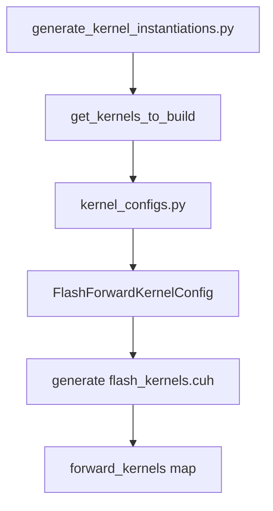
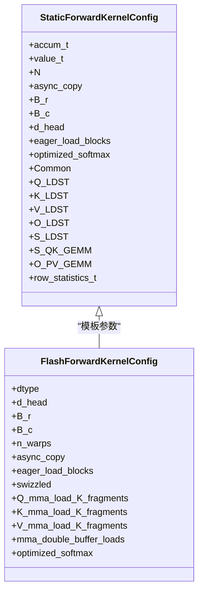

# 内核配置映射机制

<cite>
**本文档引用的文件**   
- [flash_kernels.cuh](file://src/include/flash_kernels.cuh)
- [flash_attention.cuh](file://src/include/flash_attention.cuh)
- [forward_kernel.cuh](file://src/include/forward_kernel.cuh)
- [static_kernel_configuration.cuh](file://src/include/static_kernel_configuration.cuh)
- [flash_attention.cu](file://src/flash_attention.cu)
- [generate_kernel_instantiations.py](file://tools/build/generate_kernel_instantiations.py)
- [kernel_configs.py](file://py/flash_helpers/kernel_configs.py)
</cite>

## 目录
1. [引言](#引言)
2. [核心组件分析](#核心组件分析)
3. [映射表的自动生成机制](#映射表的自动生成机制)
4. [静态配置模板的使用](#静态配置模板的使用)
5. [运行时内核选择流程](#运行时内核选择流程)
6. [配置到内核函数的绑定关系](#配置到内核函数的绑定关系)
7. [优化策略组合支持](#优化策略组合支持)
8. [结论](#结论)

## 引言
内核配置映射机制是Flash Attention实现高性能计算的核心组件之一。该机制通过一个预定义的映射表`forward_kernels`，将`FlashForwardKernelConfig`配置对象与具体的`flash_forward_kernel`函数指针进行绑定，从而在运行时根据输入参数选择最优的预编译内核变体。这种设计不仅实现了配置与实现的解耦，还支持多种优化策略的灵活组合，为不同硬件和数据场景下的性能调优提供了基础。

## 核心组件分析

`forward_kernels`映射表是整个机制的核心，它是一个`std::map`容器，将`FlashForwardKernelConfig`配置作为键，将`flash_forward_kernel`函数指针作为值。这个映射表在`flash_kernels.cuh`文件中被定义，并由`gen_kernel_instantiations.py`脚本自动生成。每个配置项都对应一个特定的内核实现，这些实现通过模板特化的方式，针对不同的数据类型、块大小、加载策略等参数进行了优化。

**Section sources**
- [flash_kernels.cuh](file://src/include/flash_kernels.cuh#L14-L186)
- [flash_attention.cuh](file://src/include/flash_attention.cuh#L34-L108)

## 映射表的自动生成机制

映射表的自动生成是通过`tools/build/generate_kernel_instantiations.py`脚本完成的。该脚本从`py/flash_helpers/kernel_configs.py`中获取所有需要构建的内核配置，然后生成`src/include/flash_kernels.cuh`文件。生成过程包括遍历所有配置，为每个配置生成相应的C++结构体和函数指针绑定。这种自动化生成方式确保了映射表的完整性和一致性，避免了手动维护的错误和遗漏。



**Diagram sources**
- [generate_kernel_instantiations.py](file://tools/build/generate_kernel_instantiations.py#L13-L56)
- [kernel_configs.py](file://py/flash_helpers/kernel_configs.py#L457-L462)

**Section sources**
- [generate_kernel_instantiations.py](file://tools/build/generate_kernel_instantiations.py#L1-L56)
- [kernel_configs.py](file://py/flash_helpers/kernel_configs.py#L106-L486)

## 静态配置模板的使用

`StaticForwardKernelConfig`模板是连接配置与内核实现的桥梁。它接收`FlashForwardKernelConfig`作为模板参数，并在编译时展开为具体的配置。这个模板定义了内核执行所需的所有静态参数，如数据类型、块大小、线程瓦片等。通过这种方式，编译器可以在编译时进行充分的优化，生成高效的机器代码。



**Diagram sources**
- [static_kernel_configuration.cuh](file://src/include/static_kernel_configuration.cuh#L104-L293)

**Section sources**
- [static_kernel_configuration.cuh](file://src/include/static_kernel_configuration.cuh#L1-L294)

## 运行时内核选择流程

当调用者提供输入参数时，系统通过查找`forward_kernels`映射表来选择最优的预编译内核变体。这个过程在`flash_attention.cu`文件中的`flash_attention_forward`函数中实现。首先，将Python端的配置对象转换为C++的`FlashForwardKernelConfig`，然后检查该配置是否存在于映射表中。如果存在，则通过`forward_kernels[cfg]`获取对应的函数指针，并启动内核执行。

```mermaid
sequenceDiagram
participant Python as "Python端"
participant C++ as "C++端"
participant Kernel as "内核函数"
Python->>C++ : 提供配置和张量
C++->>C++ : py_to_cpp_kernel_config()
C++->>C++ : forward_kernels.contains(cfg)
C++->>C++ : const auto kernel = forward_kernels[cfg]
C++->>Kernel : kernel<<<gridDim, blockDim>>()
Kernel-->>C++ : 执行结果
C++-->>Python : 返回结果
```

**Diagram sources**
- [flash_attention.cu](file://src/flash_attention.cu#L59-L62)
- [flash_attention.cu](file://src/flash_attention.cu#L126-L126)

**Section sources**
- [flash_attention.cu](file://src/flash_attention.cu#L1-L150)

## 配置到内核函数的绑定关系

配置到内核函数的绑定关系在`flash_kernels.cuh`文件中通过初始化列表实现。每个映射项都包含一个`FlashForwardKernelConfig`实例和一个指向`flash_forward_kernel`模板实例的函数指针。函数指针的生成依赖于`StaticForwardKernelConfig`模板，该模板将配置参数转换为内核执行所需的静态配置。这种绑定方式确保了每个配置项都对应一个唯一的、经过充分优化的内核实现。

**Section sources**
- [flash_kernels.cuh](file://src/include/flash_kernels.cuh#L14-L186)

## 优化策略组合支持

该设计支持多种优化策略的组合，包括异步拷贝、预加载块、交错存储、双缓冲加载和优化的softmax等。这些策略通过`FlashForwardKernelConfig`中的布尔标志和整数参数进行控制。不同的策略组合可以针对不同的硬件特性和数据模式进行优化，从而在各种场景下都能获得最佳性能。例如，`async+eager+swizzled+load_2_2_2_tiles+buffer+opt_softmax`配置结合了所有优化策略，适用于高性能计算场景。

**Section sources**
- [flash_kernels.cuh](file://src/include/flash_kernels.cuh#L16-L185)
- [flash_attention.cuh](file://src/include/flash_attention.cuh#L41-L52)

## 结论
内核配置映射机制通过将配置与实现解耦，实现了运行时的动态内核选择。这种设计不仅提高了代码的可维护性和可扩展性，还为性能调优提供了极大的灵活性。通过自动生成映射表和使用静态配置模板，系统能够在编译时进行充分优化，同时在运行时根据实际输入选择最优的内核变体。这种机制是Flash Attention能够实现高性能计算的关键所在。