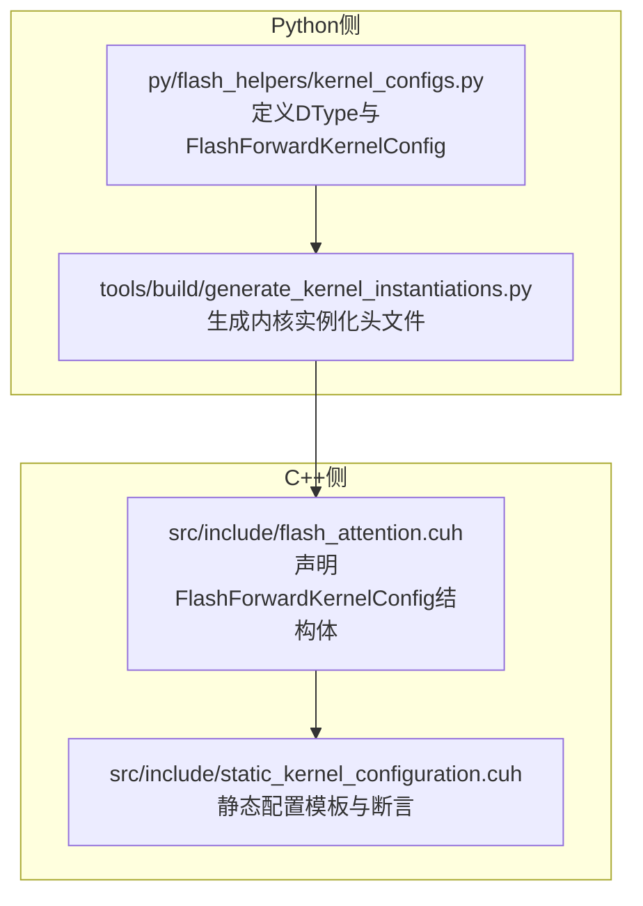
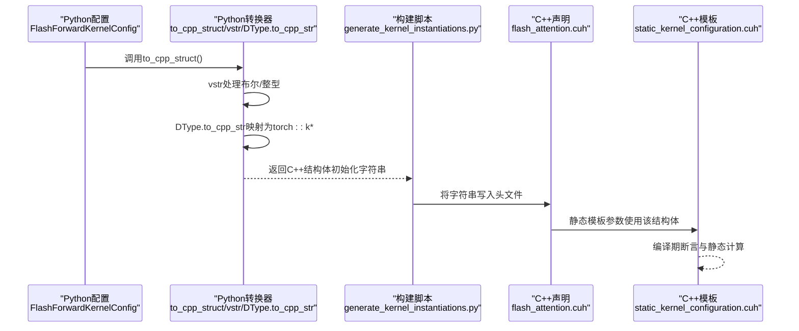
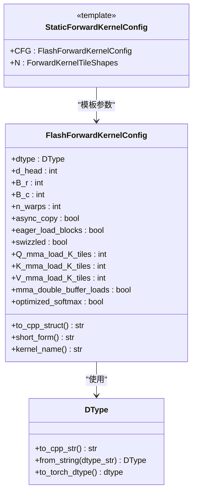

# Python与C++配置映射机制

<cite>
**本文引用的文件**
- [py/flash_helpers/kernel_configs.py](file://py/flash_helpers/kernel_configs.py)
- [src/include/flash_attention.cuh](file://src/include/flash_attention.cuh)
- [src/include/static_kernel_configuration.cuh](file://src/include/static_kernel_configuration.cuh)
- [tools/build/generate_kernel_instantiations.py](file://tools/build/generate_kernel_instantiations.py)
- [README.md](file://README.md)
</cite>

## 目录
1. [引言](#引言)
2. [项目结构](#项目结构)
3. [核心组件](#核心组件)
4. [架构总览](#架构总览)
5. [详细组件分析](#详细组件分析)
6. [依赖关系分析](#依赖关系分析)
7. [性能考量](#性能考量)
8. [故障排查指南](#故障排查指南)
9. [结论](#结论)
10. [附录](#附录)

## 引言
本文件聚焦于Python与C++之间的配置映射机制，围绕FlashForwardKernelConfig类的to_cpp_struct方法展开，系统阐述其如何将Python侧的数据类型（如布尔、整型、DType枚举）安全、一致地转换为C++侧的字面量表达式，从而在构建阶段生成静态内核实例化代码。文档还解释了vstr辅助函数对布尔值的处理策略、DType枚举的to_cpp_str方法实现，以及结构体字符串的格式化构造流程。最后通过一个完整的转换示例，说明该映射机制如何保障两端配置的一致性与类型安全性。

## 项目结构
本仓库包含两部分关键代码：
- Python侧：用于定义内核配置、枚举类型及配置到C++结构体的转换逻辑
- C++侧：声明FlashForwardKernelConfig结构体、静态配置模板与运行时选择逻辑

图表来源
- [py/flash_helpers/kernel_configs.py](file://py/flash_helpers/kernel_configs.py#L1-L170)
- [tools/build/generate_kernel_instantiations.py](file://tools/build/generate_kernel_instantiations.py#L1-L56)
- [src/include/flash_attention.cuh](file://src/include/flash_attention.cuh#L1-L110)
- [src/include/static_kernel_configuration.cuh](file://src/include/static_kernel_configuration.cuh#L1-L200)

章节来源
- [README.md](file://README.md#L1-L30)

## 核心组件
- DType枚举：封装PyTorch ScalarType到C++侧torch命名空间常量的映射，提供to_cpp_str方法输出C++侧字面量字符串。
- FlashForwardKernelConfig数据类：包含内核配置字段，提供to_cpp_struct方法将Python对象序列化为C++结构体初始化表达式；同时提供short_form等工具方法便于调试与日志输出。
- 构建脚本generate_kernel_instantiations.py：调用to_cpp_struct生成C++侧的静态实例化映射，确保Python端配置与C++端结构体完全一致。

章节来源
- [py/flash_helpers/kernel_configs.py](file://py/flash_helpers/kernel_configs.py#L1-L170)
- [tools/build/generate_kernel_instantiations.py](file://tools/build/generate_kernel_instantiations.py#L1-L56)

## 架构总览
下图展示了从Python配置到C++静态实例化的端到端流程，强调类型映射与一致性校验的关键节点。

图表来源
- [py/flash_helpers/kernel_configs.py](file://py/flash_helpers/kernel_configs.py#L147-L164)
- [tools/build/generate_kernel_instantiations.py](file://tools/build/generate_kernel_instantiations.py#L34-L50)
- [src/include/flash_attention.cuh](file://src/include/flash_attention.cuh#L30-L110)
- [src/include/static_kernel_configuration.cuh](file://src/include/static_kernel_configuration.cuh#L22-L35)

## 详细组件分析

### FlashForwardKernelConfig类与to_cpp_struct方法
- 字段覆盖：包含dtype（DType）、d_head、B_r、B_c、n_warps、async_copy、eager_load_blocks、swizzled、Q/K/V_mma_load_K_tiles、mma_double_buffer_loads、optimized_softmax等。
- to_cpp_struct实现要点：
  - 使用内部辅助函数vstr统一处理布尔与整型的字符串化，布尔值转为小写形式，整型保持原样。
  - 使用DType.to_cpp_str将Python枚举映射为C++侧torch::kFloat16或torch::kBFloat16等字面量。
  - 按照C++结构体字段顺序拼接，形成FlashForwardKernelConfig{}初始化表达式字符串。
- 作用：为构建阶段提供可直接嵌入C++头文件的结构体初始化表达式，确保Python配置与C++静态模板参数一致。

章节来源
- [py/flash_helpers/kernel_configs.py](file://py/flash_helpers/kernel_configs.py#L106-L164)

### vstr辅助函数
- 设计目标：在Python侧统一布尔与整型的字符串化，避免大小写差异导致的不一致。
- 处理规则：
  - 布尔值：转换为小写字符串（如True→"true"，False→"false"），与C++侧字面量一致。
  - 非布尔值：直接转为字符串，保持数值语义。
- 适用范围：在to_cpp_struct中对所有字段进行预处理，确保最终字符串与C++侧语法兼容。

章节来源
- [py/flash_helpers/kernel_configs.py](file://py/flash_helpers/kernel_configs.py#L147-L164)

### DType枚举与to_cpp_str方法
- 定义：基于IntEnum，映射PyTorch ScalarType到Python侧枚举值。
- to_cpp_str实现：根据枚举值返回对应C++侧torch命名空间常量字符串，如torch::kFloat16、torch::kBFloat16。
- 错误处理：未知枚举值抛出异常，防止无效映射进入C++编译阶段。

章节来源
- [py/flash_helpers/kernel_configs.py](file://py/flash_helpers/kernel_configs.py#L8-L22)

### C++侧FlashForwardKernelConfig结构体
- 字段与约束：包含dtype（torch::ScalarType）、d_head、B_r、B_c、n_warps、async_copy、eager_load_blocks、swizzled、Q/K/V_mma_load_K_fragments、mma_double_buffer_loads、optimized_softmax等。
- 运算符重载：提供operator<用于排序与比较，确保配置有序存储与快速查找。
- 静态模板使用：在static_kernel_configuration.cuh中作为模板参数，结合valid_config断言进行编译期校验。

章节来源
- [src/include/flash_attention.cuh](file://src/include/flash_attention.cuh#L30-L110)
- [src/include/static_kernel_configuration.cuh](file://src/include/static_kernel_configuration.cuh#L22-L35)

### 构建脚本与实例化映射
- 生成流程：遍历Python侧get_kernels_to_build()返回的配置集合，逐个调用to_cpp_struct生成C++结构体初始化表达式，并写入flash_kernels.cuh中的std::map映射。
- 关键点：通过cfg.kernel_name()与模板StaticForwardKernelConfig<...>绑定，使每个配置对应一个具体内核实例化。

章节来源
- [tools/build/generate_kernel_instantiations.py](file://tools/build/generate_kernel_instantiations.py#L13-L56)

### 类关系与依赖图

图表来源
- [py/flash_helpers/kernel_configs.py](file://py/flash_helpers/kernel_configs.py#L1-L170)
- [src/include/static_kernel_configuration.cuh](file://src/include/static_kernel_configuration.cuh#L104-L120)

## 依赖关系分析
- Python侧依赖：
  - DType与FlashForwardKernelConfig位于同一模块，彼此紧密耦合，共同承担类型映射职责。
  - 构建脚本依赖get_kernels_to_build()生成配置集合，再调用to_cpp_struct进行字符串化。
- C++侧依赖：
  - flash_attention.cuh声明FlashForwardKernelConfig结构体，供静态模板与运行时选择使用。
  - static_kernel_configuration.cuh以FlashForwardKernelConfig为模板参数，执行编译期断言与静态计算，确保配置合法性。

图表来源
- [py/flash_helpers/kernel_configs.py](file://py/flash_helpers/kernel_configs.py#L1-L170)
- [tools/build/generate_kernel_instantiations.py](file://tools/build/generate_kernel_instantiations.py#L13-L56)
- [src/include/flash_attention.cuh](file://src/include/flash_attention.cuh#L30-L110)
- [src/include/static_kernel_configuration.cuh](file://src/include/static_kernel_configuration.cuh#L104-L120)

章节来源
- [py/flash_helpers/kernel_configs.py](file://py/flash_helpers/kernel_configs.py#L1-L170)
- [tools/build/generate_kernel_instantiations.py](file://tools/build/generate_kernel_instantiations.py#L13-L56)
- [src/include/flash_attention.cuh](file://src/include/flash_attention.cuh#L30-L110)
- [src/include/static_kernel_configuration.cuh](file://src/include/static_kernel_configuration.cuh#L104-L120)

## 性能考量
- 映射开销：to_cpp_struct仅在构建阶段执行，对运行时性能无影响。
- 类型安全：通过DType.to_cpp_str与C++侧torch::ScalarType严格对应，避免运行时类型错误。
- 编译期优化：静态模板参数与valid_config断言在编译期完成配置校验，减少运行时分支与错误路径。

[本节为通用性能讨论，无需列出具体文件来源]

## 故障排查指南
- 布尔值大小写问题：若手动修改生成的C++字符串，需确保布尔字面量为小写（true/false），否则可能导致C++编译失败。
- DType映射异常：当DType枚举值不在支持范围内时，to_cpp_str会抛出异常；检查Python侧枚举定义与输入值是否匹配。
- 结构体字段顺序：to_cpp_struct严格按C++结构体字段顺序拼接，若C++结构体新增或调整字段，需同步更新to_cpp_struct的拼接顺序。
- 构建失败定位：若生成的flash_kernels.cuh存在语法错误，检查to_cpp_struct返回的字符串是否包含非法字符或缺少逗号/大括号。

章节来源
- [py/flash_helpers/kernel_configs.py](file://py/flash_helpers/kernel_configs.py#L147-L164)
- [src/include/flash_attention.cuh](file://src/include/flash_attention.cuh#L30-L110)

## 结论
通过FlashForwardKernelConfig的to_cpp_struct方法与vstr、DType.to_cpp_str的协同，Python与C++之间实现了强类型的跨语言配置映射。该机制在构建阶段将Python配置精确转换为C++结构体初始化表达式，并由静态模板与断言在编译期完成配置校验，既保证了类型安全，又避免了运行时开销。配合构建脚本的自动化流程，确保了两端配置的一致性与可维护性。

[本节为总结性内容，无需列出具体文件来源]

## 附录

### 实际转换示例（步骤说明）
以下以一个具体配置为例，说明从Python到C++的完整转换过程：
- 步骤1：Python侧创建FlashForwardKernelConfig实例，包含dtype（DType.FP16）、d_head、B_r、B_c、n_warps、async_copy、eager_load_blocks、swizzled、Q/K/V_mma_load_K_tiles、mma_double_buffer_loads、optimized_softmax等字段。
- 步骤2：调用to_cpp_struct，内部：
  - 对布尔字段使用vstr，将True/False转换为小写字符串；
  - 对整型字段直接转为字符串；
  - 对dtype调用DType.to_cpp_str，得到torch::kFloat16。
- 步骤3：拼接为FlashForwardKernelConfig{}初始化表达式字符串。
- 步骤4：构建脚本将该字符串写入flash_kernels.cuh，作为std::map的键，绑定到具体内核模板实例化。

章节来源
- [py/flash_helpers/kernel_configs.py](file://py/flash_helpers/kernel_configs.py#L147-L164)
- [tools/build/generate_kernel_instantiations.py](file://tools/build/generate_kernel_instantiations.py#L34-L50)