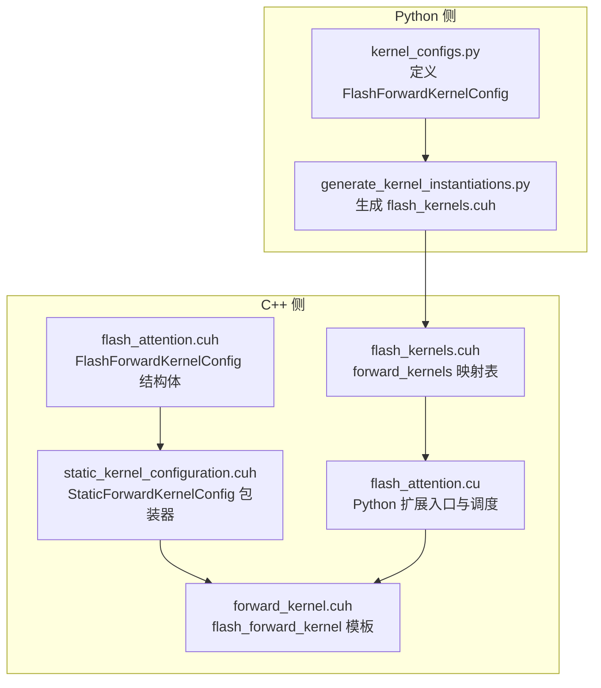
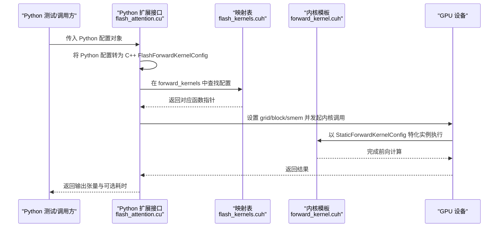
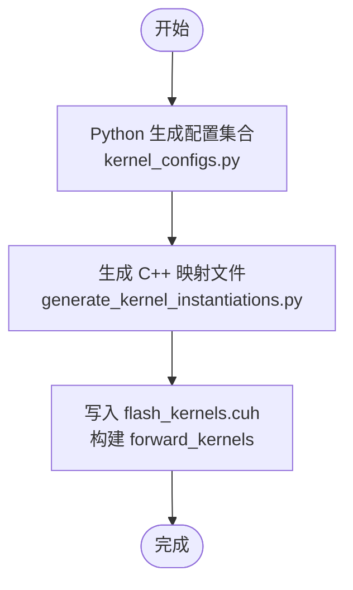
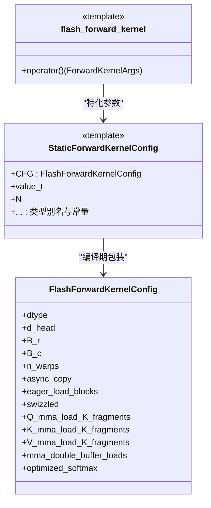
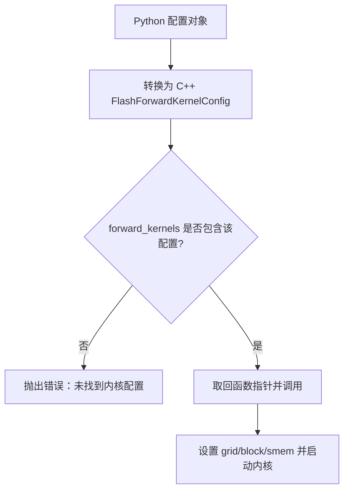
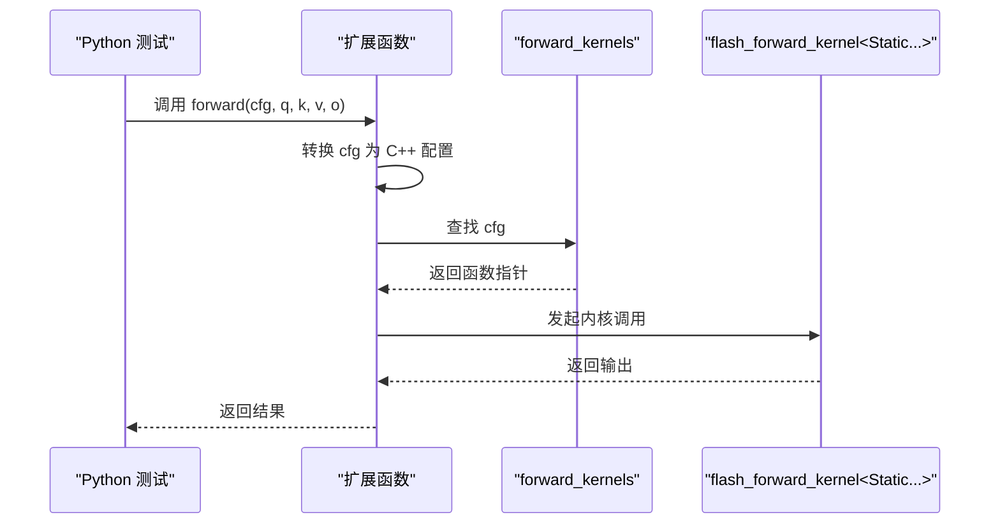

# 内核实例化映射机制

<cite>
**本文引用的文件**
- [flash_kernels.cuh](file://previous_kernels/src_15/include/flash_kernels.cuh)
- [static_kernel_configuration.cuh](file://previous_kernels/src_15/include/static_kernel_configuration.cuh)
- [forward_kernel.cuh](file://previous_kernels/src_15/include/forward_kernel.cuh)
- [flash_attention.cuh](file://previous_kernels/src_15/include/flash_attention.cuh)
- [flash_attention.cu](file://src/flash_attention.cu)
- [kernel_configs.py](file://py/flash_helpers/kernel_configs.py)
- [generate_kernel_instantiations.py](file://tools/build/generate_kernel_instantiations.py)
- [test.py](file://py/flash_helpers/test/test.py)
</cite>

## 目录
1. [引言](#引言)
2. [项目结构](#项目结构)
3. [核心组件](#核心组件)
4. [架构总览](#架构总览)
5. [详细组件分析](#详细组件分析)
6. [依赖关系分析](#依赖关系分析)
7. [性能考量](#性能考量)
8. [故障排查指南](#故障排查指南)
9. [结论](#结论)
10. [附录](#附录)

## 引言
本文件围绕 Python 与 C++ 配置映射中的“内核实例化”机制展开，重点解释以下问题：
- flash_kernels.cuh 中的 forward_kernels 映射表如何将 FlashForwardKernelConfig 配置与具体 flash_forward_kernel 模板实例关联；
- C++ 端通过 StaticForwardKernelConfig 包装器实现编译时配置特化；
- Python 侧生成的配置如何与这些预实例化的内核匹配；
- 通过调用流程展示 Python 端配置在 C++ 端如何找到对应的函数指针；
- 该映射机制如何支持高效内核调度并避免运行时模板实例化开销。

## 项目结构
本仓库采用“Python 生成 + C++ 预实例化”的混合策略：Python 负责枚举与生成内核配置，C++ 负责静态映射与调度。关键目录与文件如下：
- Python 侧：py/flash_helpers/kernel_configs.py（定义配置数据类、解析与生成逻辑）、tools/build/generate_kernel_instantiations.py（自动生成 C++ 映射文件）
- C++ 侧：previous_kernels/src_15/include/*（内核声明、静态配置、前向内核模板）、src/flash_attention.cu（Python 扩展入口与调度）

图表来源
- [kernel_configs.py](file://py/flash_helpers/kernel_configs.py#L106-L167)
- [generate_kernel_instantiations.py](file://tools/build/generate_kernel_instantiations.py#L13-L56)
- [flash_attention.cuh](file://previous_kernels/src_15/include/flash_attention.cuh#L30-L109)
- [static_kernel_configuration.cuh](file://previous_kernels/src_15/include/static_kernel_configuration.cuh#L104-L120)
- [forward_kernel.cuh](file://previous_kernels/src_15/include/forward_kernel.cuh#L85-L205)
- [flash_kernels.cuh](file://previous_kernels/src_15/include/flash_kernels.cuh#L12-L186)
- [flash_attention.cu](file://src/flash_attention.cu#L16-L150)

章节来源
- [kernel_configs.py](file://py/flash_helpers/kernel_configs.py#L106-L167)
- [generate_kernel_instantiations.py](file://tools/build/generate_kernel_instantiations.py#L13-L56)
- [flash_attention.cu](file://src/flash_attention.cu#L16-L150)

## 核心组件
- FlashForwardKernelConfig：描述一次前向内核执行所需的全部配置项（数据类型、块大小、线程数、异步拷贝、加载策略、缓冲策略、优化开关等）。该结构体在 C++ 与 Python 两侧均存在，用于跨语言传递与匹配。
- StaticForwardKernelConfig：对 FlashForwardKernelConfig 的编译期包装器，将运行时配置固化为编译期常量，从而在模板参数层面完成特化，避免运行时分支与模板实例化成本。
- flash_forward_kernel<Kernel>：模板内核，接收一个已特化的 Kernel 类型（由 StaticForwardKernelConfig 提供），在 CUDA 上执行注意力前向计算。
- forward_kernels 映射表：以 FlashForwardKernelConfig 为键，以函数指针为值，预先绑定所有可用的模板实例，实现 O(1) 的配置到内核的查找。
- Python 扩展入口：将 Python 传入的配置对象转换为 C++ 的 FlashForwardKernelConfig，并在映射表中查找对应内核，随后发起 CUDA 内核调用。

章节来源
- [flash_attention.cuh](file://previous_kernels/src_15/include/flash_attention.cuh#L30-L109)
- [static_kernel_configuration.cuh](file://previous_kernels/src_15/include/static_kernel_configuration.cuh#L104-L120)
- [forward_kernel.cuh](file://previous_kernels/src_15/include/forward_kernel.cuh#L85-L205)
- [flash_kernels.cuh](file://previous_kernels/src_15/include/flash_kernels.cuh#L12-L186)
- [flash_attention.cu](file://src/flash_attention.cu#L16-L150)

## 架构总览
下图展示了从 Python 到 C++ 的配置传递与内核调度路径，以及 C++ 内部的映射与模板特化机制。

图表来源
- [flash_attention.cu](file://src/flash_attention.cu#L34-L135)
- [flash_kernels.cuh](file://previous_kernels/src_15/include/flash_kernels.cuh#L12-L186)
- [forward_kernel.cuh](file://previous_kernels/src_15/include/forward_kernel.cuh#L85-L205)

## 详细组件分析

### 组件一：Python 配置生成与映射生成
- Python 侧定义了 FlashForwardKernelConfig 数据类，包含 dtype、B_r/B_c、n_warps、异步拷贝、加载策略、缓冲策略、优化开关等字段，并提供 to_cpp_struct() 方法将配置序列化为 C++ 可用的结构体字面量字符串。
- generate_kernel_instantiations.py 使用 Python 生成的配置集合，动态写入 C++ 头文件 flash_kernels.cuh，构造 forward_kernels 映射表条目，每个条目将 FlashForwardKernelConfig 与 flash_forward_kernel<StaticForwardKernelConfig<...>> 的函数指针绑定。

图表来源
- [kernel_configs.py](file://py/flash_helpers/kernel_configs.py#L106-L167)
- [generate_kernel_instantiations.py](file://tools/build/generate_kernel_instantiations.py#L13-L56)
- [flash_kernels.cuh](file://previous_kernels/src_15/include/flash_kernels.cuh#L12-L186)

章节来源
- [kernel_configs.py](file://py/flash_helpers/kernel_configs.py#L106-L167)
- [generate_kernel_instantiations.py](file://tools/build/generate_kernel_instantiations.py#L13-L56)

### 组件二：C++ 编译时配置特化（StaticForwardKernelConfig）
- StaticForwardKernelConfig 是对 FlashForwardKernelConfig 的编译期包装器，将配置字段提升为 constexpr 常量，同时派生出内存布局、寄存器/共享内存形状、GEMM 配置等类型级信息，使模板内核在编译期完成特化，避免运行时分支与模板实例化开销。
- forward_kernel.cuh 中的 flash_forward_kernel<Kernel> 接收一个已特化的 Kernel 类型，内部通过 Kernel 的类型别名与常量完成数据搬运、GEMM、Softmax、归约等步骤。

图表来源
- [flash_attention.cuh](file://previous_kernels/src_15/include/flash_attention.cuh#L30-L109)
- [static_kernel_configuration.cuh](file://previous_kernels/src_15/include/static_kernel_configuration.cuh#L104-L120)
- [forward_kernel.cuh](file://previous_kernels/src_15/include/forward_kernel.cuh#L85-L205)

章节来源
- [static_kernel_configuration.cuh](file://previous_kernels/src_15/include/static_kernel_configuration.cuh#L104-L120)
- [forward_kernel.cuh](file://previous_kernels/src_15/include/forward_kernel.cuh#L85-L205)

### 组件三：映射表 forward_kernels 的构建与使用
- flash_kernels.cuh 中的 forward_kernels 是一个 std::map<FlashForwardKernelConfig, void(*)(ForwardKernelArgs)>，键为配置，值为函数指针。每个条目将配置与 flash_forward_kernel<StaticForwardKernelConfig<...>> 的实例绑定。
- Python 扩展入口 flash_attention_forward 在 C++ 侧将 Python 配置转换为 C++ 配置后，直接在 forward_kernels 中查找，若不存在则报错；存在则取出函数指针并发起内核调用。

图表来源
- [flash_kernels.cuh](file://previous_kernels/src_15/include/flash_kernels.cuh#L12-L186)
- [flash_attention.cu](file://src/flash_attention.cu#L34-L135)

章节来源
- [flash_kernels.cuh](file://previous_kernels/src_15/include/flash_kernels.cuh#L12-L186)
- [flash_attention.cu](file://src/flash_attention.cu#L34-L135)

### 组件四：Python 端配置到 C++ 函数指针的匹配示例
- Python 通过测试用例或上层调用传入一个 FlashForwardKernelConfig 实例；
- C++ 侧 flash_attention_forward 将其转换为 C++ 配置对象；
- 在 forward_kernels 中进行键匹配，返回对应函数指针；
- 通过 CUDA API 发起内核执行。

图表来源
- [flash_attention.cu](file://src/flash_attention.cu#L34-L135)
- [flash_kernels.cuh](file://previous_kernels/src_15/include/flash_kernels.cuh#L12-L186)
- [test.py](file://py/flash_helpers/test/test.py#L51-L63)

章节来源
- [flash_attention.cu](file://src/flash_attention.cu#L34-L135)
- [test.py](file://py/flash_helpers/test/test.py#L51-L63)

## 依赖关系分析
- Python 与 C++ 的耦合点在于 FlashForwardKernelConfig 的结构一致性：Python 侧的字段与 C++ 侧的字段一一对应，且 Python 提供 to_cpp_struct() 保证生成的 C++ 字面量格式正确。
- 生成脚本 generate_kernel_instantiations.py 依赖 kernel_configs.py 的配置集合生成器，确保映射表覆盖所有应实例化的配置。
- C++ 侧的映射表依赖 forward_kernel.cuh 中的模板内核与 static_kernel_configuration.cuh 中的编译期特化包装器。

图表来源
- [kernel_configs.py](file://py/flash_helpers/kernel_configs.py#L106-L167)
- [generate_kernel_instantiations.py](file://tools/build/generate_kernel_instantiations.py#L13-L56)
- [flash_kernels.cuh](file://previous_kernels/src_15/include/flash_kernels.cuh#L12-L186)
- [flash_attention.cuh](file://previous_kernels/src_15/include/flash_attention.cuh#L30-L109)
- [static_kernel_configuration.cuh](file://previous_kernels/src_15/include/static_kernel_configuration.cuh#L104-L120)
- [forward_kernel.cuh](file://previous_kernels/src_15/include/forward_kernel.cuh#L85-L205)
- [flash_attention.cu](file://src/flash_attention.cu#L16-L150)

章节来源
- [kernel_configs.py](file://py/flash_helpers/kernel_configs.py#L106-L167)
- [generate_kernel_instantiations.py](file://tools/build/generate_kernel_instantiations.py#L13-L56)
- [flash_kernels.cuh](file://previous_kernels/src_15/include/flash_kernels.cuh#L12-L186)
- [flash_attention.cu](file://src/flash_attention.cu#L16-L150)

## 性能考量
- 避免运行时模板实例化：通过 StaticForwardKernelConfig 将配置固化为编译期常量，模板内核在编译期完成特化，减少运行时分支与实例化开销。
- 静态映射查找：std::map 键为 FlashForwardKernelConfig，查找复杂度为 O(log N)，但 N 通常较小（仅预实例化的有限配置集），且查找发生在模块初始化阶段或首次调用前，实际运行时开销极低。
- 动态共享内存设置：扩展初始化时遍历映射表，根据配置估算的共享内存需求设置最大动态共享内存属性，避免超限导致的内核失败。
- 线程块与网格维度：根据配置的 n_warps 计算线程数，按 Q/K 序列分块设置 grid 维度，确保充分利用 SM 并行度。

章节来源
- [static_kernel_configuration.cuh](file://previous_kernels/src_15/include/static_kernel_configuration.cuh#L104-L120)
- [flash_attention.cu](file://src/flash_attention.cu#L117-L149)

## 故障排查指南
- 配置未命中映射表：当 Python 传入的配置不在 flash_kernels.cuh 的映射表中时，flash_attention_forward 会检查并报错。请确认：
  - Python 生成的配置集合是否包含该配置；
  - 生成脚本是否重新生成了映射头文件；
  - 配置字段与映射表条目是否严格一致（包括布尔位与整数位）。
- 数据类型不匹配：扩展入口会校验配置 dtype 与输入张量 dtype 是否一致，不一致会报错。
- 张量形状约束：要求 seq_len 对 B_r 与 B_c 整除，否则会报错；请调整配置或输入长度。
- 设备能力不足：当前实现要求 SM_80 或更高，低于此能力会报错。

章节来源
- [flash_attention.cu](file://src/flash_attention.cu#L42-L83)
- [flash_kernels.cuh](file://previous_kernels/src_15/include/flash_kernels.cuh#L12-L186)

## 结论
本机制通过“Python 生成 + C++ 预实例化”的方式，将运行时配置与编译期模板特化解耦：Python 负责生成所有可能的配置组合，C++ 负责静态映射与调度。StaticForwardKernelConfig 将配置固化为编译期常量，避免运行时模板实例化开销；forward_kernels 映射表提供 O(1) 查找，结合扩展初始化阶段的动态共享内存设置，整体实现高效、稳定、可维护的内核实例化调度方案。

## 附录
- 关键路径参考
  - Python 配置生成与序列化：[kernel_configs.py](file://py/flash_helpers/kernel_configs.py#L106-L167)
  - 映射表生成脚本：[generate_kernel_instantiations.py](file://tools/build/generate_kernel_instantiations.py#L13-L56)
  - 映射表定义与使用：[flash_kernels.cuh](file://previous_kernels/src_15/include/flash_kernels.cuh#L12-L186)
  - 编译期特化包装器：[static_kernel_configuration.cuh](file://previous_kernels/src_15/include/static_kernel_configuration.cuh#L104-L120)
  - 内核模板实现：[forward_kernel.cuh](file://previous_kernels/src_15/include/forward_kernel.cuh#L85-L205)
  - 扩展入口与调度：[flash_attention.cu](file://src/flash_attention.cu#L34-L135)
  - 配置结构体定义：[flash_attention.cuh](file://previous_kernels/src_15/include/flash_attention.cuh#L30-L109)
  - 单元测试示例（Python 调用）：[test.py](file://py/flash_helpers/test/test.py#L51-L63)