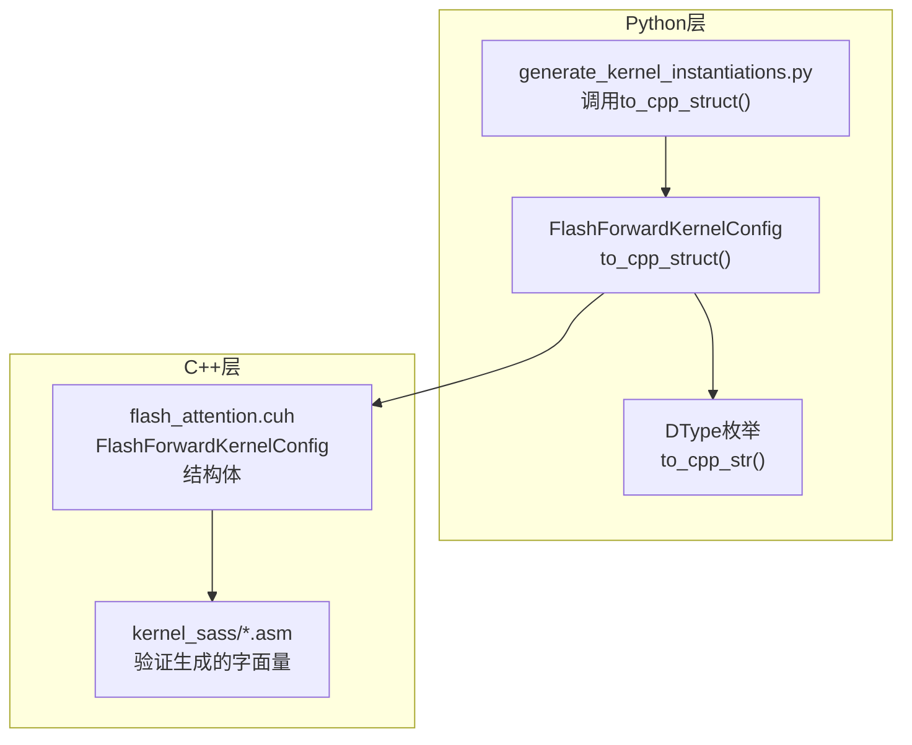
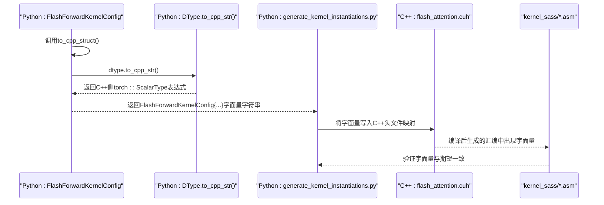
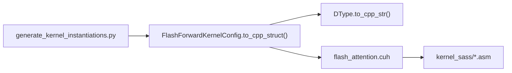

# 字符串格式化构造

<cite>
**本文引用的文件列表**
- [kernel_configs.py](file://py/flash_helpers/kernel_configs.py)
- [flash_attention.cuh](file://src/include/flash_attention.cuh)
- [generate_kernel_instantiations.py](file://tools/build/generate_kernel_instantiations.py)
- [10_A100.asm](file://kernel_sass/10_A100.asm)
- [10_RTX3090.asm](file://kernel_sass/10_RTX3090.asm)
</cite>

## 目录
1. [简介](#简介)
2. [项目结构](#项目结构)
3. [核心组件](#核心组件)
4. [架构总览](#架构总览)
5. [详细组件分析](#详细组件分析)
6. [依赖关系分析](#依赖关系分析)
7. [性能考量](#性能考量)
8. [故障排查指南](#故障排查指南)
9. [结论](#结论)

## 简介
本节聚焦于Python到C++配置映射中的字符串格式化构造，重点解释Python侧FlashForwardKernelConfig类的to_cpp_struct方法如何使用f-string格式化构造C++结构体初始化表达式，并确保生成的C++代码语法正确。文档将结合实际示例，说明dtype、d_head、B_r、B_c、n_warps、async_copy、eager_load_blocks、swizzled、Q/K/V加载片段数、mma双缓冲、优化softmax等字段在生成的C++结构体字面量中的排列顺序与分隔方式；并给出针对不同类型的值（整型、布尔、枚举）的处理策略与潜在格式错误的防范措施。

## 项目结构
该功能横跨Python辅助模块与C++内核头文件：
- Python侧：提供数据类与格式化逻辑，用于生成C++结构体字面量
- C++侧：定义FlashForwardKernelConfig结构体，包含与Python数据类一一对应的字段
- 构建工具：在构建阶段调用Python侧to_cpp_struct，生成C++初始化映射

图表来源
- [kernel_configs.py](file://py/flash_helpers/kernel_configs.py#L106-L167)
- [flash_attention.cuh](file://src/include/flash_attention.cuh#L30-L109)
- [generate_kernel_instantiations.py](file://tools/build/generate_kernel_instantiations.py#L34-L50)
- [10_A100.asm](file://kernel_sass/10_A100.asm#L4-L14)

章节来源
- [kernel_configs.py](file://py/flash_helpers/kernel_configs.py#L106-L167)
- [flash_attention.cuh](file://src/include/flash_attention.cuh#L30-L109)
- [generate_kernel_instantiations.py](file://tools/build/generate_kernel_instantiations.py#L34-L50)

## 核心组件
- Python数据类FlashForwardKernelConfig：包含dtype、d_head、B_r、B_c、n_warps、async_copy、eager_load_blocks、swizzled、Q_mma_load_K_tiles、K_mma_load_K_tiles、V_mma_load_K_tiles、mma_double_buffer_loads、optimized_softmax等字段。
- DType枚举：提供to_cpp_str()方法，将Python枚举值映射为C++侧torch::ScalarType常量表达式。
- to_cpp_struct方法：使用f-string拼接C++结构体初始化表达式，严格遵循C++语法与字段顺序。
- C++结构体FlashForwardKernelConfig：与Python数据类字段一一对应，保证生成的字面量能直接用于模板参数与运行时映射。

章节来源
- [kernel_configs.py](file://py/flash_helpers/kernel_configs.py#L106-L167)
- [flash_attention.cuh](file://src/include/flash_attention.cuh#L30-L109)

## 架构总览
下面的序列图展示了从Python配置到C++结构体字面量的关键流程，以及最终在构建产物中被验证的路径。

图表来源
- [kernel_configs.py](file://py/flash_helpers/kernel_configs.py#L148-L163)
- [flash_attention.cuh](file://src/include/flash_attention.cuh#L30-L109)
- [generate_kernel_instantiations.py](file://tools/build/generate_kernel_instantiations.py#L34-L50)
- [10_A100.asm](file://kernel_sass/10_A100.asm#L4-L14)

## 详细组件分析

### to_cpp_struct方法与f-string格式化
- 方法位置：FlashForwardKernelConfig.to_cpp_struct()
- 关键点：
  - 使用f-string拼接C++结构体初始化表达式，形如“FlashForwardKernelConfig{...}”
  - 对布尔类型采用小写字符串形式（true/false），以符合C++语法
  - 对非布尔类型直接转为字符串，保持数值原样
  - dtype通过DType.to_cpp_str()返回C++侧torch::ScalarType表达式
  - 字段顺序与C++结构体定义严格一致，确保编译期模板匹配与运行时映射正确

章节来源
- [kernel_configs.py](file://py/flash_helpers/kernel_configs.py#L148-L163)

### 字段顺序与分隔方式
- Python数据类字段顺序（与C++结构体一致）：
  1) dtype（torch::ScalarType）
  2) d_head（int）
  3) B_r（int）
  4) B_c（int）
  5) n_warps（int）
  6) async_copy（bool）
  7) eager_load_blocks（bool）
  8) swizzled（bool）
  9) Q_mma_load_K_tiles（int）
  10) K_mma_load_K_tiles（int）
  11) V_mma_load_K_tiles（int）
  12) mma_double_buffer_loads（bool）
  13) optimized_softmax（bool）

- 分隔方式：
  - 字段之间以逗号与空格分隔
  - 结构体字面量以花括号包围，形成标准C++聚合初始化语法

章节来源
- [kernel_configs.py](file://py/flash_helpers/kernel_configs.py#L148-L163)
- [flash_attention.cuh](file://src/include/flash_attention.cuh#L30-L109)

### 类型处理策略
- 整型字段：直接转为字符串，保持数值不变
- 布尔字段：统一转为小写字符串（true/false），满足C++语法
- 枚举字段dtype：通过DType.to_cpp_str()映射为torch::ScalarType表达式
- 异常与校验：
  - DType枚举值非法时抛出异常，避免生成无效C++表达式
  - 构建阶段若生成的字面量与C++结构体不匹配，将在编译或反汇编验证中暴露问题

章节来源
- [kernel_configs.py](file://py/flash_helpers/kernel_configs.py#L148-L163)
- [kernel_configs.py](file://py/flash_helpers/kernel_configs.py#L10-L22)

### 示例：FlashForwardKernelConfig实例到C++字面量
- 输入配置（示例）：dtype=FP16, d_head=128, B_r=64, async_copy=True
- 生成的C++结构体字面量应为：FlashForwardKernelConfig{torch::kFloat16, 128, 64, 64, 4, true, true, true, 0, 2, 2, true, true}
- 说明：
  - dtype映射为torch::kFloat16
  - d_head、B_r、B_c、n_warps按顺序填入
  - async_copy、eager_load_blocks、swizzled、mma_double_buffer_loads、optimized_softmax均为true
  - Q/K/V加载片段数分别为0、2、2

章节来源
- [kernel_configs.py](file://py/flash_helpers/kernel_configs.py#L148-L163)
- [flash_attention.cuh](file://src/include/flash_attention.cuh#L30-L109)

### 生成流程与构建集成
- 构建脚本generate_kernel_instantiations.py遍历待构建的配置集合，逐个调用to_cpp_struct()生成字面量字符串，并将其写入C++头文件映射中
- 运行时映射键即为生成的FlashForwardKernelConfig字面量，确保模板特化与运行时查找一致

章节来源
- [generate_kernel_instantiations.py](file://tools/build/generate_kernel_instantiations.py#L34-L50)

### 反汇编验证与一致性检查
- 在编译后的汇编文件中可看到生成的字面量，例如：
  - FlashForwardKernelConfig{(c10::ScalarType)5, (int)128, (int)128, (int)64, (int)4, (bool)1, (bool)1, (bool)1, (int)2, (int)2, (int)2, (bool)0, (bool)1}
- 这表明构建工具链已将Python侧生成的字面量嵌入到模板参数中，且C++编译器对类型进行了显式标注

章节来源
- [10_A100.asm](file://kernel_sass/10_A100.asm#L4-L14)
- [10_RTX3090.asm](file://kernel_sass/10_RTX3090.asm#L4-L14)

## 依赖关系分析
- Python侧依赖：
  - 数据类FlashForwardKernelConfig与DType枚举
  - 构建脚本generate_kernel_instantiations.py依赖FlashForwardKernelConfig的to_cpp_struct()
- C++侧依赖：
  - flash_attention.cuh定义FlashForwardKernelConfig结构体，字段顺序与Python一致
- 外部验证：
  - 汇编输出kernel_sass/*.asm作为最终一致性校验

图表来源
- [kernel_configs.py](file://py/flash_helpers/kernel_configs.py#L106-L167)
- [flash_attention.cuh](file://src/include/flash_attention.cuh#L30-L109)
- [generate_kernel_instantiations.py](file://tools/build/generate_kernel_instantiations.py#L34-L50)
- [10_A100.asm](file://kernel_sass/10_A100.asm#L4-L14)

章节来源
- [kernel_configs.py](file://py/flash_helpers/kernel_configs.py#L106-L167)
- [flash_attention.cuh](file://src/include/flash_attention.cuh#L30-L109)
- [generate_kernel_instantiations.py](file://tools/build/generate_kernel_instantiations.py#L34-L50)

## 性能考量
- 字符串拼接成本低：f-string拼接与字符串转换在构建阶段一次性完成，不影响运行时性能
- 生成的字面量在编译期即确定，模板特化与映射查找开销稳定
- 通过严格的字段顺序与类型映射，减少运行时解析与转换成本

## 故障排查指南
- 生成的C++字面量语法错误：
  - 症状：编译报错或链接失败
  - 排查：确认to_cpp_struct输出的字段顺序与C++结构体完全一致；布尔值是否为小写true/false
- dtype映射失败：
  - 症状：DType枚举值非法导致异常
  - 排查：检查输入的dtype是否在DType枚举范围内
- 构建产物不一致：
  - 症状：汇编中出现的字面量与预期不符
  - 排查：核对generate_kernel_instantiations.py写入逻辑与to_cpp_struct输出；确认字段数量与顺序一致

章节来源
- [kernel_configs.py](file://py/flash_helpers/kernel_configs.py#L148-L163)
- [kernel_configs.py](file://py/flash_helpers/kernel_configs.py#L10-L22)
- [generate_kernel_instantiations.py](file://tools/build/generate_kernel_instantiations.py#L34-L50)
- [10_A100.asm](file://kernel_sass/10_A100.asm#L4-L14)

## 结论
通过Python侧FlashForwardKernelConfig的to_cpp_struct方法与DType的类型映射，能够稳定地将Python配置转换为符合C++语法的结构体字面量。严格的字段顺序、布尔值小写化与枚举表达式映射，确保了生成代码的正确性与可维护性。构建脚本与汇编验证进一步保障了生成结果与C++结构体定义的一致性，为后续模板特化与运行时映射提供了可靠基础。