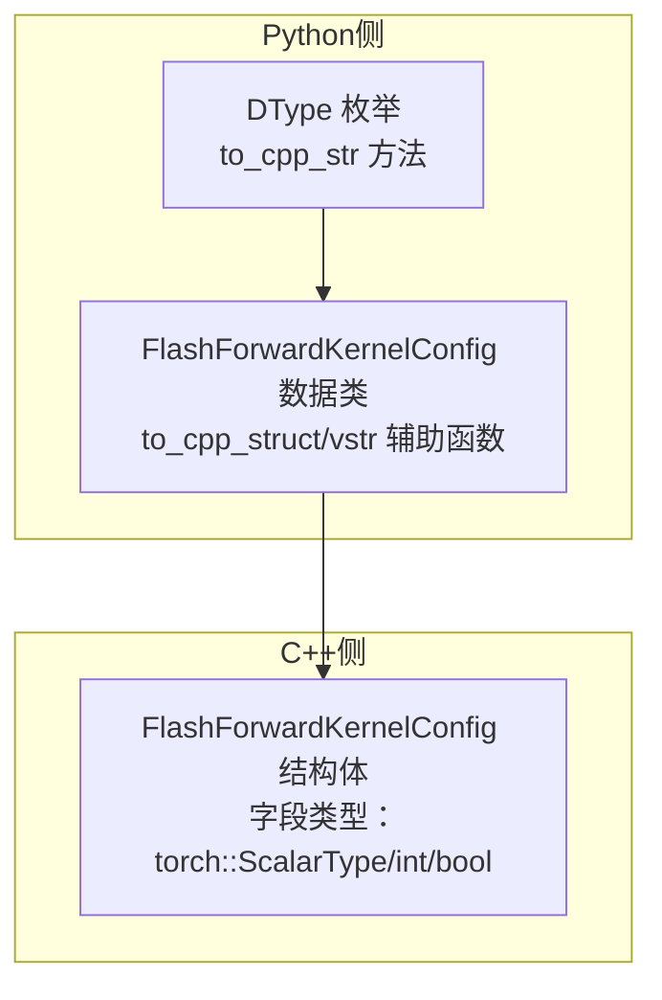
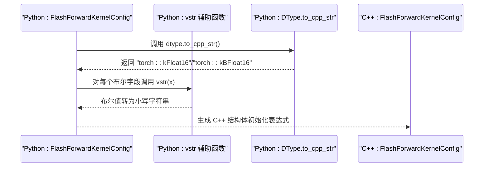
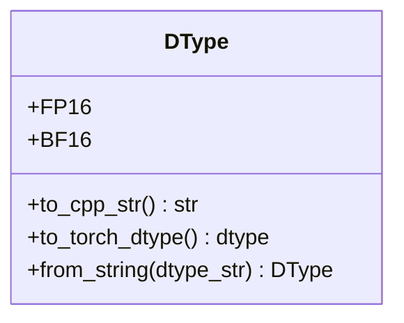
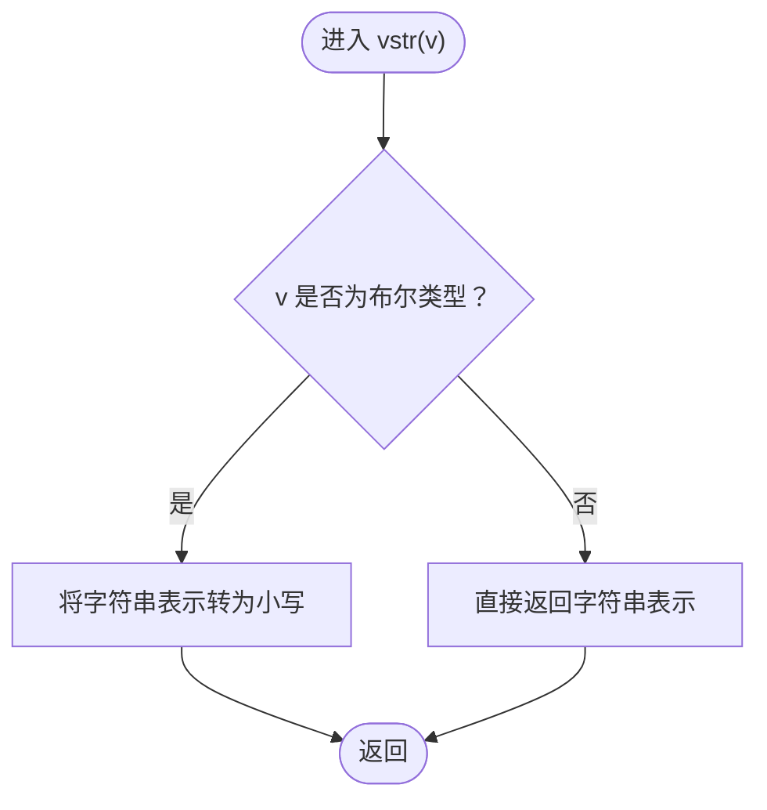
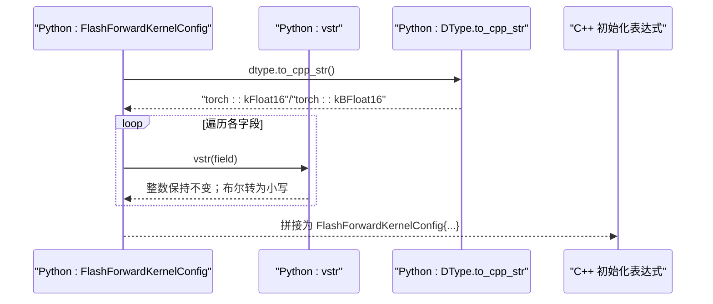
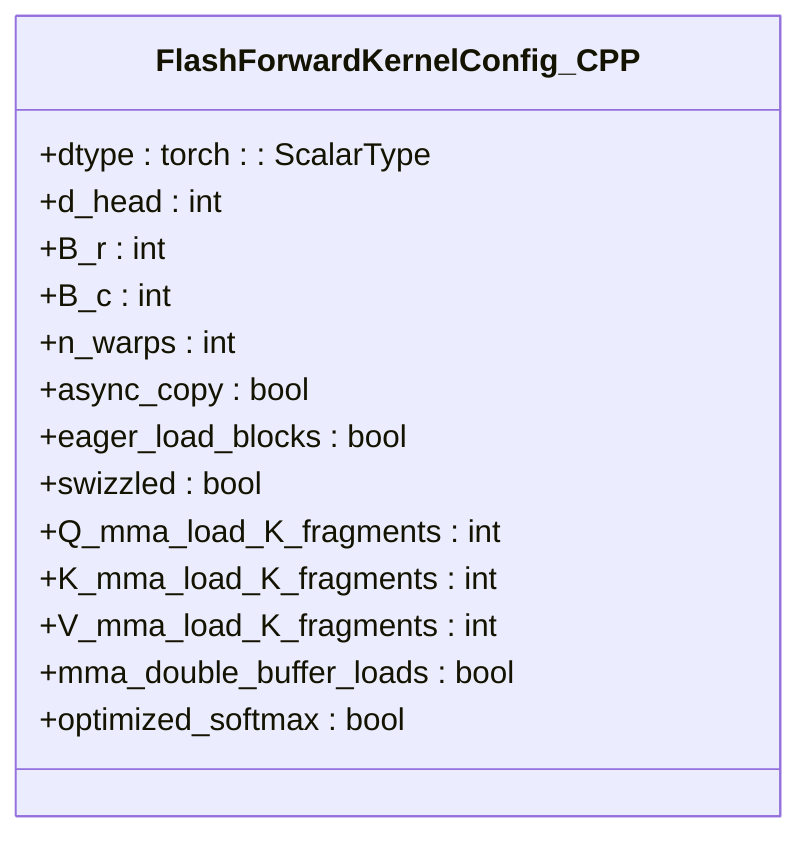

# 数据类型转换机制

<cite>
**本文引用的文件**
- [py/flash_helpers/kernel_configs.py](file://py/flash_helpers/kernel_configs.py)
- [src/include/flash_attention.cuh](file://src/include/flash_attention.cuh)
</cite>

## 目录
1. [引言](#引言)
2. [项目结构](#项目结构)
3. [核心组件](#核心组件)
4. [架构总览](#架构总览)
5. [详细组件分析](#详细组件分析)
6. [依赖关系分析](#依赖关系分析)
7. [性能考量](#性能考量)
8. [故障排查指南](#故障排查指南)
9. [结论](#结论)

## 引言
本文件聚焦于Python与C++之间配置映射的数据类型转换机制，特别是：
- DType枚举类的to_cpp_str方法如何将Python端的FP16/BF16枚举值转换为C++端对应的torch::kFloat16/torch::kBFloat16字面量；
- vstr辅助函数对布尔值的处理机制，如何将Python的True/False转换为C++的小写true/false；
- 通过一个包含DType.FP16、True、False和整数的FlashForwardKernelConfig实例，展示其to_cpp_struct方法如何被正确转换为C++结构体初始化表达式；
- 这种类型映射如何确保跨语言配置的一致性和类型安全性。

## 项目结构
围绕数据类型转换的核心代码位于Python侧的配置模块与C++侧的内核配置头文件中：
- Python侧：提供DType枚举、FlashForwardKernelConfig数据类及其to_cpp_struct方法，以及vstr辅助函数；
- C++侧：提供FlashForwardKernelConfig结构体，字段类型与Python侧一一对应，用于运行时配置传递。

图表来源
- [py/flash_helpers/kernel_configs.py](file://py/flash_helpers/kernel_configs.py#L1-L43)
- [py/flash_helpers/kernel_configs.py](file://py/flash_helpers/kernel_configs.py#L106-L167)
- [src/include/flash_attention.cuh](file://src/include/flash_attention.cuh#L30-L66)

章节来源
- [py/flash_helpers/kernel_configs.py](file://py/flash_helpers/kernel_configs.py#L1-L43)
- [src/include/flash_attention.cuh](file://src/include/flash_attention.cuh#L30-L66)

## 核心组件
- DType枚举类：定义FP16/BF16两个成员，并提供to_cpp_str方法，将其映射到C++侧的torch::kFloat16/torch::kBFloat16字面量。
- FlashForwardKernelConfig数据类：包含dtype、整数与布尔型等字段；to_cpp_struct方法负责生成C++结构体初始化表达式；内部vstr辅助函数负责布尔值的小写化。
- C++ FlashForwardKernelConfig结构体：字段类型与Python侧保持一致（dtype为torch::ScalarType，其余为int/bool），用于在编译期或运行期作为内核选择与参数传递的载体。

章节来源
- [py/flash_helpers/kernel_configs.py](file://py/flash_helpers/kernel_configs.py#L1-L43)
- [py/flash_helpers/kernel_configs.py](file://py/flash_helpers/kernel_configs.py#L106-L167)
- [src/include/flash_attention.cuh](file://src/include/flash_attention.cuh#L30-L66)

## 架构总览
下图展示了从Python配置到C++结构体的转换流程，以及DType与布尔值转换的关键点。

图表来源
- [py/flash_helpers/kernel_configs.py](file://py/flash_helpers/kernel_configs.py#L148-L167)
- [py/flash_helpers/kernel_configs.py](file://py/flash_helpers/kernel_configs.py#L149-L153)
- [py/flash_helpers/kernel_configs.py](file://py/flash_helpers/kernel_configs.py#L15-L21)
- [src/include/flash_attention.cuh](file://src/include/flash_attention.cuh#L30-L66)

## 详细组件分析

### DType枚举与to_cpp_str方法
- DType定义了FP16与BF16两个成员，并提供to_cpp_str方法，将Python端枚举值映射为C++侧的torch::kFloat16/torch::kBFloat16字面量字符串。
- 该映射保证了Python侧配置与C++侧类型系统的一致性，避免了手写字符串带来的拼写错误与不一致。

图表来源
- [py/flash_helpers/kernel_configs.py](file://py/flash_helpers/kernel_configs.py#L1-L43)

章节来源
- [py/flash_helpers/kernel_configs.py](file://py/flash_helpers/kernel_configs.py#L1-L43)

### vstr辅助函数与布尔值处理
- vstr在to_cpp_struct中被用于统一格式化字段值：
  - 若字段为布尔类型，则将其字符串表示转为小写（如True/False分别转为true/false）；
  - 否则直接返回原字符串表示。
- 这一机制确保了Python侧布尔值在生成C++结构体初始化表达式时，符合C++语法要求。

图表来源
- [py/flash_helpers/kernel_configs.py](file://py/flash_helpers/kernel_configs.py#L149-L153)

章节来源
- [py/flash_helpers/kernel_configs.py](file://py/flash_helpers/kernel_configs.py#L149-L153)

### FlashForwardKernelConfig.to_cpp_struct方法
- 该方法负责将Python侧的配置对象转换为C++结构体初始化表达式，具体步骤如下：
  1) 调用dtype.to_cpp_str()，将Python端的DType.FP16/BF16映射为C++侧的torch::kFloat16/torch::kBFloat16；
  2) 对所有字段进行格式化：整数字段直接转字符串；布尔字段通过vstr转为小写；
  3) 拼接为FlashForwardKernelConfig结构体初始化表达式。
- 该方法确保了Python侧配置与C++侧结构体字段类型的严格对应，避免类型不匹配导致的编译或运行时错误。

图表来源
- [py/flash_helpers/kernel_configs.py](file://py/flash_helpers/kernel_configs.py#L148-L167)
- [py/flash_helpers/kernel_configs.py](file://py/flash_helpers/kernel_configs.py#L149-L153)
- [py/flash_helpers/kernel_configs.py](file://py/flash_helpers/kernel_configs.py#L15-L21)

章节来源
- [py/flash_helpers/kernel_configs.py](file://py/flash_helpers/kernel_configs.py#L148-L167)

### C++结构体字段与Python配置的类型一致性
- C++侧FlashForwardKernelConfig结构体字段包括：
  - dtype: torch::ScalarType（与Python端DType映射一致）
  - d_head/B_r/B_c/n_warps/Q_mma_load_K_tiles/K_mma_load_K_tiles/V_mma_load_K_tiles: int
  - async_copy/eager_load_blocks/swizzled/mma_double_buffer_loads/optimized_softmax: bool
- Python侧FlashForwardKernelConfig数据类字段与之完全对应，确保跨语言配置的类型安全与一致性。

图表来源
- [src/include/flash_attention.cuh](file://src/include/flash_attention.cuh#L30-L66)

章节来源
- [src/include/flash_attention.cuh](file://src/include/flash_attention.cuh#L30-L66)

## 依赖关系分析
- Python侧DType与FlashForwardKernelConfig共同依赖torch::ScalarType语义（通过to_cpp_str映射），并由C++侧FlashForwardKernelConfig结构体承载；
- to_cpp_struct方法依赖DType.to_cpp_str与vstr辅助函数，二者共同保证了类型与字面量格式的正确性；
- C++侧结构体字段类型与Python侧数据类字段类型一一对应，形成稳定的跨语言契约。

图表来源
- [py/flash_helpers/kernel_configs.py](file://py/flash_helpers/kernel_configs.py#L148-L167)
- [py/flash_helpers/kernel_configs.py](file://py/flash_helpers/kernel_configs.py#L149-L153)
- [py/flash_helpers/kernel_configs.py](file://py/flash_helpers/kernel_configs.py#L15-L21)
- [src/include/flash_attention.cuh](file://src/include/flash_attention.cuh#L30-L66)

章节来源
- [py/flash_helpers/kernel_configs.py](file://py/flash_helpers/kernel_configs.py#L148-L167)
- [py/flash_helpers/kernel_configs.py](file://py/flash_helpers/kernel_configs.py#L149-L153)
- [py/flash_helpers/kernel_configs.py](file://py/flash_helpers/kernel_configs.py#L15-L21)
- [src/include/flash_attention.cuh](file://src/include/flash_attention.cuh#L30-L66)

## 性能考量
- 类型映射的开销极低：仅涉及字符串拼接与简单条件判断，不会引入额外的计算成本；
- 通过统一的to_cpp_str与vstr机制，减少手写字符串的错误率，间接提升构建与调试效率；
- 字段顺序与类型严格对应，有助于在编译期尽早发现配置不一致问题，降低运行时风险。

## 故障排查指南
- 若出现C++编译错误提示“未识别的字面量”或“类型不匹配”，请检查：
  - DType枚举是否包含目标值，且to_cpp_str返回的C++字面量是否与当前torch版本兼容；
  - 布尔字段是否通过vstr进行了小写化；
  - FlashForwardKernelConfig字段顺序与数量是否与C++结构体定义一致。
- 若解析历史内核名称失败，请确认：
  - 内核名称中包含的类型标注格式是否符合预期（例如“(c10::ScalarType)”、“(int)”、“(bool)”前缀）；
  - 解析逻辑是否能正确识别并转换布尔值与整数值。

章节来源
- [py/flash_helpers/kernel_configs.py](file://py/flash_helpers/kernel_configs.py#L217-L248)
- [py/flash_helpers/kernel_configs.py](file://py/flash_helpers/kernel_configs.py#L188-L195)

## 结论
通过DType.to_cpp_str与vstr辅助函数，Python侧配置能够稳定、可读地映射到C++侧的结构体初始化表达式。该机制确保了：
- Python端FP16/BF16与C++端torch::kFloat16/torch::kBFloat16的精确对应；
- Python端布尔值在C++侧以true/false字面量形式出现，满足语法要求；
- 字段类型与顺序严格一致，显著提升了跨语言配置的一致性与类型安全性。