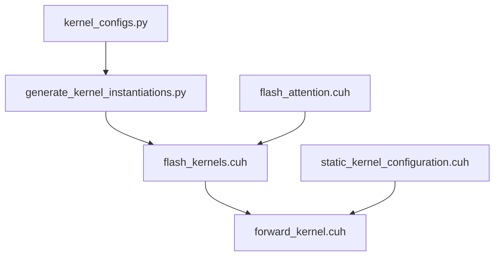
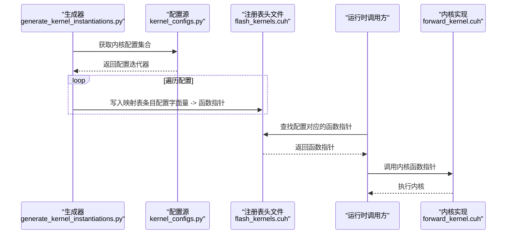
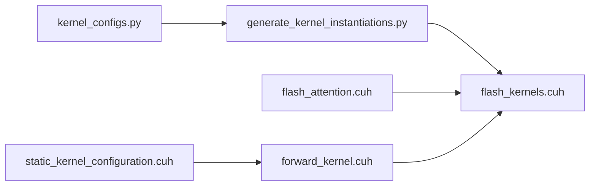

# 代码生成前言部分

<cite>
**本文引用的文件列表**
- [generate_kernel_instantiations.py](file://tools/build/generate_kernel_instantiations.py)
- [flash_kernels.cuh](file://src/include/flash_kernels.cuh)
- [flash_attention.cuh](file://src/include/flash_attention.cuh)
- [forward_kernel.cuh](file://src/include/forward_kernel.cuh)
- [static_kernel_configuration.cuh](file://src/include/static_kernel_configuration.cuh)
- [kernel_configs.py](file://py/flash_helpers/kernel_configs.py)
- [.clang-format](file://.clang-format)
</cite>

## 目录
1. [引言](#引言)
2. [项目结构与定位](#项目结构与定位)
3. [核心组件：preamble 的构成与作用](#核心组件preamble-的构成与作用)
4. [架构总览：从生成器到运行时查找](#架构总览从生成器到运行时查找)
5. [详细组件分析：preamble 的语法与数据结构](#详细组件分析preamble-的语法与数据结构)
6. [依赖关系分析：头文件包含与命名空间封装](#依赖关系分析头文件包含与命名空间封装)
7. [性能与可维护性考量](#性能与可维护性考量)
8. [故障排查指南](#故障排查指南)
9. [结论](#结论)

## 引言
本节聚焦于内核配置代码生成中的“前言”部分，即由工具脚本生成的 C++ 头文件顶部区域（preamble）。该区域负责：
- 定义头文件保护，避免重复包含
- 声明必要的外部依赖（标准库与项目内部头文件）
- 将所有符号置于统一的命名空间下，避免污染全局命名空间
- 定义映射表类型，将编译期配置与运行时内核实例绑定
- 通过函数指针 typedef 提供统一调用入口，便于后续查找与分发

上述职责共同支撑了“编译时配置查找”的能力：在编译阶段生成一份静态映射表，运行时根据输入配置在该映射中快速定位对应的内核实例化函数。

## 项目结构与定位
- 工具脚本位于 tools/build/generate_kernel_instantiations.py，负责扫描内核配置并生成 src/include/flash_kernels.cuh
- 生成的头文件 flash_kernels.cuh 作为“内核注册表”，为上层调用者提供统一入口
- 运行时内核实现位于 src/include/forward_kernel.cuh，模板参数由静态配置类 StaticForwardKernelConfig 指定
- 内核配置来源位于 py/flash_helpers/kernel_configs.py，提供配置枚举、序列化与过滤逻辑

图表来源
- [generate_kernel_instantiations.py](file://tools/build/generate_kernel_instantiations.py#L1-L57)
- [flash_kernels.cuh](file://src/include/flash_kernels.cuh#L1-L187)
- [forward_kernel.cuh](file://src/include/forward_kernel.cuh#L1-L207)
- [flash_attention.cuh](file://src/include/flash_attention.cuh#L1-L110)
- [static_kernel_configuration.cuh](file://src/include/static_kernel_configuration.cuh#L1-L294)
- [kernel_configs.py](file://py/flash_helpers/kernel_configs.py#L1-L486)

章节来源
- [generate_kernel_instantiations.py](file://tools/build/generate_kernel_instantiations.py#L1-L57)
- [flash_kernels.cuh](file://src/include/flash_kernels.cuh#L1-L187)
- [kernel_configs.py](file://py/flash_helpers/kernel_configs.py#L457-L463)

## 核心组件：preamble 的构成与作用
preamble 是生成器在写入 flash_kernels.cuh 文件时输出的头部内容，其主要组成如下：
- 头文件保护：防止重复包含
- 标准库依赖：包含 <map> 以支持 std::map
- 项目头文件依赖：包含 flash_attention.cuh 与 forward_kernel.cuh
- 命名空间：将所有符号置于 flash 命名空间
- 类型别名：typedef void (*forward_kernel_fn)(const ForwardKernelArgs)，用于统一内核函数签名
- 映射表类型与初始化：std::map<FlashForwardKernelConfig, forward_kernel_fn> forward_kernels = {...}

作用总结：
- 为编译期配置提供“键-值”映射，键是 FlashForwardKernelConfig，值是对应内核实例化函数的指针
- 通过统一的命名空间与类型别名，简化上层调用与扩展
- 为后续运行时按配置查找内核实例化提供基础数据结构

章节来源
- [generate_kernel_instantiations.py](file://tools/build/generate_kernel_instantiations.py#L13-L31)
- [flash_kernels.cuh](file://src/include/flash_kernels.cuh#L1-L187)

## 架构总览：从生成器到运行时查找
生成流程：
- 读取内核配置集合（来自 kernel_configs.py）
- 遍历每个配置，将其转换为 C++ 结构体字面量与对应的内核函数模板实例化
- 写入 flash_kernels.cuh 的映射表条目，形成静态注册表

运行时查找：
- 上层根据输入配置构造 FlashForwardKernelConfig
- 在 flash_kernels.cuh 中的 forward_kernels 映射中查找对应函数指针
- 调用该指针完成内核执行

图表来源
- [generate_kernel_instantiations.py](file://tools/build/generate_kernel_instantiations.py#L34-L53)
- [kernel_configs.py](file://py/flash_helpers/kernel_configs.py#L457-L463)
- [flash_kernels.cuh](file://src/include/flash_kernels.cuh#L1-L187)
- [forward_kernel.cuh](file://src/include/forward_kernel.cuh#L85-L204)

章节来源
- [generate_kernel_instantiations.py](file://tools/build/generate_kernel_instantiations.py#L34-L53)
- [flash_kernels.cuh](file://src/include/flash_kernels.cuh#L1-L187)

## 详细组件分析：preamble 的语法与数据结构
- 头文件保护与注释
  - 使用标准的 #pragma once 防止重复包含
  - 注释说明该文件由 generate_kernel_instantiations.py 自动生成
- 标准库与项目头文件包含
  - 包含 <map> 以使用 std::map
  - 包含项目头文件 flash_attention.cuh 与 forward_kernel.cuh，确保类型与内核声明可见
- 命名空间封装
  - 所有类型与变量均置于 flash 命名空间，避免全局污染
- 函数指针 typedef
  - typedef void (*forward_kernel_fn)(const ForwardKernelArgs) 定义统一的内核函数签名
- 映射表类型与初始化
  - std::map<FlashForwardKernelConfig, forward_kernel_fn> forward_kernels
  - 初始化列表中每项为 {配置字面量, &内核模板实例化函数指针}
  - 生成器会逐条写入配置字面量与对应的函数指针

C++ 语法要点：
- std::map 键类型为 FlashForwardKernelConfig，要求该类型具备可比较性（例如重载 operator<），以满足 map 的排序与查找需求
- 函数指针类型 forward_kernel_fn 与 ForwardKernelArgs 的匹配保证了调用接口的一致性
- 生成器通过 kernel_configs.py 的 to_cpp_struct() 与 kernel_name() 方法，将配置对象序列化为 C++ 字面量与函数名

章节来源
- [generate_kernel_instantiations.py](file://tools/build/generate_kernel_instantiations.py#L13-L31)
- [flash_kernels.cuh](file://src/include/flash_kernels.cuh#L1-L187)
- [flash_attention.cuh](file://src/include/flash_attention.cuh#L1-L110)
- [forward_kernel.cuh](file://src/include/forward_kernel.cuh#L1-L207)
- [kernel_configs.py](file://py/flash_helpers/kernel_configs.py#L106-L175)

## 依赖关系分析：头文件包含与命名空间封装
- 生成器侧依赖
  - 依赖 kernel_configs.py 的 get_kernels_to_build() 提供配置集合
  - 依赖 FlashForwardKernelConfig 的 to_cpp_struct() 与 kernel_name() 生成 C++ 字面量与函数名
- 生成目标侧依赖
  - flash_kernels.cuh 依赖 flash_attention.cuh（ForwardKernelArgs、FlashForwardKernelConfig）与 forward_kernel.cuh（内核函数签名）
  - forward_kernel.cuh 依赖 static_kernel_configuration.cuh（StaticForwardKernelConfig 等静态配置）
- 命名空间一致性
  - 所有头文件均在 flash 命名空间中声明，确保生成的映射表与内核实现的符号一致

图表来源
- [generate_kernel_instantiations.py](file://tools/build/generate_kernel_instantiations.py#L1-L57)
- [flash_kernels.cuh](file://src/include/flash_kernels.cuh#L1-L187)
- [flash_attention.cuh](file://src/include/flash_attention.cuh#L1-L110)
- [forward_kernel.cuh](file://src/include/forward_kernel.cuh#L1-L207)
- [static_kernel_configuration.cuh](file://src/include/static_kernel_configuration.cuh#L1-L294)
- [kernel_configs.py](file://py/flash_helpers/kernel_configs.py#L457-L463)

章节来源
- [kernel_configs.py](file://py/flash_helpers/kernel_configs.py#L106-L175)
- [flash_kernels.cuh](file://src/include/flash_kernels.cuh#L1-L187)
- [forward_kernel.cuh](file://src/include/forward_kernel.cuh#L1-L207)

## 性能与可维护性考量
- 编译时查找的优势
  - 通过静态映射表在编译期确定配置与内核实例化的对应关系，运行时查找为 O(log N)（基于 std::map 的有序结构）
  - 无需运行时反射或动态链接，减少启动开销
- 可维护性
  - 生成器集中管理配置到函数指针的映射，新增配置只需扩展配置集合与生成逻辑
  - 统一的命名空间与类型别名降低耦合度，便于扩展新内核族
- 编码规范遵循
  - 项目采用 clang-format，包含顺序与排序策略明确，生成的头文件应遵循该规范
  - 生成器本身未显式处理 clang-format，但生成内容与项目头文件风格一致（系统头文件优先、项目头文件次之）

章节来源
- [.clang-format](file://.clang-format#L1-L21)
- [generate_kernel_instantiations.py](file://tools/build/generate_kernel_instantiations.py#L13-L31)

## 故障排查指南
- 生成失败或映射不完整
  - 检查 kernel_configs.py 的 get_kernels_to_build() 是否返回预期配置集合
  - 确认 FlashForwardKernelConfig 的 to_cpp_struct() 输出是否符合 C++ 字面量格式
- 编译错误：找不到类型或函数
  - 确认 flash_kernels.cuh 的包含顺序与依赖头文件存在且路径正确
  - 确保 flash_attention.cuh 与 forward_kernel.cuh 已被包含
- 运行时查找失败
  - 确认输入配置与映射表键类型 FlashForwardKernelConfig 的比较逻辑一致（operator<）
  - 检查命名空间是否正确（flash 命名空间）
- 代码风格问题
  - 若使用 clang-format，建议在生成后对生成文件进行格式化，确保包含顺序与缩进符合项目规范

章节来源
- [kernel_configs.py](file://py/flash_helpers/kernel_configs.py#L106-L175)
- [flash_kernels.cuh](file://src/include/flash_kernels.cuh#L1-L187)
- [flash_attention.cuh](file://src/include/flash_attention.cuh#L1-L110)
- [forward_kernel.cuh](file://src/include/forward_kernel.cuh#L1-L207)
- [.clang-format](file://.clang-format#L1-L21)

## 结论
preamble 在内核配置代码生成中承担了“基础设施”的角色：它以最小的样板代码定义了头文件保护、依赖声明、命名空间封装与映射表类型，从而为“编译时配置查找”提供了稳定、可扩展的数据结构基础。配合生成器与配置源，该机制实现了从配置到内核实例化的自动化映射，既提升了可维护性，也保证了运行时的高效查找。