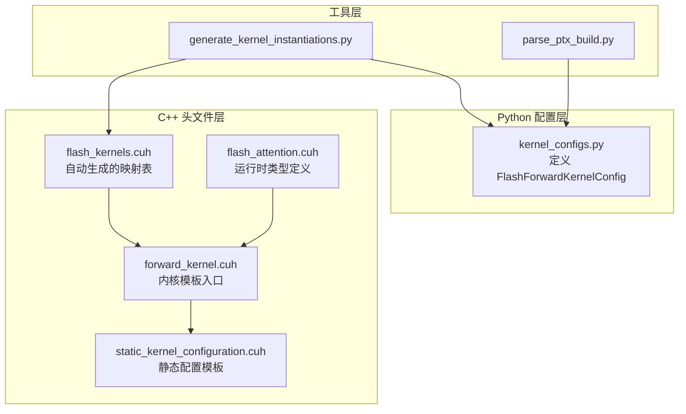
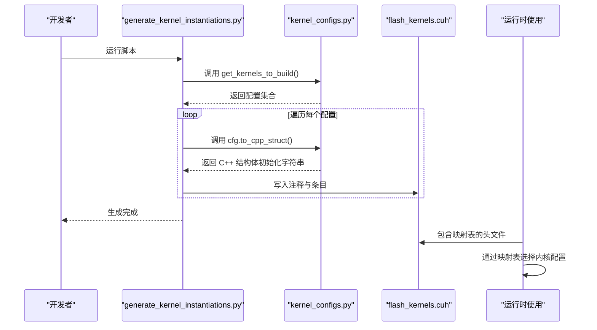
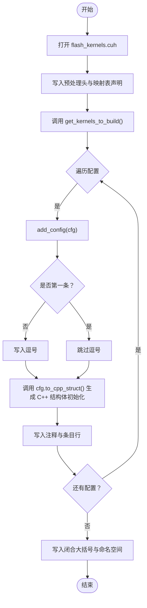
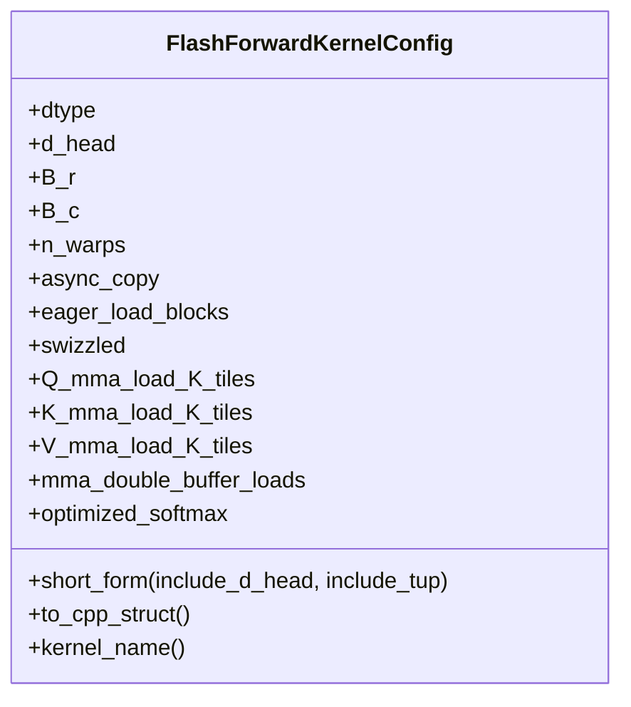
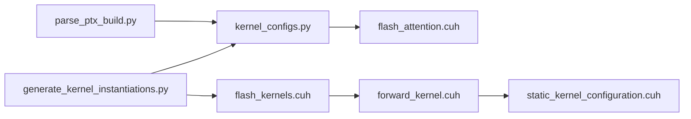

# 内核配置代码生成流程

<cite>
**本文引用的文件**
- [tools/build/generate_kernel_instantiations.py](file://tools/build/generate_kernel_instantiations.py)
- [py/flash_helpers/kernel_configs.py](file://py/flash_helpers/kernel_configs.py)
- [src/include/flash_kernels.cuh](file://src/include/flash_kernels.cuh)
- [src/include/flash_attention.cuh](file://src/include/flash_attention.cuh)
- [src/include/forward_kernel.cuh](file://src/include/forward_kernel.cuh)
- [src/include/static_kernel_configuration.cuh](file://src/include/static_kernel_configuration.cuh)
- [tools/build/parse_ptx_build.py](file://tools/build/parse_ptx_build.py)
</cite>

## 目录
1. [简介](#简介)
2. [项目结构](#项目结构)
3. [核心组件](#核心组件)
4. [架构总览](#架构总览)
5. [详细组件分析](#详细组件分析)
6. [依赖关系分析](#依赖关系分析)
7. [性能考量](#性能考量)
8. [故障排查指南](#故障排查指南)
9. [结论](#结论)
10. [附录](#附录)

## 简介
本文件围绕“内核配置代码生成流程”展开，聚焦于脚本 generate_kernel_instantiations.py 如何自动化生成 C++ 映射表，将 Python 配置类转换为 C++ 结构体初始化语法，并写入 flash_kernels.cuh 文件。文档详细说明：
- 从读取 Python 配置类到写入 flash_kernels.cuh 的完整流程；
- main 函数如何调用 get_kernels_to_build 获取所有有效配置；
- 通过 add_config 逐个生成 C++ 代码片段；
- preamble 字符串的构造方式与映射表结构定义；
- 使用 to_cpp_struct 方法将 Python 对象转换为 C++ 结构体初始化语法；
- 保证生成代码的语法正确性与可读性的策略。

## 项目结构
该仓库包含多版本内核实现与工具链，其中与本主题直接相关的关键路径如下：
- 工具层：tools/build/generate_kernel_instantiations.py 负责生成 C++ 映射表；
- Python 配置层：py/flash_helpers/kernel_configs.py 定义 FlashForwardKernelConfig 及其转换方法；
- 头文件层：src/include/flash_kernels.cuh 为自动生成的目标文件；其他头文件定义运行时所需的类型与模板配置；
- 分析工具：tools/build/parse_ptx_build.py 展示了如何解析编译日志并回推配置，辅助验证生成结果。

图表来源
- [tools/build/generate_kernel_instantiations.py](file://tools/build/generate_kernel_instantiations.py#L1-L57)
- [py/flash_helpers/kernel_configs.py](file://py/flash_helpers/kernel_configs.py#L106-L167)
- [src/include/flash_kernels.cuh](file://src/include/flash_kernels.cuh#L1-L187)
- [src/include/flash_attention.cuh](file://src/include/flash_attention.cuh#L30-L110)
- [src/include/forward_kernel.cuh](file://src/include/forward_kernel.cuh#L85-L207)
- [src/include/static_kernel_configuration.cuh](file://src/include/static_kernel_configuration.cuh#L104-L294)
- [tools/build/parse_ptx_build.py](file://tools/build/parse_ptx_build.py#L150-L210)

章节来源
- [tools/build/generate_kernel_instantiations.py](file://tools/build/generate_kernel_instantiations.py#L1-L57)
- [py/flash_helpers/kernel_configs.py](file://py/flash_helpers/kernel_configs.py#L106-L167)
- [src/include/flash_kernels.cuh](file://src/include/flash_kernels.cuh#L1-L187)

## 核心组件
- generate_kernel_instantiations.py
  - 作用：打开目标文件 flash_kernels.cuh，写入预处理头与映射表结构定义，遍历 Python 配置集合，逐条生成 C++ 条目。
  - 关键点：preamble 构造、add_config 回调、to_cpp_struct 输出、逗号分隔与换行控制。
- kernel_configs.py
  - 作用：定义 FlashForwardKernelConfig 数据类，提供 short_form、to_cpp_struct、kernel_name 等方法，以及 get_kernels_to_build 等筛选器。
  - 关键点：to_cpp_struct 将 Python 值序列化为 C++ 结构体初始化语法；short_form 用于注释与可读性。
- flash_kernels.cuh
  - 作用：自动生成的映射表，键为 FlashForwardKernelConfig，值为对应内核函数指针模板实例化。
  - 关键点：命名空间 flash、typedef 前向函数指针、std::map 初始化列表、逗号分隔与闭合。
- flash_attention.cuh / forward_kernel.cuh / static_kernel_configuration.cuh
  - 作用：定义运行时类型、内核模板入口与静态配置模板，支撑映射表中条目的函数指针模板实例化。

章节来源
- [tools/build/generate_kernel_instantiations.py](file://tools/build/generate_kernel_instantiations.py#L13-L57)
- [py/flash_helpers/kernel_configs.py](file://py/flash_helpers/kernel_configs.py#L106-L167)
- [src/include/flash_kernels.cuh](file://src/include/flash_kernels.cuh#L1-L187)
- [src/include/flash_attention.cuh](file://src/include/flash_attention.cuh#L30-L110)
- [src/include/forward_kernel.cuh](file://src/include/forward_kernel.cuh#L85-L207)
- [src/include/static_kernel_configuration.cuh](file://src/include/static_kernel_configuration.cuh#L104-L294)

## 架构总览
下图展示了从 Python 配置到 C++ 映射表的端到端流程，以及生成文件在运行时的使用位置。

图表来源
- [tools/build/generate_kernel_instantiations.py](file://tools/build/generate_kernel_instantiations.py#L13-L57)
- [py/flash_helpers/kernel_configs.py](file://py/flash_helpers/kernel_configs.py#L457-L463)
- [src/include/flash_kernels.cuh](file://src/include/flash_kernels.cuh#L1-L187)

## 详细组件分析

### 组件A：generate_kernel_instantiations.py（主流程）
- 文件定位与职责
  - 打开 ./src/include/flash_kernels.cuh 并写入预处理头与映射表结构定义；
  - 通过 get_kernels_to_build 获取配置集合；
  - 逐个调用 add_config 生成条目，使用 cfg.to_cpp_struct 输出 C++ 结构体初始化语法；
  - 控制逗号分隔与换行，保证语法正确性与可读性。
- 关键实现要点
  - preamble 构造：包含注释、头文件保护、包含依赖头文件、命名空间、typedef 前向函数指针、std::map 声明与起始大括号；
  - add_config 行为：打印短形式配置（便于调试）、首条不加前导逗号、其余条目加逗号、写入注释行与条目行；
  - 条目格式：键为 FlashForwardKernelConfig 结构体初始化，值为模板函数指针实例化；
  - 结束写入：闭合 std::map 的大括号与命名空间。
- 代码片段路径
  - 主流程与文件写入：[tools/build/generate_kernel_instantiations.py](file://tools/build/generate_kernel_instantiations.py#L13-L57)
  - 预处理头与映射表结构定义：[tools/build/generate_kernel_instantiations.py](file://tools/build/generate_kernel_instantiations.py#L13-L33)
  - 条目生成与逗号控制：[tools/build/generate_kernel_instantiations.py](file://tools/build/generate_kernel_instantiations.py#L34-L50)

图表来源
- [tools/build/generate_kernel_instantiations.py](file://tools/build/generate_kernel_instantiations.py#L13-L57)

章节来源
- [tools/build/generate_kernel_instantiations.py](file://tools/build/generate_kernel_instantiations.py#L13-L57)

### 组件B：kernel_configs.py（配置模型与转换）
- 类型与方法
  - FlashForwardKernelConfig：包含 dtype、d_head、B_r、B_c、n_warps、async_copy、eager_load_blocks、swizzled、Q/K/V_mma_load_K_tiles、mma_double_buffer_loads、optimized_softmax 等字段；
  - short_form：生成人类可读的配置短形式字符串，用于注释与调试；
  - to_cpp_struct：将配置对象序列化为 C++ 结构体初始化语法字符串；
  - kernel_name：返回内核函数名；
  - get_kernels_to_build：汇总自动调优与进度推进配置，去重并排序后返回。
- 代码片段路径
  - 数据类定义与方法：[py/flash_helpers/kernel_configs.py](file://py/flash_helpers/kernel_configs.py#L106-L167)
  - 短形式与结构体转换：[py/flash_helpers/kernel_configs.py](file://py/flash_helpers/kernel_configs.py#L122-L163)
  - 配置集合生成：[py/flash_helpers/kernel_configs.py](file://py/flash_helpers/kernel_configs.py#L457-L463)

图表来源
- [py/flash_helpers/kernel_configs.py](file://py/flash_helpers/kernel_configs.py#L106-L167)

章节来源
- [py/flash_helpers/kernel_configs.py](file://py/flash_helpers/kernel_configs.py#L106-L167)
- [py/flash_helpers/kernel_configs.py](file://py/flash_helpers/kernel_configs.py#L457-L463)

### 组件C：flash_kernels.cuh（生成目标文件）
- 结构与内容
  - 预处理头：注释、头文件保护、包含依赖头文件；
  - 命名空间 flash；
  - typedef 前向函数指针；
  - std::map<FlashForwardKernelConfig, forward_kernel_fn> forward_kernels = { ... }；
  - 每个条目由键（C++ 结构体初始化）与值（模板函数指针实例化）组成；
  - 闭合大括号与命名空间。
- 代码片段路径
  - 预处理头与声明：[src/include/flash_kernels.cuh](file://src/include/flash_kernels.cuh#L1-L15)
  - 映射表主体与条目示例：[src/include/flash_kernels.cuh](file://src/include/flash_kernels.cuh#L16-L186)
  - 闭合与命名空间：[src/include/flash_kernels.cuh](file://src/include/flash_kernels.cuh#L186-L187)

章节来源
- [src/include/flash_kernels.cuh](file://src/include/flash_kernels.cuh#L1-L187)

### 组件D：运行时支撑（类型与模板）
- flash_attention.cuh
  - 定义 FlashForwardKernelConfig 结构体（与 Python 数据类字段一致），并提供比较运算符与内存占用估算等方法；
- forward_kernel.cuh
  - 定义 flash_forward_kernel 模板内核入口，模板参数由 StaticForwardKernelConfig 提供；
- static_kernel_configuration.cuh
  - 定义 StaticForwardKernelConfig，将 FlashForwardKernelConfig 转换为编译期常量配置，派生出 Q/K/V 张量布局、GEMM 参数、寄存器/共享内存布局等；
- 代码片段路径
  - 运行时类型定义：[src/include/flash_attention.cuh](file://src/include/flash_attention.cuh#L30-L110)
  - 内核模板入口：[src/include/forward_kernel.cuh](file://src/include/forward_kernel.cuh#L85-L207)
  - 静态配置模板：[src/include/static_kernel_configuration.cuh](file://src/include/static_kernel_configuration.cuh#L104-L294)

章节来源
- [src/include/flash_attention.cuh](file://src/include/flash_attention.cuh#L30-L110)
- [src/include/forward_kernel.cuh](file://src/include/forward_kernel.cuh#L85-L207)
- [src/include/static_kernel_configuration.cuh](file://src/include/static_kernel_configuration.cuh#L104-L294)

### 组件E：解析与验证（可选）
- parse_ptx_build.py
  - 解析 ptxas 编译日志，提取函数名、寄存器使用、栈帧与溢出信息；
  - 通过 parse_kernel_name_into_config 将函数名反推为 FlashForwardKernelConfig；
  - 支持输出 CSV 或格式化文本，便于对比不同配置的资源消耗。
- 代码片段路径
  - 日志解析与函数信息提取：[tools/build/parse_ptx_build.py](file://tools/build/parse_ptx_build.py#L31-L142)
  - 名称解析与配置回推：[tools/build/parse_ptx_build.py](file://tools/build/parse_ptx_build.py#L150-L210)

章节来源
- [tools/build/parse_ptx_build.py](file://tools/build/parse_ptx_build.py#L31-L142)
- [tools/build/parse_ptx_build.py](file://tools/build/parse_ptx_build.py#L150-L210)

## 依赖关系分析
- generate_kernel_instantiations.py 依赖 kernel_configs.py 中的 get_kernels_to_build 与 FlashForwardKernelConfig 的 to_cpp_struct；
- 生成的 flash_kernels.cuh 在运行时被 forward_kernel.cuh 引用，通过 StaticForwardKernelConfig 将配置映射到具体模板实例；
- parse_ptx_build.py 通过名称解析回推配置，可用于验证生成的映射表是否覆盖预期配置集。

图表来源
- [tools/build/generate_kernel_instantiations.py](file://tools/build/generate_kernel_instantiations.py#L8-L10)
- [py/flash_helpers/kernel_configs.py](file://py/flash_helpers/kernel_configs.py#L106-L167)
- [src/include/flash_kernels.cuh](file://src/include/flash_kernels.cuh#L1-L187)
- [src/include/forward_kernel.cuh](file://src/include/forward_kernel.cuh#L85-L207)
- [src/include/static_kernel_configuration.cuh](file://src/include/static_kernel_configuration.cuh#L104-L294)
- [tools/build/parse_ptx_build.py](file://tools/build/parse_ptx_build.py#L150-L210)

章节来源
- [tools/build/generate_kernel_instantiations.py](file://tools/build/generate_kernel_instantiations.py#L8-L10)
- [py/flash_helpers/kernel_configs.py](file://py/flash_helpers/kernel_configs.py#L106-L167)
- [src/include/flash_kernels.cuh](file://src/include/flash_kernels.cuh#L1-L187)
- [src/include/forward_kernel.cuh](file://src/include/forward_kernel.cuh#L85-L207)
- [src/include/static_kernel_configuration.cuh](file://src/include/static_kernel_configuration.cuh#L104-L294)
- [tools/build/parse_ptx_build.py](file://tools/build/parse_ptx_build.py#L150-L210)

## 性能考量
- 生成的映射表采用 std::map 键值对存储，键为 FlashForwardKernelConfig，值为模板函数指针实例化，便于运行时按配置查找对应内核；
- 通过 StaticForwardKernelConfig 将运行时配置转为编译期常量，减少运行时分支判断，提升性能；
- 自动生成避免手工维护映射表带来的遗漏或不一致风险，提高可扩展性与可维护性。

## 故障排查指南
- 生成文件未更新
  - 确认已执行 generate_kernel_instantiations.py 并具有写权限；
  - 检查脚本是否成功打开 ./src/include/flash_kernels.cuh 并写入；
  - 参考路径：[tools/build/generate_kernel_instantiations.py](file://tools/build/generate_kernel_instantiations.py#L13-L57)
- 生成条目语法错误
  - 确保 to_cpp_struct 输出的 C++ 结构体初始化语法与 FlashForwardKernelConfig 字段顺序一致；
  - 检查布尔值与枚举值的序列化是否符合 C++ 语法；
  - 参考路径：[py/flash_helpers/kernel_configs.py](file://py/flash_helpers/kernel_configs.py#L148-L163)
- 运行时无法匹配配置
  - 确认运行时使用的 FlashForwardKernelConfig 与生成文件中的键类型一致；
  - 检查比较运算符与排序逻辑是否影响查找；
  - 参考路径：[src/include/flash_attention.cuh](file://src/include/flash_attention.cuh#L67-L109)
- 验证生成结果
  - 使用 parse_ptx_build.py 解析编译日志，回推配置并比对生成映射表；
  - 参考路径：[tools/build/parse_ptx_build.py](file://tools/build/parse_ptx_build.py#L150-L210)

章节来源
- [tools/build/generate_kernel_instantiations.py](file://tools/build/generate_kernel_instantiations.py#L13-L57)
- [py/flash_helpers/kernel_configs.py](file://py/flash_helpers/kernel_configs.py#L148-L163)
- [src/include/flash_attention.cuh](file://src/include/flash_attention.cuh#L67-L109)
- [tools/build/parse_ptx_build.py](file://tools/build/parse_ptx_build.py#L150-L210)

## 结论
generate_kernel_instantiations.py 通过 Python 配置模型与 C++ 头文件生成机制，实现了从配置集合到运行时映射表的自动化生成。该流程以 to_cpp_struct 为核心，确保 Python 配置与 C++ 结构体初始化语法的一致性；通过 add_config 的条目生成与逗号控制，保障生成文件的语法正确性与可读性。结合运行时的 StaticForwardKernelConfig，最终形成高效的内核选择与实例化路径，提升了整体系统的可扩展性与可维护性。

## 附录
- 实际代码示例（以路径代替具体代码内容）
  - 预处理头与映射表声明构造：[tools/build/generate_kernel_instantiations.py](file://tools/build/generate_kernel_instantiations.py#L13-L33)
  - 条目生成与逗号控制：[tools/build/generate_kernel_instantiations.py](file://tools/build/generate_kernel_instantiations.py#L34-L50)
  - C++ 结构体初始化字符串生成：[py/flash_helpers/kernel_configs.py](file://py/flash_helpers/kernel_configs.py#L148-L163)
  - 映射表主体与条目示例：[src/include/flash_kernels.cuh](file://src/include/flash_kernels.cuh#L16-L186)