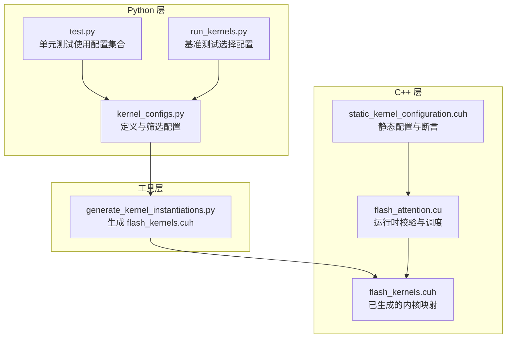
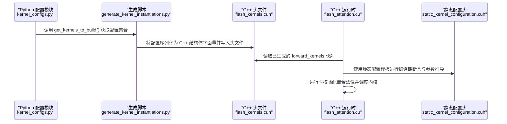
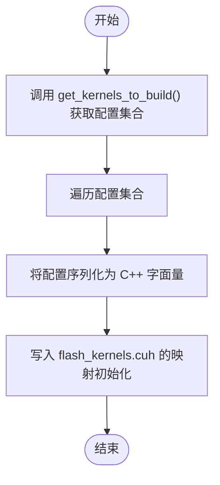
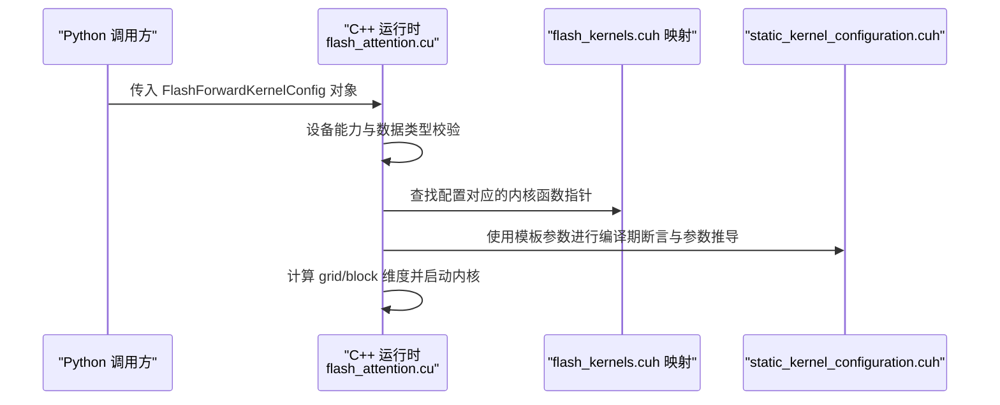
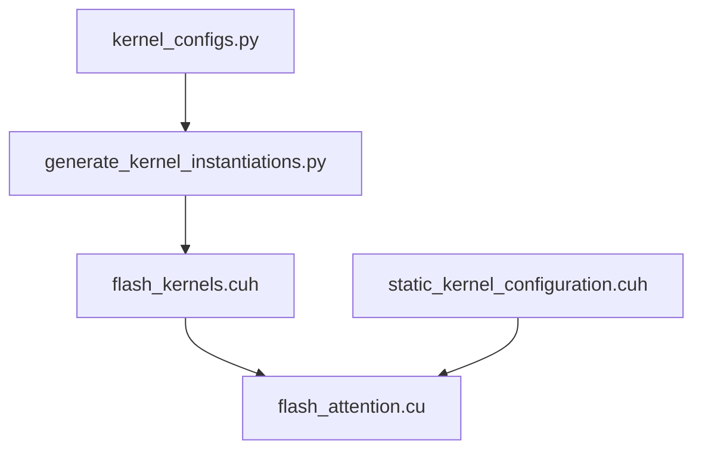

# 内核配置收集流程

<cite>
**本文引用的文件**
- [setup.py](file://setup.py)
- [py/setup.py](file://py/setup.py)
- [py/flash_helpers/kernel_configs.py](file://py/flash_helpers/kernel_configs.py)
- [tools/build/generate_kernel_instantiations.py](file://tools/build/generate_kernel_instantiations.py)
- [src/include/flash_kernels.cuh](file://src/include/flash_kernels.cuh)
- [src/include/static_kernel_configuration.cuh](file://src/include/static_kernel_configuration.cuh)
- [src/flash_attention.cu](file://src/flash_attention.cu)
- [py/flash_helpers/test/test.py](file://py/flash_helpers/test/test.py)
- [tools/benchmark/run_kernels.py](file://tools/benchmark/run_kernels.py)
- [README.md](file://README.md)
</cite>

## 目录
1. [简介](#简介)
2. [项目结构](#项目结构)
3. [核心组件](#核心组件)
4. [架构总览](#架构总览)
5. [详细组件分析](#详细组件分析)
6. [依赖关系分析](#依赖关系分析)
7. [性能考量](#性能考量)
8. [故障排查指南](#故障排查指南)
9. [结论](#结论)

## 简介
本文件围绕“内核配置收集流程”展开，重点说明 Python 端如何通过接口生成并筛选待构建的内核配置集合，并解释该流程如何实现 Python 与构建脚本的解耦；同时阐述配置筛选策略（如架构兼容性、数据类型支持）的实现方式；最后说明配置集合在代码生成中的作用及从定义到参与 C++ 代码生成的完整调用链路，并给出不同配置条件下的输出差异示例，强调其在自动化构建中的关键作用。

## 项目结构
该项目采用“Python 配置 + C++ 构建”的分层设计：
- Python 层：提供内核配置定义、筛选与导出接口，负责生成最终的配置集合。
- 工具层：通过 Python 脚本生成 C++ 头文件，将配置集合固化为编译期常量映射。
- C++ 层：在运行时根据传入的配置对象进行合法性校验与调度，确保只执行已生成的内核实例。

图表来源
- [py/flash_helpers/kernel_configs.py](file://py/flash_helpers/kernel_configs.py#L457-L486)
- [tools/build/generate_kernel_instantiations.py](file://tools/build/generate_kernel_instantiations.py#L1-L56)
- [src/include/flash_kernels.cuh](file://src/include/flash_kernels.cuh#L1-L187)
- [src/flash_attention.cu](file://src/flash_attention.cu#L1-L150)
- [src/include/static_kernel_configuration.cuh](file://src/include/static_kernel_configuration.cuh#L1-L294)
- [py/flash_helpers/test/test.py](file://py/flash_helpers/test/test.py#L1-L104)
- [tools/benchmark/run_kernels.py](file://tools/benchmark/run_kernels.py#L1-L159)

章节来源
- [README.md](file://README.md#L1-L63)
- [setup.py](file://setup.py#L1-L76)
- [py/setup.py](file://py/setup.py#L1-L20)

## 核心组件
- Python 配置模块：提供配置类、解析器、筛选器与集合生成器，统一管理内核配置的来源与过滤规则。
- 生成脚本：读取 Python 侧生成的配置集合，写入 C++ 头文件，形成编译期常量映射。
- C++ 运行时：在运行时对输入配置进行合法性检查，并从映射中查找对应内核入口，完成调度与执行。
- 测试与基准：通过 Python 层的配置集合驱动测试与基准，验证不同配置下的行为一致性。

章节来源
- [py/flash_helpers/kernel_configs.py](file://py/flash_helpers/kernel_configs.py#L102-L175)
- [tools/build/generate_kernel_instantiations.py](file://tools/build/generate_kernel_instantiations.py#L1-L56)
- [src/flash_attention.cu](file://src/flash_attention.cu#L1-L150)
- [src/include/flash_kernels.cuh](file://src/include/flash_kernels.cuh#L1-L187)

## 架构总览
下图展示了从 Python 配置生成到 C++ 运行时调度的完整链路，以及 Python 与构建脚本之间的解耦点。

图表来源
- [py/flash_helpers/kernel_configs.py](file://py/flash_helpers/kernel_configs.py#L457-L486)
- [tools/build/generate_kernel_instantiations.py](file://tools/build/generate_kernel_instantiations.py#L1-L56)
- [src/include/flash_kernels.cuh](file://src/include/flash_kernels.cuh#L1-L187)
- [src/flash_attention.cu](file://src/flash_attention.cu#L1-L150)
- [src/include/static_kernel_configuration.cuh](file://src/include/static_kernel_configuration.cuh#L1-L294)

## 详细组件分析

### Python 配置收集与筛选
- 配置集合生成
  - get_kernels_to_build：聚合多种配置来源（自动调优、进度推进等），去重并排序，返回最终待构建集合。
  - get_kernel_configs：基于环境变量或命令行参数选择不同的配置集合策略（全部、自动调优、按块大小推进、指定 B_r,B_c 等）。
- 筛选策略
  - should_autotune_config：对自动调优配置进行约束，排除不合法组合（如异步拷贝与某些加载策略的冲突、特定 B_r 下的 n_warps 限制、Q/K 加载块数不一致等）。
  - 数据类型支持：通过 DType 枚举与转换方法限定仅支持 FP16/BF16。
  - 架构兼容性：通过 C++ 运行时对设备计算能力进行检查，要求 SM_80 或更高。
- 解耦机制
  - Python 仅负责“定义与筛选”，不直接参与 C++ 编译细节；C++ 侧只依赖已生成的头文件映射，二者通过生成脚本解耦。

章节来源
- [py/flash_helpers/kernel_configs.py](file://py/flash_helpers/kernel_configs.py#L364-L387)
- [py/flash_helpers/kernel_configs.py](file://py/flash_helpers/kernel_configs.py#L389-L424)
- [py/flash_helpers/kernel_configs.py](file://py/flash_helpers/kernel_configs.py#L426-L456)
- [py/flash_helpers/kernel_configs.py](file://py/flash_helpers/kernel_configs.py#L457-L486)
- [src/flash_attention.cu](file://src/flash_attention.cu#L42-L57)

### 生成脚本与 C++ 头文件
- 生成逻辑
  - 读取 Python 侧 get_kernels_to_build 返回的配置集合；
  - 将每个配置转换为 C++ 结构体字面量，并写入 flash_kernels.cuh 的 std::map 初始化列表；
  - 生成的映射键为 FlashForwardKernelConfig，值为对应的内核函数指针模板实例。
- 作用
  - 将 Python 定义的配置集合固化为编译期常量映射，避免运行时动态生成开销；
  - 保证 C++ 侧只执行已生成的内核实例，提升安全性与可维护性。

图表来源
- [tools/build/generate_kernel_instantiations.py](file://tools/build/generate_kernel_instantiations.py#L1-L56)
- [py/flash_helpers/kernel_configs.py](file://py/flash_helpers/kernel_configs.py#L457-L486)
- [src/include/flash_kernels.cuh](file://src/include/flash_kernels.cuh#L1-L187)

章节来源
- [tools/build/generate_kernel_instantiations.py](file://tools/build/generate_kernel_instantiations.py#L1-L56)
- [src/include/flash_kernels.cuh](file://src/include/flash_kernels.cuh#L1-L187)

### C++ 运行时调度与静态配置
- 运行时校验
  - 接收来自 Python 的配置对象，转换为 C++ 配置结构体；
  - 检查设备计算能力、数据类型一致性、形状约束（如 B_r/B_c 整除）；
  - 在已生成的 forward_kernels 映射中查找对应内核入口。
- 静态配置与断言
  - 通过模板参数传递配置，编译期进行静态断言，确保加载片段数量、缓冲策略等满足硬件约束；
  - 基于配置推导线程块大小、共享内存布局等运行时参数。

图表来源
- [src/flash_attention.cu](file://src/flash_attention.cu#L1-L150)
- [src/include/flash_kernels.cuh](file://src/include/flash_kernels.cuh#L1-L187)
- [src/include/static_kernel_configuration.cuh](file://src/include/static_kernel_configuration.cuh#L1-L294)

章节来源
- [src/flash_attention.cu](file://src/flash_attention.cu#L1-L150)
- [src/include/static_kernel_configuration.cuh](file://src/include/static_kernel_configuration.cuh#L1-L294)

### 配置集合的迭代过程与在代码生成中的作用
- 迭代过程
  - Python 侧通过 get_kernels_to_build 产出配置集合；
  - 生成脚本逐个遍历配置，生成对应的 C++ 结构体字面量与函数指针条目；
  - 最终写入 flash_kernels.cuh，形成完整的 forward_kernels 映射。
- 作用
  - 作为 C++ 侧唯一可信的“可用内核清单”，避免运行时动态生成带来的不确定性；
  - 便于后续测试与基准脚本直接消费 Python 侧的配置集合，保持一致性。

章节来源
- [py/flash_helpers/kernel_configs.py](file://py/flash_helpers/kernel_configs.py#L457-L486)
- [tools/build/generate_kernel_instantiations.py](file://tools/build/generate_kernel_instantiations.py#L1-L56)
- [src/include/flash_kernels.cuh](file://src/include/flash_kernels.cuh#L1-L187)

### 不同配置条件下的输出差异与示例
以下示例展示不同配置条件对最终生成内核的影响（以短形式字符串表示配置特征）：
- 数据类型差异
  - FP16 与 BF16：分别生成两套内核实例，映射键包含 dtype 字段，最终在 C++ 侧区分处理。
- 块尺寸与并行度
  - B_r/B_c 与 n_warps：影响网格维度与寄存器占用，生成脚本会为每组组合生成独立条目。
- 加载策略与缓冲
  - 异步拷贝、预取块、Swizzle、Q/K/V 加载片段数、双缓冲等：这些布尔与整型字段共同决定生成的内核变体数量与行为。
- 自动调优与进度推进
  - 自动调优配置受 should_autotune_config 约束，部分组合会被过滤；
  - 进度推进配置按固定序列逐步增强特性，适合演示优化效果。

章节来源
- [py/flash_helpers/kernel_configs.py](file://py/flash_helpers/kernel_configs.py#L102-L175)
- [py/flash_helpers/kernel_configs.py](file://py/flash_helpers/kernel_configs.py#L364-L387)
- [py/flash_helpers/kernel_configs.py](file://py/flash_helpers/kernel_configs.py#L389-L424)
- [py/flash_helpers/kernel_configs.py](file://py/flash_helpers/kernel_configs.py#L426-L456)
- [src/include/flash_kernels.cuh](file://src/include/flash_kernels.cuh#L1-L187)

### 自动化构建中的关键作用
- Python 与构建脚本解耦
  - Python 仅负责“配置定义与筛选”，构建脚本负责“将配置固化为 C++ 头文件”，二者通过接口解耦，互不影响。
- 可重复与可审计
  - 生成的 C++ 头文件是确定性的，便于版本控制与回归测试；
  - 运行时仅执行已生成的内核，降低运行时错误风险。
- 可扩展性
  - 新增配置只需在 Python 侧扩展筛选与生成逻辑，无需修改 C++ 代码；
  - 通过环境变量或命令行参数灵活切换配置集合策略，适配不同场景（全量、调优、进度推进等）。

章节来源
- [py/flash_helpers/kernel_configs.py](file://py/flash_helpers/kernel_configs.py#L457-L486)
- [tools/build/generate_kernel_instantiations.py](file://tools/build/generate_kernel_instantiations.py#L1-L56)
- [py/flash_helpers/test/test.py](file://py/flash_helpers/test/test.py#L1-L104)
- [tools/benchmark/run_kernels.py](file://tools/benchmark/run_kernels.py#L1-L159)

## 依赖关系分析
- Python 配置模块依赖
  - DType 枚举与转换：用于数据类型支持与 C++ 字面量生成；
  - 配置类 FlashForwardKernelConfig：统一描述内核参数与行为特征；
  - 筛选函数 should_autotune_config：约束自动调优配置的合法性。
- 生成脚本依赖
  - 依赖 Python 配置模块提供的 get_kernels_to_build；
  - 输出 C++ 头文件 flash_kernels.cuh。
- C++ 运行时依赖
  - 依赖生成的 flash_kernels.cuh 中的映射；
  - 依赖 static_kernel_configuration.cuh 提供的编译期断言与参数推导；
  - 依赖 torch 与 CUDA 上下文进行输入校验与内核调度。

图表来源
- [py/flash_helpers/kernel_configs.py](file://py/flash_helpers/kernel_configs.py#L1-L486)
- [tools/build/generate_kernel_instantiations.py](file://tools/build/generate_kernel_instantiations.py#L1-L56)
- [src/include/flash_kernels.cuh](file://src/include/flash_kernels.cuh#L1-L187)
- [src/flash_attention.cu](file://src/flash_attention.cu#L1-L150)
- [src/include/static_kernel_configuration.cuh](file://src/include/static_kernel_configuration.cuh#L1-L294)

章节来源
- [py/flash_helpers/kernel_configs.py](file://py/flash_helpers/kernel_configs.py#L1-L486)
- [tools/build/generate_kernel_instantiations.py](file://tools/build/generate_kernel_instantiations.py#L1-L56)
- [src/include/flash_kernels.cuh](file://src/include/flash_kernels.cuh#L1-L187)
- [src/flash_attention.cu](file://src/flash_attention.cu#L1-L150)
- [src/include/static_kernel_configuration.cuh](file://src/include/static_kernel_configuration.cuh#L1-L294)

## 性能考量
- 生成期与运行时权衡
  - 通过生成脚本将配置集合固化为编译期常量映射，避免运行时动态生成开销；
  - 运行时仅做必要的输入校验与映射查找，减少分支判断与异常路径。
- 静态断言与寄存器/共享内存占用
  - 通过静态配置模板进行编译期断言，提前发现不合理的配置组合，避免运行时资源不足导致的失败；
  - 合理设置 n_warps 与加载片段数，平衡吞吐与寄存器占用。
- 自动调优与进度推进
  - 自动调优配置受约束，优先保留高性价比组合；
  - 进度推进配置按顺序增强特性，便于定位性能瓶颈与回归。

[本节为通用指导，不直接分析具体文件]

## 故障排查指南
- 常见问题与定位
  - 设备计算能力不足：运行时会检查 SM_80 或更高，若低于要求则报错；
  - 数据类型不匹配：输入张量 dtype 必须为 FP16 或 BF16，且三者一致；
  - 形状不满足：B_r/B_c 必须能整除序列长度，否则报错；
  - 配置未生成：若配置不在生成的映射中，运行时会提示找不到对应内核。
- 调试建议
  - 使用生成脚本输出的配置短形式字符串核对生成是否覆盖目标配置；
  - 在 Python 测试中打印 get_kernels_to_build 的结果，确认筛选逻辑符合预期；
  - 通过基准脚本选择特定配置运行，快速定位问题。

章节来源
- [src/flash_attention.cu](file://src/flash_attention.cu#L42-L83)
- [src/flash_attention.cu](file://src/flash_attention.cu#L137-L150)
- [py/flash_helpers/test/test.py](file://py/flash_helpers/test/test.py#L1-L104)
- [tools/benchmark/run_kernels.py](file://tools/benchmark/run_kernels.py#L1-L159)

## 结论
本流程通过 Python 配置模块与生成脚本的协作，实现了“配置定义—代码生成—运行时调度”的清晰分层。Python 侧专注于配置的定义与筛选，生成脚本负责将配置固化为 C++ 头文件映射，C++ 侧在运行时进行严格校验与调度。该设计既保证了自动化构建的灵活性与可扩展性，又确保了运行时的稳定性与性能可控。通过合理的筛选策略（如架构兼容性、数据类型支持、自动调优约束）与可审计的生成产物，项目能够在复杂内核空间中高效探索并稳定交付最优配置集合。