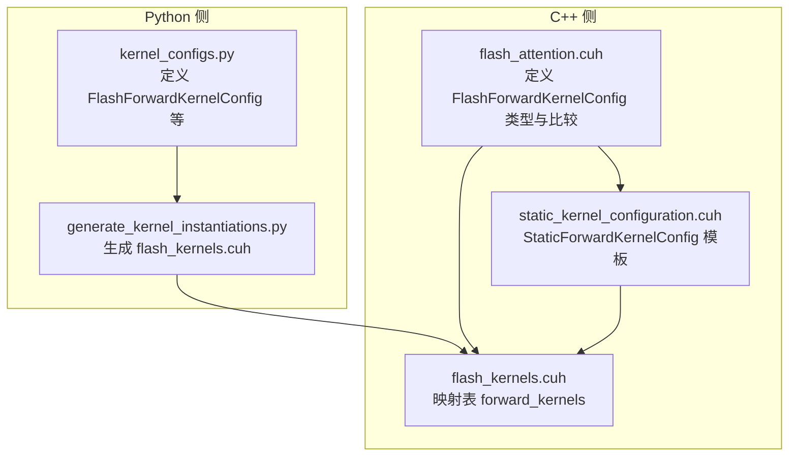
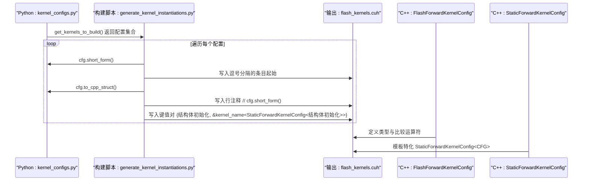
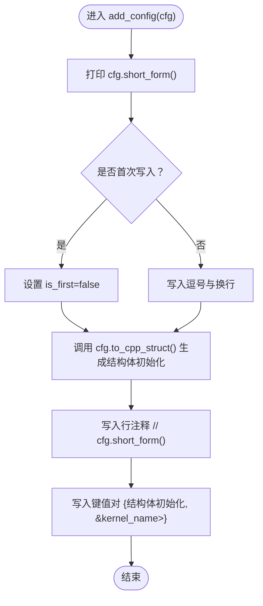
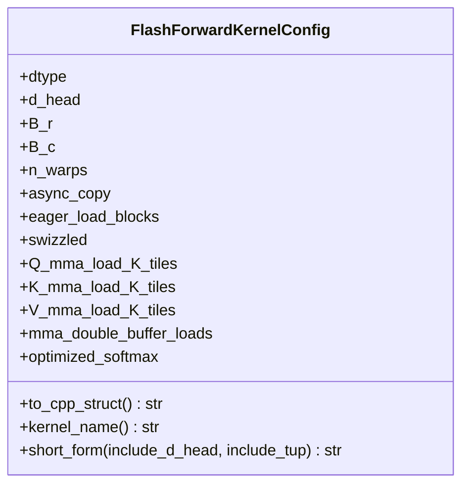
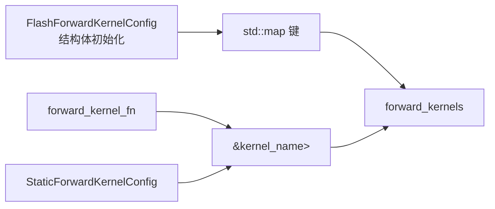
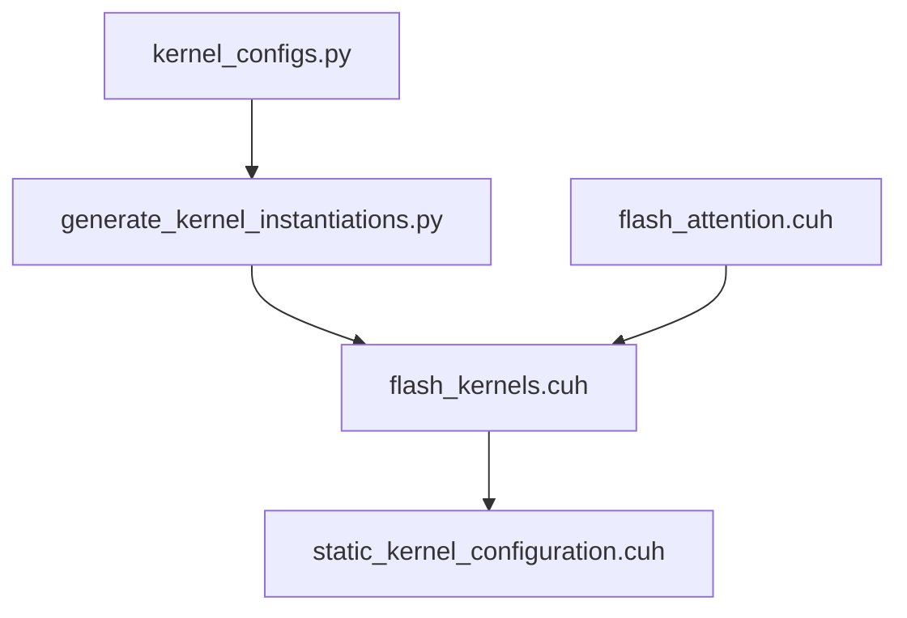

# 配置条目生成机制

<cite>
**本文引用的文件列表**
- [generate_kernel_instantiations.py](file://tools/build/generate_kernel_instantiations.py)
- [kernel_configs.py](file://py/flash_helpers/kernel_configs.py)
- [flash_kernels.cuh（版本15）](file://previous_kernels/src_15/include/flash_kernels.cuh)
- [flash_attention.cuh（版本15）](file://previous_kernels/src_15/include/flash_attention.cuh)
- [static_kernel_configuration.cuh](file://src/include/static_kernel_configuration.cuh)
</cite>

## 目录
1. [引言](#引言)
2. [项目结构](#项目结构)
3. [核心组件](#核心组件)
4. [架构总览](#架构总览)
5. [详细组件分析](#详细组件分析)
6. [依赖关系分析](#依赖关系分析)
7. [性能考量](#性能考量)
8. [故障排查指南](#故障排查指南)
9. [结论](#结论)

## 引言
本文件围绕“内核配置条目生成机制”展开，聚焦于 Python 层的 FlashForwardKernelConfig 实例如何通过工具脚本生成 C++ 映射表条目，最终写入 flash_kernels.cuh 文件。文档详细解释：
- add_config 函数如何将 Python 的配置对象转换为 C++ 结构体初始化语法；
- 逗号分隔逻辑、注释插入方式；
- 函数指针模板实例化的 C++ 语法构造过程；
- cfg.short_form() 的调试输出与生成代码的对应关系；
- 如何保证配置唯一性与语法正确性。

## 项目结构
该仓库包含 Python 辅助模块与多版本 C++ 内核实现。与本主题直接相关的关键路径如下：
- Python 侧：py/flash_helpers/kernel_configs.py 提供配置数据类与生成器；
- 构建脚本：tools/build/generate_kernel_instantiations.py 负责生成 C++ 头文件；
- C++ 侧：src/include/flash_attention.cuh 定义配置类型与比较运算；previous_kernels/src_15/include/flash_kernels.cuh 展示了生成后的映射表结构；src/include/static_kernel_configuration.cuh 定义静态模板配置。

图表来源
- [generate_kernel_instantiations.py](file://tools/build/generate_kernel_instantiations.py#L1-L56)
- [kernel_configs.py](file://py/flash_helpers/kernel_configs.py#L102-L175)
- [flash_kernels.cuh（版本15）](file://previous_kernels/src_15/include/flash_kernels.cuh#L1-L187)
- [flash_attention.cuh（版本15）](file://previous_kernels/src_15/include/flash_attention.cuh#L67-L109)
- [static_kernel_configuration.cuh](file://src/include/static_kernel_configuration.cuh#L104-L121)

章节来源
- [generate_kernel_instantiations.py](file://tools/build/generate_kernel_instantiations.py#L1-L56)
- [kernel_configs.py](file://py/flash_helpers/kernel_configs.py#L102-L175)
- [flash_kernels.cuh（版本15）](file://previous_kernels/src_15/include/flash_kernels.cuh#L1-L187)
- [flash_attention.cuh（版本15）](file://previous_kernels/src_15/include/flash_attention.cuh#L67-L109)
- [static_kernel_configuration.cuh](file://src/include/static_kernel_configuration.cuh#L104-L121)

## 核心组件
- FlashForwardKernelConfig（Python 数据类）
  - 字段覆盖 dtype、d_head、B_r、B_c、n_warps、async_copy、eager_load_blocks、swizzled、Q/K/V_mma_load_K_tiles、mma_double_buffer_loads、optimized_softmax 等。
  - 提供 short_form() 用于生成可读的配置短形式字符串，便于调试与日志比对。
  - 提供 to_cpp_struct() 将配置对象序列化为 C++ 结构体初始化语法。
  - 提供 kernel_name() 返回内核名称前缀，配合模板实例化使用。
- add_config（构建脚本中的函数）
  - 接收一个 FlashForwardKernelConfig 实例；
  - 打印 cfg.short_form() 作为调试输出；
  - 生成逗号分隔的映射表条目；
  - 注入行级注释，内容为 cfg.short_form()；
  - 使用 cfg.to_cpp_struct() 生成结构体初始化，并拼接函数指针模板实例化表达式。
- 生成目标文件 flash_kernels.cuh
  - 包含 std::map<FlashForwardKernelConfig, forward_kernel_fn> forward_kernels；
  - 每个条目形如 {结构体初始化, &kernel_name<StaticForwardKernelConfig<结构体初始化>>}。

章节来源
- [kernel_configs.py](file://py/flash_helpers/kernel_configs.py#L102-L175)
- [generate_kernel_instantiations.py](file://tools/build/generate_kernel_instantiations.py#L34-L47)
- [flash_kernels.cuh（版本15）](file://previous_kernels/src_15/include/flash_kernels.cuh#L1-L187)

## 架构总览
下图展示了从 Python 配置到 C++ 映射表条目的端到端流程，包括数据流、控制流与模板实例化。

图表来源
- [generate_kernel_instantiations.py](file://tools/build/generate_kernel_instantiations.py#L34-L47)
- [kernel_configs.py](file://py/flash_helpers/kernel_configs.py#L102-L175)
- [flash_kernels.cuh（版本15）](file://previous_kernels/src_15/include/flash_kernels.cuh#L1-L187)
- [flash_attention.cuh（版本15）](file://previous_kernels/src_15/include/flash_attention.cuh#L67-L109)
- [static_kernel_configuration.cuh](file://src/include/static_kernel_configuration.cuh#L104-L121)

## 详细组件分析

### add_config 函数与 to_cpp_struct 生成逻辑
- 逗号分隔逻辑
  - 在首次写入时 is_first 标记为 False，后续每次写入前追加逗号与换行，确保映射表条目之间以逗号分隔。
- 注释插入方式
  - 在每个键值对之前写入一行注释，内容为 cfg.short_form()，便于快速定位生成条目对应的配置。
- 函数指针模板实例化
  - 使用 cfg.kernel_name() 作为内核名前缀；
  - 通过 StaticForwardKernelConfig<结构体初始化> 进行模板特化；
  - 最终形成形如 {键, &kernel_name<StaticForwardKernelConfig<键>>} 的映射表项。
- cfg.short_form() 的调试输出
  - 该输出与生成注释保持一致，便于在构建日志中核对生成条目与配置的对应关系。

图表来源
- [generate_kernel_instantiations.py](file://tools/build/generate_kernel_instantiations.py#L34-L47)

章节来源
- [generate_kernel_instantiations.py](file://tools/build/generate_kernel_instantiations.py#L34-L47)

### FlashForwardKernelConfig 到 C++ 结构体初始化
- to_cpp_struct() 的作用
  - 将 Python 中的 FlashForwardKernelConfig 序列化为 C++ 结构体初始化语法；
  - 对布尔字段进行小写化处理，确保生成的 C++ 语法符合 bool 值书写规范；
  - 对 dtype 字段调用 to_cpp_str()，将其转换为 torch::kFloat16 或 torch::kBFloat16。
- 生成语法与映射表键的关系
  - 生成的结构体初始化作为 std::map 的键，要求键类型具备全序比较；
  - C++ 侧通过 operator< 定义了完整的比较规则，确保不同配置的唯一性与稳定性。

图表来源
- [kernel_configs.py](file://py/flash_helpers/kernel_configs.py#L102-L175)

章节来源
- [kernel_configs.py](file://py/flash_helpers/kernel_configs.py#L102-L175)

### C++ 映射表与模板实例化
- 映射表结构
  - std::map<FlashForwardKernelConfig, forward_kernel_fn> forward_kernels；
  - 键为 FlashForwardKernelConfig 的结构体初始化，值为函数指针，指向模板特化后的内核函数。
- 模板实例化
  - StaticForwardKernelConfig<CFG> 将配置作为模板参数，编译期确定内核行为；
  - 通过 CFG 访问配置字段，驱动内存布局、加载策略与算子参数等。
- 配置唯一性保障
  - C++ 侧的 operator< 对所有字段进行严格比较，确保不同配置在映射表中互不冲突；
  - 生成脚本中每条目均以结构体初始化作为键，天然满足唯一性约束。

图表来源
- [flash_kernels.cuh（版本15）](file://previous_kernels/src_15/include/flash_kernels.cuh#L1-L187)
- [flash_attention.cuh（版本15）](file://previous_kernels/src_15/include/flash_attention.cuh#L67-L109)
- [static_kernel_configuration.cuh](file://src/include/static_kernel_configuration.cuh#L104-L121)

章节来源
- [flash_kernels.cuh（版本15）](file://previous_kernels/src_15/include/flash_kernels.cuh#L1-L187)
- [flash_attention.cuh（版本15）](file://previous_kernels/src_15/include/flash_attention.cuh#L67-L109)
- [static_kernel_configuration.cuh](file://src/include/static_kernel_configuration.cuh#L104-L121)

### cfg.short_form() 与生成代码的对应关系
- 调试输出
  - 构建脚本在写入每个条目前会打印 cfg.short_form()，便于开发者在构建日志中核对配置与生成条目的对应关系。
- 注释与输出的一致性
  - 行注释内容同样来自 cfg.short_form()，与调试输出完全一致，避免歧义。
- 实际生成代码
  - 生成的映射表条目与注释一一对应，注释帮助快速定位具体配置的条目位置。

章节来源
- [generate_kernel_instantiations.py](file://tools/build/generate_kernel_instantiations.py#L34-L47)

## 依赖关系分析
- Python 侧依赖
  - kernel_configs.py 提供配置数据类与生成器；
  - generate_kernel_instantiations.py 依赖 kernel_configs.get_kernels_to_build() 获取待生成的配置集合。
- C++ 侧依赖
  - flash_kernels.cuh 依赖 flash_attention.cuh 中的 FlashForwardKernelConfig 类型与比较运算；
  - flash_kernels.cuh 依赖 forward_kernel.cuh 中的函数指针类型声明；
  - static_kernel_configuration.cuh 依赖 FlashForwardKernelConfig 作为模板实参，完成编译期配置注入。

图表来源
- [generate_kernel_instantiations.py](file://tools/build/generate_kernel_instantiations.py#L1-L56)
- [kernel_configs.py](file://py/flash_helpers/kernel_configs.py#L457-L486)
- [flash_kernels.cuh（版本15）](file://previous_kernels/src_15/include/flash_kernels.cuh#L1-L187)
- [flash_attention.cuh（版本15）](file://previous_kernels/src_15/include/flash_attention.cuh#L67-L109)
- [static_kernel_configuration.cuh](file://src/include/static_kernel_configuration.cuh#L104-L121)

章节来源
- [generate_kernel_instantiations.py](file://tools/build/generate_kernel_instantiations.py#L1-L56)
- [kernel_configs.py](file://py/flash_helpers/kernel_configs.py#L457-L486)
- [flash_kernels.cuh（版本15）](file://previous_kernels/src_15/include/flash_kernels.cuh#L1-L187)
- [flash_attention.cuh（版本15）](file://previous_kernels/src_15/include/flash_attention.cuh#L67-L109)
- [static_kernel_configuration.cuh](file://src/include/static_kernel_configuration.cuh#L104-L121)

## 性能考量
- 生成阶段的开销
  - 构建脚本遍历配置集合并逐条写入文件，整体复杂度与配置数量线性相关；
  - 生成的映射表在运行时通过键比较进行查找，C++ 侧 operator< 已提供稳定排序，查找效率由 std::map 的红黑树实现保证。
- 语法正确性与可维护性
  - to_cpp_struct() 统一生成结构体初始化语法，避免手写错误；
  - 注释与调试输出与生成内容保持一致，降低维护成本；
  - 模板实例化在编译期完成，运行时无额外开销。

## 故障排查指南
- 生成文件未更新
  - 确认已执行构建脚本 generate_kernel_instantiations.py；
  - 检查输出路径是否正确（./src/include/flash_kernels.cuh）。
- 配置重复或冲突
  - 若出现编译期或运行期异常，检查 C++ 侧 operator< 是否被修改；
  - 确保 Python 侧配置字段完整且与 C++ 侧字段一一对应。
- 注释与调试输出不一致
  - 检查 add_config 中写入注释与打印逻辑是否一致；
  - 确认 cfg.short_form() 的输出格式未被自定义修改。
- 模板实例化失败
  - 检查 StaticForwardKernelConfig 是否接受 FlashForwardKernelConfig 作为模板实参；
  - 确认生成的结构体初始化语法与 C++ 侧类型匹配。

章节来源
- [generate_kernel_instantiations.py](file://tools/build/generate_kernel_instantiations.py#L1-L56)
- [flash_attention.cuh（版本15）](file://previous_kernels/src_15/include/flash_attention.cuh#L67-L109)
- [static_kernel_configuration.cuh](file://src/include/static_kernel_configuration.cuh#L104-L121)

## 结论
本机制通过 Python 侧的 FlashForwardKernelConfig 与构建脚本 add_config，实现了从配置对象到 C++ 映射表条目的自动化生成。关键点包括：
- to_cpp_struct() 统一生成结构体初始化语法；
- add_config 采用逗号分隔与行注释，保证条目可读性；
- 函数指针模板实例化通过 StaticForwardKernelConfig 完成编译期配置注入；
- C++ 侧 operator< 保障配置唯一性与查找稳定性；
- cfg.short_form() 的调试输出与生成注释保持一致，便于核对与排错。