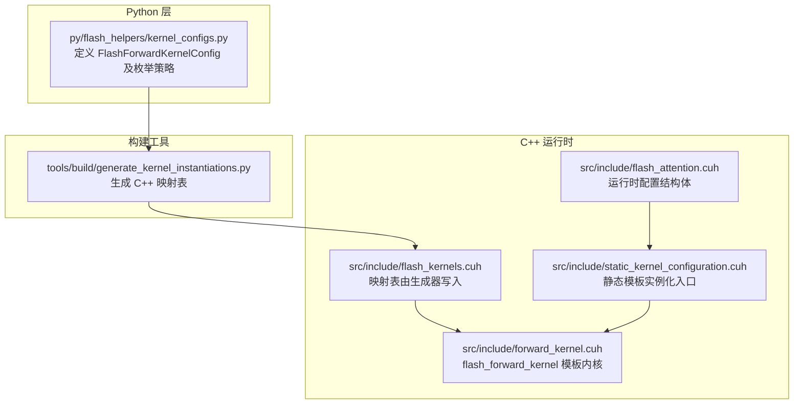
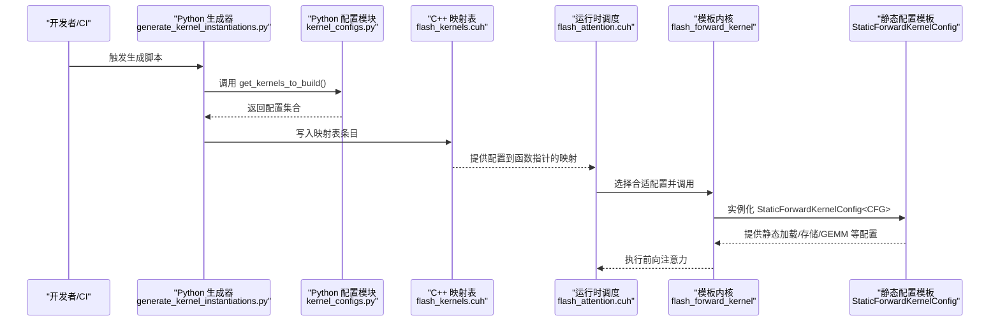
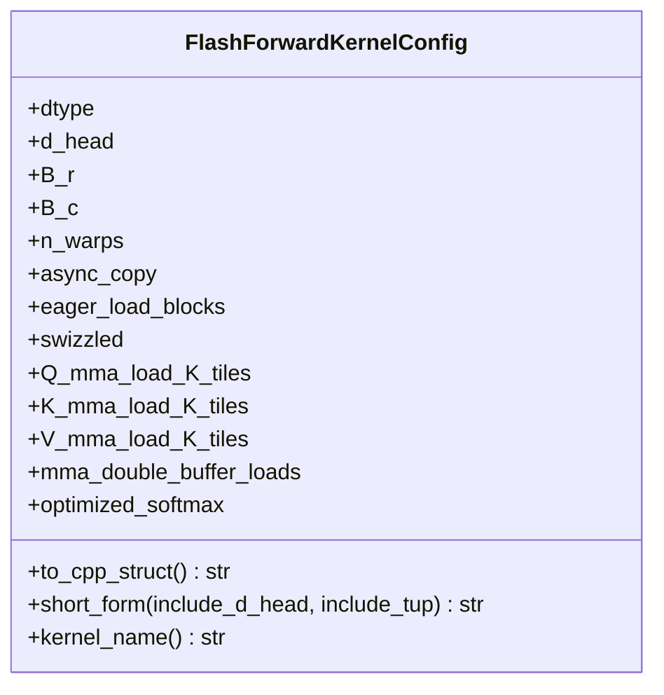
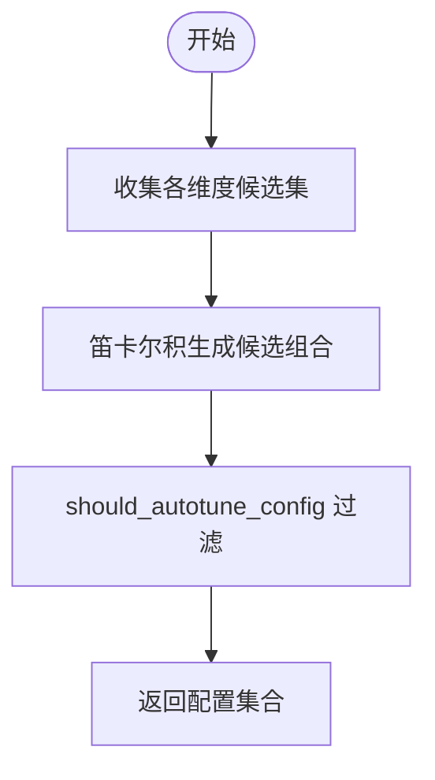
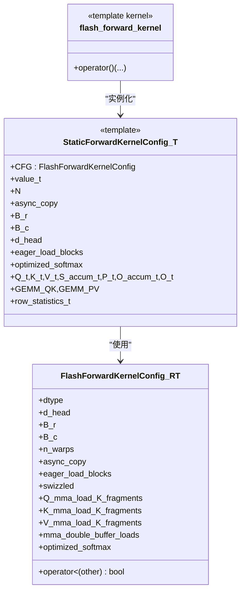
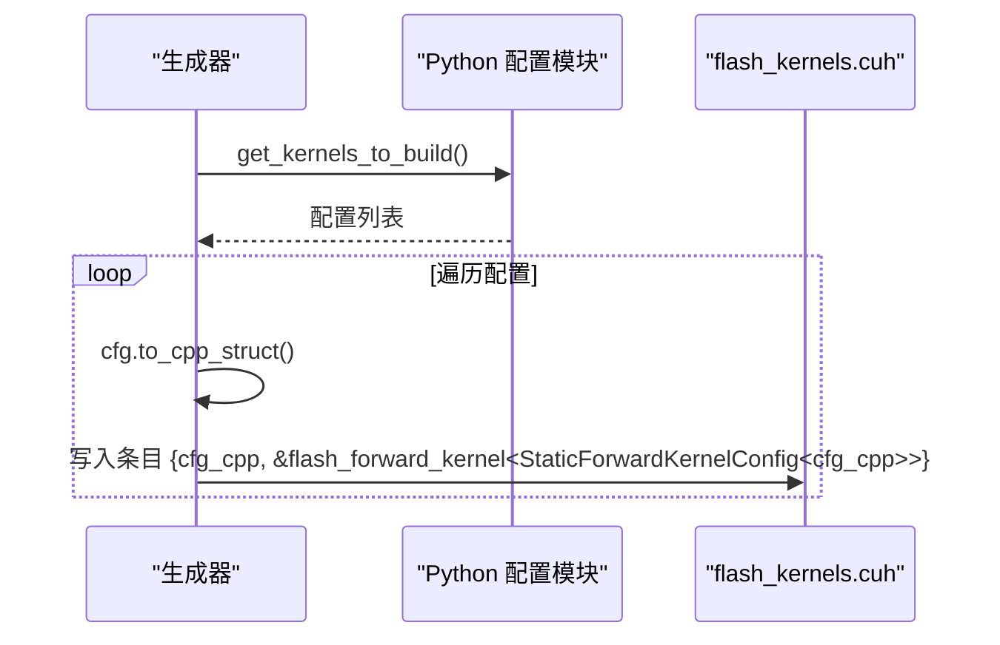

# 内核配置映射自动生成机制

<cite>
**本文引用的文件**
- [generate_kernel_instantiations.py](file://tools/build/generate_kernel_instantiations.py)
- [kernel_configs.py](file://py/flash_helpers/kernel_configs.py)
- [flash_kernels.cuh](file://src/include/flash_kernels.cuh)
- [flash_attention.cuh](file://src/include/flash_attention.cuh)
- [forward_kernel.cuh](file://src/include/forward_kernel.cuh)
- [static_kernel_configuration.cuh](file://src/include/static_kernel_configuration.cuh)
- [flash_kernels.cuh（历史版本）](file://previous_kernels/src_15/include/flash_kernels.cuh)
</cite>

## 目录
1. [引言](#引言)
2. [项目结构](#项目结构)
3. [核心组件](#核心组件)
4. [架构总览](#架构总览)
5. [详细组件分析](#详细组件分析)
6. [依赖关系分析](#依赖关系分析)
7. [性能考量](#性能考量)
8. [故障排查指南](#故障排查指南)
9. [结论](#结论)

## 引言
本文件围绕“内核配置映射自动生成机制”展开，聚焦于 Python 端的 FlashForwardKernelConfig 类与 C++ 端静态内核配置之间的双向映射关系。目标是解释 generate_kernel_instantiations.py 脚本如何基于 Python 端的配置集合，自动生成 C++ 头文件 src/include/flash_kernels.cuh 中的映射表，使得运行时可按配置选择对应的静态模板实例化，从而实现配置空间的完整覆盖与一致性保障。

## 项目结构
该仓库采用分层组织：
- py/flash_helpers/kernel_configs.py 定义了 Python 端的内核配置数据结构与枚举策略
- tools/build/generate_kernel_instantiations.py 是代码生成器，负责将 Python 配置转为 C++ 映射表
- src/include 下包含运行时使用的 C++ 结构体、内核函数与静态配置模板
- previous_kernels/ 提供历史版本的对应头文件，便于对比演进

图表来源
- [kernel_configs.py](file://py/flash_helpers/kernel_configs.py#L106-L175)
- [generate_kernel_instantiations.py](file://tools/build/generate_kernel_instantiations.py#L13-L56)
- [flash_kernels.cuh](file://src/include/flash_kernels.cuh#L1-L187)
- [flash_attention.cuh](file://src/include/flash_attention.cuh#L30-L109)
- [static_kernel_configuration.cuh](file://src/include/static_kernel_configuration.cuh#L104-L291)
- [forward_kernel.cuh](file://src/include/forward_kernel.cuh#L85-L204)

章节来源
- [kernel_configs.py](file://py/flash_helpers/kernel_configs.py#L106-L175)
- [generate_kernel_instantiations.py](file://tools/build/generate_kernel_instantiations.py#L13-L56)
- [flash_kernels.cuh](file://src/include/flash_kernels.cuh#L1-L187)
- [flash_attention.cuh](file://src/include/flash_attention.cuh#L30-L109)
- [static_kernel_configuration.cuh](file://src/include/static_kernel_configuration.cuh#L104-L291)
- [forward_kernel.cuh](file://src/include/forward_kernel.cuh#L85-L204)

## 核心组件
- Python 端配置类：FlashForwardKernelConfig，提供 to_cpp_struct 将配置对象序列化为 C++ 字面量；提供短格式字符串用于调试输出；提供解析工具以从符号名或短格式恢复配置。
- Python 枚举与过滤：get_kernels_to_build/get_autotuning_kernel_configs/get_kernel_progression_configs/should_autotune_config 等，用于生成完整的配置空间并剔除无效组合。
- C++ 运行时配置结构体：FlashForwardKernelConfig（与 Python 同名但语义一致），用于运行时比较与排序。
- 静态模板实例化入口：StaticForwardKernelConfig，将 FlashForwardKernelConfig 的编译期常量注入到模板参数中，驱动 GEMM、加载/存储、软最大值等静态配置。
- 模板内核：flash_forward_kernel，接收一个模板参数 Kernel（通常为 StaticForwardKernelConfig<CFG>），在设备上执行前向注意力计算。
- 生成器：generate_kernel_instantiations.py，将 Python 侧生成的配置集合写入 flash_kernels.cuh，形成“配置字面量 -> 内核函数指针”的映射表。

章节来源
- [kernel_configs.py](file://py/flash_helpers/kernel_configs.py#L106-L175)
- [flash_attention.cuh](file://src/include/flash_attention.cuh#L30-L109)
- [static_kernel_configuration.cuh](file://src/include/static_kernel_configuration.cuh#L104-L291)
- [forward_kernel.cuh](file://src/include/forward_kernel.cuh#L85-L204)
- [generate_kernel_instantiations.py](file://tools/build/generate_kernel_instantiations.py#L13-L56)

## 架构总览
下图展示了从 Python 配置到 C++ 映射表再到内核调用的整体流程。

图表来源
- [generate_kernel_instantiations.py](file://tools/build/generate_kernel_instantiations.py#L13-L56)
- [kernel_configs.py](file://py/flash_helpers/kernel_configs.py#L389-L485)
- [flash_kernels.cuh](file://src/include/flash_kernels.cuh#L1-L187)
- [flash_attention.cuh](file://src/include/flash_attention.cuh#L30-L109)
- [forward_kernel.cuh](file://src/include/forward_kernel.cuh#L85-L204)
- [static_kernel_configuration.cuh](file://src/include/static_kernel_configuration.cuh#L104-L291)

## 详细组件分析

### Python 端配置类与序列化
- FlashForwardKernelConfig 字段涵盖数据类型、维度、块大小、线程束数、异步复制开关、预加载开关、swizzling 开关、Q/K/V 的 MMA 加载 K 片段数、双缓冲开关、优化 softmax 开关等。
- to_cpp_struct 方法将 Python 配置对象转换为 C++ 字面量字符串，用于直接嵌入到 C++ 映射表中。
- short_form 提供人类可读的配置摘要，便于日志与调试。
- 解析工具支持从符号名或短格式恢复配置，便于回溯与测试。

图表来源
- [kernel_configs.py](file://py/flash_helpers/kernel_configs.py#L106-L175)

章节来源
- [kernel_configs.py](file://py/flash_helpers/kernel_configs.py#L106-L175)

### Python 配置空间枚举与过滤
- get_autotuning_kernel_configs 通过笛卡尔积组合多个维度（如 dtype、d_head、B_r、B_c、n_warps、异步复制、预加载、swizzling、Q/K/V 加载片段数、双缓冲、优化 softmax），并用 should_autotune_config 剔除不合法组合。
- get_kernel_progression_configs 提供逐步推进的配置序列，便于验证与回归。
- get_kernels_to_build 汇总上述策略，返回最终待构建的配置集合。

图表来源
- [kernel_configs.py](file://py/flash_helpers/kernel_configs.py#L389-L485)

章节来源
- [kernel_configs.py](file://py/flash_helpers/kernel_configs.py#L389-L485)

### C++ 运行时配置结构体与静态模板
- FlashForwardKernelConfig（运行时）与 Python 端字段一一对应，提供比较运算符以支持有序存储与查找。
- StaticForwardKernelConfig 将 FlashForwardKernelConfig 的常量注入到模板参数中，决定加载/存储布局、GEMM 参数、寄存器/共享内存布局等。
- flash_forward_kernel 接收一个模板参数 Kernel（通常为 StaticForwardKernelConfig<CFG>），在设备上执行注意力计算。

图表来源
- [flash_attention.cuh](file://src/include/flash_attention.cuh#L30-L109)
- [static_kernel_configuration.cuh](file://src/include/static_kernel_configuration.cuh#L104-L291)
- [forward_kernel.cuh](file://src/include/forward_kernel.cuh#L85-L204)

章节来源
- [flash_attention.cuh](file://src/include/flash_attention.cuh#L30-L109)
- [static_kernel_configuration.cuh](file://src/include/static_kernel_configuration.cuh#L104-L291)
- [forward_kernel.cuh](file://src/include/forward_kernel.cuh#L85-L204)

### 代码生成流程：从 Python 到 C++
- generate_kernel_instantiations.py 会：
  - 导入 Python 配置模块并调用 get_kernels_to_build 获取配置集合；
  - 写入 C++ 映射表头文件的开头部分（包含必要的头文件与命名空间声明）；
  - 对每个配置调用 cfg.to_cpp_struct 生成 C++ 字面量；
  - 以 {配置字面量, &flash_forward_kernel<StaticForwardKernelConfig<配置字面量>>} 的形式写入映射表；
  - 最终闭合映射表与命名空间。

图表来源
- [generate_kernel_instantiations.py](file://tools/build/generate_kernel_instantiations.py#L13-L56)
- [kernel_configs.py](file://py/flash_helpers/kernel_configs.py#L106-L175)
- [flash_kernels.cuh](file://src/include/flash_kernels.cuh#L1-L187)

章节来源
- [generate_kernel_instantiations.py](file://tools/build/generate_kernel_instantiations.py#L13-L56)
- [kernel_configs.py](file://py/flash_helpers/kernel_configs.py#L106-L175)
- [flash_kernels.cuh](file://src/include/flash_kernels.cuh#L1-L187)

### 实际转换示例与一致性保障
- Python 配置对象通过 to_cpp_struct 转换为 C++ 字面量，例如包含 dtype、d_head、B_r、B_c、n_warps、async_copy、eager_load_blocks、swizzled、Q/K/V 加载片段数、mma_double_buffer_loads、optimized_softmax 等字段。
- 生成器将这些字面量作为键，绑定到 flash_forward_kernel<StaticForwardKernelConfig<键>> 的函数指针，形成映射表。
- 运行时通过查找该映射表，选择合适的静态模板实例化，避免运行时分支判断，提升性能与稳定性。
- 由于映射表完全由生成器从 Python 配置集合生成，且 Python 侧通过 should_autotune_config 等规则过滤非法组合，因此保证了配置空间的完整性与一致性。

章节来源
- [kernel_configs.py](file://py/flash_helpers/kernel_configs.py#L106-L175)
- [generate_kernel_instantiations.py](file://tools/build/generate_kernel_instantiations.py#L13-L56)
- [flash_kernels.cuh](file://src/include/flash_kernels.cuh#L1-L187)

## 依赖关系分析
- Python 侧依赖：
  - kernel_configs.py 提供配置类、枚举与过滤逻辑；
  - generate_kernel_instantiations.py 依赖 kernel_configs.py 的 get_kernels_to_build。
- C++ 侧依赖：
  - flash_kernels.cuh 依赖 flash_attention.cuh 与 forward_kernel.cuh；
  - flash_forward_kernel 使用 StaticForwardKernelConfig 作为模板参数；
  - StaticForwardKernelConfig 依赖 FlashForwardKernelConfig 与若干底层组件（GEMM、加载/存储、布局等）。

图表来源
- [kernel_configs.py](file://py/flash_helpers/kernel_configs.py#L389-L485)
- [generate_kernel_instantiations.py](file://tools/build/generate_kernel_instantiations.py#L13-L56)
- [flash_kernels.cuh](file://src/include/flash_kernels.cuh#L1-L187)
- [forward_kernel.cuh](file://src/include/forward_kernel.cuh#L85-L204)
- [static_kernel_configuration.cuh](file://src/include/static_kernel_configuration.cuh#L104-L291)
- [flash_attention.cuh](file://src/include/flash_attention.cuh#L30-L109)

章节来源
- [kernel_configs.py](file://py/flash_helpers/kernel_configs.py#L389-L485)
- [generate_kernel_instantiations.py](file://tools/build/generate_kernel_instantiations.py#L13-L56)
- [flash_kernels.cuh](file://src/include/flash_kernels.cuh#L1-L187)
- [forward_kernel.cuh](file://src/include/forward_kernel.cuh#L85-L204)
- [static_kernel_configuration.cuh](file://src/include/static_kernel_configuration.cuh#L104-L291)
- [flash_attention.cuh](file://src/include/flash_attention.cuh#L30-L109)

## 性能考量
- 通过将配置映射表写入编译期可见的头文件，运行时查找为 O(log N) 的有序结构查找，避免动态分派带来的开销。
- StaticForwardKernelConfig 将配置常量化，使编译器在编译期展开加载/存储、GEMM、寄存器/共享内存布局等细节，减少运行时分支与间接寻址。
- 生成器统一生成映射表，避免手写遗漏或不一致，有助于保持不同配置间的性能与正确性平衡。

## 故障排查指南
- 生成失败或映射表为空：
  - 检查环境变量 KERNELS 或传入的关键字是否正确，确认 get_kernel_configs/get_kernels_to_build 返回非空集合。
  - 确认 should_autotune_config 是否过于严格导致过滤掉全部配置。
- C++ 编译错误（静态断言失败）：
  - 检查 StaticForwardKernelConfig::valid_config 中的断言条件，确认 Q/K/V 的加载片段数与 d_head/B_c 的关系满足约束。
- 运行时找不到配置：
  - 确认生成的 flash_kernels.cuh 是否被编译器包含；
  - 确认配置字面量与 Python 侧 to_cpp_struct 输出一致（特别是布尔值与枚举值）。

章节来源
- [kernel_configs.py](file://py/flash_helpers/kernel_configs.py#L364-L387)
- [static_kernel_configuration.cuh](file://src/include/static_kernel_configuration.cuh#L22-L35)
- [flash_kernels.cuh](file://src/include/flash_kernels.cuh#L1-L187)

## 结论
该机制通过 Python 端的配置类与枚举策略，结合生成器脚本，将配置空间完整地映射到 C++ 头文件中的静态模板实例化路径。运行时通过映射表快速定位到对应的静态模板实例，既保证了配置空间的完整性与一致性，又提升了执行效率与可维护性。历史版本的 flash_kernels.cuh 也证明了该映射表随配置集合的变化而扩展，体现了良好的演进能力。