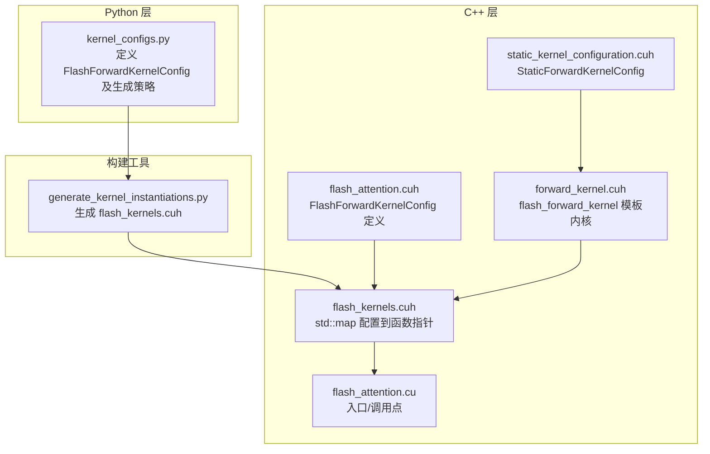
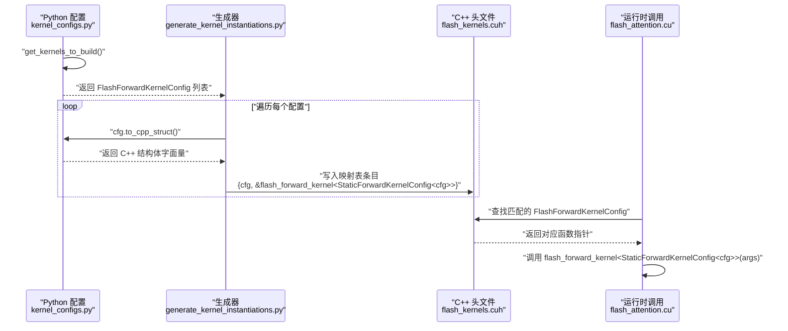
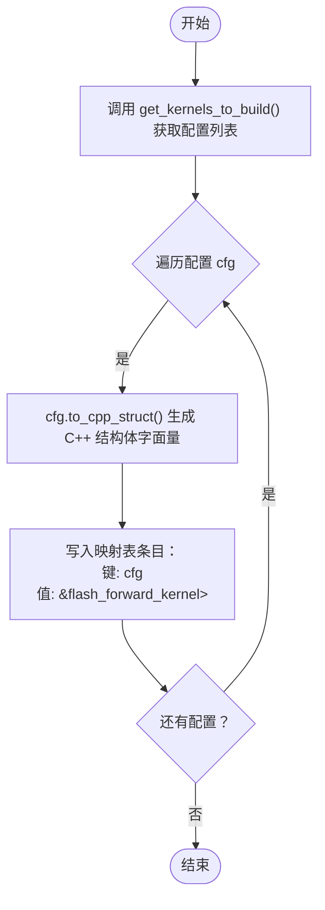
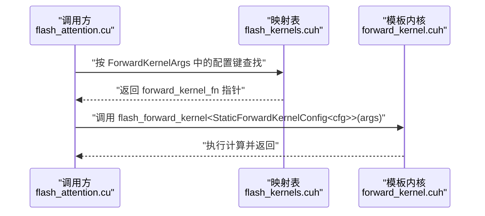
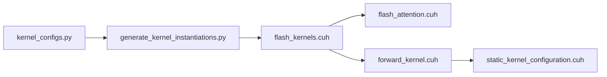

# 内核实例化机制

<cite>
**本文引用的文件**
- [generate_kernel_instantiations.py](file://tools/build/generate_kernel_instantiations.py)
- [kernel_configs.py](file://py/flash_helpers/kernel_configs.py)
- [flash_kernels.cuh](file://src/include/flash_kernels.cuh)
- [flash_attention.cuh](file://src/include/flash_attention.cuh)
- [forward_kernel.cuh](file://src/include/forward_kernel.cuh)
- [static_kernel_configuration.cuh](file://src/include/static_kernel_configuration.cuh)
- [flash_attention.cu](file://src/flash_attention.cu)
</cite>

## 目录
1. [引言](#引言)
2. [项目结构](#项目结构)
3. [核心组件](#核心组件)
4. [架构总览](#架构总览)
5. [详细组件分析](#详细组件分析)
6. [依赖关系分析](#依赖关系分析)
7. [性能考量](#性能考量)
8. [故障排查指南](#故障排查指南)
9. [结论](#结论)

## 引言
本文件围绕“内核实例化机制”展开，系统阐述 Python 端配置对象如何被转换为 C++ 端的内核映射表，并最终驱动模板实例化与运行时选择。重点覆盖以下方面：
- Python 端配置对象 FlashForwardKernelConfig 的结构与序列化方法
- 脚本 generate_kernel_instantiations.py 如何调用 get_kernels_to_build 获取有效配置列表，并逐个转换为 C++ 结构体字面量
- 生成的 flash_kernels.cuh 中 std::map<FlashForwardKernelConfig, forward_kernel_fn> 的结构与用途
- 映射表如何将配置对象与具体模板实例化内核函数指针（例如 &flash_forward_kernel<StaticForwardKernelConfig<...>>）进行绑定
- 自动化实例化机制如何保证配置一致性并简化内核调用

## 项目结构
该仓库采用分层组织：Python 工具与配置位于 py/flash_helpers，C++ 头文件与实现位于 src/include 与 src。构建阶段通过 tools/build 下的脚本生成 C++ 内核映射表，供运行时使用。

图表来源
- [generate_kernel_instantiations.py](file://tools/build/generate_kernel_instantiations.py#L1-L57)
- [kernel_configs.py](file://py/flash_helpers/kernel_configs.py#L106-L175)
- [flash_kernels.cuh](file://src/include/flash_kernels.cuh#L1-L187)
- [flash_attention.cuh](file://src/include/flash_attention.cuh#L30-L110)
- [forward_kernel.cuh](file://src/include/forward_kernel.cuh#L85-L205)
- [static_kernel_configuration.cuh](file://src/include/static_kernel_configuration.cuh#L104-L120)
- [flash_attention.cu](file://src/flash_attention.cu#L1-L200)

章节来源
- [generate_kernel_instantiations.py](file://tools/build/generate_kernel_instantiations.py#L1-L57)
- [kernel_configs.py](file://py/flash_helpers/kernel_configs.py#L106-L175)
- [flash_kernels.cuh](file://src/include/flash_kernels.cuh#L1-L187)
- [flash_attention.cuh](file://src/include/flash_attention.cuh#L30-L110)
- [forward_kernel.cuh](file://src/include/forward_kernel.cuh#L85-L205)
- [static_kernel_configuration.cuh](file://src/include/static_kernel_configuration.cuh#L104-L120)
- [flash_attention.cu](file://src/flash_attention.cu#L1-L200)

## 核心组件
- Python 配置对象与序列化
  - FlashForwardKernelConfig：包含数据类型、块大小、线程瓦片数、异步拷贝、预加载、Swizzle、K/V 加载片段数、双缓冲、优化 softmax 等字段
  - to_cpp_struct：将配置对象序列化为 C++ 结构体字面量字符串
  - kernel_name：返回对应内核名称（flash_forward_kernel）
- Python 配置生成策略
  - get_kernels_to_build：聚合自动调优与进度推进等配置集合，去重并排序
- C++ 运行时映射表
  - flash_kernels.cuh：定义 typedef 函数指针类型，声明 std::map<FlashForwardKernelConfig, forward_kernel_fn> 的全局映射表
- C++ 模板内核与静态配置
  - forward_kernel.cuh：模板内核 flash_forward_kernel，接受 StaticForwardKernelConfig 作为模板参数
  - static_kernel_configuration.cuh：StaticForwardKernelConfig 将 FlashForwardKernelConfig 编译期常量化，派生出 Q/K/V/累积张量等类型与布局

章节来源
- [kernel_configs.py](file://py/flash_helpers/kernel_configs.py#L106-L175)
- [kernel_configs.py](file://py/flash_helpers/kernel_configs.py#L457-L463)
- [flash_kernels.cuh](file://src/include/flash_kernels.cuh#L1-L187)
- [forward_kernel.cuh](file://src/include/forward_kernel.cuh#L85-L205)
- [static_kernel_configuration.cuh](file://src/include/static_kernel_configuration.cuh#L104-L120)

## 架构总览
下图展示了从 Python 配置到 C++ 运行时函数指针绑定的全链路：

图表来源
- [generate_kernel_instantiations.py](file://tools/build/generate_kernel_instantiations.py#L13-L56)
- [kernel_configs.py](file://py/flash_helpers/kernel_configs.py#L148-L167)
- [flash_kernels.cuh](file://src/include/flash_kernels.cuh#L1-L187)
- [forward_kernel.cuh](file://src/include/forward_kernel.cuh#L85-L205)

## 详细组件分析

### Python 配置对象与序列化
- FlashForwardKernelConfig 字段涵盖 dtype、d_head、B_r、B_c、n_warps、async_copy、eager_load_blocks、swizzled、Q/K/V_mma_load_K_tiles、mma_double_buffer_loads、optimized_softmax 等，用于完全刻画一个模板实例化的静态配置
- to_cpp_struct 将上述字段转换为 C++ 结构体字面量字符串，确保与 C++ 端 FlashForwardKernelConfig 的成员顺序一致
- kernel_name 固定为 flash_forward_kernel，用于生成函数指针绑定表达式

章节来源
- [kernel_configs.py](file://py/flash_helpers/kernel_configs.py#L106-L175)

### 生成器工作流（generate_kernel_instantiations.py）
- 主要职责
  - 打开目标头文件 flash_kernels.cuh 并写入前置声明与命名空间
  - 调用 get_kernels_to_build 获取有效配置列表
  - 对每个配置调用 cfg.to_cpp_struct 生成 C++ 结构体字面量
  - 写入映射表条目：键为 FlashForwardKernelConfig 实例，值为 &flash_forward_kernel<StaticForwardKernelConfig<cfg>>
- 输出文件结构
  - typedef 前向内核函数指针类型
  - std::map<FlashForwardKernelConfig, forward_kernel_fn> forward_kernels 初始化列表
  - 每个条目注释包含短形式描述，便于调试与定位

章节来源
- [generate_kernel_instantiations.py](file://tools/build/generate_kernel_instantiations.py#L13-L56)

### C++ 映射表结构（flash_kernels.cuh）
- 类型定义
  - typedef void (*forward_kernel_fn)(const ForwardKernelArgs); 定义函数指针签名
- 映射表
  - std::map<FlashForwardKernelConfig, forward_kernel_fn> forward_kernels
  - 键：FlashForwardKernelConfig 实例（编译期常量）
  - 值：&flash_forward_kernel<StaticForwardKernelConfig<cfg>>
- 运行时查找
  - 通过传入的 ForwardKernelArgs 中的配置键，从映射表中查找对应函数指针
  - 调用该函数指针对应的模板实例化内核

章节来源
- [flash_kernels.cuh](file://src/include/flash_kernels.cuh#L1-L187)
- [flash_attention.cuh](file://src/include/flash_attention.cuh#L8-L28)

### 模板内核与静态配置（forward_kernel.cuh、static_kernel_configuration.cuh）
- flash_forward_kernel
  - 模板内核，接收 StaticForwardKernelConfig 作为模板参数
  - 在内核内部根据 StaticForwardKernelConfig 推导 Q/K/V/累积张量等类型与布局，完成计算
- StaticForwardKernelConfig
  - 将 FlashForwardKernelConfig 编译期常量化，派生出 Q_t/K_t/V_t/S_accum_t/P_t/O_accum_t/O_t、GEMM_QK/GEMM_PV、行统计数组等类型
  - 通过静态断言与常量表达式确保配置合法性与资源占用估算

章节来源
- [forward_kernel.cuh](file://src/include/forward_kernel.cuh#L85-L205)
- [static_kernel_configuration.cuh](file://src/include/static_kernel_configuration.cuh#L104-L120)

### 从 Python 到 C++ 的绑定流程（代码级图示）

图表来源
- [generate_kernel_instantiations.py](file://tools/build/generate_kernel_instantiations.py#L13-L56)
- [kernel_configs.py](file://py/flash_helpers/kernel_configs.py#L148-L167)

### 运行时调用流程（代码级图示）

图表来源
- [flash_kernels.cuh](file://src/include/flash_kernels.cuh#L1-L187)
- [forward_kernel.cuh](file://src/include/forward_kernel.cuh#L85-L205)
- [flash_attention.cuh](file://src/include/flash_attention.cuh#L8-L28)

## 依赖关系分析
- Python 侧
  - generate_kernel_instantiations.py 依赖 kernel_configs.py 提供的配置生成与序列化能力
- C++ 侧
  - flash_kernels.cuh 依赖 flash_attention.cuh（定义 FlashForwardKernelConfig）与 forward_kernel.cuh（定义函数指针与模板内核）
  - forward_kernel.cuh 依赖 static_kernel_configuration.cuh（提供 StaticForwardKernelConfig）
- 运行时耦合
  - 运行时通过 std::map 查找函数指针，避免在运行时做复杂分支判断，提升可维护性与一致性

图表来源
- [kernel_configs.py](file://py/flash_helpers/kernel_configs.py#L106-L175)
- [generate_kernel_instantiations.py](file://tools/build/generate_kernel_instantiations.py#L13-L56)
- [flash_kernels.cuh](file://src/include/flash_kernels.cuh#L1-L187)
- [flash_attention.cuh](file://src/include/flash_attention.cuh#L30-L110)
- [forward_kernel.cuh](file://src/include/forward_kernel.cuh#L85-L205)
- [static_kernel_configuration.cuh](file://src/include/static_kernel_configuration.cuh#L104-L120)

章节来源
- [kernel_configs.py](file://py/flash_helpers/kernel_configs.py#L106-L175)
- [generate_kernel_instantiations.py](file://tools/build/generate_kernel_instantiations.py#L13-L56)
- [flash_kernels.cuh](file://src/include/flash_kernels.cuh#L1-L187)
- [flash_attention.cuh](file://src/include/flash_attention.cuh#L30-L110)
- [forward_kernel.cuh](file://src/include/forward_kernel.cuh#L85-L205)
- [static_kernel_configuration.cuh](file://src/include/static_kernel_configuration.cuh#L104-L120)

## 性能考量
- 自动化实例化的优势
  - 通过 Python 生成所有可能的配置组合，减少手工维护成本，避免遗漏或不一致
  - C++ 端使用 std::map 进行 O(log N) 查找，结合编译期常量配置，降低运行时分支开销
- 配置合法性保障
  - C++ 端通过 StaticForwardKernelConfig 的静态断言与常量表达式校验配置合理性，防止非法组合进入映射表
- 资源占用控制
  - FlashForwardKernelConfig 提供 smem_bytes 与 num_ctas_per_sm 等估算，辅助选择更合适的配置

[本节为通用指导，无需列出具体文件来源]

## 故障排查指南
- 生成的映射表为空或不完整
  - 检查 get_kernels_to_build 是否返回非空集合
  - 确认 generate_kernel_instantiations.py 正确打开并写入 flash_kernels.cuh
- C++ 编译报错：找不到 flash_forward_kernel 或 StaticForwardKernelConfig
  - 确认 include 顺序与路径正确
  - 确保 forward_kernel.cuh 与 static_kernel_configuration.cuh 已被包含
- 运行时找不到匹配配置
  - 检查 ForwardKernelArgs 中的配置键是否与生成的键一致
  - 确认 to_cpp_struct 与 C++ 端 FlashForwardKernelConfig 成员顺序一致
- 性能异常
  - 使用 parse_ptx_build.py 分析 ptxas 日志，检查寄存器使用、栈帧与溢出情况
  - 通过 kernel_configs.py 的 short_form 与 parse_kernel_name_into_config 辅助定位问题配置

章节来源
- [generate_kernel_instantiations.py](file://tools/build/generate_kernel_instantiations.py#L13-L56)
- [kernel_configs.py](file://py/flash_helpers/kernel_configs.py#L148-L167)
- [flash_kernels.cuh](file://src/include/flash_kernels.cuh#L1-L187)
- [forward_kernel.cuh](file://src/include/forward_kernel.cuh#L85-L205)
- [static_kernel_configuration.cuh](file://src/include/static_kernel_configuration.cuh#L104-L120)
- [parse_ptx_build.py](file://tools/build/parse_ptx_build.py#L1-L250)

## 结论
该内核实例化机制通过 Python 与 C++ 的分工协作，实现了从配置对象到模板实例化内核函数指针的自动化绑定：
- Python 负责配置生成与序列化，确保配置的一致性与完整性
- C++ 负责运行时查找与调用，借助 std::map 与编译期常量配置，实现高效且可维护的内核调度
- 通过 StaticForwardKernelConfig 的静态断言与常量推导，进一步保障配置合法性与资源占用可控
- 该机制显著降低了手工维护成本，提升了可扩展性与稳定性