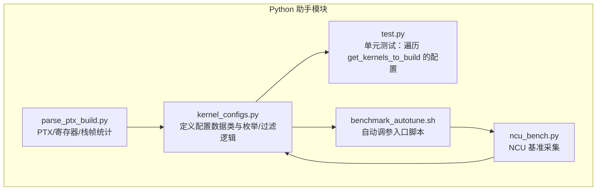
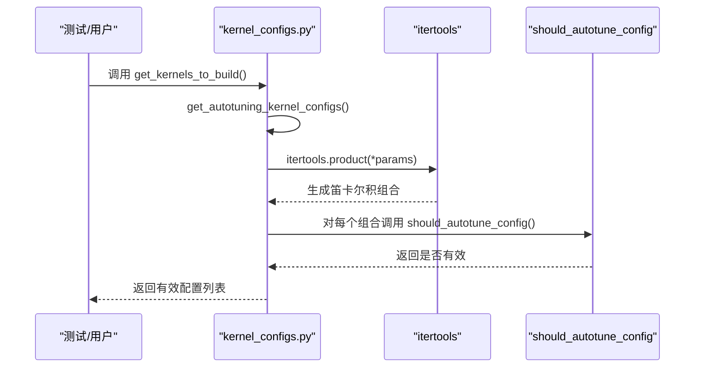
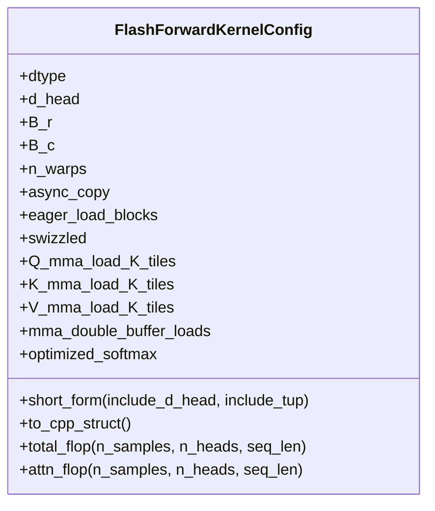
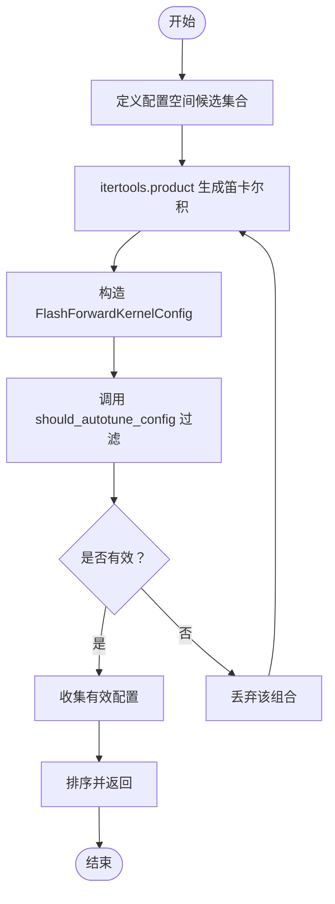
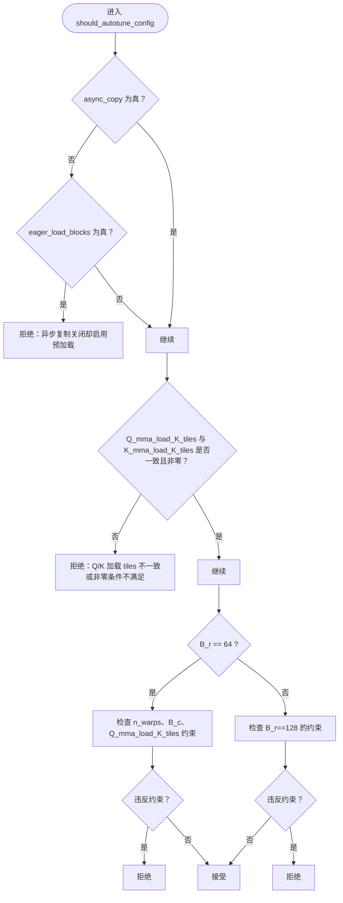
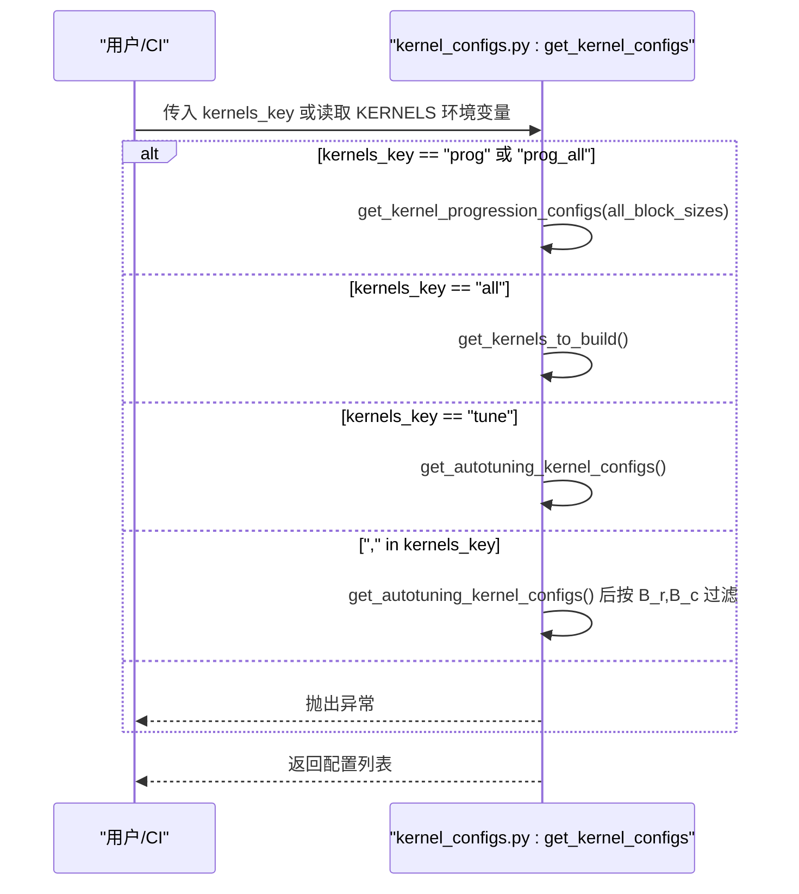
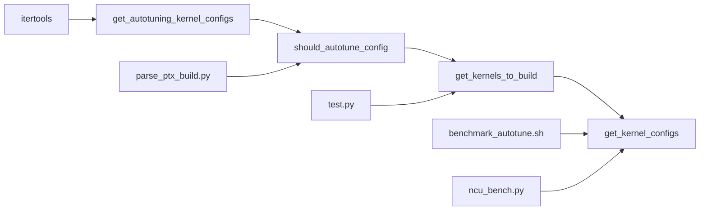

# 配置枚举与验证机制

<cite>
**本文引用的文件**
- [kernel_configs.py](file://py/flash_helpers/kernel_configs.py)
- [test.py](file://py/flash_helpers/test/test.py)
- [benchmark_autotune.sh](file://tools/benchmark/benchmark_autotune.sh)
- [ncu_bench.py](file://tools/benchmark/ncu_bench.py)
- [parse_ptx_build.py](file://tools/build/parse_ptx_build.py)
</cite>

## 目录
1. [引言](#引言)
2. [项目结构](#项目结构)
3. [核心组件](#核心组件)
4. [架构总览](#架构总览)
5. [详细组件分析](#详细组件分析)
6. [依赖关系分析](#依赖关系分析)
7. [性能考量](#性能考量)
8. [故障排查指南](#故障排查指南)
9. [结论](#结论)
10. [附录](#附录)

## 引言
本文件围绕“配置枚举与验证机制”展开，重点阐述如何通过 get_kernels_to_build 函数生成所有有效的内核配置组合，并说明其内部如何调用 get_autotuning_kernel_configs 枚举所有可能的优化配置（包括异步复制、预加载、swizzling、双缓冲等），再由 should_autotune_config 过滤掉无效或低效的配置组合。文档还梳理了配置空间的维度（数据类型、头维度、块大小、线程束数量等）与约束条件（如寄存器使用限制、性能阈值等），并通过实际代码路径示例展示 itertools.product 如何生成笛卡尔积组合，以及 should_autotune_config 如何基于 B_r、B_c 等参数进行筛选，最终确保生成的映射表既完整又高效。

## 项目结构
本仓库中与“配置枚举与验证机制”直接相关的核心文件位于 py/flash_helpers/kernel_configs.py，配套的测试与基准脚本用于验证与评估这些配置的有效性与性能表现。

图表来源
- [kernel_configs.py](file://py/flash_helpers/kernel_configs.py#L106-L173)
- [test.py](file://py/flash_helpers/test/test.py#L68-L100)
- [benchmark_autotune.sh](file://tools/benchmark/benchmark_autotune.sh#L1-L4)
- [ncu_bench.py](file://tools/benchmark/ncu_bench.py#L397-L442)
- [parse_ptx_build.py](file://tools/build/parse_ptx_build.py#L94-L124)

章节来源
- [kernel_configs.py](file://py/flash_helpers/kernel_configs.py#L106-L173)
- [test.py](file://py/flash_helpers/test/test.py#L68-L100)

## 核心组件
- 配置数据类：FlashForwardKernelConfig
  - 字段涵盖数据类型、头维度、块大小（B_r、B_c）、线程束数量（n_warps）、异步复制、预加载、swizzled、Q/K/V 的 MMA 加载 K tiles、双缓冲加载、优化 softmax 等。
  - 提供短字符串表示、C++ 结构体转换、总 FLOP 计算等辅助方法。
- 配置枚举与过滤：
  - get_autotuning_kernel_configs：以笛卡尔积方式枚举配置空间，随后用 should_autotune_config 过滤。
  - should_autotune_config：基于 B_r、B_c、n_warps、Q/K/V 加载 tiles 等参数施加约束。
  - get_kernels_to_build：汇总可用配置集合（当前主要来自自动调参配置）。
  - get_kernel_configs：根据环境变量 KERNELS 或传入参数选择不同策略（全部、进度式、仅调参、按 B_r,B_c 精确筛选）。

章节来源
- [kernel_configs.py](file://py/flash_helpers/kernel_configs.py#L106-L173)
- [kernel_configs.py](file://py/flash_helpers/kernel_configs.py#L364-L387)
- [kernel_configs.py](file://py/flash_helpers/kernel_configs.py#L389-L424)
- [kernel_configs.py](file://py/flash_helpers/kernel_configs.py#L457-L463)
- [kernel_configs.py](file://py/flash_helpers/kernel_configs.py#L465-L485)

## 架构总览
下图展示了从“配置枚举到验证再到使用的端到端流程”。

图表来源
- [kernel_configs.py](file://py/flash_helpers/kernel_configs.py#L389-L424)
- [kernel_configs.py](file://py/flash_helpers/kernel_configs.py#L457-L463)

## 详细组件分析

### 组件A：FlashForwardKernelConfig 数据模型
- 字段与语义
  - dtype：数据类型（FP16/BF16）
  - d_head：头维度（固定为 128）
  - B_r、B_c：块大小（行/列方向）
  - n_warps：线程束数量
  - async_copy、eager_load_blocks、swizzled：异步复制、预加载、swizzling 开关
  - Q_mma_load_K_tiles、K_mma_load_K_tiles、V_mma_load_K_tiles：Q/K/V 的 MMA 加载 K tiles 数
  - mma_double_buffer_loads：MMA 双缓冲加载开关
  - optimized_softmax：优化 softmax 开关
- 表达与转换
  - short_form：将配置转为可读字符串形式，便于日志与报告
  - to_cpp_struct：将配置转为 C++ 结构体字面量，便于生成内核实例化代码
  - total_flop/attn_flop：提供 FLOP 估算能力，辅助性能分析

图表来源
- [kernel_configs.py](file://py/flash_helpers/kernel_configs.py#L106-L173)

章节来源
- [kernel_configs.py](file://py/flash_helpers/kernel_configs.py#L106-L173)

### 组件B：配置枚举与笛卡尔积生成
- get_autotuning_kernel_configs
  - 定义配置空间各维度的候选集合（如 dtype、d_head、B_r、B_c、n_warps、async_copy、eager_load_blocks、swizzled、Q/K/V 加载 tiles、双缓冲、优化 softmax 等）
  - 使用 itertools.product(*params) 生成笛卡尔积组合
  - 对每个组合构造 FlashForwardKernelConfig 并调用 should_autotune_config 进行过滤
- get_kernels_to_build
  - 当前实现将“自动调参配置”作为唯一来源，返回排序后的去重集合

图表来源
- [kernel_configs.py](file://py/flash_helpers/kernel_configs.py#L389-L424)
- [kernel_configs.py](file://py/flash_helpers/kernel_configs.py#L457-L463)

章节来源
- [kernel_configs.py](file://py/flash_helpers/kernel_configs.py#L389-L424)
- [kernel_configs.py](file://py/flash_helpers/kernel_configs.py#L457-L463)

### 组件C：配置验证与约束
- should_autotune_config 的关键约束
  - 异步复制与预加载的互斥/组合规则：当未启用异步复制时，不能启用预加载
  - Q/K 的 MMA 加载 K tiles 必须一致且非零时需满足一致性
  - B_r=64 的分支：
    - n_warps=8 不允许
    - B_c=32 且 Q_mma_load_K_tiles=0 时不允许（寄存器阈值过高）
    - B_c=64 且 Q_mma_load_K_tiles!=0 时不允许
  - B_r=128 的分支：
    - Q_mma_load_K_tiles 必须非零
- 这些约束确保生成的配置在寄存器占用、内存带宽与计算强度之间取得平衡，避免无效或低效组合进入后续编译与运行阶段。

图表来源
- [kernel_configs.py](file://py/flash_helpers/kernel_configs.py#L364-L387)

章节来源
- [kernel_configs.py](file://py/flash_helpers/kernel_configs.py#L364-L387)

### 组件D：配置选择与环境变量驱动
- get_kernel_configs
  - 支持多种模式：
    - prog/prog_all：返回“进度式”配置序列（包含不同 B_r、B_c、n_warps 的组合）
    - all：返回 get_kernels_to_build 的结果
    - tune：返回 get_autotuning_kernel_configs 的结果
    - "B_r,B_c"：按指定 B_r、B_c 过滤自动调参配置
  - 默认从环境变量 KERNELS 读取策略

图表来源
- [kernel_configs.py](file://py/flash_helpers/kernel_configs.py#L465-L485)

章节来源
- [kernel_configs.py](file://py/flash_helpers/kernel_configs.py#L465-L485)

### 组件E：测试与基准中的配置使用
- 测试
  - 单元测试通过 get_kernels_to_build 获取配置集合，并按 dtype 进行筛选后逐一执行验证。
- 自动调参脚本
  - 通过设置 KERNELS=tune 触发调参模式，配合 ncu_bench.py 采集性能指标，形成“配置—性能”的映射表。
- PTX/寄存器分析
  - parse_ptx_build.py 解析 PTX/汇编统计，提取寄存器使用、栈帧、共享内存等指标，为 should_autotune_config 的约束提供依据与回溯手段。

章节来源
- [test.py](file://py/flash_helpers/test/test.py#L68-L100)
- [benchmark_autotune.sh](file://tools/benchmark/benchmark_autotune.sh#L1-L4)
- [ncu_bench.py](file://tools/benchmark/ncu_bench.py#L397-L442)
- [parse_ptx_build.py](file://tools/build/parse_ptx_build.py#L94-L124)

## 依赖关系分析
- 内部依赖
  - FlashForwardKernelConfig 是所有枚举/过滤逻辑的基础数据结构
  - get_autotuning_kernel_configs 依赖 itertools.product 生成笛卡尔积
  - should_autotune_config 依赖 FlashForwardKernelConfig 的字段进行约束判断
  - get_kernels_to_build 依赖 get_autotuning_kernel_configs
  - get_kernel_configs 依赖上述多个函数，并支持环境变量驱动
- 外部依赖
  - 测试与基准脚本依赖 kernel_configs.py 的接口
  - PTX 分析工具用于验证寄存器/栈帧等硬件约束

图表来源
- [kernel_configs.py](file://py/flash_helpers/kernel_configs.py#L389-L424)
- [kernel_configs.py](file://py/flash_helpers/kernel_configs.py#L457-L463)
- [kernel_configs.py](file://py/flash_helpers/kernel_configs.py#L465-L485)
- [test.py](file://py/flash_helpers/test/test.py#L68-L100)
- [benchmark_autotune.sh](file://tools/benchmark/benchmark_autotune.sh#L1-L4)
- [ncu_bench.py](file://tools/benchmark/ncu_bench.py#L397-L442)
- [parse_ptx_build.py](file://tools/build/parse_ptx_build.py#L94-L124)

章节来源
- [kernel_configs.py](file://py/flash_helpers/kernel_configs.py#L389-L424)
- [kernel_configs.py](file://py/flash_helpers/kernel_configs.py#L457-L463)
- [kernel_configs.py](file://py/flash_helpers/kernel_configs.py#L465-L485)
- [test.py](file://py/flash_helpers/test/test.py#L68-L100)
- [benchmark_autotune.sh](file://tools/benchmark/benchmark_autotune.sh#L1-L4)
- [ncu_bench.py](file://tools/benchmark/ncu_bench.py#L397-L442)
- [parse_ptx_build.py](file://tools/build/parse_ptx_build.py#L94-L124)

## 性能考量
- 配置空间规模
  - 通过笛卡尔积生成的组合数量等于各维度候选数的乘积。例如：dtype×d_head×B_r×B_c×n_warps×async_copy×eager_load_blocks×swizzled×Q/K/V tiles×双缓冲×优化 softmax。
  - 在当前实现中，维度较多但候选集有限，整体组合规模可控。
- 约束过滤效果
  - should_autotune_config 显著减少无效组合数量，避免寄存器超限、内存带宽瓶颈与计算效率低下等问题。
- 实际评估
  - 通过 ncu_bench.py 与 parse_ptx_build.py 的指标（如寄存器使用、指令计数、吞吐）对配置进行量化评估，形成“配置—性能”映射，指导后续筛选与迭代。

[本节为通用性能讨论，无需列出具体文件来源]

## 故障排查指南
- 环境变量 KERNELS 使用错误
  - 现象：抛出“无效 kernels env key”异常
  - 排查：确认 KERNELS 的取值是否为 "prog"/"prog_all"/"all"/"tune" 或 "B_r,B_c"
  - 参考路径：[get_kernel_configs](file://py/flash_helpers/kernel_configs.py#L465-L485)
- 自动调参配置为空
  - 现象：get_autotuning_kernel_configs 返回空列表
  - 排查：检查 should_autotune_config 的约束是否过于严格；确认候选集合（如 B_r、B_c、n_warps、tiles 等）是否合理
  - 参考路径：[get_autotuning_kernel_configs](file://py/flash_helpers/kernel_configs.py#L389-L424)，[should_autotune_config](file://py/flash_helpers/kernel_configs.py#L364-L387)
- 寄存器超限或性能异常
  - 现象：运行时寄存器不足或性能低于预期
  - 排查：使用 parse_ptx_build.py 检查寄存器/栈帧/共享内存使用；结合 should_autotune_config 的约束进行回溯
  - 参考路径：[parse_ptx_build.py](file://tools/build/parse_ptx_build.py#L94-L124)，[should_autotune_config](file://py/flash_helpers/kernel_configs.py#L364-L387)
- 基准采集问题
  - 现象：ncu_bench.py 无法正确解析指标或输出为空
  - 排查：确认 CSV 输出格式与 METRICS_MAP 匹配；检查 KERNELS=tune 是否生效
  - 参考路径：[benchmark_autotune.sh](file://tools/benchmark/benchmark_autotune.sh#L1-L4)，[ncu_bench.py](file://tools/benchmark/ncu_bench.py#L397-L442)

章节来源
- [kernel_configs.py](file://py/flash_helpers/kernel_configs.py#L364-L387)
- [kernel_configs.py](file://py/flash_helpers/kernel_configs.py#L389-L424)
- [kernel_configs.py](file://py/flash_helpers/kernel_configs.py#L465-L485)
- [parse_ptx_build.py](file://tools/build/parse_ptx_build.py#L94-L124)
- [benchmark_autotune.sh](file://tools/benchmark/benchmark_autotune.sh#L1-L4)
- [ncu_bench.py](file://tools/benchmark/ncu_bench.py#L397-L442)

## 结论
- get_kernels_to_build 通过 get_autotuning_kernel_configs 以笛卡尔积方式系统地枚举配置空间，并借助 should_autotune_config 的多维约束（如异步复制与预加载的互斥、Q/K 加载 tiles 的一致性、B_r/B_c/n_warps 的组合规则、寄存器阈值等）过滤无效或低效组合，最终生成既完整又高效的内核配置集合。
- 该机制与测试、基准脚本及 PTX 分析工具协同工作，形成“配置—性能”的闭环，支撑后续的自动化调参与工程化落地。

[本节为总结性内容，无需列出具体文件来源]

## 附录
- 关键实现路径参考
  - 配置数据类与方法：[FlashForwardKernelConfig](file://py/flash_helpers/kernel_configs.py#L106-L173)
  - 自动调参配置枚举与过滤：[get_autotuning_kernel_configs](file://py/flash_helpers/kernel_configs.py#L389-L424)，[should_autotune_config](file://py/flash_helpers/kernel_configs.py#L364-L387)
  - 全量配置汇总：[get_kernels_to_build](file://py/flash_helpers/kernel_configs.py#L457-L463)
  - 环境变量驱动的选择器：[get_kernel_configs](file://py/flash_helpers/kernel_configs.py#L465-L485)
  - 测试中使用配置集合：[test.py](file://py/flash_helpers/test/test.py#L68-L100)
  - 自动调参脚本入口：[benchmark_autotune.sh](file://tools/benchmark/benchmark_autotune.sh#L1-L4)
  - 基准采集与指标合并：[ncu_bench.py](file://tools/benchmark/ncu_bench.py#L397-L442)
  - PTX/寄存器统计解析：[parse_ptx_build.py](file://tools/build/parse_ptx_build.py#L94-L124)