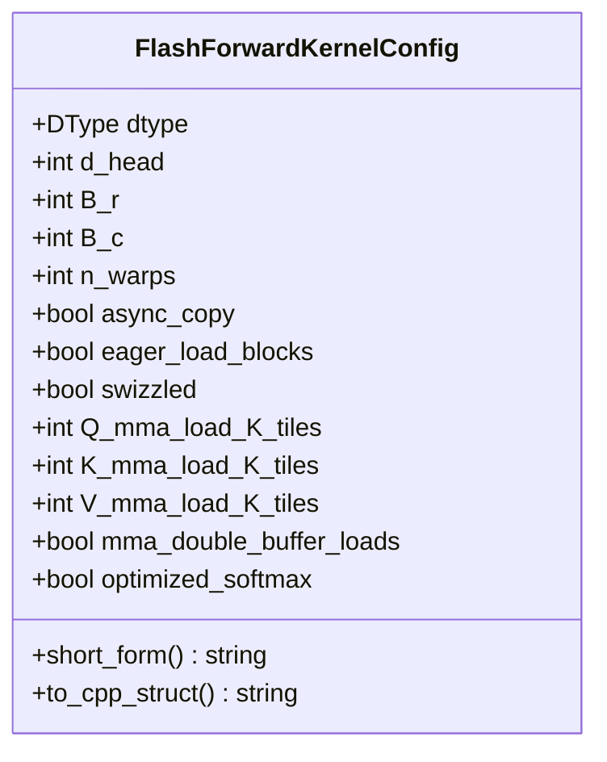
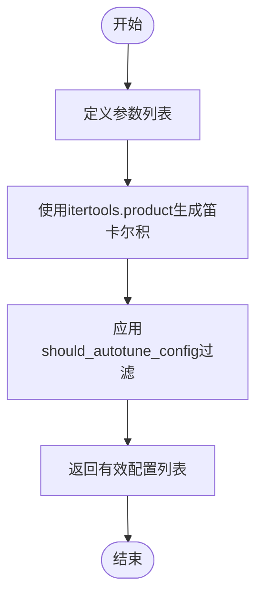
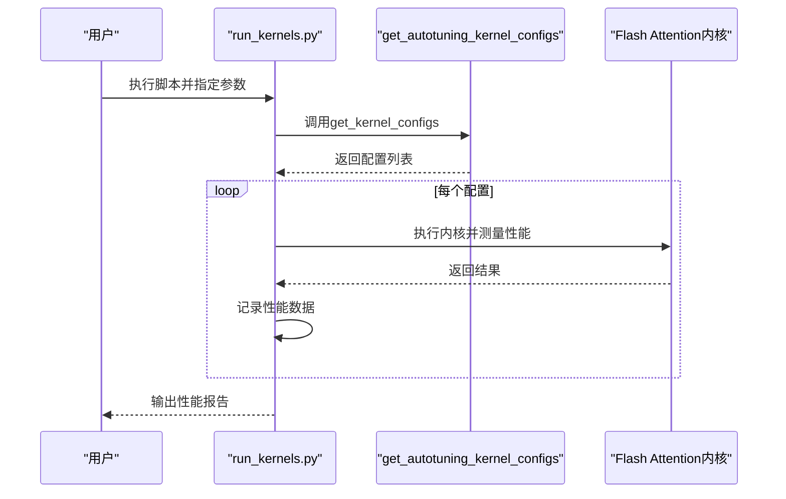

# 配置空间探索机制

<cite>
**本文档引用的文件**
- [kernel_configs.py](file://py/flash_helpers/kernel_configs.py)
- [flash_attention.cuh](file://src/include/flash_attention.cuh)
- [flash_attention.cu](file://src/flash_attention.cu)
- [run_kernels.py](file://tools/benchmark/run_kernels.py)
- [benchmark_autotune.sh](file://tools/benchmark/benchmark_autotune.sh)
</cite>

## 目录
1. [引言](#引言)
2. [配置空间定义](#配置空间定义)
3. [核心配置参数](#核心配置参数)
4. [配置生成机制](#配置生成机制)
5. [配置过滤策略](#配置过滤策略)
6. [配置空间应用](#配置空间应用)
7. [性能调优流程](#性能调优流程)
8. [结论](#结论)

## 引言
配置空间探索机制是Flash Attention实现高性能的关键组成部分。该机制通过系统性地生成和评估各种内核配置组合，为不同硬件和工作负载找到最优的执行参数。本文档详细说明`get_autotuning_kernel_configs`函数如何构建完整的配置空间，解释各个配置维度的技术依据，并阐述这种系统化探索如何为性能调优提供全面的候选配置集。

## 配置空间定义

配置空间探索机制的核心是`FlashForwardKernelConfig`数据类，它定义了Flash Attention内核的所有可调参数。该配置类包含了从数据类型到内存访问模式的多个维度，形成了一个多维的配置空间。

**图示来源**
- [kernel_configs.py](file://py/flash_helpers/kernel_configs.py#L106-L175)
- [flash_attention.cuh](file://src/include/flash_attention.cuh#L34-L109)

**本节来源**
- [kernel_configs.py](file://py/flash_helpers/kernel_configs.py#L106-L175)
- [flash_attention.cuh](file://src/include/flash_attention.cuh#L34-L109)

## 核心配置参数

配置空间由多个关键参数维度组成，每个维度都有其特定的取值范围和技术依据。

### 数据类型与头维度
数据类型（dtype）和头维度（d_head）是配置空间的基础参数。在当前实现中，d_head固定为128，这是基于现代GPU架构的优化选择，能够充分利用Tensor Core的计算能力，同时保持良好的内存访问模式。

**本节来源**
- [kernel_configs.py](file://py/flash_helpers/kernel_configs.py#L390)
- [flash_attention.cuh](file://src/include/flash_attention.cuh#L36)

### 块大小与线程束数量
块大小（B_r和B_c）和线程束数量（n_warps）是影响内存访问和计算效率的关键参数。B_r和B_c选择64/128和32/64的组合，这是基于内存带宽和计算密度的权衡。n_warps限定为4，这是为了在保持高GPU利用率的同时避免寄存器压力过大。

**本节来源**
- [kernel_configs.py](file://py/flash_helpers/kernel_configs.py#L391-L393)
- [flash_attention.cuh](file://src/include/flash_attention.cuh#L37-L39)

### 内存访问优化参数
配置空间还包括多个内存访问优化参数：
- **异步复制（async_copy）**：启用异步内存复制以重叠计算和数据传输
- **预加载（eager_load_blocks）**：尽早将K和V块加载到共享内存
- **swizzling**：内存访问模式优化，提高内存带宽利用率
- **MMA加载瓦片数**：控制矩阵乘法累加操作的加载模式
- **双缓冲**：在计算当前迭代的同时预加载下一次迭代的数据
- **优化Softmax**：使用优化的Softmax实现以提高性能

**本节来源**
- [kernel_configs.py](file://py/flash_helpers/kernel_configs.py#L394-L401)
- [flash_attention.cuh](file://src/include/flash_attention.cuh#L41-L52)

## 配置生成机制

配置空间探索的核心是`get_autotuning_kernel_configs`函数，它使用`itertools.product`生成所有可能的配置组合。

**图示来源**
- [kernel_configs.py](file://py/flash_helpers/kernel_configs.py#L389-L423)

**本节来源**
- [kernel_configs.py](file://py/flash_helpers/kernel_configs.py#L389-L423)

### 参数列表构建
函数首先定义各个配置维度的取值范围，然后将这些参数列表组合成一个参数数组。这种设计使得配置空间的扩展和修改变得简单直观。

**本节来源**
- [kernel_configs.py](file://py/flash_helpers/kernel_configs.py#L390-L417)

### 笛卡尔积生成
使用`itertools.product`生成所有参数组合的笛卡尔积，这是配置空间探索的核心。这种方法确保了所有可能的配置都被系统性地考虑，为后续的性能调优提供了全面的候选集。

**本节来源**
- [kernel_configs.py](file://py/flash_helpers/kernel_configs.py#L419-L422)

## 配置过滤策略

并非所有生成的配置都是有效的或有意义的，因此需要通过`should_autotune_config`函数进行过滤。

### 逻辑约束
过滤函数实施了多个逻辑约束，例如：
- 当不使用异步复制时，禁用预加载
- 限制B_r为64时的线程束数量
- 根据块大小和MMA加载模式的组合进行约束

这些约束确保了生成的配置在硬件和算法层面都是可行的。

**本节来源**
- [kernel_configs.py](file://py/flash_helpers/kernel_configs.py#L364-L386)

### 性能导向过滤
过滤策略还考虑了性能因素，例如避免可能导致寄存器溢出的配置组合。这种基于经验的过滤减少了需要实际测试的配置数量，提高了调优效率。

**本节来源**
- [kernel_configs.py](file://py/flash_helpers/kernel_configs.py#L373-L385)

## 配置空间应用

生成的配置空间在多个场景中得到应用，包括基准测试和实际性能调优。

### 基准测试集成
`run_kernels.py`脚本使用生成的配置进行基准测试，通过命令行参数选择要测试的配置，并测量其性能表现。

**图示来源**
- [run_kernels.py](file://tools/benchmark/run_kernels.py#L23-L158)
- [kernel_configs.py](file://py/flash_helpers/kernel_configs.py#L465-L485)

**本节来源**
- [run_kernels.py](file://tools/benchmark/run_kernels.py#L23-L158)

### 自动调优流程
`benchmark_autotune.sh`脚本展示了如何将配置空间探索集成到自动调优流程中，通过设置环境变量`KERNELS=tune`来选择使用调优配置进行测试。

**本节来源**
- [benchmark_autotune.sh](file://tools/benchmark/benchmark_autotune.sh#L1-L4)

## 性能调优流程

配置空间探索机制支持多种调优模式，从渐进式探索到全面搜索。

### 渐进式探索
`get_kernel_progression_configs`函数提供了一种渐进式探索方法，从基础配置开始，逐步添加优化特性，便于分析每个优化对性能的影响。

**本节来源**
- [kernel_configs.py](file://py/flash_helpers/kernel_configs.py#L426-L454)

### 全面搜索
`get_autotuning_kernel_configs`函数提供了全面的配置搜索，适用于需要找到绝对最优配置的场景。这种全面的探索确保了不会错过任何潜在的性能提升机会。

**本节来源**
- [kernel_configs.py](file://py/flash_helpers/kernel_configs.py#L389-L423)

## 结论
配置空间探索机制通过系统性地生成和评估各种内核配置组合，为Flash Attention的性能优化提供了坚实的基础。`get_autotuning_kernel_configs`函数利用`itertools.product`生成完整的笛卡尔积组合，覆盖了从数据类型到内存访问模式的多个维度。通过合理的参数选择和过滤策略，该机制能够在保证配置有效性的同时，为后续的性能调优提供全面的候选配置集。这种系统化的探索方法不仅提高了调优效率，还确保了能够找到最优的内核配置，充分发挥硬件性能。