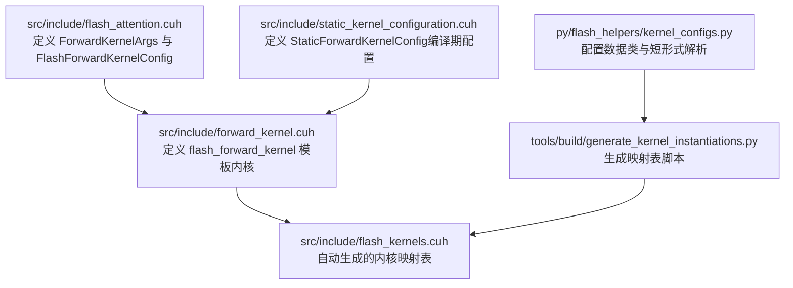
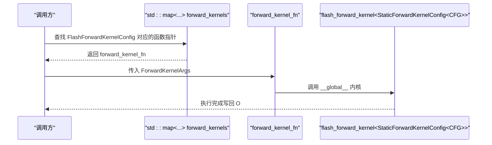
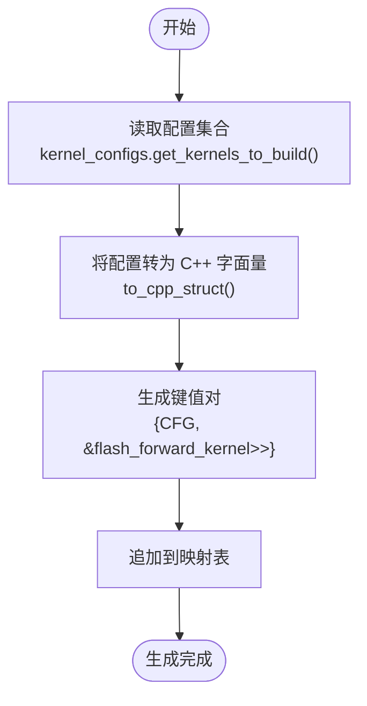
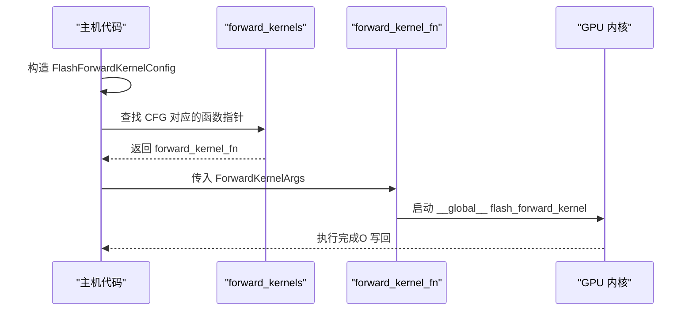
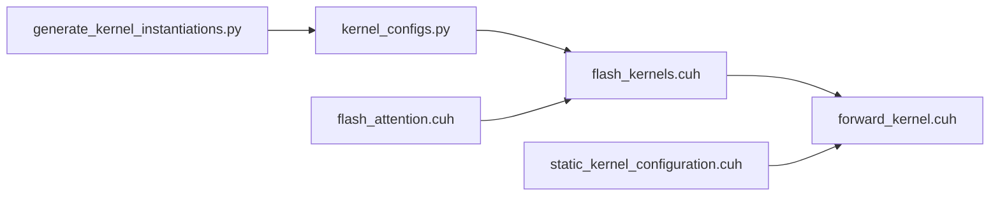

# 内核函数指针值

<cite>
**本文引用的文件**
- [src/include/flash_kernels.cuh](file://src/include/flash_kernels.cuh)
- [src/include/forward_kernel.cuh](file://src/include/forward_kernel.cuh)
- [src/include/static_kernel_configuration.cuh](file://src/include/static_kernel_configuration.cuh)
- [src/include/flash_attention.cuh](file://src/include/flash_attention.cuh)
- [tools/build/generate_kernel_instantiations.py](file://tools/build/generate_kernel_instantiations.py)
- [py/flash_helpers/kernel_configs.py](file://py/flash_helpers/kernel_configs.py)
</cite>

## 目录
1. [引言](#引言)
2. [项目结构](#项目结构)
3. [核心组件](#核心组件)
4. [架构总览](#架构总览)
5. [详细组件分析](#详细组件分析)
6. [依赖关系分析](#依赖关系分析)
7. [性能考量](#性能考量)
8. [故障排查指南](#故障排查指南)
9. [结论](#结论)

## 引言
本文件围绕“内核配置映射值”主题，系统解析以下关键点：
- 函数指针类型 typedef void (*forward_kernel_fn)(const ForwardKernelArgs) 的设计动机与签名语义。
- ForwardKernelArgs 如何封装内核执行所需的输入输出张量与布局、步长、块数等全部信息。
- flash_forward_kernel 模板函数如何通过 StaticForwardKernelConfig 特化实例化，并与 FlashForwardKernelConfig 在编译期完成绑定。
- std::map<FlashForwardKernelConfig, forward_kernel_fn> 的映射机制如何实现运行时配置到具体内核实例的高效查找与调用。
- 这种间接调用机制对性能的影响以及可采取的优化策略。

## 项目结构
本主题涉及的文件主要位于 src/include 目录，构建工具自动生成映射表，辅助配置解析由 Python 工具提供。

图表来源
- [src/include/flash_attention.cuh](file://src/include/flash_attention.cuh#L1-L110)
- [src/include/static_kernel_configuration.cuh](file://src/include/static_kernel_configuration.cuh#L1-L294)
- [src/include/forward_kernel.cuh](file://src/include/forward_kernel.cuh#L1-L207)
- [src/include/flash_kernels.cuh](file://src/include/flash_kernels.cuh#L1-L187)
- [tools/build/generate_kernel_instantiations.py](file://tools/build/generate_kernel_instantiations.py#L1-L56)
- [py/flash_helpers/kernel_configs.py](file://py/flash_helpers/kernel_configs.py#L106-L175)

章节来源
- [src/include/flash_kernels.cuh](file://src/include/flash_kernels.cuh#L1-L187)
- [src/include/forward_kernel.cuh](file://src/include/forward_kernel.cuh#L1-L207)
- [src/include/static_kernel_configuration.cuh](file://src/include/static_kernel_configuration.cuh#L1-L294)
- [src/include/flash_attention.cuh](file://src/include/flash_attention.cuh#L1-L110)
- [tools/build/generate_kernel_instantiations.py](file://tools/build/generate_kernel_instantiations.py#L1-L56)
- [py/flash_helpers/kernel_configs.py](file://py/flash_helpers/kernel_configs.py#L106-L175)

## 核心组件
- 函数指针类型：typedef void (*forward_kernel_fn)(const ForwardKernelArgs)，用于统一内核入口签名，便于以键值映射的方式在运行时选择不同配置的内核实例。
- ForwardKernelArgs：封装所有内核执行所需的张量指针、步长、块计数等，作为内核函数的唯一参数载体。
- FlashForwardKernelConfig：描述一次内核实例化的完整配置，包含数据类型、块尺寸、线程块/瓦片参数、异步拷贝、预加载、swizzle、mma 双缓冲、softmax 优化等。
- StaticForwardKernelConfig：基于 FlashForwardKernelConfig 的编译期常量配置，派生出内存布局、寄存器/共享内存形状、GEMM 配置等类型级常量。
- flash_forward_kernel 模板：接收一个 Kernel 类型（特化为 StaticForwardKernelConfig<CFG>），在 __global__ 中按配置执行前向注意力计算。
- 映射表 forward_kernels：std::map<FlashForwardKernelConfig, forward_kernel_fn>，将运行时配置映射到已编译好的内核实例地址。

章节来源
- [src/include/flash_kernels.cuh](file://src/include/flash_kernels.cuh#L12-L187)
- [src/include/flash_attention.cuh](file://src/include/flash_attention.cuh#L1-L110)
- [src/include/static_kernel_configuration.cuh](file://src/include/static_kernel_configuration.cuh#L104-L120)
- [src/include/forward_kernel.cuh](file://src/include/forward_kernel.cuh#L85-L204)

## 架构总览
下图展示了从配置到内核调用的整体流程：运行时根据输入配置在映射表中查找对应函数指针，再以统一的 ForwardKernelArgs 调用内核。

图表来源
- [src/include/flash_kernels.cuh](file://src/include/flash_kernels.cuh#L12-L187)
- [src/include/forward_kernel.cuh](file://src/include/forward_kernel.cuh#L85-L204)
- [src/include/flash_attention.cuh](file://src/include/flash_attention.cuh#L1-L29)

## 详细组件分析

### 函数指针类型与 ForwardKernelArgs 设计
- 函数指针类型 typedef void (*forward_kernel_fn)(const ForwardKernelArgs) 将内核入口签名标准化，使映射表可以存储不同配置的内核实例地址，调用方仅需持有统一的函数指针即可触发执行。
- ForwardKernelArgs 结构体集中封装了：
  - 输入输出张量指针：Q、K、V、O
  - 步长与维度：batch_stride、seq_stride、head_stride、seq_len、n_heads
  - 块计数：n_Q_blocks、n_KV_blocks
- 这种设计使得内核无需直接访问外部上下文，所有必要信息均通过 args 传入，简化了内核接口与调用路径。

章节来源
- [src/include/flash_kernels.cuh](file://src/include/flash_kernels.cuh#L12-L12)
- [src/include/flash_attention.cuh](file://src/include/flash_attention.cuh#L1-L29)

### FlashForwardKernelConfig 编译期绑定
- FlashForwardKernelConfig 描述了内核实例化的全部静态特征，包括 dtype、d_head、B_r、B_c、n_warps、async_copy、eager_load_blocks、swizzled、Q/K/V 的 mma 加载片段数、mma 双缓冲、optimized_softmax 等。
- 该配置通过 operator< 实现可排序性，从而作为 std::map 的键使用。
- 生成脚本 tools/build/generate_kernel_instantiations.py 会读取 Python 层的配置集合，逐个生成键值对，键为 FlashForwardKernelConfig 实例，值为 flash_forward_kernel<StaticForwardKernelConfig<CFG>> 的地址。

章节来源
- [src/include/flash_attention.cuh](file://src/include/flash_attention.cuh#L30-L109)
- [tools/build/generate_kernel_instantiations.py](file://tools/build/generate_kernel_instantiations.py#L1-L56)
- [py/flash_helpers/kernel_configs.py](file://py/flash_helpers/kernel_configs.py#L106-L175)

### StaticForwardKernelConfig 与类型级常量
- StaticForwardKernelConfig 将 FlashForwardKernelConfig 的运行时配置提升为编译期常量，派生出：
  - 数据类型 value_t（half 或 nv_bfloat16）
  - 线程块/瓦片形状 ForwardKernelTileShapes
  - 共享内存/寄存器布局、GEMM 配置、swizzle 参数、tile 形状等
- 这些常量在编译期确定，避免运行时分支与动态开销，是高性能的关键。

章节来源
- [src/include/static_kernel_configuration.cuh](file://src/include/static_kernel_configuration.cuh#L104-L120)
- [src/include/static_kernel_configuration.cuh](file://src/include/static_kernel_configuration.cuh#L1-L103)

### flash_forward_kernel 模板与实例化
- flash_forward_kernel 是一个 __global__ 模板内核，其模板参数 Kernel 必须满足 StaticForwardKernelConfig 的约束。
- 内核内部：
  - 解析 blockIdx 计算样本、头、q_seq_block
  - 计算 Q/O、K/V 的全局内存偏移
  - 分配共享内存区域，构造 Q/K/V、O 等张量视图
  - 初始化 softmax 缩放因子与行统计量
  - 循环处理 KV 块，执行 QK 矩乘、softmax、PV 矩乘
  - 最终归一化并写回 O
- 通过 Kernel::B_r、Kernel::B_c、Kernel::d_head 等编译期常量，内核在编译时就确定了 tile 大小、寄存器/共享内存布局、GEMM 参数等。

章节来源
- [src/include/forward_kernel.cuh](file://src/include/forward_kernel.cuh#L85-L204)
- [src/include/static_kernel_configuration.cuh](file://src/include/static_kernel_configuration.cuh#L1-L294)

### 映射表的生成与绑定机制
- 映射表 forward_kernels 定义于 src/include/flash_kernels.cuh，键为 FlashForwardKernelConfig，值为 forward_kernel_fn。
- 生成脚本 generate_kernel_instantiations.py 会：
  - 读取 Python 层的配置集合（kernel_configs.py）
  - 将每个配置转换为 C++ 字面量字符串
  - 生成键值对：{CFG, &flash_forward_kernel<StaticForwardKernelConfig<CFG>>}
  - 写入 flash_kernels.cuh
- 这样，运行时只需提供 FlashForwardKernelConfig，即可在 std::map 中找到对应的内核实例地址并调用。

图表来源
- [tools/build/generate_kernel_instantiations.py](file://tools/build/generate_kernel_instantiations.py#L1-L56)
- [py/flash_helpers/kernel_configs.py](file://py/flash_helpers/kernel_configs.py#L148-L167)

章节来源
- [src/include/flash_kernels.cuh](file://src/include/flash_kernels.cuh#L12-L187)
- [tools/build/generate_kernel_instantiations.py](file://tools/build/generate_kernel_instantiations.py#L1-L56)
- [py/flash_helpers/kernel_configs.py](file://py/flash_helpers/kernel_configs.py#L148-L167)

### 运行时查找与调用流程
- 调用方根据当前输入的张量形状、数据类型、设备能力等，构造 FlashForwardKernelConfig。
- 在 forward_kernels 中查找该配置对应的函数指针。
- 以 ForwardKernelArgs 为参数调用函数指针，启动内核执行。
- 内核内部使用 Kernel::B_r、Kernel::B_c、Kernel::d_head 等编译期常量，确保执行路径在编译期固定，减少分支与动态开销。

图表来源
- [src/include/flash_kernels.cuh](file://src/include/flash_kernels.cuh#L12-L187)
- [src/include/forward_kernel.cuh](file://src/include/forward_kernel.cuh#L85-L204)
- [src/include/flash_attention.cuh](file://src/include/flash_attention.cuh#L1-L29)

## 依赖关系分析
- flash_kernels.cuh 依赖：
  - flash_attention.cuh：ForwardKernelArgs、FlashForwardKernelConfig
  - forward_kernel.cuh：flash_forward_kernel 模板
- forward_kernel.cuh 依赖：
  - flash_attention.cuh：ForwardKernelArgs、FlashForwardKernelConfig
  - static_kernel_configuration.cuh：StaticForwardKernelConfig
- generate_kernel_instantiations.py 依赖：
  - py/flash_helpers/kernel_configs.py：配置数据类与序列化方法
- 运行时调用链：
  - 调用方 -> forward_kernels -> flash_forward_kernel -> StaticForwardKernelConfig

图表来源
- [tools/build/generate_kernel_instantiations.py](file://tools/build/generate_kernel_instantiations.py#L1-L56)
- [py/flash_helpers/kernel_configs.py](file://py/flash_helpers/kernel_configs.py#L106-L175)
- [src/include/flash_kernels.cuh](file://src/include/flash_kernels.cuh#L1-L187)
- [src/include/forward_kernel.cuh](file://src/include/forward_kernel.cuh#L1-L207)
- [src/include/static_kernel_configuration.cuh](file://src/include/static_kernel_configuration.cuh#L1-L294)
- [src/include/flash_attention.cuh](file://src/include/flash_attention.cuh#L1-L110)

章节来源
- [src/include/flash_kernels.cuh](file://src/include/flash_kernels.cuh#L1-L187)
- [src/include/forward_kernel.cuh](file://src/include/forward_kernel.cuh#L1-L207)
- [src/include/static_kernel_configuration.cuh](file://src/include/static_kernel_configuration.cuh#L1-L294)
- [src/include/flash_attention.cuh](file://src/include/flash_attention.cuh#L1-L110)
- [tools/build/generate_kernel_instantiations.py](file://tools/build/generate_kernel_instantiations.py#L1-L56)
- [py/flash_helpers/kernel_configs.py](file://py/flash_helpers/kernel_configs.py#L106-L175)

## 性能考量
- 编译期绑定的优势：
  - 使用 StaticForwardKernelConfig 将配置提升为编译期常量，避免运行时分支与动态开销。
  - 内核内部的 tile 形状、寄存器/共享内存布局、GEMM 参数在编译期确定，有利于指令调度与寄存器分配。
- 运行时查找成本：
  - std::map 的查找为对数复杂度，通常远小于内核执行时间，影响有限。
  - 若热路径频繁重复相同配置，可考虑缓存最近一次查找结果或在上层做更粗粒度的命中率优化。
- 内核执行优化：
  - 异步拷贝 async_copy、预加载 eager_load_blocks、swizzled、mma 双缓冲等特性在配置层面决定，直接影响访存与计算重叠。
  - 通过合理的 B_r/B_c/d_head 组合与 tile 形状，最大化寄存器/共享内存利用率与带宽占用。
- 函数指针间接调用：
  - 一次函数指针调用开销极低，且被内核执行时间淹没；主要收益在于代码组织与可维护性。

[本节为通用性能讨论，不直接分析具体文件]

## 故障排查指南
- 配置不匹配导致的错误
  - 确认 FlashForwardKernelConfig 的字段与 StaticForwardKernelConfig 的预期一致（如 d_head、B_r、B_c、n_warps、load_K_fragments 等）。
  - 检查 operator< 的比较顺序是否与生成脚本一致，避免键冲突或排序异常。
- 映射表缺失
  - 如果某配置未出现在生成的映射表中，运行时查找会失败。检查 generate_kernel_instantiations.py 是否包含该配置，或 kernel_configs.py 的过滤逻辑是否排除了它。
- 内存/步长问题
  - ForwardKernelArgs 的步长与张量布局必须一致，否则会导致越界或错位读写。
- 编译期断言
  - StaticForwardKernelConfig 中存在针对 load_K_fragments 的静态断言，若配置非法会在编译时报错，需调整 Q/K/V 的 mma_load_K_fragments 或 d_head。

章节来源
- [src/include/flash_attention.cuh](file://src/include/flash_attention.cuh#L30-L109)
- [src/include/static_kernel_configuration.cuh](file://src/include/static_kernel_configuration.cuh#L13-L21)
- [tools/build/generate_kernel_instantiations.py](file://tools/build/generate_kernel_instantiations.py#L1-L56)

## 结论
- typedef void (*forward_kernel_fn)(const ForwardKernelArgs) 提供了统一的内核入口签名，配合 std::map 实现了运行时配置到内核实例的高效绑定。
- FlashForwardKernelConfig 与 StaticForwardKernelConfig 在编译期完成强绑定，确保内核执行路径在编译期固定，获得最佳性能。
- 生成脚本与 Python 配置模块协同工作，自动化地维护映射表，降低人工维护成本。
- 通过合理的配置组合与内存布局设计，可在不同硬件与数据规模下取得稳定高效的性能表现。