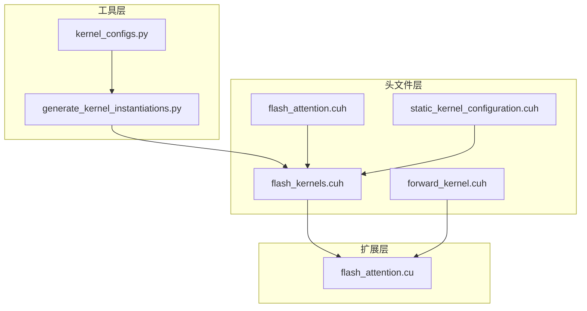
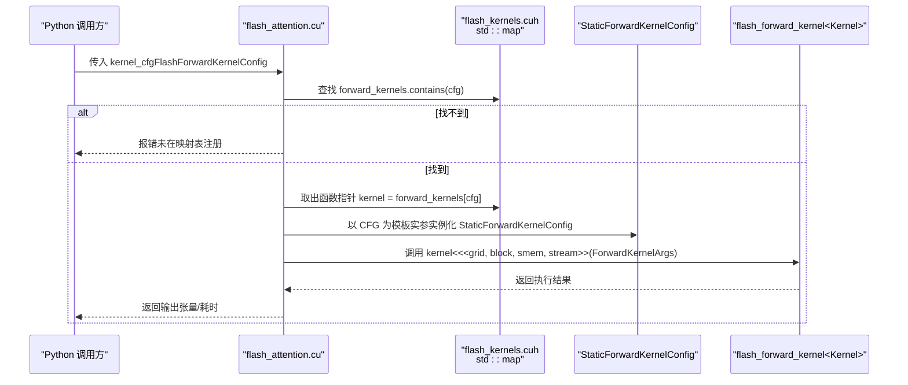
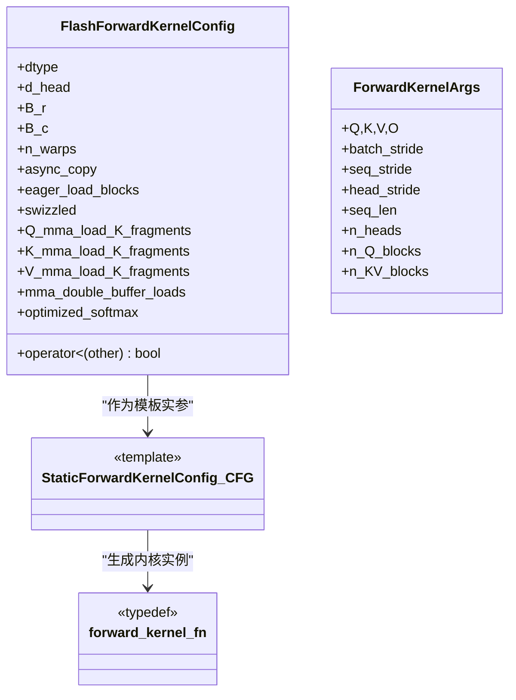
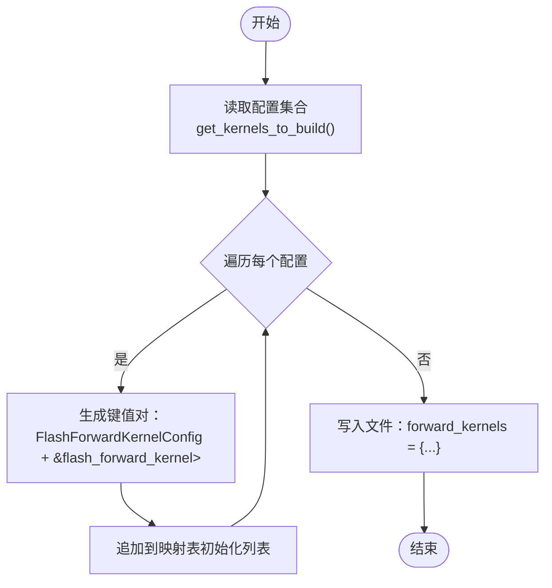
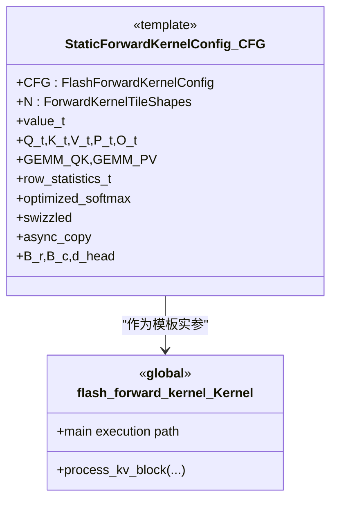
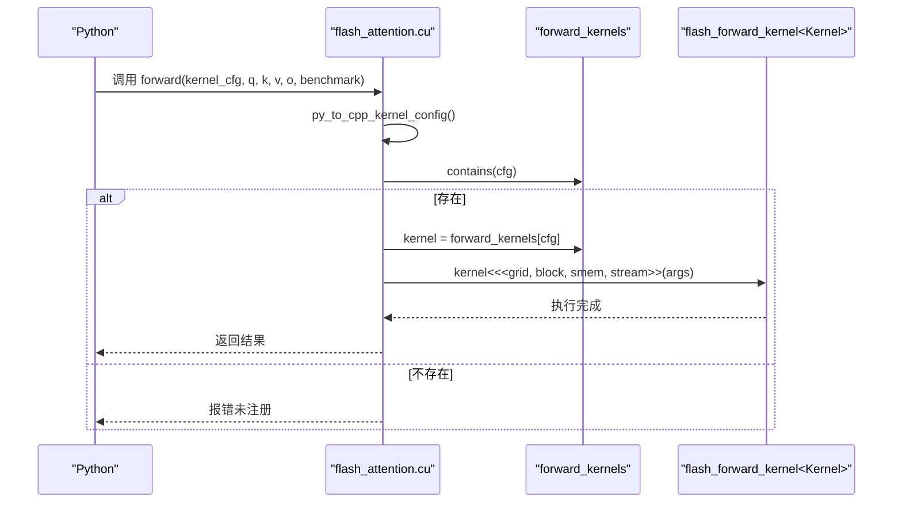
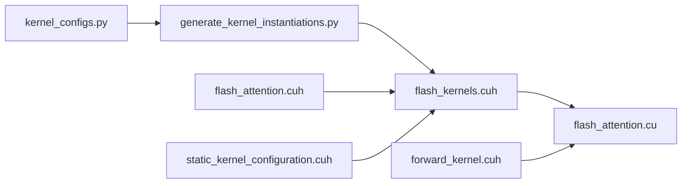

# 内核配置映射结构

<cite>
**本文引用的文件**
- [src/include/flash_kernels.cuh](file://src/include/flash_kernels.cuh)
- [src/include/flash_attention.cuh](file://src/include/flash_attention.cuh)
- [src/include/static_kernel_configuration.cuh](file://src/include/static_kernel_configuration.cuh)
- [src/include/forward_kernel.cuh](file://src/include/forward_kernel.cuh)
- [src/flash_attention.cu](file://src/flash_attention.cu)
- [tools/build/generate_kernel_instantiations.py](file://tools/build/generate_kernel_instantiations.py)
- [py/flash_helpers/kernel_configs.py](file://py/flash_helpers/kernel_configs.py)
</cite>

## 目录
1. [引言](#引言)
2. [项目结构](#项目结构)
3. [核心组件](#核心组件)
4. [架构总览](#架构总览)
5. [详细组件分析](#详细组件分析)
6. [依赖关系分析](#依赖关系分析)
7. [性能考量](#性能考量)
8. [故障排查指南](#故障排查指南)
9. [结论](#结论)

## 引言
本文件围绕 src/include/flash_kernels.cuh 中的 std::map<FlashForwardKernelConfig, forward_kernel_fn> forward_kernels 运行时内核选择机制展开，系统性解析其键值设计、初始化流程、模板特化与静态注册模式、以及在 CUDA 运行时环境中的性能影响。目标是帮助读者理解该映射表如何以 FlashForwardKernelConfig 为键、以 flash_forward_kernel 的函数指针为值，完成“配置到内核”的动态绑定，并说明模板特化 StaticForwardKernelConfig 如何承载不同配置组合的内核实例化。

## 项目结构
本仓库采用“头文件声明 + Python 工具生成 + CUDA 扩展”的分层组织：
- 头文件层：定义配置结构、静态内核配置、前向内核模板与映射表
- 工具层：Python 脚本根据配置集合自动生成映射表初始化代码
- 扩展层：CUDA 源文件负责运行时查找、参数打包与内核调度

图表来源
- [src/include/flash_kernels.cuh](file://src/include/flash_kernels.cuh#L1-L187)
- [src/include/flash_attention.cuh](file://src/include/flash_attention.cuh#L1-L110)
- [src/include/static_kernel_configuration.cuh](file://src/include/static_kernel_configuration.cuh#L1-L294)
- [src/include/forward_kernel.cuh](file://src/include/forward_kernel.cuh#L1-L200)
- [src/flash_attention.cu](file://src/flash_attention.cu#L1-L150)
- [tools/build/generate_kernel_instantiations.py](file://tools/build/generate_kernel_instantiations.py#L1-L56)
- [py/flash_helpers/kernel_configs.py](file://py/flash_helpers/kernel_configs.py#L177-L386)

章节来源
- [src/include/flash_kernels.cuh](file://src/include/flash_kernels.cuh#L1-L187)
- [src/flash_attention.cu](file://src/flash_attention.cu#L1-L150)

## 核心组件
- 键类型：FlashForwardKernelConfig
  - 定义于 [src/include/flash_attention.cuh](file://src/include/flash_attention.cuh#L30-L109)，包含数据类型、块尺寸、线程束数、异步拷贝、预加载、swizzle、各张量的 K 方向片段数、双缓冲开关、是否启用优化 softmax 等字段
  - 提供 operator< 实现，用于 std::map 的有序存储与查找
- 值类型：函数指针 typedef void (*forward_kernel_fn)(const ForwardKernelArgs)
  - ForwardKernelArgs 定义于 [src/include/flash_attention.cuh](file://src/include/flash_attention.cuh#L8-L28)，封装 Q/K/V/O 指针、步长、序列长度、头数、块数等
- 映射表：std::map<FlashForwardKernelConfig, forward_kernel_fn> forward_kernels
  - 定义于 [src/include/flash_kernels.cuh](file://src/include/flash_kernels.cuh#L14-L186)，以键值对形式注册所有可用配置到具体内核实例的映射
- 模板特化：StaticForwardKernelConfig<CFG>
  - 定义于 [src/include/static_kernel_configuration.cuh](file://src/include/static_kernel_configuration.cuh#L104-L291)，将编译期配置 CFG 展开为内核所需的类型别名、布局、内存布局、GEMM 配置等
- 前向内核模板：flash_forward_kernel<Kernel>
  - 定义于 [src/include/forward_kernel.cuh](file://src/include/forward_kernel.cuh#L85-L200)，接收 Kernel 类型参数，内部通过 Kernel::N、Kernel::value_t 等静态信息驱动执行

章节来源
- [src/include/flash_attention.cuh](file://src/include/flash_attention.cuh#L8-L109)
- [src/include/flash_kernels.cuh](file://src/include/flash_kernels.cuh#L12-L186)
- [src/include/static_kernel_configuration.cuh](file://src/include/static_kernel_configuration.cuh#L104-L291)
- [src/include/forward_kernel.cuh](file://src/include/forward_kernel.cuh#L85-L200)

## 架构总览
下图展示了从 Python 配置到 CUDA 内核运行的端到端流程，重点体现“配置到内核”的映射与调用路径。

图表来源
- [src/flash_attention.cu](file://src/flash_attention.cu#L34-L135)
- [src/include/flash_kernels.cuh](file://src/include/flash_kernels.cuh#L14-L186)
- [src/include/static_kernel_configuration.cuh](file://src/include/static_kernel_configuration.cuh#L104-L291)
- [src/include/forward_kernel.cuh](file://src/include/forward_kernel.cuh#L85-L200)

## 详细组件分析

### 组件一：映射表键值设计与比较器
- 键：FlashForwardKernelConfig
  - 字段覆盖数据类型、块大小、线程束数、异步拷贝、预加载、swizzle、K 方向片段数、双缓冲、优化 softmax 等
  - operator< 按字段顺序比较，确保 map 的稳定排序与查找行为
- 值：函数指针 typedef void (*forward_kernel_fn)(const ForwardKernelArgs)
  - 统一签名，便于运行时按配置直接调用

图表来源
- [src/include/flash_attention.cuh](file://src/include/flash_attention.cuh#L30-L109)
- [src/include/flash_kernels.cuh](file://src/include/flash_kernels.cuh#L12-L186)
- [src/include/static_kernel_configuration.cuh](file://src/include/static_kernel_configuration.cuh#L104-L291)

章节来源
- [src/include/flash_attention.cuh](file://src/include/flash_attention.cuh#L30-L109)
- [src/include/flash_kernels.cuh](file://src/include/flash_kernels.cuh#L12-L186)

### 组件二：映射表初始化与静态注册模式
- 初始化来源：tools/build/generate_kernel_instantiations.py
  - 读取配置集合，逐条写入 flash_kernels.cuh 的初始化列表
  - 每个条目以 FlashForwardKernelConfig 对象为键，以 flash_forward_kernel<StaticForwardKernelConfig<键>> 的地址为值
- 自动生成的映射表位于 [src/include/flash_kernels.cuh](file://src/include/flash_kernels.cuh#L14-L186)
- Python 解析工具：py/flash_helpers/kernel_configs.py
  - 支持从多种格式解析短形式字符串或符号化名称，生成 FlashForwardKernelConfig
  - 用于 autotune/基准测试场景下的配置枚举与筛选

图表来源
- [tools/build/generate_kernel_instantiations.py](file://tools/build/generate_kernel_instantiations.py#L1-L56)
- [py/flash_helpers/kernel_configs.py](file://py/flash_helpers/kernel_configs.py#L177-L386)
- [src/include/flash_kernels.cuh](file://src/include/flash_kernels.cuh#L14-L186)

章节来源
- [tools/build/generate_kernel_instantiations.py](file://tools/build/generate_kernel_instantiations.py#L1-L56)
- [py/flash_helpers/kernel_configs.py](file://py/flash_helpers/kernel_configs.py#L177-L386)
- [src/include/flash_kernels.cuh](file://src/include/flash_kernels.cuh#L14-L186)

### 组件三：模板特化与内核实例化
- StaticForwardKernelConfig<CFG>
  - 将编译期配置 CFG 展开为内核所需的所有类型别名、布局形状、共享内存布局、GEMM 配置等
  - 通过 constexpr 字段控制异步拷贝、预加载、swizzle、片段数、双缓冲等行为
- flash_forward_kernel<Kernel>
  - 接收 Kernel 类型参数，内部使用 Kernel::N、Kernel::value_t、Kernel::Q_t/K_t/V_t/P_t/O_t 等
  - 在运行时根据 Kernel 的静态信息进行数据搬运、GEMM 计算、softmax 与最终写回

图表来源
- [src/include/static_kernel_configuration.cuh](file://src/include/static_kernel_configuration.cuh#L104-L291)
- [src/include/forward_kernel.cuh](file://src/include/forward_kernel.cuh#L85-L200)

章节来源
- [src/include/static_kernel_configuration.cuh](file://src/include/static_kernel_configuration.cuh#L104-L291)
- [src/include/forward_kernel.cuh](file://src/include/forward_kernel.cuh#L85-L200)

### 组件四：运行时选择与调用
- CUDA 扩展入口：src/flash_attention.cu
  - 将 Python 传入的 kernel_cfg 转换为 FlashForwardKernelConfig
  - 使用 forward_kernels.contains(cfg) 校验配置是否已注册
  - 通过 forward_kernels[cfg] 获取函数指针，随后以 ForwardKernelArgs 作为参数调用内核
  - 针对共享内存占用超过阈值的情况，设置 cudaFuncAttributeMaxDynamicSharedMemorySize

图表来源
- [src/flash_attention.cu](file://src/flash_attention.cu#L34-L135)
- [src/include/flash_kernels.cuh](file://src/include/flash_kernels.cuh#L14-L186)

章节来源
- [src/flash_attention.cu](file://src/flash_attention.cu#L34-L135)
- [src/include/flash_kernels.cuh](file://src/include/flash_kernels.cuh#L14-L186)

## 依赖关系分析
- 头文件依赖
  - flash_kernels.cuh 依赖 flash_attention.cuh（配置结构）、forward_kernel.cuh（函数指针类型）
  - static_kernel_configuration.cuh 依赖 flash_attention.cuh（配置结构）、gemm.cuh、layout.cuh、load_store.cuh、tensor.cuh 等
  - forward_kernel.cuh 依赖 static_kernel_configuration.cuh（Kernel 类型）
- 工具链依赖
  - generate_kernel_instantiations.py 依赖 py/flash_helpers/kernel_configs.py 生成配置
- 运行时依赖
  - flash_attention.cu 依赖 flash_kernels.cuh（映射表）、flash_attention.cuh（参数结构）

图表来源
- [tools/build/generate_kernel_instantiations.py](file://tools/build/generate_kernel_instantiations.py#L1-L56)
- [py/flash_helpers/kernel_configs.py](file://py/flash_helpers/kernel_configs.py#L177-L386)
- [src/include/flash_kernels.cuh](file://src/include/flash_kernels.cuh#L1-L187)
- [src/include/flash_attention.cuh](file://src/include/flash_attention.cuh#L1-L110)
- [src/include/static_kernel_configuration.cuh](file://src/include/static_kernel_configuration.cuh#L1-L294)
- [src/include/forward_kernel.cuh](file://src/include/forward_kernel.cuh#L1-L200)
- [src/flash_attention.cu](file://src/flash_attention.cu#L1-L150)

章节来源
- [tools/build/generate_kernel_instantiations.py](file://tools/build/generate_kernel_instantiations.py#L1-L56)
- [py/flash_helpers/kernel_configs.py](file://py/flash_helpers/kernel_configs.py#L177-L386)
- [src/include/flash_kernels.cuh](file://src/include/flash_kernels.cuh#L1-L187)
- [src/flash_attention.cu](file://src/flash_attention.cu#L1-L150)

## 性能考量
- std::map 的选择与影响
  - 优点：键类型 FlashForwardKernelConfig 提供稳定的 operator<，map 有序存储，查找复杂度为 O(log N)，便于调试与可读性
  - 缺点：相比无序容器，插入/查找略慢；但此处映射表在构建阶段一次性生成，运行时只做查找，整体开销可控
- 模板特化与编译期优化
  - StaticForwardKernelConfig 将配置完全展开为编译期常量，内核执行路径在编译期确定，减少分支判断与运行时开销
  - 通过 constexpr 控制异步拷贝、预加载、swizzle、片段数、双缓冲等，使内核针对特定配置高度优化
- 运行时绑定与共享内存
  - flash_attention.cu 在模块初始化时遍历映射表，为占用共享内存较多的内核设置 MaxDynamicSharedMemorySize，避免运行时失败
  - 通过 ForwardKernelArgs 将必要参数打包传递给内核，减少全局状态依赖

章节来源
- [src/include/flash_kernels.cuh](file://src/include/flash_kernels.cuh#L14-L186)
- [src/include/static_kernel_configuration.cuh](file://src/include/static_kernel_configuration.cuh#L104-L291)
- [src/flash_attention.cu](file://src/flash_attention.cu#L137-L150)

## 故障排查指南
- 配置未注册
  - 现象：调用时报错提示配置未在 flash_kernels.cuh 注册
  - 排查：确认 Python 传入的 kernel_cfg 是否与映射表中的键一致；检查 generate_kernel_instantiations.py 是否包含该配置
  - 参考路径：[src/flash_attention.cu](file://src/flash_attention.cu#L58-L66)
- 数据类型不匹配
  - 现象：dtype 与输入张量不一致导致报错
  - 排查：核对 cfg.dtype 与输入张量 dtype
  - 参考路径：[src/flash_attention.cu](file://src/flash_attention.cu#L64-L66)
- 块大小约束不满足
  - 现象：seq_len 无法被 B_r/B_c 整除导致断言失败
  - 排查：调整输入序列长度或配置块大小
  - 参考路径：[src/flash_attention.cu](file://src/flash_attention.cu#L77-L83)
- 共享内存不足
  - 现象：内核启动失败或性能异常
  - 排查：确认 cfg.smem_bytes() 是否超过设备限制；检查模块初始化时是否设置了 MaxDynamicSharedMemorySize
  - 参考路径：[src/flash_attention.cu](file://src/flash_attention.cu#L117-L149)

章节来源
- [src/flash_attention.cu](file://src/flash_attention.cu#L58-L149)

## 结论
该映射表以 FlashForwardKernelConfig 为键、以 flash_forward_kernel 的函数指针为值，结合 StaticForwardKernelConfig 的模板特化，实现了“配置到内核”的静态注册与运行时选择。通过 Python 工具自动生成映射表初始化代码，保证了配置覆盖的完整性与一致性；在 CUDA 运行时，flash_attention.cu 负责校验配置、查找内核并调度执行，同时处理共享内存与性能相关属性。该设计兼顾了可维护性、可扩展性与运行时效率，适合在多配置组合场景下提供稳定高效的内核选择机制。