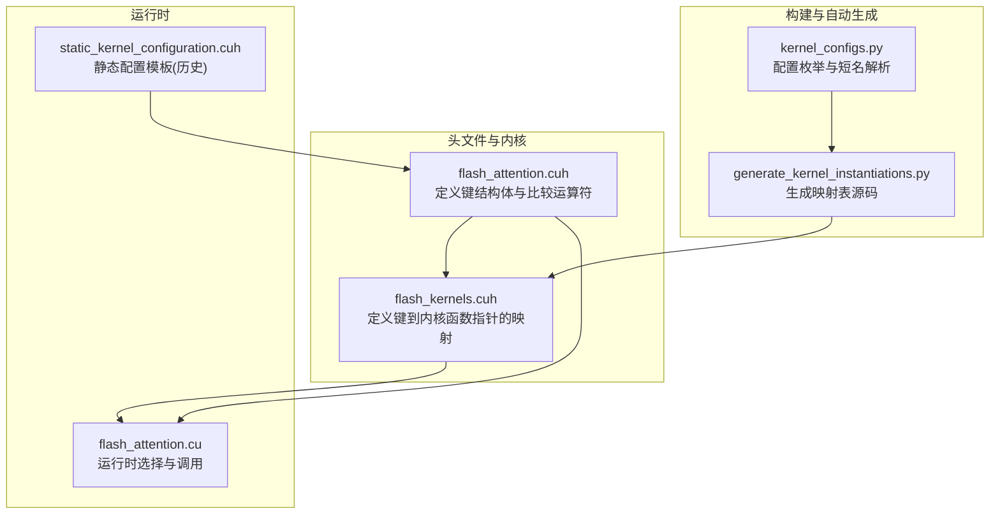
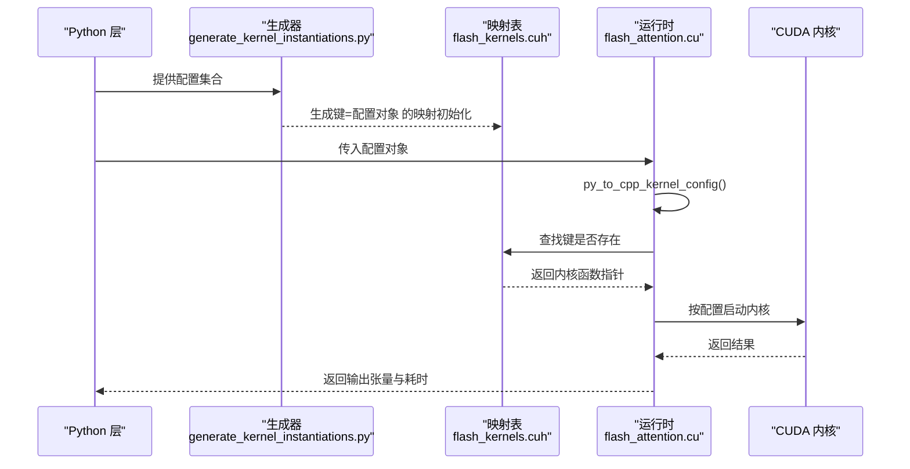
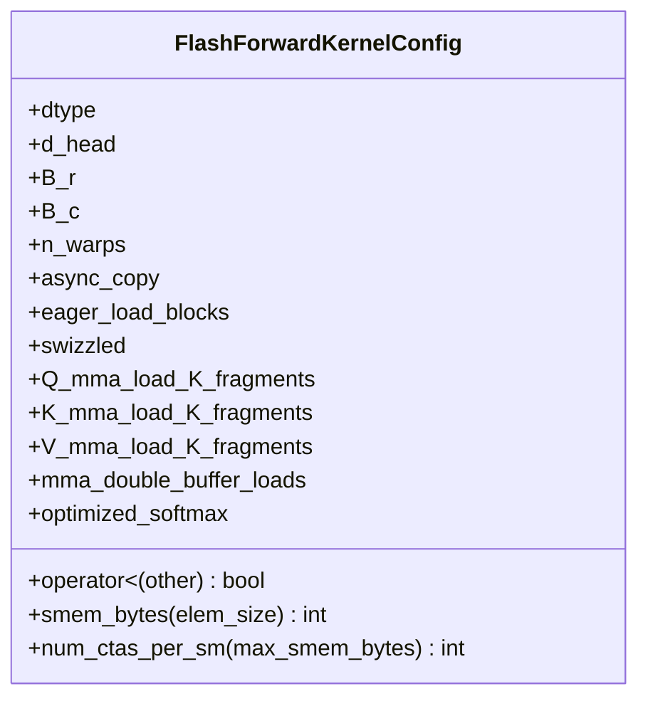
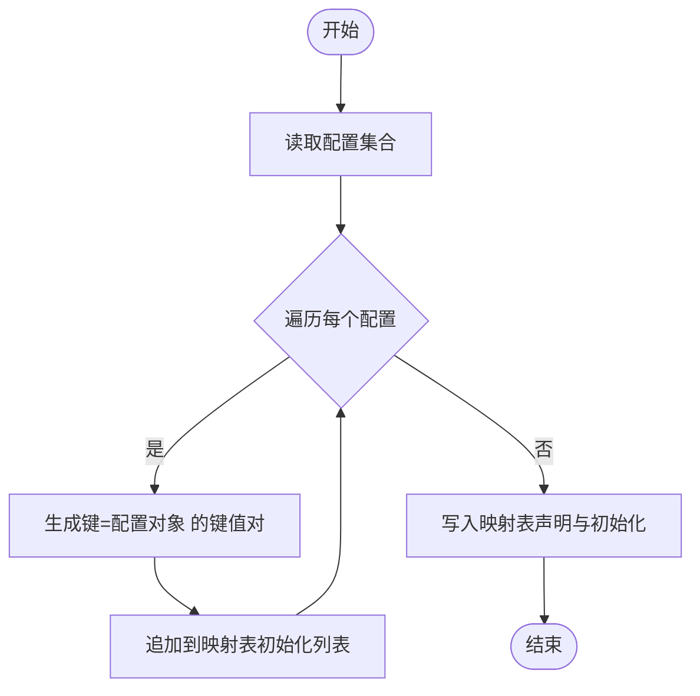
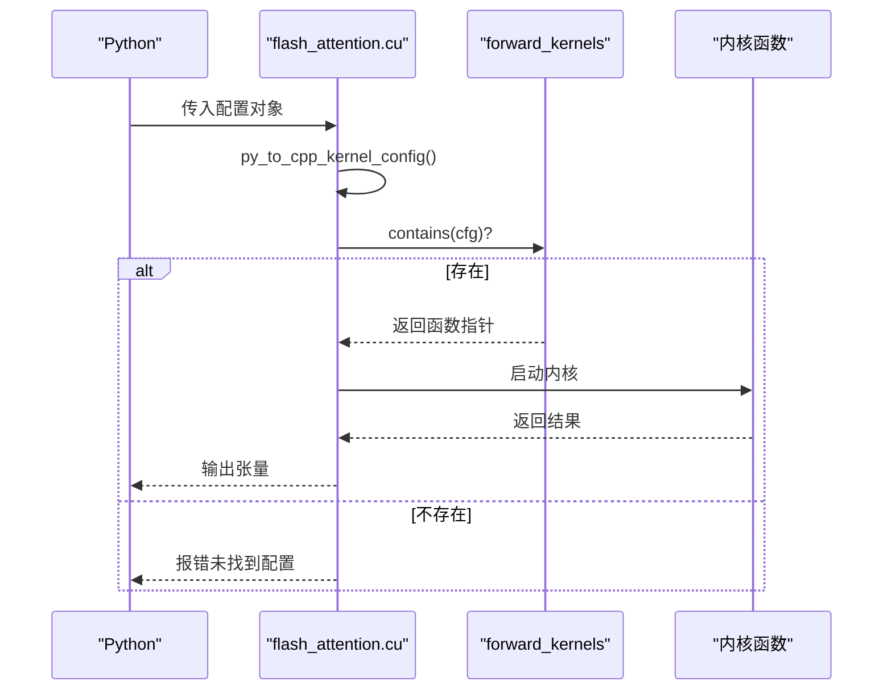
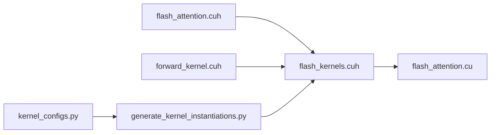

# 内核配置映射键

<cite>
**本文引用的文件**
- [src/include/flash_kernels.cuh](file://src/include/flash_kernels.cuh)
- [src/include/flash_attention.cuh](file://src/include/flash_attention.cuh)
- [src/flash_attention.cu](file://src/flash_attention.cu)
- [tools/build/generate_kernel_instantiations.py](file://tools/build/generate_kernel_instantiations.py)
- [py/flash_helpers/kernel_configs.py](file://py/flash_helpers/kernel_configs.py)
- [previous_kernels/src_1-7/include/static_kernel_configuration.cuh](file://previous_kernels/src_1-7/include/static_kernel_configuration.cuh)
</cite>

## 目录
1. [引言](#引言)
2. [项目结构](#项目结构)
3. [核心组件](#核心组件)
4. [架构总览](#架构总览)
5. [详细组件分析](#详细组件分析)
6. [依赖关系分析](#依赖关系分析)
7. [性能考量](#性能考量)
8. [故障排查指南](#故障排查指南)
9. [结论](#结论)

## 引言
本文件围绕“内核配置映射键”展开，聚焦于 src/include/flash_kernels.cuh 中以 FlashForwardKernelConfig 为键的 std::map 设计。该键用于在运行时根据数据类型、块大小、线程束数量、加载策略等关键参数，从预生成的内核集合中选择最优内核实例。本文将系统阐释：
- 键结构体如何封装关键配置参数；
- 作为 std::map 键的唯一性与可比较性保障；
- 各字段在运行时内核选择中的作用；
- 不同配置组合对性能的影响；
- 对自动调优系统的支持能力及覆盖多硬件场景的策略。

## 项目结构
本仓库包含多个版本的内核实现与工具链，其中与“内核配置映射键”直接相关的关键文件如下：
- C++ 头文件定义键结构体与映射表：src/include/flash_kernels.cuh、src/include/flash_attention.cuh
- CUDA 扩展入口与运行时选择逻辑：src/flash_attention.cu
- 自动生成映射表的构建脚本：tools/build/generate_kernel_instantiations.py
- Python 自动调优与配置解析：py/flash_helpers/kernel_configs.py
- 静态内核配置模板（历史版本）：previous_kernels/src_1-7/include/static_kernel_configuration.cuh

图表来源
- [src/include/flash_kernels.cuh](file://src/include/flash_kernels.cuh#L1-L187)
- [src/include/flash_attention.cuh](file://src/include/flash_attention.cuh#L30-L109)
- [src/flash_attention.cu](file://src/flash_attention.cu#L34-L135)
- [tools/build/generate_kernel_instantiations.py](file://tools/build/generate_kernel_instantiations.py#L13-L56)
- [py/flash_helpers/kernel_configs.py](file://py/flash_helpers/kernel_configs.py#L106-L167)
- [previous_kernels/src_1-7/include/static_kernel_configuration.cuh](file://previous_kernels/src_1-7/include/static_kernel_configuration.cuh#L89-L121)

章节来源
- [src/include/flash_kernels.cuh](file://src/include/flash_kernels.cuh#L1-L187)
- [src/include/flash_attention.cuh](file://src/include/flash_attention.cuh#L30-L109)
- [src/flash_attention.cu](file://src/flash_attention.cu#L34-L135)
- [tools/build/generate_kernel_instantiations.py](file://tools/build/generate_kernel_instantiations.py#L13-L56)
- [py/flash_helpers/kernel_configs.py](file://py/flash_helpers/kernel_configs.py#L106-L167)
- [previous_kernels/src_1-7/include/static_kernel_configuration.cuh](file://previous_kernels/src_1-7/include/static_kernel_configuration.cuh#L89-L121)

## 核心组件
- 键结构体：FlashForwardKernelConfig
  - 定义位置与比较运算符：src/include/flash_attention.cuh
  - 字段涵盖数据类型、块大小、线程束数、异步拷贝、预加载、Swizzle、Q/K/V 加载片段数、双缓冲、优化 Softmax 等
- 映射表：std::map<FlashForwardKernelConfig, forward_kernel_fn>
  - 定义位置：src/include/flash_kernels.cuh
  - 由工具脚本自动生成，键为配置对象，值为对应内核函数指针
- 运行时选择：src/flash_attention.cu
  - 将 Python 配置转换为 C++ 键对象
  - 在映射表中查找并校验配置合法性
  - 调用选定内核执行

章节来源
- [src/include/flash_attention.cuh](file://src/include/flash_attention.cuh#L30-L109)
- [src/include/flash_kernels.cuh](file://src/include/flash_kernels.cuh#L14-L187)
- [src/flash_attention.cu](file://src/flash_attention.cu#L34-L135)

## 架构总览
下图展示从 Python 配置到 CUDA 内核选择与执行的端到端流程，强调键结构体在映射表中的作用。

图表来源
- [tools/build/generate_kernel_instantiations.py](file://tools/build/generate_kernel_instantiations.py#L13-L56)
- [src/include/flash_kernels.cuh](file://src/include/flash_kernels.cuh#L14-L187)
- [src/flash_attention.cu](file://src/flash_attention.cu#L34-L135)

## 详细组件分析

### 键结构体：FlashForwardKernelConfig
- 结构体字段与语义
  - 数据类型：dtype，决定半精度或 bfloat16
  - 头维度：d_head，控制每个头的通道宽度
  - 块大小：B_r、B_c，分别控制 Q/O 行块与 K/V 列块
  - 线程束数：n_warps，控制每块的线程束数量
  - 加载策略：async_copy、eager_load_blocks、swizzled
  - MMA 加载片段：Q_mma_load_K_fragments、K_mma_load_K_fragments、V_mma_load_K_fragments
  - 双缓冲：mma_double_buffer_loads
  - 优化：optimized_softmax
- 比较运算符保证
  - operator< 实现字典序比较，确保键的唯一性与可排序性
  - 比较顺序严格遵循字段顺序，避免不同配置被误判为相等
- 计算辅助
  - smem_bytes(elem_size)：估算共享内存占用
  - num_ctas_per_sm(max_smem_bytes)：基于共享内存限制估算每 SM 的 CTA 数

图表来源
- [src/include/flash_attention.cuh](file://src/include/flash_attention.cuh#L30-L109)

章节来源
- [src/include/flash_attention.cuh](file://src/include/flash_attention.cuh#L30-L109)

### 映射表：std::map<FlashForwardKernelConfig, forward_kernel_fn>
- 定义与用途
  - 在 flash_kernels.cuh 中定义 std::map，键为 FlashForwardKernelConfig，值为内核函数指针
  - 通过模板实例化的方式，将具体配置绑定到对应的内核函数
- 自动生成
  - generate_kernel_instantiations.py 读取配置集合，逐条生成键值对
  - 使用 Python 层的 FlashForwardKernelConfig.to_cpp_struct() 输出 C++ 结构体字面量
- 初始化样例
  - 文件中包含大量键值对，覆盖多种数据类型、块大小、线程束数与加载策略组合

图表来源
- [tools/build/generate_kernel_instantiations.py](file://tools/build/generate_kernel_instantiations.py#L13-L56)
- [src/include/flash_kernels.cuh](file://src/include/flash_kernels.cuh#L14-L187)

章节来源
- [src/include/flash_kernels.cuh](file://src/include/flash_kernels.cuh#L14-L187)
- [tools/build/generate_kernel_instantiations.py](file://tools/build/generate_kernel_instantiations.py#L13-L56)

### 运行时选择与调用
- 配置转换
  - flash_attention.cu 中将 Python 层配置对象转换为 C++ 键对象
- 映射查询
  - 使用 contains 检查配置是否存在于映射表
  - 若存在则取出内核函数指针，否则报错
- 内核启动
  - 根据配置计算网格/块维度、共享内存大小、流等
  - 调用内核函数执行前向注意力

图表来源
- [src/flash_attention.cu](file://src/flash_attention.cu#L34-L135)
- [src/include/flash_kernels.cuh](file://src/include/flash_kernels.cuh#L14-L187)

章节来源
- [src/flash_attention.cu](file://src/flash_attention.cu#L34-L135)

### 字段在运行时的选择作用
- 数据类型与精度
  - dtype 决定内核模板参数与数值类型，影响寄存器与带宽使用
- 块大小 B_r/B_c
  - 影响分块粒度、访存模式与吞吐；需满足序列长度整除条件
- 线程束数 n_warps
  - 与块大小共同决定每块的线程数与负载均衡
- 加载策略
  - async_copy：异步拷贝，减少同步开销
  - eager_load_blocks：尽早加载 K/V 到共享内存，提升流水效率
  - swizzled：Swizzle 访存模式，改善缓存命中
- MMA 加载片段
  - Q/K/V 的 fragments/tiles 控制矩阵乘法阶段的加载策略与寄存器占用
- 双缓冲与优化 Softmax
  - mma_double_buffer_loads：提高访存与计算重叠
  - optimized_softmax：针对 Softmax 的优化路径

章节来源
- [src/include/flash_attention.cuh](file://src/include/flash_attention.cuh#L30-L109)
- [src/flash_attention.cu](file://src/flash_attention.cu#L77-L109)

### 性能影响与配置组合
- 不同配置组合的性能差异
  - 更高的 B_r/B_c 通常带来更高的吞吐，但可能增加寄存器与共享内存压力
  - 异步拷贝与预加载可减少同步等待，提升流水效率
  - Swizzle 与双缓冲有助于缓解带宽瓶颈
  - 优化 Softmax 可降低算子开销
- 自动调优支持
  - Python 层提供 should_autotune_config() 过滤不可行配置
  - 支持按 B_r/B_c 维度筛选，便于在特定硬件上进行针对性搜索
  - 通过短名解析与生成器，快速扩展配置空间

章节来源
- [py/flash_helpers/kernel_configs.py](file://py/flash_helpers/kernel_configs.py#L364-L386)
- [py/flash_helpers/kernel_configs.py](file://py/flash_helpers/kernel_configs.py#L284-L335)
- [tools/build/generate_kernel_instantiations.py](file://tools/build/generate_kernel_instantiations.py#L13-L56)

### 历史版本与静态配置模板
- previous_kernels/src_1-7/include/static_kernel_configuration.cuh 展示了静态模板的使用方式，键结构体的字段在静态模板中被直接使用，体现了键设计对编译期配置的兼容性。

章节来源
- [previous_kernels/src_1-7/include/static_kernel_configuration.cuh](file://previous_kernels/src_1-7/include/static_kernel_configuration.cuh#L89-L121)

## 依赖关系分析
- 头文件依赖
  - flash_kernels.cuh 依赖 flash_attention.cuh（键定义）与 forward_kernel.cuh（内核函数指针类型）
- 运行时依赖
  - flash_attention.cu 依赖 flash_kernels.cuh（映射表）、flash_attention.cuh（键定义）
- 构建依赖
  - generate_kernel_instantiations.py 依赖 py/flash_helpers/kernel_configs.py（配置生成与 C++ 字面量）

图表来源
- [src/include/flash_kernels.cuh](file://src/include/flash_kernels.cuh#L1-L187)
- [src/include/flash_attention.cuh](file://src/include/flash_attention.cuh#L30-L109)
- [src/flash_attention.cu](file://src/flash_attention.cu#L1-L33)
- [tools/build/generate_kernel_instantiations.py](file://tools/build/generate_kernel_instantiations.py#L13-L56)
- [py/flash_helpers/kernel_configs.py](file://py/flash_helpers/kernel_configs.py#L106-L167)

章节来源
- [src/include/flash_kernels.cuh](file://src/include/flash_kernels.cuh#L1-L187)
- [src/include/flash_attention.cuh](file://src/include/flash_attention.cuh#L30-L109)
- [src/flash_attention.cu](file://src/flash_attention.cu#L1-L33)
- [tools/build/generate_kernel_instantiations.py](file://tools/build/generate_kernel_instantiations.py#L13-L56)
- [py/flash_helpers/kernel_configs.py](file://py/flash_helpers/kernel_configs.py#L106-L167)

## 性能考量
- 键的唯一性与可比较性
  - operator< 的严格字典序比较确保不同配置不会冲突，避免映射表中键重复
- 共享内存与寄存器
  - smem_bytes 估算用于动态共享内存设置，避免超出设备限制
  - num_ctas_per_sm 用于指导并发度，平衡寄存器与共享内存约束
- 访存与计算重叠
  - async_copy、eager_load_blocks、mma_double_buffer_loads 与 swizzled 共同提升访存与计算重叠度
- 自动调优范围
  - should_autotune_config() 过滤不合理的组合，缩小搜索空间，提高调优效率

章节来源
- [src/include/flash_attention.cuh](file://src/include/flash_attention.cuh#L54-L66)
- [src/flash_attention.cu](file://src/flash_attention.cu#L142-L149)
- [py/flash_helpers/kernel_configs.py](file://py/flash_helpers/kernel_configs.py#L364-L386)

## 故障排查指南
- 配置未找到
  - 现象：运行时报错提示配置未在映射表中
  - 排查：确认配置对象与映射表键完全一致（包括布尔标志与片段数）
  - 参考：flash_attention.cu 中的 contains 与错误检查
- 数据类型不匹配
  - 现象：dtype 与输入张量 dtype 不一致
  - 排查：确保配置 dtype 与输入张量 dtype 一致
- 块大小不整除
  - 现象：seq_len 与 B_r/B_c 不整除导致断言失败
  - 排查：调整 B_r/B_c 或 seq_len，使其满足整除条件
- 共享内存超限
  - 现象：内核启动失败或性能异常
  - 排查：检查 smem_bytes 是否超过设备限制，必要时减小块大小或启用更保守的配置

章节来源
- [src/flash_attention.cu](file://src/flash_attention.cu#L58-L109)
- [src/flash_attention.cu](file://src/flash_attention.cu#L142-L149)

## 结论
FlashForwardKernelConfig 作为 std::map 的键，通过严格的字段比较与全面的配置封装，实现了对内核实例的精确选择。该设计既保证了键的唯一性与可比较性，又为自动调优提供了清晰的配置空间与生成机制。通过异步拷贝、预加载、Swizzle、双缓冲与优化 Softmax 等策略，能够在不同硬件与数据规模下取得良好性能。建议在扩展新配置时保持 operator< 的一致性，并利用 Python 层的过滤与生成工具，持续扩大覆盖范围。