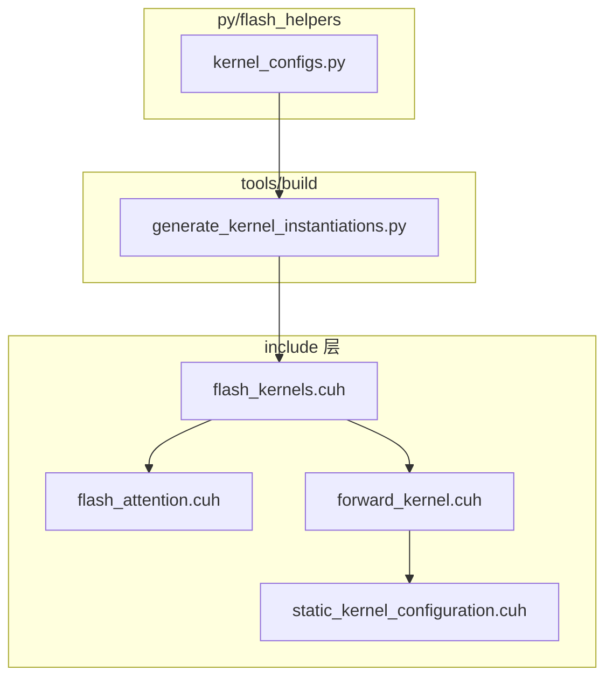
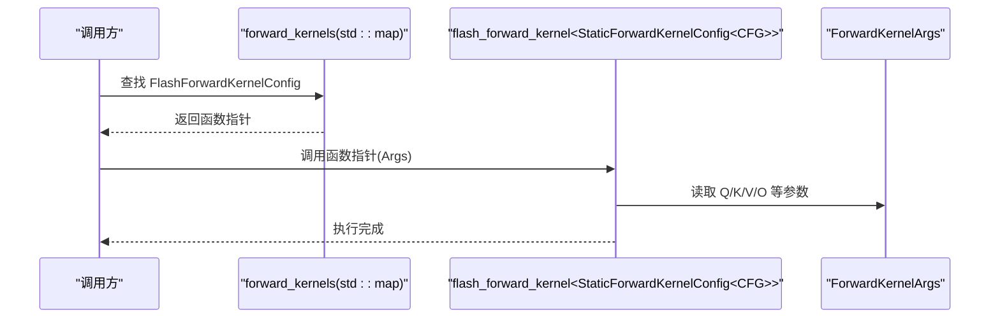
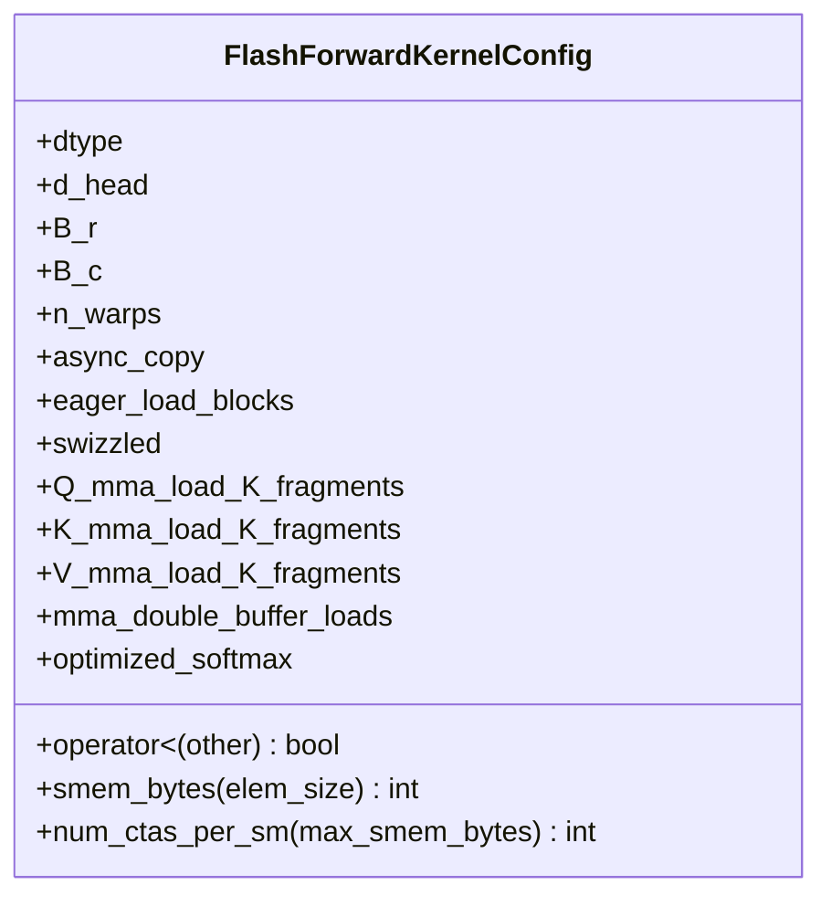
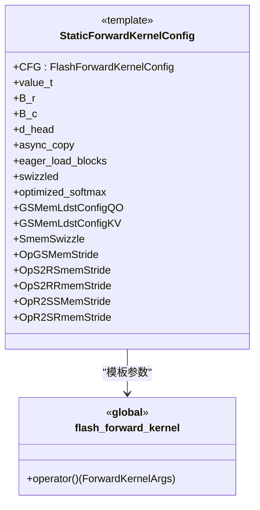
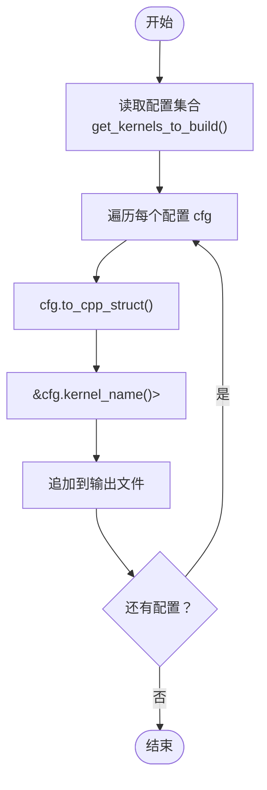
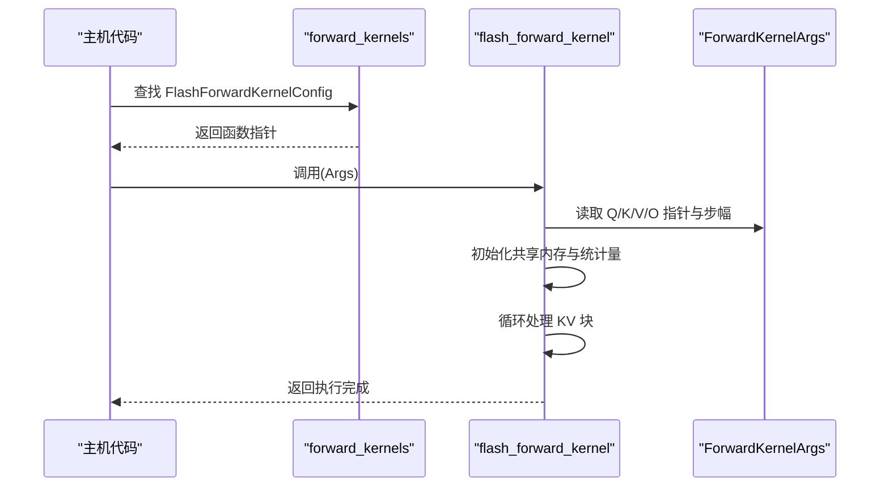
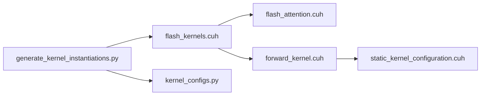

# 内核配置映射表实现

<cite>
**本文引用的文件**
- [src/include/flash_kernels.cuh](file://src/include/flash_kernels.cuh)
- [src/include/flash_attention.cuh](file://src/include/flash_attention.cuh)
- [src/include/forward_kernel.cuh](file://src/include/forward_kernel.cuh)
- [src/include/static_kernel_configuration.cuh](file://src/include/static_kernel_configuration.cuh)
- [tools/build/generate_kernel_instantiations.py](file://tools/build/generate_kernel_instantiations.py)
- [py/flash_helpers/kernel_configs.py](file://py/flash_helpers/kernel_configs.py)
</cite>

## 目录
1. [简介](#简介)
2. [项目结构](#项目结构)
3. [核心组件](#核心组件)
4. [架构总览](#架构总览)
5. [详细组件分析](#详细组件分析)
6. [依赖分析](#依赖分析)
7. [性能考量](#性能考量)
8. [故障排查指南](#故障排查指南)
9. [结论](#结论)
10. [附录](#附录)

## 简介
本文件围绕内核配置映射表展开，重点解析 src/include/flash_kernels.cuh 中 forward_kernels std::map 的实现与使用方式。该映射表以 FlashForwardKernelConfig 为键，以 flash_forward_kernel 函数指针为值，实现运行时根据配置选择预编译内核实例化的机制。文档将从数据结构定义、映射表条目结构、键比较规则、模板实例化绑定、以及生成脚本等方面进行系统性分析，并给出典型配置组合的绑定示意，帮助读者理解静态映射设计如何支持多种优化策略组合的预编译内核实例化。

## 项目结构
本仓库采用“按功能域分层”的组织方式：CUDA 前向内核与配置定义集中在 include 目录；构建与自动生成逻辑位于 tools/build；Python 工具用于内核配置枚举与解析；历史版本在 previous_kernels 下保留。

图表来源
- [src/include/flash_kernels.cuh](file://src/include/flash_kernels.cuh#L1-L187)
- [src/include/flash_attention.cuh](file://src/include/flash_attention.cuh#L1-L110)
- [src/include/forward_kernel.cuh](file://src/include/forward_kernel.cuh#L1-L200)
- [src/include/static_kernel_configuration.cuh](file://src/include/static_kernel_configuration.cuh#L1-L200)
- [tools/build/generate_kernel_instantiations.py](file://tools/build/generate_kernel_instantiations.py#L1-L56)
- [py/flash_helpers/kernel_configs.py](file://py/flash_helpers/kernel_configs.py#L1-L200)

章节来源
- [src/include/flash_kernels.cuh](file://src/include/flash_kernels.cuh#L1-L187)
- [tools/build/generate_kernel_instantiations.py](file://tools/build/generate_kernel_instantiations.py#L1-L56)

## 核心组件
- 映射表定义与初始化
  - 类型别名：typedef void (*forward_kernel_fn)(const ForwardKernelArgs)
  - 容器：std::map<FlashForwardKernelConfig, forward_kernel_fn> forward_kernels
  - 初始化：键为 FlashForwardKernelConfig 实例，值为 flash_forward_kernel<StaticForwardKernelConfig<CFG>> 的函数指针
- 键类型：FlashForwardKernelConfig
  - 包含数据类型、头维度、块大小、warp 数量、异步复制、预加载、swizzling、mma 加载片段数、双缓冲、优化 softmax 等字段
  - 提供 operator< 以支持 std::map 的有序存储与查找
- 值类型：函数指针
  - 指向 flash_forward_kernel 模板实例化，模板参数为 StaticForwardKernelConfig<CFG>
- 静态内核配置：StaticForwardKernelConfig
  - 将 FlashForwardKernelConfig 的运行时配置转换为编译期常量，驱动模板内核的形状、布局、加载策略等
- 自动生成：generate_kernel_instantiations.py
  - 读取 Python 层 kernel_configs.py 生成的配置集合，写入 flash_kernels.cuh 的映射表初始化体

章节来源
- [src/include/flash_kernels.cuh](file://src/include/flash_kernels.cuh#L1-L187)
- [src/include/flash_attention.cuh](file://src/include/flash_attention.cuh#L30-L109)
- [src/include/static_kernel_configuration.cuh](file://src/include/static_kernel_configuration.cuh#L104-L160)
- [tools/build/generate_kernel_instantiations.py](file://tools/build/generate_kernel_instantiations.py#L1-L56)
- [py/flash_helpers/kernel_configs.py](file://py/flash_helpers/kernel_configs.py#L106-L175)

## 架构总览
下图展示了运行时内核选择的关键流程：根据输入的 FlashForwardKernelConfig 在 forward_kernels 中查找匹配项，返回对应的 flash_forward_kernel 实例化函数指针，随后由调用方以 ForwardKernelArgs 启动 CUDA 内核。

图表来源
- [src/include/flash_kernels.cuh](file://src/include/flash_kernels.cuh#L1-L187)
- [src/include/forward_kernel.cuh](file://src/include/forward_kernel.cuh#L85-L200)
- [src/include/flash_attention.cuh](file://src/include/flash_attention.cuh#L1-L28)

## 详细组件分析

### 组件A：映射表键类型 FlashForwardKernelConfig
- 字段与语义
  - 数据类型 dtype：控制 value_t 选择半精度或 bfloat16
  - 头维度 d_head：影响寄存器/共享内存分块与 tile 形状
  - 块大小 B_r、B_c：决定 Q/O 行块与 KV 列块的尺寸
  - n_warps：warp 数量，影响每 warp 的负载分配
  - 异步复制 async_copy：是否启用 cp_async 异步拷贝
  - 预加载 eager_load_blocks：是否尽早加载 K/V 到共享内存
  - Swizzling swizzled：是否启用共享内存 swizzle
  - Q/K/V 的 mma 加载片段数 Q_mma_load_K_fragments、K_mma_load_K_fragments、V_mma_load_K_fragments：控制加载 tile 数
  - mma_double_buffer_loads：是否启用 mma 双缓冲加载
  - optimized_softmax：是否启用在线 softmax 优化路径
- 键排序规则 operator<
  - 逐字段比较，保证 std::map 的稳定排序与查找行为
- 计算辅助
  - smem_bytes(elem_size)：估算共享内存占用
  - num_ctas_per_sm(max_smem_bytes)：基于共享内存限制估算每 SM 的 CTAs 数

图表来源
- [src/include/flash_attention.cuh](file://src/include/flash_attention.cuh#L30-L109)

章节来源
- [src/include/flash_attention.cuh](file://src/include/flash_attention.cuh#L30-L109)

### 组件B：映射表值类型与模板绑定
- 函数指针类型别名
  - typedef void (*forward_kernel_fn)(const ForwardKernelArgs)
- 映射表初始化
  - 键：FlashForwardKernelConfig 实例（包含上述所有配置）
  - 值：flash_forward_kernel<StaticForwardKernelConfig<CFG>> 的地址
- 静态内核配置 StaticForwardKernelConfig
  - 将运行时配置 CFG 转换为编译期常量，派生 tile 形状、布局、加载策略等
  - 例如：value_t、B_r、B_c、d_head、async_copy、eager_load_blocks、swizzled、optimized_softmax 等

图表来源
- [src/include/static_kernel_configuration.cuh](file://src/include/static_kernel_configuration.cuh#L104-L200)
- [src/include/forward_kernel.cuh](file://src/include/forward_kernel.cuh#L85-L200)

章节来源
- [src/include/flash_kernels.cuh](file://src/include/flash_kernels.cuh#L1-L187)
- [src/include/static_kernel_configuration.cuh](file://src/include/static_kernel_configuration.cuh#L104-L200)
- [src/include/forward_kernel.cuh](file://src/include/forward_kernel.cuh#L85-L200)

### 组件C：映射表条目结构与绑定关系
- 条目格式
  - 键：FlashForwardKernelConfig{dtype, d_head, B_r, B_c, n_warps, async_copy, eager_load_blocks, swizzled, Q/K/V_load_fragments, mma_double_buffer_loads, optimized_softmax}
  - 值：&flash_forward_kernel<StaticForwardKernelConfig<键实例>>
- 关键字段与内核行为的绑定
  - 数据类型 dtype → value_t 选择（half 或 nv_bfloat16）
  - 头维度 d_head → 寄存器/共享内存 tile 分块与累加器形状
  - 块大小 B_r/B_c → Q/O 行块与 KV 列块尺寸
  - n_warps → 每 warp 负载与线程数
  - 异步复制 async_copy → 是否启用 cp_async
  - 预加载 eager_load_blocks → 是否提前加载 K/V
  - Swizzling swizzled → 共享内存访问模式
  - Q/K/V 加载片段数 → 控制加载 tile 数与寄存器 tile 缓冲
  - mma_double_buffer_loads → mma 双缓冲加载策略
  - optimized_softmax → 在线 softmax 优化路径
- 示例条目（来自映射表）
  - FP16/FP32 + d_head=128, B_r=128, B_c=64, n_warps=4
  - 异步复制 + 预加载 + swizzled + 不同 Q/K/V 加载片段组合
  - buffer（双缓冲）与 opt_softmax 的变体
  - BF16 与 FP16 的并行覆盖
  - 多种 B_r/B_c 组合的覆盖

章节来源
- [src/include/flash_kernels.cuh](file://src/include/flash_kernels.cuh#L1-L187)

### 组件D：自动生成映射表
- 生成脚本 generate_kernel_instantiations.py
  - 读取 Python 层 kernel_configs.py 的配置集合
  - 将每个配置转换为 C++ 结构体字面量与函数指针绑定
  - 输出到 src/include/flash_kernels.cuh 的映射表初始化体
- Python 配置工具 kernel_configs.py
  - 定义 FlashForwardKernelConfig 数据类
  - 提供 short_form、to_cpp_struct、kernel_name 等方法
  - 支持从符号名、短形式字符串解析配置
  - 提供 get_kernels_to_build 等接口用于构建集合

图表来源
- [tools/build/generate_kernel_instantiations.py](file://tools/build/generate_kernel_instantiations.py#L1-L56)
- [py/flash_helpers/kernel_configs.py](file://py/flash_helpers/kernel_configs.py#L106-L175)

章节来源
- [tools/build/generate_kernel_instantiations.py](file://tools/build/generate_kernel_instantiations.py#L1-L56)
- [py/flash_helpers/kernel_configs.py](file://py/flash_helpers/kernel_configs.py#L106-L175)

### 组件E：前向内核执行流程
- flash_forward_kernel
  - 接收 ForwardKernelArgs，解析 Q/K/V/O 指针与步幅
  - 分配共享内存区域，构造 Q/K/V 的全局/共享内存视图
  - 初始化 softmax 相关统计量与缩放因子
  - 循环处理 KV 块，调用 process_kv_block 完成 QK 与 PV GEMM
  - 最终归一化并写回结果
- 与映射表的关系
  - 通过函数指针直接调用对应 StaticForwardKernelConfig 的 flash_forward_kernel 实例

图表来源
- [src/include/flash_kernels.cuh](file://src/include/flash_kernels.cuh#L1-L187)
- [src/include/forward_kernel.cuh](file://src/include/forward_kernel.cuh#L85-L200)
- [src/include/flash_attention.cuh](file://src/include/flash_attention.cuh#L1-L28)

章节来源
- [src/include/forward_kernel.cuh](file://src/include/forward_kernel.cuh#L85-L200)

## 依赖分析
- 头文件依赖
  - flash_kernels.cuh 依赖 flash_attention.cuh 与 forward_kernel.cuh
  - forward_kernel.cuh 依赖 flash_attention.cuh、static_kernel_configuration.cuh 等
  - static_kernel_configuration.cuh 依赖 flash_attention.cuh 与若干底层组件
- 运行时依赖
  - std::map 作为键值容器，依赖 FlashForwardKernelConfig 的 operator< 实现稳定排序
  - 函数指针绑定依赖模板实例化，确保编译期常量配置生效
- 生成期依赖
  - generate_kernel_instantiations.py 依赖 kernel_configs.py 的配置集合
  - kernel_configs.py 依赖 DType、数据类等定义

图表来源
- [src/include/flash_kernels.cuh](file://src/include/flash_kernels.cuh#L1-L187)
- [src/include/flash_attention.cuh](file://src/include/flash_attention.cuh#L1-L110)
- [src/include/forward_kernel.cuh](file://src/include/forward_kernel.cuh#L1-L200)
- [src/include/static_kernel_configuration.cuh](file://src/include/static_kernel_configuration.cuh#L1-L200)
- [tools/build/generate_kernel_instantiations.py](file://tools/build/generate_kernel_instantiations.py#L1-L56)
- [py/flash_helpers/kernel_configs.py](file://py/flash_helpers/kernel_configs.py#L1-L200)

章节来源
- [src/include/flash_kernels.cuh](file://src/include/flash_kernels.cuh#L1-L187)
- [src/include/forward_kernel.cuh](file://src/include/forward_kernel.cuh#L1-L200)
- [src/include/static_kernel_configuration.cuh](file://src/include/static_kernel_configuration.cuh#L1-L200)
- [tools/build/generate_kernel_instantiations.py](file://tools/build/generate_kernel_instantiations.py#L1-L56)
- [py/flash_helpers/kernel_configs.py](file://py/flash_helpers/kernel_configs.py#L1-L200)

## 性能考量
- 预编译实例化
  - 通过静态映射表将不同配置组合预编译为独立内核实例，避免运行时分支带来的性能损失
- 共享内存与加载策略
  - d_head、B_r/B_c、Q/K/V 加载片段数、mma 双缓冲等直接影响共享内存占用与带宽利用
- 异步复制与预加载
  - async_copy 与 eager_load_blocks 可减少流水线停顿，提升吞吐
- Swizzling
  - 通过共享内存 swizzle 降低冲突，提高访存效率
- 运行时选择成本
  - std::map 查找为对数复杂度，但映射表规模有限，开销可忽略
- 生成脚本的作用
  - 自动化生成映射表，确保配置集合与内核实例一致，减少手工维护错误

[本节为通用性能讨论，不直接分析具体文件]

## 故障排查指南
- 配置不匹配
  - 现象：找不到匹配的内核实例
  - 排查：确认 FlashForwardKernelConfig 的字段与映射表条目完全一致（包括布尔标志与片段数）
  - 参考：operator< 的比较顺序与字段含义
- 生成失败
  - 现象：生成的 flash_kernels.cuh 语法错误
  - 排查：检查 generate_kernel_instantiations.py 输出格式与 kernel_configs.py 的 to_cpp_struct 输出
- 内存不足
  - 现象：内核启动失败或性能异常
  - 排查：检查 smem_bytes 与 num_ctas_per_sm 的估算，调整 d_head、B_r/B_c 或禁用某些优化
- 优化路径未生效
  - 现象：期望的优化（如 optimized_softmax、mma 双缓冲）未体现
  - 排查：确认相应布尔标志在配置中开启，并且模板实例化正确传递

章节来源
- [src/include/flash_attention.cuh](file://src/include/flash_attention.cuh#L30-L109)
- [tools/build/generate_kernel_instantiations.py](file://tools/build/generate_kernel_instantiations.py#L1-L56)
- [py/flash_helpers/kernel_configs.py](file://py/flash_helpers/kernel_configs.py#L146-L175)

## 结论
该内核配置映射表通过将运行时配置 FlashForwardKernelConfig 与编译期常量 StaticForwardKernelConfig 绑定，实现了对多种优化策略组合的预编译内核实例化管理。映射表以 std::map 为容器，借助 operator< 的稳定排序，确保运行时高效查找。生成脚本与 Python 配置工具协同工作，自动化维护映射表，保证配置集合与内核实例的一致性。整体设计兼顾了灵活性与性能，能够在不同硬件与数据规模下提供最优的内核选择。

[本节为总结性内容，不直接分析具体文件]

## 附录
- 典型配置组合示例（来自映射表）
  - FP16/FP32 + d_head=128, B_r=128, B_c=64, n_warps=4
  - 异步复制 + 预加载 + swizzled + load_2_2_0_tiles / load_2_2_2_tiles
  - buffer（双缓冲）与 opt_softmax 的变体
  - BF16 与 FP16 的并行覆盖
  - 多种 B_r/B_c 组合的覆盖
- 代码示例路径（不展示具体代码，仅提供定位）
  - 映射表定义与初始化：[src/include/flash_kernels.cuh](file://src/include/flash_kernels.cuh#L1-L187)
  - 键类型定义与 operator<：[src/include/flash_attention.cuh](file://src/include/flash_attention.cuh#L30-L109)
  - 前向内核模板与实例化入口：[src/include/forward_kernel.cuh](file://src/include/forward_kernel.cuh#L85-L200)
  - 静态内核配置模板：[src/include/static_kernel_configuration.cuh](file://src/include/static_kernel_configuration.cuh#L104-L200)
  - 生成映射表脚本：[tools/build/generate_kernel_instantiations.py](file://tools/build/generate_kernel_instantiations.py#L1-L56)
  - Python 配置工具：[py/flash_helpers/kernel_configs.py](file://py/flash_helpers/kernel_configs.py#L106-L175)