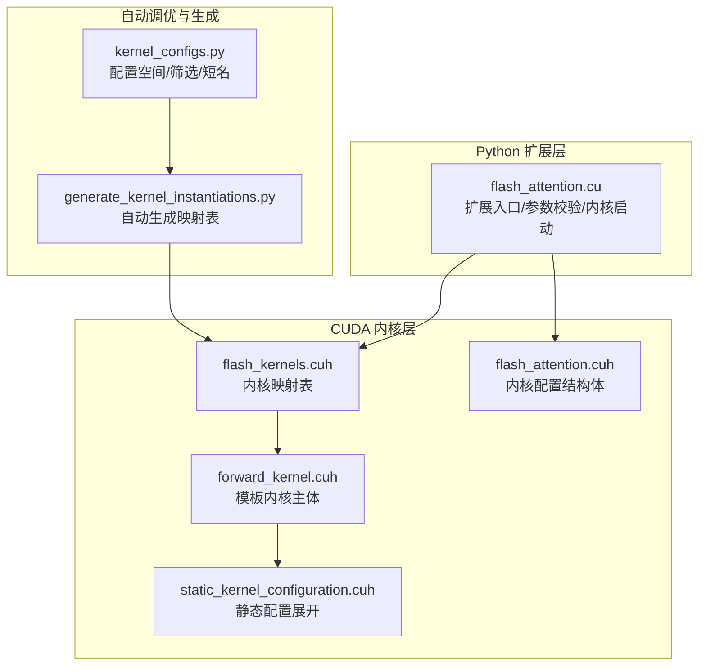
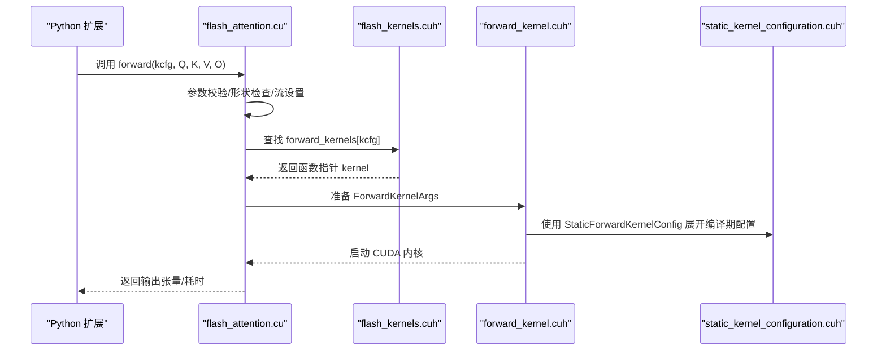
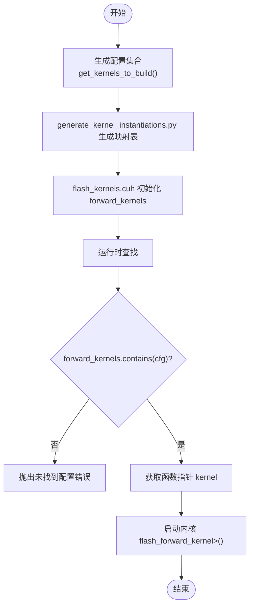
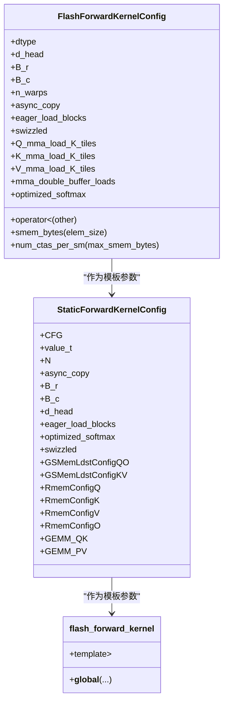
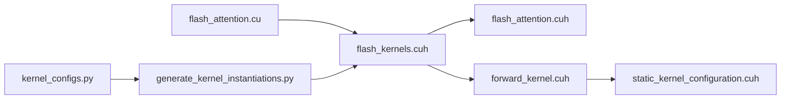

# 内核调度映射

<cite>
**本文引用的文件**
- [src/include/flash_kernels.cuh](file://src/include/flash_kernels.cuh)
- [src/include/flash_attention.cuh](file://src/include/flash_attention.cuh)
- [src/include/forward_kernel.cuh](file://src/include/forward_kernel.cuh)
- [src/include/static_kernel_configuration.cuh](file://src/include/static_kernel_configuration.cuh)
- [src/flash_attention.cu](file://src/flash_attention.cu)
- [tools/build/generate_kernel_instantiations.py](file://tools/build/generate_kernel_instantiations.py)
- [py/flash_helpers/kernel_configs.py](file://py/flash_helpers/kernel_configs.py)
</cite>

## 目录
1. [引言](#引言)
2. [项目结构](#项目结构)
3. [核心组件](#核心组件)
4. [架构总览](#架构总览)
5. [详细组件分析](#详细组件分析)
6. [依赖关系分析](#依赖关系分析)
7. [性能考量](#性能考量)
8. [故障排查指南](#故障排查指南)
9. [结论](#结论)
10. [附录](#附录)

## 引言
本文围绕 src/include/flash_kernels.cuh 中的静态映射表 std::map<FlashForwardKernelConfig, forward_kernel_fn> forward_kernels，系统阐述其如何将运行时的内核配置（FlashForwardKernelConfig）与预实例化的内核函数指针绑定，从而实现“配置驱动”的内核调度。我们将结合具体配置条目（如 FP16、128、64、32、4 等）解析映射表的构建逻辑、覆盖的优化策略组合，并讨论该设计对自动调优（auto-tuning）的支持能力及查找性能开销与收益权衡。

## 项目结构
本仓库采用“按功能分层”的组织方式：
- CUDA 前向内核与调度：src/flash_attention.cu 负责 Python 扩展入口、参数校验、内核查找与启动；src/include/flash_kernels.cuh 提供内核映射表；src/include/forward_kernel.cuh 定义模板内核主体；src/include/static_kernel_configuration.cuh 将配置编译期展开为静态类型。
- 自动调优与配置生成：py/flash_helpers/kernel_configs.py 定义配置空间与筛选规则；tools/build/generate_kernel_instantiations.py 根据配置集合自动生成映射表源码。

图表来源
- [src/flash_attention.cu](file://src/flash_attention.cu#L1-L150)
- [src/include/flash_kernels.cuh](file://src/include/flash_kernels.cuh#L1-L187)
- [src/include/forward_kernel.cuh](file://src/include/forward_kernel.cuh#L1-L200)
- [src/include/static_kernel_configuration.cuh](file://src/include/static_kernel_configuration.cuh#L1-L294)
- [src/include/flash_attention.cuh](file://src/include/flash_attention.cuh#L1-L110)
- [tools/build/generate_kernel_instantiations.py](file://tools/build/generate_kernel_instantiations.py#L1-L57)
- [py/flash_helpers/kernel_configs.py](file://py/flash_helpers/kernel_configs.py#L1-L200)

章节来源
- [src/flash_attention.cu](file://src/flash_attention.cu#L1-L150)
- [src/include/flash_kernels.cuh](file://src/include/flash_kernels.cuh#L1-L187)
- [tools/build/generate_kernel_instantiations.py](file://tools/build/generate_kernel_instantiations.py#L1-L57)
- [py/flash_helpers/kernel_configs.py](file://py/flash_helpers/kernel_configs.py#L1-L200)

## 核心组件
- 静态映射表 forward_kernels：键为 FlashForwardKernelConfig，值为函数指针 forward_kernel_fn，用于将运行时配置直接映射到已编译的模板内核实例。
- FlashForwardKernelConfig：描述内核的所有可配置维度（数据类型、d_head、B_r、B_c、n_warps、异步拷贝、块级提前加载、swizzle、Q/K/V 的 MMA 加载瓦片数、双缓冲、优化 softmax 等），并提供字典序比较以支持 std::map 排序与查找。
- 模板内核 flash_forward_kernel：接收 StaticForwardKernelConfig，基于编译期展开的 Tile 形状、内存布局、加载策略等执行前向注意力计算。
- 自动生成脚本 generate_kernel_instantiations.py：根据 kernel_configs.py 中的配置集合，生成 flash_kernels.cuh 的映射表初始化代码。

章节来源
- [src/include/flash_kernels.cuh](file://src/include/flash_kernels.cuh#L1-L187)
- [src/include/flash_attention.cuh](file://src/include/flash_attention.cuh#L1-L110)
- [src/include/forward_kernel.cuh](file://src/include/forward_kernel.cuh#L1-L200)
- [src/include/static_kernel_configuration.cuh](file://src/include/static_kernel_configuration.cuh#L1-L294)
- [tools/build/generate_kernel_instantiations.py](file://tools/build/generate_kernel_instantiations.py#L1-L57)
- [py/flash_helpers/kernel_configs.py](file://py/flash_helpers/kernel_configs.py#L1-L200)

## 架构总览
下图展示从 Python 扩展入口到内核执行的关键流程，重点体现“配置驱动”的查找与启动路径。

图表来源
- [src/flash_attention.cu](file://src/flash_attention.cu#L34-L135)
- [src/include/flash_kernels.cuh](file://src/include/flash_kernels.cuh#L1-L187)
- [src/include/forward_kernel.cuh](file://src/include/forward_kernel.cuh#L85-L200)
- [src/include/static_kernel_configuration.cuh](file://src/include/static_kernel_configuration.cuh#L104-L294)

## 详细组件分析

### 组件A：静态映射表 forward_kernels 的构建与使用
- 构建逻辑
  - 由工具脚本 generate_kernel_instantiations.py 读取 kernel_configs.py 中的配置集合（get_kernels_to_build），逐个生成映射项。
  - 每个映射项形如 {FlashForwardKernelConfig{...}, &flash_forward_kernel<StaticForwardKernelConfig<...>>}，即把一个具体的配置对象映射到对应模板实例的函数指针。
- 运行时查找
  - Python 侧传入的内核配置经 py_to_cpp_kernel_config 转换为 C++ 结构体后，flash_attention.cu 在 forward_kernels 中查找，若不存在则报错；存在则取出函数指针并启动内核。
- 配置覆盖与优化策略组合
  - 数据类型：FP16/BF16
  - Tile/块大小：B_r、B_c、d_head、n_warps
  - 加载策略：async_copy、eager_load_blocks、swizzled
  - MMA 加载瓦片数：Q/K/V 的 mma_load_K_tiles（分别控制 Q/K/V 的加载瓦片数）
  - 双缓冲：mma_double_buffer_loads
  - Softmax 优化：optimized_softmax
  - 示例条目（FP16, 128, 64, 32, 4）：包含 async+eager+swizzled+load_2_2_0_tiles、async+eager+swizzled+load_2_2_0_tiles+opt_softmax、async+eager+swizzled+load_2_2_0_tiles+buffer、async+eager+swizzled+load_2_2_0_tiles+buffer+opt_softmax 等变体，覆盖了不同加载瓦片数与是否双缓冲、是否优化 softmax 的组合。

图表来源
- [tools/build/generate_kernel_instantiations.py](file://tools/build/generate_kernel_instantiations.py#L1-L57)
- [py/flash_helpers/kernel_configs.py](file://py/flash_helpers/kernel_configs.py#L399-L465)
- [src/include/flash_kernels.cuh](file://src/include/flash_kernels.cuh#L1-L187)
- [src/flash_attention.cu](file://src/flash_attention.cu#L58-L135)

章节来源
- [src/include/flash_kernels.cuh](file://src/include/flash_kernels.cuh#L1-L187)
- [tools/build/generate_kernel_instantiations.py](file://tools/build/generate_kernel_instantiations.py#L1-L57)
- [py/flash_helpers/kernel_configs.py](file://py/flash_helpers/kernel_configs.py#L399-L465)
- [src/flash_attention.cu](file://src/flash_attention.cu#L58-L135)

### 组件B：配置结构体 FlashForwardKernelConfig 的设计要点
- 字段覆盖范围广，涵盖数据类型、块大小、线程束数、加载策略、MMA 加载瓦片数、双缓冲与 softmax 优化等，确保映射表能精确区分不同实例化。
- 提供 operator< 实现，保证 std::map 的键有序性与查找稳定性。
- 提供 smem_bytes 与 num_ctas_per_sm 等辅助方法，便于运行时资源评估。

章节来源
- [src/include/flash_attention.cuh](file://src/include/flash_attention.cuh#L1-L110)

### 组件C：模板内核与静态配置展开
- flash_forward_kernel 是一个模板内核，其模板参数为 StaticForwardKernelConfig<CFG>，内部通过大量 constexpr 与类型别名将配置转换为内存布局、Tile 形状、加载/存储策略等编译期信息。
- StaticForwardKernelConfig 将 CFG 中的关键字段（如 dtype、B_r、B_c、d_head、eager_load_blocks、optimized_softmax、swizzled 以及各通道的 mma_load_K_tiles）展开为静态类型与常量，从而在编译期确定内存分配、Tile 大小、加载瓦片数、是否双缓冲等细节。
- 这种设计使得 forward_kernels 中的每个映射项都对应一个“完全静态展开”的内核实例，避免运行时分支与动态判断，提升执行效率。

图表来源
- [src/include/flash_attention.cuh](file://src/include/flash_attention.cuh#L1-L110)
- [src/include/static_kernel_configuration.cuh](file://src/include/static_kernel_configuration.cuh#L104-L294)
- [src/include/forward_kernel.cuh](file://src/include/forward_kernel.cuh#L85-L200)

章节来源
- [src/include/flash_attention.cuh](file://src/include/flash_attention.cuh#L1-L110)
- [src/include/static_kernel_configuration.cuh](file://src/include/static_kernel_configuration.cuh#L104-L294)
- [src/include/forward_kernel.cuh](file://src/include/forward_kernel.cuh#L85-L200)

### 组件D：自动调优与映射表生成
- kernel_configs.py 定义了配置空间（dtypes、d_heads、B_r、B_c、n_warps、async_copy、eager_load_blocks、swizzled、Q/K/V 的 mma_load_K_tiles、mma_double_buffer_loads、optimized_softmax），并通过 itertools.product 生成笛卡尔积。
- should_autotune_config 对部分无效或过高的组合进行过滤，确保只生成可安全实例化的内核。
- generate_kernel_instantiations.py 读取 get_kernels_to_build() 的结果，逐条写入 flash_kernels.cuh 的映射表初始化代码，最终形成静态 forward_kernels。

章节来源
- [py/flash_helpers/kernel_configs.py](file://py/flash_helpers/kernel_configs.py#L399-L465)
- [tools/build/generate_kernel_instantiations.py](file://tools/build/generate_kernel_instantiations.py#L1-L57)

## 依赖关系分析
- flash_attention.cu 依赖 flash_kernels.cuh 提供的映射表，用于在运行时根据用户提供的配置选择合适的内核实例。
- flash_kernels.cuh 依赖 flash_attention.cuh（配置结构体）与 forward_kernel.cuh（内核函数指针类型）。
- forward_kernel.cuh 依赖 static_kernel_configuration.cuh 以获得 StaticForwardKernelConfig 的静态展开。
- 自动生成脚本依赖 kernel_configs.py 的配置空间与筛选规则。

图表来源
- [src/flash_attention.cu](file://src/flash_attention.cu#L1-L150)
- [src/include/flash_kernels.cuh](file://src/include/flash_kernels.cuh#L1-L187)
- [src/include/flash_attention.cuh](file://src/include/flash_attention.cuh#L1-L110)
- [src/include/forward_kernel.cuh](file://src/include/forward_kernel.cuh#L1-L200)
- [src/include/static_kernel_configuration.cuh](file://src/include/static_kernel_configuration.cuh#L1-L294)
- [tools/build/generate_kernel_instantiations.py](file://tools/build/generate_kernel_instantiations.py#L1-L57)
- [py/flash_helpers/kernel_configs.py](file://py/flash_helpers/kernel_configs.py#L1-L200)

章节来源
- [src/flash_attention.cu](file://src/flash_attention.cu#L1-L150)
- [src/include/flash_kernels.cuh](file://src/include/flash_kernels.cuh#L1-L187)
- [src/include/flash_attention.cuh](file://src/include/flash_attention.cuh#L1-L110)
- [src/include/forward_kernel.cuh](file://src/include/forward_kernel.cuh#L1-L200)
- [src/include/static_kernel_configuration.cuh](file://src/include/static_kernel_configuration.cuh#L1-L294)
- [tools/build/generate_kernel_instantiations.py](file://tools/build/generate_kernel_instantiations.py#L1-L57)
- [py/flash_helpers/kernel_configs.py](file://py/flash_helpers/kernel_configs.py#L1-L200)

## 性能考量
- 查找复杂度与开销
  - std::map 的键为 FlashForwardKernelConfig，其 operator< 会按多个字段顺序比较，查找为 O(log N)，其中 N 为映射表规模。
  - 由于映射表在编译期生成且规模有限（由自动调优配置空间决定），查找开销通常很小，且避免了运行时分支与动态判断。
- 编译期展开的优势
  - StaticForwardKernelConfig 将配置完全展开为编译期常量与类型，内核执行路径在编译期确定，减少分支与间接寻址，提高指令缓存命中率与寄存器利用率。
- 动态共享内存设置
  - 扩展模块初始化时遍历 forward_kernels，对需要更多动态共享内存的内核设置 cudaFuncAttributeMaxDynamicSharedMemorySize，确保大内核可正常运行。

章节来源
- [src/flash_attention.cu](file://src/flash_attention.cu#L137-L150)
- [src/include/flash_kernels.cuh](file://src/include/flash_kernels.cuh#L1-L187)
- [src/include/static_kernel_configuration.cuh](file://src/include/static_kernel_configuration.cuh#L104-L294)

## 故障排查指南
- “内核配置未在 flash_kernels.cuh 中找到”
  - 现象：运行时报错提示配置不在映射表中。
  - 排查：确认 Python 传入的配置与映射表中的键完全一致（包括布尔标志、瓦片数等）。检查 generate_kernel_instantiations.py 是否正确生成映射表，以及 kernel_configs.py 的筛选规则是否排除了该配置。
- “数据类型不匹配”
  - 现象：配置 dtype 与输入张量 dtype 不一致导致校验失败。
  - 排查：确保 Python 传入的 dtype 与内核实例化时使用的 dtype 一致。
- “块大小不整除”
  - 现象：seq_len 对 B_r 或 B_c 不整除导致断言失败。
  - 排查：调整输入序列长度或内核配置的 B_r/B_c，使其满足整除条件。
- “SMEM 超限”
  - 现象：某些配置需要较多动态共享内存但未设置最大值导致内核启动失败。
  - 排查：确认扩展模块初始化时已为相关内核设置 MaxDynamicSharedMemorySize。

章节来源
- [src/flash_attention.cu](file://src/flash_attention.cu#L58-L135)

## 结论
通过静态映射表 forward_kernels，本项目实现了“配置驱动”的内核调度：在编译期由 generate_kernel_instantiations.py 依据 kernel_configs.py 的配置空间生成所有可能的内核实例，运行时仅需一次 O(log N) 的映射查找即可定位到对应的模板实例，配合 StaticForwardKernelConfig 的编译期展开，显著降低了运行时开销。该设计既支持广泛的优化策略组合（异步拷贝、提前加载、swizzle、不同 MMA 加载瓦片数、双缓冲、优化 softmax 等），又通过严格的筛选与校验保障了可用性与稳定性，为后续的自动调优提供了清晰的边界与可扩展空间。

## 附录
- 关键路径参考
  - 映射表初始化：[tools/build/generate_kernel_instantiations.py](file://tools/build/generate_kernel_instantiations.py#L1-L57)、[src/include/flash_kernels.cuh](file://src/include/flash_kernels.cuh#L1-L187)
  - 运行时查找与启动：[src/flash_attention.cu](file://src/flash_attention.cu#L58-L135)
  - 配置空间与筛选：[py/flash_helpers/kernel_configs.py](file://py/flash_helpers/kernel_configs.py#L399-L465)
  - 静态配置展开：[src/include/static_kernel_configuration.cuh](file://src/include/static_kernel_configuration.cuh#L104-L294)