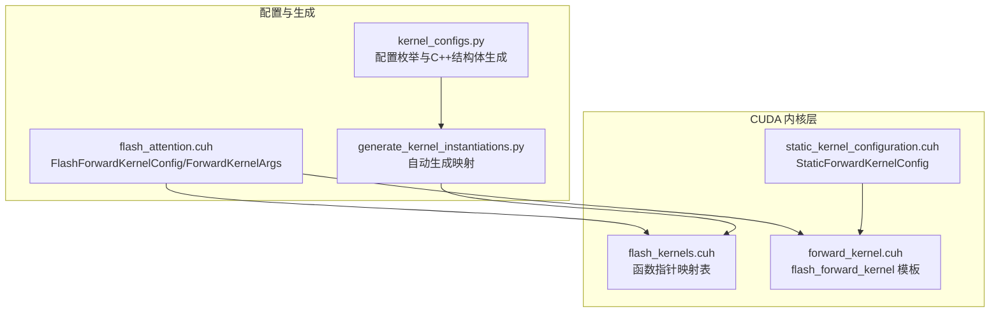
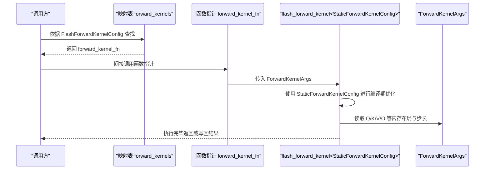
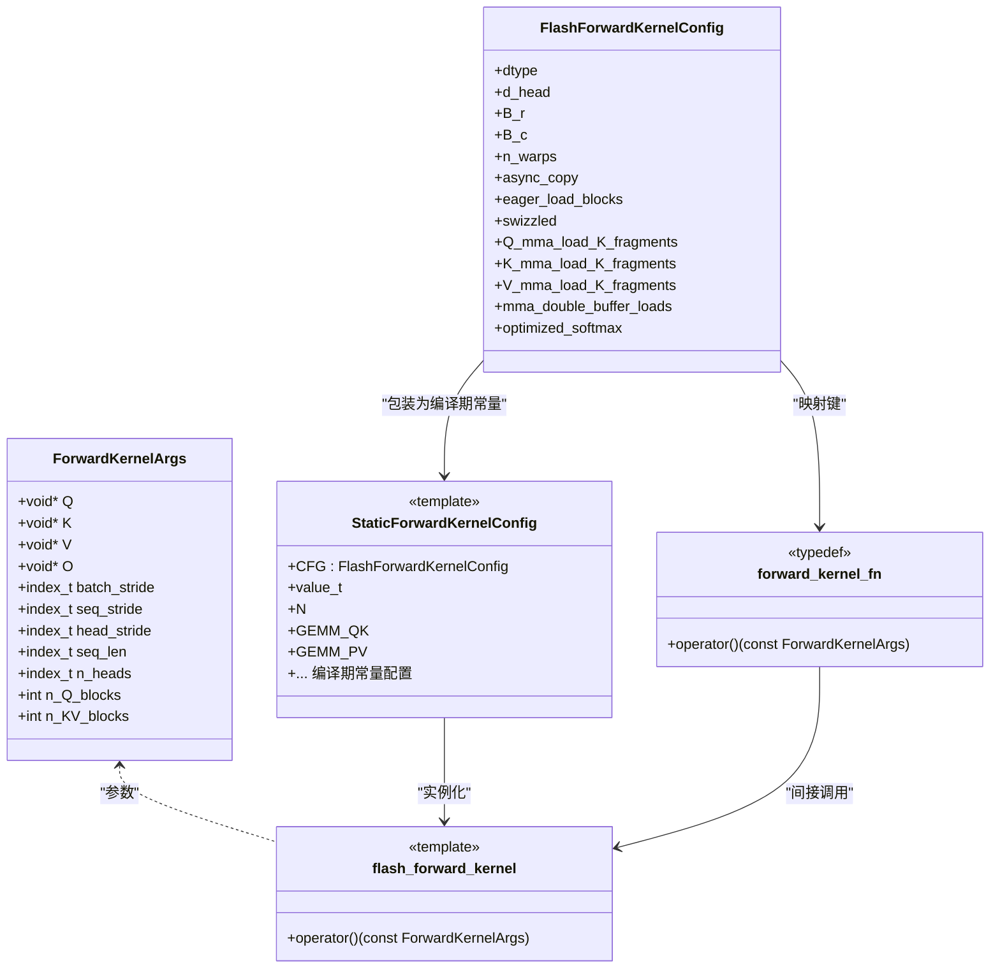
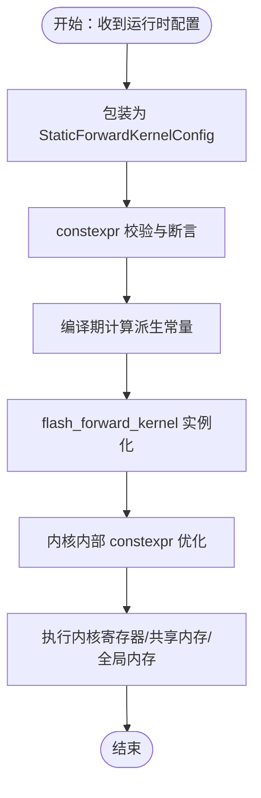
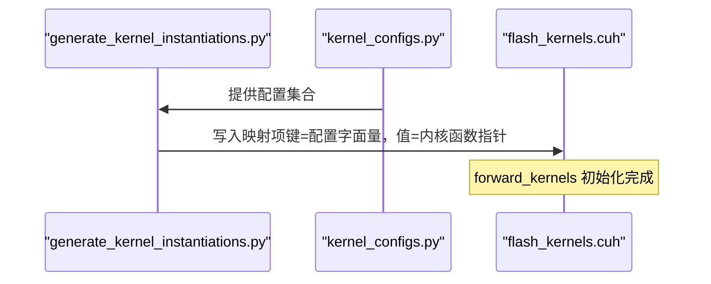
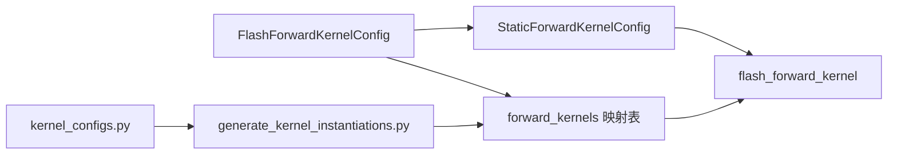

# 函数值绑定与实例化

<cite>
**本文引用的文件**
- [src/include/flash_kernels.cuh](file://src/include/flash_kernels.cuh)
- [src/include/forward_kernel.cuh](file://src/include/forward_kernel.cuh)
- [src/include/static_kernel_configuration.cuh](file://src/include/static_kernel_configuration.cuh)
- [src/include/flash_attention.cuh](file://src/include/flash_attention.cuh)
- [tools/build/generate_kernel_instantiations.py](file://tools/build/generate_kernel_instantiations.py)
- [py/flash_helpers/kernel_configs.py](file://py/flash_helpers/kernel_configs.py)
</cite>

## 目录
1. [引言](#引言)
2. [项目结构](#项目结构)
3. [核心组件](#核心组件)
4. [架构总览](#架构总览)
5. [详细组件分析](#详细组件分析)
6. [依赖关系分析](#依赖关系分析)
7. [性能考量](#性能考量)
8. [故障排查指南](#故障排查指南)
9. [结论](#结论)
10. [附录](#附录)

## 引言
本文件聚焦于内核函数值绑定与模板实例化机制，围绕 src/include/flash_kernels.cuh 中的 forward_kernel_fn 函数指针类型与 flash_forward_kernel 模板实例化之间的绑定关系展开。我们将解释：
- typedef void (*forward_kernel_fn)(const ForwardKernelArgs) 的作用与语义；
- 如何通过 flash_forward_kernel<StaticForwardKernelConfig<...>> 将运行时配置 FlashForwardKernelConfig 转换为编译期常量 StaticForwardKernelConfig；
- 双重包装设计（FlashForwardKernelConfig → StaticForwardKernelConfig）如何在编译期优化与运行时调度之间取得平衡；
- 函数指针间接调用对性能的影响与权衡。

## 项目结构
该功能位于 CUDA 前向注意力内核体系中，关键文件如下：
- flash_kernels.cuh：维护运行时到内核函数指针的映射表，负责“值绑定”；
- forward_kernel.cuh：定义 flash_forward_kernel 模板内核，负责“模板实例化”；
- static_kernel_configuration.cuh：定义 StaticForwardKernelConfig，承载编译期常量配置；
- flash_attention.cuh：定义 FlashForwardKernelConfig、ForwardKernelArgs 等运行时数据结构；
- generate_kernel_instantiations.py：自动生成 flash_kernels.cuh 的映射条目；
- kernel_configs.py：提供配置枚举与 C++ 结构体字符串生成逻辑。

图表来源
- [src/include/flash_kernels.cuh](file://src/include/flash_kernels.cuh#L1-L187)
- [src/include/forward_kernel.cuh](file://src/include/forward_kernel.cuh#L85-L207)
- [src/include/static_kernel_configuration.cuh](file://src/include/static_kernel_configuration.cuh#L104-L120)
- [src/include/flash_attention.cuh](file://src/include/flash_attention.cuh#L30-L109)
- [tools/build/generate_kernel_instantiations.py](file://tools/build/generate_kernel_instantiations.py#L13-L56)
- [py/flash_helpers/kernel_configs.py](file://py/flash_helpers/kernel_configs.py#L106-L167)

章节来源
- [src/include/flash_kernels.cuh](file://src/include/flash_kernels.cuh#L1-L187)
- [src/include/forward_kernel.cuh](file://src/include/forward_kernel.cuh#L85-L207)
- [src/include/static_kernel_configuration.cuh](file://src/include/static_kernel_configuration.cuh#L104-L120)
- [src/include/flash_attention.cuh](file://src/include/flash_attention.cuh#L30-L109)
- [tools/build/generate_kernel_instantiations.py](file://tools/build/generate_kernel_instantiations.py#L13-L56)
- [py/flash_helpers/kernel_configs.py](file://py/flash_helpers/kernel_configs.py#L106-L167)

## 核心组件
- 函数指针类型 forward_kernel_fn
  - 定义：typedef void (*forward_kernel_fn)(const ForwardKernelArgs)；
  - 作用：作为统一入口，屏蔽不同静态配置下的内核签名差异，便于运行时按配置查找并调用对应内核。
- 映射表 forward_kernels
  - 类型：std::map<FlashForwardKernelConfig, forward_kernel_fn>；
  - 价值：将运行时配置 FlashForwardKernelConfig 与编译期静态配置 StaticForwardKernelConfig 包装后的内核函数指针绑定，实现“值绑定”。
- flash_forward_kernel 模板
  - 形参：template <typename Kernel>；
  - 实例化：flash_forward_kernel<StaticForwardKernelConfig<FlashForwardKernelConfig{...}>>；
  - 作用：根据编译期常量配置 Kernel（由 StaticForwardKernelConfig 提供）生成具体内核，包含张量布局、加载策略、GEMM 配置等。
- StaticForwardKernelConfig
  - 作用：将 FlashForwardKernelConfig 的运行时字段提升为编译期常量，驱动模板内部的 constexpr 计算与静态断言，从而在编译期完成大量优化。
- 生成器 generate_kernel_instantiations.py
  - 作用：遍历 kernel_configs.py 中的配置集合，动态生成 flash_kernels.cuh 的映射项，确保运行时配置与编译期内核实例一一对应。

章节来源
- [src/include/flash_kernels.cuh](file://src/include/flash_kernels.cuh#L12-L187)
- [src/include/forward_kernel.cuh](file://src/include/forward_kernel.cuh#L85-L207)
- [src/include/static_kernel_configuration.cuh](file://src/include/static_kernel_configuration.cuh#L104-L120)
- [tools/build/generate_kernel_instantiations.py](file://tools/build/generate_kernel_instantiations.py#L13-L56)
- [py/flash_helpers/kernel_configs.py](file://py/flash_helpers/kernel_configs.py#L106-L167)

## 架构总览
下图展示了从“运行时配置”到“编译期内核实例”的端到端流程，以及“函数指针间接调用”的位置与影响。

图表来源
- [src/include/flash_kernels.cuh](file://src/include/flash_kernels.cuh#L12-L187)
- [src/include/forward_kernel.cuh](file://src/include/forward_kernel.cuh#L85-L207)
- [src/include/flash_attention.cuh](file://src/include/flash_attention.cuh#L1-L28)

## 详细组件分析

### 组件A：函数指针类型与映射表
- forward_kernel_fn
  - 语义：统一的内核入口签名，屏蔽不同静态配置的差异；
  - 参数：const ForwardKernelArgs，包含 Q/K/V/O 指针、批量/序列/头步幅、块数等；
  - 返回：void，内核在设备上执行，结果写回目标缓冲区。
- forward_kernels 映射表
  - 键：FlashForwardKernelConfig（运行时配置）；
  - 值：forward_kernel_fn（指向 flash_forward_kernel<StaticForwardKernelConfig<...>> 的函数指针）；
  - 生成：由 generate_kernel_instantiations.py 依据 kernel_configs.py 的配置集合生成，保证每个配置都有对应的内核实例。

图表来源
- [src/include/flash_attention.cuh](file://src/include/flash_attention.cuh#L1-L28)
- [src/include/flash_attention.cuh](file://src/include/flash_attention.cuh#L30-L109)
- [src/include/static_kernel_configuration.cuh](file://src/include/static_kernel_configuration.cuh#L104-L120)
- [src/include/forward_kernel.cuh](file://src/include/forward_kernel.cuh#L85-L207)
- [src/include/flash_kernels.cuh](file://src/include/flash_kernels.cuh#L12-L187)

章节来源
- [src/include/flash_kernels.cuh](file://src/include/flash_kernels.cuh#L12-L187)
- [src/include/flash_attention.cuh](file://src/include/flash_attention.cuh#L1-L28)
- [src/include/flash_attention.cuh](file://src/include/flash_attention.cuh#L30-L109)

### 组件B：模板实例化与编译期优化
- StaticForwardKernelConfig
  - 将 FlashForwardKernelConfig 的字段提升为 constexpr，如 dtype、B_r/B_c/d_head、是否异步拷贝、是否预加载、是否 swizzle、各张量的 K 方向片段数、是否双缓冲等；
  - 通过 constexpr 计算派生常量（如线程数、碎片数、tile 数、寄存器/共享内存布局等），并在构造阶段进行静态断言，确保配置合法。
- flash_forward_kernel<Kernel>
  - Kernel 即 StaticForwardKernelConfig，模板参数在编译期确定；
  - 内核内部使用 Kernel::value_t、Kernel::B_r、Kernel::B_c、Kernel::d_head 等编译期常量，生成最优的张量视图、共享内存布局、GEMM 配置与加载策略；
  - 通过 constexpr 分支选择是否启用优化 softmax、是否整块加载到寄存器等，减少分支开销。

图表来源
- [src/include/static_kernel_configuration.cuh](file://src/include/static_kernel_configuration.cuh#L13-L35)
- [src/include/static_kernel_configuration.cuh](file://src/include/static_kernel_configuration.cuh#L104-L120)
- [src/include/forward_kernel.cuh](file://src/include/forward_kernel.cuh#L85-L207)

章节来源
- [src/include/static_kernel_configuration.cuh](file://src/include/static_kernel_configuration.cuh#L13-L35)
- [src/include/static_kernel_configuration.cuh](file://src/include/static_kernel_configuration.cuh#L104-L120)
- [src/include/forward_kernel.cuh](file://src/include/forward_kernel.cuh#L85-L207)

### 组件C：自动生成与运行时调度
- generate_kernel_instantiations.py
  - 读取 kernel_configs.py 的配置集合；
  - 对每个配置生成一行映射项：键为 FlashForwardKernelConfig 的 C++ 结构体字面量，值为 &flash_forward_kernel<StaticForwardKernelConfig<键>>；
  - 输出到 flash_kernels.cuh，形成完整的 forward_kernels 映射表。
- 运行时调度
  - 调用方根据输入张量形状与 dtype 选择合适的 FlashForwardKernelConfig；
  - 在 forward_kernels 中查找对应函数指针；
  - 通过函数指针间接调用 flash_forward_kernel<StaticForwardKernelConfig<...>>(args)。

图表来源
- [tools/build/generate_kernel_instantiations.py](file://tools/build/generate_kernel_instantiations.py#L13-L56)
- [py/flash_helpers/kernel_configs.py](file://py/flash_helpers/kernel_configs.py#L106-L167)
- [src/include/flash_kernels.cuh](file://src/include/flash_kernels.cuh#L12-L187)

章节来源
- [tools/build/generate_kernel_instantiations.py](file://tools/build/generate_kernel_instantiations.py#L13-L56)
- [py/flash_helpers/kernel_configs.py](file://py/flash_helpers/kernel_configs.py#L106-L167)
- [src/include/flash_kernels.cuh](file://src/include/flash_kernels.cuh#L12-L187)

## 依赖关系分析
- 组件耦合
  - flash_kernels.cuh 依赖 FlashForwardKernelConfig 与 forward_kernel.cuh；
  - forward_kernel.cuh 依赖 StaticForwardKernelConfig 与 FlashForwardKernelConfig（通过 Kernel 概念）；
  - generate_kernel_instantiations.py 依赖 kernel_configs.py 与 flash_kernels.cuh 的输出格式。
- 关键依赖链
  - FlashForwardKernelConfig → StaticForwardKernelConfig → flash_forward_kernel<Kernel>；
  - 运行时配置 → 映射表查找 → 函数指针间接调用 → 具体内核执行。

图表来源
- [src/include/flash_attention.cuh](file://src/include/flash_attention.cuh#L30-L109)
- [src/include/static_kernel_configuration.cuh](file://src/include/static_kernel_configuration.cuh#L104-L120)
- [src/include/forward_kernel.cuh](file://src/include/forward_kernel.cuh#L85-L207)
- [src/include/flash_kernels.cuh](file://src/include/flash_kernels.cuh#L12-L187)
- [tools/build/generate_kernel_instantiations.py](file://tools/build/generate_kernel_instantiations.py#L13-L56)
- [py/flash_helpers/kernel_configs.py](file://py/flash_helpers/kernel_configs.py#L106-L167)

章节来源
- [src/include/flash_attention.cuh](file://src/include/flash_attention.cuh#L30-L109)
- [src/include/static_kernel_configuration.cuh](file://src/include/static_kernel_configuration.cuh#L104-L120)
- [src/include/forward_kernel.cuh](file://src/include/forward_kernel.cuh#L85-L207)
- [src/include/flash_kernels.cuh](file://src/include/flash_kernels.cuh#L12-L187)
- [tools/build/generate_kernel_instantiations.py](file://tools/build/generate_kernel_instantiations.py#L13-L56)
- [py/flash_helpers/kernel_configs.py](file://py/flash_helpers/kernel_configs.py#L106-L167)

## 性能考量
- 函数指针间接调用
  - 优点：统一入口、便于运行时按配置选择内核，避免手写分支；
  - 成本：一次间接跳转；现代 GPU 上通常可被硬件分支预测与流水线隐藏，影响有限；
  - 优化建议：尽量减少不必要的映射查找次数，合并多次调用；确保映射表大小适中。
- 编译期优化
  - StaticForwardKernelConfig 将配置提升为 constexpr，使内核内部可进行大量静态断言与派生常量计算，减少运行时分支与内存访问开销；
  - constexpr 分支（如是否整块加载到寄存器、是否启用优化 softmax）在编译期展开，降低运行时判断成本。
- 内存与带宽
  - 内核通过共享内存与向量化存储减少全局内存带宽压力；
  - 异步拷贝与双缓冲策略（若启用）可提高访存与计算重叠度。

[本节为通用性能讨论，不直接分析具体文件]

## 故障排查指南
- 配置不合法
  - 现象：编译失败或运行时异常；
  - 排查：检查 StaticForwardKernelConfig 的 constexpr 校验与断言，确认 d_head、B_r/B_c、K 片段数、双缓冲等参数满足约束。
- 映射缺失
  - 现象：运行时找不到对应函数指针；
  - 排查：确认 generate_kernel_instantiations.py 是否包含该配置；核对配置字面量与映射键是否一致。
- 内存布局错误
  - 现象：内核读写越界或结果错误；
  - 排查：核对 ForwardKernelArgs 的步幅与偏移计算，确保 Q/O 与 K/V 的内存布局与内核期望一致。

章节来源
- [src/include/static_kernel_configuration.cuh](file://src/include/static_kernel_configuration.cuh#L13-L35)
- [src/include/flash_kernels.cuh](file://src/include/flash_kernels.cuh#L12-L187)
- [src/include/flash_attention.cuh](file://src/include/flash_attention.cuh#L1-L28)

## 结论
- forward_kernel_fn 与 forward_kernels 的组合实现了“运行时配置到编译期内核”的解耦绑定；
- FlashForwardKernelConfig 通过 StaticForwardKernelConfig 转换为编译期常量，使 flash_forward_kernel 模板能在编译期完成大量优化；
- 自动生成机制确保了配置与实例的一致性，简化了维护成本；
- 函数指针间接调用带来的性能开销通常可忽略，换来的是灵活的运行时调度能力。

[本节为总结性内容，不直接分析具体文件]

## 附录
- 关键符号路径参考
  - 函数指针类型定义：[src/include/flash_kernels.cuh](file://src/include/flash_kernels.cuh#L12-L12)
  - 映射表初始化：[src/include/flash_kernels.cuh](file://src/include/flash_kernels.cuh#L14-L187)
  - 内核模板定义：[src/include/forward_kernel.cuh](file://src/include/forward_kernel.cuh#L85-L207)
  - 编译期配置结构：[src/include/static_kernel_configuration.cuh](file://src/include/static_kernel_configuration.cuh#L104-L120)
  - 运行时配置结构：[src/include/flash_attention.cuh](file://src/include/flash_attention.cuh#L30-L109)
  - 自动化生成脚本：[tools/build/generate_kernel_instantiations.py](file://tools/build/generate_kernel_instantiations.py#L13-L56)
  - 配置枚举与生成：[py/flash_helpers/kernel_configs.py](file://py/flash_helpers/kernel_configs.py#L106-L167)