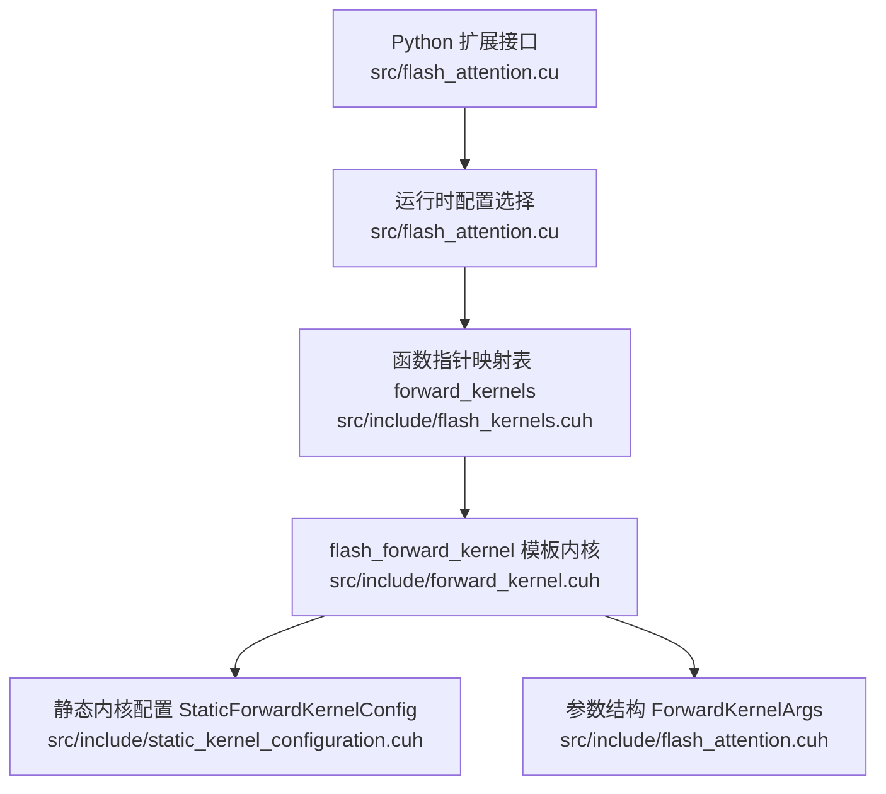
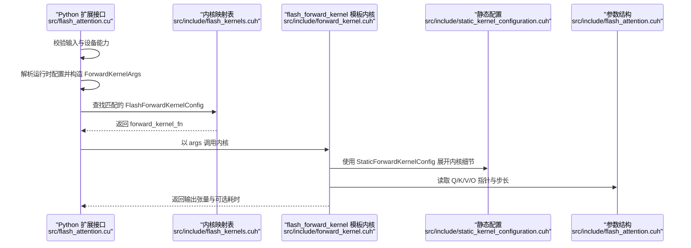
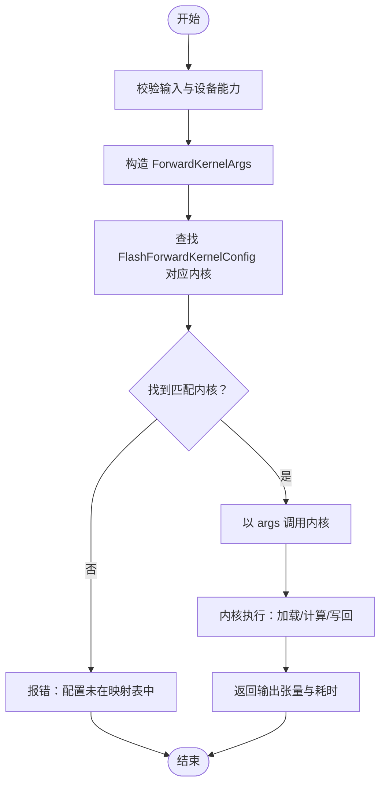
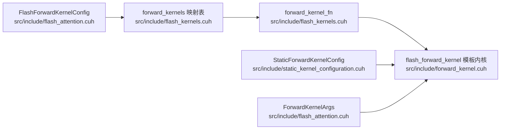

# 函数指针定义

<cite>
**本文引用的文件**
- [src/include/flash_kernels.cuh](file://src/include/flash_kernels.cuh)
- [src/include/flash_attention.cuh](file://src/include/flash_attention.cuh)
- [src/include/forward_kernel.cuh](file://src/include/forward_kernel.cuh)
- [src/include/static_kernel_configuration.cuh](file://src/include/static_kernel_configuration.cuh)
- [src/flash_attention.cu](file://src/flash_attention.cu)
- [tools/build/generate_kernel_instantiations.py](file://tools/build/generate_kernel_instantiations.py)
</cite>

## 目录
1. [引言](#引言)
2. [项目结构](#项目结构)
3. [核心组件](#核心组件)
4. [架构总览](#架构总览)
5. [详细组件分析](#详细组件分析)
6. [依赖关系分析](#依赖关系分析)
7. [性能考量](#性能考量)
8. [故障排查指南](#故障排查指南)
9. [结论](#结论)

## 引言
本文件围绕 src/include/flash_kernels.cuh 中的函数指针类型 typedef void (*forward_kernel_fn)(const ForwardKernelArgs) 展开，系统性解析其在运行时调度 Flash Attention 前向内核中的作用与设计价值。我们将从类型定义、参数结构 ForwardKernelArgs 的组成、到多版本内核实例化的映射表 forward_kernels，再到实际调用流程与性能优化策略进行深入剖析，帮助读者理解如何通过函数指针实现“模板常量配置 + 运行时选择”的灵活调度机制。

## 项目结构
本仓库采用分层组织：CUDA 内核与调度逻辑集中在 src/include 与 src 目录；工具脚本用于自动生成内核实例化映射；Python 层负责对外接口绑定与参数校验。与本文主题直接相关的文件如下：
- 类型与参数：src/include/flash_attention.cuh（包含 ForwardKernelArgs）
- 函数指针与内核映射：src/include/flash_kernels.cuh（包含 forward_kernel_fn 与 forward_kernels 映射）
- 内核实现模板：src/include/forward_kernel.cuh（包含 flash_forward_kernel 模板内核）
- 静态内核配置：src/include/static_kernel_configuration.cuh（将运行时配置转换为编译期常量）
- 调用入口与调度：src/flash_attention.cu（构建 ForwardKernelArgs 并调用具体内核）
- 自动化生成：tools/build/generate_kernel_instantiations.py（生成 flash_kernels.cuh）

图表来源
- [src/flash_attention.cu](file://src/flash_attention.cu#L34-L135)
- [src/include/flash_kernels.cuh](file://src/include/flash_kernels.cuh#L12-L186)
- [src/include/forward_kernel.cuh](file://src/include/forward_kernel.cuh#L85-L205)
- [src/include/static_kernel_configuration.cuh](file://src/include/static_kernel_configuration.cuh#L104-L120)
- [src/include/flash_attention.cuh](file://src/include/flash_attention.cuh#L8-L27)

章节来源
- [src/flash_attention.cu](file://src/flash_attention.cu#L34-L135)
- [src/include/flash_kernels.cuh](file://src/include/flash_kernels.cuh#L12-L186)
- [src/include/forward_kernel.cuh](file://src/include/forward_kernel.cuh#L85-L205)
- [src/include/static_kernel_configuration.cuh](file://src/include/static_kernel_configuration.cuh#L104-L120)
- [src/include/flash_attention.cuh](file://src/include/flash_attention.cuh#L8-L27)

## 核心组件
- 函数指针类型 forward_kernel_fn：用于统一描述“接受 ForwardKernelArgs 的 CUDA 内核”签名，便于以函数指针形式存储与调用不同配置的内核实例。
- 参数结构 ForwardKernelArgs：封装了 Q、K、V、O 四个张量的内存指针以及批量、序列、头维度、步长、块数等运行时信息。
- 内核映射表 forward_kernels：以 FlashForwardKernelConfig 为键，以 forward_kernel_fn 为值，将运行时配置映射到具体内核实例。
- 模板内核 flash_forward_kernel：接收 __grid_constant__ 的 ForwardKernelArgs，内部通过 StaticForwardKernelConfig 将运行时配置转为编译期常量，从而在编译期展开内核细节。
- 静态配置 StaticForwardKernelConfig：将 FlashForwardKernelConfig 的字段提升为编译期常量，驱动模板内核的形状、加载策略、寄存器/共享内存布局等。

章节来源
- [src/include/flash_kernels.cuh](file://src/include/flash_kernels.cuh#L12-L186)
- [src/include/flash_attention.cuh](file://src/include/flash_attention.cuh#L8-L27)
- [src/include/forward_kernel.cuh](file://src/include/forward_kernel.cuh#L85-L205)
- [src/include/static_kernel_configuration.cuh](file://src/include/static_kernel_configuration.cuh#L104-L120)

## 架构总览
下图展示了从 Python 接口到 CUDA 内核的完整调用链路，强调函数指针在“运行时配置选择 + 编译期内核展开”之间的桥梁作用。

图表来源
- [src/flash_attention.cu](file://src/flash_attention.cu#L34-L135)
- [src/include/flash_kernels.cuh](file://src/include/flash_kernels.cuh#L12-L186)
- [src/include/forward_kernel.cuh](file://src/include/forward_kernel.cuh#L85-L205)
- [src/include/static_kernel_configuration.cuh](file://src/include/static_kernel_configuration.cuh#L104-L120)
- [src/include/flash_attention.cuh](file://src/include/flash_attention.cuh#L8-L27)

## 详细组件分析

### 组件一：函数指针类型 forward_kernel_fn 的定义与用途
- 定义位置：src/include/flash_kernels.cuh 第 12 行
- 作用：统一 Flash Attention 前向内核的调用接口，屏蔽不同配置内核的差异，使运行时仅需持有函数指针即可发起调用。
- 设计优势：
  - 运行时灵活性：通过 forward_kernels 映射表按配置选择不同内核实例，避免在调用点处写死模板参数。
  - 减少模板实例化开销：内核模板在编译期展开，运行时只传递函数指针，避免重复实例化。
  - 可扩展性强：新增配置只需在映射表中添加条目，无需修改调用侧。

章节来源
- [src/include/flash_kernels.cuh](file://src/include/flash_kernels.cuh#L12-L186)

### 组件二：参数结构 ForwardKernelArgs 的组成与语义
ForwardKernelArgs 字段含义如下：
- Q/K/V/O：指向输入/输出张量的内存指针（void*），由调用方传入。
- batch_stride、seq_stride、head_stride：张量在内存中的步长，用于根据批、序列、头维度定位数据。
- seq_len、n_heads：序列长度与头数量，决定块划分与网格维度。
- n_Q_blocks、n_KV_blocks：Q 与 KV 的块数，用于网格维度与循环控制。

这些字段共同构成内核执行所需的上下文信息，flash_forward_kernel 在其内部通过这些信息计算各张量的偏移与共享内存布局。

章节来源
- [src/include/flash_attention.cuh](file://src/include/flash_attention.cuh#L8-L27)

### 组件三：内核映射表 forward_kernels 的构建与使用
- 构建方式：tools/build/generate_kernel_instantiations.py 自动生成 flash_kernels.cuh，将若干 FlashForwardKernelConfig 实例映射到 flash_forward_kernel<StaticForwardKernelConfig<CFG>>。
- 使用方式：src/flash_attention.cu 在运行时根据传入的配置查找映射表，获取对应函数指针后调用。
- 优势：
  - 通过映射表集中管理所有可用配置，避免分散的 if/else 或 switch 分支。
  - 支持大量配置组合的快速实例化与维护。

章节来源
- [tools/build/generate_kernel_instantiations.py](file://tools/build/generate_kernel_instantiations.py#L13-L56)
- [src/include/flash_kernels.cuh](file://src/include/flash_kernels.cuh#L12-L186)
- [src/flash_attention.cu](file://src/flash_attention.cu#L34-L135)

### 组件四：模板内核 flash_forward_kernel 的实现要点
- 入口签名：接收 __grid_constant__ 的 ForwardKernelArgs，确保参数在内核中以寄存器常量形式访问，降低访存开销。
- 配置展开：通过 StaticForwardKernelConfig 将运行时配置转为编译期常量，从而在编译期确定张量布局、加载策略、GEMM 等细节。
- 数据流控制：内核根据 n_Q_blocks 与 n_KV_blocks 进行块级循环，异步加载 Q/K/V 到共享内存，执行 S=QK 与 P=softmax(S)、O=P·V 的矩阵乘法流水线。
- 输出写回：先写入共享内存再统一写回全局内存，利用向量化与合并写以提升带宽利用率。

章节来源
- [src/include/forward_kernel.cuh](file://src/include/forward_kernel.cuh#L85-L205)
- [src/include/static_kernel_configuration.cuh](file://src/include/static_kernel_configuration.cuh#L104-L120)

### 组件五：静态配置 StaticForwardKernelConfig 的编译期常量化
- 将 FlashForwardKernelConfig 的字段（如 dtype、B_r、B_c、d_head、n_warps、async_copy、eager_load_blocks、swizzled、mma 加载片段数、优化开关等）提升为编译期常量。
- 通过该常量集，模板内核可以确定：
  - 张量加载/存储的布局与步长
  - 寄存器/共享内存的 tile 形状与缓冲策略
  - GEMM 计算的 tile 大小与阶段数
  - softmax 优化路径与统计量的组织方式

章节来源
- [src/include/static_kernel_configuration.cuh](file://src/include/static_kernel_configuration.cuh#L104-L120)

### 组件六：运行时调度与调用流程
- Python 扩展接口负责：
  - 校验输入张量形状与数据类型
  - 将 Python 配置转换为 FlashForwardKernelConfig
  - 构造 ForwardKernelArgs（含指针、步长、块数等）
  - 选择合适内核并设置动态共享内存属性
  - 发起 CUDA 内核调用
- 内核内部：
  - 读取 ForwardKernelArgs，计算各张量的块偏移
  - 依据 StaticForwardKernelConfig 展开加载/计算/写回流水线
  - 返回输出张量

图表来源
- [src/flash_attention.cu](file://src/flash_attention.cu#L34-L135)
- [src/include/flash_kernels.cuh](file://src/include/flash_kernels.cuh#L12-L186)
- [src/include/flash_attention.cuh](file://src/include/flash_attention.cuh#L8-L27)

章节来源
- [src/flash_attention.cu](file://src/flash_attention.cu#L34-L135)

## 依赖关系分析
- forward_kernels 依赖：
  - FlashForwardKernelConfig：作为键，描述内核配置
  - flash_forward_kernel 模板：作为值，绑定到具体配置的实例化
  - StaticForwardKernelConfig：将运行时配置转为编译期常量
- flash_forward_kernel 依赖：
  - ForwardKernelArgs：提供张量指针与步长
  - StaticForwardKernelConfig：提供编译期常量配置
  - 各种张量加载/存储、GEMM、softmax 等底层组件（在其他头文件中定义）

图表来源
- [src/include/flash_kernels.cuh](file://src/include/flash_kernels.cuh#L12-L186)
- [src/include/flash_attention.cuh](file://src/include/flash_attention.cuh#L8-L27)
- [src/include/forward_kernel.cuh](file://src/include/forward_kernel.cuh#L85-L205)
- [src/include/static_kernel_configuration.cuh](file://src/include/static_kernel_configuration.cuh#L104-L120)

章节来源
- [src/include/flash_kernels.cuh](file://src/include/flash_kernels.cuh#L12-L186)
- [src/include/flash_attention.cuh](file://src/include/flash_attention.cuh#L8-L27)
- [src/include/forward_kernel.cuh](file://src/include/forward_kernel.cuh#L85-L205)
- [src/include/static_kernel_configuration.cuh](file://src/include/static_kernel_configuration.cuh#L104-L120)

## 性能考量
- 函数指针调度的优势：
  - 避免在调用点处进行复杂分支判断，降低分支预测压力
  - 通过映射表集中管理配置，减少模板实例化数量，缩短编译时间
- 编译期常量化：
  - 将配置提升为编译期常量，使编译器在内核中展开更优的内存访问模式与寄存器/共享内存布局
- 流水线与异步加载：
  - 通过 cp_async 等异步拷贝与同步屏障，最大化隐藏访存延迟
  - 将 softmax 与 GEMM 计算交错，提升吞吐
- 写回优化：
  - 先写入共享内存再统一写回全局内存，利用向量化与合并写，减少未对齐与非连续写带来的带宽损失

[本节为通用性能讨论，不直接分析具体文件，故无章节来源]

## 故障排查指南
- 配置未命中映射表
  - 现象：调用时报错提示配置未在映射表中
  - 排查：确认传入的 FlashForwardKernelConfig 是否与映射表中的键一致；检查生成脚本是否正确执行
  - 参考文件：src/flash_attention.cu、src/include/flash_kernels.cuh
- 设备能力不足
  - 现象：设备计算能力低于要求
  - 排查：确认设备 SM 版本满足最低要求
  - 参考文件：src/flash_attention.cu
- 输入张量形状或类型不匹配
  - 现象：形状或 dtype 校验失败
  - 排查：核对 Q/K/V 的形状与 dtype，确保与输出张量一致
  - 参考文件：src/flash_attention.cu
- 步长与块数不满足约束
  - 现象：校验失败导致报错
  - 排查：确保 seq_len 是 B_r/B_c 的整数倍
  - 参考文件：src/flash_attention.cu

章节来源
- [src/flash_attention.cu](file://src/flash_attention.cu#L34-L135)
- [src/include/flash_kernels.cuh](file://src/include/flash_kernels.cuh#L12-L186)

## 结论
通过函数指针 forward_kernel_fn 与 forward_kernels 映射表，本项目实现了“运行时配置选择 + 编译期模板展开”的高效融合：运行时仅需一个函数指针即可调用不同配置的内核实例，而内核内部则借助 StaticForwardKernelConfig 将配置常量化，从而在编译期生成最优的内存布局与计算流水线。这种设计既提升了运行时的灵活性与可扩展性，又保持了编译期的高性能与稳定性，是实现大规模 Flash Attention 内核调度的关键所在。