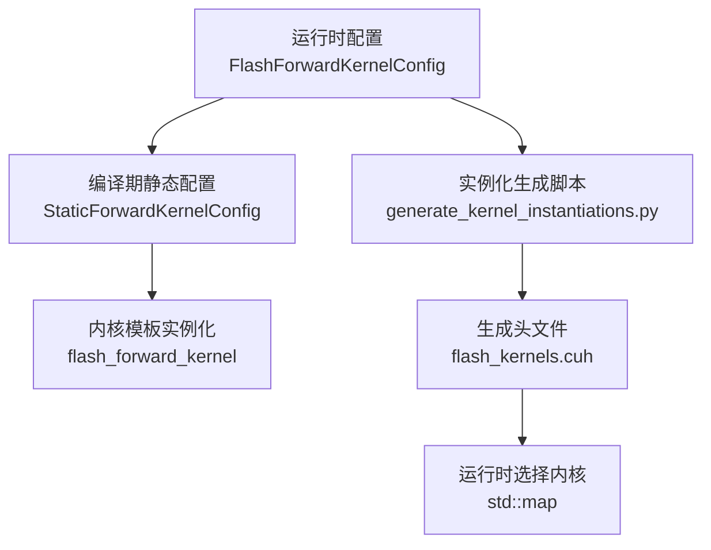
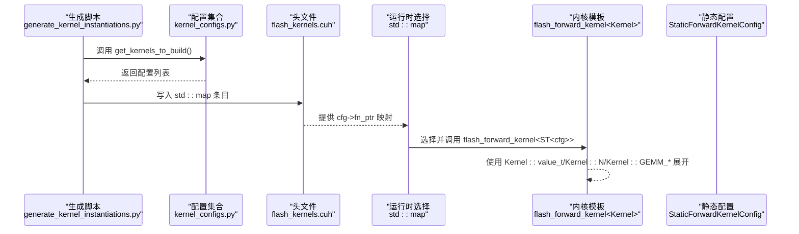
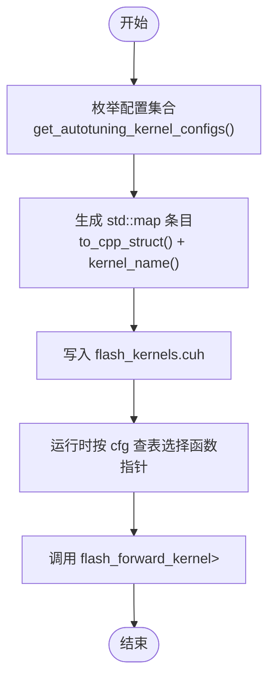
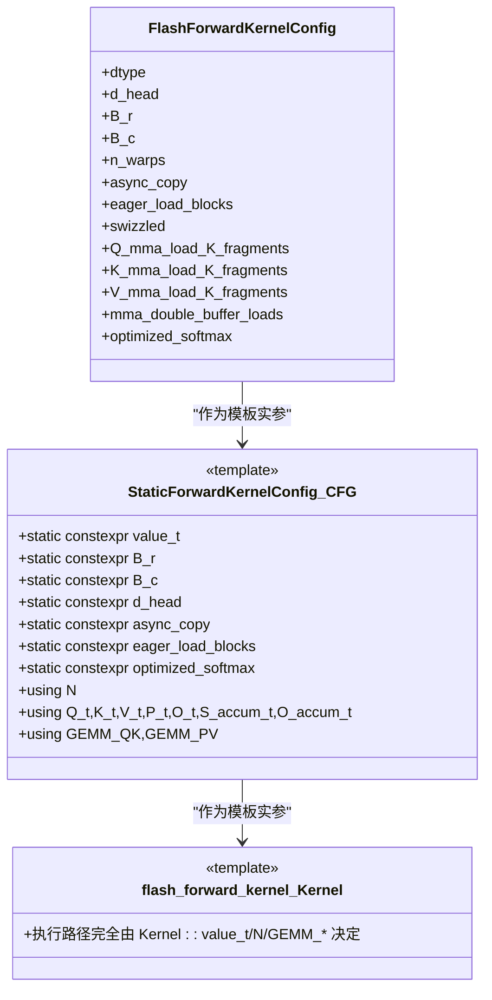

# 模板实例化机制

<cite>
**本文引用的文件**
- [flash_kernels.cuh](file://src/include/flash_kernels.cuh)
- [static_kernel_configuration.cuh](file://src/include/static_kernel_configuration.cuh)
- [forward_kernel.cuh](file://src/include/forward_kernel.cuh)
- [flash_attention.cuh](file://src/include/flash_attention.cuh)
- [generate_kernel_instantiations.py](file://tools/build/generate_kernel_instantiations.py)
- [kernel_configs.py](file://py/flash_helpers/kernel_configs.py)
</cite>

## 目录
1. [引言](#引言)
2. [项目结构](#项目结构)
3. [核心组件](#核心组件)
4. [架构总览](#架构总览)
5. [详细组件分析](#详细组件分析)
6. [依赖关系分析](#依赖关系分析)
7. [性能考量](#性能考量)
8. [故障排查指南](#故障排查指南)
9. [结论](#结论)
10. [附录](#附录)

## 引言
本文聚焦于 src/include/flash_kernels.cuh 中 flash_forward_kernel<StaticForwardKernelConfig<...>> 的模板实例化机制，系统阐述如何通过“运行时配置”FlashForwardKernelConfig 与“编译期静态配置”StaticForwardKernelConfig 的嵌套模板，将运行时可变参数在编译期固化为常量，从而实现对内核执行路径的深度优化。文档以第 17-185 行的实例化映射为中心，逐条解释不同配置组合（数据类型、块大小、异步加载、Swizzling 等）如何生成独立的内核实例，并讨论模板膨胀（template bloat）的成因与管理策略。

## 项目结构
本项目采用“配置驱动 + 自动化生成”的方式组织内核实例化：
- 运行时配置：FlashForwardKernelConfig 定义了内核的所有可变参数集合（数据类型、块尺寸、线程块/线程数、是否异步拷贝、是否提前加载、是否 Swizzled、各张量的 K 方向碎片数、是否双缓冲、是否优化 Softmax 等）。
- 编译期静态配置：StaticForwardKernelConfig 将 FlashForwardKernelConfig 的值提升为编译期常量，派生出内存布局、寄存器/共享内存布局、访存步幅、Tile 形状等全部静态信息。
- 内核主体：flash_forward_kernel<Kernel> 使用 Kernel::value_t、Kernel::N、Kernel::GEMM_QK 等编译期常量进行模板展开，形成高度优化的执行路径。
- 实例化生成：工具脚本根据枚举的配置集合自动生成 flash_kernels.cuh 中的 std::map，键为 FlashForwardKernelConfig，值为对应模板实例化的函数指针。

图表来源
- [flash_kernels.cuh](file://src/include/flash_kernels.cuh#L17-L185)
- [static_kernel_configuration.cuh](file://src/include/static_kernel_configuration.cuh#L104-L291)
- [forward_kernel.cuh](file://src/include/forward_kernel.cuh#L85-L204)
- [generate_kernel_instantiations.py](file://tools/build/generate_kernel_instantiations.py#L1-L56)

章节来源
- [flash_kernels.cuh](file://src/include/flash_kernels.cuh#L17-L185)
- [static_kernel_configuration.cuh](file://src/include/static_kernel_configuration.cuh#L104-L291)
- [forward_kernel.cuh](file://src/include/forward_kernel.cuh#L85-L204)
- [generate_kernel_instantiations.py](file://tools/build/generate_kernel_instantiations.py#L1-L56)

## 核心组件
- 运行时配置 FlashForwardKernelConfig
  - 字段涵盖 dtype、d_head、B_r、B_c、n_warps、async_copy、eager_load_blocks、swizzled、Q/K/V 的 K 方向碎片数、mma_double_buffer_loads、optimized_softmax 等。
  - 提供比较运算符，用于 std::map 排序与去重。
- 编译期静态配置 StaticForwardKernelConfig
  - 将 FlashForwardKernelConfig 的字段提升为 static constexpr 常量，派生出 value_t、N（ForwardKernelTileShapes）、各类内存布局与访存步幅、GEMM 类型等。
  - 通过 constexpr 静态断言确保配置合法性（如 K 方向碎片数必须是 2 的幂且不超过上限）。
- 内核模板 flash_forward_kernel<Kernel>
  - 使用 Kernel::value_t、Kernel::N、Kernel::GEMM_QK 等编译期常量，展开为高度优化的执行路径。
  - 支持条件编译路径（如是否使用优化 Softmax、是否整块加载到寄存器等）。
- 实例化映射 flash_kernels
  - 键：FlashForwardKernelConfig；值：对应模板实例化的函数指针。
  - 由 generate_kernel_instantiations.py 基于枚举的配置集合自动生成。

章节来源
- [flash_attention.cuh](file://src/include/flash_attention.cuh#L30-L109)
- [static_kernel_configuration.cuh](file://src/include/static_kernel_configuration.cuh#L104-L291)
- [forward_kernel.cuh](file://src/include/forward_kernel.cuh#L85-L204)
- [flash_kernels.cuh](file://src/include/flash_kernels.cuh#L17-L185)
- [generate_kernel_instantiations.py](file://tools/build/generate_kernel_instantiations.py#L1-L56)

## 架构总览
下图展示了从配置到内核实例化的端到端流程，以及模板实例化如何在编译期固定执行路径。

图表来源
- [generate_kernel_instantiations.py](file://tools/build/generate_kernel_instantiations.py#L1-L56)
- [kernel_configs.py](file://py/flash_helpers/kernel_configs.py#L456-L486)
- [flash_kernels.cuh](file://src/include/flash_kernels.cuh#L17-L185)
- [forward_kernel.cuh](file://src/include/forward_kernel.cuh#L85-L204)
- [static_kernel_configuration.cuh](file://src/include/static_kernel_configuration.cuh#L104-L291)

## 详细组件分析

### 组件A：模板实例化映射与配置枚举
- 实例化映射键值对
  - 键：FlashForwardKernelConfig，包含 dtype、B_r/B_c、n_warps、async_copy、eager_load_blocks、swizzled、Q/K/V 的 K 方向碎片数、mma_double_buffer_loads、optimized_softmax 等。
  - 值：对应模板实例化函数指针 flash_forward_kernel<StaticForwardKernelConfig<...>>。
- 配置枚举来源
  - 通过 kernel_configs.py 的 get_autotuning_kernel_configs 生成配置集合，再由 generate_kernel_instantiations.py 写入 flash_kernels.cuh。
- 具体示例（节选）
  - FP16/FP32 + B_r=128, B_c=64/128, d_head=64/128, n_warps=4/8
  - 异步拷贝 async_copy 与提前加载 eager_load_blocks 的组合
  - Swizzled 与非 Swizzled 的组合
  - Q/K/V 的 K 方向碎片数（0/2）与双缓冲 mma_double_buffer_loads 的组合
  - 优化 Softmax optimized_softmax 的开关

图表来源
- [kernel_configs.py](file://py/flash_helpers/kernel_configs.py#L389-L424)
- [generate_kernel_instantiations.py](file://tools/build/generate_kernel_instantiations.py#L1-L56)
- [flash_kernels.cuh](file://src/include/flash_kernels.cuh#L17-L185)

章节来源
- [flash_kernels.cuh](file://src/include/flash_kernels.cuh#L17-L185)
- [kernel_configs.py](file://py/flash_helpers/kernel_configs.py#L389-L424)
- [generate_kernel_instantiations.py](file://tools/build/generate_kernel_instantiations.py#L1-L56)

### 组件B：嵌套模板与编译期优化
- 外层模板：flash_forward_kernel<Kernel>
  - Kernel 是 StaticForwardKernelConfig<CFG> 的别名，其中 CFG 是 FlashForwardKernelConfig 的一个具体实例。
  - 内核内部使用 Kernel::value_t、Kernel::N、Kernel::GEMM_QK 等编译期常量展开。
- 内部模板 StaticForwardKernelConfig<CFG>
  - 将 CFG 的字段提升为 static constexpr，派生出 value_t、N（ForwardKernelTileShapes）、GSMem/LDS 配置、Rmem/Smem 形状与步幅、GEMM 类型等。
  - 通过 constexpr 断言确保配置合法（如 K 方向碎片数必须是 2 的幂且不超过上限）。
- 优化点
  - 所有分支在编译期确定，避免运行时分支判断。
  - 访存步幅、Tile 形状、寄存器/共享内存布局均在编译期固定，便于编译器做寄存器分配与访存优化。

图表来源
- [flash_attention.cuh](file://src/include/flash_attention.cuh#L30-L109)
- [static_kernel_configuration.cuh](file://src/include/static_kernel_configuration.cuh#L104-L291)
- [forward_kernel.cuh](file://src/include/forward_kernel.cuh#L85-L204)

章节来源
- [static_kernel_configuration.cuh](file://src/include/static_kernel_configuration.cuh#L104-L291)
- [forward_kernel.cuh](file://src/include/forward_kernel.cuh#L85-L204)
- [flash_attention.cuh](file://src/include/flash_attention.cuh#L30-L109)

### 组件C：配置组合与实例化数量控制
- 配置维度
  - 数据类型：FP16/BF16
  - 块大小：B_r ∈ {64,128}，B_c ∈ {32,64,128}，n_warps ∈ {4,8}
  - 加载策略：async_copy、eager_load_blocks、swizzled
  - K 方向碎片数：Q/K/V ∈ {0,2}
  - 双缓冲：mma_double_buffer_loads
  - Softmax 优化：optimized_softmax
- 实例化数量
  - 仅当 should_autotune_config 过滤后保留的配置才会被实例化，避免无意义或非法组合。
  - 通过枚举与笛卡尔积生成有限集合，再由 generate_kernel_instantiations.py 写入头文件。

章节来源
- [kernel_configs.py](file://py/flash_helpers/kernel_configs.py#L389-L424)
- [kernel_configs.py](file://py/flash_helpers/kernel_configs.py#L456-L486)
- [flash_kernels.cuh](file://src/include/flash_kernels.cuh#L17-L185)

### 组件D：模板膨胀（Template Bloat）与管理策略
- 成因
  - 每个不同的 FlashForwardKernelConfig 对应一个 StaticForwardKernelConfig 实例，进而导致 flash_forward_kernel<Kernel> 的一次模板实例化。
  - 配置空间较大（多布尔位、多整型取值），若不加限制，实例化数量会爆炸式增长。
- 管理策略
  - 严格过滤：should_autotune_config 保证只生成合法且合理的配置，剔除寄存器/带宽超限或逻辑矛盾的组合。
  - 有限枚举：get_autotuning_kernel_configs 限定参数范围与取值集合，减少笛卡尔积规模。
  - 自动化生成：generate_kernel_instantiations.py 将枚举结果固化到头文件，避免运行时动态生成带来的不确定性。
  - 运行时选择：std::map 以配置为键，避免在运行时进行复杂分支判断。

章节来源
- [kernel_configs.py](file://py/flash_helpers/kernel_configs.py#L364-L387)
- [kernel_configs.py](file://py/flash_helpers/kernel_configs.py#L389-L424)
- [generate_kernel_instantiations.py](file://tools/build/generate_kernel_instantiations.py#L1-L56)
- [flash_kernels.cuh](file://src/include/flash_kernels.cuh#L17-L185)

## 依赖关系分析
- 头文件依赖
  - flash_kernels.cuh 依赖 flash_attention.cuh 与 forward_kernel.cuh。
  - static_kernel_configuration.cuh 依赖 common.h、flash_attention.cuh、gemm.cuh、layout.cuh、load_store.cuh、tensor.cuh、utils.h。
  - forward_kernel.cuh 依赖 static_kernel_configuration.cuh。
- 工具链依赖
  - generate_kernel_instantiations.py 依赖 py/flash_helpers/kernel_configs.py。
- 关键耦合点
  - FlashForwardKernelConfig 的比较运算符决定 std::map 的排序与唯一性。
  - StaticForwardKernelConfig 的 constexpr 断言确保配置合法性，防止无效实例化。

图表来源
- [flash_kernels.cuh](file://src/include/flash_kernels.cuh#L1-L20)
- [static_kernel_configuration.cuh](file://src/include/static_kernel_configuration.cuh#L1-L20)
- [forward_kernel.cuh](file://src/include/forward_kernel.cuh#L1-L20)
- [flash_attention.cuh](file://src/include/flash_attention.cuh#L1-L20)
- [generate_kernel_instantiations.py](file://tools/build/generate_kernel_instantiations.py#L1-L20)
- [kernel_configs.py](file://py/flash_helpers/kernel_configs.py#L1-L20)

章节来源
- [flash_kernels.cuh](file://src/include/flash_kernels.cuh#L1-L20)
- [static_kernel_configuration.cuh](file://src/include/static_kernel_configuration.cuh#L1-L20)
- [forward_kernel.cuh](file://src/include/forward_kernel.cuh#L1-L20)
- [flash_attention.cuh](file://src/include/flash_attention.cuh#L1-L20)
- [generate_kernel_instantiations.py](file://tools/build/generate_kernel_instantiations.py#L1-L20)
- [kernel_configs.py](file://py/flash_helpers/kernel_configs.py#L1-L20)

## 性能考量
- 编译期优化收益
  - 所有分支与访存路径在编译期确定，减少运行时分支预测开销。
  - 寄存器/共享内存布局、Tile 形状、步幅等在编译期固定，有利于编译器做寄存器分配与访存融合。
- 运行时灵活性
  - 通过 std::map 在运行时按配置选择对应实例化，兼顾灵活性与性能。
- 潜在风险
  - 模板实例化数量过多会导致编译时间与二进制体积增加（模板膨胀）。
  - 合法性检查不足可能导致无效实例化，影响编译效率。

## 故障排查指南
- 常见问题
  - 配置非法导致编译失败：例如 K 方向碎片数不是 2 的幂或超过上限。
  - 运行时未命中实例化：检查 FlashForwardKernelConfig 的比较运算符是否正确，确保键唯一。
  - 实例化缺失：确认 generate_kernel_instantiations.py 是否正确生成，以及 get_autotuning_kernel_configs 是否包含目标配置。
- 定位方法
  - 查看 should_autotune_config 过滤逻辑，确认目标配置是否被剔除。
  - 检查 flash_kernels.cuh 中是否存在对应键值对。
  - 使用短形式字符串比对配置，确认生成脚本输出与期望一致。

章节来源
- [static_kernel_configuration.cuh](file://src/include/static_kernel_configuration.cuh#L13-L35)
- [flash_attention.cuh](file://src/include/flash_attention.cuh#L67-L109)
- [generate_kernel_instantiations.py](file://tools/build/generate_kernel_instantiations.py#L1-L56)
- [kernel_configs.py](file://py/flash_helpers/kernel_configs.py#L364-L387)

## 结论
通过“运行时配置 + 编译期静态配置”的嵌套模板设计，项目实现了在保持运行时灵活性的同时，将关键执行路径在编译期固化，从而获得显著的性能收益。generate_kernel_instantiations.py 将枚举的配置集合自动写入 flash_kernels.cuh，配合 should_autotune_config 的过滤策略，有效控制了模板膨胀的风险。对于开发者而言，理解 FlashForwardKernelConfig 的各个字段与其对内核行为的影响，有助于更高效地选择与扩展内核实例化集合。

## 附录
- 关键路径参考
  - 实例化映射定义位置：[flash_kernels.cuh](file://src/include/flash_kernels.cuh#L17-L185)
  - 静态配置派生与断言：[static_kernel_configuration.cuh](file://src/include/static_kernel_configuration.cuh#L13-L35)
  - 内核模板入口：[forward_kernel.cuh](file://src/include/forward_kernel.cuh#L85-L204)
  - 配置枚举与过滤：[kernel_configs.py](file://py/flash_helpers/kernel_configs.py#L364-L424)
  - 实例化生成脚本：[generate_kernel_instantiations.py](file://tools/build/generate_kernel_instantiations.py#L1-L56)