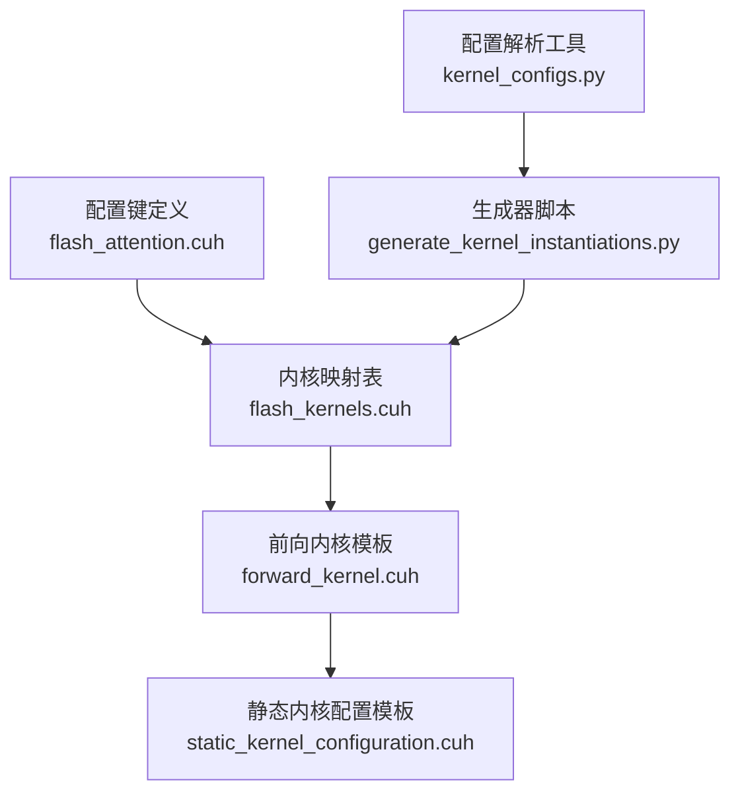
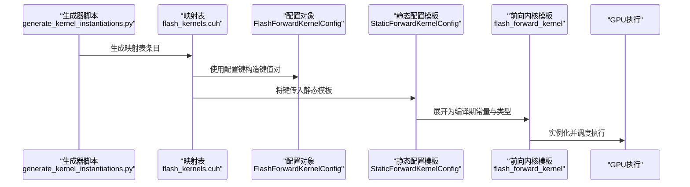
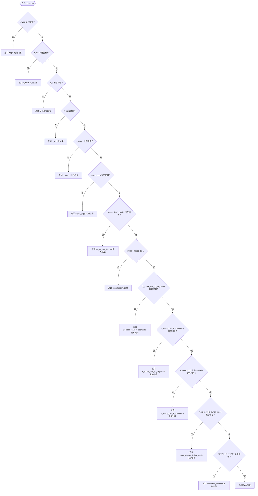
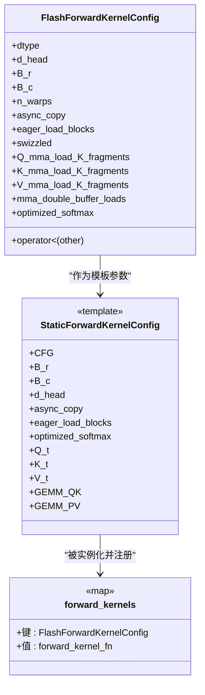
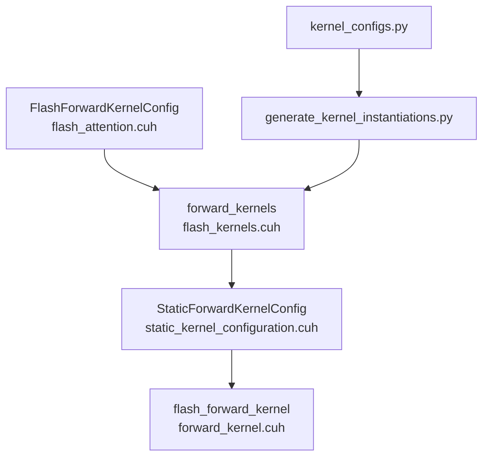

# 配置键设计与实现

<cite>
**本文引用的文件**
- [src/include/flash_kernels.cuh](file://src/include/flash_kernels.cuh)
- [src/include/flash_attention.cuh](file://src/include/flash_attention.cuh)
- [src/include/forward_kernel.cuh](file://src/include/forward_kernel.cuh)
- [src/include/static_kernel_configuration.cuh](file://src/include/static_kernel_configuration.cuh)
- [tools/build/generate_kernel_instantiations.py](file://tools/build/generate_kernel_instantiations.py)
- [py/flash_helpers/kernel_configs.py](file://py/flash_helpers/kernel_configs.py)
</cite>

## 目录
1. [引言](#引言)
2. [项目结构](#项目结构)
3. [核心组件](#核心组件)
4. [架构总览](#架构总览)
5. [详细组件分析](#详细组件分析)
6. [依赖关系分析](#依赖关系分析)
7. [性能考量](#性能考量)
8. [故障排查指南](#故障排查指南)
9. [结论](#结论)

## 引言
本文件聚焦于内核配置键的设计与实现，围绕 src/include/flash_kernels.cuh 中的 FlashForwardKernelConfig 结构体作为 std::map 的键，系统性解析其字段语义、比较与哈希特性、以及不同配置组合对性能的影响。文档同时结合生成器脚本与静态内核配置模板，说明配置键如何驱动内核实例化与选择。

## 项目结构
与配置键直接相关的核心文件包括：
- 配置键定义与比较逻辑：src/include/flash_attention.cuh
- 内核映射表与实例化入口：src/include/flash_kernels.cuh
- 前向内核模板与运行时行为：src/include/forward_kernel.cuh
- 静态内核配置模板（将配置键展开为编译期常量）：src/include/static_kernel_configuration.cuh
- 自动生成内核映射表的构建脚本：tools/build/generate_kernel_instantiations.py
- 配置解析与短形式描述：py/flash_helpers/kernel_configs.py

图表来源
- [src/include/flash_attention.cuh](file://src/include/flash_attention.cuh#L30-L109)
- [src/include/flash_kernels.cuh](file://src/include/flash_kernels.cuh#L14-L186)
- [src/include/forward_kernel.cuh](file://src/include/forward_kernel.cuh#L85-L205)
- [src/include/static_kernel_configuration.cuh](file://src/include/static_kernel_configuration.cuh#L104-L293)
- [tools/build/generate_kernel_instantiations.py](file://tools/build/generate_kernel_instantiations.py#L14-L53)
- [py/flash_helpers/kernel_configs.py](file://py/flash_helpers/kernel_configs.py#L106-L173)

章节来源
- [src/include/flash_kernels.cuh](file://src/include/flash_kernels.cuh#L14-L186)
- [src/include/flash_attention.cuh](file://src/include/flash_attention.cuh#L30-L109)
- [src/include/forward_kernel.cuh](file://src/include/forward_kernel.cuh#L85-L205)
- [src/include/static_kernel_configuration.cuh](file://src/include/static_kernel_configuration.cuh#L104-L293)
- [tools/build/generate_kernel_instantiations.py](file://tools/build/generate_kernel_instantiations.py#L14-L53)
- [py/flash_helpers/kernel_configs.py](file://py/flash_helpers/kernel_configs.py#L106-L173)

## 核心组件
- 配置键结构体 FlashForwardKernelConfig：包含数据类型、头维度、K/V块大小、Q块大小、warp数量、异步复制、预加载策略、swizzling启用状态、load_tiles参数、双缓冲、优化softmax等字段，并提供字典序比较运算符。
- 内核映射表 forward_kernels：以 FlashForwardKernelConfig 为键，以内核函数指针为值，用于在运行时按配置选择对应内核实例。
- 静态内核配置 StaticForwardKernelConfig：将配置键展开为编译期常量，决定内存布局、tile形状、加载策略等，从而影响内核实现细节。
- 生成器脚本 generate_kernel_instantiations.py：根据配置集合自动生成 flash_kernels.cuh 中的映射表条目。
- 配置解析工具 kernel_configs.py：提供短形式字符串到配置对象的解析，便于日志与调试输出。

章节来源
- [src/include/flash_attention.cuh](file://src/include/flash_attention.cuh#L30-L109)
- [src/include/flash_kernels.cuh](file://src/include/flash_kernels.cuh#L14-L186)
- [src/include/static_kernel_configuration.cuh](file://src/include/static_kernel_configuration.cuh#L104-L293)
- [tools/build/generate_kernel_instantiations.py](file://tools/build/generate_kernel_instantiations.py#L14-L53)
- [py/flash_helpers/kernel_configs.py](file://py/flash_helpers/kernel_configs.py#L106-L173)

## 架构总览
下图展示配置键从定义到内核选择的整体流程，以及与静态配置模板的关系。

图表来源
- [tools/build/generate_kernel_instantiations.py](file://tools/build/generate_kernel_instantiations.py#L14-L53)
- [src/include/flash_kernels.cuh](file://src/include/flash_kernels.cuh#L14-L186)
- [src/include/flash_attention.cuh](file://src/include/flash_attention.cuh#L30-L109)
- [src/include/static_kernel_configuration.cuh](file://src/include/static_kernel_configuration.cuh#L104-L293)
- [src/include/forward_kernel.cuh](file://src/include/forward_kernel.cuh#L85-L205)

## 详细组件分析

### 配置键字段与语义
- 数据类型 dtype：支持 torch::kFloat16 与 torch::kBFloat16，决定数值精度与寄存器/内存占用。
- 头维度 d_head：取值范围通常为 64 或 128，影响每个头的通道数与 tile 形状。
- K/V块大小 B_r/B_c：控制KV序列分块大小，影响共享内存占用与吞吐。
- Q块大小 B_r：与 d_head 共同决定Q的行分块大小。
- warp数量 n_warps：典型为 4；当 B_r=128 时可提升至 8。
- 异步复制 async_copy：是否使用 cp_async 进行异步加载。
- 预加载策略 eager_load_blocks：是否尽早加载 K/V 到共享内存。
- swizzled：是否启用共享内存swizzling以改善带宽利用。
- load_tiles 参数（Q/K/V）：以三元组形式表示 Q/K/V 的加载片段数，0 表示整块加载。
- 双缓冲 mma_double_buffer_loads：是否启用双缓冲加载以隐藏延迟。
- 优化softmax optimized_softmax：是否采用在线softmax优化路径。

章节来源
- [src/include/flash_attention.cuh](file://src/include/flash_attention.cuh#L30-L109)
- [src/include/flash_kernels.cuh](file://src/include/flash_kernels.cuh#L14-L186)
- [py/flash_helpers/kernel_configs.py](file://py/flash_helpers/kernel_configs.py#L106-L173)

### 比较与哈希特性
- 比较运算符 operator<：按字段顺序进行逐位比较，形成稳定的全序关系，满足 std::map 键的要求。
- 哈希特性：未显式提供 std::hash 特化，但通过 operator< 的稳定排序保证了键的唯一性与查找正确性。
- 字段顺序与稳定性：比较顺序严格遵循字段声明顺序，确保相同配置总是映射到同一键值。

图表来源
- [src/include/flash_attention.cuh](file://src/include/flash_attention.cuh#L67-L108)

章节来源
- [src/include/flash_attention.cuh](file://src/include/flash_attention.cuh#L67-L108)

### 映射表与内核选择
- 映射表 forward_kernels：以 FlashForwardKernelConfig 为键，值为内核函数指针，键的唯一性由 operator< 保证。
- 内核实例化：通过 StaticForwardKernelConfig 将配置键展开为编译期常量，从而在编译阶段确定内存布局、tile形状与加载策略。
- 运行时选择：根据输入张量的形状与数据类型，计算或查询对应的配置键，再在映射表中查找对应内核函数指针并调用。

图表来源
- [src/include/flash_attention.cuh](file://src/include/flash_attention.cuh#L30-L109)
- [src/include/static_kernel_configuration.cuh](file://src/include/static_kernel_configuration.cuh#L104-L293)
- [src/include/flash_kernels.cuh](file://src/include/flash_kernels.cuh#L14-L186)

章节来源
- [src/include/flash_kernels.cuh](file://src/include/flash_kernels.cuh#L14-L186)
- [src/include/static_kernel_configuration.cuh](file://src/include/static_kernel_configuration.cuh#L104-L293)

### 生成器与配置解析
- 生成器脚本 generate_kernel_instantiations.py：遍历配置集合，将每个配置转换为 C++ 结构体字面量与内核函数模板实例，写入 flash_kernels.cuh。
- 配置解析工具 kernel_configs.py：提供 short_form 与 to_cpp_struct 等方法，支持从字符串或符号名解析配置，便于日志与调试。

章节来源
- [tools/build/generate_kernel_instantiations.py](file://tools/build/generate_kernel_instantiations.py#L14-L53)
- [py/flash_helpers/kernel_configs.py](file://py/flash_helpers/kernel_configs.py#L106-L173)

## 依赖关系分析
- 配置键依赖关系：FlashForwardKernelConfig 依赖 torch::ScalarType 与若干整型/布尔字段；其比较逻辑依赖字段顺序。
- 映射表依赖关系：forward_kernels 依赖 FlashForwardKernelConfig 的可比较性；内核函数指针依赖前向内核模板。
- 静态配置模板依赖关系：StaticForwardKernelConfig 依赖 FlashForwardKernelConfig 的编译期常量属性，以及内存布局、GEMM、swizzling 等组件。
- 生成器与解析依赖关系：generate_kernel_instantiations.py 依赖 kernel_configs.py 提供的配置集合与格式化方法。

图表来源
- [src/include/flash_attention.cuh](file://src/include/flash_attention.cuh#L30-L109)
- [src/include/flash_kernels.cuh](file://src/include/flash_kernels.cuh#L14-L186)
- [src/include/static_kernel_configuration.cuh](file://src/include/static_kernel_configuration.cuh#L104-L293)
- [src/include/forward_kernel.cuh](file://src/include/forward_kernel.cuh#L85-L205)
- [tools/build/generate_kernel_instantiations.py](file://tools/build/generate_kernel_instantiations.py#L14-L53)
- [py/flash_helpers/kernel_configs.py](file://py/flash_helpers/kernel_configs.py#L106-L173)

章节来源
- [src/include/flash_attention.cuh](file://src/include/flash_attention.cuh#L30-L109)
- [src/include/flash_kernels.cuh](file://src/include/flash_kernels.cuh#L14-L186)
- [src/include/static_kernel_configuration.cuh](file://src/include/static_kernel_configuration.cuh#L104-L293)
- [src/include/forward_kernel.cuh](file://src/include/forward_kernel.cuh#L85-L205)
- [tools/build/generate_kernel_instantiations.py](file://tools/build/generate_kernel_instantiations.py#L14-L53)
- [py/flash_helpers/kernel_configs.py](file://py/flash_helpers/kernel_configs.py#L106-L173)

## 性能考量
- 数据类型选择：FP16 与 BF16 在吞吐与精度之间权衡，FP16 通常提供更高吞吐，BF16 更易训练稳定。
- 头维度 d_head：128 通常带来更高的并行度与更好的缓存局部性，但也增加共享内存占用。
- K/V/Q 块大小：较大的 B_r/B_c 可提升吞吐，但需考虑共享内存限制与寄存器压力。
- warp数量：n_warps=8 仅在 B_r=128 时适用，可进一步提升并行度。
- 异步复制与预加载：async_copy 与 eager_load_blocks 能够隐藏访存延迟，提高带宽利用率。
- swizzling：启用后可改善内存访问模式，减少 bank 冲突，提升带宽。
- load_tiles 参数：Q/K/V 的加载片段数直接影响寄存器与共享内存占用，0 表示整块加载，适合大块场景；非零可降低寄存器压力但可能增加访存次数。
- 双缓冲：mma_double_buffer_loads 可隐藏加载延迟，提升流水线效率。
- 优化softmax：optimized_softmax 路径减少中间变量与同步，降低寄存器与同步开销。

章节来源
- [src/include/flash_attention.cuh](file://src/include/flash_attention.cuh#L30-L109)
- [src/include/static_kernel_configuration.cuh](file://src/include/static_kernel_configuration.cuh#L104-L293)
- [src/include/forward_kernel.cuh](file://src/include/forward_kernel.cuh#L85-L205)

## 故障排查指南
- 键冲突或查找失败：检查配置键的字段顺序与值是否一致，确保 operator< 的比较逻辑未被修改。
- 内存不足：关注 smem_bytes 估算与 num_ctas_per_sm 的限制，必要时减小 d_head 或块大小。
- 访存瓶颈：确认 swizzled 与 load_tiles 设置合理，避免过多 bank 冲突或寄存器溢出。
- 生成错误：检查 generate_kernel_instantiations.py 输出是否包含目标配置，核对 kernel_configs.py 的短形式与解析逻辑。

章节来源
- [src/include/flash_attention.cuh](file://src/include/flash_attention.cuh#L54-L66)
- [py/flash_helpers/kernel_configs.py](file://py/flash_helpers/kernel_configs.py#L106-L173)
- [tools/build/generate_kernel_instantiations.py](file://tools/build/generate_kernel_instantiations.py#L14-L53)

## 结论
FlashForwardKernelConfig 作为 std::map 的键，通过严格的字段顺序比较实现了稳定的键值映射。其丰富的字段覆盖了数据类型、块大小、加载策略、内存布局与优化路径等关键维度，既能满足运行时动态选择内核的需求，又能在静态模板中展开为编译期常量，从而在性能与可维护性之间取得平衡。通过生成器脚本与配置解析工具，配置键的设计与实例化流程清晰可控，便于扩展与调试。