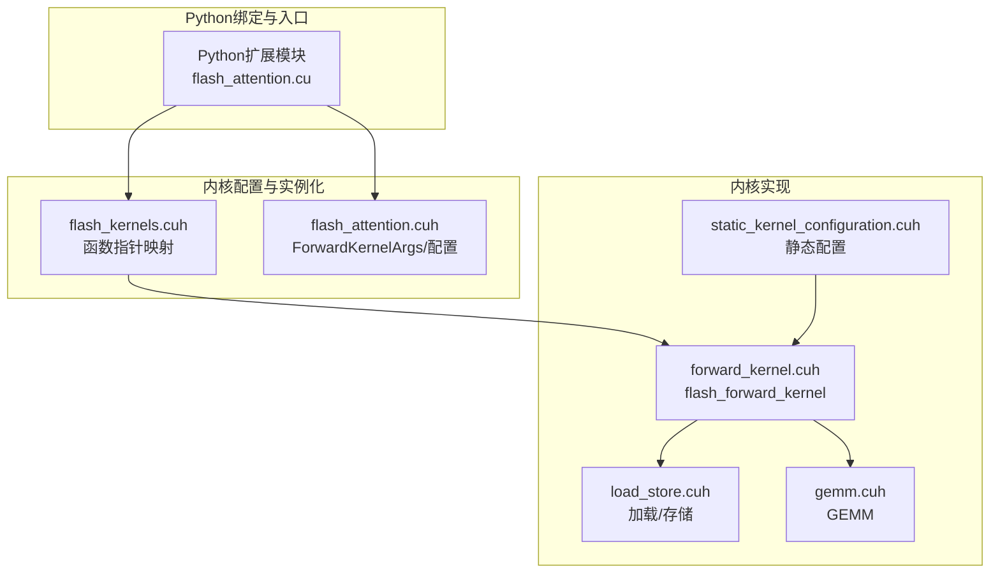
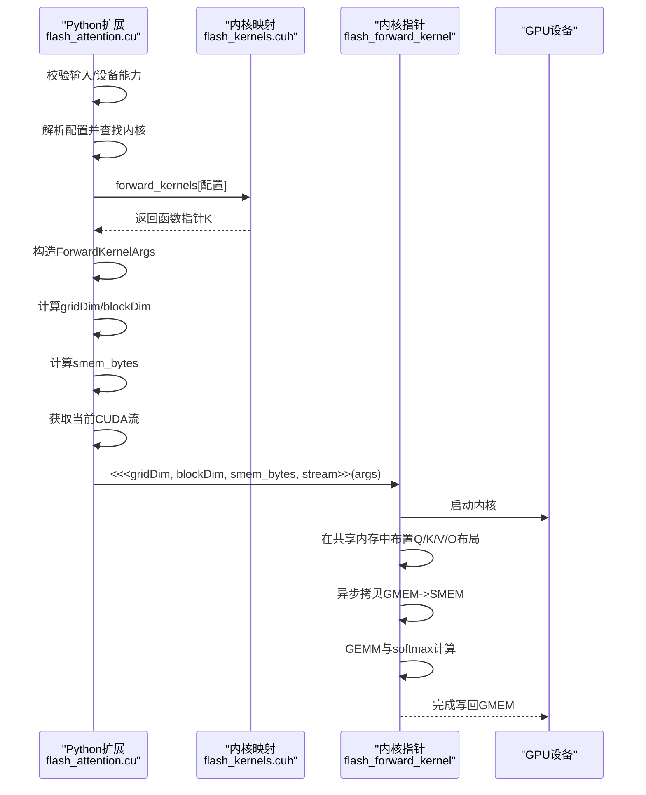
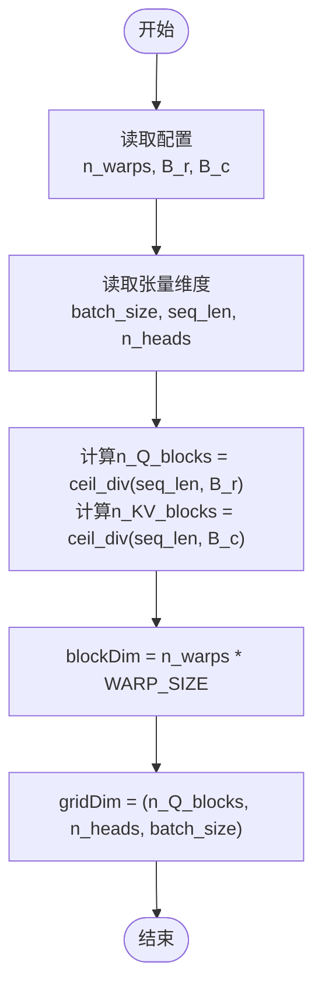
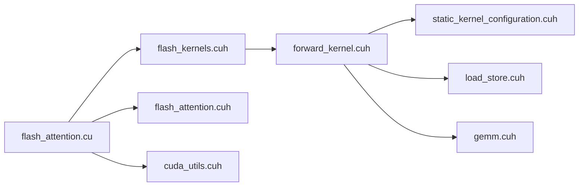

# CUDA内核启动与执行

<cite>
**本文引用的文件列表**
- [src/flash_attention.cu](file://src/flash_attention.cu)
- [src/include/flash_attention.cuh](file://src/include/flash_attention.cuh)
- [src/include/flash_kernels.cuh](file://src/include/flash_kernels.cuh)
- [src/include/forward_kernel.cuh](file://src/include/forward_kernel.cuh)
- [src/include/static_kernel_configuration.cuh](file://src/include/static_kernel_configuration.cuh)
- [src/include/cuda_utils.cuh](file://src/include/cuda_utils.cuh)
- [src/include/load_store.cuh](file://src/include/load_store.cuh)
- [src/include/gemm.cuh](file://src/include/gemm.cuh)
</cite>

## 目录
1. [引言](#引言)
2. [项目结构](#项目结构)
3. [核心组件](#核心组件)
4. [架构总览](#架构总览)
5. [详细组件分析](#详细组件分析)
6. [依赖关系分析](#依赖关系分析)
7. [性能考量](#性能考量)
8. [故障排查指南](#故障排查指南)
9. [结论](#结论)

## 引言
本文件围绕“从函数指针获取到实际内核调用”的完整流程进行系统化梳理，重点覆盖以下主题：
- 如何将ForwardKernelArgs结构体作为单一参数传递给flash_forward_kernel函数指针；
- gridDim与blockDim如何依据输入张量维度计算；
- 动态共享内存smem_bytes的设置机制及其对内核执行的影响；
- CUDA三重尖括号语法在函数指针调用中的应用；
- 当前CUDA流的传递方式与异步执行特性。

## 项目结构
该仓库采用“内核实现 + 配置选择 + Python绑定”的分层组织方式：
- 前向内核主体：位于include目录下的forward_kernel.cuh，封装了flash_forward_kernel模板内核；
- 内核配置与实例化：位于include目录下的flash_kernels.cuh，提供运行时选择的函数指针映射；
- 前向入口与启动参数构造：位于src/flash_attention.cu，负责参数校验、gridDim/blockDim计算、动态共享内存设置、流传递与异步执行；
- 关键数据结构：ForwardKernelArgs（内核参数）、FlashForwardKernelConfig（内核配置）；
- 辅助工具：cuda_utils.cuh（设备属性、宏等）；
- 计算与加载存储：load_store.cuh、gemm.cuh等。



图表来源
- [src/flash_attention.cu](file://src/flash_attention.cu#L1-L150)
- [src/include/flash_kernels.cuh](file://src/include/flash_kernels.cuh#L1-L187)
- [src/include/flash_attention.cuh](file://src/include/flash_attention.cuh#L1-L110)
- [src/include/forward_kernel.cuh](file://src/include/forward_kernel.cuh#L1-L207)
- [src/include/static_kernel_configuration.cuh](file://src/include/static_kernel_configuration.cuh#L1-L294)
- [src/include/load_store.cuh](file://src/include/load_store.cuh#L1-L356)
- [src/include/gemm.cuh](file://src/include/gemm.cuh#L1-L126)

章节来源
- [src/flash_attention.cu](file://src/flash_attention.cu#L1-L150)
- [src/include/flash_kernels.cuh](file://src/include/flash_kernels.cuh#L1-L187)

## 核心组件
- ForwardKernelArgs：封装内核所需的所有输入/输出指针与步幅信息，以及序列长度、头数、块数等控制信息。
- FlashForwardKernelConfig：描述内核配置（数据类型、块尺寸、线程数、是否异步拷贝、是否预加载、是否swizzle、mma片段数、双缓冲等），并提供smem_bytes估算。
- 函数指针映射：flash_kernels.cuh将具体配置映射为已实例化的flash_forward_kernel模板特化函数指针。
- flash_forward_kernel：__global__模板内核，接收__grid_constant__ ForwardKernelArgs，内部完成共享内存布局、异步拷贝、GEMM与softmax等计算。

章节来源
- [src/include/flash_attention.cuh](file://src/include/flash_attention.cuh#L1-L110)
- [src/include/flash_kernels.cuh](file://src/include/flash_kernels.cuh#L1-L187)
- [src/include/forward_kernel.cuh](file://src/include/forward_kernel.cuh#L1-L207)

## 架构总览
下图展示了从Python扩展入口到内核执行的关键调用链路与数据流。



图表来源
- [src/flash_attention.cu](file://src/flash_attention.cu#L1-L150)
- [src/include/flash_kernels.cuh](file://src/include/flash_kernels.cuh#L1-L187)
- [src/include/forward_kernel.cuh](file://src/include/forward_kernel.cuh#L1-L207)

## 详细组件分析

### 组件A：函数指针获取与内核选择
- 运行时配置到函数指针的映射由flash_kernels.cuh维护，键为FlashForwardKernelConfig，值为void(*)(const ForwardKernelArgs)类型的函数指针。
- 该映射在编译期由自动生成脚本填充，包含多种配置组合（如dtype、B_r/B_c、n_warps、async_copy、eager_load_blocks、swizzled、mma_load_K_fragments、mma_double_buffer_loads、optimized_softmax等）。
- 入口函数会先将Python侧配置转换为C++配置对象，再在映射表中查找对应内核指针。

```mermaid
classDiagram
class FlashForwardKernelConfig {
+dtype
+d_head
+B_r
+B_c
+n_warps
+async_copy
+eager_load_blocks
+swizzled
+Q_mma_load_K_fragments
+K_mma_load_K_fragments
+V_mma_load_K_fragments
+mma_double_buffer_loads
+optimized_softmax
+smem_bytes(elem_size)
+num_ctas_per_sm(max_smem_bytes)
}
class forward_kernels_map {
+map<FlashForwardKernelConfig, void(*)(const ForwardKernelArgs)>
}
FlashForwardKernelConfig --> forward_kernels_map : "键"
```

图表来源
- [src/include/flash_kernels.cuh](file://src/include/flash_kernels.cuh#L1-L187)
- [src/include/flash_attention.cuh](file://src/include/flash_attention.cuh#L1-L110)

章节来源
- [src/include/flash_kernels.cuh](file://src/include/flash_kernels.cuh#L1-L187)
- [src/flash_attention.cu](file://src/flash_attention.cu#L1-L150)

### 组件B：ForwardKernelArgs参数传递与内核签名
- 内核签名使用__grid_constant__限定符接收ForwardKernelArgs，确保参数以只读方式在全局常量空间传递，避免重复拷贝。
- ForwardKernelArgs包含：
  - 指针：Q/K/V/O
  - 步幅：batch_stride、seq_stride、head_stride
  - 控制信息：seq_len、n_heads、n_Q_blocks、n_KV_blocks
- 内核内部通过这些字段定位每个CTA（blockIdx.z, blockIdx.y, blockIdx.x）对应的样本、头与Q序列块，进而计算gmem偏移与smem布局。

章节来源
- [src/include/forward_kernel.cuh](file://src/include/forward_kernel.cuh#L1-L207)
- [src/include/flash_attention.cuh](file://src/include/flash_attention.cuh#L1-L110)

### 组件C：gridDim与blockDim的计算
- blockDim：基于配置中的n_warps与WARP_SIZE计算，确保每CTA的线程数满足目标硬件要求。
- gridDim：按(batch_size, n_heads, n_Q_blocks)组织，其中n_Q_blocks = ceil_div(seq_len, B_r)，n_KV_blocks = ceil_div(seq_len, B_c)。
- 这种三维划分使得每个CTA独立处理一个样本、一个头、一个Q序列块，便于并行化与负载均衡。



图表来源
- [src/flash_attention.cu](file://src/flash_attention.cu#L1-L150)
- [src/include/cuda_utils.cuh](file://src/include/cuda_utils.cuh#L1-L49)

章节来源
- [src/flash_attention.cu](file://src/flash_attention.cu#L1-L150)
- [src/include/cuda_utils.cuh](file://src/include/cuda_utils.cuh#L1-L49)

### 组件D：动态共享内存smem_bytes设置机制
- smem_bytes由配置对象的smem_bytes(elem_size)方法计算，elem_size默认2字节（半精度/脑浮点）。
- smem_bytes表达式为(B_r + B_c * 2) * d_head * elem_size，用于估算Q/K/V在共享内存中的占用，确保满足内核需求。
- 若内核使用的动态共享内存超过设备限制，入口模块会在初始化时通过cudaFuncSetAttribute设置最大动态共享内存大小，避免后续启动失败。

章节来源
- [src/include/flash_attention.cuh](file://src/include/flash_attention.cuh#L1-L110)
- [src/flash_attention.cu](file://src/flash_attention.cu#L1-L150)

### 组件E：CUDA三重尖括号语法与函数指针调用
- 三重尖括号<<<>>>用于在主机端发起CUDA内核调用，语法形式为：kernel<<<gridDim, blockDim, smem_bytes, stream>>>(args)。
- 在本项目中：
  - kernel为从映射表forward_kernels取出的函数指针；
  - gridDim、blockDim来自上述计算；
  - smem_bytes来自配置的smem_bytes；
  - stream来自当前CUDA流（at::cuda::getCurrentCUDAStream().stream()）。

章节来源
- [src/flash_attention.cu](file://src/flash_attention.cu#L1-L150)
- [src/include/flash_kernels.cuh](file://src/include/flash_kernels.cuh#L1-L187)

### 组件F：当前CUDA流的传递与异步执行
- 流传递：通过at::cuda::getCurrentCUDAStream().stream()获取当前流句柄，并将其作为内核启动的第四个参数传入<<<>>>。
- 异步执行：内核启动后立即返回，不阻塞CPU；若需要测量时间，可使用cudaEvent记录start/stop事件并在流上同步。

章节来源
- [src/flash_attention.cu](file://src/flash_attention.cu#L1-L150)

### 组件G：内核内部执行要点（与启动流程相关）
- 共享内存布局：内核内部声明extern __shared__ char smem[]，并按Q/K/V/O顺序在smem中分配区域，结合静态配置确定各区域起始地址。
- 异步拷贝：使用cp_async与cp_async_commit进行GMEM->SMEM异步传输，配合__syncthreads保证一致性。
- GEMM与softmax：通过GEMM模板与softmax逻辑完成注意力计算，最终将累加结果转换为目标精度并写回GMEM。

章节来源
- [src/include/forward_kernel.cuh](file://src/include/forward_kernel.cuh#L1-L207)
- [src/include/load_store.cuh](file://src/include/load_store.cuh#L1-L356)
- [src/include/gemm.cuh](file://src/include/gemm.cuh#L1-L126)
- [src/include/static_kernel_configuration.cuh](file://src/include/static_kernel_configuration.cuh#L1-L294)

## 依赖关系分析
- 入口函数依赖：
  - 配置解析与映射：flash_kernels.cuh
  - 参数结构：flash_attention.cuh
  - 设备能力与宏：cuda_utils.cuh
- 内核实现依赖：
  - 静态配置：static_kernel_configuration.cuh
  - 加载/存储：load_store.cuh
  - GEMM：gemm.cuh



图表来源
- [src/flash_attention.cu](file://src/flash_attention.cu#L1-L150)
- [src/include/flash_kernels.cuh](file://src/include/flash_kernels.cuh#L1-L187)
- [src/include/flash_attention.cuh](file://src/include/flash_attention.cuh#L1-L110)
- [src/include/forward_kernel.cuh](file://src/include/forward_kernel.cuh#L1-L207)
- [src/include/static_kernel_configuration.cuh](file://src/include/static_kernel_configuration.cuh#L1-L294)
- [src/include/load_store.cuh](file://src/include/load_store.cuh#L1-L356)
- [src/include/gemm.cuh](file://src/include/gemm.cuh#L1-L126)
- [src/include/cuda_utils.cuh](file://src/include/cuda_utils.cuh#L1-L49)

章节来源
- [src/flash_attention.cu](file://src/flash_attention.cu#L1-L150)
- [src/include/flash_kernels.cuh](file://src/include/flash_kernels.cuh#L1-L187)
- [src/include/flash_attention.cuh](file://src/include/flash_attention.cuh#L1-L110)
- [src/include/forward_kernel.cuh](file://src/include/forward_kernel.cuh#L1-L207)
- [src/include/static_kernel_configuration.cuh](file://src/include/static_kernel_configuration.cuh#L1-L294)
- [src/include/load_store.cuh](file://src/include/load_store.cuh#L1-L356)
- [src/include/gemm.cuh](file://src/include/gemm.cuh#L1-L126)
- [src/include/cuda_utils.cuh](file://src/include/cuda_utils.cuh#L1-L49)

## 性能考量
- 动态共享内存上限：当内核使用的动态共享内存超过设备默认上限时，需在模块初始化阶段通过cudaFuncSetAttribute设置最大动态共享内存大小，避免启动失败。
- 线程块规模与寄存器压力：n_warps与B_r/B_c直接影响寄存器与共享内存占用，需结合num_ctas_per_sm策略平衡并发度与资源占用。
- 异步拷贝与同步屏障：cp_async与__syncthreads的配合可提升带宽利用率，但需注意同步时机以避免竞争。
- swizzle与访存模式：静态配置中的swizzle与布局设计有助于提高全局访存的吞吐，应与内核配置保持一致。

[本节为通用指导，无需列出具体文件来源]

## 故障排查指南
- 设备能力检查：入口函数会检查计算能力是否满足要求（SM_80及以上），否则抛出错误。
- 数据类型与形状校验：输入张量必须为fp16或bf16，且Q/K/V形状一致；输出张量dtype需与输入一致。
- 配置匹配：内核配置dtype需与输入dtype一致；B_r/B_c需整除seq_len。
- 动态共享内存不足：若内核使用的动态共享内存超过设备限制，需在初始化时设置最大动态共享内存大小。
- 流同步与事件：若需要精确计时，应在同一流上记录start/stop事件并同步。

章节来源
- [src/flash_attention.cu](file://src/flash_attention.cu#L1-L150)
- [src/include/flash_kernels.cuh](file://src/include/flash_kernels.cuh#L1-L187)

## 结论
本文从函数指针获取、参数构造、网格与块维度计算、动态共享内存设置、三重尖括号语法调用、流传递与异步执行六个方面，系统梳理了从Python入口到CUDA内核执行的完整流程。通过ForwardKernelArgs的统一传递、静态配置驱动的内核实例化、以及合理的资源与同步策略，实现了高性能的注意力计算内核启动与执行。