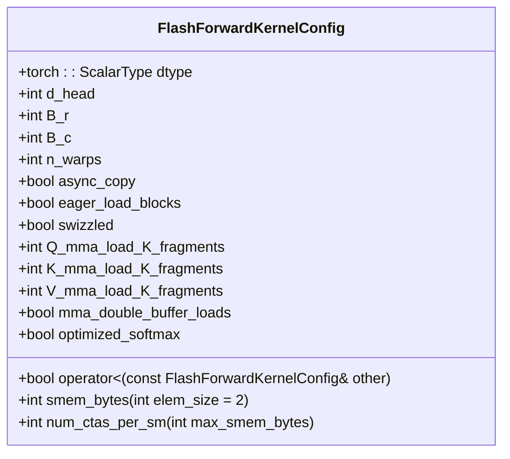
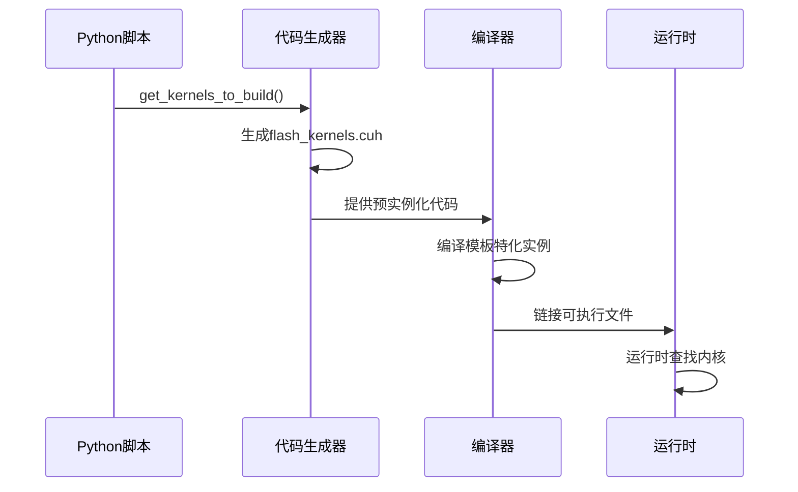
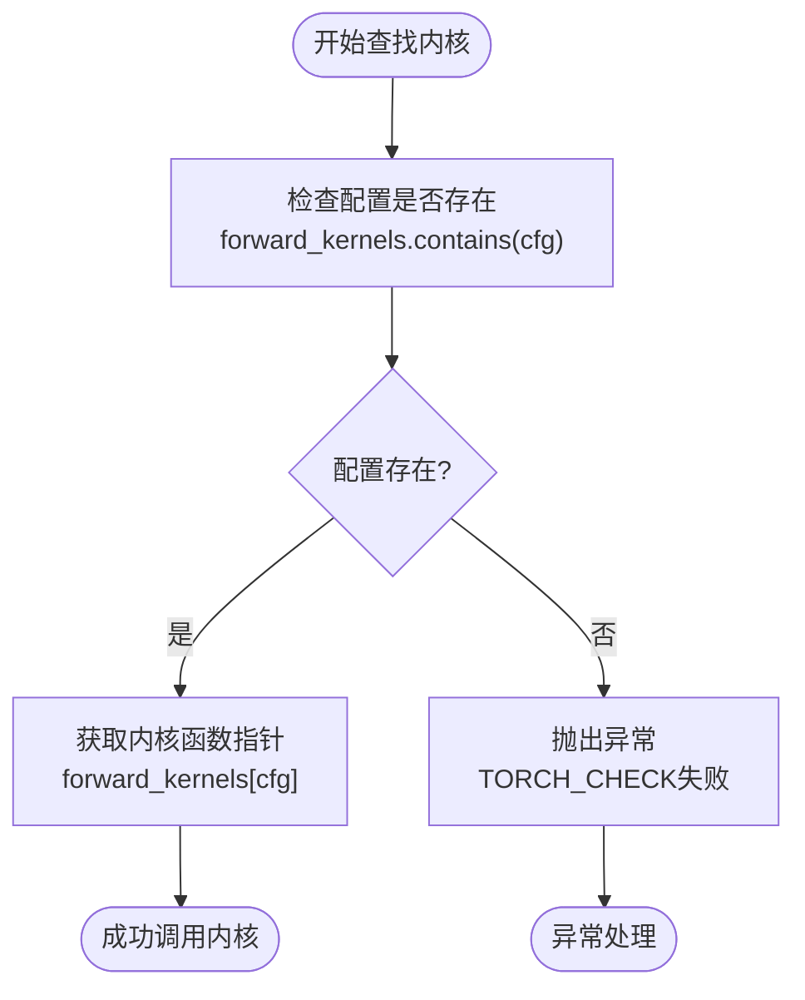

# 内核映射表查找机制

<cite>
**本文档引用的文件**   
- [flash_attention.cuh](file://previous_kernels/src_1-7/include/flash_attention.cuh)
- [flash_kernels.cuh](file://previous_kernels/src_1-7/include/flash_kernels.cuh)
- [flash_attention.cu](file://previous_kernels/src_1-7/flash_attention.cu)
- [static_kernel_configuration.cuh](file://previous_kernels/src_1-7/include/static_kernel_configuration.cuh)
- [forward_kernel.cuh](file://previous_kernels/src_1-7/include/forward_kernel.cuh)
</cite>

## 目录
1. [引言](#引言)
2. [内核映射表结构设计](#内核映射表结构设计)
3. [复合键的可哈希性与可比较性实现](#复合键的可哈希性与可比较性实现)
4. [编译时预实例化机制](#编译时预实例化机制)
5. [查找操作的时间复杂度与实际开销](#查找操作的时间复杂度与实际开销)
6. [异常处理路径](#异常处理路径)
7. [设计优势分析](#设计优势分析)

## 引言
本文档深入分析FlashAttention实现中的内核映射表查找机制，重点探讨`forward_kernels` std::map容器的结构设计和查找性能。该机制通过编译时预实例化内核配置-函数指针映射表，避免了运行时模板实例化的高昂成本，同时保持了配置的灵活性。文档将详细解释`FlashForwardKernelConfig`作为复合键的可比较性实现，以及查找操作的时间复杂度与异常处理路径。

## 内核映射表结构设计
内核映射表`forward_kernels`是一个`std::map`容器，其键类型为`FlashForwardKernelConfig`，值类型为函数指针`forward_kernel_fn`。该映射表在编译时通过静态模板特化生成，存储了预定义的内核配置与对应内核函数的映射关系。

映射表的设计采用了`std::map`而非`std::unordered_map`，因为`FlashForwardKernelConfig`结构体实现了`operator<`比较操作符，但未提供哈希函数。`std::map`基于红黑树实现，保证了O(log n)的查找时间复杂度，同时保持了键的有序性。

**Section sources**
- [flash_kernels.cuh](file://previous_kernels/src_1-7/include/flash_kernels.cuh#L14-L186)
- [flash_attention.cuh](file://previous_kernels/src_1-7/include/flash_attention.cuh#L33-L109)

## 复合键的可哈希性与可比较性实现
`FlashForwardKernelConfig`结构体作为复合键，其实现了`operator<`比较操作符以支持`std::map`的有序存储。该结构体包含多个配置参数，包括数据类型、头维度、块大小、warp数量、异步复制标志、预加载标志、混洗标志、MMA加载片段数、双缓冲加载标志和优化softmax标志。

比较操作符按特定顺序逐个比较这些参数，确保了键的全序关系。这种设计使得不同的配置组合能够被唯一地排序和查找。虽然该结构体未实现哈希函数，但其有序比较特性完美适配了`std::map`的需求。

**Diagram sources **
- [flash_attention.cuh](file://previous_kernels/src_1-7/include/flash_attention.cuh#L33-L109)

**Section sources**
- [flash_attention.cuh](file://previous_kernels/src_1-7/include/flash_attention.cuh#L33-L109)

## 编译时预实例化机制
内核映射表通过编译时预实例化机制生成，避免了运行时模板实例化的高昂成本。这一过程由`generate_kernel_instantiations.py`脚本自动化完成，该脚本遍历预定义的内核配置集合，为每个配置生成相应的模板特化实例。

每个映射表条目都包含一个`FlashForwardKernelConfig`实例和一个指向特化内核函数的指针。内核函数通过`StaticForwardKernelConfig<FlashForwardKernelConfig{...}>`模板特化生成，其中配置参数在编译时确定。这种设计确保了所有可能的配置组合都在编译时实例化，运行时只需进行简单的查找操作。

**Diagram sources **
- [generate_kernel_instantiations.py](file://tools/build/generate_kernel_instantiations.py#L1-L56)
- [flash_kernels.cuh](file://previous_kernels/src_1-7/include/flash_kernels.cuh#L14-L186)

**Section sources**
- [generate_kernel_instantiations.py](file://tools/build/generate_kernel_instantiations.py#L1-L56)
- [flash_kernels.cuh](file://previous_kernels/src_1-7/include/flash_kernels.cuh#L14-L186)

## 查找操作的时间复杂度与实际开销
`forward_kernels`映射表的查找操作具有O(log n)的时间复杂度，其中n是预定义配置的数量。`contains()`方法用于检查配置是否存在，`operator[]`用于获取对应的内核函数指针。

实际开销主要由红黑树的查找路径决定。由于配置数量有限（约50个），查找深度很小，实际性能接近常数时间。与运行时模板实例化相比，这种设计避免了编译器生成和优化模板代码的开销，显著提高了运行时性能。

查找操作的典型使用模式是先调用`contains()`检查配置是否存在，然后使用`operator[]`获取函数指针。这种两步操作虽然增加了少量开销，但提供了更好的错误处理能力。

**Section sources**
- [flash_kernels.cuh](file://previous_kernels/src_1-7/include/flash_kernels.cuh#L14-L186)
- [flash_attention.cu](file://previous_kernels/src_1-7/flash_attention.cu#L59-L61)

## 异常处理路径
当查找失败时，系统通过`TORCH_CHECK`宏进行异常处理。在调用`forward_kernels[cfg]`之前，代码会先检查`forward_kernels.contains(cfg)`，确保配置存在。如果配置不存在，`TORCH_CHECK`会抛出运行时错误，提示用户使用了不支持的配置组合。

这种异常处理路径设计既保证了程序的健壮性，又提供了清晰的错误信息。通过在访问映射表前进行存在性检查，避免了`std::map::operator[]`在键不存在时插入默认值的行为，确保了错误的及时发现和处理。

**Diagram sources **
- [flash_attention.cu](file://previous_kernels/src_1-7/flash_attention.cu#L59-L61)

**Section sources**
- [flash_attention.cu](file://previous_kernels/src_1-7/flash_attention.cu#L59-L61)

## 设计优势分析
这种内核映射表设计在保持灵活性的同时避免了运行时模板实例化的高昂成本。通过编译时预实例化，所有可能的配置组合都被提前生成和优化，运行时只需进行高效的查找操作。

设计的主要优势包括：1) 避免了运行时模板实例化的编译开销；2) 保证了查找操作的可预测性能；3) 提供了清晰的错误处理机制；4) 支持灵活的配置组合。这种权衡在高性能计算场景中尤为重要，确保了内核调用的低延迟和高吞吐量。

**Section sources**
- [flash_kernels.cuh](file://previous_kernels/src_1-7/include/flash_kernels.cuh#L14-L186)
- [flash_attention.cu](file://previous_kernels/src_1-7/flash_attention.cu#L59-L61)