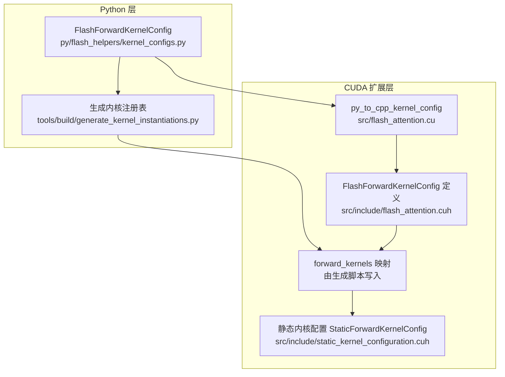
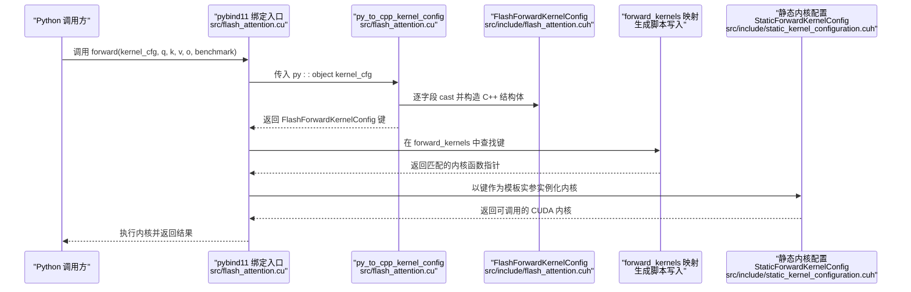
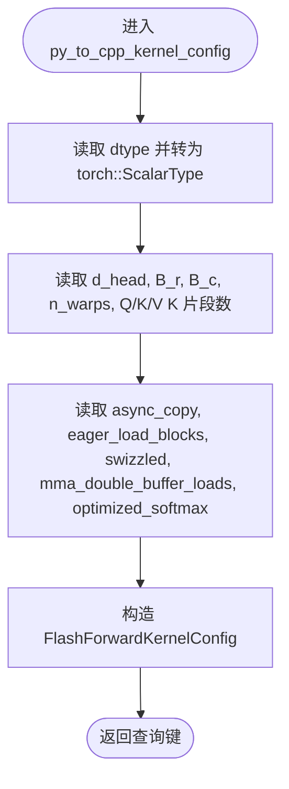
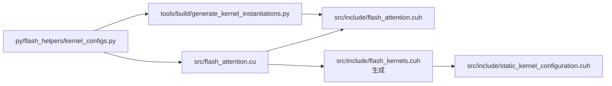

# 参数解析与配置键生成

<cite>
**本文引用的文件**
- [src/flash_attention.cu](file://src/flash_attention.cu)
- [src/include/flash_attention.cuh](file://src/include/flash_attention.cuh)
- [src/include/static_kernel_configuration.cuh](file://src/include/static_kernel_configuration.cuh)
- [tools/build/generate_kernel_instantiations.py](file://tools/build/generate_kernel_instantiations.py)
- [py/flash_helpers/kernel_configs.py](file://py/flash_helpers/kernel_configs.py)
- [setup.py](file://setup.py)
</cite>

## 目录
1. [引言](#引言)
2. [项目结构](#项目结构)
3. [核心组件](#核心组件)
4. [架构总览](#架构总览)
5. [详细组件分析](#详细组件分析)
6. [依赖关系分析](#依赖关系分析)
7. [性能考量](#性能考量)
8. [故障排查指南](#故障排查指南)
9. [结论](#结论)

## 引言
本文件聚焦于“运行时内核选择中的参数解析机制”，系统阐述如何将 Python 端传入的 kernel_cfg 对象转换为 C++ 端的 FlashForwardKernelConfig 查询键，从而驱动内核选择与实例化。重点覆盖：
- py_to_cpp_kernel_config 函数如何通过 pybind11 接口从 PyTorch 张量属性中提取配置字段；
- 将 Python 字段（dtype、d_head、B_r、B_c、n_warps、async_copy、eager_load_blocks、swizzled、Q/K/V 的 K 片段数、双缓冲、优化 softmax）映射到 C++ 结构体字段；
- 该设计如何保证跨语言调用的一致性与类型安全；
- 以序列图和流程图展示从 Python 对象到 C++ 配置键的完整转换流程。

## 项目结构
本仓库采用“Python 工具 + CUDA 扩展”的分层组织：
- Python 层：提供 kernel 配置数据类与工具函数，负责配置生成、解析与自动调优；
- CUDA 扩展层：通过 pybind11 暴露 Python 调用入口，完成 Python -> C++ 配置转换与内核选择；
- 构建脚本：自动生成内核实例化注册表，确保查询键与内核实现一一对应。

图表来源
- [py/flash_helpers/kernel_configs.py](file://py/flash_helpers/kernel_configs.py#L106-L164)
- [tools/build/generate_kernel_instantiations.py](file://tools/build/generate_kernel_instantiations.py#L13-L56)
- [src/flash_attention.cu](file://src/flash_attention.cu#L16-L32)
- [src/include/flash_attention.cuh](file://src/include/flash_attention.cuh#L30-L109)
- [src/include/static_kernel_configuration.cuh](file://src/include/static_kernel_configuration.cuh#L104-L141)

章节来源
- [setup.py](file://setup.py#L45-L58)
- [py/flash_helpers/kernel_configs.py](file://py/flash_helpers/kernel_configs.py#L106-L164)
- [tools/build/generate_kernel_instantiations.py](file://tools/build/generate_kernel_instantiations.py#L13-L56)
- [src/flash_attention.cu](file://src/flash_attention.cu#L16-L32)
- [src/include/flash_attention.cuh](file://src/include/flash_attention.cuh#L30-L109)
- [src/include/static_kernel_configuration.cuh](file://src/include/static_kernel_configuration.cuh#L104-L141)

## 核心组件
- Python 配置数据类：包含 dtype、d_head、B_r、B_c、n_warps、async_copy、eager_load_blocks、swizzled、Q/K/V 的 K 片段数、双缓冲、优化 softmax 等字段；提供 to_cpp_struct 方法输出 C++ 结构体字面量字符串，供构建阶段写入注册表。
- C++ 配置结构体：定义 FlashForwardKernelConfig，包含与 Python 数据类对应的字段；重载比较运算符用于 map 查找与排序；提供 smem_bytes、num_ctas_per_sm 等辅助计算。
- 运行时转换函数：py_to_cpp_kernel_config 使用 pybind11 从 Python 对象读取属性并转换为 C++ 结构体，作为查询键参与 forward_kernels 映射查找。
- 内核注册表：由生成脚本基于 Python 自动调优配置集生成，将 FlashForwardKernelConfig 与具体模板实例化内核函数指针绑定。
- 静态内核配置：StaticForwardKernelConfig 以 FlashForwardKernelConfig 为模板参数，编译期派生内存布局、tile 形状、swizzle 策略等。

章节来源
- [py/flash_helpers/kernel_configs.py](file://py/flash_helpers/kernel_configs.py#L106-L164)
- [src/include/flash_attention.cuh](file://src/include/flash_attention.cuh#L30-L109)
- [src/flash_attention.cu](file://src/flash_attention.cu#L16-L32)
- [tools/build/generate_kernel_instantiations.py](file://tools/build/generate_kernel_instantiations.py#L13-L56)
- [src/include/static_kernel_configuration.cuh](file://src/include/static_kernel_configuration.cuh#L104-L141)

## 架构总览
下图展示了从 Python 调用到 CUDA 内核执行的关键路径，突出参数解析与配置键生成环节。

图表来源
- [src/flash_attention.cu](file://src/flash_attention.cu#L16-L32)
- [src/include/flash_attention.cuh](file://src/include/flash_attention.cuh#L30-L109)
- [tools/build/generate_kernel_instantiations.py](file://tools/build/generate_kernel_instantiations.py#L13-L56)
- [src/include/static_kernel_configuration.cuh](file://src/include/static_kernel_configuration.cuh#L104-L141)

## 详细组件分析

### Python 配置数据类与 C++ 结构体字段映射
- Python 字段到 C++ 字段的直接映射：
  - dtype ↔ dtype（PyTorch ScalarType）
  - d_head ↔ d_head
  - B_r ↔ B_r
  - B_c ↔ B_c
  - n_warps ↔ n_warps
  - async_copy ↔ async_copy
  - eager_load_blocks ↔ eager_load_blocks
  - swizzled ↔ swizzled
  - Q/K/V 的 K 片段数 ↔ Q/K/V 的 K 片段字段（注意：Python 数据类字段名含“tiles”，C++ 字段名为“fragments”）
  - mma_double_buffer_loads ↔ mma_double_buffer_loads
  - optimized_softmax ↔ optimized_softmax
- Python 数据类提供 to_cpp_struct 方法，输出与 C++ 结构体字面量一致的字符串，供构建阶段写入注册表。

章节来源
- [py/flash_helpers/kernel_configs.py](file://py/flash_helpers/kernel_configs.py#L106-L164)
- [src/include/flash_attention.cuh](file://src/include/flash_attention.cuh#L30-L109)

### py_to_cpp_kernel_config 函数：跨语言参数解析
- 功能：接收 py::object 类型的 kernel_cfg，逐字段读取并转换为 FlashForwardKernelConfig。
- 关键点：
  - 使用 py::cast<T>() 对每个字段进行类型转换；
  - dtype 通过 Python 端的 to_torch_dtype() 获取 PyTorch ScalarType；
  - 其余字段按整型或布尔型转换；
  - 返回值即为可用于 map 查找的查询键。

图表来源
- [src/flash_attention.cu](file://src/flash_attention.cu#L16-L32)

章节来源
- [src/flash_attention.cu](file://src/flash_attention.cu#L16-L32)

### 内核注册表与查询键一致性
- 生成脚本会遍历 Python 自动调优配置集合，调用 FlashForwardKernelConfig.to_cpp_struct 输出 C++ 结构体字面量，并将其写入 flash_kernels.cuh 的 std::map。
- 运行时，flash_attention_forward 以 py_to_cpp_kernel_config 生成的键在 forward_kernels 中查找对应内核函数指针，若不存在则报错。
- 这种“构建期生成 + 运行时查找”的模式确保了：
  - 查询键与内核实现一一对应；
  - Python 与 C++ 配置字段保持严格一致；
  - 避免运行时拼写错误或字段缺失导致的链接失败。

章节来源
- [tools/build/generate_kernel_instantiations.py](file://tools/build/generate_kernel_instantiations.py#L13-L56)
- [src/flash_attention.cu](file://src/flash_attention.cu#L58-L66)

### 静态内核配置与查询键的关系
- StaticForwardKernelConfig 以 FlashForwardKernelConfig 为模板参数，编译期派生：
  - 数据类型 value_t（根据 dtype 选择 half 或 bfloat16）；
  - 线程/块形状、tile 数量、共享内存布局、swizzle 策略等；
- 因此，查询键的每个字段都会影响编译期代码分支与寄存器/共享内存占用，进而影响 num_ctas_per_sm 与 smem_bytes 的计算。

章节来源
- [src/include/static_kernel_configuration.cuh](file://src/include/static_kernel_configuration.cuh#L104-L141)
- [src/include/flash_attention.cuh](file://src/include/flash_attention.cuh#L54-L66)

## 依赖关系分析
- Python 层依赖 torch，使用 ScalarType 与 dtype 转换；
- CUDA 扩展层依赖 pybind11、ATen、CUDA Runtime；
- 构建脚本依赖 Python 配置模块，生成 C++ 注册表；
- 运行时依赖 forward_kernels 映射，确保查询键与内核一一对应。

图表来源
- [py/flash_helpers/kernel_configs.py](file://py/flash_helpers/kernel_configs.py#L106-L164)
- [tools/build/generate_kernel_instantiations.py](file://tools/build/generate_kernel_instantiations.py#L13-L56)
- [src/flash_attention.cu](file://src/flash_attention.cu#L16-L32)
- [src/include/flash_attention.cuh](file://src/include/flash_attention.cuh#L30-L109)
- [src/include/static_kernel_configuration.cuh](file://src/include/static_kernel_configuration.cuh#L104-L141)

章节来源
- [setup.py](file://setup.py#L45-L58)
- [py/flash_helpers/kernel_configs.py](file://py/flash_helpers/kernel_configs.py#L106-L164)
- [tools/build/generate_kernel_instantiations.py](file://tools/build/generate_kernel_instantiations.py#L13-L56)
- [src/flash_attention.cu](file://src/flash_attention.cu#L16-L32)
- [src/include/flash_attention.cuh](file://src/include/flash_attention.cuh#L30-L109)
- [src/include/static_kernel_configuration.cuh](file://src/include/static_kernel_configuration.cuh#L104-L141)

## 性能考量
- 查询键字段直接影响编译期代码分支与寄存器/共享内存占用，建议：
  - 仅启用必要的优化标志（如 swizzled、mma_double_buffer_loads、optimized_softmax），避免过度增加寄存器压力；
  - 合理设置 B_r/B_c 与 n_warps，使其满足 num_ctas_per_sm 的限制；
  - 通过 smem_bytes 评估动态共享内存需求，必要时在模块初始化阶段设置最大动态共享内存属性。
- 构建期生成注册表可减少运行时开销，提高内核选择效率。

## 故障排查指南
- 常见问题与定位：
  - “内核配置未在注册表中”：检查 Python 配置是否与生成脚本输出一致，确认 to_cpp_struct 输出与 C++ 结构体字段顺序一致；
  - “dtype 不匹配”：确认 Python 端 dtype 与输入张量 dtype 一致；
  - “块大小不整除”：检查 B_r/B_c 与序列长度的整除关系；
  - “SMEM 超限”：根据 smem_bytes 调整配置或在模块初始化时设置最大动态共享内存。
- 建议的日志与断言：
  - 在 flash_attention_forward 中对 dtype、形状、块大小进行断言；
  - 在 forward_kernels 查找失败处抛出明确错误信息，便于定位配置差异。

章节来源
- [src/flash_attention.cu](file://src/flash_attention.cu#L58-L66)
- [src/flash_attention.cu](file://src/flash_attention.cu#L77-L83)
- [src/flash_attention.cu](file://src/flash_attention.cu#L137-L150)

## 结论
本机制通过 py_to_cpp_kernel_config 将 Python 端的 kernel_cfg 对象严格映射到 C++ 的 FlashForwardKernelConfig 查询键，并借助构建期生成的注册表与运行时查找，实现了跨语言调用的一致性与类型安全。该设计既保证了灵活性（Python 端可自由组合配置），又确保了高性能（编译期静态推导与内核实例化）。建议在实际工程中：
- 保持 Python 与 C++ 配置字段名称与语义一致；
- 使用生成脚本统一管理内核实例化；
- 在模块初始化阶段设置动态共享内存上限，避免运行时失败。