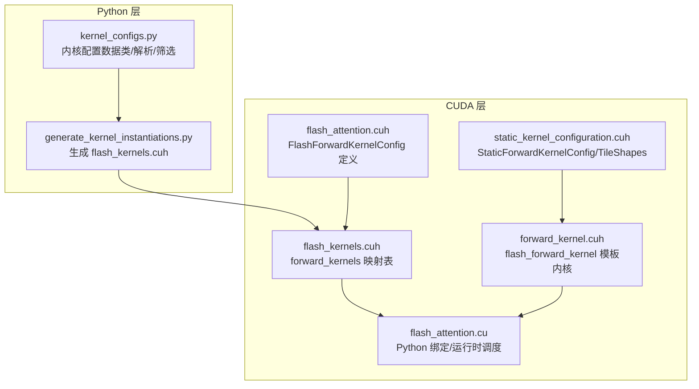
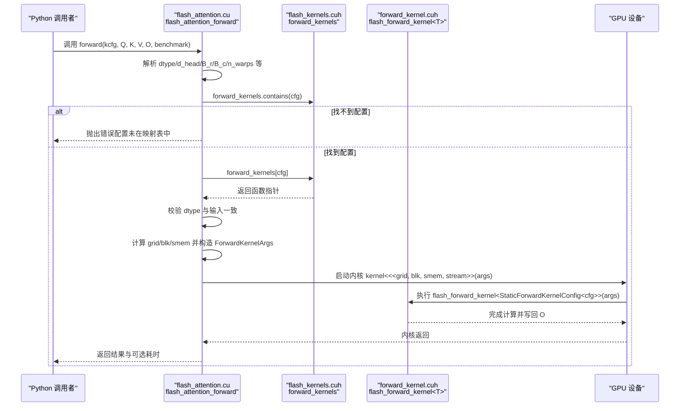
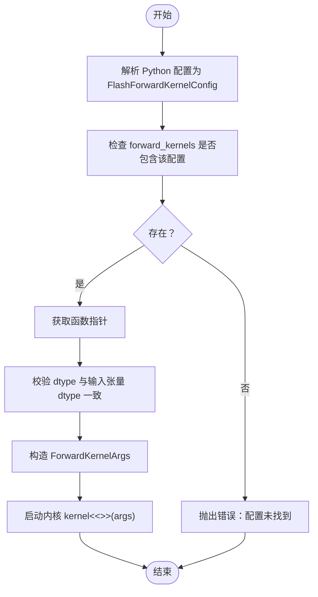
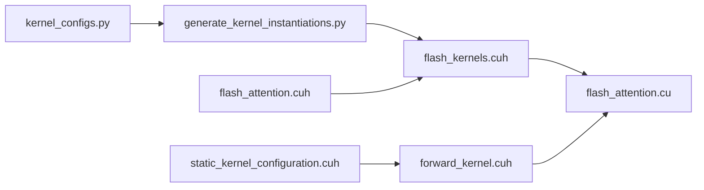

# 运行时内核选择机制

<cite>
**本文引用的文件**
- [flash_kernels.cuh](file://src/include/flash_kernels.cuh)
- [forward_kernel.cuh](file://src/include/forward_kernel.cuh)
- [flash_attention.cu](file://src/flash_attention.cu)
- [flash_attention.cuh](file://src/include/flash_attention.cuh)
- [static_kernel_configuration.cuh](file://src/include/static_kernel_configuration.cuh)
- [generate_kernel_instantiations.py](file://tools/build/generate_kernel_instantiations.py)
- [kernel_configs.py](file://py/flash_helpers/kernel_configs.py)
</cite>

## 目录
1. [引言](#引言)
2. [项目结构](#项目结构)
3. [核心组件](#核心组件)
4. [架构总览](#架构总览)
5. [详细组件分析](#详细组件分析)
6. [依赖关系分析](#依赖关系分析)
7. [性能考量](#性能考量)
8. [故障排查指南](#故障排查指南)
9. [结论](#结论)
10. [附录](#附录)

## 引言
本文件围绕“运行时内核选择机制”进行深入技术文档化，目标是解释系统如何基于输入参数在 forward_kernels 映射表中查找并调用最优 CUDA 内核，涵盖从 API 调用到内核执行的完整流程；详述如何将输入张量参数转换为 FlashForwardKernelConfig 查询键、执行 std::map 查找、获取函数指针并最终启动 CUDA 内核；同时说明查找失败处理与默认配置回退策略；并通过代码路径定位展示 ForwardKernelArgs 如何被解析为配置键，以及函数指针调用的语法细节；最后阐明该机制如何在灵活性与性能之间取得平衡，避免运行时模板实例化开销。

## 项目结构
本项目采用分层组织：
- Python 层：提供内核配置生成与解析工具（autotune、短名转换、规则过滤等）
- 构建脚本：自动生成 forward_kernels 映射表头文件
- CUDA 层：定义内核配置结构体、静态内核配置、前向内核模板与运行时调度入口



图表来源
- [generate_kernel_instantiations.py](file://tools/build/generate_kernel_instantiations.py#L1-L56)
- [flash_kernels.cuh](file://src/include/flash_kernels.cuh#L1-L187)
- [flash_attention.cuh](file://src/include/flash_attention.cuh#L1-L110)
- [static_kernel_configuration.cuh](file://src/include/static_kernel_configuration.cuh#L1-L294)
- [forward_kernel.cuh](file://src/include/forward_kernel.cuh#L1-L207)
- [flash_attention.cu](file://src/flash_attention.cu#L1-L150)

章节来源
- [generate_kernel_instantiations.py](file://tools/build/generate_kernel_instantiations.py#L1-L56)
- [flash_kernels.cuh](file://src/include/flash_kernels.cuh#L1-L187)
- [flash_attention.cu](file://src/flash_attention.cu#L1-L150)

## 核心组件
- FlashForwardKernelConfig：内核配置键，包含数据类型、维度、块大小、线程束数、异步拷贝、预加载、swizzle、Q/K/V 加载片段数、双缓冲、优化 softmax 等字段，并提供字典序比较运算符用于 std::map 排序与查找。
- StaticForwardKernelConfig：将 FlashForwardKernelConfig 编译期常量展开为内核模板参数，决定张量布局、加载存储策略、GEMM 配置、寄存器/共享内存布局等。
- forward_kernels：std::map<FlashForwardKernelConfig, void(*)(ForwardKernelArgs)>，运行时按配置键查找对应内核函数指针。
- flash_forward_kernel：__global__ 模板内核，接收 __grid_constant__ 的 ForwardKernelArgs，完成 Q/K/V 加载、S=QK、softmax、P=softmax(S)、P*V、归一化与写回。
- ForwardKernelArgs：CUDA 内核启动参数结构，包含 Q/K/V/O 指针及多维步幅、序列长度、头数、块数等。
- Python 工具链：kernel_configs.py 提供配置数据类、短名解析、自动调优配置集合、规则过滤；generate_kernel_instantiations.py 自动生成 flash_kernels.cuh 中的映射表条目。

章节来源
- [flash_attention.cuh](file://src/include/flash_attention.cuh#L1-L110)
- [static_kernel_configuration.cuh](file://src/include/static_kernel_configuration.cuh#L1-L294)
- [flash_kernels.cuh](file://src/include/flash_kernels.cuh#L1-L187)
- [forward_kernel.cuh](file://src/include/forward_kernel.cuh#L1-L207)
- [flash_attention.cu](file://src/flash_attention.cu#L1-L150)
- [kernel_configs.py](file://py/flash_helpers/kernel_configs.py#L100-L486)
- [generate_kernel_instantiations.py](file://tools/build/generate_kernel_instantiations.py#L1-L56)

## 架构总览
下图展示了从 Python API 到 CUDA 内核的端到端调用链路，以及运行时选择机制的关键节点。



图表来源
- [flash_attention.cu](file://src/flash_attention.cu#L34-L135)
- [flash_kernels.cuh](file://src/include/flash_kernels.cuh#L1-L187)
- [forward_kernel.cuh](file://src/include/forward_kernel.cuh#L85-L205)

## 详细组件分析

### 运行时内核选择流程与查找机制
- 输入参数到配置键的转换
  - Python 层将用户提供的内核配置对象转换为 FlashForwardKernelConfig（包含 dtype、d_head、B_r、B_c、n_warps、async_copy、eager_load_blocks、swizzled、Q/K/V_mma_load_K_tiles、mma_double_buffer_loads、optimized_softmax）。
  - CUDA 层的 py_to_cpp_kernel_config 将 Python 对象映射为 C++ 结构体，确保字段顺序与 FlashForwardKernelConfig 字段一一对应。
- std::map 查找与函数指针获取
  - forward_kernels 是一个 std::map，键为 FlashForwardKernelConfig，值为 void(*)(ForwardKernelArgs) 函数指针。
  - 查找使用 contains 和 operator[]，若不存在则抛出错误。
- 内核启动与参数传递
  - 构造 ForwardKernelArgs，设置 grid/blk/smem，调用函数指针启动内核。
  - 内核内部使用 __grid_constant__ 参数访问 ForwardKernelArgs，按 StaticForwardKernelConfig 的编译期配置执行加载、GEMM、softmax、写回等步骤。



图表来源
- [flash_attention.cu](file://src/flash_attention.cu#L34-L135)
- [flash_kernels.cuh](file://src/include/flash_kernels.cuh#L1-L187)

章节来源
- [flash_attention.cu](file://src/flash_attention.cu#L34-L135)
- [flash_kernels.cuh](file://src/include/flash_kernels.cuh#L1-L187)

### ForwardKernelArgs 的解析与使用
- ForwardKernelArgs 包含 Q/K/V/O 指针与 batch/seq/head 步幅、序列长度、头数、Q/KV 块数等。
- CUDA 层在 flash_attention_forward 中根据输入张量尺寸与配置计算 n_Q_blocks、n_KV_blocks，并填充 ForwardKernelArgs。
- 内核模板 flash_forward_kernel 使用 __grid_constant__ 的 ForwardKernelArgs 访问这些字段，按 StaticForwardKernelConfig 的 tile 形状与加载策略执行计算。

章节来源
- [flash_attention.c.cuh](file://src/include/flash_attention.cuh#L1-L29)
- [flash_attention.cu](file://src/flash_attention.cu#L100-L135)
- [forward_kernel.cuh](file://src/include/forward_kernel.cuh#L85-L205)

### 函数指针调用语法细节
- forward_kernels 的值类型为 void(*)(ForwardKernelArgs)，即函数指针签名与内核模板参数无关。
- 启动时通过 kernel<<<grid, blk, smem, stream>>>(args) 调用，其中 kernel 即为从映射表取出的函数指针。
- 内核模板参数由 StaticForwardKernelConfig<cfg> 在映射表条目中显式指定，避免了运行时模板实例化开销。

章节来源
- [flash_kernels.cuh](file://src/include/flash_kernels.cuh#L1-L187)
- [flash_attention.cu](file://src/flash_attention.cu#L114-L135)

### 查找失败处理与默认配置回退策略
- 当 forward_kernels.contains(cfg) 返回 false 时，立即抛出错误，提示“配置未在 flash_kernels.cuh 中找到”，避免不匹配的内核被误用。
- 代码中未提供“默认配置回退”的逻辑；建议在上层调用处对配置进行预构建或预筛选，确保所有期望配置均存在于映射表中。

章节来源
- [flash_attention.cu](file://src/flash_attention.cu#L58-L66)

### Python 配置生成与映射表自动生成
- kernel_configs.py 定义 FlashForwardKernelConfig 数据类，提供 short_form、to_cpp_struct、kernel_name 等方法，用于生成映射表条目字符串。
- generate_kernel_instantiations.py 读取 get_kernels_to_build() 返回的配置集合，逐个生成映射表条目，写入 flash_kernels.cuh。
- 该流程保证了运行时查找键与编译期模板参数的一致性，避免了手写维护的遗漏与不一致。

章节来源
- [kernel_configs.py](file://py/flash_helpers/kernel_configs.py#L100-L175)
- [generate_kernel_instantiations.py](file://tools/build/generate_kernel_instantiations.py#L1-L56)

### 类型与模板关系图
```mermaid
classDiagram
class FlashForwardKernelConfig {
+dtype
+d_head
+B_r
+B_c
+n_warps
+async_copy
+eager_load_blocks
+swizzled
+Q_mma_load_K_tiles
+K_mma_load_K_tiles
+V_mma_load_K_tiles
+mma_double_buffer_loads
+optimized_softmax
+operator<(other)
}
class StaticForwardKernelConfig~CFG~ {
+accum_t
+value_t
+N
+async_copy
+B_r
+B_c
+d_head
+eager_load_blocks
+optimized_softmax
+GSMemLdstConfigQO
+GSMemLdstConfigKV
+GEMM_QK
+GEMM_PV
}
class forward_kernels {
+map<FlashForwardKernelConfig, void(*)(ForwardKernelArgs)>
}
class flash_forward_kernel~Kernel~ {
+__global__
+__grid_constant__ ForwardKernelArgs args
}
FlashForwardKernelConfig --> StaticForwardKernelConfig : "作为模板参数"
StaticForwardKernelConfig --> flash_forward_kernel : "模板参数"
forward_kernels --> flash_forward_kernel : "函数指针"
```

图表来源
- [flash_attention.cuh](file://src/include/flash_attention.cuh#L1-L110)
- [static_kernel_configuration.cuh](file://src/include/static_kernel_configuration.cuh#L1-L294)
- [flash_kernels.cuh](file://src/include/flash_kernels.cuh#L1-L187)
- [forward_kernel.cuh](file://src/include/forward_kernel.cuh#L85-L205)

## 依赖关系分析
- 构建阶段依赖
  - generate_kernel_instantiations.py 依赖 kernel_configs.py 的 get_kernels_to_build() 与 FlashForwardKernelConfig 的 to_cpp_struct()。
- 运行时依赖
  - flash_attention.cu 依赖 flash_kernels.cuh 的 forward_kernels 映射表与 forward_kernel.cuh 的 flash_forward_kernel 模板。
  - flash_forward_kernel 模板依赖 static_kernel_configuration.cuh 提供的 StaticForwardKernelConfig。



图表来源
- [generate_kernel_instantiations.py](file://tools/build/generate_kernel_instantiations.py#L1-L56)
- [kernel_configs.py](file://py/flash_helpers/kernel_configs.py#L100-L486)
- [flash_kernels.cuh](file://src/include/flash_kernels.cuh#L1-L187)
- [flash_attention.cu](file://src/flash_attention.cu#L1-L150)
- [forward_kernel.cuh](file://src/include/forward_kernel.cuh#L1-L207)
- [static_kernel_configuration.cuh](file://src/include/static_kernel_configuration.cuh#L1-L294)

章节来源
- [flash_attention.cu](file://src/flash_attention.cu#L1-L150)
- [flash_kernels.cuh](file://src/include/flash_kernels.cuh#L1-L187)
- [forward_kernel.cuh](file://src/include/forward_kernel.cuh#L1-L207)
- [static_kernel_configuration.cuh](file://src/include/static_kernel_configuration.cuh#L1-L294)
- [flash_attention.cuh](file://src/include/flash_attention.cuh#L1-L110)
- [generate_kernel_instantiations.py](file://tools/build/generate_kernel_instantiations.py#L1-L56)
- [kernel_configs.py](file://py/flash_helpers/kernel_configs.py#L100-L486)

## 性能考量
- 避免运行时模板实例化开销
  - 映射表条目显式指定 StaticForwardKernelConfig<cfg>，内核模板参数在编译期确定，运行时仅做函数指针分发，减少模板实例化成本。
- 动态共享内存设置
  - 模块初始化时遍历 forward_kernels，对 smem 使用量超过阈值的内核调用 cudaFuncSetAttribute 设置 MaxDynamicSharedMemorySize，避免运行时动态分配失败。
- 查找复杂度
  - std::map 查找为对数复杂度，键为 FlashForwardKernelConfig 的全字段有序比较，查找代价可控。
- 启动参数与内存占用
  - grid/blk 根据 B_r、B_c、n_warps、batch/heads/seq_len 计算；smem_bytes 依据 d_head、B_r、B_c、elem_size 计算，确保满足内核需求。

章节来源
- [flash_attention.cu](file://src/flash_attention.cu#L114-L150)
- [flash_kernels.cuh](file://src/include/flash_kernels.cuh#L1-L187)
- [flash_attention.cuh](file://src/include/flash_attention.cuh#L30-L66)

## 故障排查指南
- 配置未找到
  - 现象：调用时报错“配置未在 flash_kernels.cuh 中找到”
  - 排查：确认 Python 层传入的内核配置是否已通过 generate_kernel_instantiations.py 注入映射表；检查 FlashForwardKernelConfig 的字段与映射表条目是否完全一致。
- dtype 不匹配
  - 现象：dtype 与输入张量 dtype 不一致导致校验失败
  - 排查：确保 Python 层配置 dtype 与输入张量 dtype 一致。
- 块大小约束
  - 现象：seq_len 与 B_r/B_c 不整除导致断言失败
  - 排查：调整 B_r、B_c 或 seq_len，使其满足整除条件。
- 设备能力不足
  - 现象：设备计算能力低于要求
  - 排查：确认设备 SM_80+。

章节来源
- [flash_attention.cu](file://src/flash_attention.cu#L34-L135)
- [flash_kernels.cuh](file://src/include/flash_kernels.cuh#L1-L187)

## 结论
本项目的运行时内核选择机制通过“配置键 + 函数指针映射表”的方式，在保持灵活性的同时避免了运行时模板实例化的开销。Python 层负责配置生成与筛选，构建脚本自动生成映射表，CUDA 层在运行时按配置键查找最优内核并启动执行。该设计既支持广泛的内核配置组合，又能在性能上获得稳定的函数指针分发收益。对于查找失败，当前实现直接报错，建议在上层确保配置完备性，以避免运行时异常。

## 附录
- 关键实现路径参考
  - 配置键定义与比较：[flash_attention.cuh](file://src/include/flash_attention.cuh#L30-L109)
  - 映射表声明与初始化：[flash_kernels.cuh](file://src/include/flash_kernels.cuh#L1-L187)
  - 内核模板与启动：[forward_kernel.cuh](file://src/include/forward_kernel.cuh#L85-L205)、[flash_attention.cu](file://src/flash_attention.cu#L100-L135)
  - Python 配置与生成：[kernel_configs.py](file://py/flash_helpers/kernel_configs.py#L100-L175)、[generate_kernel_instantiations.py](file://tools/build/generate_kernel_instantiations.py#L1-L56)