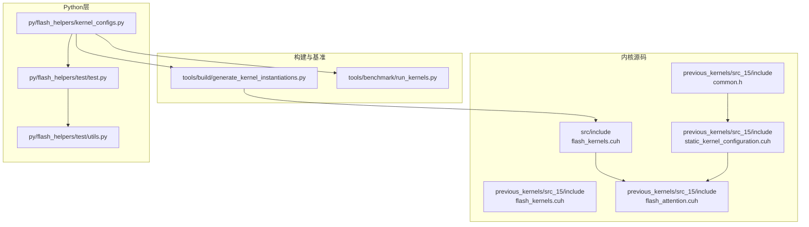
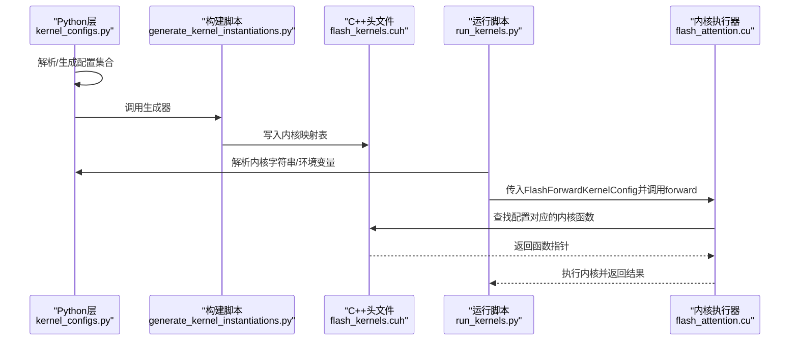
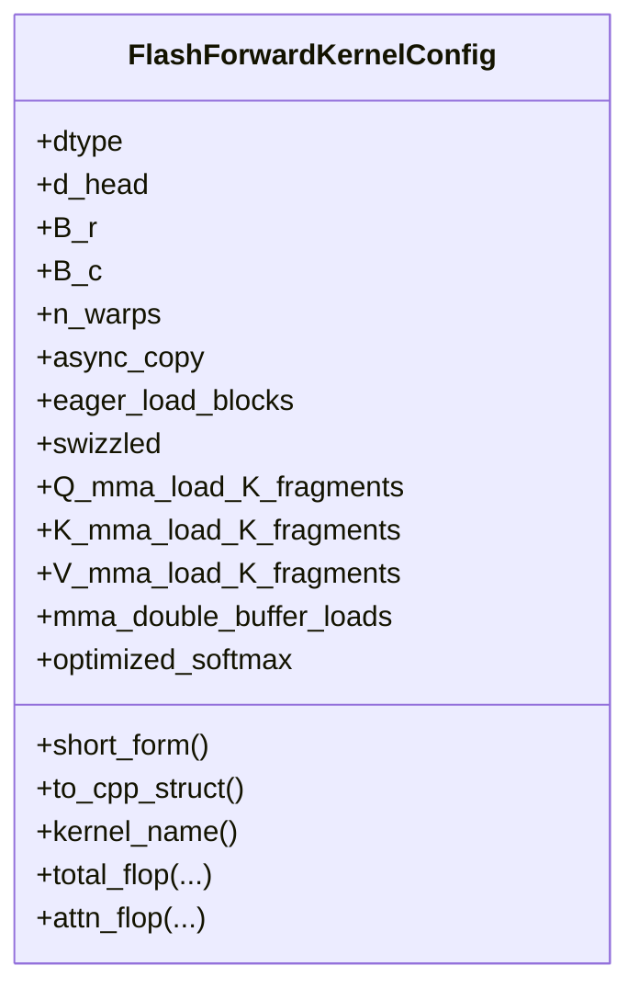
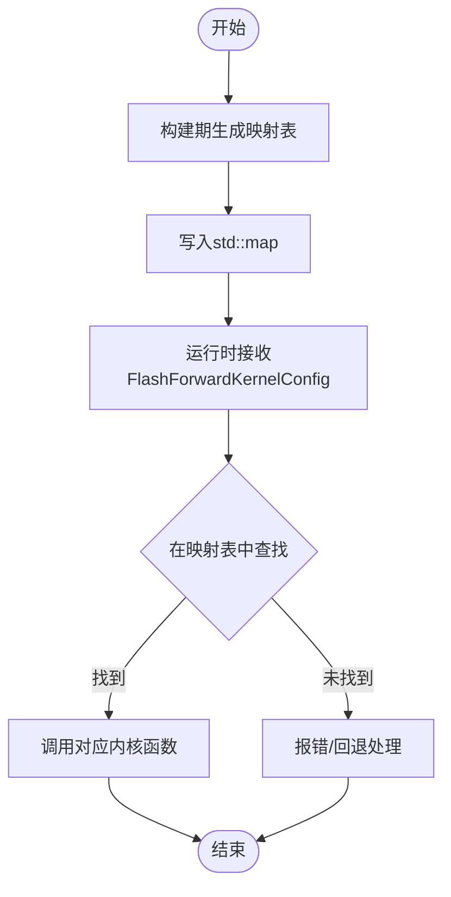
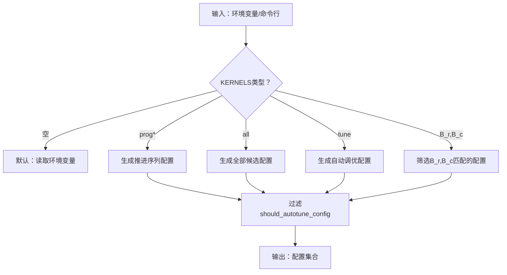
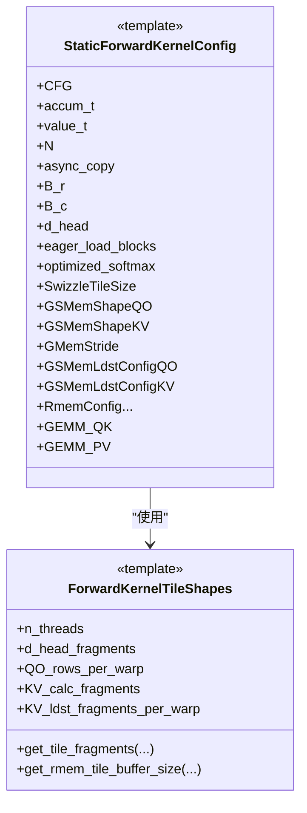
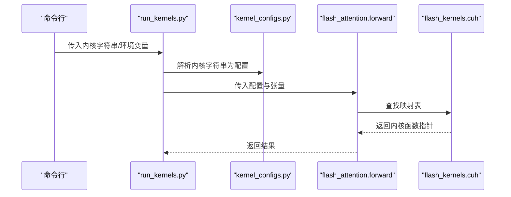
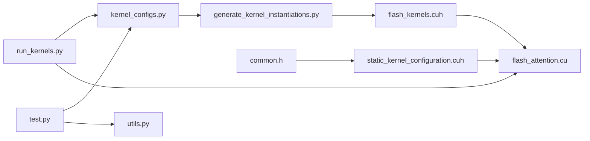

# 内核配置系统

<cite>
**本文引用的文件**
- [README.md](file://README.md)
- [flash_kernels.cuh（版本15）](file://previous_kernels/src_15/include/flash_kernels.cuh)
- [flash_kernels.cuh（当前版本）](file://src/include/flash_kernels.cuh)
- [static_kernel_configuration.cuh](file://previous_kernels/src_15/include/static_kernel_configuration.cuh)
- [flash_attention.cuh](file://previous_kernels/src_15/include/flash_attention.cuh)
- [common.h](file://previous_kernels/src_15/include/common.h)
- [kernel_configs.py](file://py/flash_helpers/kernel_configs.py)
- [generate_kernel_instantiations.py](file://tools/build/generate_kernel_instantiations.py)
- [run_kernels.py](file://tools/benchmark/run_kernels.py)
- [test.py](file://py/flash_helpers/test/test.py)
- [utils.py](file://py/flash_helpers/test/utils.py)
</cite>

## 目录
1. [引言](#引言)
2. [项目结构](#项目结构)
3. [核心组件](#核心组件)
4. [架构总览](#架构总览)
5. [详细组件分析](#详细组件分析)
6. [依赖关系分析](#依赖关系分析)
7. [性能考量](#性能考量)
8. [故障排查指南](#故障排查指南)
9. [结论](#结论)
10. [附录：配置选项与影响](#附录配置选项与影响)

## 引言
本文件围绕“内核配置系统”展开，聚焦于FlashForwardKernelConfig的设计与应用，解释配置系统如何管理块大小、线程束数量、异步复制启用等参数的组合；阐述flash_kernels.cuh中内核配置映射的实现机制；解析py/flash_helpers/kernel_configs.py中Python层配置管理与自动调优逻辑；并提供配置选项的完整列表及对性能的影响分析，指导开发者如何自定义配置或添加新的内核变体以适配特定硬件或工作负载。

## 项目结构
该仓库包含多版本内核源码与Python辅助工具，其中：
- previous_kernels/src_15/include：包含历史版本的内核实现与配置头文件
- src/include：当前版本的内核配置映射头文件
- py/flash_helpers：Python侧配置管理与测试工具
- tools/build：构建期生成内核实例化映射的脚本
- tools/benchmark：内核运行与基准测试脚本
- README.md：项目背景与性能对比说明

图表来源
- [flash_kernels.cuh（版本15）](file://previous_kernels/src_15/include/flash_kernels.cuh#L1-L187)
- [flash_kernels.cuh（当前版本）](file://src/include/flash_kernels.cuh#L1-L187)
- [static_kernel_configuration.cuh](file://previous_kernels/src_15/include/static_kernel_configuration.cuh#L1-L294)
- [flash_attention.cuh](file://previous_kernels/src_15/include/flash_attention.cuh#L1-L110)
- [common.h](file://previous_kernels/src_15/include/common.h#L1-L81)
- [kernel_configs.py](file://py/flash_helpers/kernel_configs.py#L1-L486)
- [generate_kernel_instantiations.py](file://tools/build/generate_kernel_instantiations.py#L1-L57)
- [run_kernels.py](file://tools/benchmark/run_kernels.py#L1-L159)
- [test.py](file://py/flash_helpers/test/test.py#L1-L104)
- [utils.py](file://py/flash_helpers/test/utils.py#L1-L200)

章节来源
- [README.md](file://README.md#L1-L63)

## 核心组件
- FlashForwardKernelConfig：内核配置数据结构，描述dtype、d_head、B_r、B_c、n_warps、异步复制、预加载、swizzle、Q/K/V的K碎片数、双缓冲加载、优化softmax等参数。
- 静态内核配置映射：通过std::map将FlashForwardKernelConfig映射到具体内核函数指针，支持按配置快速选择最优内核变体。
- Python层配置管理：提供配置解析、短格式转换、自动调优过滤、内核集合生成与环境变量驱动的选择逻辑。
- 构建期生成器：根据Python层生成的配置集合，动态写入C++头文件中的内核映射表。
- 基准与测试：通过命令行参数与环境变量选择内核，运行参考内核与目标内核进行正确性与性能验证。

章节来源
- [flash_attention.cuh](file://previous_kernels/src_15/include/flash_attention.cuh#L30-L110)
- [flash_kernels.cuh（版本15）](file://previous_kernels/src_15/include/flash_kernels.cuh#L1-L187)
- [flash_kernels.cuh（当前版本）](file://src/include/flash_kernels.cuh#L1-L187)
- [kernel_configs.py](file://py/flash_helpers/kernel_configs.py#L106-L175)
- [generate_kernel_instantiations.py](file://tools/build/generate_kernel_instantiations.py#L1-L57)

## 架构总览
下图展示了从Python配置到C++内核映射与执行的整体流程。

图表来源
- [kernel_configs.py](file://py/flash_helpers/kernel_configs.py#L389-L486)
- [generate_kernel_instantiations.py](file://tools/build/generate_kernel_instantiations.py#L1-L57)
- [flash_kernels.cuh（当前版本）](file://src/include/flash_kernels.cuh#L1-L187)
- [run_kernels.py](file://tools/benchmark/run_kernels.py#L1-L159)

## 详细组件分析

### FlashForwardKernelConfig设计与字段语义
- 字段含义与取值范围
  - dtype：数据类型枚举（FP16/BF16）
  - d_head：头维度（示例为128）
  - B_r、B_c：行/列块大小（常见取值如64、128；B_c也支持32、64、128）
  - n_warps：每块线程束数（常见4或8，8仅在B_r=128时使用）
  - async_copy：是否启用异步复制
  - eager_load_blocks：是否提前加载K/V块
  - swizzled：是否启用swizzle
  - Q/K/V_mma_load_K_fragments：对应Q/K/V的K碎片数（0表示按默认策略）
  - mma_double_buffer_loads：是否启用双缓冲加载
  - optimized_softmax：是否启用优化的softmax路径
- 比较与排序：重载了operator<，用于配置集合的有序存储与比较
- 辅助方法：short_form（短格式字符串）、to_cpp_struct（C++结构体字面量）、kernel_name（内核名）、FLOP统计与算密计算

图表来源
- [flash_attention.cuh](file://previous_kernels/src_15/include/flash_attention.cuh#L30-L110)
- [kernel_configs.py](file://py/flash_helpers/kernel_configs.py#L106-L175)

章节来源
- [flash_attention.cuh](file://previous_kernels/src_15/include/flash_attention.cuh#L30-L110)
- [kernel_configs.py](file://py/flash_helpers/kernel_configs.py#L106-L175)

### 内核配置映射机制（flash_kernels.cuh）
- 映射结构：std::map<FlashForwardKernelConfig, forward_kernel_fn> forward_kernels
- 初始化方式：由构建脚本根据Python层生成的配置集合写入，键为FlashForwardKernelConfig，值为对应内核函数指针
- 变体覆盖：同一组参数（如dtype、B_r、B_c、n_warps）可有多种变体（异步复制、预加载、swizzle、不同K碎片数、双缓冲、优化softmax等），均作为独立条目登记
- 运行时选择：通过查找映射表，按配置精确匹配到对应内核

图表来源
- [generate_kernel_instantiations.py](file://tools/build/generate_kernel_instantiations.py#L1-L57)
- [flash_kernels.cuh（当前版本）](file://src/include/flash_kernels.cuh#L1-L187)

章节来源
- [flash_kernels.cuh（版本15）](file://previous_kernels/src_15/include/flash_kernels.cuh#L1-L187)
- [flash_kernels.cuh（当前版本）](file://src/include/flash_kernels.cuh#L1-L187)
- [generate_kernel_instantiations.py](file://tools/build/generate_kernel_instantiations.py#L1-L57)

### Python层配置管理与自动调优
- 短格式与解析
  - short_form：将配置转为人类可读的短格式字符串
  - parse_kernel_name_into_config：支持多种名称格式（去修饰名、带类型、短格式）解析为配置对象
- 自动调优过滤
  - should_autotune_config：基于规则过滤不合适的配置组合（如异步复制与预加载的约束、不同Q/K碎片数的限制、B_r/B_c/n_warps的组合限制等）
- 配置集合生成
  - get_autotuning_kernel_configs：生成候选配置笛卡尔积并应用过滤
  - get_kernel_progression_configs：按推进序列生成配置（便于逐步优化观察）
  - get_kernels_to_build：汇总需要构建的配置集合
  - get_kernel_configs：支持环境变量选择（prog/all/tune/逗号分隔B_r,B_c）
- 环境变量驱动
  - KERNELS环境变量控制选择策略，支持“prog/all/tune/逗号分隔B_r,B_c”等模式

图表来源
- [kernel_configs.py](file://py/flash_helpers/kernel_configs.py#L389-L486)

章节来源
- [kernel_configs.py](file://py/flash_helpers/kernel_configs.py#L1-L486)

### 静态内核配置与编译期校验
- StaticForwardKernelConfig：将FlashForwardKernelConfig静态化为模板参数，派生出内存布局、寄存器/共享内存形状、swizzle策略、GEMM配置等
- valid_config：在编译期对配置进行静态断言，确保K碎片数为2的幂且不超过上限、Q/K/V碎片数一致性等
- ForwardKernelTileShapes：根据配置推导线程、块、warps维度，以及各阶段tile数量与缓冲区大小

图表来源
- [static_kernel_configuration.cuh](file://previous_kernels/src_15/include/static_kernel_configuration.cuh#L1-L294)

章节来源
- [static_kernel_configuration.cuh](file://previous_kernels/src_15/include/static_kernel_configuration.cuh#L1-L294)
- [common.h](file://previous_kernels/src_15/include/common.h#L1-L81)

### 运行时选择与基准测试
- run_kernels.py：支持命令行指定内核字符串、参考内核、数据类型、重复次数等，解析内核字符串为配置后调用flash_attention.forward执行
- test.py：单元测试中遍历get_kernels_to_build()生成的配置，验证正确性
- utils.py：提供参考内核（v2/v3）、张量生成、误差统计等工具

图表来源
- [run_kernels.py](file://tools/benchmark/run_kernels.py#L1-L159)
- [kernel_configs.py](file://py/flash_helpers/kernel_configs.py#L323-L362)
- [flash_kernels.cuh（当前版本）](file://src/include/flash_kernels.cuh#L1-L187)

章节来源
- [run_kernels.py](file://tools/benchmark/run_kernels.py#L1-L159)
- [test.py](file://py/flash_helpers/test/test.py#L1-L104)
- [utils.py](file://py/flash_helpers/test/utils.py#L1-L200)

## 依赖关系分析
- Python层依赖
  - kernel_configs.py依赖DType、itertools、正则表达式、dataclass等，负责配置解析与集合生成
  - generate_kernel_instantiations.py依赖kernel_configs.py的get_kernels_to_build()，生成C++头文件
- C++层依赖
  - flash_kernels.cuh依赖flash_attention.cuh与forward_kernel.cuh，建立配置到内核函数的映射
  - static_kernel_configuration.cuh依赖flash_attention.cuh、gemm.cuh、layout.cuh、load_store.cuh、tensor.cuh、utils.h等，提供静态配置与编译期校验
  - common.h提供常量与类型工具，被static_kernel_configuration.cuh广泛使用
- 运行时依赖
  - run_kernels.py依赖flash_attention包与kernel_configs.py，完成内核选择与执行
  - test.py依赖kernel_configs.py与utils.py，完成正确性验证

图表来源
- [kernel_configs.py](file://py/flash_helpers/kernel_configs.py#L1-L486)
- [generate_kernel_instantiations.py](file://tools/build/generate_kernel_instantiations.py#L1-L57)
- [flash_kernels.cuh（当前版本）](file://src/include/flash_kernels.cuh#L1-L187)
- [static_kernel_configuration.cuh](file://previous_kernels/src_15/include/static_kernel_configuration.cuh#L1-L294)
- [common.h](file://previous_kernels/src_15/include/common.h#L1-L81)
- [run_kernels.py](file://tools/benchmark/run_kernels.py#L1-L159)
- [test.py](file://py/flash_helpers/test/test.py#L1-L104)
- [utils.py](file://py/flash_helpers/test/utils.py#L1-L200)

章节来源
- [kernel_configs.py](file://py/flash_helpers/kernel_configs.py#L1-L486)
- [generate_kernel_instantiations.py](file://tools/build/generate_kernel_instantiations.py#L1-L57)
- [flash_kernels.cuh（当前版本）](file://src/include/flash_kernels.cuh#L1-L187)
- [static_kernel_configuration.cuh](file://previous_kernels/src_15/include/static_kernel_configuration.cuh#L1-L294)
- [common.h](file://previous_kernels/src_15/include/common.h#L1-L81)
- [run_kernels.py](file://tools/benchmark/run_kernels.py#L1-L159)
- [test.py](file://py/flash_helpers/test/test.py#L1-L104)
- [utils.py](file://py/flash_helpers/test/utils.py#L1-L200)

## 性能考量
- 块大小与线程束数量
  - B_r/B_c越大，吞吐更高但寄存器/共享内存占用增加；n_warps=8仅在B_r=128时使用，受寄存器限制
- 异步复制与预加载
  - async_copy与eager_load_blocks组合影响内存带宽与流水线深度；某些组合可能不适用（由should_autotune_config过滤）
- Swizzle与碎片数
  - swizzled提升访存效率；Q/K碎片数需一致或至少一方为0，避免寄存器/内存压力
- 双缓冲与优化softmax
  - mma_double_buffer_loads减少等待延迟；optimized_softmax减少冗余计算
- 算密与带宽
  - 通过kv_tile_flop与gmem_transfer_size估算算密强度，指导配置选择

章节来源
- [kernel_configs.py](file://py/flash_helpers/kernel_configs.py#L61-L104)
- [kernel_configs.py](file://py/flash_helpers/kernel_configs.py#L364-L387)
- [flash_attention.cuh](file://previous_kernels/src_15/include/flash_attention.cuh#L54-L109)

## 故障排查指南
- 配置不可用
  - 现象：找不到对应内核或编译失败
  - 排查：确认配置组合是否通过should_autotune_config过滤；检查B_r/B_c/n_warps与碎片数约束
- 构建映射缺失
  - 现象：运行时报错找不到配置
  - 排查：确认generate_kernel_instantiations.py已执行并生成最新flash_kernels.cuh
- 运行时错误
  - 现象：内核崩溃或结果异常
  - 排查：使用run_kernels.py的参考内核对比；检查dtype、张量形状与设备能力；查看短格式字符串是否符合预期

章节来源
- [kernel_configs.py](file://py/flash_helpers/kernel_configs.py#L364-L387)
- [generate_kernel_instantiations.py](file://tools/build/generate_kernel_instantiations.py#L1-L57)
- [run_kernels.py](file://tools/benchmark/run_kernels.py#L1-L159)

## 结论
该内核配置系统通过Python层的灵活配置与自动调优、构建期生成C++映射表、以及静态配置模板，实现了对块大小、线程束数量、异步复制、预加载、swizzle、碎片数、双缓冲与优化softmax等参数的统一管理。开发者可通过环境变量与命令行参数快速选择或生成配置集合，结合参考内核与基准脚本完成正确性与性能验证，从而高效适配不同硬件与工作负载。

## 附录：配置选项与影响
- 关键配置项
  - dtype：FP16/BF16
  - d_head：128（示例）
  - B_r、B_c：64/128（B_c可为32/64/128）
  - n_warps：4/8（8仅限B_r=128）
  - async_copy：启用异步复制
  - eager_load_blocks：提前加载K/V块
  - swizzled：启用swizzle
  - Q/K/V_mma_load_K_fragments：K碎片数（0表示默认）
  - mma_double_buffer_loads：双缓冲加载
  - optimized_softmax：优化softmax
- 影响分析
  - 提升吞吐：增大B_r/B_c、启用预加载与双缓冲
  - 改善访存：启用swizzled与合适的碎片数
  - 控制寄存器/共享内存：合理设置n_warps与碎片数，避免超限
  - 稳定性：遵循should_autotune_config规则，避免不兼容组合

章节来源
- [kernel_configs.py](file://py/flash_helpers/kernel_configs.py#L389-L486)
- [flash_attention.cuh](file://previous_kernels/src_15/include/flash_attention.cuh#L30-L110)
- [static_kernel_configuration.cuh](file://previous_kernels/src_15/include/static_kernel_configuration.cuh#L1-L294)