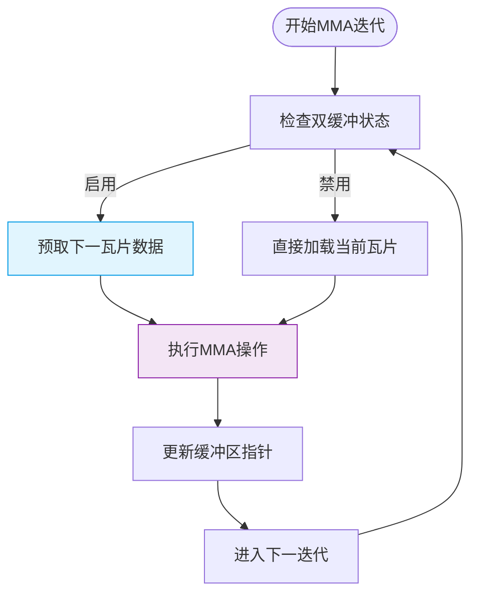
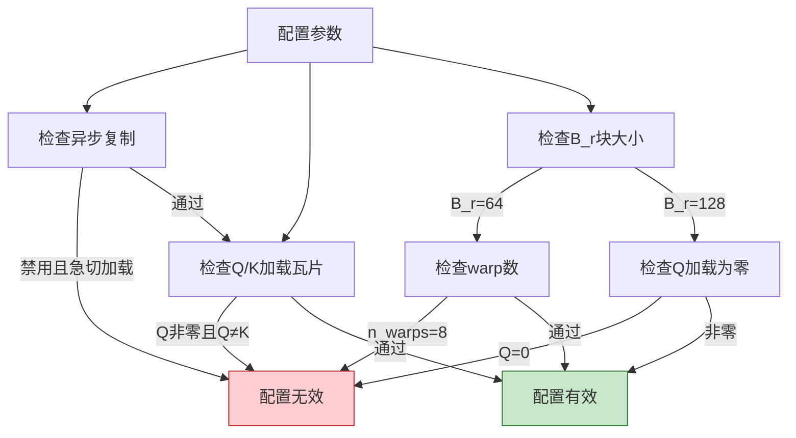

# K_mma_load_K_tiles配置

<cite>
**本文档引用文件**   
- [gemm.cuh](file://src/include/gemm.cuh)
- [static_kernel_configuration.cuh](file://src/include/static_kernel_configuration.cuh)
- [kernel_configs.py](file://py/flash_helpers/kernel_configs.py)
</cite>

## 目录
1. [引言](#引言)
2. [K_mma_load_K_tiles参数在张量核心操作中的作用](#k_mma_load_k_tiles参数在张量核心操作中的作用)
3. [双缓冲逻辑与数据传输调度](#双缓冲逻辑与数据传输调度)
4. [配置验证规则分析](#配置验证规则分析)
5. [优化建议](#优化建议)
6. [结论](#结论)

## 引言
K_mma_load_K_tiles参数是Flash Attention实现中用于控制键矩阵（Key Matrix）在张量核心MMA操作中K维度加载瓦片数量的关键配置。该参数直接影响内存带宽利用率和计算效率，特别是在启用双缓冲机制时。本文将详细阐述该参数如何通过GEMM::matmul函数的双缓冲逻辑影响K矩阵在共享内存与寄存器文件之间的数据传输调度，并结合should_autotune_config()验证规则解释其约束关系，最后提供优化配置建议。

## K_mma_load_K_tiles参数在张量核心操作中的作用

K_mma_load_K_tiles参数控制键矩阵在张量核心MMA操作中K维度的加载瓦片数量。在src/include/gemm.cuh中，GEMM结构体定义了MMA操作的维度参数，其中MMA_K定义为16，表示每次MMA操作处理的K维度大小。K_mma_load_K_tiles参数决定了在每次MMA迭代中从共享内存加载到寄存器文件的瓦片数量。

当K_mma_load_K_tiles设置为非零值时，系统将启用分块加载机制，将大块的K矩阵数据分割成多个小瓦片进行处理。这种分块策略允许更细粒度的内存访问控制，有助于提高内存带宽利用率。具体来说，每个瓦片的大小由MMA_K和K_mma_load_K_tiles共同决定，形成一个可配置的加载单元。

在实际操作中，K_mma_load_K_tiles参数通过影响GEMM::matmul函数中的循环迭代次数来控制数据加载过程。较大的K_mma_load_K_tiles值意味着每次迭代加载更多的数据，从而减少迭代次数，但可能增加寄存器压力；较小的值则相反，增加迭代次数但降低单次加载的数据量，有利于更好地利用缓存层次结构。

**Section sources**
- [gemm.cuh](file://src/include/gemm.cuh#L16-L18)
- [gemm.cuh](file://src/include/gemm.cuh#L106-L122)

## 双缓冲逻辑与数据传输调度

在启用双缓冲机制时，K_mma_load_K_tiles参数对数据传输调度产生重要影响。根据src/include/gemm.cuh中GEMM::matmul函数的实现，双缓冲逻辑通过预取机制实现计算与内存传输的重叠。当K_mma_load_K_tiles非零时，系统会在当前MMA操作进行的同时，预取下一个数据块到备用缓冲区。

**Diagram sources **
- [gemm.cuh](file://src/include/gemm.cuh#L96-L122)

双缓冲机制的核心在于GEMM::DoubleBufferB常量的计算，该常量由!B_t::load_entire_block_into_rf && B_t::rmem_tile_buffer_size > 1条件决定。当K_mma_load_K_tiles非零时，B_t::rmem_tile_buffer_size被设置为2，从而启用双缓冲。在每次迭代中，系统使用A_stage_toggle ^ A_stage模式在两个缓冲区之间切换，确保当前使用的缓冲区与正在填充的缓冲区分离。

数据传输调度的具体实现体现在matmul函数的for循环中。load_tile变量计算预取位置，通过GEMM::DoubleBuffer ? 1 : 0偏移实现缓冲区切换。这种设计使得内存加载操作可以与MMA计算操作并行执行，有效隐藏内存访问延迟，提高整体吞吐量。

**Section sources**
- [gemm.cuh](file://src/include/gemm.cuh#L36-L38)
- [gemm.cuh](file://src/include/gemm.cuh#L109-L117)

## 配置验证规则分析

py/flash_helpers/kernel_configs.py中的should_autotune_config()函数定义了K_mma_load_K_tiles参数的验证规则。该函数确保当Q_mma_load_K_tiles非零时，Q_mma_load_K_tiles必须与K_mma_load_K_tiles相等。这一约束关系源于MMA操作的对称性要求和硬件限制。

**Diagram sources **
- [kernel_configs.py](file://py/flash_helpers/kernel_configs.py#L364-L386)

这一约束关系的存在原因有三：首先，Q和K矩阵在注意力计算中具有对称的数学角色，要求相同的处理模式；其次，硬件调度器需要统一的内存访问模式来优化内存事务；最后，编译器需要确定性的内存访问模式来进行有效的指令调度和优化。should_autotune_config()函数通过这一验证规则确保生成的内核配置既符合数学要求，又满足硬件限制。

此外，该函数还包含其他约束条件，如B_r=64时n_warps不能为8，B_r=128时Q_mma_load_K_tiles不能为0等，这些条件共同构成了一个完整的配置验证体系，确保生成的内核能够在目标硬件上高效运行。

**Section sources**
- [kernel_configs.py](file://py/flash_helpers/kernel_configs.py#L364-L386)

## 优化建议

为了在启用双缓冲时最大化内存带宽利用率，建议采用以下配置策略：

1. **平衡瓦片大小与寄存器压力**：选择适中的K_mma_load_K_tiles值，通常在2-4之间，以平衡内存带宽利用率和寄存器压力。过大的值可能导致寄存器溢出，过小的值则无法充分利用内存带宽。

2. **匹配硬件特性**：根据目标GPU的SM数量和内存带宽特性调整参数。对于高带宽设备，可以适当增加K_mma_load_K_tiles值以更好地利用内存带宽。

3. **考虑数据局部性**：结合B_r和B_c块大小选择合适的K_mma_load_K_tiles值，确保数据访问模式具有良好的空间局部性，提高缓存命中率。

4. **遵循验证规则**：始终确保当Q_mma_load_K_tiles非零时，其值与K_mma_load_K_tiles相等，以满足should_autotune_config()的验证要求。

5. **性能测试与调优**：通过实际性能测试确定最优配置，考虑使用自动调优框架来探索参数空间，找到最佳配置组合。

这些优化建议基于对GEMM::matmul函数双缓冲逻辑的深入理解和should_autotune_config()验证规则的分析，旨在帮助开发者在不同硬件平台上实现最佳性能。

**Section sources**
- [gemm.cuh](file://src/include/gemm.cuh)
- [kernel_configs.py](file://py/flash_helpers/kernel_configs.py)

## 结论
K_mma_load_K_tiles参数在Flash Attention实现中扮演着关键角色，通过控制键矩阵在张量核心MMA操作中K维度的加载瓦片数量，直接影响内存带宽利用率和计算效率。在双缓冲机制下，该参数通过预取策略实现计算与内存传输的重叠，有效隐藏内存访问延迟。should_autotune_config()验证规则确保了Q_mma_load_K_tiles与K_mma_load_K_tiles的约束关系，维护了系统的稳定性和性能。通过合理的配置优化，可以最大化内存带宽利用率，实现高性能的注意力计算。