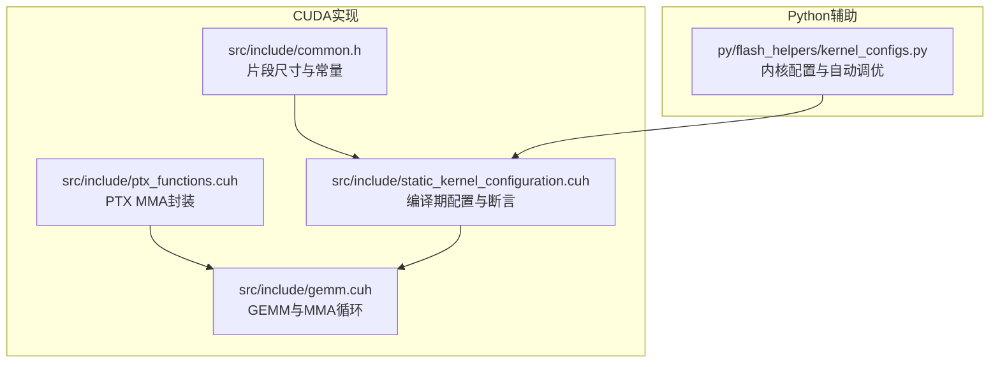
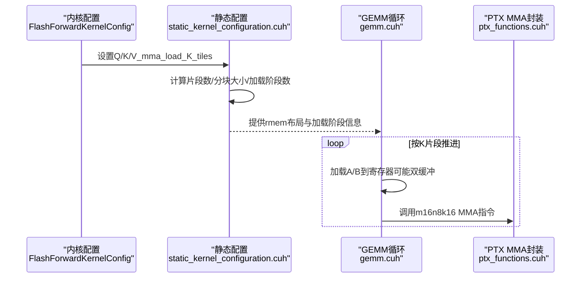
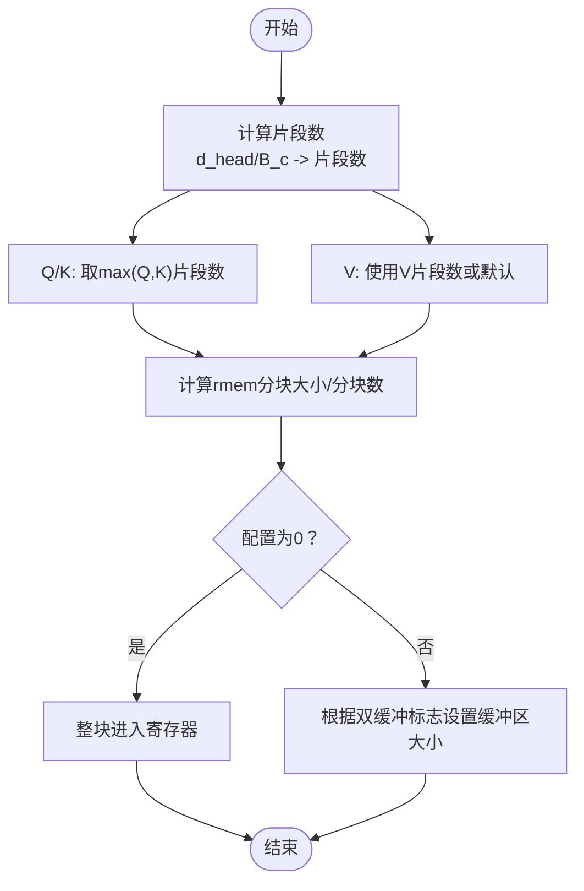
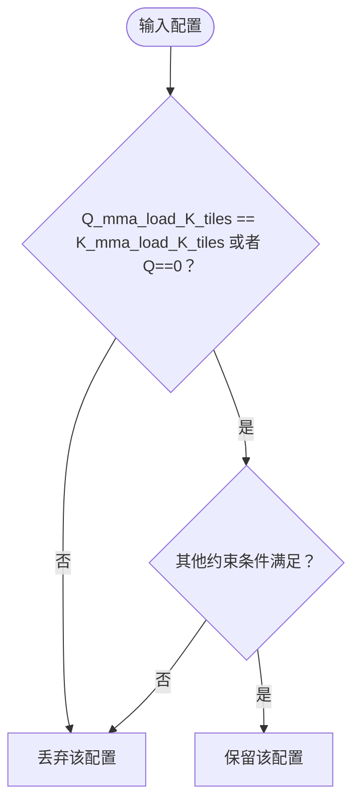
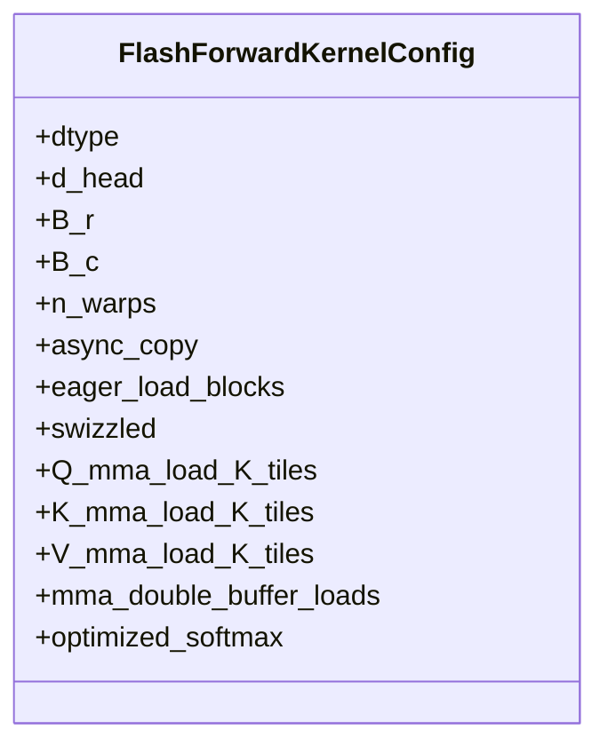
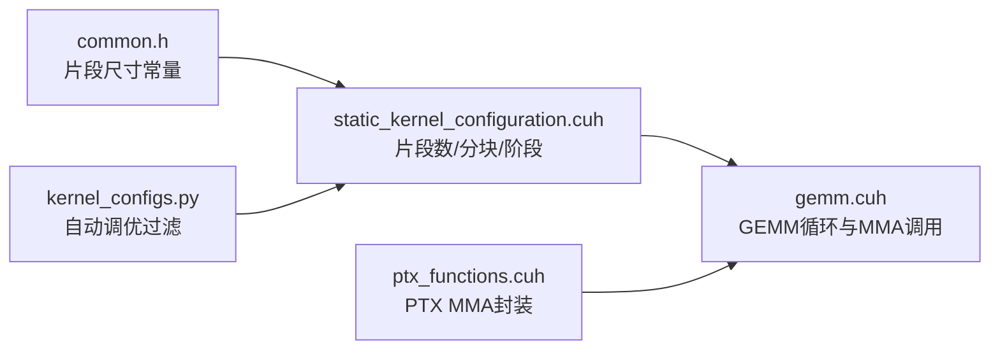

# MMA加载瓦片配置

<cite>
**本文引用的文件列表**
- [src/include/gemm.cuh](file://src/include/gemm.cuh)
- [src/include/ptx_functions.cuh](file://src/include/ptx_functions.cuh)
- [src/include/static_kernel_configuration.cuh](file://src/include/static_kernel_configuration.cuh)
- [src/include/common.h](file://src/include/common.h)
- [py/flash_helpers/kernel_configs.py](file://py/flash_helpers/kernel_configs.py)
</cite>

## 目录
1. [简介](#简介)
2. [项目结构](#项目结构)
3. [核心组件](#核心组件)
4. [架构总览](#架构总览)
5. [详细组件分析](#详细组件分析)
6. [依赖分析](#依赖分析)
7. [性能考量](#性能考量)
8. [故障排查指南](#故障排查指南)
9. [结论](#结论)

## 简介
本文件围绕张量核心（Tensor Cores）在GEMM路径中的MMA指令调用与数据重用策略，系统阐述Q_mma_load_K_tiles、K_mma_load_K_tiles与V_mma_load_K_tiles三个配置参数如何控制K维度的加载瓦片数量，并结合源码中的静态配置与自动调优逻辑，给出优化这些参数以最大化吞吐量的实践指导。重点包括：
- 参数在编译期如何映射为片段数与寄存器内存（rmem）分块大小
- GEMM循环如何按K片段推进并驱动MMA调用
- 自动调优时Q/K之间必须满足的约束条件
- 如何通过参数组合提升访存与计算并行度

## 项目结构
本仓库包含CUDA内核实现与Python辅助脚本两部分：
- CUDA侧：定义了GEMM与MMA调用、寄存器内存布局、片段尺寸常量等
- Python侧：定义了内核配置数据类与自动调优过滤规则



图表来源
- [src/include/common.h](file://src/include/common.h#L26-L40)
- [src/include/ptx_functions.cuh](file://src/include/ptx_functions.cuh#L47-L77)
- [src/include/gemm.cuh](file://src/include/gemm.cuh#L13-L23)
- [src/include/static_kernel_configuration.cuh](file://src/include/static_kernel_configuration.cuh#L13-L35)
- [py/flash_helpers/kernel_configs.py](file://py/flash_helpers/kernel_configs.py#L106-L147)

章节来源
- [src/include/common.h](file://src/include/common.h#L26-L40)
- [src/include/ptx_functions.cuh](file://src/include/ptx_functions.cuh#L47-L77)
- [src/include/gemm.cuh](file://src/include/gemm.cuh#L13-L23)
- [src/include/static_kernel_configuration.cuh](file://src/include/static_kernel_configuration.cuh#L13-L35)
- [py/flash_helpers/kernel_configs.py](file://py/flash_helpers/kernel_configs.py#L106-L147)

## 核心组件
- 片段尺寸与常量
  - 片段行列尺寸由常量决定，用于将d_head与B_c等维度映射到片段数，进而确定K方向的加载瓦片数量
- PTX MMA封装
  - 提供m16n8k16的mma同步指令封装，作为GEMM内部调用的基础
- GEMM与MMA循环
  - 通过迭代K片段推进，驱动每轮MMA执行；支持双缓冲加载以隐藏访存延迟
- 编译期静态配置
  - 将配置参数转换为片段数、rmem分块大小、加载阶段数等，并进行有效性断言
- Python自动调优
  - 定义内核配置数据类与should_autotune_config过滤规则，约束Q/K/V的加载瓦片关系

章节来源
- [src/include/common.h](file://src/include/common.h#L26-L40)
- [src/include/ptx_functions.cuh](file://src/include/ptx_functions.cuh#L47-L77)
- [src/include/gemm.cuh](file://src/include/gemm.cuh#L41-L87)
- [src/include/static_kernel_configuration.cuh](file://src/include/static_kernel_configuration.cuh#L68-L102)
- [py/flash_helpers/kernel_configs.py](file://py/flash_helpers/kernel_configs.py#L106-L147)

## 架构总览
下图展示了从配置参数到MMA执行的关键路径：配置参数经编译期转换为片段数与rmem分块，再驱动GEMM循环按K片段推进，最终调用PTX MMA指令。



图表来源
- [src/include/static_kernel_configuration.cuh](file://src/include/static_kernel_configuration.cuh#L68-L102)
- [src/include/gemm.cuh](file://src/include/gemm.cuh#L96-L123)
- [src/include/ptx_functions.cuh](file://src/include/ptx_functions.cuh#L47-L77)
- [py/flash_helpers/kernel_configs.py](file://py/flash_helpers/kernel_configs.py#L106-L147)

## 详细组件分析

### 参数与片段映射：Q/K/V_mma_load_K_tiles
- 片段尺寸常量
  - 行列片段尺寸均为8，决定了K方向的片段粒度
- 片段数计算
  - d_head与B_c等维度被映射为片段数，再与配置的K片段数取最大值或默认值，得到实际加载片段数
  - 对于Q/K，使用两者中的较大值；对于V，使用其自身配置或默认值
- rmem分块与缓冲
  - 基于加载片段数与总片段数，计算rmem分块大小与缓冲区大小（当配置为0时，表示整块进入寄存器）



图表来源
- [src/include/common.h](file://src/include/common.h#L36-L40)
- [src/include/static_kernel_configuration.cuh](file://src/include/static_kernel_configuration.cuh#L68-L102)

章节来源
- [src/include/common.h](file://src/include/common.h#L36-L40)
- [src/include/static_kernel_configuration.cuh](file://src/include/static_kernel_configuration.cuh#L68-L102)

### GEMM循环与MMA调用模式
- 循环推进
  - GEMM循环按K片段推进，每轮对齐当前片段范围内的A/B进行MMA累积
- 双缓冲加载
  - 当A/B未整块进入寄存器且配置为双缓冲时，提前加载下一组片段，隐藏访存延迟
- MMA调用
  - 每次循环调用m16n8k16的mma同步指令，完成16×8×16的矩阵乘加

```mermaid
sequenceDiagram
participant Loop as "GEMM循环"
participant Load as "加载阶段"
participant MMA as "MMA调用"
Loop->>Loop : 迭代K片段
alt 需要加载
Loop->>Load : 加载A/B到寄存器可双缓冲
end
Loop->>MMA : 执行m16n8k16 MMA
Loop-->>Loop : 下一K片段
```

图表来源
- [src/include/gemm.cuh](file://src/include/gemm.cuh#L96-L123)
- [src/include/ptx_functions.cuh](file://src/include/ptx_functions.cuh#L47-L77)

章节来源
- [src/include/gemm.cuh](file://src/include/gemm.cuh#L96-L123)
- [src/include/ptx_functions.cuh](file://src/include/ptx_functions.cuh#L47-L77)

### Q/K加载瓦片约束：should_autotune_config
- 关键约束
  - Q/K的加载瓦片数必须相等，或Q为0（表示使用默认值）
  - 其他条件会根据B_r、B_c、n_warps等进一步筛选是否参与自动调优
- 设计意图
  - 保证Q与K在K维度上的加载步调一致，避免寄存器/缓存资源错配导致的吞吐下降



图表来源
- [py/flash_helpers/kernel_configs.py](file://py/flash_helpers/kernel_configs.py#L364-L387)

章节来源
- [py/flash_helpers/kernel_configs.py](file://py/flash_helpers/kernel_configs.py#L364-L387)

### 类型与数据模型


图表来源
- [py/flash_helpers/kernel_configs.py](file://py/flash_helpers/kernel_configs.py#L106-L147)

章节来源
- [py/flash_helpers/kernel_configs.py](file://py/flash_helpers/kernel_configs.py#L106-L147)

## 依赖分析
- 片段尺寸依赖
  - 片段尺寸常量直接影响K方向的片段粒度，从而决定Q/K/V的加载片段数
- 静态配置依赖
  - 编译期断言确保加载片段数合法，且Q/K加载片段数需满足相等或Q为0
- GEMM依赖
  - GEMM循环依赖静态配置提供的rmem分块与加载阶段信息，按K片段推进并调用PTX MMA



图表来源
- [src/include/common.h](file://src/include/common.h#L36-L40)
- [src/include/static_kernel_configuration.cuh](file://src/include/static_kernel_configuration.cuh#L13-L35)
- [src/include/gemm.cuh](file://src/include/gemm.cuh#L96-L123)
- [src/include/ptx_functions.cuh](file://src/include/ptx_functions.cuh#L47-L77)
- [py/flash_helpers/kernel_configs.py](file://py/flash_helpers/kernel_configs.py#L364-L387)

章节来源
- [src/include/common.h](file://src/include/common.h#L36-L40)
- [src/include/static_kernel_configuration.cuh](file://src/include/static_kernel_configuration.cuh#L13-L35)
- [src/include/gemm.cuh](file://src/include/gemm.cuh#L96-L123)
- [src/include/ptx_functions.cuh](file://src/include/ptx_functions.cuh#L47-L77)
- [py/flash_helpers/kernel_configs.py](file://py/flash_helpers/kernel_configs.py#L364-L387)

## 性能考量
- 合理设置Q/K/V_mma_load_K_tiles
  - 当配置为0时，表示整块进入寄存器，适合较小的d_head或B_c，减少rmem分块带来的额外开销
  - 当配置非0时，应与双缓冲配合，以隐藏访存延迟并提高访存带宽利用率
- Q/K一致性
  - 保持Q与K的加载片段数一致，可避免寄存器/缓存资源错配，提升吞吐稳定性
- 片段粒度与寄存器压力
  - 片段越小，分块越多，寄存器压力越大；需结合n_warps与B_r/B_c综合评估
- 自动调优建议
  - 在B_r=64场景下，某些组合会被过滤；在B_r=128场景下，Q为0会被过滤
  - 结合optimized_softmax与buffer选项，可在不同硬件上获得更佳性能

章节来源
- [src/include/static_kernel_configuration.cuh](file://src/include/static_kernel_configuration.cuh#L13-L35)
- [py/flash_helpers/kernel_configs.py](file://py/flash_helpers/kernel_configs.py#L364-L387)

## 故障排查指南
- 断言失败：加载片段数不合法
  - 检查Q/K/V_mma_load_K_tiles是否为2的幂且大于1，且不超过上限
- Q/K不一致
  - 若Q_mma_load_K_tiles与K_mma_load_K_tiles不相等且Q非0，则会被自动调优过滤掉
- 寄存器溢出
  - 当B_c=32且Q为0时，在特定n_warps下会被过滤；当B_c=64且Q非0时也会被过滤
  - 建议调整B_r/B_c或n_warps，或尝试Q/K/V均设为0以整块进入寄存器

章节来源
- [src/include/static_kernel_configuration.cuh](file://src/include/static_kernel_configuration.cuh#L13-L35)
- [py/flash_helpers/kernel_configs.py](file://py/flash_helpers/kernel_configs.py#L364-L387)

## 结论
- Q/K/V_mma_load_K_tiles通过编译期映射为片段数与rmem分块，直接决定K维度的加载粒度与数据重用策略
- GEMM循环按K片段推进并调用m16n8k16 MMA，双缓冲加载可有效隐藏访存延迟
- 自动调优要求Q/K加载瓦片数一致或Q为0，这是保证寄存器/缓存资源协调的关键约束
- 实践中应结合B_r/B_c/n_warps与寄存器压力，选择合适的参数组合以最大化吞吐