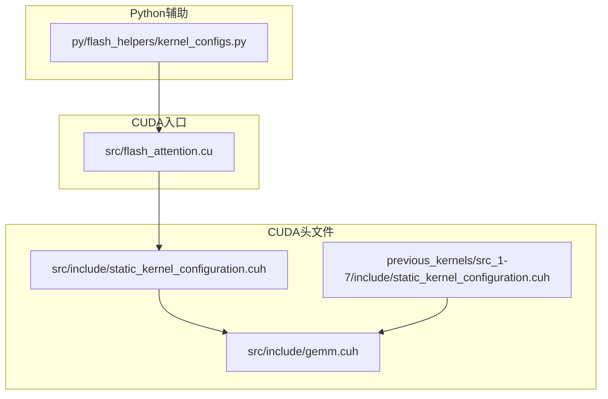
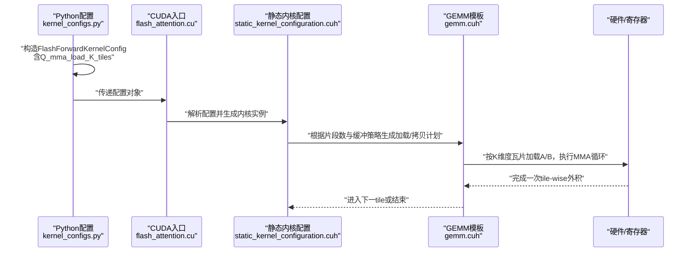
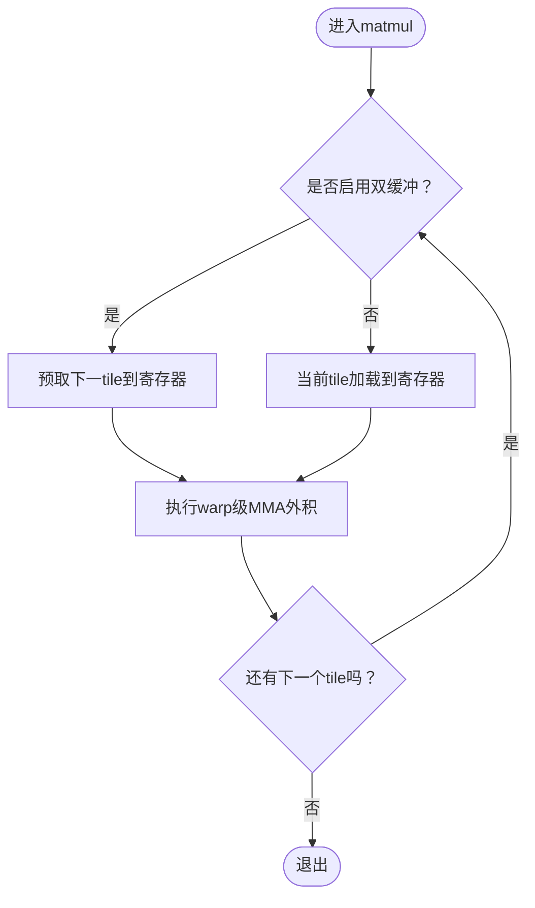
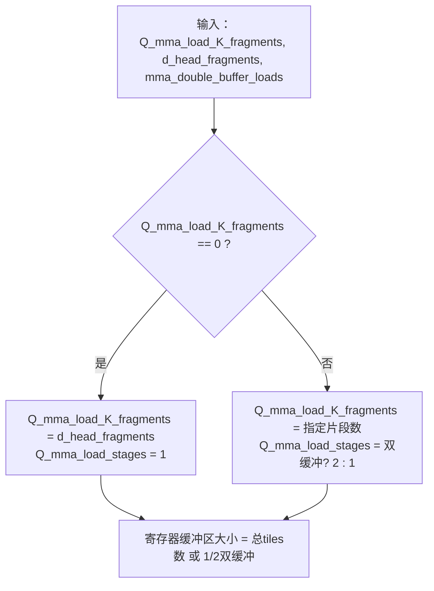
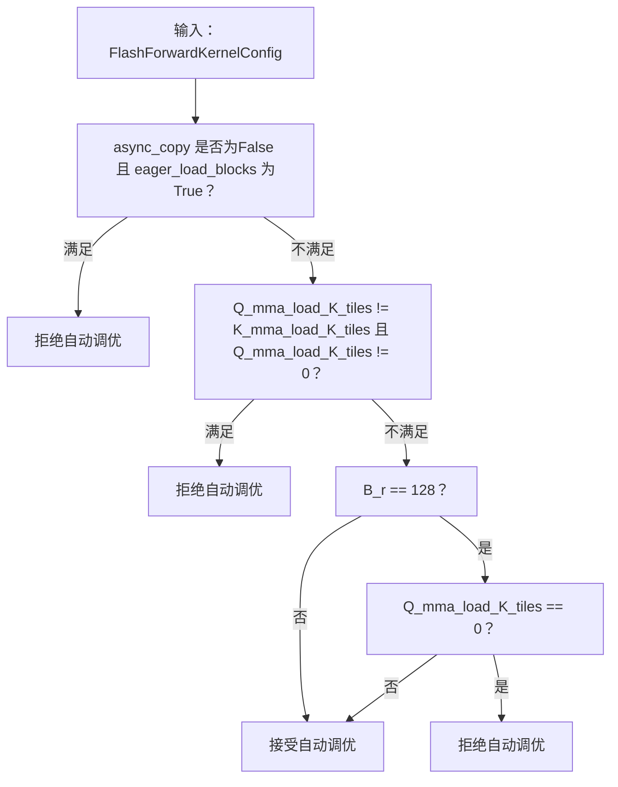
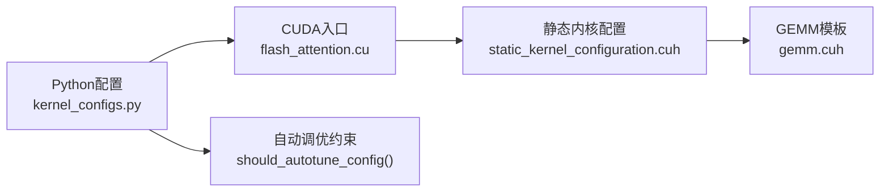

# Q_mma_load_K_tiles配置

<cite>
**本文引用的文件**
- [src/include/gemm.cuh](file://src/include/gemm.cuh)
- [src/include/static_kernel_configuration.cuh](file://src/include/static_kernel_configuration.cuh)
- [py/flash_helpers/kernel_configs.py](file://py/flash_helpers/kernel_configs.py)
- [src/flash_attention.cu](file://src/flash_attention.cu)
- [previous_kernels/src_1-7/include/static_kernel_configuration.cuh](file://previous_kernels/src_1-7/include/static_kernel_configuration.cuh)
</cite>

## 目录
1. [引言](#引言)
2. [项目结构](#项目结构)
3. [核心组件](#核心组件)
4. [架构总览](#架构总览)
5. [详细组件分析](#详细组件分析)
6. [依赖关系分析](#依赖关系分析)
7. [性能考量](#性能考量)
8. [故障排查指南](#故障排查指南)
9. [结论](#结论)
10. [附录](#附录)

## 引言
本文件围绕Q_mma_load_K_tiles参数展开，系统解释其如何控制查询矩阵在张量核心MMA（Matrix Multiply-Accumulate）操作中沿K维度的加载瓦片数量，并结合GEMM模板与静态内核配置，阐明该参数对数据加载模式、寄存器重用策略以及自动调优约束的影响。特别地，我们将基于py/flash_helpers/kernel_configs.py中的should_autotune_config()函数逻辑，说明当B_r为128时该参数必须非零的约束来源，并给出在不同块大小配置下优化该参数以平衡寄存器压力与计算吞吐量的实践建议。

## 项目结构
本仓库包含多版本内核源码与Python辅助工具，其中与Q_mma_load_K_tiles直接相关的关键位置如下：
- CUDA头文件：GEMM模板与静态内核配置
- Python脚本：内核配置数据类与自动调优逻辑
- CUDA入口：将Python配置映射到内核参数

图表来源
- [src/include/gemm.cuh](file://src/include/gemm.cuh#L1-L126)
- [src/include/static_kernel_configuration.cuh](file://src/include/static_kernel_configuration.cuh#L1-L294)
- [previous_kernels/src_1-7/include/static_kernel_configuration.cuh](file://previous_kernels/src_1-7/include/static_kernel_configuration.cuh#L62-L143)
- [py/flash_helpers/kernel_configs.py](file://py/flash_helpers/kernel_configs.py#L102-L164)
- [src/flash_attention.cu](file://src/flash_attention.cu#L16-L32)

章节来源
- [src/include/gemm.cuh](file://src/include/gemm.cuh#L1-L126)
- [src/include/static_kernel_configuration.cuh](file://src/include/static_kernel_configuration.cuh#L1-L294)
- [py/flash_helpers/kernel_configs.py](file://py/flash_helpers/kernel_configs.py#L102-L164)
- [src/flash_attention.cu](file://src/flash_attention.cu#L16-L32)

## 核心组件
- GEMM模板与MMA循环：定义了沿K维度的瓦片化加载与tile-wise外积计算流程，是理解Q_mma_load_K_tiles影响的基础。
- 静态内核配置：将Q_mma_load_K_tiles等配置转换为运行时的片段数、缓冲区大小与加载阶段数，决定寄存器重用与内存带宽利用。
- Python内核配置与自动调优：提供配置数据类与should_autotune_config()约束，明确在特定块大小组合下的参数取值要求。

章节来源
- [src/include/gemm.cuh](file://src/include/gemm.cuh#L24-L123)
- [src/include/static_kernel_configuration.cuh](file://src/include/static_kernel_configuration.cuh#L37-L102)
- [py/flash_helpers/kernel_configs.py](file://py/flash_helpers/kernel_configs.py#L106-L164)

## 架构总览
下图展示了从Python配置到CUDA内核执行的关键路径，以及Q_mma_load_K_tiles在各层的作用点。

图表来源
- [py/flash_helpers/kernel_configs.py](file://py/flash_helpers/kernel_configs.py#L106-L164)
- [src/flash_attention.cu](file://src/flash_attention.cu#L16-L32)
- [src/include/static_kernel_configuration.cuh](file://src/include/static_kernel_configuration.cuh#L104-L171)
- [src/include/gemm.cuh](file://src/include/gemm.cuh#L96-L123)

## 详细组件分析

### GEMM模板与K维度瓦片加载
- GEMM::matmul负责遍历Tiles并按需加载A、B至寄存器，随后调用warp_fragment_mma_f32_accum执行tile-wise外积。
- 当A或B未整块加载到寄存器时，会根据当前tile与双缓冲策略决定何时加载下一组tile，从而影响寄存器重用与流水线效率。
- 该流程体现了K维度瓦片化的思想：每次处理一个tile，内部通过MMA指令完成多个片段的乘加累积。

图表来源
- [src/include/gemm.cuh](file://src/include/gemm.cuh#L96-L123)

章节来源
- [src/include/gemm.cuh](file://src/include/gemm.cuh#L24-L123)

### 静态内核配置中的K维度片段数与缓冲策略
- 片段数转换：当Q_mma_load_K_fragments为0时，表示沿K维度采用整块加载；否则按指定片段数进行分片加载。
- 缓冲策略：若启用双缓冲且存在分片加载，则加载阶段数为2；否则为1。这直接影响寄存器中同时驻留的tile数量与重用周期。
- 寄存器缓冲区大小：当K维度分片加载时，RMEM缓冲区大小由“总tiles数”与“双缓冲标志”共同决定，进而影响寄存器压力。

图表来源
- [src/include/static_kernel_configuration.cuh](file://src/include/static_kernel_configuration.cuh#L68-L102)
- [previous_kernels/src_1-7/include/static_kernel_configuration.cuh](file://previous_kernels/src_1-7/include/static_kernel_configuration.cuh#L62-L87)

章节来源
- [src/include/static_kernel_configuration.cuh](file://src/include/static_kernel_configuration.cuh#L68-L102)
- [previous_kernels/src_1-7/include/static_kernel_configuration.cuh](file://previous_kernels/src_1-7/include/static_kernel_configuration.cuh#L62-L87)

### Python配置与自动调优约束
- 配置数据类：包含Q_mma_load_K_tiles字段，并提供短格式字符串与C++结构体输出，便于内核名称解析与构建。
- 自动调优约束：should_autotune_config()对参数组合施加多项约束，其中当B_r为128时，要求Q_mma_load_K_tiles非零，否则不参与自动调优。

图表来源
- [py/flash_helpers/kernel_configs.py](file://py/flash_helpers/kernel_configs.py#L364-L387)

章节来源
- [py/flash_helpers/kernel_configs.py](file://py/flash_helpers/kernel_configs.py#L106-L164)
- [py/flash_helpers/kernel_configs.py](file://py/flash_helpers/kernel_configs.py#L364-L387)

### 参数对数据加载模式与寄存器重用的影响
- 整块加载（Q_mma_load_K_fragments为0）：寄存器中一次性持有全部d_head方向的数据，减少跨tile切换开销，但增加寄存器占用；适合d_head较小或寄存器充足的场景。
- 分片加载（Q_mma_load_K_fragments大于0）：按片段数分批加载，降低单次寄存器占用，提高寄存器复用率；但需要更精细的双缓冲与流水调度，避免流水停顿。
- 双缓冲策略：在分片加载场景下启用双缓冲可将“加载下一tile”与“执行当前tile”的MMA阶段重叠，提升吞吐；但会增加寄存器中同时驻留的tile数量，带来更高的寄存器压力。

章节来源
- [src/include/static_kernel_configuration.cuh](file://src/include/static_kernel_configuration.cuh#L68-L102)
- [src/include/gemm.cuh](file://src/include/gemm.cuh#L96-L123)

### B_r=128时Q_mma_load_K_tiles必须非零的约束来源
- 该约束来自should_autotune_config()中的显式判断：当B_r为128时，若Q_mma_load_K_tiles为0，则直接拒绝自动调优。
- 这意味着在该块大小配置下，必须采用分片加载策略（即Q_mma_load_K_fragments非零），以确保内核能够正确地进行寄存器重用与流水调度，避免寄存器压力过大导致性能退化。

章节来源
- [py/flash_helpers/kernel_configs.py](file://py/flash_helpers/kernel_configs.py#L382-L384)

### 在不同块大小配置下优化Q_mma_load_K_tiles的实践指导
- 块大小组合选择：
  - B_r=128：必须设置Q_mma_load_K_tiles非零（分片加载）。优先尝试较小片段数以降低寄存器压力，再逐步增大以观察吞吐提升。
  - B_r=64：可灵活选择整块或分片加载。若寄存器紧张，优先分片加载；若寄存器充足，可考虑整块加载以减少切换开销。
- 寄存器压力与吞吐权衡：
  - 小片段数：降低单次寄存器占用，提高复用率，适合d_head较大或寄存器受限场景。
  - 大片段数：减少加载次数，提升吞吐，但可能增加寄存器峰值占用。
- 双缓冲策略：
  - 在分片加载场景下启用双缓冲可显著提升吞吐；但需评估寄存器峰值，必要时减小片段数或降低n_warps。
- 自动调优范围：
  - 可参考get_autotuning_kernel_configs()中对Q_mma_load_K_tiles的候选集合（如0与2），结合具体硬件与数据形状进行微调。

章节来源
- [py/flash_helpers/kernel_configs.py](file://py/flash_helpers/kernel_configs.py#L389-L402)
- [py/flash_helpers/kernel_configs.py](file://py/flash_helpers/kernel_configs.py#L426-L455)

## 依赖关系分析
- Python配置到CUDA入口：Python侧构造FlashForwardKernelConfig并通过flash_attention.cu传入内核，作为后续静态配置与GEMM模板的输入。
- 静态配置到GEMM模板：静态内核配置将Q_mma_load_K_tiles转换为片段数与缓冲策略，驱动GEMM模板的加载与计算循环。
- 约束到参数空间：should_autotune_config()限制了参数组合的有效性，确保在特定块大小下采用合理的加载策略。

图表来源
- [py/flash_helpers/kernel_configs.py](file://py/flash_helpers/kernel_configs.py#L106-L164)
- [src/flash_attention.cu](file://src/flash_attention.cu#L16-L32)
- [src/include/static_kernel_configuration.cuh](file://src/include/static_kernel_configuration.cuh#L104-L171)
- [src/include/gemm.cuh](file://src/include/gemm.cuh#L96-L123)

章节来源
- [py/flash_helpers/kernel_configs.py](file://py/flash_helpers/kernel_configs.py#L364-L387)
- [src/flash_attention.cu](file://src/flash_attention.cu#L16-L32)
- [src/include/static_kernel_configuration.cuh](file://src/include/static_kernel_configuration.cuh#L104-L171)
- [src/include/gemm.cuh](file://src/include/gemm.cuh#L96-L123)

## 性能考量
- 寄存器压力：分片加载可降低峰值寄存器占用，但需要更精细的流水与双缓冲策略；整块加载简化流水但增加峰值占用。
- 吞吐提升：双缓冲与合适的片段数可提升MMA利用率；但在B_r=128等配置下，必须采用分片加载以满足约束。
- 数据局部性：合理设置B_r、B_c与n_warps，配合Q_mma_load_K_tiles，可在寄存器与全局内存之间取得平衡。

## 故障排查指南
- 自动调优被拒绝：
  - 检查B_r是否为128且Q_mma_load_K_tiles是否为0；若是，则需将其设为非零。
  - 检查Q_mma_load_K_tiles与K_mma_load_K_tiles是否不相等且均非零；若不满足，应统一或至少使Q_mma_load_K_tiles为0。
- 寄存器溢出：
  - 减小Q_mma_load_K_fragments（增大片段尺寸），或降低n_warps，或关闭双缓冲。
- 吞吐不足：
  - 在分片加载场景下启用双缓冲；适当增大片段数以减少加载次数；检查B_r、B_c与n_warps组合是否合理。

章节来源
- [py/flash_helpers/kernel_configs.py](file://py/flash_helpers/kernel_configs.py#L364-L387)
- [src/include/static_kernel_configuration.cuh](file://src/include/static_kernel_configuration.cuh#L68-L102)

## 结论
Q_mma_load_K_tiles通过控制查询矩阵沿K维度的加载瓦片数量，直接影响寄存器重用策略与MMA流水效率。在B_r=128的块大小下，该参数必须非零，以确保采用分片加载策略并满足自动调优约束。实践中，应在寄存器压力与计算吞吐之间权衡，结合双缓冲与片段数调整，针对不同块大小组合进行精细化调优。

## 附录
- 关键实现路径参考：
  - GEMM模板与MMA循环：[src/include/gemm.cuh](file://src/include/gemm.cuh#L96-L123)
  - 片段数与缓冲策略：[src/include/static_kernel_configuration.cuh](file://src/include/static_kernel_configuration.cuh#L68-L102)
  - Python配置与自动调优：[py/flash_helpers/kernel_configs.py](file://py/flash_helpers/kernel_configs.py#L106-L164), [py/flash_helpers/kernel_configs.py](file://py/flash_helpers/kernel_configs.py#L364-L387)
  - CUDA入口与配置传递：[src/flash_attention.cu](file://src/flash_attention.cu#L16-L32)