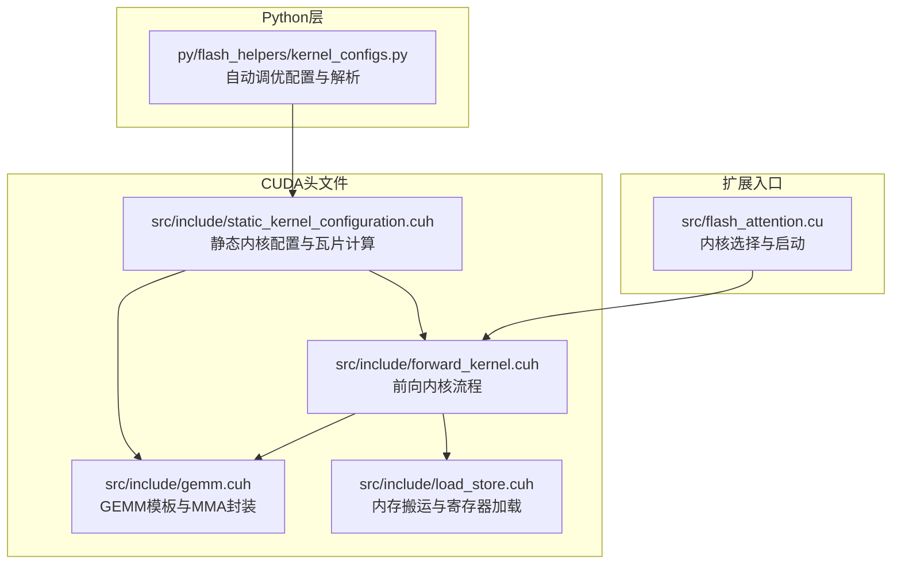
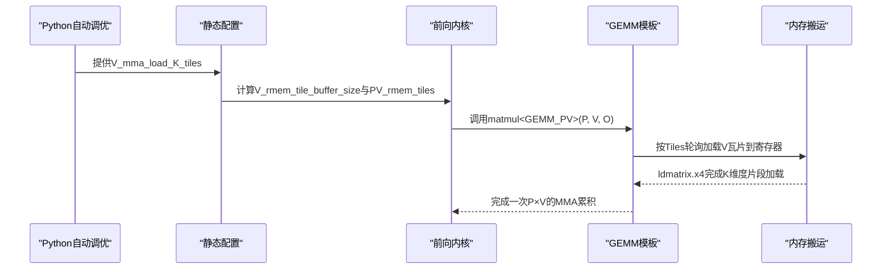
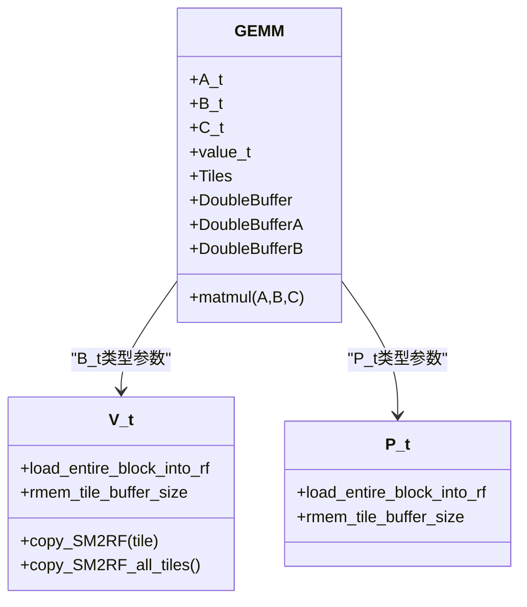
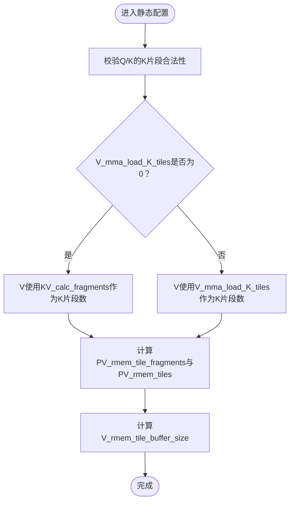
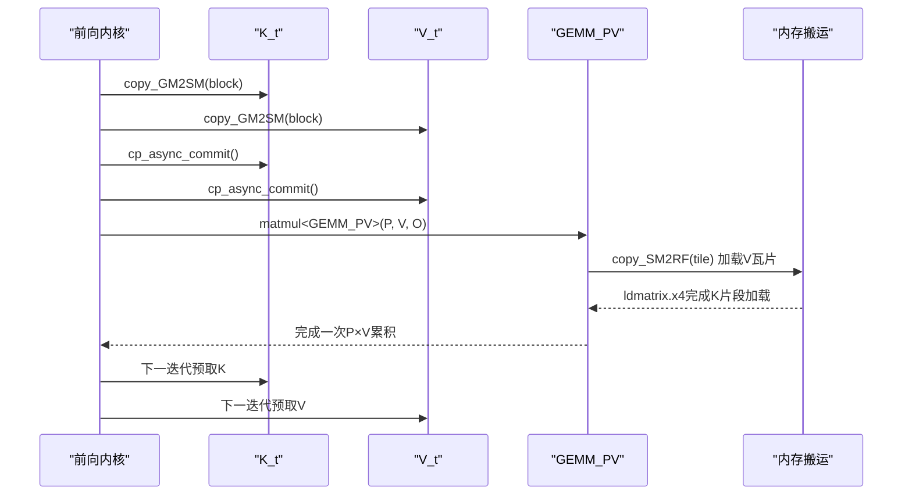
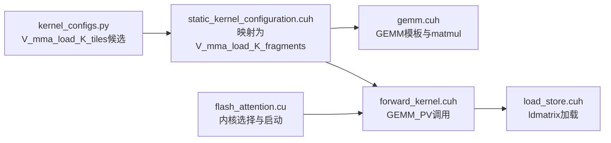

# V_mma_load_K_tiles配置

<cite>
**本文引用的文件**
- [src/include/gemm.cuh](file://src/include/gemm.cuh)
- [src/include/static_kernel_configuration.cuh](file://src/include/static_kernel_configuration.cuh)
- [src/include/forward_kernel.cuh](file://src/include/forward_kernel.cuh)
- [src/include/load_store.cuh](file://src/include/load_store.cuh)
- [py/flash_helpers/kernel_configs.py](file://py/flash_helpers/kernel_configs.py)
- [src/flash_attention.cu](file://src/flash_attention.cu)
</cite>

## 目录
1. [简介](#简介)
2. [项目结构](#项目结构)
3. [核心组件](#核心组件)
4. [架构总览](#架构总览)
5. [详细组件分析](#详细组件分析)
6. [依赖关系分析](#依赖关系分析)
7. [性能考量](#性能考量)
8. [故障排查指南](#故障排查指南)
9. [结论](#结论)
10. [附录](#附录)

## 简介
本文件围绕V_mma_load_K_tiles参数展开，系统阐述其如何通过GEMM模板的B_t类型参数传递机制，控制值矩阵在张量核心MMA操作中K维度的加载瓦片数量；并结合自动调优配置空间，解释该参数与Q/K参数的独立性以及在不同硬件架构下的优化策略。最后给出在高序列长度场景下调参以提升PV矩阵乘法性能的实战建议。

## 项目结构
本仓库采用“头文件驱动”的CUDA内核实现，核心逻辑集中在以下头文件：
- GEMM与张量核心MMA封装：src/include/gemm.cuh
- 静态内核配置与瓦片划分：src/include/static_kernel_configuration.cuh
- 前向内核流程与KV循环：src/include/forward_kernel.cuh
- 内存拷贝、寄存器与共享内存搬运：src/include/load_store.cuh
- Python侧自动调优配置与解析：py/flash_helpers/kernel_configs.py
- 扩展入口与内核选择：src/flash_attention.cu

图表来源
- [src/include/gemm.cuh](file://src/include/gemm.cuh#L1-L126)
- [src/include/static_kernel_configuration.cuh](file://src/include/static_kernel_configuration.cuh#L1-L294)
- [src/include/forward_kernel.cuh](file://src/include/forward_kernel.cuh#L1-L207)
- [src/include/load_store.cuh](file://src/include/load_store.cuh#L1-L356)
- [py/flash_helpers/kernel_configs.py](file://py/flash_helpers/kernel_configs.py#L1-L486)
- [src/flash_attention.cu](file://src/flash_attention.cu#L1-L150)

章节来源
- [src/include/gemm.cuh](file://src/include/gemm.cuh#L1-L126)
- [src/include/static_kernel_configuration.cuh](file://src/include/static_kernel_configuration.cuh#L1-L294)
- [src/include/forward_kernel.cuh](file://src/include/forward_kernel.cuh#L1-L207)
- [src/include/load_store.cuh](file://src/include/load_store.cuh#L1-L356)
- [py/flash_helpers/kernel_configs.py](file://py/flash_helpers/kernel_configs.py#L1-L486)
- [src/flash_attention.cu](file://src/flash_attention.cu#L1-L150)

## 核心组件
- GEMM模板与MMA封装：定义了A/B/C张量类型、value_t累加精度、双缓冲策略，并提供基于张量视图的warp级MMA累积函数。
- 静态内核配置：将V_mma_load_K_tiles映射为V_t的寄存器缓存瓦片数，决定每次MMA迭代加载的K片段数量。
- 前向内核流程：在KV块循环中，先进行QK→S的GEMM，再进行P×V→O的GEMM；V_mma_load_K_tiles直接影响第二个GEMM的K维度加载策略。
- 内存搬运：提供GM2SM/SM2GM异步与同步拷贝、ldmatrix寄存器加载、RF2SM写回等机制，支撑瓦片化数据流。

章节来源
- [src/include/gemm.cuh](file://src/include/gemm.cuh#L1-L126)
- [src/include/static_kernel_configuration.cuh](file://src/include/static_kernel_configuration.cuh#L1-L294)
- [src/include/forward_kernel.cuh](file://src/include/forward_kernel.cuh#L1-L207)
- [src/include/load_store.cuh](file://src/include/load_store.cuh#L1-L356)

## 架构总览
V_mma_load_K_tiles通过如下链路影响值矩阵加载与MMA执行：
- Python自动调优配置生成器定义V_mma_load_K_tiles候选集；
- 静态配置将V_mma_load_K_tiles转换为V_t的寄存器缓存瓦片数；
- 前向内核在每个KV块中调用matmul<GEMM_PV>，其中GEMM模板根据Tiles和双缓冲策略调度加载；
- load_store.cuh中的寄存器加载函数按瓦片粒度从共享内存搬入寄存器，形成最终的MMA指令序列。

图表来源
- [py/flash_helpers/kernel_configs.py](file://py/flash_helpers/kernel_configs.py#L389-L424)
- [src/include/static_kernel_configuration.cuh](file://src/include/static_kernel_configuration.cuh#L68-L102)
- [src/include/forward_kernel.cuh](file://src/include/forward_kernel.cuh#L42-L83)
- [src/include/gemm.cuh](file://src/include/gemm.cuh#L90-L123)
- [src/include/load_store.cuh](file://src/include/load_store.cuh#L203-L282)

## 详细组件分析

### 组件A：GEMM模板与B_t类型参数传递
- GEMM模板通过类型别名A_t/B_t/C_t与value_t确定输入/输出数据类型与累加精度。
- matmul函数根据GEMM::Tiles与双缓冲策略，按K维度瓦片推进，每轮先加载对应tile的A/B，再执行warp_fragment_mma_f32_accum。
- B_t（即V_t）的load_entire_block_into_rf与rmem_tile_buffer_size由静态配置决定，从而间接受V_mma_load_K_tiles影响。

图表来源
- [src/include/gemm.cuh](file://src/include/gemm.cuh#L24-L123)
- [src/include/static_kernel_configuration.cuh](file://src/include/static_kernel_configuration.cuh#L234-L261)

章节来源
- [src/include/gemm.cuh](file://src/include/gemm.cuh#L24-L123)

### 组件B：静态配置与V_mma_load_K_tiles映射
- 静态配置中，V_mma_load_K_fragments由V_mma_load_K_tiles转换而来，若为0则退化为KV_calc_fragments（即整个B_c方向的K瓦片数）。
- PV_rmem_tile_fragments与PV_rmem_tiles据此计算，进而决定V_t的寄存器缓存瓦片数与双缓冲阶段数。
- valid_config断言确保V_mma_load_K_tiles合法且与Q/K的K片段策略保持一致性（当Q/K的K片段非零时，要求Q/K与V的K片段一致或V为全量）。

图表来源
- [src/include/static_kernel_configuration.cuh](file://src/include/static_kernel_configuration.cuh#L13-L35)
- [src/include/static_kernel_configuration.cuh](file://src/include/static_kernel_configuration.cuh#L68-L102)

章节来源
- [src/include/static_kernel_configuration.cuh](file://src/include/static_kernel_configuration.cuh#L13-L35)
- [src/include/static_kernel_configuration.cuh](file://src/include/static_kernel_configuration.cuh#L68-L102)

### 组件C：前向内核流程与PV矩阵乘法
- 前向内核在每个KV块中先执行QK→S的GEMM，随后进行在线softmax，再将S转换为P并执行P×V→O的GEMM。
- 在P×V阶段，V_t的load_entire_block_into_rf与rmem_tile_buffer_size决定是否整块加载以及加载阶段数，这直接由V_mma_load_K_tiles在静态配置中决定。
- 异步拷贝与同步屏障保证V加载与K加载的流水线重叠，避免阻塞。

图表来源
- [src/include/forward_kernel.cuh](file://src/include/forward_kernel.cuh#L42-L83)
- [src/include/gemm.cuh](file://src/include/gemm.cuh#L90-L123)
- [src/include/load_store.cuh](file://src/include/load_store.cuh#L203-L282)

章节来源
- [src/include/forward_kernel.cuh](file://src/include/forward_kernel.cuh#L42-L83)

### 组件D：Python自动调优配置空间
- 自动调优配置包含V_mma_load_K_tiles候选集，同时固定其他关键参数（如B_r、B_c、n_warps、async_copy、eager_load_blocks、swizzled、mma_double_buffer_loads、optimized_softmax）。
- should_autotune_config对某些组合施加过滤规则，例如要求Q/K的K片段一致或至少一方为全量，以保证寄存器与带宽利用平衡。
- get_kernel_progression_configs提供逐步增加V_mma_load_K_tiles的基线配置，便于对比验证。

章节来源
- [py/flash_helpers/kernel_configs.py](file://py/flash_helpers/kernel_configs.py#L389-L424)
- [py/flash_helpers/kernel_configs.py](file://py/flash_helpers/kernel_configs.py#L364-L387)
- [py/flash_helpers/kernel_configs.py](file://py/flash_helpers/kernel_configs.py#L426-L455)

## 依赖关系分析
- V_mma_load_K_tiles通过静态配置影响V_t的寄存器缓存瓦片数与双缓冲阶段数，从而改变matmul循环中的加载节奏。
- GEMM模板依赖于A_t/B_t的load_entire_block_into_rf与rmem_tile_buffer_size，这些属性由静态配置在构建GSRBlockTensor时注入。
- 前向内核在KV块循环中调用matmul<GEMM_PV>，并在异步拷贝与同步屏障之间穿插，形成流水线。
- Python层负责生成配置并选择具体内核实例，最终由扩展入口调用。

图表来源
- [py/flash_helpers/kernel_configs.py](file://py/flash_helpers/kernel_configs.py#L389-L424)
- [src/include/static_kernel_configuration.cuh](file://src/include/static_kernel_configuration.cuh#L68-L102)
- [src/include/gemm.cuh](file://src/include/gemm.cuh#L90-L123)
- [src/include/forward_kernel.cuh](file://src/include/forward_kernel.cuh#L42-L83)
- [src/include/load_store.cuh](file://src/include/load_store.cuh#L203-L282)
- [src/flash_attention.cu](file://src/flash_attention.cu#L1-L150)

章节来源
- [py/flash_helpers/kernel_configs.py](file://py/flash_helpers/kernel_configs.py#L389-L424)
- [src/include/static_kernel_configuration.cuh](file://src/include/static_kernel_configuration.cuh#L68-L102)
- [src/include/gemm.cuh](file://src/include/gemm.cuh#L90-L123)
- [src/include/forward_kernel.cuh](file://src/include/forward_kernel.cuh#L42-L83)
- [src/include/load_store.cuh](file://src/include/load_store.cuh#L203-L282)
- [src/flash_attention.cu](file://src/flash_attention.cu#L1-L150)

## 性能考量
- K维度加载瓦片数与寄存器压力：增大V_mma_load_K_tiles可减少加载阶段数，但会提高寄存器占用；需与mma_double_buffer_loads配合，避免寄存器溢出。
- 与Q/K的独立性：当Q/K的K片段非零时，应与Q/K保持一致或至少一方为全量，以避免寄存器与带宽不匹配导致吞吐下降。
- 硬件架构适配：不同SM架构的寄存器/共享内存限制不同，需结合should_autotune_config的过滤规则与实际SMEM使用情况动态选择。
- 高序列长度场景：在长序列下，建议优先尝试非零的V_mma_load_K_tiles，以减少加载阶段并提升带宽利用率；同时评估是否启用双缓冲以隐藏延迟。

## 故障排查指南
- 寄存器不足：若V_mma_load_K_tiles过大导致寄存器溢出，可降低该值或开启mma_double_buffer_loads，或减少n_warps。
- 带宽瓶颈：若V_mma_load_K_tiles过小，加载阶段过多会拖慢整体吞吐；可在满足寄存器约束的前提下适当增大。
- 配置不合法：valid_config断言会拒绝非法组合（如Q/K片段不一致且V非全量），请检查should_autotune_config过滤条件。
- 内核未命中：确保Python层生成的配置存在于forward_kernels映射中，否则扩展入口会报错。

章节来源
- [src/include/static_kernel_configuration.cuh](file://src/include/static_kernel_configuration.cuh#L13-L35)
- [py/flash_helpers/kernel_configs.py](file://py/flash_helpers/kernel_configs.py#L364-L387)
- [src/flash_attention.cu](file://src/flash_attention.cu#L58-L66)

## 结论
V_mma_load_K_tiles通过静态配置将K维度加载瓦片数显式注入到V_t的寄存器缓存策略中，从而影响matmul循环的加载节奏与流水线效率。在自动调优配置空间中，它与Q/K的K片段策略相互独立，但需遵循一致性约束以获得最佳性能。在高序列长度场景下，合理设置V_mma_load_K_tiles并结合双缓冲与异步拷贝，可显著提升PV矩阵乘法的吞吐表现。

## 附录
- 实战案例（高序列长度）：
  - 场景：B_c较大、d_head固定，序列长度很长。
  - 步骤：
    1) 固定B_r、n_warps，尝试V_mma_load_K_tiles从0逐步增加至2；
    2) 启用mma_double_buffer_loads观察寄存器使用与SMEM占用；
    3) 使用get_kernel_progression_configs生成基线配置，对比不同V_mma_load_K_tiles的性能；
    4) 若寄存器紧张，降低V_mma_load_K_tiles或减少n_warps；若带宽受限，适度增大V_mma_load_K_tiles并开启双缓冲。
  - 参考路径：
    - [py/flash_helpers/kernel_configs.py](file://py/flash_helpers/kernel_configs.py#L389-L424)
    - [py/flash_helpers/kernel_configs.py](file://py/flash_helpers/kernel_configs.py#L426-L455)