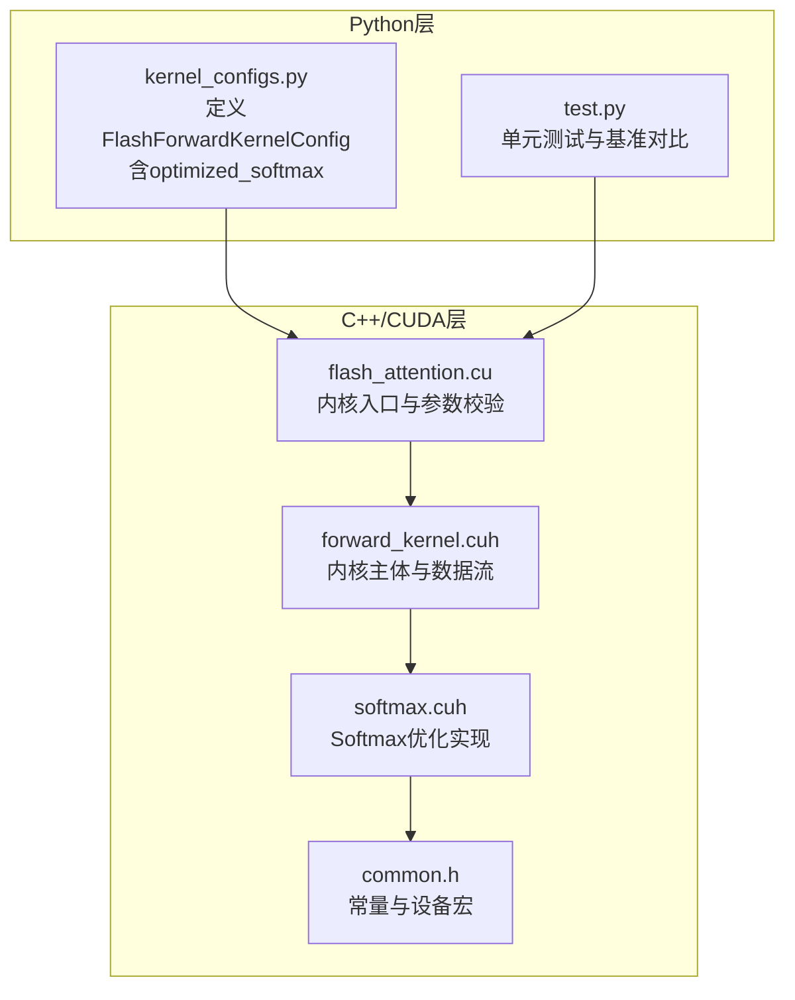
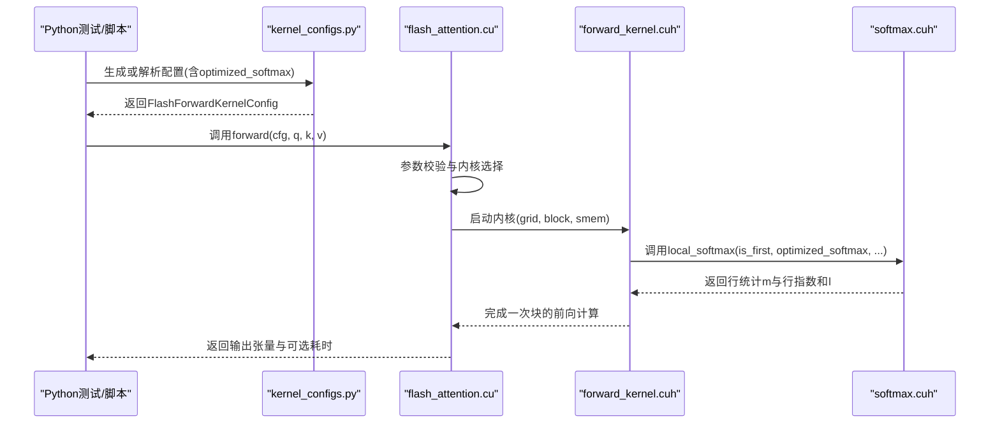
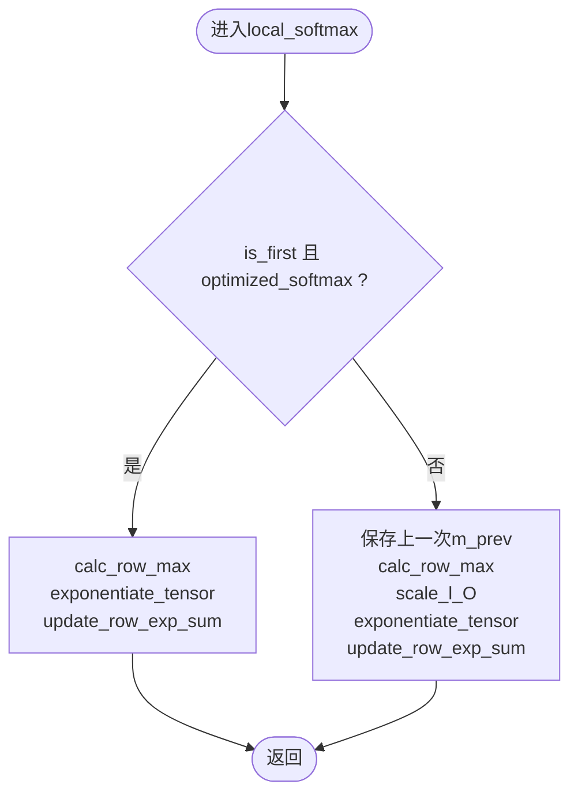
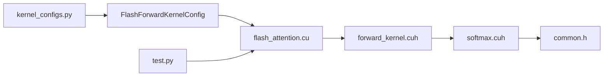

# Softmax优化配置

<cite>
**本文引用的文件列表**
- [softmax.cuh](file://src/include/softmax.cuh)
- [kernel_configs.py](file://py/flash_helpers/kernel_configs.py)
- [flash_attention.cu](file://src/flash_attention.cu)
- [common.h](file://src/include/common.h)
- [forward_kernel.cuh](file://src/include/forward_kernel.cuh)
- [test.py](file://py/flash_helpers/test/test.py)
- [README.md](file://README.md)
</cite>

## 目录
1. [简介](#简介)
2. [项目结构](#项目结构)
3. [核心组件](#核心组件)
4. [架构总览](#架构总览)
5. [详细组件分析](#详细组件分析)
6. [依赖关系分析](#依赖关系分析)
7. [性能考量](#性能考量)
8. [故障排查指南](#故障排查指南)
9. [结论](#结论)
10. [附录](#附录)

## 简介
本文件围绕“optimized_softmax”配置参数展开，系统性解析其在src/include/softmax.cuh中如何启用优化的在线Softmax计算算法，并结合py/flash_helpers/kernel_configs.py中的配置示例，说明该优化在数值稳定性、计算效率、内存访问模式与计算密度方面的改进，以及在长序列处理中的优势。同时给出可操作的对比方法与建议，帮助读者在精度与性能之间做出合理权衡。

## 项目结构
- CUDA前向内核入口位于src/flash_attention.cu，负责将Python侧配置转换为C++内核配置，并调度内核执行。
- Softmax计算逻辑集中在src/include/softmax.cuh，提供行最大值、指数化、行求和与归一化等函数，并通过模板参数控制是否启用优化路径。
- Python侧配置工具位于py/flash_helpers/kernel_configs.py，定义了FlashForwardKernelConfig数据类，包含optimized_softmax字段，并提供多种配置生成与解析方法。
- 常量与设备宏定义位于src/include/common.h，为内核运行提供基础常量（如WARP大小、掩码等）。
- 前向内核主体位于src/include/forward_kernel.cuh，负责组织GEMM、Softmax与PV阶段的数据流与内存布局。

图表来源
- [flash_attention.cu](file://src/flash_attention.cu#L1-L150)
- [forward_kernel.cuh](file://src/include/forward_kernel.cuh#L92-L123)
- [softmax.cuh](file://src/include/softmax.cuh#L1-L130)
- [kernel_configs.py](file://py/flash_helpers/kernel_configs.py#L106-L175)
- [common.h](file://src/include/common.h#L1-L83)

章节来源
- [flash_attention.cu](file://src/flash_attention.cu#L1-L150)
- [forward_kernel.cuh](file://src/include/forward_kernel.cuh#L92-L123)
- [softmax.cuh](file://src/include/softmax.cuh#L1-L130)
- [kernel_configs.py](file://py/flash_helpers/kernel_configs.py#L106-L175)
- [common.h](file://src/include/common.h#L1-L83)

## 核心组件
- 优化开关：FlashForwardKernelConfig包含optimized_softmax布尔字段，用于控制是否启用优化的Softmax路径。
- Softmax优化实现：softmax.cuh中local_softmax模板根据is_first与optimized_softmax分支选择不同的计算流程，以减少重复计算与提高数值稳定性。
- 内核入口与参数传递：flash_attention.cu将Python配置映射到C++结构体，并传入内核执行；内核内部使用softmax_scale进行缩放。
- 配置生成与解析：kernel_configs.py提供多种配置生成器，包括自动调优配置集与进度推进配置集，其中明确包含optimized_softmax选项。

章节来源
- [kernel_configs.py](file://py/flash_helpers/kernel_configs.py#L106-L175)
- [kernel_configs.py](file://py/flash_helpers/kernel_configs.py#L389-L424)
- [kernel_configs.py](file://py/flash_helpers/kernel_configs.py#L426-L455)
- [softmax.cuh](file://src/include/softmax.cuh#L85-L105)
- [flash_attention.cu](file://src/flash_attention.cu#L16-L32)

## 架构总览
下图展示了从Python配置到CUDA内核执行的关键路径，以及Softmax优化在整体流程中的位置。

图表来源
- [test.py](file://py/flash_helpers/test/test.py#L1-L104)
- [kernel_configs.py](file://py/flash_helpers/kernel_configs.py#L389-L424)
- [flash_attention.cu](file://src/flash_attention.cu#L34-L135)
- [forward_kernel.cuh](file://src/include/forward_kernel.cuh#L92-L123)
- [softmax.cuh](file://src/include/softmax.cuh#L85-L105)

## 详细组件分析

### Softmax优化实现与数值稳定性
- 行最大值计算：calc_row_max在每行内计算局部最大值，避免直接对大数做指数运算导致溢出。
- 指数化与中心化：exponentiate_tensor对每个元素按softmax_scale缩放后减去行最大值再指数化，保证数值稳定且便于后续求和。
- 行指数和更新：update_row_exp_sum累加每行指数结果，作为最终归一化因子的一部分。
- 在线归一化：final_softmax_normalization完成warp内的行间归约，得到每行的最终归一化系数并乘回O_accum。

图表来源
- [softmax.cuh](file://src/include/softmax.cuh#L13-L105)

章节来源
- [softmax.cuh](file://src/include/softmax.cuh#L13-L105)

### 优化路径与非优化路径的差异
- 优化路径（optimized_softmax=True且is_first为真）：仅在首次迭代计算行最大值、指数化与行求和，避免重复缩放与累加。
- 非优化路径（optimized_softmax=False或非is_first）：每次迭代先保存上一次行最大值，再根据当前与上一次的最大值差计算缩放因子，对累积的O_accum进行缩放，随后重新指数化与求和，确保数值一致性但增加额外乘法与求和开销。

章节来源
- [softmax.cuh](file://src/include/softmax.cuh#L85-L105)

### Python配置与内核参数传递
- FlashForwardKernelConfig包含optimized_softmax字段，short_form会输出opt_softmax标记，to_cpp_struct会将其作为布尔值传入内核实例化参数。
- flash_attention.cu将Python侧配置转换为C++结构体，并在内核启动时传入，内核内部使用softmax_scale进行缩放。

章节来源
- [kernel_configs.py](file://py/flash_helpers/kernel_configs.py#L106-L175)
- [kernel_configs.py](file://py/flash_helpers/kernel_configs.py#L148-L164)
- [flash_attention.cu](file://src/flash_attention.cu#L16-L32)
- [flash_attention.cu](file://src/flash_attention.cu#L100-L110)

### 内存访问模式与计算密度影响
- 内存访问：forward_kernel.cuh中对Q、K、V的全局内存访问采用块级加载策略，Softmax阶段主要在寄存器与共享内存中进行，减少对全局内存的往返。
- 计算密度：优化的Softmax减少了不必要的缩放与求和步骤，降低指令数量与寄存器占用，提升算术强度；同时配合异步拷贝、预取与双缓冲等特性，进一步提升吞吐。
- 长序列优势：在长序列场景下，优化的Softmax通过减少重复缩放与求和，显著降低累计误差与计算开销，有利于保持精度与性能。

章节来源
- [forward_kernel.cuh](file://src/include/forward_kernel.cuh#L92-L123)
- [kernel_configs.py](file://py/flash_helpers/kernel_configs.py#L389-L424)

## 依赖关系分析
- Python配置到内核入口：kernel_configs.py生成的配置经由flash_attention.cu的py_to_cpp_kernel_config映射到C++结构体，随后传递给内核。
- Softmax实现依赖：softmax.cuh依赖common.h中的设备宏与常量，确保在设备端正确编译与运行。
- 测试与验证：test.py通过生成不同配置组合进行对比，验证结果与参考实现的差异在可接受范围内。

图表来源
- [kernel_configs.py](file://py/flash_helpers/kernel_configs.py#L106-L175)
- [flash_attention.cu](file://src/flash_attention.cu#L16-L32)
- [forward_kernel.cuh](file://src/include/forward_kernel.cuh#L92-L123)
- [softmax.cuh](file://src/include/softmax.cuh#L1-L130)
- [common.h](file://src/include/common.h#L1-L83)
- [test.py](file://py/flash_helpers/test/test.py#L1-L104)

章节来源
- [kernel_configs.py](file://py/flash_helpers/kernel_configs.py#L106-L175)
- [flash_attention.cu](file://src/flash_attention.cu#L16-L32)
- [forward_kernel.cuh](file://src/include/forward_kernel.cuh#L92-L123)
- [softmax.cuh](file://src/include/softmax.cuh#L1-L130)
- [common.h](file://src/include/common.h#L1-L83)
- [test.py](file://py/flash_helpers/test/test.py#L1-L104)

## 性能考量
- 精度与稳定性：通过行最大值中心化与指数化，避免溢出与下溢，提高数值稳定性；优化路径减少重复缩放，降低累计误差传播。
- 计算效率：优化路径在首次迭代中完成行最大值、指数化与行求和，避免后续迭代中的重复缩放与求和，减少算子数量与寄存器压力。
- 内存与带宽：Softmax阶段以寄存器/共享内存为主，减少全局内存往返；结合异步拷贝与预取，提升整体吞吐。
- 长序列优势：在长序列场景下，优化的Softmax显著降低重复计算与误差累积，有利于维持高精度与高吞吐。

章节来源
- [softmax.cuh](file://src/include/softmax.cuh#L13-L105)
- [kernel_configs.py](file://py/flash_helpers/kernel_configs.py#L389-L424)
- [README.md](file://README.md#L1-L63)

## 故障排查指南
- 配置不匹配：若Python配置中的dtype与输入张量dtype不一致，flash_attention.cu会在运行时检查失败并报错。请确保配置与输入一致。
- 序列长度约束：内核要求序列长度为块大小的整数倍，否则会触发断言错误。请调整B_r、B_c或序列长度。
- 硬件能力：内核要求SM_80及以上架构，否则会报错。请确认GPU计算能力满足要求。
- 精度对比：可通过test.py生成参考实现结果并与内核输出对比，观察最大绝对误差是否在合理范围内。

章节来源
- [flash_attention.cu](file://src/flash_attention.cu#L49-L83)
- [flash_attention.cu](file://src/flash_attention.cu#L100-L110)
- [test.py](file://py/flash_helpers/test/test.py#L1-L104)

## 结论
optimized_softmax通过在首次迭代中集中完成行最大值、指数化与行求和，避免后续迭代中的重复缩放与求和，从而在数值稳定性与计算效率上取得平衡。结合kernel_configs.py提供的配置生成与解析工具，用户可以轻松地在不同配置间进行对比，评估在不同序列长度与数据类型下的精度与性能表现。对于长序列与高吞吐场景，启用optimized_softmax通常能带来更稳健的性能收益。

## 附录

### 如何启用与对比optimized_softmax
- 在配置中设置optimized_softmax=True或False，例如：
  - 使用短形式字符串："(FP16, 128, 64, 64, 4): ... + opt_softmax"
  - 使用数据类：FlashForwardKernelConfig(..., optimized_softmax=True)
- 通过kernel_configs.py的get_autotuning_kernel_configs或get_kernel_progression_configs生成包含两种配置的集合，交由内核自动调优或手动运行对比。
- 在test.py中对同一组输入分别运行两种配置，比较输出与参考实现的差异，记录执行时间，评估性能与精度。

章节来源
- [kernel_configs.py](file://py/flash_helpers/kernel_configs.py#L389-L424)
- [kernel_configs.py](file://py/flash_helpers/kernel_configs.py#L426-L455)
- [test.py](file://py/flash_helpers/test/test.py#L1-L104)