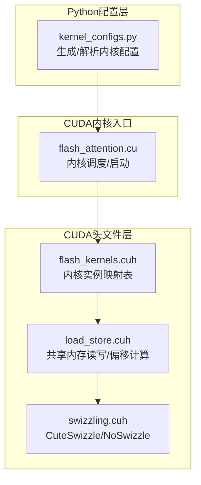
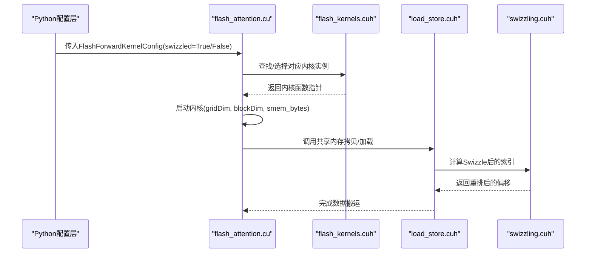
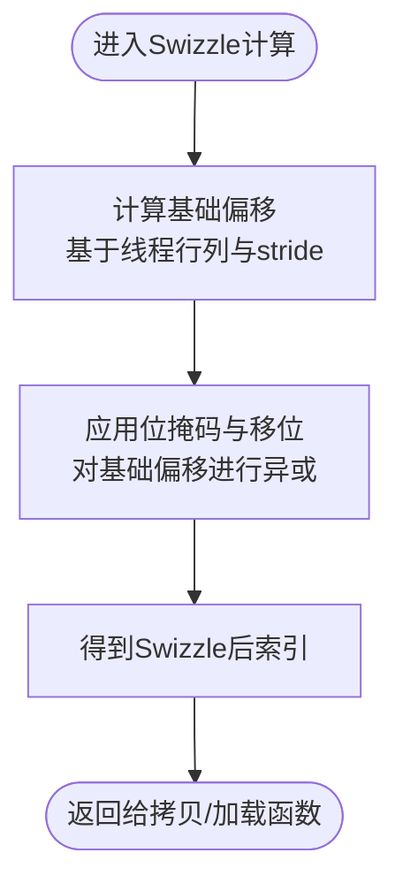
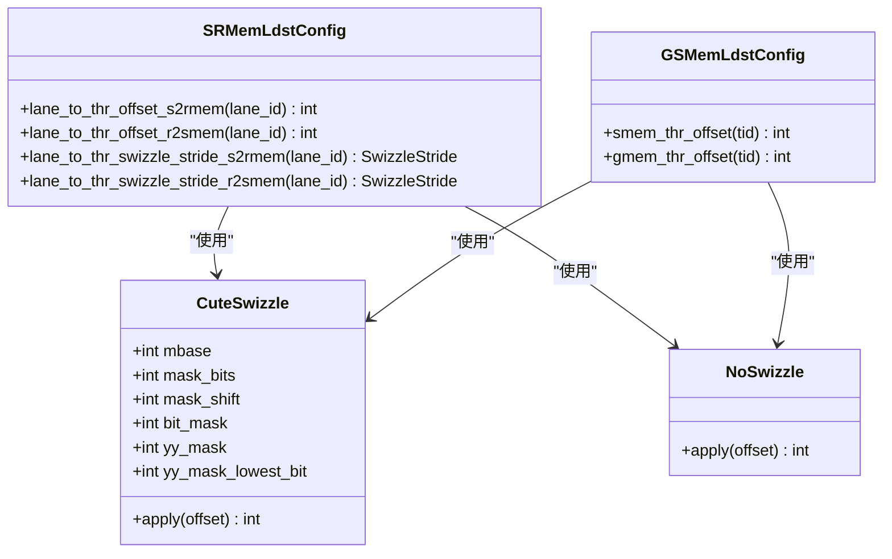
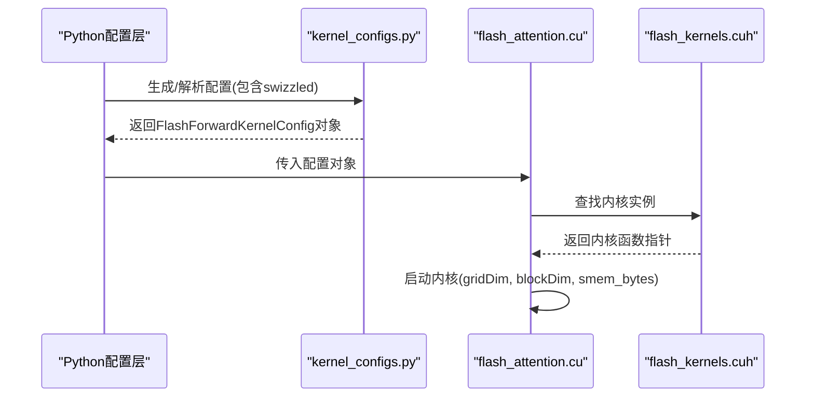
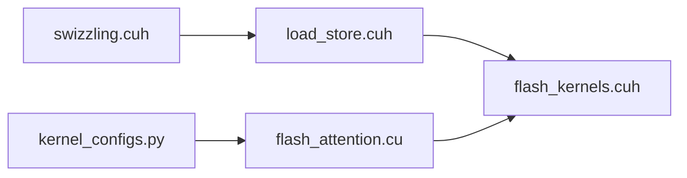

# Swizzling配置

<cite>
**本文引用的文件**
- [swizzling.cuh](file://src/include/swizzling.cuh)
- [load_store.cuh](file://src/include/load_store.cuh)
- [kernel_configs.py](file://py/flash_helpers/kernel_configs.py)
- [flash_attention.cu](file://src/flash_attention.cu)
- [flash_kernels.cuh](file://src/include/flash_kernels.cuh)
- [run_kernels.py](file://tools/benchmark/run_kernels.py)
</cite>

## 目录
1. [引言](#引言)
2. [项目结构](#项目结构)
3. [核心组件](#核心组件)
4. [架构总览](#架构总览)
5. [详细组件分析](#详细组件分析)
6. [依赖关系分析](#依赖关系分析)
7. [性能考量](#性能考量)
8. [故障排查指南](#故障排查指南)
9. [结论](#结论)
10. [附录](#附录)

## 引言
本文件围绕“swizzled”配置参数展开，系统性解析其如何通过内存访问重排（Swizzling）技术消除共享内存bank冲突，从而在高并发场景下提升内存带宽利用率与性能稳定性。文档基于源码中Swizzling的实现细节，结合Python侧配置生成与内核调度，说明swizzled=True时的数据布局变化、访问路径优化及开销权衡，并提供可操作的调优建议与问题定位方法。

## 项目结构
与Swizzling相关的关键位置：
- CUDA头文件层：共享内存加载/存储与Swizzling偏移计算位于共享内存抽象层
- 配置生成层：Python侧生成内核配置，包含swizzled布尔标志
- 内核入口层：将配置映射到具体内核实例并执行

图表来源
- [kernel_configs.py](file://py/flash_helpers/kernel_configs.py#L106-L175)
- [flash_attention.cu](file://src/flash_attention.cu#L100-L149)
- [flash_kernels.cuh](file://src/include/flash_kernels.cuh#L1-L23)
- [load_store.cuh](file://src/include/load_store.cuh#L144-L201)
- [swizzling.cuh](file://src/include/swizzling.cuh#L1-L29)

章节来源
- [kernel_configs.py](file://py/flash_helpers/kernel_configs.py#L106-L175)
- [flash_attention.cu](file://src/flash_attention.cu#L100-L149)
- [flash_kernels.cuh](file://src/include/flash_kernels.cuh#L1-L23)
- [load_store.cuh](file://src/include/load_store.cuh#L144-L201)
- [swizzling.cuh](file://src/include/swizzling.cuh#L1-L29)

## 核心组件
- Swizzling实现（C++模板）
  - CuteSwizzle：根据位掩码与移位规则对线程访问的共享内存索引进行异或重排，打破bank冲突
  - NoSwizzle：不改变索引，作为默认回退策略
- 共享内存读写与偏移计算（C++）
  - 提供从全局内存到共享内存、寄存器之间的拷贝函数与stride计算
  - 在不同方向（s2rmem/r2smem）下计算Swizzle偏移与步长
- Python配置（内核配置类）
  - FlashForwardKernelConfig包含swizzled字段，用于控制是否启用Swizzling
  - 提供短格式字符串与C++结构体转换，便于内核实例化
- 内核调度与实例化
  - 将配置映射为具体内核函数指针，按需设置动态共享内存属性

章节来源
- [swizzling.cuh](file://src/include/swizzling.cuh#L1-L29)
- [load_store.cuh](file://src/include/load_store.cuh#L144-L201)
- [kernel_configs.py](file://py/flash_helpers/kernel_configs.py#L106-L175)
- [flash_kernels.cuh](file://src/include/flash_kernels.cuh#L1-L23)
- [flash_attention.cu](file://src/flash_attention.cu#L100-L149)

## 架构总览
Swizzling在内存访问链路中的作用：当线程将数据从全局内存搬运至共享内存或从共享内存搬运至寄存器时，先通过Swizzle计算新的索引，使得同一时间访问共享内存不同bank的元素，避免多线程在同一bank上的冲突。

图表来源
- [flash_attention.cu](file://src/flash_attention.cu#L100-L149)
- [flash_kernels.cuh](file://src/include/flash_kernels.cuh#L1-L23)
- [load_store.cuh](file://src/include/load_store.cuh#L144-L201)
- [swizzling.cuh](file://src/include/swizzling.cuh#L1-L29)

## 详细组件分析

### Swizzling算法与数据布局重排
- 算法原理
  - CuteSwizzle通过位掩码与移位，对原始线性索引进行异或变换，将相邻的线程访问分散到不同bank
  - 该变换是确定性的，且对同一swizzle空间内的访问保持一致性
- 关键接口
  - apply(offset)：对输入offset进行Swizzle重排
  - NoSwizzle.apply(offset)：返回原offset，用于关闭Swizzling
- 在共享内存中的应用
  - 在从全局内存到共享内存的拷贝路径中，使用Swizzle::apply计算smem索引
  - 在从共享内存到寄存器的加载路径中，同样使用Swizzle::apply计算rmem索引
- 偏移与步长
  - 不同方向（s2rmem/r2smem）下，根据当前线程所在行/列与stride，计算基础偏移
  - 基于基础偏移进一步计算Swizzle步长，确保跨swizzle空间时正确跳转

图表来源
- [swizzling.cuh](file://src/include/swizzling.cuh#L1-L29)
- [load_store.cuh](file://src/include/load_store.cuh#L144-L201)

章节来源
- [swizzling.cuh](file://src/include/swizzling.cuh#L1-L29)
- [load_store.cuh](file://src/include/load_store.cuh#L144-L201)

### 共享内存读写与Swizzle集成
- 全局到共享内存
  - 使用GSMemLdstConfig::smem_thr_offset计算每个线程在共享内存中的目标位置，并通过Swizzle::apply重排
- 寄存器到共享内存
  - 使用SRMemLdstConfig::lane_to_thr_offset_r2smem计算r2smem方向的偏移，并通过Swizzle::apply重排
- 步长计算
  - lane_to_thr_swizzle_stride_*系列函数根据当前线程的基偏移，计算跨swizzle空间的步长，保证连续访问的连续性

图表来源
- [swizzling.cuh](file://src/include/swizzling.cuh#L1-L29)
- [load_store.cuh](file://src/include/load_store.cuh#L63-L126)
- [load_store.cuh](file://src/include/load_store.cuh#L144-L201)

章节来源
- [load_store.cuh](file://src/include/load_store.cuh#L63-L126)
- [load_store.cuh](file://src/include/load_store.cuh#L144-L201)
- [swizzling.cuh](file://src/include/swizzling.cuh#L1-L29)

### Python配置与内核实例化
- FlashForwardKernelConfig
  - 包含swizzled字段，用于控制是否启用Swizzling
  - 提供short_form与to_cpp_struct，便于人类阅读与C++结构体生成
- 自动化配置生成
  - get_autotuning_kernel_configs与get_kernel_progression_configs等函数会固定swizzled=True，以验证Swizzling带来的收益
- 内核实例映射
  - flash_kernels.cuh维护FlashForwardKernelConfig到内核函数指针的映射，确保swizzled=True的配置能被正确实例化

图表来源
- [kernel_configs.py](file://py/flash_helpers/kernel_configs.py#L106-L175)
- [flash_attention.cu](file://src/flash_attention.cu#L100-L149)
- [flash_kernels.cuh](file://src/include/flash_kernels.cuh#L1-L23)

章节来源
- [kernel_configs.py](file://py/flash_helpers/kernel_configs.py#L106-L175)
- [flash_kernels.cuh](file://src/include/flash_kernels.cuh#L1-L23)
- [flash_attention.cu](file://src/flash_attention.cu#L100-L149)

## 依赖关系分析
- 组件耦合
  - load_store.cuh依赖swizzling.cuh提供的Swizzle策略
  - flash_attention.cu依赖flash_kernels.cuh提供的内核实例映射
  - kernel_configs.py负责生成包含swizzled的配置对象
- 外部依赖
  - CUDA运行时与PTX指令集支持（如ldmatrix.x4、cp_async等）
- 潜在循环依赖
  - 当前文件间无直接循环依赖；Swizzling仅在头文件层被间接使用

图表来源
- [swizzling.cuh](file://src/include/swizzling.cuh#L1-L29)
- [load_store.cuh](file://src/include/load_store.cuh#L144-L201)
- [flash_kernels.cuh](file://src/include/flash_kernels.cuh#L1-L23)
- [kernel_configs.py](file://py/flash_helpers/kernel_configs.py#L106-L175)
- [flash_attention.cu](file://src/flash_attention.cu#L100-L149)

章节来源
- [swizzling.cuh](file://src/include/swizzling.cuh#L1-L29)
- [load_store.cuh](file://src/include/load_store.cuh#L144-L201)
- [flash_kernels.cuh](file://src/include/flash_kernels.cuh#L1-L23)
- [kernel_configs.py](file://py/flash_helpers/kernel_configs.py#L106-L175)
- [flash_attention.cu](file://src/flash_attention.cu#L100-L149)

## 性能考量
- 内存带宽利用率
  - Swizzling通过重排访问顺序，减少同一周期内多个线程对同一bank的争用，提高并发度与带宽占用率
- 性能稳定性
  - 在高并发场景下，Swizzling有助于避免bank冲突导致的吞吐波动，提升端到端稳定性和可预测性
- 实现开销
  - Swizzle计算本身为常数时间异或与位运算，开销极低
  - 对于某些布局，可能需要额外的步长计算与跨空间跳转逻辑，但通常远小于bank冲突造成的延迟惩罚
- 配置建议
  - 在高并发、大块共享内存访问场景下优先启用swizzled
  - 结合自动调优工具，对比开启/关闭Swizzling的性能差异，选择最优组合

[本节为通用性能讨论，无需特定文件来源]

## 故障排查指南
- 验证配置是否生效
  - 检查内核名称中的“swizzled”标记，确认配置对象的swizzled字段为True
  - 参考：[kernel_configs.py](file://py/flash_helpers/kernel_configs.py#L135-L146)
- 核对内核实例映射
  - 确认flash_kernels.cuh中存在对应配置的内核实例
  - 参考：[flash_kernels.cuh](file://src/include/flash_kernels.cuh#L1-L23)
- 动态共享内存限制
  - 若内核使用的动态共享内存超过默认限制，需在模块初始化时设置最大动态共享内存
  - 参考：[flash_attention.cu](file://src/flash_attention.cu#L142-L149)
- 运行基准测试
  - 使用工具脚本批量运行不同配置，比较吞吐与延迟
  - 参考：[run_kernels.py](file://tools/benchmark/run_kernels.py#L1-L159)

章节来源
- [kernel_configs.py](file://py/flash_helpers/kernel_configs.py#L135-L146)
- [flash_kernels.cuh](file://src/include/flash_kernels.cuh#L1-L23)
- [flash_attention.cu](file://src/flash_attention.cu#L142-L149)
- [run_kernels.py](file://tools/benchmark/run_kernels.py#L1-L159)

## 结论
swizzled配置通过在共享内存布局上引入确定性的索引重排，有效规避了bank冲突，显著提升了高并发场景下的内存带宽利用率与性能稳定性。配合Python侧的配置生成与内核实例化机制，开发者可以便捷地启用并验证Swizzling带来的收益。在实际部署中，建议结合自动调优流程，综合考虑不同配置组合的性能表现，以获得最佳的整体吞吐与延迟平衡。

[本节为总结性内容，无需特定文件来源]

## 附录
- 关键实现位置速览
  - Swizzling定义：[swizzling.cuh](file://src/include/swizzling.cuh#L1-L29)
  - 共享内存读写与Swizzle集成：[load_store.cuh](file://src/include/load_store.cuh#L144-L201)
  - 配置对象与短格式输出：[kernel_configs.py](file://py/flash_helpers/kernel_configs.py#L106-L175)
  - 内核实例映射：[flash_kernels.cuh](file://src/include/flash_kernels.cuh#L1-L23)
  - 内核调度与动态共享内存设置：[flash_attention.cu](file://src/flash_attention.cu#L100-L149)
  - 基准测试脚本：[run_kernels.py](file://tools/benchmark/run_kernels.py#L1-L159)