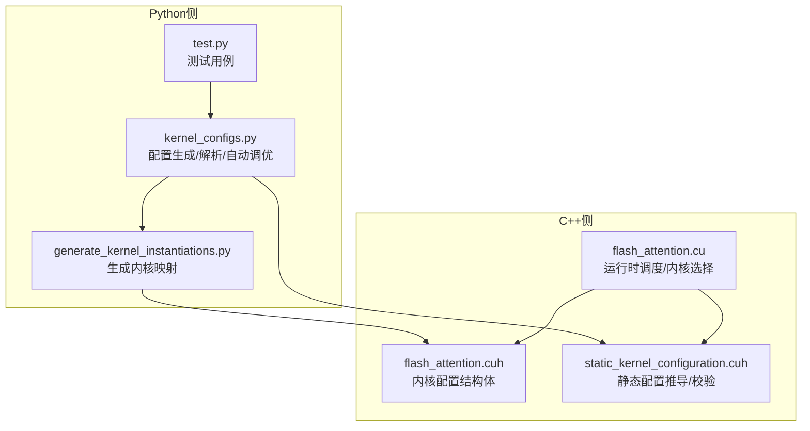
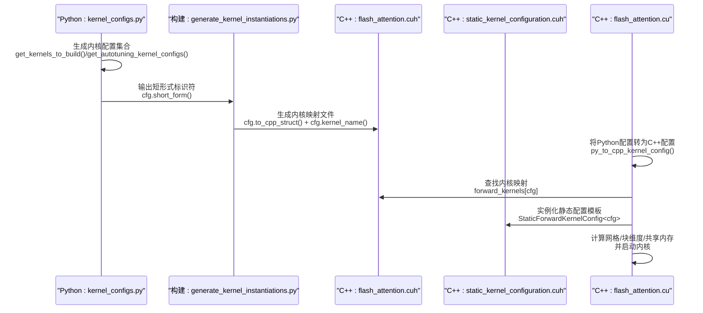
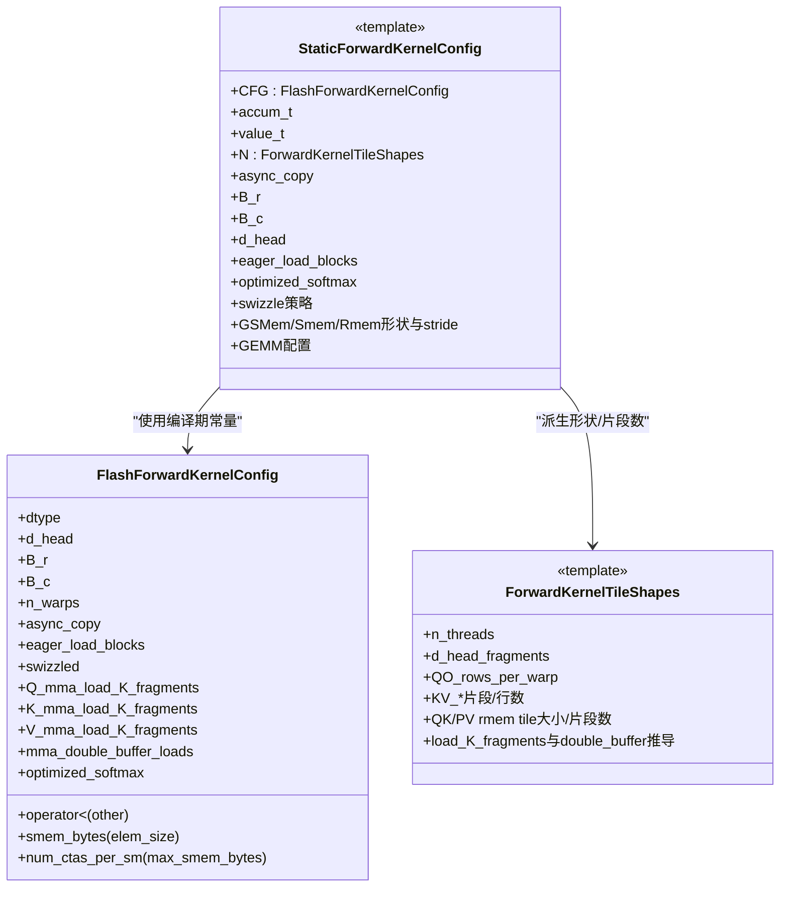
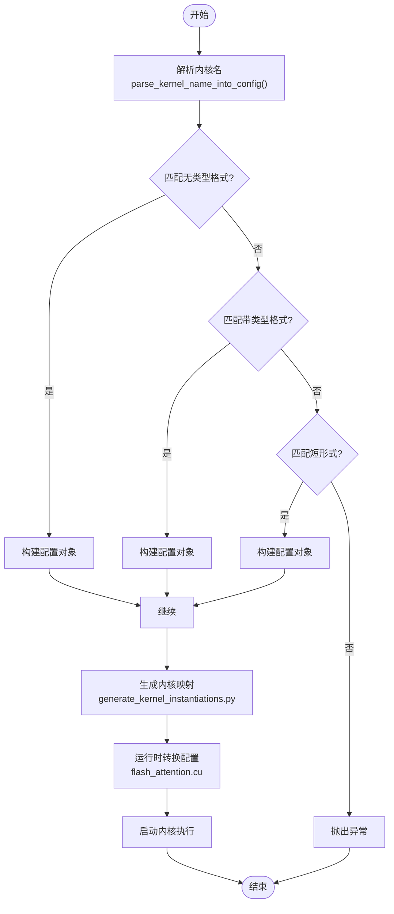

# 内核配置结构

<cite>
**本文引用的文件**
- [kernel_configs.py](file://py/flash_helpers/kernel_configs.py)
- [flash_attention.cuh](file://src/include/flash_attention.cuh)
- [static_kernel_configuration.cuh](file://src/include/static_kernel_configuration.cuh)
- [flash_attention.cu](file://src/flash_attention.cu)
- [generate_kernel_instantiations.py](file://tools/build/generate_kernel_instantiations.py)
- [test.py](file://py/flash_helpers/test/test.py)
</cite>

## 目录
1. [引言](#引言)
2. [项目结构](#项目结构)
3. [核心组件](#核心组件)
4. [架构总览](#架构总览)
5. [详细组件分析](#详细组件分析)
6. [依赖关系分析](#依赖关系分析)
7. [性能考量](#性能考量)
8. [故障排查指南](#故障排查指南)
9. [结论](#结论)
10. [附录](#附录)

## 引言
本文件围绕“FlashForwardKernelConfig”这一内核配置数据类展开，系统阐述其设计、字段语义、在Python侧的构造与解析、以及在C++侧的静态编译期验证与运行时调度。重点覆盖以下配置项：
- dtype（数据类型，支持FP16/BF16）
- d_head（头维度）
- B_r/B_c（行/列块大小）
- n_warps（线程束数量）
- async_copy（异步复制启用）
- eager_load_blocks（急切加载块）
- swizzled（Swizzling技术启用）
- Q/K/V_mma_load_K_tiles（QKV张量核心加载瓦片数）
- mma_double_buffer_loads（双缓冲启用）
- optimized_softmax（优化Softmax）

同时说明如何通过short_form()生成简洁标识符、通过to_cpp_struct()转换为C++结构体字符串，并解释这些参数如何共同决定内核的性能特征与硬件资源使用。

## 项目结构
该仓库采用“Python辅助工具 + CUDA内核”的分层组织方式：
- Python侧提供内核配置生成、解析与自动调优逻辑，位于py/flash_helpers/kernel_configs.py
- C++侧定义内核配置结构体、静态配置推导与内核调度，位于src/include/flash_attention.cuh与src/include/static_kernel_configuration.cuh
- 构建阶段由tools/build/generate_kernel_instantiations.py根据Python配置生成C++内核映射
- 运行时由src/flash_attention.cu负责将Python配置转换为C++配置并选择内核执行

图表来源
- [kernel_configs.py](file://py/flash_helpers/kernel_configs.py#L1-L120)
- [generate_kernel_instantiations.py](file://tools/build/generate_kernel_instantiations.py#L1-L56)
- [flash_attention.cuh](file://src/include/flash_attention.cuh#L1-L110)
- [static_kernel_configuration.cuh](file://src/include/static_kernel_configuration.cuh#L1-L120)
- [flash_attention.cu](file://src/flash_attention.cu#L1-L150)

章节来源
- [kernel_configs.py](file://py/flash_helpers/kernel_configs.py#L1-L120)
- [flash_attention.cuh](file://src/include/flash_attention.cuh#L1-L110)
- [static_kernel_configuration.cuh](file://src/include/static_kernel_configuration.cuh#L1-L120)
- [flash_attention.cu](file://src/flash_attention.cu#L1-L150)
- [generate_kernel_instantiations.py](file://tools/build/generate_kernel_instantiations.py#L1-L56)
- [test.py](file://py/flash_helpers/test/test.py#L1-L104)

## 核心组件
- FlashForwardKernelConfig（Python侧数据类）：封装所有内核运行时可变参数，提供short_form()与to_cpp_struct()等工具方法，支持从字符串或符号化名称解析配置。
- FlashForwardKernelConfig（C++侧结构体）：用于运行时比较、共享内存估算、CTAs每SM限制等；包含operator<以支持有序存储与查找。
- StaticForwardKernelConfig与ForwardKernelTileShapes（C++侧模板）：在编译期根据配置推导内存布局、线程块形状、加载瓦片数与缓冲策略，确保配置合法性并指导访存与计算流水。

章节来源
- [kernel_configs.py](file://py/flash_helpers/kernel_configs.py#L106-L175)
- [flash_attention.cuh](file://src/include/flash_attention.cuh#L30-L110)
- [static_kernel_configuration.cuh](file://src/include/static_kernel_configuration.cuh#L22-L120)

## 架构总览
下图展示了从Python配置到C++内核执行的关键流程：Python生成配置集合，构建阶段生成C++内核映射，运行时将Python配置转换为C++配置并选择对应内核执行。

图表来源
- [kernel_configs.py](file://py/flash_helpers/kernel_configs.py#L389-L486)
- [generate_kernel_instantiations.py](file://tools/build/generate_kernel_instantiations.py#L1-L56)
- [flash_attention.cuh](file://src/include/flash_attention.cuh#L30-L110)
- [static_kernel_configuration.cuh](file://src/include/static_kernel_configuration.cuh#L104-L160)
- [flash_attention.cu](file://src/flash_attention.cu#L16-L32)

## 详细组件分析

### FlashForwardKernelConfig（Python侧）
- 字段与语义
  - dtype：数据类型枚举，支持FP16/BF16，提供to_cpp_str()与to_torch_dtype()便于跨语言转换。
  - d_head：头维度，影响寄存器/共享内存占用与访存瓦片划分。
  - B_r/B_c：行/列块大小，控制Q/O与KV的分块尺寸，影响访存重叠与吞吐。
  - n_warps：线程束数量，决定线程块总线程数与每线程工作粒度。
  - async_copy：是否启用异步复制，提升访存与计算重叠。
  - eager_load_blocks：是否尽早加载KV块，减少等待但增加带宽压力。
  - swizzled：是否启用Swizzling，改善访存模式，降低冲突。
  - Q/K/V_mma_load_K_tiles：Q/K/V张量核心加载K方向的瓦片数；0表示按d_head或B_c自动推导。
  - mma_double_buffer_loads：是否启用双缓冲加载，提高访存与计算流水重叠。
  - optimized_softmax：是否启用优化的Softmax路径，减少寄存器与访存开销。

- 方法与用途
  - short_form(include_d_head=True, include_tup=True)：生成人类可读的简短标识符，便于日志与调试。
  - to_cpp_struct()：生成C++结构体初始化字符串，供构建阶段写入映射文件。
  - total_flop()/attn_flop()：估算算力，辅助评估不同配置的理论峰值利用率。
  - 解析与生成
    - parse_kernel_name_into_config()：从符号化内核名中解析配置，支持多种格式。
    - get_autotuning_kernel_configs()：生成自动调优候选集，结合should_autotune_config()过滤非法组合。
    - get_kernel_progression_configs()：按特性逐步增强的内核序列，便于理解参数影响。

- 使用示例（路径参考）
  - 创建配置并输出短形式：参见[短形式输出示例](file://tools/build/generate_kernel_instantiations.py#L34-L47)
  - 自动调优配置生成：参见[自动调优配置生成](file://py/flash_helpers/kernel_configs.py#L389-L424)
  - 解析内核名到配置：参见[解析函数](file://py/flash_helpers/kernel_configs.py#L323-L335)

章节来源
- [kernel_configs.py](file://py/flash_helpers/kernel_configs.py#L106-L175)
- [kernel_configs.py](file://py/flash_helpers/kernel_configs.py#L177-L335)
- [kernel_configs.py](file://py/flash_helpers/kernel_configs.py#L338-L486)
- [generate_kernel_instantiations.py](file://tools/build/generate_kernel_instantiations.py#L1-L56)

### FlashForwardKernelConfig（C++侧）
- 字段与语义
  - dtype：torch::ScalarType，决定数值精度与内核类型别名。
  - d_head/B_r/B_c/n_warps：与Python侧一致，用于运行时检查与共享内存估算。
  - async_copy/eager_load_blocks/swizzled：控制访存与计算策略。
  - Q_mma_load_K_fragments/K_mma_load_K_fragments/V_mma_load_K_fragments：编译期推导的加载片段数，0表示按d_head或B_c推导。
  - mma_double_buffer_loads/optimized_softmax：控制加载流水与Softmax路径。
- 关键能力
  - operator<：按字段顺序比较，支持有序容器存储与查找。
  - smem_bytes(elem_size=2)：估算共享内存占用，辅助CTAs每SM限制判断。
  - num_ctas_per_sm(max_smem_bytes)：根据共享内存上限估算每SM可并发的CTA数量。

- 运行时集成
  - flash_attention.cu中将Python配置转换为C++配置，校验输入形状与数据类型，查找内核映射并启动执行。

章节来源
- [flash_attention.cuh](file://src/include/flash_attention.cuh#L30-L110)
- [flash_attention.cu](file://src/flash_attention.cu#L16-L32)
- [flash_attention.cu](file://src/flash_attention.cu#L58-L135)

### 静态配置推导与校验（C++侧）
- ForwardKernelTileShapes：基于配置在编译期推导线程块形状、每warp加载/计算瓦片数、加载阶段数等，确保加载片段数为2的幂且不超过上限。
- StaticForwardKernelConfig：将配置作为编译期常量，派生访存布局、Swizzle策略、G/S/R内存形状与stride，以及GEMM配置。

图表来源
- [flash_attention.cuh](file://src/include/flash_attention.cuh#L30-L110)
- [static_kernel_configuration.cuh](file://src/include/static_kernel_configuration.cuh#L22-L120)

章节来源
- [static_kernel_configuration.cuh](file://src/include/static_kernel_configuration.cuh#L22-L120)

### 算法与流程：配置解析与生成
- Python侧解析
  - 支持三种内核名格式：无类型、带类型、短形式；分别由不同解析函数处理。
  - 短形式包含dtype、d_head、B_r、B_c、n_warps与若干特性标记（如async、eager、swizzled、load_X_Y_Z_tiles、buffer、opt_softmax）。
- 构建阶段生成
  - 生成内核映射文件，键为C++结构体字面量，值为对应内核函数指针。
- 运行时调度
  - 将Python配置转换为C++配置，查找映射表，设置动态共享内存属性后启动内核。

图表来源
- [kernel_configs.py](file://py/flash_helpers/kernel_configs.py#L177-L335)
- [generate_kernel_instantiations.py](file://tools/build/generate_kernel_instantiations.py#L1-L56)
- [flash_attention.cu](file://src/flash_attention.cu#L16-L32)

章节来源
- [kernel_configs.py](file://py/flash_helpers/kernel_configs.py#L177-L335)
- [generate_kernel_instantiations.py](file://tools/build/generate_kernel_instantiations.py#L1-L56)
- [flash_attention.cu](file://src/flash_attention.cu#L16-L32)

## 依赖关系分析
- Python侧依赖
  - kernel_configs.py依赖itertools进行笛卡尔积组合，依赖re进行正则解析，依赖dataclass与enum实现配置结构与枚举。
  - 测试用例依赖get_kernels_to_build()生成配置集合，驱动内核功能验证。
- C++侧依赖
  - flash_attention.cu依赖flash_kernels.cuh（由Python生成）进行内核映射查找。
  - static_kernel_configuration.cuh依赖flash_attention.cuh与gemm/load_store/layout等模块，进行编译期形状与片段数推导。
- 耦合与内聚
  - Python与C++通过统一的配置字段与to_cpp_struct()保持强耦合，确保两端一致性。
  - C++静态配置模板对配置进行严格约束（片段数为2的幂、上限检查、Q/K片段一致性），保证内核正确性与性能。

图表来源
- [kernel_configs.py](file://py/flash_helpers/kernel_configs.py#L389-L486)
- [generate_kernel_instantiations.py](file://tools/build/generate_kernel_instantiations.py#L1-L56)
- [flash_attention.cu](file://src/flash_attention.cu#L1-L150)
- [flash_attention.cuh](file://src/include/flash_attention.cuh#L1-L110)
- [static_kernel_configuration.cuh](file://src/include/static_kernel_configuration.cuh#L1-L120)

章节来源
- [kernel_configs.py](file://py/flash_helpers/kernel_configs.py#L389-L486)
- [flash_attention.cu](file://src/flash_attention.cu#L1-L150)
- [static_kernel_configuration.cuh](file://src/include/static_kernel_configuration.cuh#L1-L120)

## 性能考量
- 数据类型与寄存器/带宽
  - FP16/BF16直接影响寄存器占用与访存带宽；BF16通常寄存器占用略低，但算力相近。
- 块大小B_r/B_c与线程束n_warps
  - B_r/B_c越大，访存重叠与吞吐越高，但寄存器与共享内存压力增大；n_warps影响线程块规模与每warp工作量。
- 加载策略与流水
  - async_copy与eager_load_blocks提升访存重叠，但可能增加带宽压力；swizzled改善访存冲突，提升带宽利用。
  - Q/K/V_mma_load_K_tiles与mma_double_buffer_loads控制加载片段数与双缓冲，影响访存与计算流水深度。
- Softmax优化
  - optimized_softmax减少寄存器与访存，适合长序列场景。
- 共享内存与CTAs每SM
  - smem_bytes()与num_ctas_per_sm()用于评估配置的硬件资源占用，避免超限导致性能下降。

章节来源
- [flash_attention.cuh](file://src/include/flash_attention.cuh#L54-L66)
- [flash_attention.cuh](file://src/include/flash_attention.cuh#L87-L108)
- [static_kernel_configuration.cuh](file://src/include/static_kernel_configuration.cuh#L22-L41)
- [static_kernel_configuration.cuh](file://src/include/static_kernel_configuration.cuh#L68-L120)

## 故障排查指南
- 配置不合法
  - 现象：编译期静态断言失败或运行时报错。
  - 排查：检查Q/K/V_mma_load_K_fragments是否为2的幂且不超过上限；确认Q/K片段一致性；核对B_r/B_c/n_warps与d_head的组合是否满足约束。
- 内核映射缺失
  - 现象：运行时报“配置未在映射中”。
  - 排查：确认Python侧已生成对应配置的映射文件；检查to_cpp_struct()输出与构建脚本是否一致。
- 数据类型不匹配
  - 现象：运行时报dtype不匹配。
  - 排查：确保Python配置dtype与输入张量dtype一致；核对DType枚举与torch dtype映射。
- 形状不整除
  - 现象：运行时报seq_len与B_r/B_c不整除。
  - 排查：调整B_r/B_c使seq_len能被整除，或修改序列长度。

章节来源
- [flash_attention.cu](file://src/flash_attention.cu#L58-L83)
- [flash_attention.cu](file://src/flash_attention.cu#L117-L135)
- [static_kernel_configuration.cuh](file://src/include/static_kernel_configuration.cuh#L13-L21)

## 结论
FlashForwardKernelConfig通过Python与C++两侧的协同设计，实现了从配置生成、解析、构建映射到运行时调度的完整闭环。其字段覆盖了访存、计算、流水与内存布局的关键维度，配合编译期静态校验与运行时资源估算，能够在保证正确性的前提下最大化性能。建议在实际工程中：
- 优先使用get_autotuning_kernel_configs()生成候选集，结合性能基准筛选最优配置；
- 在长序列场景启用optimized_softmax与mma_double_buffer_loads；
- 合理选择B_r/B_c与n_warps，平衡吞吐与寄存器/共享内存占用；
- 通过short_form()与to_cpp_struct()保持两端一致性，便于调试与回归。

## 附录
- 配置字段速查
  - dtype：FP16/BF16
  - d_head：头维度
  - B_r/B_c：行/列块大小
  - n_warps：线程束数量
  - async_copy：异步复制
  - eager_load_blocks：急切加载
  - swizzled：Swizzling
  - Q/K/V_mma_load_K_tiles：张量核心加载K片段数（0表示自动）
  - mma_double_buffer_loads：双缓冲
  - optimized_softmax：优化Softmax
- 常用方法
  - short_form()：生成短形式标识符
  - to_cpp_struct()：生成C++结构体字符串
  - parse_kernel_name_into_config()：从内核名解析配置
  - get_autotuning_kernel_configs()：生成自动调优配置集
  - get_kernel_progression_configs()：生成特性增强序列