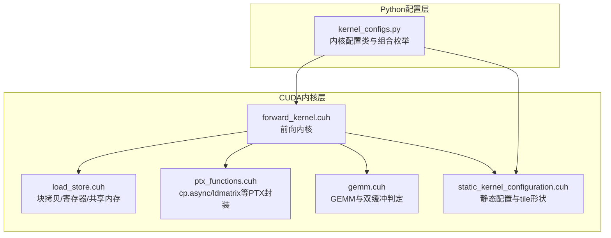
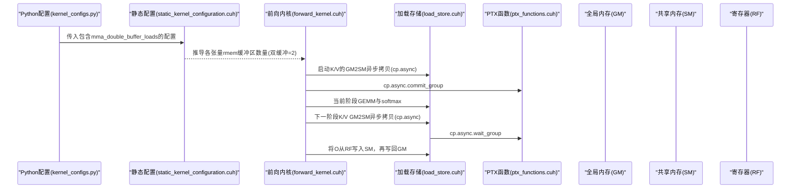
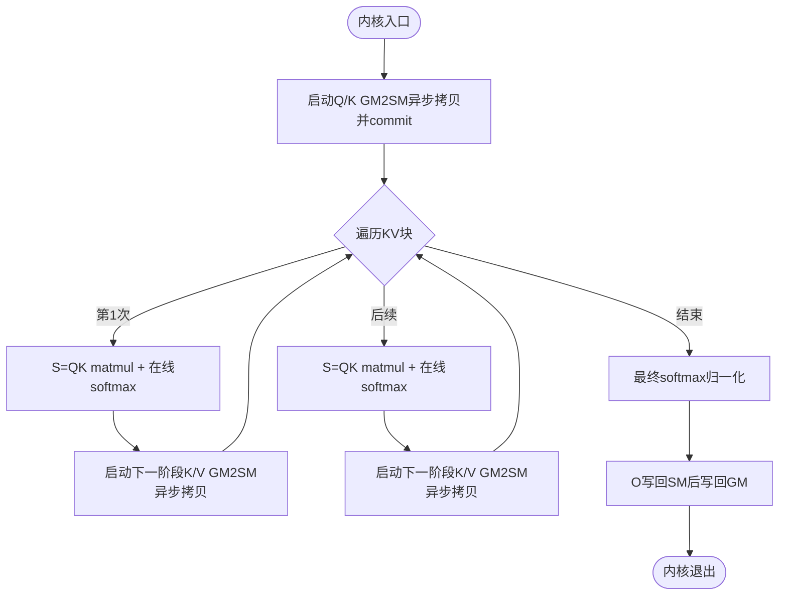
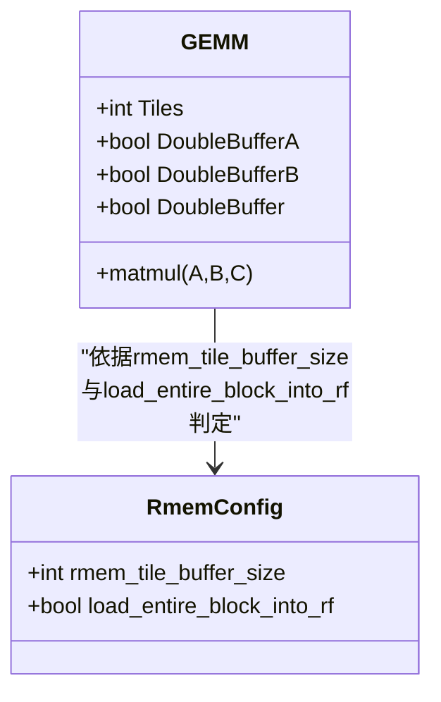
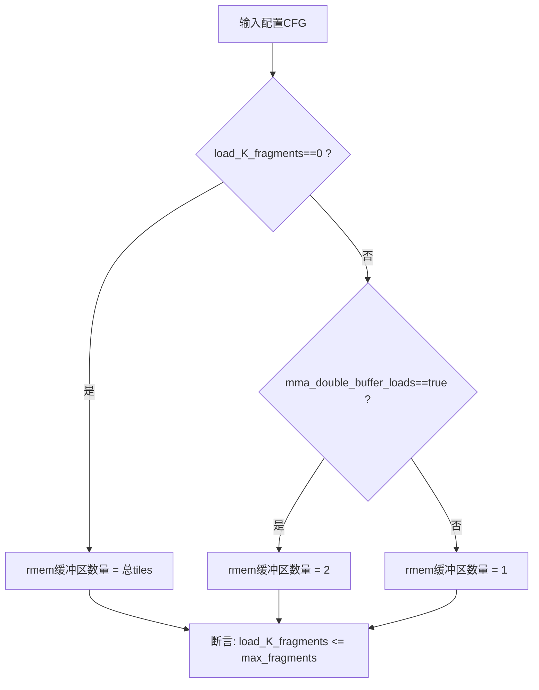
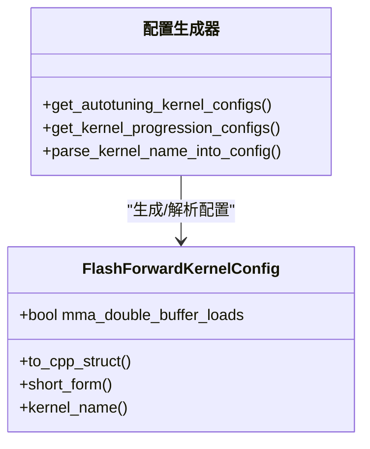
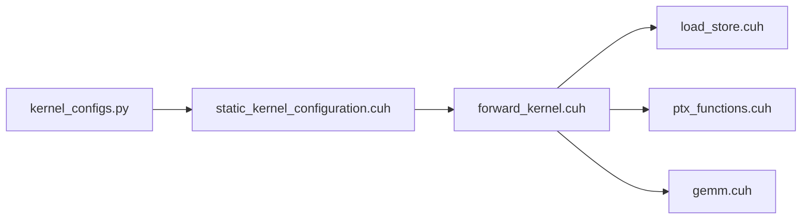

# 双缓冲配置

<cite>
**本文引用的文件**
- [src/include/forward_kernel.cuh](file://src/include/forward_kernel.cuh)
- [src/include/gemm.cuh](file://src/include/gemm.cuh)
- [src/include/load_store.cuh](file://src/include/load_store.cuh)
- [src/include/ptx_functions.cuh](file://src/include/ptx_functions.cuh)
- [src/include/static_kernel_configuration.cuh](file://src/include/static_kernel_configuration.cuh)
- [py/flash_helpers/kernel_configs.py](file://py/flash_helpers/kernel_configs.py)
</cite>

## 目录
1. [引言](#引言)
2. [项目结构](#项目结构)
3. [核心组件](#核心组件)
4. [架构总览](#架构总览)
5. [详细组件分析](#详细组件分析)
6. [依赖关系分析](#依赖关系分析)
7. [性能考量](#性能考量)
8. [故障排查指南](#故障排查指南)
9. [结论](#结论)

## 引言
本文件围绕“mma_double_buffer_loads”配置参数展开，系统阐述其如何启用双缓冲技术以优化计算与内存传输的重叠，结合内核实现与配置组合，解释双缓冲如何使用两套寄存器或共享内存缓冲区，在加载下一组数据的同时处理当前数据；同时分析该技术对指令流水线、性能提升、寄存器压力及不同计算强度场景的适用性。

## 项目结构
本仓库包含多版本源码与Python辅助脚本，其中与双缓冲直接相关的关键文件如下：
- CUDA前向内核与张量/加载存储/PTX函数：src/include/forward_kernel.cuh、src/include/load_store.cuh、src/include/ptx_functions.cuh、src/include/gemm.cuh
- 静态内核配置与tile形状推导：src/include/static_kernel_configuration.cuh
- Python内核配置生成与自动调参：py/flash_helpers/kernel_configs.py

图表来源
- [src/include/forward_kernel.cuh](file://src/include/forward_kernel.cuh#L1-L207)
- [src/include/load_store.cuh](file://src/include/load_store.cuh#L1-L356)
- [src/include/ptx_functions.cuh](file://src/include/ptx_functions.cuh#L1-L48)
- [src/include/gemm.cuh](file://src/include/gemm.cuh#L1-L126)
- [src/include/static_kernel_configuration.cuh](file://src/include/static_kernel_configuration.cuh#L1-L294)
- [py/flash_helpers/kernel_configs.py](file://py/flash_helpers/kernel_configs.py#L1-L486)

章节来源
- [src/include/forward_kernel.cuh](file://src/include/forward_kernel.cuh#L1-L207)
- [py/flash_helpers/kernel_configs.py](file://py/flash_helpers/kernel_configs.py#L1-L486)

## 核心组件
- 前向内核（flash_forward_kernel）：负责Q/K/V的异步加载、S=QK与P=PV的GEMM、在线softmax与最终归一化输出写回。
- GEMM模块：定义双缓冲判定逻辑，决定是否启用A/B两路寄存器缓冲以重叠加载与计算。
- 加载存储模块：提供GM2SM/SM2GM/SM2RF等拷贝路径，支持异步cp.async与同步拷贝。
- PTX函数：封装cp.async提交/等待、ldmatrix等底层指令。
- 静态配置：根据配置参数推导各张量的寄存器缓冲大小（含双缓冲），并约束K片段加载合法性。
- Python配置：提供FlashForwardKernelConfig类与组合枚举，支持开启/关闭mma_double_buffer_loads。

章节来源
- [src/include/forward_kernel.cuh](file://src/include/forward_kernel.cuh#L1-L207)
- [src/include/gemm.cuh](file://src/include/gemm.cuh#L1-L126)
- [src/include/load_store.cuh](file://src/include/load_store.cuh#L1-L356)
- [src/include/ptx_functions.cuh](file://src/include/ptx_functions.cuh#L1-L48)
- [src/include/static_kernel_configuration.cuh](file://src/include/static_kernel_configuration.cuh#L1-L294)
- [py/flash_helpers/kernel_configs.py](file://py/flash_helpers/kernel_configs.py#L1-L486)

## 架构总览
双缓冲在本内核中的作用链路：
- Python配置层生成包含mma_double_buffer_loads的配置，并驱动静态配置推导。
- 静态配置根据配置参数决定各张量的寄存器缓冲区数量（双缓冲时为2，否则为1）。
- 前向内核在每次迭代中，先启动下一阶段的内存加载（cp.async），再进行当前阶段的GEMM与softmax；通过同步屏障与等待指令确保安全重叠。
- GEMM层在需要时启用双缓冲，使加载与计算交错，减少流水线停顿。

图表来源
- [py/flash_helpers/kernel_configs.py](file://py/flash_helpers/kernel_configs.py#L1-L486)
- [src/include/static_kernel_configuration.cuh](file://src/include/static_kernel_configuration.cuh#L1-L294)
- [src/include/forward_kernel.cuh](file://src/include/forward_kernel.cuh#L1-L207)
- [src/include/load_store.cuh](file://src/include/load_store.cuh#L1-L356)
- [src/include/ptx_functions.cuh](file://src/include/ptx_functions.cuh#L1-L48)

## 详细组件分析

### 组件A：前向内核中的双缓冲重叠策略
- 内核初始化阶段即启动Q/K的GM2SM异步拷贝，并commit；随后进入主循环。
- 主循环中，先进行当前块的S=QK与softmax，期间异步加载下一阶段的K/V到SM；随后在下一次迭代开始前，启动下一阶段的K/V GM2SM异步拷贝，形成“加载下一阶段，计算当前阶段”的流水线。
- 通过同步屏障与等待指令保证跨阶段的数据依赖安全，避免读取未完成的SMEM数据。

图表来源
- [src/include/forward_kernel.cuh](file://src/include/forward_kernel.cuh#L120-L204)

章节来源
- [src/include/forward_kernel.cuh](file://src/include/forward_kernel.cuh#L120-L204)

### 组件B：GEMM双缓冲判定与寄存器缓冲
- GEMM模板中通过rmem_tile_buffer_size与load_entire_block_into_rf等条件，动态决定是否启用DoubleBufferA/DoubleBufferB与整体DoubleBuffer。
- matmul主循环中，若启用双缓冲，则先加载当前tile，然后在每轮迭代中提前加载下一tile，从而与计算重叠。

图表来源
- [src/include/gemm.cuh](file://src/include/gemm.cuh#L1-L126)

章节来源
- [src/include/gemm.cuh](file://src/include/gemm.cuh#L1-L126)

### 组件C：静态配置中的双缓冲缓冲区数量
- 静态配置根据FlashForwardKernelConfig中的mma_double_buffer_loads，决定各张量的寄存器缓冲区数量：
  - 若load_K_fragments为0（整块加载），则缓冲区数量等于总tiles；
  - 否则，当启用双缓冲时为2，否则为1。
- 同时对K片段加载数量进行断言校验，确保不超过最大允许片段数。

图表来源
- [src/include/static_kernel_configuration.cuh](file://src/include/static_kernel_configuration.cuh#L1-L120)

章节来源
- [src/include/static_kernel_configuration.cuh](file://src/include/static_kernel_configuration.cuh#L1-L120)

### 组件D：Python配置组合与双缓冲开关
- FlashForwardKernelConfig包含mma_double_buffer_loads布尔字段，用于控制是否启用双缓冲。
- get_autotuning_kernel_configs与get_kernel_progression_configs会枚举[mma_double_buffer_loads]=[False,True]，形成对比实验组合。
- 解析短形式字符串时，若出现“buffer”，则解析出mma_double_buffer_loads=True。

图表来源
- [py/flash_helpers/kernel_configs.py](file://py/flash_helpers/kernel_configs.py#L1-L486)

章节来源
- [py/flash_helpers/kernel_configs.py](file://py/flash_helpers/kernel_configs.py#L1-L486)

## 依赖关系分析
- 前向内核依赖加载存储与PTX函数实现异步拷贝与同步等待。
- 静态配置依赖Python配置提供的参数，决定寄存器缓冲区数量与K片段加载合法性。
- GEMM层的双缓冲判定与静态配置的缓冲区数量共同决定实际的寄存器占用与流水线交错程度。

图表来源
- [py/flash_helpers/kernel_configs.py](file://py/flash_helpers/kernel_configs.py#L1-L486)
- [src/include/static_kernel_configuration.cuh](file://src/include/static_kernel_configuration.cuh#L1-L294)
- [src/include/forward_kernel.cuh](file://src/include/forward_kernel.cuh#L1-L207)
- [src/include/load_store.cuh](file://src/include/load_store.cuh#L1-L356)
- [src/include/ptx_functions.cuh](file://src/include/ptx_functions.cuh#L1-L48)
- [src/include/gemm.cuh](file://src/include/gemm.cuh#L1-L126)

章节来源
- [py/flash_helpers/kernel_configs.py](file://py/flash_helpers/kernel_configs.py#L1-L486)
- [src/include/static_kernel_configuration.cuh](file://src/include/static_kernel_configuration.cuh#L1-L294)
- [src/include/forward_kernel.cuh](file://src/include/forward_kernel.cuh#L1-L207)
- [src/include/load_store.cuh](file://src/include/load_store.cuh#L1-L356)
- [src/include/ptx_functions.cuh](file://src/include/ptx_functions.cuh#L1-L48)
- [src/include/gemm.cuh](file://src/include/gemm.cuh#L1-L126)

## 性能考量
- 指令流水线与重叠
  - 通过cp.async异步加载与同步屏障，实现“加载下一阶段数据”的同时执行当前阶段计算，减少流水线停顿。
  - GEMM层的双缓冲进一步将加载与计算交错，提高指令级并行度。
- 寄存器文件压力
  - 双缓冲将寄存器缓冲区数量翻倍（在非整块加载场景下），显著增加寄存器占用，可能影响可用寄存器数量与并发度。
  - 静态配置已对K片段加载数量进行上限断言，避免过度增大导致寄存器溢出。
- 计算强度与适用性
  - 在高计算强度场景（如d_head较大、B_r/B_c适中），双缓冲收益更明显，因为计算时间占比更高，内存带宽成为瓶颈时重叠效果更好。
  - 在低计算强度场景（如d_head较小、B_c过小），内存带宽相对充裕，双缓冲带来的收益有限，且可能因寄存器压力导致吞吐下降。
- 写回路径优化
  - 输出O先写入SM再写回GM，采用16B向量化与合并写，降低写放大，配合双缓冲可进一步提升整体吞吐。

章节来源
- [src/include/forward_kernel.cuh](file://src/include/forward_kernel.cuh#L120-L204)
- [src/include/gemm.cuh](file://src/include/gemm.cuh#L1-L126)
- [src/include/static_kernel_configuration.cuh](file://src/include/static_kernel_configuration.cuh#L1-L120)
- [src/include/load_store.cuh](file://src/include/load_store.cuh#L1-L356)

## 故障排查指南
- 双缓冲未生效
  - 检查配置中mma_double_buffer_loads是否为True，且对应张量的load_K_fragments不为0（非整块加载）。
  - 确认静态配置未触发断言（K片段加载数量合法）。
- 寄存器溢出
  - 观察编译器报错或运行时异常，适当减小B_r/B_c/d_head或关闭双缓冲。
  - 调整load_K_fragments，避免一次性加载过多K片段。
- 数据竞争与结果错误
  - 确保cp.async等待与同步屏障正确放置，避免在数据未就绪时访问SMEM。
  - 核对__syncthreads与cp.async.wait_group的使用时机，保证CTA内一致性。

章节来源
- [src/include/static_kernel_configuration.cuh](file://src/include/static_kernel_configuration.cuh#L1-L120)
- [src/include/forward_kernel.cuh](file://src/include/forward_kernel.cuh#L120-L204)
- [src/include/ptx_functions.cuh](file://src/include/ptx_functions.cuh#L1-L48)

## 结论
mma_double_buffer_loads通过在“加载下一阶段数据”的同时执行当前阶段计算，有效重叠了内存传输与计算，显著提升高计算强度场景下的吞吐。其实现依赖于异步cp.async拷贝、同步屏障与GEMM层的双缓冲判定。双缓冲会带来寄存器压力的增加，需结合静态配置的断言与K片段加载策略进行权衡。Python配置层提供了丰富的组合枚举，便于系统性评估双缓冲在不同块尺寸、数据类型与softmax模式下的收益与代价。