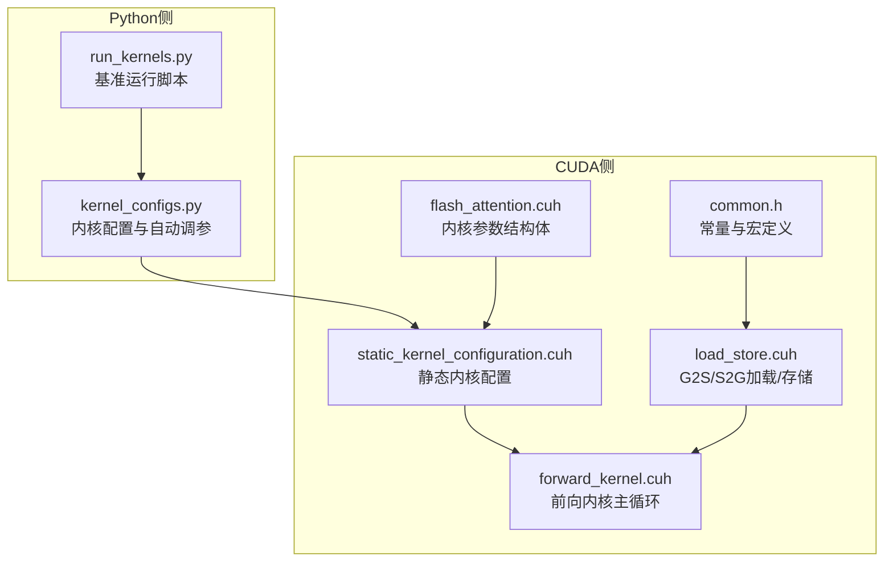
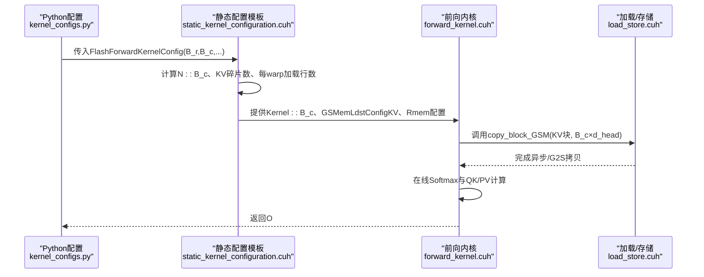
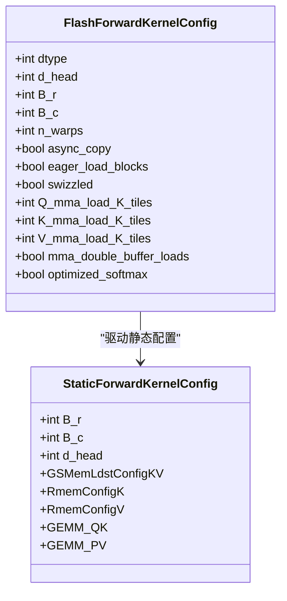
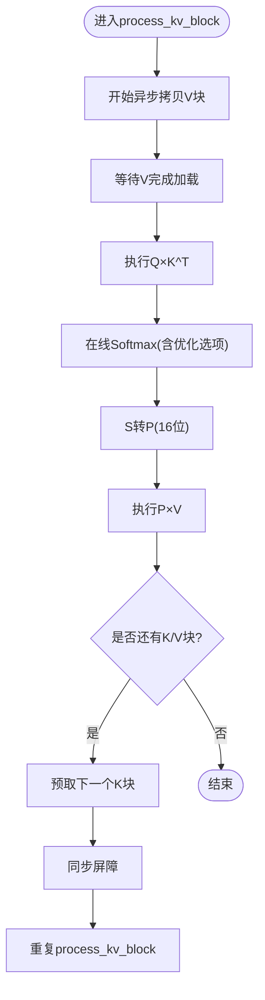
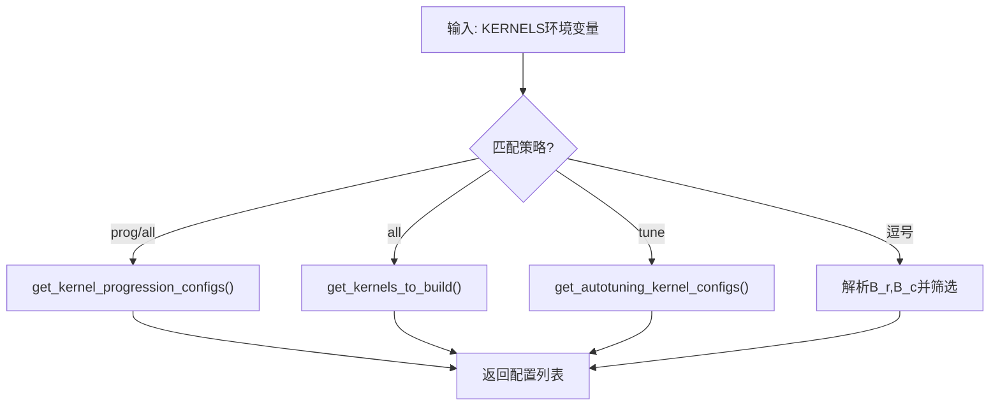
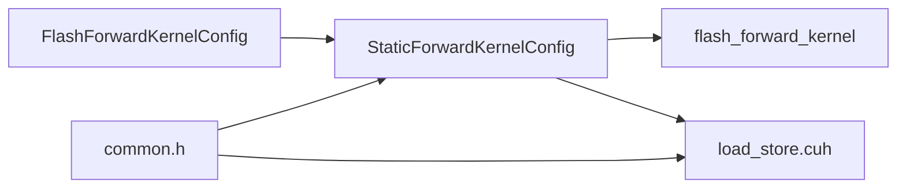

# 列块大小(B_c)配置

<cite>
**本文引用的文件**
- [kernel_configs.py](file://py/flash_helpers/kernel_configs.py)
- [forward_kernel.cuh](file://src/include/forward_kernel.cuh)
- [static_kernel_configuration.cuh](file://src/include/static_kernel_configuration.cuh)
- [load_store.cuh](file://src/include/load_store.cuh)
- [flash_attention.cuh](file://src/include/flash_attention.cuh)
- [common.h](file://src/include/common.h)
- [run_kernels.py](file://tools/benchmark/run_kernels.py)
- [README.md](file://README.md)
</cite>

## 目录
1. [引言](#引言)
2. [项目结构](#项目结构)
3. [核心组件](#核心组件)
4. [架构总览](#架构总览)
5. [详细组件分析](#详细组件分析)
6. [依赖关系分析](#依赖关系分析)
7. [性能考量](#性能考量)
8. [故障排查指南](#故障排查指南)
9. [结论](#结论)
10. [附录](#附录)

## 引言
本文件围绕列块大小B_c在Flash Attention前向计算中的关键作用展开，结合Python侧的内核配置生成器与CUDA侧静态内核配置，系统阐释：
- B_c如何决定K/V矩阵的分块粒度；
- B_c对内存带宽利用、Softmax计算效率与bank冲突的影响；
- 针对不同硬件架构与序列长度的B_c取值建议；
- B_c与B_r的协同优化策略。

## 项目结构
该仓库包含两部分关键代码：
- Python侧：内核配置与自动调参工具，负责生成不同B_c/B_r组合及特征开关；
- CUDA侧：前向内核与静态配置模板，负责将配置映射为具体的内存布局、加载/存储与算子调度。

图表来源
- [kernel_configs.py](file://py/flash_helpers/kernel_configs.py#L426-L455)
- [forward_kernel.cuh](file://src/include/forward_kernel.cuh#L85-L204)
- [static_kernel_configuration.cuh](file://src/include/static_kernel_configuration.cuh#L104-L293)
- [load_store.cuh](file://src/include/load_store.cuh#L98-L126)
- [flash_attention.cuh](file://src/include/flash_attention.cuh#L1-L110)
- [common.h](file://src/include/common.h#L1-L83)

章节来源
- [README.md](file://README.md#L1-L63)

## 核心组件
- 内核配置对象：包含B_c、B_r、n_warps、异步拷贝、预取、swizzle、MMAs加载片段数、双缓冲、优化Softmax等字段，用于描述一次内核实例的全部静态配置。
- 前向内核：按B_r分块扫描Q，按B_c分块扫描K/V，执行在线Softmax与QK/PV矩阵乘。
- 静态内核配置：将配置映射为共享内存布局、寄存器缓冲区尺寸、G2S/S2G拷贝形状与步幅、算子tile形状等。
- 加载/存储：基于GSMemLdstConfig/SRMemLdstConfig的逐线程/每warp拷贝逻辑，体现B_c对KV块加载粒度的影响。

章节来源
- [flash_attention.cuh](file://src/include/flash_attention.cuh#L1-L110)
- [forward_kernel.cuh](file://src/include/forward_kernel.cuh#L85-L204)
- [static_kernel_configuration.cuh](file://src/include/static_kernel_configuration.cuh#L104-L293)
- [load_store.cuh](file://src/include/load_store.cuh#L98-L126)

## 架构总览
下图展示从配置到内核执行的关键路径，突出B_c在KV块加载与算子tile中的作用。

图表来源
- [kernel_configs.py](file://py/flash_helpers/kernel_configs.py#L426-L455)
- [static_kernel_configuration.cuh](file://src/include/static_kernel_configuration.cuh#L104-L293)
- [forward_kernel.cuh](file://src/include/forward_kernel.cuh#L85-L204)
- [load_store.cuh](file://src/include/load_store.cuh#L98-L126)

## 详细组件分析

### 组件A：B_c在配置与内核中的角色
- 配置层面：B_c作为内核配置的一部分，参与决定KV块形状(B_c×d_head)、每warp加载行数、寄存器tile缓冲大小等。
- 内核层面：B_c直接体现在KV块的GSMem形状、共享内存布局、G2S拷贝迭代次数与步幅，进而影响访存模式与吞吐。

图表来源
- [flash_attention.cuh](file://src/include/flash_attention.cuh#L1-L110)
- [static_kernel_configuration.cuh](file://src/include/static_kernel_configuration.cuh#L104-L293)

章节来源
- [flash_attention.cuh](file://src/include/flash_attention.cuh#L1-L110)
- [static_kernel_configuration.cuh](file://src/include/static_kernel_configuration.cuh#L104-L293)

### 组件B：B_c对K/V分块与内存访问的影响
- KV块形状：KV块为(B_c×d_head)，静态配置中以GSMemShapeKV与GSSMemKVStride描述，B_c越大，单次拷贝的数据体量越大，但每warp独立加载的行数(B_c/n_warps)保持固定。
- 拷贝粒度：copy_block_GSM按OpStride::row()×COLS_PER_FRAGMENT的tile进行迭代，B_c决定OpIters::rows()与拷贝次数；更大的B_c意味着更多的行被连续加载。
- 共享内存占用：KV共享内存大小为B_c×d_head，B_c增大直接提升SMEM占用，需与寄存器/CTA数量限制平衡。

图表来源
- [forward_kernel.cuh](file://src/include/forward_kernel.cuh#L175-L184)
- [load_store.cuh](file://src/include/load_store.cuh#L98-L126)

章节来源
- [forward_kernel.cuh](file://src/include/forward_kernel.cuh#L175-L184)
- [load_store.cuh](file://src/include/load_store.cuh#L98-L126)

### 组件C：B_c与B_r的协同优化
- B_r决定Q/O块的行数，B_c决定K/V块的行数；两者共同决定每轮迭代的算力与带宽需求。
- 静态配置中，KV计算碎片数KV_calc_fragments = B_c/ROWS_PER_FRAGMENT，每warp加载碎片数KV_ldst_fragments_per_warp = KV_calc_fragments/n_warps，从而确定每warp的独立加载行数KV_ldst_rows_per_warp。
- 当B_c增大时，KV计算碎片数增加，但每warp加载行数不变（若n_warps固定），这要求更高的寄存器/SMEM容量与更高效的G2S拷贝。

章节来源
- [static_kernel_configuration.cuh](file://src/include/static_kernel_configuration.cuh#L37-L103)

### 组件D：B_c对内存带宽、Bank冲突与吞吐的影响
- 带宽利用：较大的B_c可减少G2S拷贝次数，提高带宽利用率；但需配合合适的异步拷贝与预取策略，避免流水线停顿。
- Bank冲突：swizzle与stride设计旨在降低bank冲突；B_c越大，单次拷贝覆盖更多行，需确保stride与swizzle能充分跨行交错。
- 算子吞吐：B_c影响S_accum与P的tile形状，进而影响GEMM_QK与GEMM_PV的tile划分与寄存器占用，需要与Q/K/V的MMAs加载片段数协调。

章节来源
- [load_store.cuh](file://src/include/load_store.cuh#L98-L126)
- [static_kernel_configuration.cuh](file://src/include/static_kernel_configuration.cuh#L140-L211)
- [common.h](file://src/include/common.h#L1-L83)

### 组件E：Python侧配置生成与B_c取值策略
- get_kernel_progression_configs：提供从基础配置逐步扩展到多组(B_r,B_c,n_warps)的内核集合，便于对比不同B_c对性能的影响。
- get_autotuning_kernel_configs：枚举B_c∈{32,64}、B_r∈{64,128}、n_warps∈{4,8}等组合，并通过should_autotune_config过滤不合法或过寄存器的配置。
- get_kernel_configs：支持按环境变量选择“进度”、“全集”、“自动调优”等策略，便于快速筛选不同B_c/B_r组合。

图表来源
- [kernel_configs.py](file://py/flash_helpers/kernel_configs.py#L426-L486)

章节来源
- [kernel_configs.py](file://py/flash_helpers/kernel_configs.py#L426-L486)

## 依赖关系分析
- 配置到内核：FlashForwardKernelConfig驱动StaticForwardKernelConfig，后者决定Kernel::B_c、GSMemLdstConfigKV、Rmem配置与GEMM形状。
- 内核到数据路径：forward_kernel.cuh调用load_store.cuh的拷贝函数，按GSMem形状与步幅进行G2S/S2G搬运。
- 常量与宏：common.h定义的ROWS_PER_FRAGMENT、COLS_PER_FRAGMENT、SWIZZLE_TILE_SIZE等常量，直接影响B_c相关的tile划分与swizzle空间。

图表来源
- [flash_attention.cuh](file://src/include/flash_attention.cuh#L1-L110)
- [static_kernel_configuration.cuh](file://src/include/static_kernel_configuration.cuh#L104-L293)
- [forward_kernel.cuh](file://src/include/forward_kernel.cuh#L85-L204)
- [load_store.cuh](file://src/include/load_store.cuh#L98-L126)
- [common.h](file://src/include/common.h#L1-L83)

章节来源
- [flash_attention.cuh](file://src/include/flash_attention.cuh#L1-L110)
- [static_kernel_configuration.cuh](file://src/include/static_kernel_configuration.cuh#L104-L293)
- [forward_kernel.cuh](file://src/include/forward_kernel.cuh#L85-L204)
- [load_store.cuh](file://src/include/load_store.cuh#L98-L126)
- [common.h](file://src/include/common.h#L1-L83)

## 性能考量
- B_c与带宽：较大的B_c可减少拷贝次数，但需保证足够的SMEM与寄存器，避免流水线阻塞；应结合异步拷贝与预取策略。
- B_c与吞吐：B_c增大导致S_accum/P的tile更大，可能增加寄存器压力；需与Q/K/V的MMAs加载片段数协调，避免寄存器溢出。
- B_c与bank冲突：通过swizzle与stride设计降低冲突；B_c越大，越需关注跨行交错与跨swizzle空间的均匀性。
- B_r与B_c协同：B_r主导Q/O块，B_c主导K/V块；在给定n_warps下，B_c增大并不改变每warp加载行数，但会增加整体计算与访存规模，需综合评估。

[本节为通用性能讨论，无需列出具体文件来源]

## 故障排查指南
- 寄存器溢出：当B_c增大且MMAs加载片段数较大时，可能出现寄存器不足；可通过减少Q/K/V的load_K_fragments或启用双缓冲来缓解。
- SMEM不足：B_c增大直接提升SMEM占用，需检查num_ctas_per_sm与smem_bytes；必要时降低B_c或n_warps。
- 流水线停顿：异步拷贝未正确commit/wait或同步屏障位置不当，会导致后续算子等待；需核对process_kv_block中的cp_async与__syncthreads调用顺序。
- 数据类型与步幅：确保GMemStride与SmemStride一致，避免跨行/跨swizzle空间的错配导致bank冲突或访存不连续。

章节来源
- [flash_attention.cuh](file://src/include/flash_attention.cuh#L54-L66)
- [forward_kernel.cuh](file://src/include/forward_kernel.cuh#L175-L184)
- [load_store.cuh](file://src/include/load_store.cuh#L98-L126)

## 结论
- B_c是K/V分块的核心参数，直接影响KV块形状、G2S拷贝粒度、寄存器tile划分与SMEM占用。
- 在当前实现中，B_c常见取值为32、64、128，分别对应不同的算力/带宽权衡与寄存器/SMEM约束。
- 通过Python侧配置生成器与CUDA侧静态配置模板，可以系统地探索不同B_c/B_r组合的性能表现，并结合异步拷贝、预取、swizzle与双缓冲等技术实现最佳吞吐。

[本节为总结性内容，无需列出具体文件来源]

## 附录

### 不同硬件与序列长度下的B_c取值建议
- Ampere架构(A100/RTX 3090)：d_head=128时，B_c=64通常能在带宽与寄存器占用间取得良好平衡；长序列(seq_len≥4096)可考虑B_c=128以减少拷贝次数，但需验证寄存器/SMEM限制。
- 序列长度较短(≤2048)：B_c=32可获得更细粒度的流水线，降低延迟；同时减少SMEM占用，适合资源紧张场景。
- 序列长度较长(≥8192)：B_c=128可显著提升带宽利用率，但需确保异步拷贝与双缓冲策略到位，避免流水线停顿。

章节来源
- [README.md](file://README.md#L1-L63)
- [kernel_configs.py](file://py/flash_helpers/kernel_configs.py#L389-L424)

### B_c与B_r协同优化策略
- 固定n_warps：B_c增大不改变每warp加载行数，但会增加整体计算与访存规模；建议优先提升B_r以扩大每warp计算规模，再视资源情况提升B_c。
- 异步拷贝与预取：在process_kv_block中合理安排K/V的异步拷贝与同步屏障，使拷贝与计算重叠，缓解B_c增大带来的访存瓶颈。
- MMAs加载片段数：根据B_c与d_head选择合适的Q/K/V的load_K_fragments，避免寄存器溢出；必要时启用双缓冲以提升吞吐。

章节来源
- [forward_kernel.cuh](file://src/include/forward_kernel.cuh#L175-L184)
- [static_kernel_configuration.cuh](file://src/include/static_kernel_configuration.cuh#L37-L103)
- [kernel_configs.py](file://py/flash_helpers/kernel_configs.py#L389-L424)