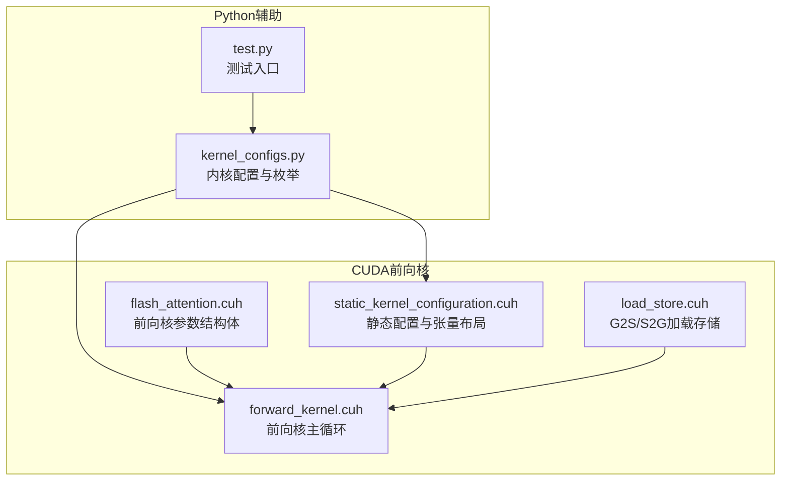
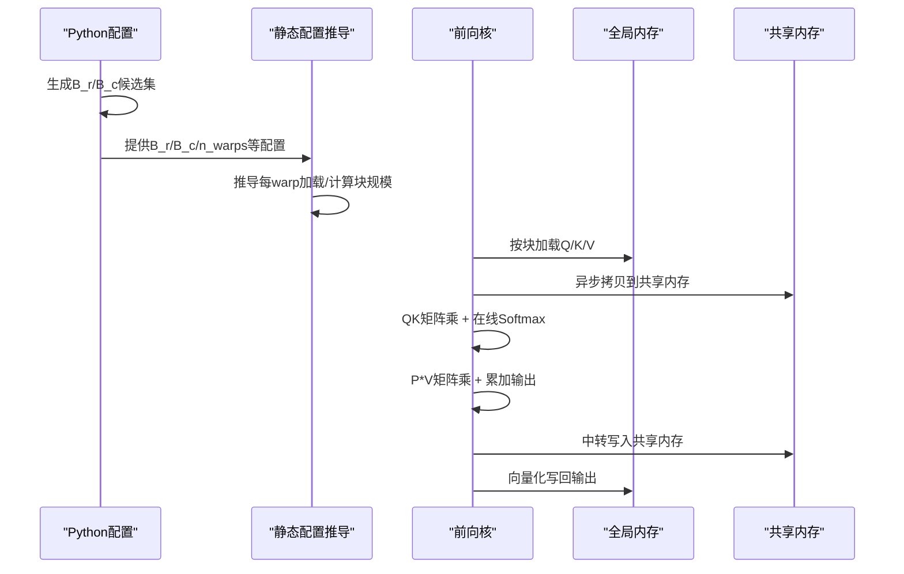
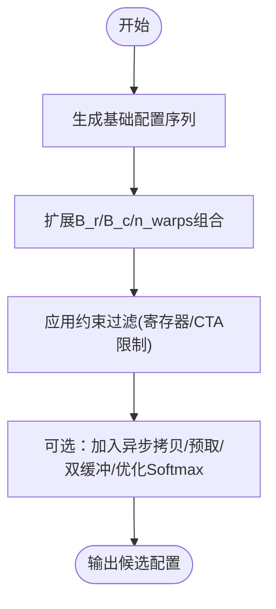
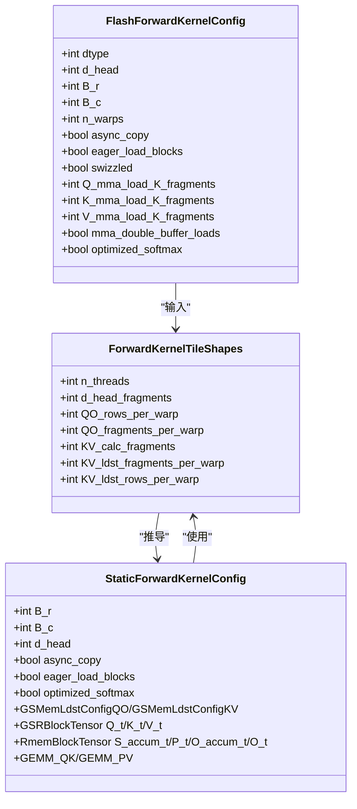
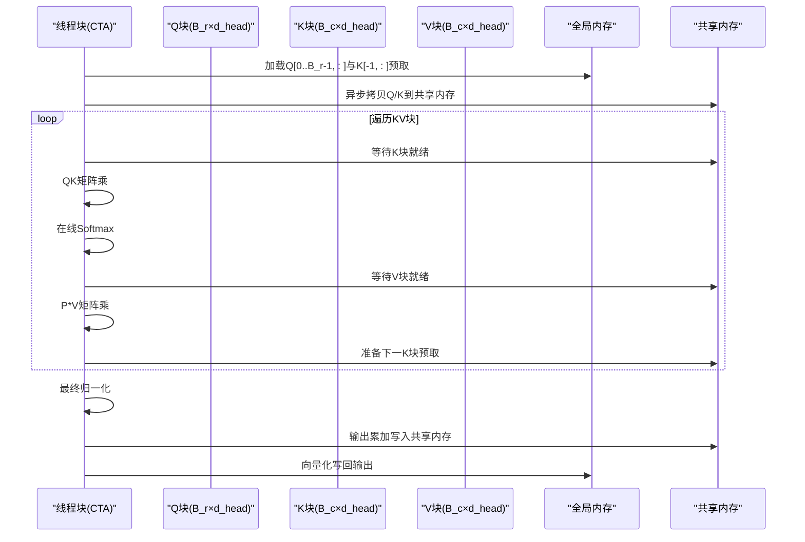
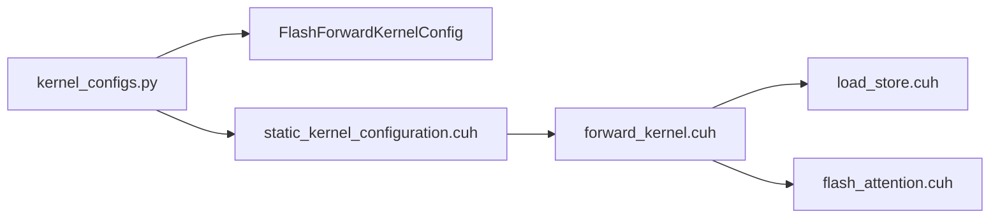

# 块大小配置

<cite>
**本文引用的文件列表**
- [kernel_configs.py](file://py/flash_helpers/kernel_configs.py)
- [forward_kernel.cuh](file://src/include/forward_kernel.cuh)
- [static_kernel_configuration.cuh](file://src/include/static_kernel_configuration.cuh)
- [flash_attention.cuh](file://src/include/flash_attention.cuh)
- [load_store.cuh](file://previous_kernels/src_14/include/load_store.cuh)
- [test.py](file://py/flash_helpers/test/test.py)
- [README.md](file://README.md)
</cite>

## 目录
1. [引言](#引言)
2. [项目结构](#项目结构)
3. [核心组件](#核心组件)
4. [架构总览](#架构总览)
5. [详细组件分析](#详细组件分析)
6. [依赖关系分析](#依赖关系分析)
7. [性能考量](#性能考量)
8. [故障排查指南](#故障排查指南)
9. [结论](#结论)
10. [附录](#附录)

## 引言
本文件围绕B_r（行块大小）与B_c（列块大小）这两个关键配置参数，系统阐述其在Flash Attention前向计算中的决定性作用。通过对Python侧内核配置工具与CUDA前向核实现的联合分析，解释B_r/B_c如何控制每个线程块（CTA）处理的查询与键值对数量，并进一步影响全局内存带宽利用率、共享内存bank冲突与计算密度等性能要素。同时给出基于序列长度与硬件约束的实践选型建议，帮助读者在不同场景下选择最优块大小组合（例如64x64、128x32）。

## 项目结构
该仓库包含两套实现：
- Python辅助模块：负责内核配置生成、自动调参与内核名解析
- CUDA前向核：实现Flash Attention核心计算流程，包括QK与PV矩阵乘、在线Softmax与结果写回

图表来源
- [kernel_configs.py](file://py/flash_helpers/kernel_configs.py#L426-L455)
- [forward_kernel.cuh](file://src/include/forward_kernel.cuh#L85-L204)
- [static_kernel_configuration.cuh](file://src/include/static_kernel_configuration.cuh#L104-L291)
- [flash_attention.cuh](file://src/include/flash_attention.cuh#L1-L110)
- [load_store.cuh](file://previous_kernels/src_14/include/load_store.cuh#L102-L132)
- [test.py](file://py/flash_helpers/test/test.py#L1-L104)

章节来源
- [README.md](file://README.md#L1-L63)

## 核心组件
- 内核配置数据结构：定义dtype、d_head、B_r、B_c、n_warps、异步拷贝、预取、swizzle、各张量的K碎片数、双缓冲等字段，用于描述一次内核实例的所有静态配置
- 静态配置推导：根据B_r/B_c/n_warps等参数，推导每线程/每warp的加载/计算块规模、寄存器/共享内存布局与拷贝迭代次数
- 前向核实现：以CTA为粒度，按q_seq_block推进，每次处理一个B_r行的Q块与遍历所有KV块，执行QK与PV矩阵乘、在线Softmax与累加输出

章节来源
- [flash_attention.cuh](file://src/include/flash_attention.cuh#L31-L110)
- [static_kernel_configuration.cuh](file://src/include/static_kernel_configuration.cuh#L104-L291)
- [forward_kernel.cuh](file://src/include/forward_kernel.cuh#L85-L204)

## 架构总览
B_r/B_c贯穿“配置-布局-加载-计算-写回”的全链路：
- 配置阶段：get_kernel_progression_configs()等函数枚举B_r/B_c候选组合，结合dtype、n_warps、预取策略等生成候选集
- 静态推导：StaticForwardKernelConfig依据B_r/B_c/n_warps推导每warp的Q/O行数、KV行数、寄存器/共享内存分块与拷贝迭代
- 执行阶段：flash_forward_kernel按q_seq_block推进，每个CTA处理B_r行Q与遍历所有KV块，完成QK/PV计算与在线Softmax

图表来源
- [kernel_configs.py](file://py/flash_helpers/kernel_configs.py#L426-L455)
- [static_kernel_configuration.cuh](file://src/include/static_kernel_configuration.cuh#L104-L291)
- [forward_kernel.cuh](file://src/include/forward_kernel.cuh#L85-L204)

## 详细组件分析

### 组件A：内核配置与块大小枚举
- get_kernel_progression_configs()提供从基础到进阶的配置序列，覆盖B_r={64,128}、B_c={32,64}、n_warps={4,8}等组合，并逐步引入异步拷贝、预取、swizzle、双缓冲与优化Softmax等特性
- should_autotune_config()对某些组合施加约束（如B_r=64时对n_warps与Q_mma_load_K_tiles的限制），确保满足寄存器/共享内存/吞吐约束
- get_kernels_to_build()/get_kernel_configs()支持按环境变量筛选特定组合或全量构建

图表来源
- [kernel_configs.py](file://py/flash_helpers/kernel_configs.py#L426-L455)
- [kernel_configs.py](file://py/flash_helpers/kernel_configs.py#L364-L387)
- [kernel_configs.py](file://py/flash_helpers/kernel_configs.py#L389-L424)

章节来源
- [kernel_configs.py](file://py/flash_helpers/kernel_configs.py#L364-L387)
- [kernel_configs.py](file://py/flash_helpers/kernel_configs.py#L389-L424)
- [kernel_configs.py](file://py/flash_helpers/kernel_configs.py#L426-L455)

### 组件B：静态配置与块大小映射
- ForwardKernelTileShapes根据B_r/B_c/n_warps推导每warp的Q/O行数、KV行数、寄存器/共享内存分块与拷贝迭代
- StaticForwardKernelConfig将上述推导固化为编译期常量，驱动G2S/S2G拷贝、GEMM布局与寄存器布局

图表来源
- [flash_attention.cuh](file://src/include/flash_attention.cuh#L31-L110)
- [static_kernel_configuration.cuh](file://src/include/static_kernel_configuration.cuh#L37-L103)
- [static_kernel_configuration.cuh](file://src/include/static_kernel_configuration.cuh#L104-L291)

章节来源
- [flash_attention.cuh](file://src/include/flash_attention.cuh#L31-L110)
- [static_kernel_configuration.cuh](file://src/include/static_kernel_configuration.cuh#L37-L103)
- [static_kernel_configuration.cuh](file://src/include/static_kernel_configuration.cuh#L104-L291)

### 组件C：前向核执行与块大小控制
- flash_forward_kernel以blockIdx.x对应q_seq_block推进，每个CTA处理B_r行Q与遍历所有KV块
- 共享内存布局中，Q占用B_r×d_head空间，K/V分别占用B_c×d_head空间；拷贝采用异步commit/commit/wait流水
- 过程中进行QK矩阵乘、在线Softmax、P*V矩阵乘与最终归一化后写回

图表来源
- [forward_kernel.cuh](file://src/include/forward_kernel.cuh#L85-L204)

章节来源
- [forward_kernel.cuh](file://src/include/forward_kernel.cuh#L85-L204)

### 组件D：加载存储与块大小的关系
- load_store.cuh定义了按块拷贝的迭代次数与步长，体现B_r/B_c如何决定每warp的拷贝次数与向量化粒度
- 每个warp独立加载自身负责的(seq_len_per_warp, d_head)块，其中seq_len_per_warp由B_r/n_warps决定

章节来源
- [load_store.cuh](file://previous_kernels/src_14/include/load_store.cuh#L102-L132)
- [static_kernel_configuration.cuh](file://src/include/static_kernel_configuration.cuh#L41-L70)

## 依赖关系分析
- Python配置层依赖于FlashForwardKernelConfig与枚举函数，生成候选配置集合
- CUDA静态配置层依赖于B_r/B_c/n_warps推导张量布局与拷贝迭代
- 前向核实现依赖静态配置提供的张量类型、GEMM配置与共享内存布局

图表来源
- [kernel_configs.py](file://py/flash_helpers/kernel_configs.py#L106-L175)
- [static_kernel_configuration.cuh](file://src/include/static_kernel_configuration.cuh#L104-L291)
- [forward_kernel.cuh](file://src/include/forward_kernel.cuh#L85-L204)
- [flash_attention.cuh](file://src/include/flash_attention.cuh#L1-L110)
- [load_store.cuh](file://previous_kernels/src_14/include/load_store.cuh#L102-L132)

章节来源
- [kernel_configs.py](file://py/flash_helpers/kernel_configs.py#L106-L175)
- [static_kernel_configuration.cuh](file://src/include/static_kernel_configuration.cuh#L104-L291)
- [forward_kernel.cuh](file://src/include/forward_kernel.cuh#L85-L204)
- [flash_attention.cuh](file://src/include/flash_attention.cuh#L1-L110)
- [load_store.cuh](file://previous_kernels/src_14/include/load_store.cuh#L102-L132)

## 性能考量
- 全局内存带宽利用率
  - B_r决定每次CTA处理的Q行数，直接影响Q读取量与写回量；B_c决定每次KV块的K/V读取量
  - 较大的B_r提升Q的向量化程度，但增加Q写回压力；较大的B_c提升KV读取吞吐，但增加K/V共享内存占用
- 共享内存bank冲突
  - B_r/B_c与d_head共同决定共享内存布局；若d_head与块大小不匹配，可能引发bank冲突
  - swizzle策略通过固定偏移降低跨迭代的冲突风险
- 计算密度
  - B_r/B_c越大，单CTA计算量越大，有助于提高算术强度；但需平衡寄存器/共享内存占用
  - n_warps影响每warp的负载，进而影响寄存器与共享内存分配
- 寄存器与CTA并发
  - smem_bytes与num_ctas_per_sm限制了可并行的CTA数量；B_r/B_c过大可能降低CTA并发度

章节来源
- [flash_attention.cuh](file://src/include/flash_attention.cuh#L54-L70)
- [static_kernel_configuration.cuh](file://src/include/static_kernel_configuration.cuh#L113-L140)
- [static_kernel_configuration.cuh](file://src/include/static_kernel_configuration.cuh#L140-L170)

## 故障排查指南
- 候选配置被过滤
  - 若出现某些B_r/B_c组合未出现在构建列表中，检查should_autotune_config()中的约束条件（如B_r=64时对n_warps与Q_mma_load_K_tiles的限制）
- 构建失败或寄存器溢出
  - 调整B_r/B_c与n_warps，减少每warp的负载；或启用/禁用双缓冲与预取策略
- 性能异常
  - 检查是否正确设置swizzled与预取策略；对比不同B_r/B_c组合的smem_bytes与num_ctas_per_sm
- 单元测试验证
  - 使用测试脚本对不同配置进行数值一致性校验，确保结果与参考实现一致

章节来源
- [kernel_configs.py](file://py/flash_helpers/kernel_configs.py#L364-L387)
- [flash_attention.cuh](file://src/include/flash_attention.cuh#L54-L70)
- [test.py](file://py/flash_helpers/test/test.py#L1-L104)

## 结论
B_r与B_c是Flash Attention性能的关键“杠杆”。通过Python侧的配置枚举与过滤、CUDA侧的静态配置推导与执行流水，二者共同决定了：
- 每CTA处理的Q行数与KV块规模
- 共享内存布局与bank冲突
- 全局内存带宽利用与向量化程度
- 寄存器占用与CTA并发度

在实践中，应结合序列长度、硬件能力与目标算力强度，优先尝试B_r={64,128}、B_c={32,64}的组合，并在满足寄存器/共享内存约束的前提下，逐步引入异步拷贝、预取与优化Softmax等策略，以获得最佳吞吐表现。

## 附录
- 实践选型建议
  - 小序列或受限寄存器：优先B_r=64、B_c=32或64，n_warps=4
  - 大序列或高吞吐：优先B_r=128、B_c=64，n_warps=8（当硬件允许）
  - 对齐d_head：尽量使d_head与块大小在分块维度上保持良好整除关系，减少bank冲突
  - 开启swizzle与预取：在大多数情况下可显著提升带宽利用率
  - 双缓冲与优化Softmax：在计算密集场景下进一步提升算力利用率