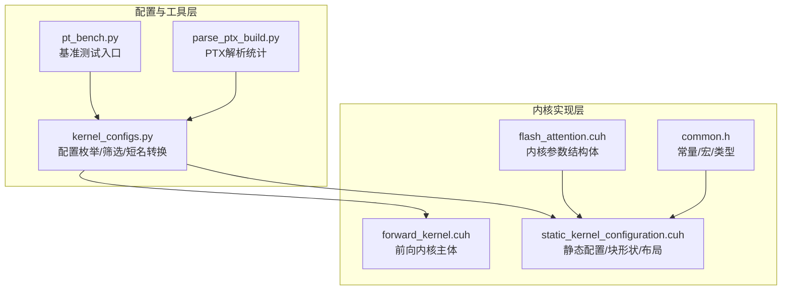
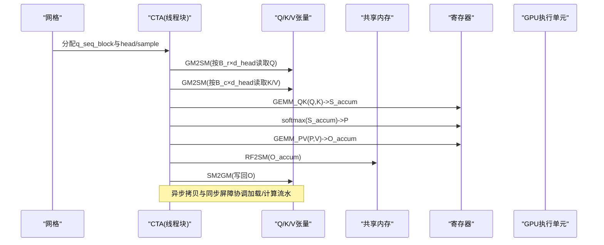
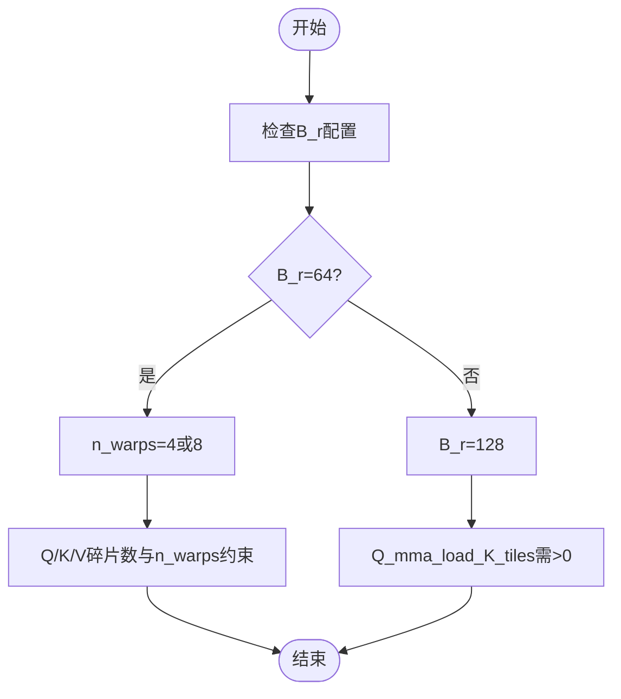
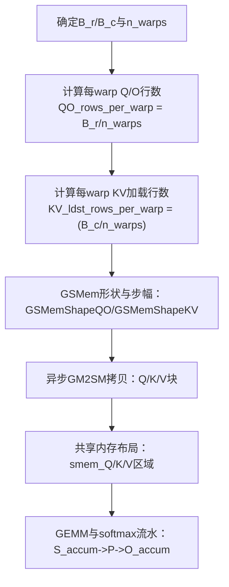
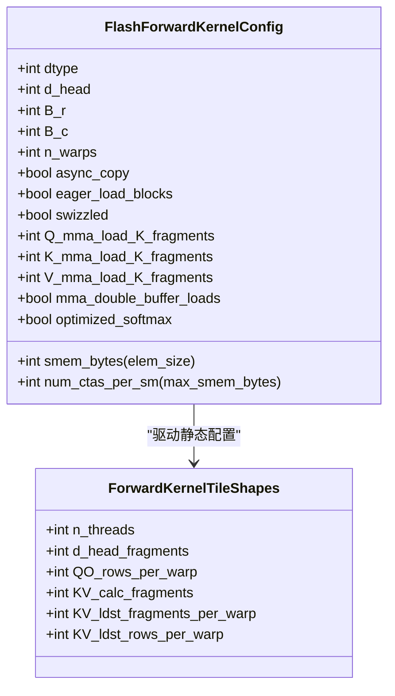
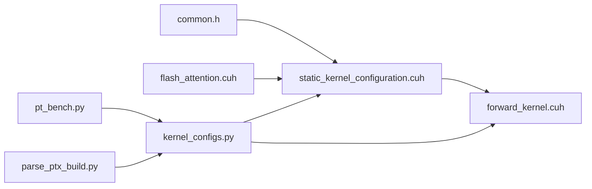

# 行块大小(B_r)配置

<cite>
**本文引用的文件列表**
- [py/flash_helpers/kernel_configs.py](file://py/flash_helpers/kernel_configs.py)
- [src/include/forward_kernel.cuh](file://src/include/forward_kernel.cuh)
- [src/include/static_kernel_configuration.cuh](file://src/include/static_kernel_configuration.cuh)
- [src/include/flash_attention.cuh](file://src/include/flash_attention.cuh)
- [src/include/common.h](file://src/include/common.h)
- [tools/benchmark/pt_bench.py](file://tools/benchmark/pt_bench.py)
- [tools/build/parse_ptx_build.py](file://tools/build/parse_ptx_build.py)
</cite>

## 目录
1. [引言](#引言)
2. [项目结构](#项目结构)
3. [核心组件](#核心组件)
4. [架构总览](#架构总览)
5. [详细组件分析](#详细组件分析)
6. [依赖关系分析](#依赖关系分析)
7. [性能考量](#性能考量)
8. [故障排查指南](#故障排查指南)
9. [结论](#结论)
10. [附录](#附录)

## 引言
本文件围绕行块大小B_r参数对Flash Attention性能的影响进行系统化分析。基于py/flash_helpers/kernel_configs.py中的配置生成与筛选逻辑，以及src/include/forward_kernel.cuh与src/include/static_kernel_configuration.cuh中的内核实现细节，解释B_r=64与B_r=128两种配置如何影响每个线程块处理的查询数量、全局内存访问模式、共享内存利用率与计算并行度，并给出不同序列长度下的实践选型建议与寄存器压力与线程束利用率的权衡分析。

## 项目结构
本仓库采用“内核实现层”与“配置与工具层”分离的组织方式：
- 内核实现层：src/include/*.cuh定义了前向注意力内核、静态配置、张量加载/存储、GEMM等核心组件
- 配置与工具层：py/flash_helpers/kernel_configs.py负责内核配置枚举、筛选与短名转换；tools目录包含基准测试与构建分析脚本

图表来源
- [py/flash_helpers/kernel_configs.py](file://py/flash_helpers/kernel_configs.py#L426-L455)
- [src/include/forward_kernel.cuh](file://src/include/forward_kernel.cuh#L85-L204)
- [src/include/static_kernel_configuration.cuh](file://src/include/static_kernel_configuration.cuh#L104-L160)
- [src/include/flash_attention.cuh](file://src/include/flash_attention.cuh#L30-L109)
- [src/include/common.h](file://src/include/common.h#L17-L44)
- [tools/benchmark/pt_bench.py](file://tools/benchmark/pt_bench.py#L1-L200)
- [tools/build/parse_ptx_build.py](file://tools/build/parse_ptx_build.py#L94-L124)

章节来源
- [py/flash_helpers/kernel_configs.py](file://py/flash_helpers/kernel_configs.py#L426-L455)
- [src/include/forward_kernel.cuh](file://src/include/forward_kernel.cuh#L85-L204)
- [src/include/static_kernel_configuration.cuh](file://src/include/static_kernel_configuration.cuh#L104-L160)
- [src/include/flash_attention.cuh](file://src/include/flash_attention.cuh#L30-L109)
- [src/include/common.h](file://src/include/common.h#L17-L44)
- [tools/benchmark/pt_bench.py](file://tools/benchmark/pt_bench.py#L1-L200)
- [tools/build/parse_ptx_build.py](file://tools/build/parse_ptx_build.py#L94-L124)

## 核心组件
- 配置生成与筛选：get_kernel_progression_configs()与get_autotuning_kernel_configs()提供B_r/B_c等关键参数的组合空间，其中B_r默认包含64与128两档
- 静态配置与块形状：ForwardKernelTileShapes根据B_r、B_c、n_warps等推导每warp的Q/O行数、KV计算/加载片段数等
- 前向内核：flash_forward_kernel按块处理Q/O与KV序列，通过异步拷贝与同步屏障协调加载/计算流水
- 参数结构体：FlashForwardKernelConfig定义dtype、d_head、B_r、B_c、n_warps、异步拷贝、预加载、swizzle、mma碎片数、双缓冲、优化softmax等

章节来源
- [py/flash_helpers/kernel_configs.py](file://py/flash_helpers/kernel_configs.py#L389-L424)
- [py/flash_helpers/kernel_configs.py](file://py/flash_helpers/kernel_configs.py#L426-L455)
- [src/include/static_kernel_configuration.cuh](file://src/include/static_kernel_configuration.cuh#L37-L103)
- [src/include/forward_kernel.cuh](file://src/include/forward_kernel.cuh#L85-L204)
- [src/include/flash_attention.cuh](file://src/include/flash_attention.cuh#L30-L109)

## 架构总览
B_r作为每CTA处理的查询行数（B_r行），直接影响以下方面：
- 每warp处理的Q/O行数：QO_rows_per_warp = B_r / n_warps
- 共享内存占用：smem_bytes = (B_r + B_c*2)*d_head*元素字节数
- 全局内存访问模式：Q/O按B_r×d_head块读写，K/V按B_c×d_head块遍历
- 计算并行度：n_warps决定warp级并行粒度与寄存器占用

图表来源
- [src/include/forward_kernel.cuh](file://src/include/forward_kernel.cuh#L111-L184)
- [src/include/static_kernel_configuration.cuh](file://src/include/static_kernel_configuration.cuh#L142-L159)

## 详细组件分析

### B_r=64 vs B_r=128：对每CTA处理查询数量的影响
- B_r=64：每CTA处理64行查询；当n_warps=4时，每warp处理16行；当n_warps=8时，每warp处理8行
- B_r=128：每CTA处理128行查询；当n_warps=4时，每warp处理32行；当n_warps=8时，每warp处理16行
- 配置筛选规则：autotune中对B_r=64与B_r=128分别有不同限制，例如B_r=64时对某些Q_mma_load_K_tiles与n_warps存在禁用条件，B_r=128时要求Q_mma_load_K_tiles非零

图表来源
- [py/flash_helpers/kernel_configs.py](file://py/flash_helpers/kernel_configs.py#L364-L387)
- [py/flash_helpers/kernel_configs.py](file://py/flash_helpers/kernel_configs.py#L389-L424)

章节来源
- [py/flash_helpers/kernel_configs.py](file://py/flash_helpers/kernel_configs.py#L364-L387)
- [py/flash_helpers/kernel_configs.py](file://py/flash_helpers/kernel_configs.py#L389-L424)

### B_r如何决定Q矩阵的分块策略与全局内存访问
- Q/O块尺寸：B_r×d_head，每CTA仅处理一个Q/O块
- K/V块尺寸：B_c×d_head，按B_c遍历整个KV序列
- 访问模式：Q/O按行主序连续访问；K/V按B_c块遍历，配合swizzle提升带宽利用
- 异步拷贝：Q/K/V块通过cp_async异步加载到共享内存，减少等待延迟

图表来源
- [src/include/static_kernel_configuration.cuh](file://src/include/static_kernel_configuration.cuh#L142-L159)
- [src/include/static_kernel_configuration.cuh](file://src/include/static_kernel_configuration.cuh#L173-L211)
- [src/include/forward_kernel.cuh](file://src/include/forward_kernel.cuh#L111-L184)

章节来源
- [src/include/static_kernel_configuration.cuh](file://src/include/static_kernel_configuration.cuh#L142-L159)
- [src/include/static_kernel_configuration.cuh](file://src/include/static_kernel_configuration.cuh#L173-L211)
- [src/include/forward_kernel.cuh](file://src/include/forward_kernel.cuh#L111-L184)

### 共享内存利用率与计算并行度
- 共享内存占用：smem_bytes = (B_r + B_c*2)*d_head*元素字节数，B_r与B_c越大，占用越高
- 并行度：n_warps越多，warp级并行越细，但单warp寄存器压力增大
- 碎片与缓冲：Q/K/V的mma_load_K_fragments决定寄存器中K碎片数与是否双缓冲，影响寄存器占用与流水

图表来源
- [src/include/flash_attention.cuh](file://src/include/flash_attention.cuh#L30-L109)
- [src/include/static_kernel_configuration.cuh](file://src/include/static_kernel_configuration.cuh#L37-L103)

章节来源
- [src/include/flash_attention.cuh](file://src/include/flash_attention.cuh#L30-L109)
- [src/include/static_kernel_configuration.cuh](file://src/include/static_kernel_configuration.cuh#L37-L103)

### B_r对寄存器压力与线程束利用率的权衡
- 寄存器压力：B_r增大导致每warp需要处理更多行，同时可能增加K/V碎片数与双缓冲需求，从而提高寄存器占用
- 线程束利用率：B_r=128通常搭配n_warps=8，有利于充分利用32线程/束；B_r=64搭配n_warps=4更保守，寄存器压力更低
- 自动调优约束：autotune中对B_r=64与B_r=128分别设置阈值与禁用条件，避免超过寄存器上限

章节来源
- [py/flash_helpers/kernel_configs.py](file://py/flash_helpers/kernel_configs.py#L364-L387)
- [src/include/flash_attention.cuh](file://src/include/flash_attention.cuh#L54-L66)

## 依赖关系分析
- 配置层依赖：kernel_configs.py依赖common.h中的常量与宏，用于计算算力与内存参数
- 实现层依赖：forward_kernel.cuh依赖static_kernel_configuration.cuh提供的静态配置，后者再依赖flash_attention.cuh中的参数结构体
- 工具层依赖：pt_bench.py与parse_ptx_build.py分别从运行时与编译期角度评估性能与寄存器使用

图表来源
- [src/include/common.h](file://src/include/common.h#L17-L44)
- [src/include/static_kernel_configuration.cuh](file://src/include/static_kernel_configuration.cuh#L104-L160)
- [src/include/flash_attention.cuh](file://src/include/flash_attention.cuh#L30-L109)
- [src/include/forward_kernel.cuh](file://src/include/forward_kernel.cuh#L85-L204)
- [py/flash_helpers/kernel_configs.py](file://py/flash_helpers/kernel_configs.py#L426-L455)
- [tools/benchmark/pt_bench.py](file://tools/benchmark/pt_bench.py#L1-L200)
- [tools/build/parse_ptx_build.py](file://tools/build/parse_ptx_build.py#L94-L124)

章节来源
- [src/include/common.h](file://src/include/common.h#L17-L44)
- [src/include/static_kernel_configuration.cuh](file://src/include/static_kernel_configuration.cuh#L104-L160)
- [src/include/flash_attention.cuh](file://src/include/flash_attention.cuh#L30-L109)
- [src/include/forward_kernel.cuh](file://src/include/forward_kernel.cuh#L85-L204)
- [py/flash_helpers/kernel_configs.py](file://py/flash_helpers/kernel_configs.py#L426-L455)
- [tools/benchmark/pt_bench.py](file://tools/benchmark/pt_bench.py#L1-L200)
- [tools/build/parse_ptx_build.py](file://tools/build/parse_ptx_build.py#L94-L124)

## 性能考量
- 不同序列长度下的选型建议
  - 小序列（如≤512）：优先B_r=64，n_warps=4，降低寄存器压力，提升稳定性
  - 中等序列（约1k~2k）：可尝试B_r=128，n_warps=8，提升吞吐；若出现寄存器溢出，回退至B_r=64
  - 大序列（≥4k）：优先B_r=128，n_warps=8，最大化并行度；同时启用优化softmax与合适的mma碎片数
- 全局内存带宽
  - B_r增大提升Q/O向量化与coalescing效率，但K/V遍历次数增多，需平衡
  - 合理的B_c（如64/128）与swizzle有助于提升访存带宽
- 共享内存占用
  - smem_bytes随B_r与B_c线性增长，需确保不超过设备共享内存预算
- 寄存器与占用率
  - B_r=128通常需要更多寄存器；可通过调整Q/K/V碎片数与双缓冲策略控制占用
  - autotune中的禁用规则反映了寄存器阈值，避免过度占用导致占用率下降

章节来源
- [src/include/flash_attention.cuh](file://src/include/flash_attention.cuh#L54-L66)
- [py/flash_helpers/kernel_configs.py](file://py/flash_helpers/kernel_configs.py#L364-L387)
- [src/include/static_kernel_configuration.cuh](file://src/include/static_kernel_configuration.cuh#L142-L159)

## 故障排查指南
- 寄存器溢出
  - 现象：编译报错或运行时异常
  - 排查：降低B_r（如从128降至64）、减少Q/K/V碎片数、关闭双缓冲或优化softmax
  - 参考：autotune禁用规则与寄存器统计解析
- 占用率低
  - 现象：有效SMEM不足导致CTA并发度低
  - 排查：适当减小B_r或B_c，或调整n_warps以匹配寄存器预算
- 带宽受限
  - 现象：吞吐不达预期
  - 排查：增大B_r提升向量化，或调整B_c与swizzle；确认异步拷贝未被阻塞

章节来源
- [py/flash_helpers/kernel_configs.py](file://py/flash_helpers/kernel_configs.py#L364-L387)
- [src/include/flash_attention.cuh](file://src/include/flash_attention.cuh#L54-L66)
- [tools/build/parse_ptx_build.py](file://tools/build/parse_ptx_build.py#L94-L124)

## 结论
B_r是Flash Attention内核的关键块参数，直接决定了每CTA处理的查询行数、warp级并行度、共享内存占用与寄存器压力。在实际部署中，应结合序列长度、硬件能力与寄存器预算，在B_r=64与B_r=128之间进行权衡选择，并通过autotune与基准测试验证最终配置。对于大序列场景，优先考虑B_r=128与n_warps=8；对于小序列或寄存器紧张场景，B_r=64更稳妥。

## 附录
- 关键路径参考
  - 配置生成与筛选：[py/flash_helpers/kernel_configs.py](file://py/flash_helpers/kernel_configs.py#L389-L424)
  - 进展式配置：[py/flash_helpers/kernel_configs.py](file://py/flash_helpers/kernel_configs.py#L426-L455)
  - 静态配置与块形状：[src/include/static_kernel_configuration.cuh](file://src/include/static_kernel_configuration.cuh#L37-L103)
  - 前向内核主体：[src/include/forward_kernel.cuh](file://src/include/forward_kernel.cuh#L85-L204)
  - 参数结构体与共享内存估算：[src/include/flash_attention.cuh](file://src/include/flash_attention.cuh#L30-L109)
  - 基准测试入口：[tools/benchmark/pt_bench.py](file://tools/benchmark/pt_bench.py#L1-L200)
  - 寄存器统计解析：[tools/build/parse_ptx_build.py](file://tools/build/parse_ptx_build.py#L94-L124)