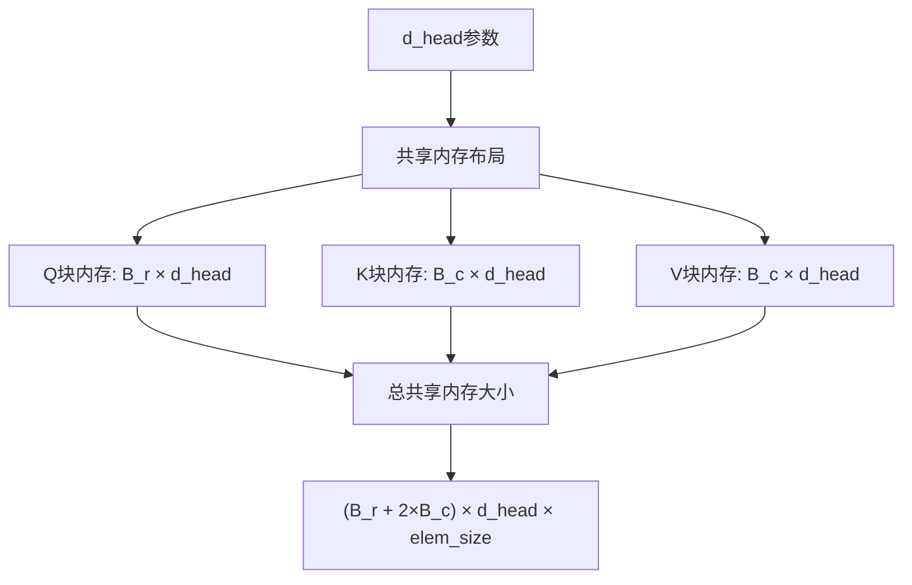
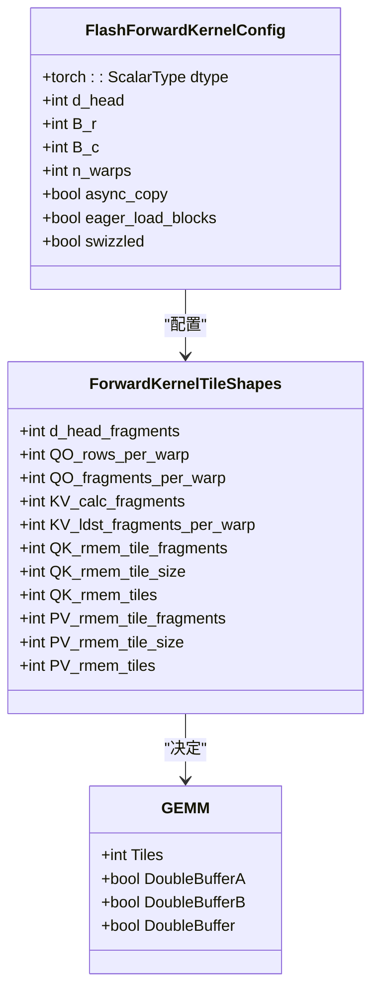
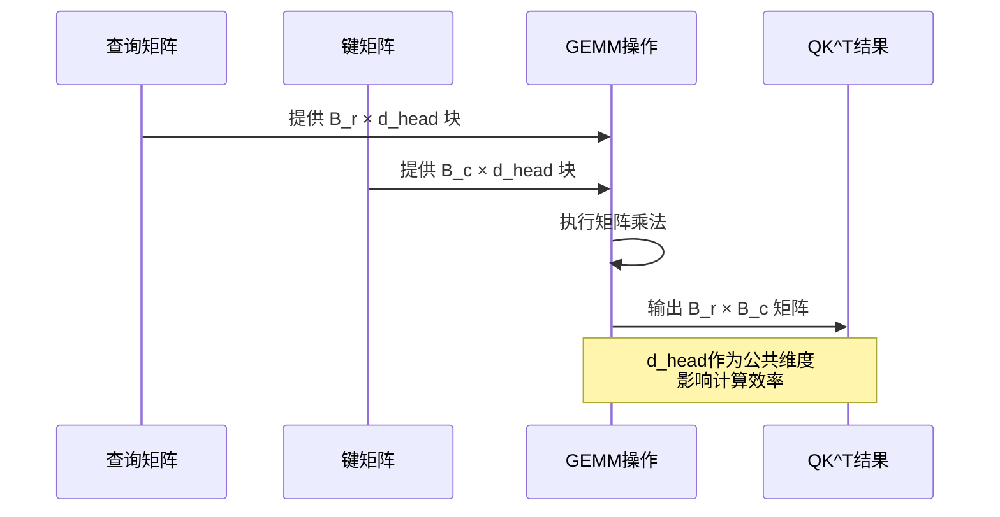

# 头维度配置

<cite>
**本文档引用的文件**   
- [flash_attention.cu](file://src/flash_attention.cu#L1-L150)
- [flash_attention.cuh](file://src/include/flash_attention.cuh#L1-L110)
- [static_kernel_configuration.cuh](file://src/include/static_kernel_configuration.cuh#L1-L294)
- [gemm.cuh](file://src/include/gemm.cuh#L1-L126)
- [layout.cuh](file://src/include/layout.cuh#L1-L269)
- [load_store.cuh](file://src/include/load_store.cuh#L1-L356)
- [common.h](file://src/include/common.h#L1-L83)
- [flash_kernels.cuh](file://src/include/flash_kernels.cuh#L1-L187)
- [tensor.cuh](file://src/include/tensor.cuh#L1-L141)
</cite>

## 目录
1. [引言](#引言)
2. [d_head参数的核心作用](#d_head参数的核心作用)
3. [d_head与共享内存布局的关系](#d_head与共享内存布局的关系)
4. [d_head对寄存器分配的影响](#d_head对寄存器分配的影响)
5. [d_head与张量核心操作的协同](#d_head与张量核心操作的协同)
6. [d_head与B_r/B_c块大小的协同关系](#d_head与B_r/B_c块大小的协同关系)
7. [d_head在数据结构中的体现](#d_head在数据结构中的体现)
8. [d_head=128配置的性能分析](#d_head=128配置的性能分析)
9. [结论](#结论)

## 引言
在Flash Attention实现中，`d_head`配置参数是决定查询（Q）、键（K）、值（V）矩阵嵌入维度的关键因素。该参数不仅影响模型的表示能力，还深刻影响着GPU计算的内存布局、寄存器分配和张量核心操作效率。本文将深入分析`d_head`参数在Flash Attention实现中的关键作用，特别是`d_head=128`这一常用配置对计算性能的影响。

## d_head参数的核心作用
`d_head`参数在`FlashForwardKernelConfig`结构体中被定义为一个常量整数，其取值范围通常为[64, 128]。该参数直接决定了注意力机制中每个注意力头的维度大小，是连接模型架构与底层硬件优化的关键桥梁。

在代码实现中，`d_head`参数通过模板元编程的方式，在编译时就被确定并用于计算各种数据结构的尺寸。这种静态配置方式避免了运行时的开销，使得内核能够以最优的方式执行。

**Section sources**
- [flash_attention.cuh](file://src/include/flash_attention.cuh#L36)
- [static_kernel_configuration.cuh](file://src/include/static_kernel_configuration.cuh#L117)

## d_head与共享内存布局的关系
`d_head`参数直接影响共享内存（shared memory）的布局和使用。在Flash Attention实现中，共享内存用于存储从全局内存加载的Q、K、V块，以便快速访问和计算。

共享内存的总字节数由`d_head`、`B_r`和`B_c`共同决定，具体计算公式为：`(B_r + B_c * 2) * d_head * elem_size`。其中`elem_size`是元素大小（通常为2字节，对应half或bfloat16类型）。



**Diagram sources **
- [flash_attention.cuh](file://src/include/flash_attention.cuh#L55)
- [static_kernel_configuration.cuh](file://src/include/static_kernel_configuration.cuh#L122)

## d_head对寄存器分配的影响
`d_head`参数对寄存器分配有重要影响。在GPU计算中，寄存器是最快的存储资源，但数量有限。`d_head`的大小直接决定了需要多少寄存器来存储中间计算结果。

在`ForwardKernelTileShapes`结构体中，`d_head_fragments`被定义为`d_head / COLS_PER_FRAGMENT`，其中`COLS_PER_FRAGMENT`是张量核心操作的基本单元大小（通常为8）。这个值决定了每个线程块需要处理的d_head片段数量。

当`d_head=128`时，`d_head_fragments=16`，这意味着每个线程块需要处理16个d_head片段。这个值需要与可用的寄存器数量相匹配，过大可能导致寄存器溢出，过小则可能无法充分利用计算资源。

**Section sources**
- [static_kernel_configuration.cuh](file://src/include/static_kernel_configuration.cuh#L45)
- [common.h](file://src/include/common.h#L38)

## d_head与张量核心操作的协同
`d_head`参数与张量核心（Tensor Cores）的操作密切相关。张量核心执行矩阵乘法操作，其输入矩阵的尺寸必须与张量核心的指令集兼容。

在`GEMM`结构体中，`QK_rmem_tile_fragments`和`PV_rmem_tile_fragments`的计算都依赖于`d_head`。这些值决定了张量核心操作的tile大小，直接影响计算效率。



**Diagram sources **
- [static_kernel_configuration.cuh](file://src/include/static_kernel_configuration.cuh#L72-L84)
- [gemm.cuh](file://src/include/gemm.cuh#L24-L39)

## d_head与B_r/B_c块大小的协同关系
`d_head`参数与`B_r`和`B_c`块大小之间存在重要的协同关系，这种关系直接影响QK^T矩阵乘法的计算效率。

`B_r`是查询块的行大小，`B_c`是键/值块的行大小。在计算QK^T时，需要将`B_r × d_head`的Q块与`B_c × d_head`的K块进行矩阵乘法。`d_head`作为两个矩阵的公共维度，其大小直接影响乘法操作的计算量。

当`d_head=128`时，如果`B_r=64`且`B_c=64`，则QK^T矩阵乘法的计算量为`64×128×64`。这个计算量需要与张量核心的MMA（Matrix Multiply-Accumulate）指令兼容，通常MMA指令的尺寸为16×8×16。



**Diagram sources **
- [static_kernel_configuration.cuh](file://src/include/static_kernel_configuration.cuh#L49-L50)
- [gemm.cuh](file://src/include/gemm.cuh#L46-L85)

## d_head在数据结构中的体现
`d_head`参数在多个数据结构中都有体现，这些数据结构共同构成了Flash Attention的计算框架。

在`GSMemLdstConfig`中，`d_head`用于计算内存访问的步幅（stride）。在`SRMemLdstConfig`中，`d_head`用于确定共享内存到寄存器的加载配置。这些配置确保了内存访问的高效性和数据局部性。

```mermaid
erDiagram
FLASH_CONFIG {
torch::ScalarType dtype
int d_head
int B_r
int B_c
int n_warps
bool async_copy
bool eager_load_blocks
bool swizzled
}
TILE_SHAPES {
int d_head_fragments
int QO_rows_per_warp
int QO_fragments_per_warp
int KV_calc_fragments
int KV_ldst_fragments_per_warp
int QK_rmem_tile_fragments
int QK_rmem_tile_size
int QK_rmem_tiles
int PV_rmem_tile_fragments
int PV_rmem_tile_size
int PV_rmem_tiles
}
GEMM_CONFIG {
int Tiles
bool DoubleBufferA
bool DoubleBufferB
bool DoubleBuffer
}
FLASH_CONFIG ||--o{ TILE_SHAPES : "决定"
TILE_SHAPES ||--o{ GEMM_CONFIG : "影响"
```

**Diagram sources **
- [flash_attention.cuh](file://src/include/flash_attention.cuh#L36)
- [static_kernel_configuration.cuh](file://src/include/static_kernel_configuration.cuh#L38-L102)
- [gemm.cuh](file://src/include/gemm.cuh#L24-L39)

## d_head=128配置的性能分析
`d_head=128`是Flash Attention实现中的常用配置，这种配置在多个方面都表现出优越的性能特性。

首先，`d_head=128`与张量核心的MMA指令尺寸（16×8×16）完美匹配。128是16的倍数，这意味着可以高效地将数据划分为张量核心可以处理的tile。

其次，`d_head=128`在共享内存使用和寄存器压力之间取得了良好的平衡。它足够大以充分利用内存带宽，又不会过大导致寄存器溢出。

最后，`d_head=128`与常见的`B_r=64`和`B_c=64`配置协同工作，形成了高效的计算模式。这种配置使得QK^T矩阵乘法可以被有效地分解为多个张量核心操作。

**Section sources**
- [flash_kernels.cuh](file://src/include/flash_kernels.cuh#L17-L187)
- [static_kernel_configuration.cuh](file://src/include/static_kernel_configuration.cuh#L117)

## 结论
`d_head`参数在Flash Attention实现中扮演着至关重要的角色。它不仅决定了注意力机制的维度大小，还深刻影响着共享内存布局、寄存器分配和张量核心操作效率。`d_head=128`这一常用配置在多个方面都表现出优越的性能特性，是连接模型架构与底层硬件优化的关键因素。通过深入理解`d_head`参数的作用机制，可以更好地优化Flash Attention的实现，提高计算效率。