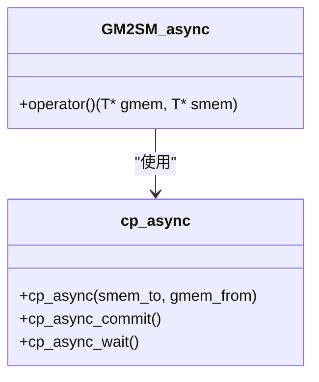
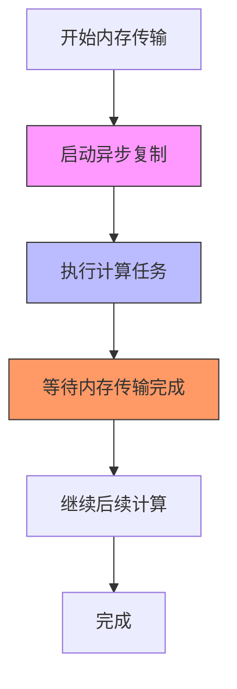
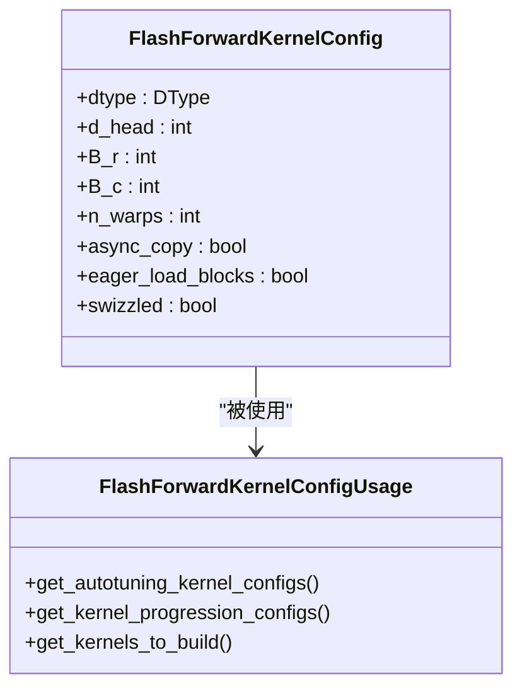
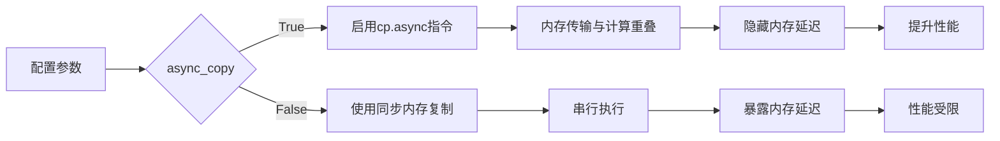

# 异步复制配置

<cite>
**本文档引用的文件**   
- [load_store.cuh](file://src/include/load_store.cuh)
- [kernel_configs.py](file://py/flash_helpers/kernel_configs.py)
- [ptx_functions.cuh](file://src/include/ptx_functions.cuh)
- [tensor.cuh](file://src/include/tensor.cuh)
- [forward_kernel.cuh](file://src/include/forward_kernel.cuh)
- [static_kernel_configuration.cuh](file://src/include/static_kernel_configuration.cuh)
</cite>

## 目录
1. [异步复制配置概述](#异步复制配置概述)
2. [异步复制实现机制](#异步复制实现机制)
3. [异步复制对性能的影响](#异步复制对性能的影响)
4. [代码示例分析](#代码示例分析)
5. [配置参数分析](#配置参数分析)

## 异步复制配置概述

异步复制配置是Flash Attention实现中的一项关键优化技术，通过启用基于cp.async指令的异步内存加载，实现了全局内存到共享内存的数据传输与计算的重叠。这种技术能够有效隐藏内存延迟，提升内存带宽利用率。本文档深入解析async_copy配置参数如何启用这一优化机制，并分析其对寄存器压力和指令调度的影响。

**Section sources**
- [load_store.cuh](file://src/include/load_store.cuh#L1-L356)
- [kernel_configs.py](file://py/flash_helpers/kernel_configs.py#L1-L486)

## 异步复制实现机制

异步复制的核心实现位于`src/include/load_store.cuh`文件中，通过GM2SM_async结构体和cp_async函数实现。当async_copy参数设置为True时，系统会使用cp.async指令进行异步内存传输，而不是传统的同步内存复制。

**Diagram sources **
- [load_store.cuh](file://src/include/load_store.cuh#L16-L21)
- [ptx_functions.cuh](file://src/include/ptx_functions.cuh#L31-L38)

**Section sources**
- [load_store.cuh](file://src/include/load_store.cuh#L1-L356)
- [ptx_functions.cuh](file://src/include/ptx_functions.cuh#L1-L48)

## 异步复制对性能的影响

启用异步复制对系统性能有多方面的影响。首先，它通过将内存传输与计算重叠，有效隐藏了内存延迟。其次，它提升了内存带宽利用率，特别是在数据访问模式较为规律的情况下。然而，这种优化也会增加寄存器压力和影响指令调度。

**Diagram sources **
- [forward_kernel.cuh](file://src/include/forward_kernel.cuh#L19-L83)
- [tensor.cuh](file://src/include/tensor.cuh#L58-L60)

**Section sources**
- [forward_kernel.cuh](file://src/include/forward_kernel.cuh#L1-L207)
- [tensor.cuh](file://src/include/tensor.cuh#L1-L141)

## 代码示例分析

在`py/flash_helpers/kernel_configs.py`文件中，可以找到async_copy参数的具体使用示例。该参数作为FlashForwardKernelConfig数据类的一个字段，控制着内核是否使用异步复制优化。

**Diagram sources **
- [kernel_configs.py](file://py/flash_helpers/kernel_configs.py#L106-L121)
- [kernel_configs.py](file://py/flash_helpers/kernel_configs.py#L389-L423)

**Section sources**
- [kernel_configs.py](file://py/flash_helpers/kernel_configs.py#L1-L486)

## 配置参数分析

async_copy参数的配置影响着整个系统的内存访问模式和性能特征。在`static_kernel_configuration.cuh`文件中，该参数被用于条件编译，决定是否启用异步复制相关的代码路径。

**Diagram sources **
- [static_kernel_configuration.cuh](file://src/include/static_kernel_configuration.cuh#L114-L120)
- [load_store.cuh](file://src/include/load_store.cuh#L16-L21)

**Section sources**
- [static_kernel_configuration.cuh](file://src/include/static_kernel_configuration.cuh#L1-L294)
- [load_store.cuh](file://src/include/load_store.cuh#L1-L356)