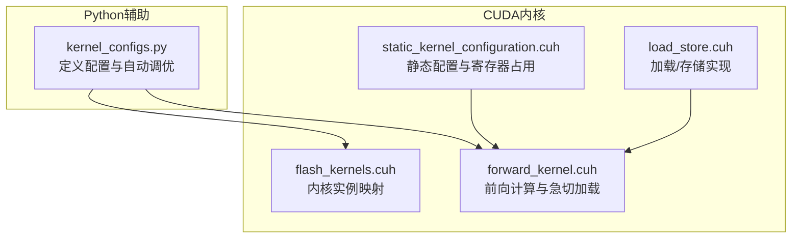
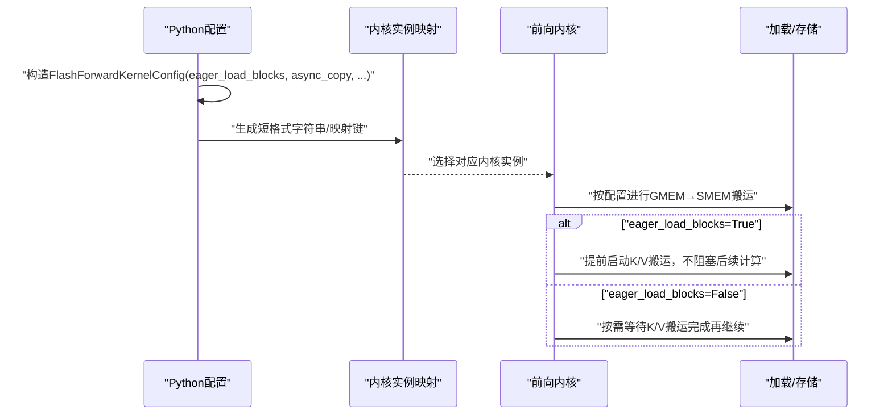
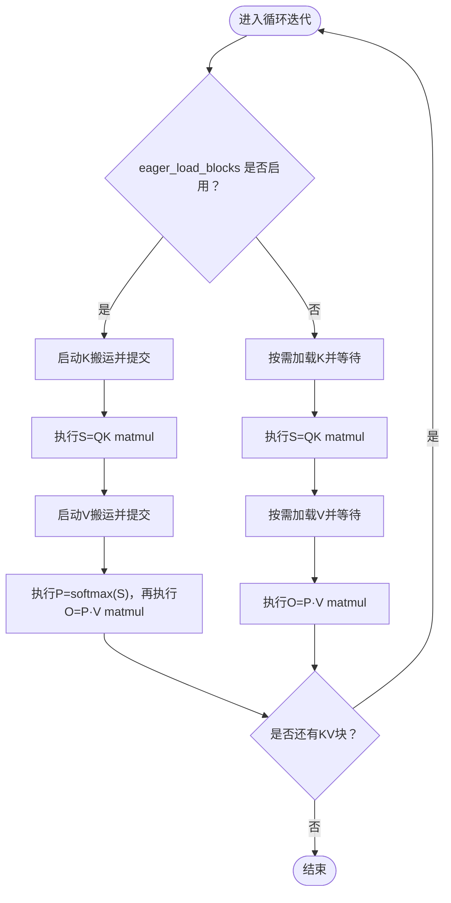
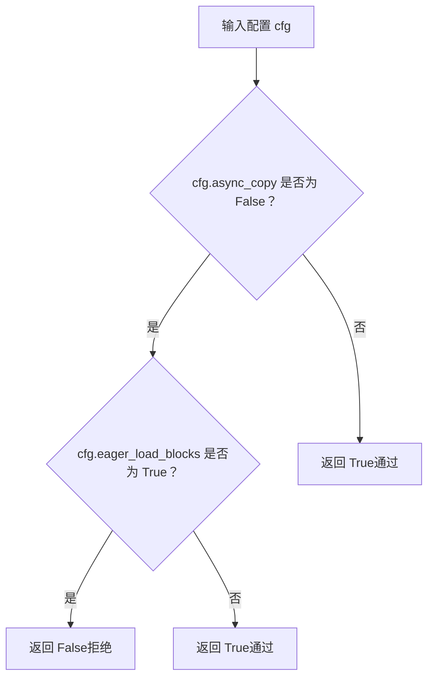
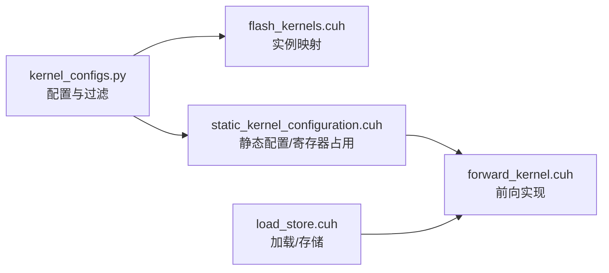

# 急切加载配置

<cite>
**本文引用的文件**
- [src/include/flash_kernels.cuh](file://src/include/flash_kernels.cuh)
- [py/flash_helpers/kernel_configs.py](file://py/flash_helpers/kernel_configs.py)
- [previous_kernels/src_1-7/include/forward_kernel.cuh](file://previous_kernels/src_1-7/include/forward_kernel.cuh)
- [previous_kernels/src_1-7/include/static_kernel_configuration.cuh](file://previous_kernels/src_1-7/include/static_kernel_configuration.cuh)
- [previous_kernels/src_1-7/include/load_store.cuh](file://previous_kernels/src_1-7/include/load_store.cuh)
</cite>

## 目录
1. [引言](#引言)
2. [项目结构](#项目结构)
3. [核心组件](#核心组件)
4. [架构总览](#架构总览)
5. [详细组件分析](#详细组件分析)
6. [依赖关系分析](#依赖关系分析)
7. [性能考量](#性能考量)
8. [故障排查指南](#故障排查指南)
9. [结论](#结论)

## 引言
本文件围绕“急切加载”（eager_load_blocks）配置参数展开，系统解释其如何控制K/V矩阵块的预加载策略，并结合内核实现与自动调优逻辑，说明：
- eager_load_blocks=True 如何在计算开始前将必要的K/V数据块加载到共享内存，提升数据局部性；
- 当 async_copy=False 时，eager_load_blocks 必须为 False 的约束条件；
- 在不同序列长度场景下，该配置对性能的影响与权衡。

## 项目结构
本仓库包含多版本的CUDA内核实现与Python辅助工具。与本主题直接相关的文件包括：
- CUDA内核头文件：定义前向计算流程、数据搬运与急切加载策略；
- Python内核配置与自动调优模块：定义配置项、生成内核实例映射、提供自动调优过滤规则；
- 加载存储与静态配置：描述张量搬运、寄存器/共享内存布局与寄存器占用估算。

图表来源
- [py/flash_helpers/kernel_configs.py](file://py/flash_helpers/kernel_configs.py#L106-L164)
- [src/include/flash_kernels.cuh](file://src/include/flash_kernels.cuh#L1-L60)
- [previous_kernels/src_1-7/include/forward_kernel.cuh](file://previous_kernels/src_1-7/include/forward_kernel.cuh#L70-L150)
- [previous_kernels/src_1-7/include/static_kernel_configuration.cuh](file://previous_kernels/src_1-7/include/static_kernel_configuration.cuh#L90-L170)
- [previous_kernels/src_1-7/include/load_store.cuh](file://previous_kernels/src_1-7/include/load_store.cuh#L100-L170)

章节来源
- [py/flash_helpers/kernel_configs.py](file://py/flash_helpers/kernel_configs.py#L106-L164)
- [src/include/flash_kernels.cuh](file://src/include/flash_kernels.cuh#L1-L60)
- [previous_kernels/src_1-7/include/forward_kernel.cuh](file://previous_kernels/src_1-7/include/forward_kernel.cuh#L70-L150)
- [previous_kernels/src_1-7/include/static_kernel_configuration.cuh](file://previous_kernels/src_1-7/include/static_kernel_configuration.cuh#L90-L170)
- [previous_kernels/src_1-7/include/load_store.cuh](file://previous_kernels/src_1-7/include/load_store.cuh#L100-L170)

## 核心组件
- 配置数据结构：FlashForwardKernelConfig 包含 eager_load_blocks 等关键字段，用于描述内核配置与短格式字符串表示。
- 内核实例映射：flash_kernels.cuh 将配置对象映射到具体内核实例，便于编译期选择。
- 前向内核实现：forward_kernel.cuh 中通过 if constexpr 分支实现急切加载与非急切加载两种路径。
- 静态配置与寄存器占用：static_kernel_configuration.cuh 提供寄存器占用估算与加载阶段数等静态推导。
- 加载/存储实现：load_store.cuh 定义了GMEM↔SMEM搬运的模板与步进策略。

章节来源
- [py/flash_helpers/kernel_configs.py](file://py/flash_helpers/kernel_configs.py#L106-L164)
- [src/include/flash_kernels.cuh](file://src/include/flash_kernels.cuh#L1-L60)
- [previous_kernels/src_1-7/include/forward_kernel.cuh](file://previous_kernels/src_1-7/include/forward_kernel.cuh#L70-L150)
- [previous_kernels/src_1-7/include/static_kernel_configuration.cuh](file://previous_kernels/src_1-7/include/static_kernel_configuration.cuh#L90-L170)
- [previous_kernels/src_1-7/include/load_store.cuh](file://previous_kernels/src_1-7/include/load_store.cuh#L100-L170)

## 架构总览
下图展示从配置到内核实例映射、再到前向计算执行的关键路径，以及急切加载策略在其中的位置。

图表来源
- [py/flash_helpers/kernel_configs.py](file://py/flash_helpers/kernel_configs.py#L106-L164)
- [src/include/flash_kernels.cuh](file://src/include/flash_kernels.cuh#L1-L60)
- [previous_kernels/src_1-7/include/forward_kernel.cuh](file://previous_kernels/src_1-7/include/forward_kernel.cuh#L70-L150)
- [previous_kernels/src_1-7/include/load_store.cuh](file://previous_kernels/src_1-7/include/load_store.cuh#L100-L170)

## 详细组件分析

### 急切加载策略与数据局部性
- eager_load_blocks=True 的含义
  - 在计算开始前，内核会提前启动K/V块的异步搬运（GMEM→SMEM），并在后续计算阶段尽早推进下一阶段的K/V搬运，减少流水线空闲，提升数据局部性。
- 关键实现位置
  - 前向内核中通过 if constexpr 切换急切加载路径，先启动Q/K搬运，随后在循环中根据是否急切加载决定何时启动K/V搬运与同步点。
  - 急切加载路径会在S=QK matmul之前启动V搬运，并在PV matmul前确保K/V已就绪，避免后续阶段的等待。
- 数据局部性提升
  - 通过提前将K/V块搬入共享内存，后续多次S/QK与P/PV计算可直接从SMEM读取，减少全局内存访问次数与带宽压力。

图表来源
- [previous_kernels/src_1-7/include/forward_kernel.cuh](file://previous_kernels/src_1-7/include/forward_kernel.cuh#L110-L150)

章节来源
- [previous_kernels/src_1-7/include/forward_kernel.cuh](file://previous_kernels/src_1-7/include/forward_kernel.cuh#L70-L150)

### eager_load_blocks 与 async_copy 的约束
- 约束条件
  - 当 async_copy=False 时，eager_load_blocks 必须为 False；否则 should_autotune_config 返回 False，不会被纳入自动调优候选集。
- 设计原因
  - 急切加载依赖异步拷贝机制（cp_async_commit/wait）来隐藏延迟并重叠计算与访存。若禁用异步拷贝，则无法实现真正的“急切”，强行启用可能导致同步等待或寄存器占用超限。
- 自动调优过滤
  - should_autotune_config 对 async_copy=False 且 eager_load_blocks=True 的组合直接拒绝，保证生成的内核配置在硬件能力范围内可运行。

图表来源
- [py/flash_helpers/kernel_configs.py](file://py/flash_helpers/kernel_configs.py#L364-L386)

章节来源
- [py/flash_helpers/kernel_configs.py](file://py/flash_helpers/kernel_configs.py#L364-L386)

### 内核实例映射与配置键
- 映射文件
  - flash_kernels.cuh 维护 FlashForwardKernelConfig 到具体内核函数指针的映射，键值包含 dtype、B_r/B_c、n_warps、async_copy、eager_load_blocks、swizzled、Q/K/V加载瓦片数、双缓冲与优化softmax等。
- 作用
  - 通过编译期配置生成大量内核实例，便于在不同硬件与数据规模上选择最优配置；同时支持短格式字符串便于调试与日志输出。

章节来源
- [src/include/flash_kernels.cuh](file://src/include/flash_kernels.cuh#L1-L60)
- [py/flash_helpers/kernel_configs.py](file://py/flash_helpers/kernel_configs.py#L106-L164)

### 寄存器占用与加载阶段数
- 静态配置
  - static_kernel_configuration.cuh 基于 d_head、B_r/B_c、n_warps、mma双缓冲与各阶段加载片段数，推导出每个阶段的寄存器占用与加载阶段数，作为配置有效性的一部分。
- 与急切加载的关系
  - 急切加载会提前启动K/V搬运，可能增加寄存器占用与共享内存占用；静态配置会校验这些参数是否满足硬件限制，避免超限导致编译失败或运行时异常。

章节来源
- [previous_kernels/src_1-7/include/static_kernel_configuration.cuh](file://previous_kernels/src_1-7/include/static_kernel_configuration.cuh#L90-L170)

### 加载/存储实现与瓦片布局
- 加载/存储模板
  - load_store.cuh 提供 GMEM↔SMEM 的批量搬运模板，支持按瓦片步进、转置加载、寄存器写回等操作，配合静态配置确定每步搬运的瓦片大小与步长。
- 与急切加载的协作
  - 急切加载路径在S/QK matmul前启动V搬运，在PV matmul前确保K/V就绪；这些搬运步骤由加载/存储模板完成，保证对齐与吞吐。

章节来源
- [previous_kernels/src_1-7/include/load_store.cuh](file://previous_kernels/src_1-7/include/load_store.cuh#L100-L170)

## 依赖关系分析
- 配置到内核实例映射
  - Python层的 FlashForwardKernelConfig 与短格式字符串，驱动 flash_kernels.cuh 的映射表，最终选择具体内核实例。
- 内核实现对配置的依赖
  - forward_kernel.cuh 通过 if constexpr 使用 eager_load_blocks、async_copy 等布尔标志，决定搬运与同步策略。
- 静态配置与寄存器占用
  - static_kernel_configuration.cuh 对 d_head、B_r/B_c、n_warps、mma双缓冲与加载片段数进行静态断言，确保配置合法。
- 自动调优过滤
  - should_autotune_config 在生成候选配置时强制执行 async_copy 与 eager_load_blocks 的互斥约束。

图表来源
- [py/flash_helpers/kernel_configs.py](file://py/flash_helpers/kernel_configs.py#L364-L386)
- [src/include/flash_kernels.cuh](file://src/include/flash_kernels.cuh#L1-L60)
- [previous_kernels/src_1-7/include/static_kernel_configuration.cuh](file://previous_kernels/src_1-7/include/static_kernel_configuration.cuh#L90-L170)
- [previous_kernels/src_1-7/include/forward_kernel.cuh](file://previous_kernels/src_1-7/include/forward_kernel.cuh#L70-L150)
- [previous_kernels/src_1-7/include/load_store.cuh](file://previous_kernels/src_1-7/include/load_store.cuh#L100-L170)

章节来源
- [py/flash_helpers/kernel_configs.py](file://py/flash_helpers/kernel_configs.py#L364-L386)
- [src/include/flash_kernels.cuh](file://src/include/flash_kernels.cuh#L1-L60)
- [previous_kernels/src_1-7/include/static_kernel_configuration.cuh](file://previous_kernels/src_1-7/include/static_kernel_configuration.cuh#L90-L170)
- [previous_kernels/src_1-7/include/forward_kernel.cuh](file://previous_kernels/src_1-7/include/forward_kernel.cuh#L70-L150)
- [previous_kernels/src_1-7/include/load_store.cuh](file://previous_kernels/src_1-7/include/load_store.cuh#L100-L170)

## 性能考量
- eager_load_blocks=True 的优势
  - 减少流水线空闲，提高访存与计算重叠度，尤其在大序列长度场景下显著降低全局内存带宽瓶颈。
  - 通过提前将K/V搬入共享内存，提升数据局部性，减少重复访存。
- eager_load_blocks=False 的适用场景
  - 在资源受限或寄存器/共享内存紧张时，避免急切加载带来的额外占用。
  - 当 async_copy=False 时，必须禁用急切加载，以避免同步等待与潜在的寄存器超限。
- 不同序列长度的建议
  - 短序列：急切加载收益有限，且可能因搬运开销而得不偿失。
  - 中长序列：急切加载通常带来明显加速，但需关注寄存器占用与共享内存容量。
  - 超长序列：优先启用急切加载并配合合适的B_r/B_c与n_warps，以最大化访存重叠。

[本节为通用性能讨论，无需列出具体文件来源]

## 故障排查指南
- 现象：自动调优未包含 eager_load_blocks=True 的配置
  - 可能原因：async_copy=False 且 eager_load_blocks=True 被 should_autotune_config 显式拒绝。
  - 处理：将 async_copy 设置为 True，或在手动配置时确保二者一致。
- 现象：内核编译失败或寄存器溢出
  - 可能原因：急切加载导致寄存器/共享内存占用过高。
  - 处理：降低 d_head 或调整 B_r/B_c/n_warps，或关闭急切加载。
- 现象：性能反而下降
  - 可能原因：序列较短或数据局部性不足，急切加载引入额外搬运开销。
  - 处理：评估是否需要急切加载，必要时切换到非急切路径。

章节来源
- [py/flash_helpers/kernel_configs.py](file://py/flash_helpers/kernel_configs.py#L364-L386)
- [previous_kernels/src_1-7/include/static_kernel_configuration.cuh](file://previous_kernels/src_1-7/include/static_kernel_configuration.cuh#L90-L170)

## 结论
- eager_load_blocks 控制K/V块的急切预加载，通过提前启动异步搬运与重叠计算，显著提升数据局部性与吞吐；
- 当 async_copy=False 时，eager_load_blocks 必须为 False，这是由自动调优过滤规则与内核实现的异步拷贝依赖共同决定；
- 在不同序列长度场景下，应综合考虑带宽、寄存器/共享内存占用与计算重叠度，选择合适的配置组合以获得最佳性能。