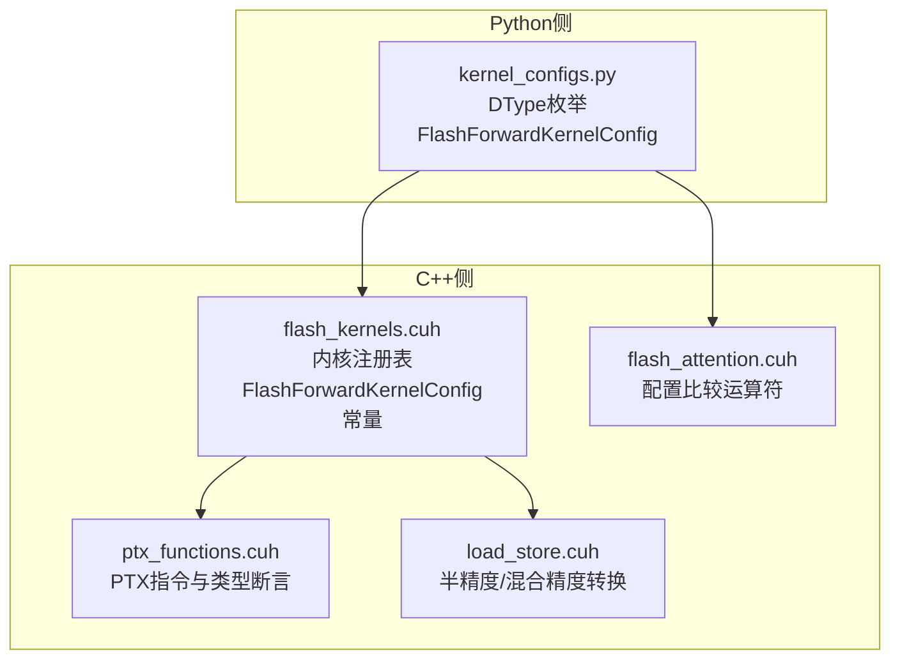
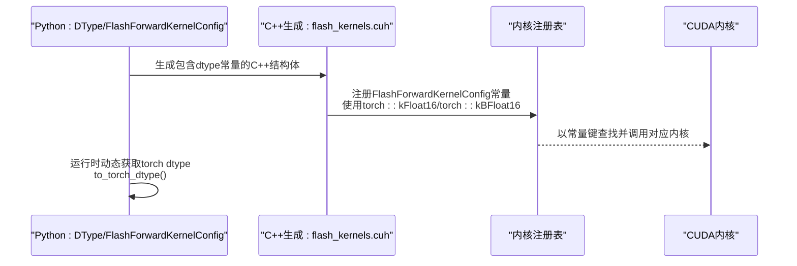
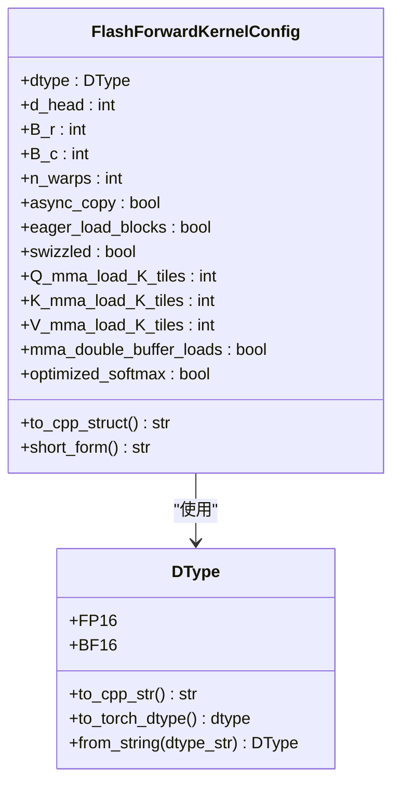
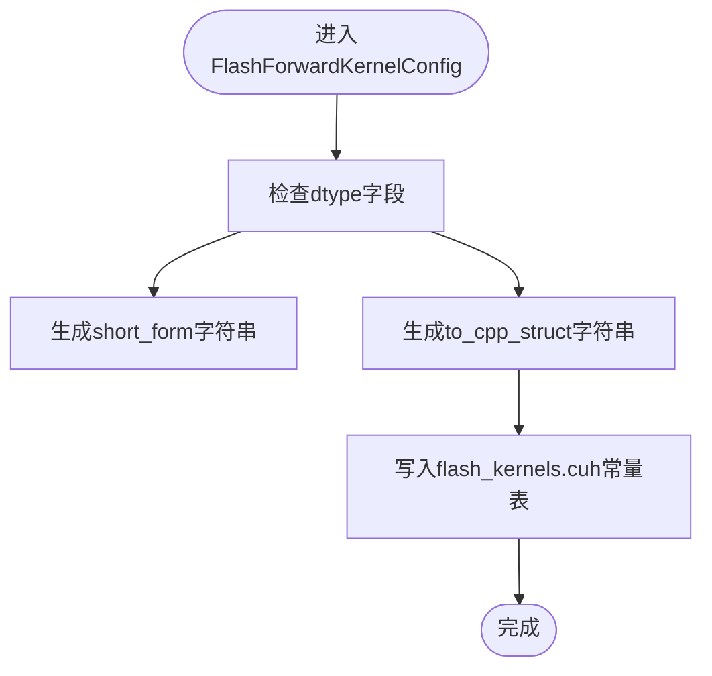
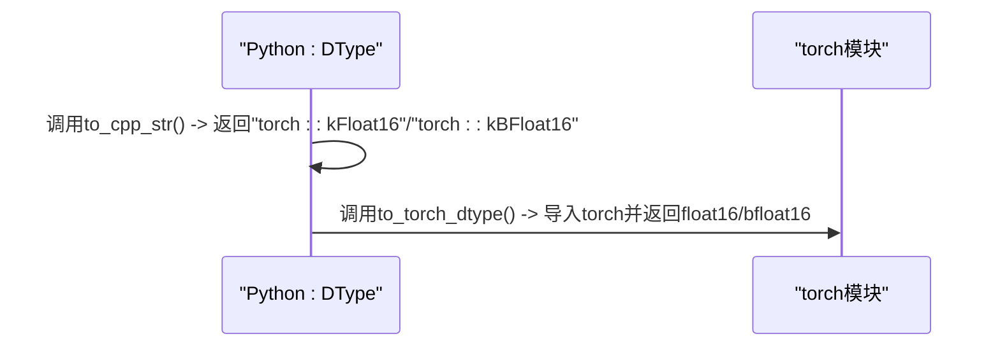
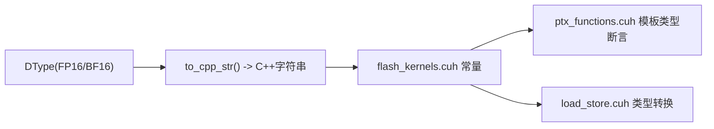
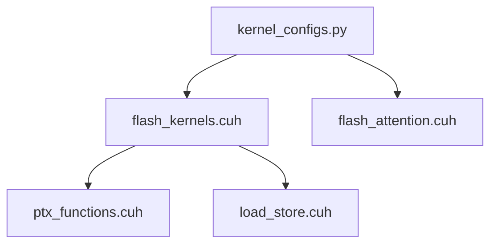

# 数据类型配置

<cite>
**本文引用的文件**
- [kernel_configs.py](file://py/flash_helpers/kernel_configs.py)
- [flash_kernels.cuh](file://src/include/flash_kernels.cuh)
- [flash_attention.cuh](file://src/include/flash_attention.cuh)
- [ptx_functions.cuh](file://src/include/ptx_functions.cuh)
- [load_store.cuh](file://src/include/load_store.cuh)
- [README.md](file://README.md)
</cite>

## 目录
1. [引言](#引言)
2. [项目结构](#项目结构)
3. [核心组件](#核心组件)
4. [架构总览](#架构总览)
5. [详细组件分析](#详细组件分析)
6. [依赖关系分析](#依赖关系分析)
7. [性能考量](#性能考量)
8. [故障排查指南](#故障排查指南)
9. [结论](#结论)
10. [附录](#附录)

## 引言
本节聚焦于FlashForwardKernelConfig中的dtype字段设计与实现，系统阐述DType枚举类如何支持FP16与BF16两种数据类型，并通过以下要点展开：
- Python侧DType枚举如何定义FP16/BF16及其字符串映射；
- dtype.to_cpp_str()如何将Python端数据类型映射为C++侧的torch::kFloat16与torch::kBFloat16；
- dtype.to_torch_dtype()如何在运行时动态导入并返回对应的PyTorch数据类型；
- 不同数据类型对内存占用、计算精度与GPU张量核心（Tensor Core）利用率的影响，尤其在Ampere架构下的性能差异；
- 实际使用场景中选择合适数据类型的指导原则。

## 项目结构
围绕数据类型配置的关键文件分布如下：
- Python侧：DType枚举与FlashForwardKernelConfig位于py/flash_helpers/kernel_configs.py
- C++侧：内核注册表与配置常量位于src/include/flash_kernels.cuh；CUDA PTX指令与类型转换位于src/include/ptx_functions.cuh与src/include/load_store.cuh；配置比较逻辑位于src/include/flash_attention.cuh

图表来源
- [kernel_configs.py](file://py/flash_helpers/kernel_configs.py#L1-L170)
- [flash_kernels.cuh](file://src/include/flash_kernels.cuh#L1-L187)
- [flash_attention.cuh](file://src/include/flash_attention.cuh#L67-L109)
- [ptx_functions.cuh](file://src/include/ptx_functions.cuh#L47-L56)
- [load_store.cuh](file://src/include/load_store.cuh#L324-L355)

章节来源
- [kernel_configs.py](file://py/flash_helpers/kernel_configs.py#L1-L170)
- [flash_kernels.cuh](file://src/include/flash_kernels.cuh#L1-L187)

## 核心组件
- DType枚举：定义FP16与BF16两个成员，并提供to_cpp_str()与to_torch_dtype()方法，用于在Python侧生成C++字符串与运行时返回PyTorch数据类型。
- FlashForwardKernelConfig：包含dtype在内的内核配置项，支持字符串化、短格式输出、C++结构体生成等。
- 内核注册表：在C++侧以FlashForwardKernelConfig常量形式直接使用torch::kFloat16与torch::kBFloat16作为dtype值，确保编译期类型一致性。

章节来源
- [kernel_configs.py](file://py/flash_helpers/kernel_configs.py#L1-L170)
- [flash_kernels.cuh](file://src/include/flash_kernels.cuh#L1-L187)

## 架构总览
下图展示了从Python配置到C++内核注册的整体流程，强调dtype字段在两端的映射关系与一致性。

图表来源
- [kernel_configs.py](file://py/flash_helpers/kernel_configs.py#L1-L170)
- [flash_kernels.cuh](file://src/include/flash_kernels.cuh#L1-L187)

## 详细组件分析

### DType枚举与数据类型映射
- 成员定义：FP16与BF16分别映射到PyTorch ScalarType的整数值，便于跨语言传递与解析。
- 字符串映射：from_string()支持名称大小写不敏感解析，同时兼容整数字符串。
- C++字符串映射：to_cpp_str()返回torch::kFloat16或torch::kBFloat16，供C++侧生成常量结构体。
- 运行时PyTorch类型：to_torch_dtype()在运行时导入torch并返回torch.float16或torch.bfloat16，便于与张量类型保持一致。

图表来源
- [kernel_configs.py](file://py/flash_helpers/kernel_configs.py#L1-L170)

章节来源
- [kernel_configs.py](file://py/flash_helpers/kernel_configs.py#L1-L170)

### FlashForwardKernelConfig中的dtype字段
- 结构体字段：dtype为DType类型，参与短格式输出与C++结构体生成。
- 比较运算符：在flash_attention.cuh中，dtype参与整体排序比较，确保配置对象可排序与稳定比较。
- C++常量生成：FlashForwardKernelConfig在flash_kernels.cuh中以常量形式出现，dtype直接使用torch::kFloat16/torch::kBFloat16，保证编译期类型一致。

图表来源
- [flash_attention.cuh](file://src/include/flash_attention.cuh#L67-L109)
- [flash_kernels.cuh](file://src/include/flash_kernels.cuh#L1-L187)

章节来源
- [flash_attention.cuh](file://src/include/flash_attention.cuh#L67-L109)
- [flash_kernels.cuh](file://src/include/flash_kernels.cuh#L1-L187)

### dtype.to_cpp_str()与dtype.to_torch_dtype()方法
- to_cpp_str()：将DType映射为C++侧字符串字面量，用于在C++常量结构体中直接使用torch::kFloat16/torch::kBFloat16。
- to_torch_dtype()：在运行时导入torch并返回torch.float16/torch.bfloat16，便于与张量类型保持一致，适用于动态类型判断与张量创建。

图表来源
- [kernel_configs.py](file://py/flash_helpers/kernel_configs.py#L1-L170)

章节来源
- [kernel_configs.py](file://py/flash_helpers/kernel_configs.py#L1-L170)

### C++侧类型使用与PTX指令
- 内核注册表：flash_kernels.cuh中以FlashForwardKernelConfig常量形式直接使用torch::kFloat16与torch::kBFloat16，确保编译期类型一致性。
- PTX指令：ptx_functions.cuh中通过模板参数value_t约束half与nv_bfloat16，配合PTX mma指令实现不同精度下的矩阵乘累加。
- 加载存储转换：load_store.cuh中提供从float到half/nv_bfloat16的转换逻辑，体现半精度/混合精度路径。

图表来源
- [flash_kernels.cuh](file://src/include/flash_kernels.cuh#L1-L187)
- [ptx_functions.cuh](file://src/include/ptx_functions.cuh#L47-L56)
- [load_store.cuh](file://src/include/load_store.cuh#L324-L355)

章节来源
- [flash_kernels.cuh](file://src/include/flash_kernels.cuh#L1-L187)
- [ptx_functions.cuh](file://src/include/ptx_functions.cuh#L47-L56)
- [load_store.cuh](file://src/include/load_store.cuh#L324-L355)

## 依赖关系分析
- Python侧DType与FlashForwardKernelConfig相互依赖：前者提供dtype映射，后者使用dtype进行字符串化与C++结构体生成。
- C++侧flash_kernels.cuh依赖Python侧生成的dtype常量，确保内核注册表与配置一致。
- PTX与加载存储层依赖具体类型（half/bfloat16），在Ampere架构下通过Tensor Core指令实现高效计算。

图表来源
- [kernel_configs.py](file://py/flash_helpers/kernel_configs.py#L1-L170)
- [flash_kernels.cuh](file://src/include/flash_kernels.cuh#L1-L187)
- [flash_attention.cuh](file://src/include/flash_attention.cuh#L67-L109)
- [ptx_functions.cuh](file://src/include/ptx_functions.cuh#L47-L56)
- [load_store.cuh](file://src/include/load_store.cuh#L324-L355)

章节来源
- [kernel_configs.py](file://py/flash_helpers/kernel_configs.py#L1-L170)
- [flash_kernels.cuh](file://src/include/flash_kernels.cuh#L1-L187)
- [flash_attention.cuh](file://src/include/flash_attention.cuh#L67-L109)

## 性能考量
- 内存占用：FP16与BF16均为16位宽度，相较FP32节省一倍带宽，有助于提升吞吐与减少显存占用。
- 计算精度：FP16具有更宽的动态范围，BF16则牺牲部分尾数精度换取更高的数值密度，适合大规模训练与推理。
- Tensor Core利用率：在Ampere架构下，PTX mma指令对half与nv_bfloat16均有优化路径，二者均可充分利用Tensor Core，但BF16在某些场景下可能因指数位一致而带来更好的稳定性。
- 实测表现：README显示最终内核在A100与RTX 3090上接近官方实现的高性能，且明确支持16位输入/输出（bf16/fp16）。

章节来源
- [README.md](file://README.md#L1-L63)
- [ptx_functions.cuh](file://src/include/ptx_functions.cuh#L47-L56)

## 故障排查指南
- 解析错误：from_string()对非法字符串会抛出异常，建议检查输入是否为FP16/BF16或对应整数值。
- 映射错误：to_cpp_str()仅支持FP16与BF16，若扩展新类型需同步更新映射。
- 运行时导入：to_torch_dtype()依赖torch模块，若未安装torch将导致导入失败，需确保环境已正确安装PyTorch。
- 配置比较：若dtype参与排序或集合比较，请确认其枚举值与PyTorch ScalarType一致，避免意外排序结果。

章节来源
- [kernel_configs.py](file://py/flash_helpers/kernel_configs.py#L1-L170)

## 结论
- DType枚举在Python侧提供了FP16与BF16的统一抽象，并通过to_cpp_str()与to_torch_dtype()分别满足C++侧常量生成与运行时类型获取。
- FlashForwardKernelConfig的dtype字段贯穿Python配置与C++内核注册表，确保两端类型一致性。
- 在Ampere架构下，FP16与BF16均可高效利用Tensor Core，结合带宽优势，通常能获得更高吞吐；BF16在数值稳定性方面具有一定优势，适合大规模训练与推理。

## 附录
- 使用建议
  - 训练阶段：优先考虑BF16以平衡精度与稳定性；若遇到数值溢出或不稳定，可尝试FP16。
  - 推理阶段：BF16通常更稳健；若显存紧张且对精度要求不高，可考虑FP16。
  - 环境要求：确保PyTorch已安装，以便to_torch_dtype()正常工作；确保CUDA设备为Ampere架构以获得最佳Tensor Core性能。