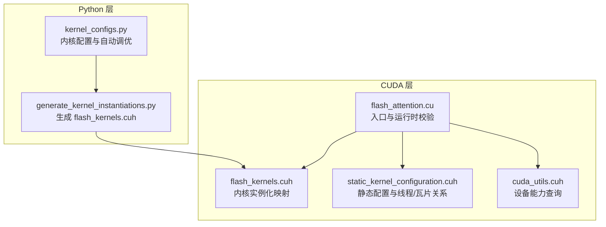
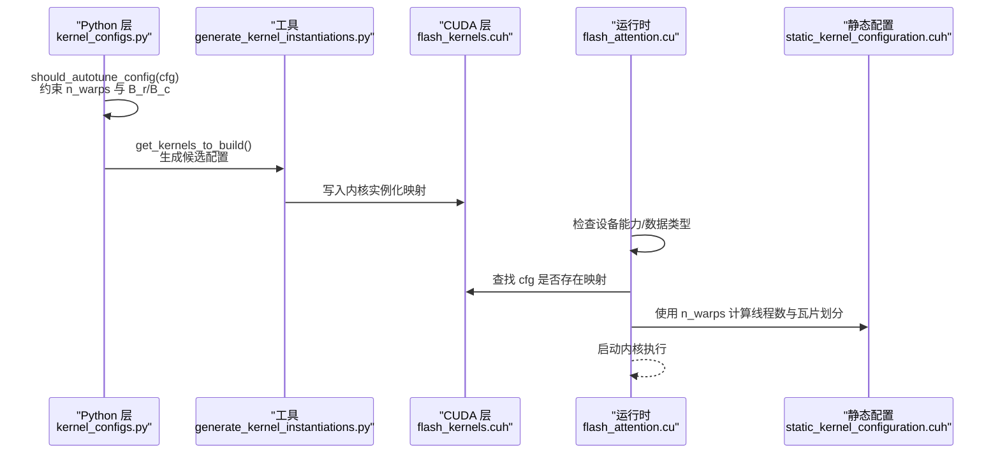
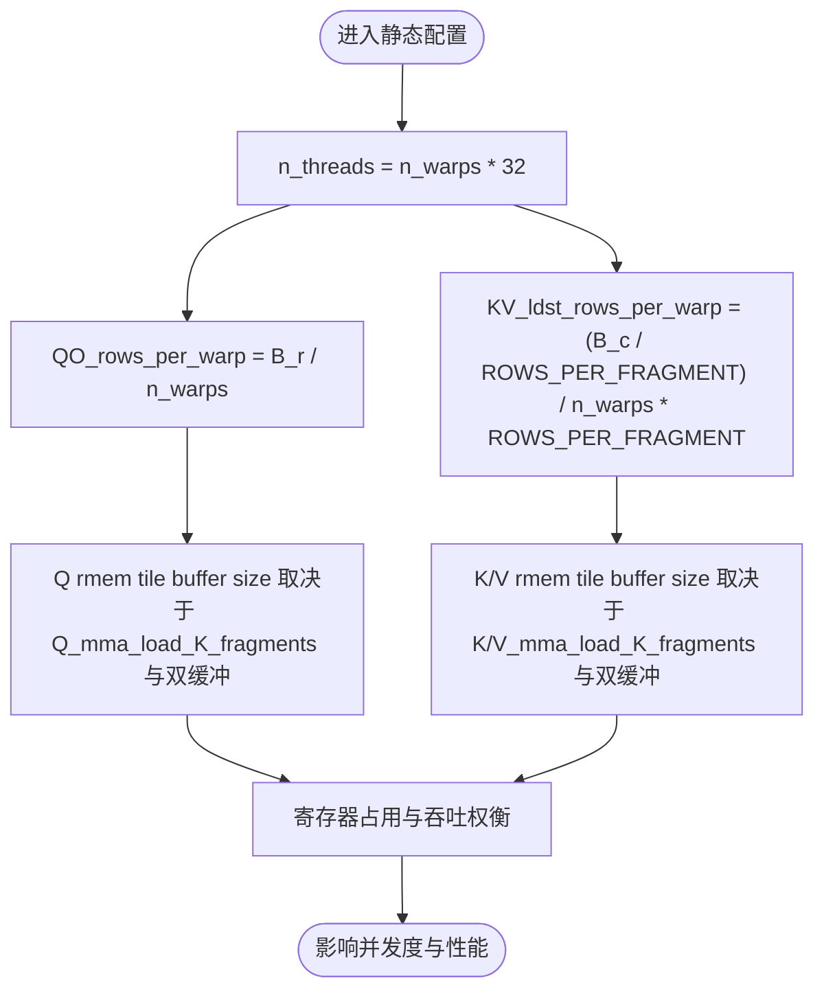
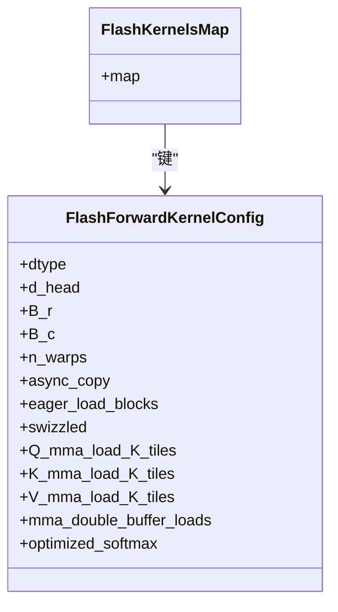
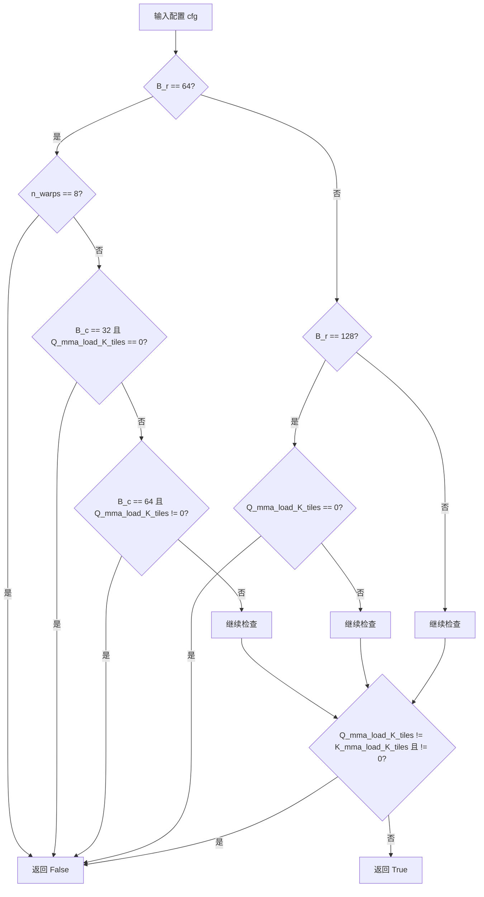
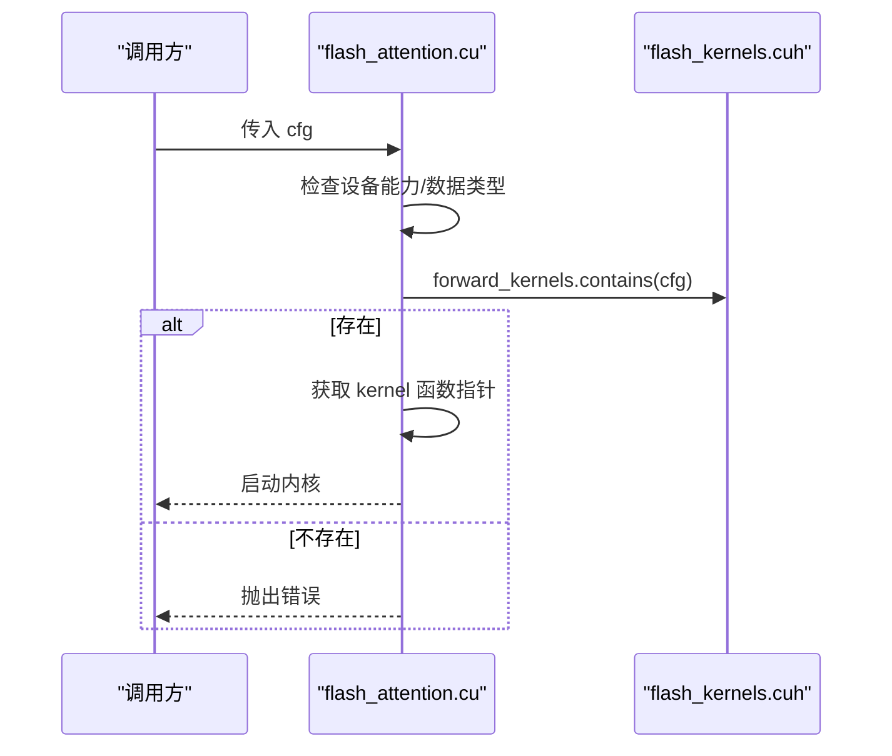
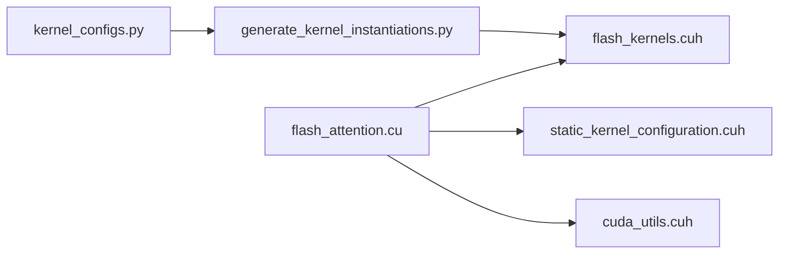

# 线程束数量配置

<cite>
**本文引用的文件**
- [src/include/flash_kernels.cuh](file://src/include/flash_kernels.cuh)
- [py/flash_helpers/kernel_configs.py](file://py/flash_helpers/kernel_configs.py)
- [src/include/static_kernel_configuration.cuh](file://src/include/static_kernel_configuration.cuh)
- [tools/build/generate_kernel_instantiations.py](file://tools/build/generate_kernel_instantiations.py)
- [src/flash_attention.cu](file://src/flash_attention.cu)
- [src/include/cuda_utils.cuh](file://src/include/cuda_utils.cuh)
</cite>

## 目录
1. [引言](#引言)
2. [项目结构](#项目结构)
3. [核心组件](#核心组件)
4. [架构总览](#架构总览)
5. [详细组件分析](#详细组件分析)
6. [依赖关系分析](#依赖关系分析)
7. [性能考量](#性能考量)
8. [故障排查指南](#故障排查指南)
9. [结论](#结论)
10. [附录](#附录)

## 引言
本文件围绕 n_warps 配置参数如何控制 Flash Attention 内核的 CUDA 线程束数量展开，结合源码分析其对 SM 寄存器与共享内存占用、并发度的影响，并基于 Python 层的自动调优逻辑说明 n_warps 与 B_r/B_c 的兼容性约束（例如 B_r=64 时 n_warps 不应为 8），最后给出在不同 GPU 架构下的优化策略建议。

## 项目结构
该仓库采用“CUDA 前端 + Python 辅助工具”的组织方式：
- CUDA 核心实现位于 src/include 与 src/flash_attention.cu，负责内核实例化映射、静态配置与运行时调度。
- Python 工具位于 py/flash_helpers，负责内核配置生成、自动调优与内核名解析。
- tools/build 下的脚本用于自动生成 flash_kernels.cuh 中的内核实例化条目。

图表来源
- [py/flash_helpers/kernel_configs.py](file://py/flash_helpers/kernel_configs.py#L364-L387)
- [tools/build/generate_kernel_instantiations.py](file://tools/build/generate_kernel_instantiations.py#L1-L57)
- [src/include/flash_kernels.cuh](file://src/include/flash_kernels.cuh#L1-L187)
- [src/include/static_kernel_configuration.cuh](file://src/include/static_kernel_configuration.cuh#L37-L102)
- [src/flash_attention.cu](file://src/flash_attention.cu#L42-L75)
- [src/include/cuda_utils.cuh](file://src/include/cuda_utils.cuh#L29-L48)

章节来源
- [py/flash_helpers/kernel_configs.py](file://py/flash_helpers/kernel_configs.py#L364-L387)
- [tools/build/generate_kernel_instantiations.py](file://tools/build/generate_kernel_instantiations.py#L1-L57)
- [src/include/flash_kernels.cuh](file://src/include/flash_kernels.cuh#L1-L187)
- [src/include/static_kernel_configuration.cuh](file://src/include/static_kernel_configuration.cuh#L37-L102)
- [src/flash_attention.cu](file://src/flash_attention.cu#L42-L75)
- [src/include/cuda_utils.cuh](file://src/include/cuda_utils.cuh#L29-L48)

## 核心组件
- 内核实例化映射：由 Python 自动生成并写入 flash_kernels.cuh，键为 FlashForwardKernelConfig，值为具体内核函数指针。
- 静态配置与线程关系：static_kernel_configuration.cuh 将 n_warps 映射到线程数、每瓦片计算量、每瓦片加载量等。
- 自动调优与兼容性：kernel_configs.py 的 should_autotune_config() 提供 n_warps 与 B_r/B_c 的约束规则。
- 运行时入口与校验：flash_attention.cu 负责检查设备能力、数据类型与内核映射存在性。

章节来源
- [src/include/flash_kernels.cuh](file://src/include/flash_kernels.cuh#L1-L187)
- [src/include/static_kernel_configuration.cuh](file://src/include/static_kernel_configuration.cuh#L37-L102)
- [py/flash_helpers/kernel_configs.py](file://py/flash_helpers/kernel_configs.py#L364-L387)
- [src/flash_attention.cu](file://src/flash_attention.cu#L42-L75)

## 架构总览
n_warps 通过以下路径影响内核行为：
- Python 层：kernel_configs.py 定义 n_warps 与 B_r/B_c 的兼容性约束；generate_kernel_instantiations.py 将有效配置写入 flash_kernels.cuh。
- CUDA 层：static_kernel_configuration.cuh 将 n_warps 转换为线程总数与每瓦片工作量；flash_attention.cu 在运行时校验配置是否存在于映射表中。

图表来源
- [py/flash_helpers/kernel_configs.py](file://py/flash_helpers/kernel_configs.py#L364-L387)
- [tools/build/generate_kernel_instantiations.py](file://tools/build/generate_kernel_instantiations.py#L1-L57)
- [src/include/flash_kernels.cuh](file://src/include/flash_kernels.cuh#L1-L187)
- [src/flash_attention.cu](file://src/flash_attention.cu#L42-L75)
- [src/include/static_kernel_configuration.cuh](file://src/include/static_kernel_configuration.cuh#L37-L102)

## 详细组件分析

### 组件A：n_warps 与线程/瓦片关系
- 线程总数：n_warps × 32（WARP_SIZE）。
- 每瓦片工作量：B_r/n_warps 行，对应每瓦片的 Q/O 计算块大小；KV 加载按 B_c/n_warps 分配给各瓦片。
- 瓦片缓冲与寄存器占用：Q/K/V 的 rmem 缓冲大小与 load_K_fragments、双缓冲开关相关，直接影响寄存器压力与吞吐。

图表来源
- [src/include/static_kernel_configuration.cuh](file://src/include/static_kernel_configuration.cuh#L37-L102)

章节来源
- [src/include/static_kernel_configuration.cuh](file://src/include/static_kernel_configuration.cuh#L37-L102)

### 组件B：内核实例化映射与生成
- Python 侧通过 get_kernels_to_build() 生成候选配置集合，经 generate_kernel_instantiations.py 写入 flash_kernels.cuh。
- flash_kernels.cuh 中的映射键包含 dtype、d_head、B_r、B_c、n_warps 等字段，运行时以该键查找对应内核。

图表来源
- [py/flash_helpers/kernel_configs.py](file://py/flash_helpers/kernel_configs.py#L106-L175)
- [src/include/flash_kernels.cuh](file://src/include/flash_kernels.cuh#L1-L187)
- [tools/build/generate_kernel_instantiations.py](file://tools/build/generate_kernel_instantiations.py#L1-L57)

章节来源
- [py/flash_helpers/kernel_configs.py](file://py/flash_helpers/kernel_configs.py#L106-L175)
- [src/include/flash_kernels.cuh](file://src/include/flash_kernels.cuh#L1-L187)
- [tools/build/generate_kernel_instantiations.py](file://tools/build/generate_kernel_instantiations.py#L1-L57)

### 组件C：n_warps 与 B_r/B_c 的兼容性约束
- 当 B_r=64 且 n_warps=8 时，should_autotune_config() 返回 False（不参与自动调优）。
- 其他约束包括：
  - Q/K_mma_load_K_tiles 必须相等或至少一方为 0；
  - B_r=64 时对 Q_mma_load_K_tiles 的取值有额外限制；
  - B_r=128 时要求 Q_mma_load_K_tiles 非零。

这些约束反映了寄存器/共享内存占用与瓦片布局之间的权衡。

图表来源
- [py/flash_helpers/kernel_configs.py](file://py/flash_helpers/kernel_configs.py#L364-L387)

章节来源
- [py/flash_helpers/kernel_configs.py](file://py/flash_helpers/kernel_configs.py#L364-L387)

### 组件D：运行时入口与映射校验
- flash_attention.cu 在运行时检查设备计算能力（要求 SM_80 或更高）、数据类型一致性，并验证传入的 FlashForwardKernelConfig 是否存在于 flash_kernels.cuh 的映射中。

图表来源
- [src/flash_attention.cu](file://src/flash_attention.cu#L42-L75)
- [src/include/flash_kernels.cuh](file://src/include/flash_kernels.cuh#L1-L187)

章节来源
- [src/flash_attention.cu](file://src/flash_attention.cu#L42-L75)
- [src/include/flash_kernels.cuh](file://src/include/flash_kernels.cuh#L1-L187)

## 依赖关系分析
- Python 层依赖：
  - kernel_configs.py：定义 FlashForwardKernelConfig 数据结构与 should_autotune_config() 约束。
  - generate_kernel_instantiations.py：读取 get_kernels_to_build() 生成的配置，写入 flash_kernels.cuh。
- CUDA 层依赖：
  - static_kernel_configuration.cuh：将 n_warps 转换为线程数与瓦片形状，决定寄存器/共享内存使用。
  - flash_kernels.cuh：运行时查找内核映射。
  - flash_attention.cu：运行时校验与启动。

图表来源
- [py/flash_helpers/kernel_configs.py](file://py/flash_helpers/kernel_configs.py#L364-L387)
- [tools/build/generate_kernel_instantiations.py](file://tools/build/generate_kernel_instantiations.py#L1-L57)
- [src/include/flash_kernels.cuh](file://src/include/flash_kernels.cuh#L1-L187)
- [src/include/static_kernel_configuration.cuh](file://src/include/static_kernel_configuration.cuh#L37-L102)
- [src/flash_attention.cu](file://src/flash_attention.cu#L42-L75)
- [src/include/cuda_utils.cuh](file://src/include/cuda_utils.cuh#L29-L48)

章节来源
- [py/flash_helpers/kernel_configs.py](file://py/flash_helpers/kernel_configs.py#L364-L387)
- [tools/build/generate_kernel_instantiations.py](file://tools/build/generate_kernel_instantiations.py#L1-L57)
- [src/include/flash_kernels.cuh](file://src/include/flash_kernels.cuh#L1-L187)
- [src/include/static_kernel_configuration.cuh](file://src/include/static_kernel_configuration.cuh#L37-L102)
- [src/flash_attention.cu](file://src/flash_attention.cu#L42-L75)
- [src/include/cuda_utils.cuh](file://src/include/cuda_utils.cuh#L29-L48)

## 性能考量
- 寄存器与共享内存占用
  - n_warps 增大意味着每瓦片的 rmem 缓冲与线程数增加，可能提升吞吐但同时增加寄存器压力与共享内存占用。
  - 双缓冲与 load_K_fragments 的选择会进一步影响寄存器与带宽利用。
- 并发度与吞吐
  - 更多线程可提升并发，但需避免寄存器溢出导致的寄存器分配失败或寄存器压力过大。
  - B_r/B_c 与 n_warps 的组合需满足 should_autotune_config() 的约束，否则可能导致寄存器/共享内存超限。
- GPU 架构差异
  - 设备计算能力要求 SM_80 或更高；不同架构的寄存器/共享内存上限不同，应结合 cuda_utils.cuh 查询设备属性进行策略调整。

章节来源
- [src/include/static_kernel_configuration.cuh](file://src/include/static_kernel_configuration.cuh#L37-L102)
- [src/include/cuda_utils.cuh](file://src/include/cuda_utils.cuh#L29-L48)
- [py/flash_helpers/kernel_configs.py](file://py/flash_helpers/kernel_configs.py#L364-L387)

## 故障排查指南
- “内核配置未找到”
  - 现象：运行时报错提示 cfg 不存在于 flash_kernels.cuh 映射中。
  - 排查：确认 Python 层是否已将该配置写入 flash_kernels.cuh；检查 generate_kernel_instantiations.py 是否正确生成。
- “寄存器不足/编译失败”
  - 现象：n_warps 设置不当导致寄存器压力过大。
  - 排查：遵循 should_autotune_config() 约束，优先尝试 n_warps=4；必要时降低 B_c 或关闭某些特性（如双缓冲、优化 softmax）。
- “设备能力不满足”
  - 现象：设备计算能力低于 SM_80。
  - 排查：使用 cuda_utils.cuh 查询设备属性，升级硬件或切换到支持的架构。

章节来源
- [src/flash_attention.cu](file://src/flash_attention.cu#L42-L75)
- [py/flash_helpers/kernel_configs.py](file://py/flash_helpers/kernel_configs.py#L364-L387)
- [src/include/cuda_utils.cuh](file://src/include/cuda_utils.cuh#L29-L48)

## 结论
n_warps 是连接 Python 自动调优与 CUDA 内核执行的关键桥梁。通过 static_kernel_configuration.cuh 将 n_warps 映射为线程数与瓦片划分，再由 flash_kernels.cuh 提供运行时查找，最终在 flash_attention.cu 中完成设备能力与配置校验。should_autotune_config() 则从寄存器/共享内存与瓦片布局角度给出 n_warps 与 B_r/B_c 的兼容性约束，确保内核稳定运行与良好性能。在实际部署中，应优先满足约束条件，再根据设备能力与任务规模微调 n_warps 以平衡吞吐与资源占用。

## 附录
- 关键实现位置参考
  - n_warps 与线程/瓦片关系：[src/include/static_kernel_configuration.cuh](file://src/include/static_kernel_configuration.cuh#L37-L102)
  - 内核实例化映射生成：[tools/build/generate_kernel_instantiations.py](file://tools/build/generate_kernel_instantiations.py#L1-L57)，[src/include/flash_kernels.cuh](file://src/include/flash_kernels.cuh#L1-L187)
  - 自动调优与兼容性约束：[py/flash_helpers/kernel_configs.py](file://py/flash_helpers/kernel_configs.py#L364-L387)
  - 运行时入口与校验：[src/flash_attention.cu](file://src/flash_attention.cu#L42-L75)，[src/include/cuda_utils.cuh](file://src/include/cuda_utils.cuh#L29-L48)