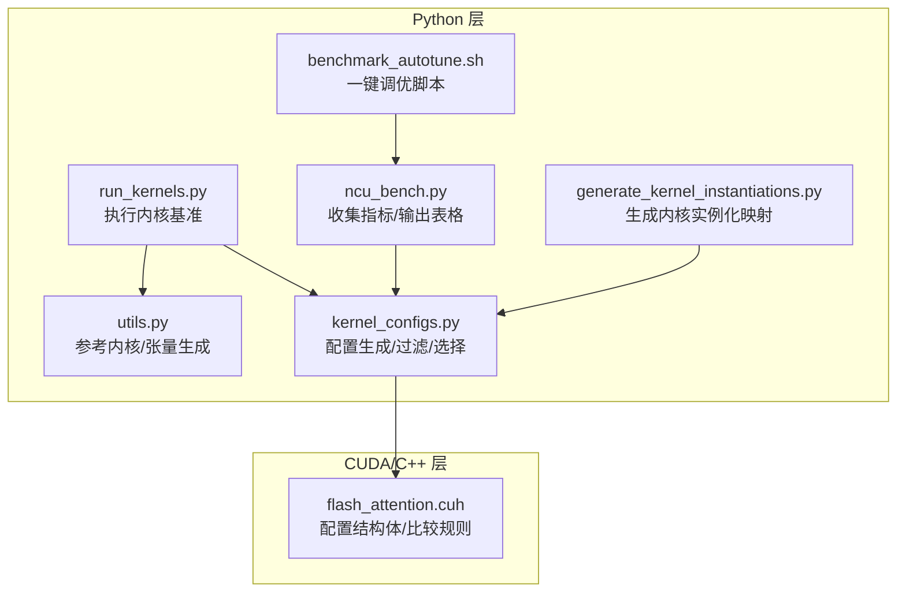
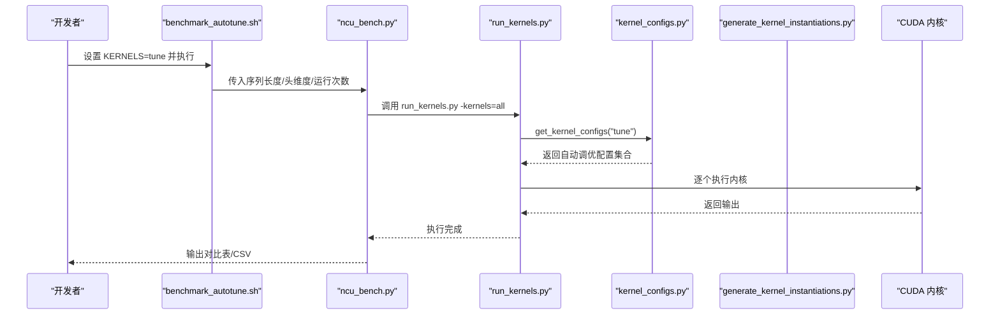
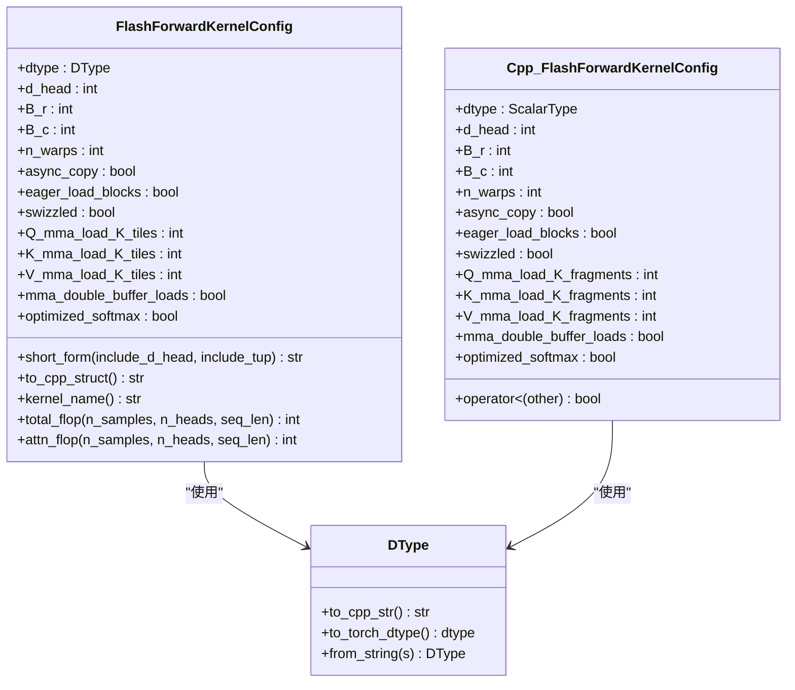
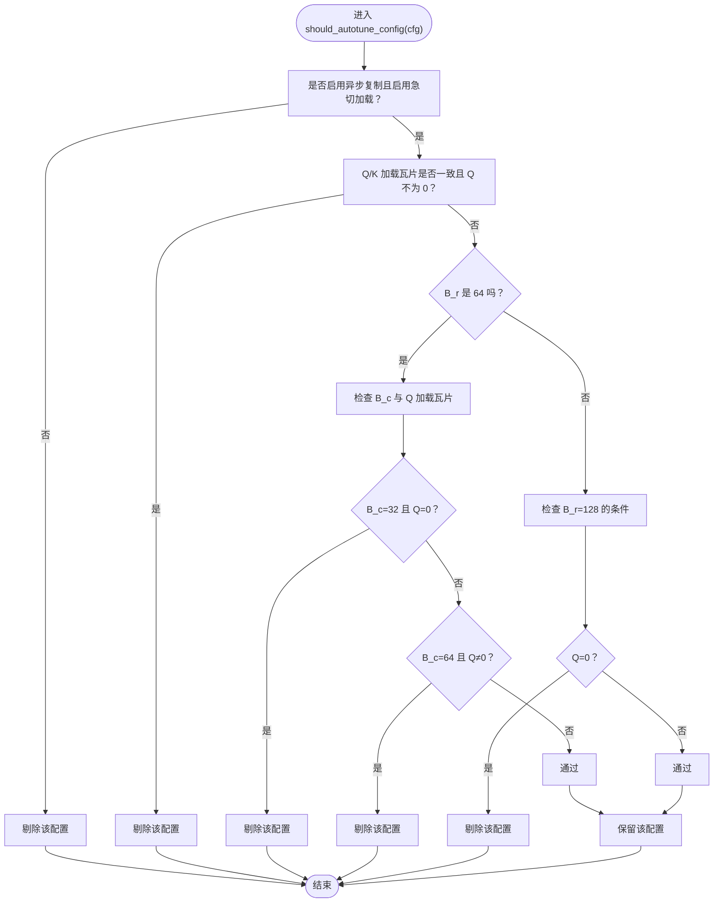
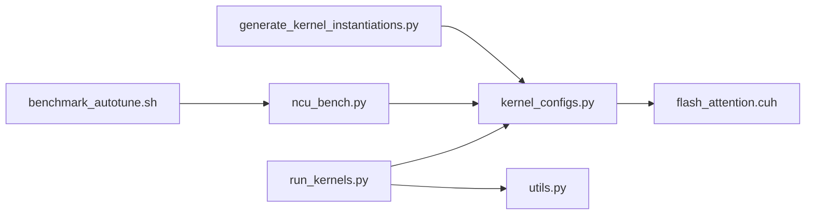

# 自动调优机制

<cite>
**本文引用的文件列表**
- [kernel_configs.py](file://py/flash_helpers/kernel_configs.py)
- [flash_attention.cuh](file://src/include/flash_attention.cuh)
- [generate_kernel_instantiations.py](file://tools/build/generate_kernel_instantiations.py)
- [benchmark_autotune.sh](file://tools/benchmark/benchmark_autotune.sh)
- [ncu_bench.py](file://tools/benchmark/ncu_bench.py)
- [run_kernels.py](file://tools/benchmark/run_kernels.py)
- [utils.py](file://py/flash_helpers/test/utils.py)
</cite>

## 目录
1. [简介](#简介)
2. [项目结构](#项目结构)
3. [核心组件](#核心组件)
4. [架构总览](#架构总览)
5. [详细组件分析](#详细组件分析)
6. [依赖关系分析](#依赖关系分析)
7. [性能考量](#性能考量)
8. [故障排查指南](#故障排查指南)
9. [结论](#结论)
10. [附录](#附录)

## 简介
本文件系统性阐述自动调优机制在项目中的实现与使用，聚焦于 kernel_configs.py 中的自动调优系统。文档将深入解释：
- get_autotuning_kernel_configs() 如何生成候选配置组合；
- should_autotune_config() 如何过滤无效或低效的配置（如非异步复制但急切加载、寄存器使用超限等）；
- 自动调优的搜索空间（数据类型、块大小、线程束数量、优化技术组合）；
- get_kernel_configs() 如何依据环境变量选择不同配置集（如 prog 用于版本演进分析，tune 用于自动调优）；
- 提供实际示例，展示如何使用这些工具进行性能探索与最优配置选择。

## 项目结构
围绕自动调优的关键文件与职责如下：
- py/flash_helpers/kernel_configs.py：定义配置数据结构、解析工具、自动调优生成与过滤逻辑、配置集合选择入口。
- src/include/flash_attention.cuh：声明运行时使用的配置结构体及其比较规则，为 CUDA 前向核提供配置约束。
- tools/build/generate_kernel_instantiations.py：基于自动调优生成的配置集合，自动生成内核实例化映射文件。
- tools/benchmark/ncu_bench.py：通过 NVIDIA Nsight Compute 收集指标并输出对比表，支撑自动调优结果评估。
- tools/benchmark/run_kernels.py：执行内核基准测试，支持从命令行解析短形式配置字符串。
- tools/benchmark/benchmark_autotune.sh：一键启动自动调优流程的脚本入口。
- py/flash_helpers/test/utils.py：测试与基准辅助工具，包含参考内核、张量生成与设备信息等。

图表来源
- [kernel_configs.py](file://py/flash_helpers/kernel_configs.py#L1-L486)
- [flash_attention.cuh](file://src/include/flash_attention.cuh#L1-L110)
- [generate_kernel_instantiations.py](file://tools/build/generate_kernel_instantiations.py#L1-L56)
- [ncu_bench.py](file://tools/benchmark/ncu_bench.py#L1-L464)
- [run_kernels.py](file://tools/benchmark/run_kernels.py#L1-L159)
- [utils.py](file://py/flash_helpers/test/utils.py#L1-L202)
- [benchmark_autotune.sh](file://tools/benchmark/benchmark_autotune.sh#L1-L4)

章节来源
- [kernel_configs.py](file://py/flash_helpers/kernel_configs.py#L1-L486)
- [flash_attention.cuh](file://src/include/flash_attention.cuh#L1-L110)
- [generate_kernel_instantiations.py](file://tools/build/generate_kernel_instantiations.py#L1-L56)
- [ncu_bench.py](file://tools/benchmark/ncu_bench.py#L1-L464)
- [run_kernels.py](file://tools/benchmark/run_kernels.py#L1-L159)
- [utils.py](file://py/flash_helpers/test/utils.py#L1-L202)
- [benchmark_autotune.sh](file://tools/benchmark/benchmark_autotune.sh#L1-L4)

## 核心组件
- 配置数据结构：FlashForwardKernelConfig（包含数据类型、头维度、块大小、线程束数、异步复制、急切加载、Swizzle、Q/K/V 加载瓦片数、双缓冲加载、优化 Softmax 等字段），并在 C++ 层提供全序比较规则，便于排序与去重。
- 解析工具：支持从“消解名”、“带类型参数的消解名”、“短形式”等多种字符串解析为配置对象，便于从日志或输出中提取配置。
- 自动调优生成：get_autotuning_kernel_configs() 以笛卡尔积生成候选配置，并用 should_autotune_config() 过滤非法/低效组合。
- 配置集合选择：get_kernel_configs() 根据环境变量 KERNELS 或传入参数返回不同集合（版本演进 prog、全部 all、自动调优 tune、按 B_r,B_c 过滤）。
- 实例化生成：generate_kernel_instantiations.py 将可用配置写入 C++ 映射，供运行时选择对应内核。

章节来源
- [kernel_configs.py](file://py/flash_helpers/kernel_configs.py#L106-L175)
- [flash_attention.cuh](file://src/include/flash_attention.cuh#L30-L109)
- [generate_kernel_instantiations.py](file://tools/build/generate_kernel_instantiations.py#L1-L56)

## 架构总览
自动调优的整体流程如下：
- 定义搜索空间与过滤条件；
- 生成候选配置；
- 通过构建阶段生成内核实例化映射；
- 使用基准脚本运行内核，采集指标；
- 输出对比表，指导选择最优配置。

图表来源
- [benchmark_autotune.sh](file://tools/benchmark/benchmark_autotune.sh#L1-L4)
- [ncu_bench.py](file://tools/benchmark/ncu_bench.py#L360-L404)
- [run_kernels.py](file://tools/benchmark/run_kernels.py#L1-L159)
- [kernel_configs.py](file://py/flash_helpers/kernel_configs.py#L465-L486)
- [generate_kernel_instantiations.py](file://tools/build/generate_kernel_instantiations.py#L1-L56)

## 详细组件分析

### 组件A：配置数据结构与解析
- 数据结构：FlashForwardKernelConfig 在 Python 层以 dataclass 表达，在 C++ 层以 struct 表达，字段覆盖数据类型、块大小、线程束数、异步复制、急切加载、Swizzle、Q/K/V 加载瓦片数、双缓冲加载、优化 Softmax 等。
- 比较规则：C++ 层提供全序比较，确保配置可排序、可去重，便于构建映射与日志输出。
- 解析工具：
  - _parse_flash_forward_demangled_name：从消解名中提取配置；
  - _parse_flash_forward_demangled_name_with_types：从带类型参数的消解名提取配置；
  - _parse_short_form_flash_forward_kernel_config：从短形式字符串解析配置；
  - parse_kernel_name_into_config：统一入口，优先尝试三种解析方式。

图表来源
- [kernel_configs.py](file://py/flash_helpers/kernel_configs.py#L106-L175)
- [flash_attention.cuh](file://src/include/flash_attention.cuh#L30-L109)

章节来源
- [kernel_configs.py](file://py/flash_helpers/kernel_configs.py#L106-L175)
- [flash_attention.cuh](file://src/include/flash_attention.cuh#L30-L109)

### 组件B：自动调优候选生成与过滤
- get_autotuning_kernel_configs(dtypes)：
  - 固定 d_head=128；
  - B_r ∈ {64, 128}，B_c ∈ {32, 64}；
  - n_warps ∈ {4}（当前固定）；
  - async_copy ∈ {True}，eager_load_blocks ∈ {True}，swizzled ∈ {True}；
  - Q/K/V 加载瓦片数 ∈ {0, 2}；
  - mma_double_buffer_loads ∈ {False, True}，optimized_softmax ∈ {False, True}；
  - 通过笛卡尔积生成所有组合，再经 should_autotune_config() 过滤。
- should_autotune_config(cfg) 的过滤规则：
  - 若未启用异步复制却启用急切加载，则剔除；
  - 若 Q/K 加载瓦片不一致且 Q 不为 0，则剔除；
  - 当 B_r=64 时：
    - n_warps=8 的组合剔除；
    - 当 B_c=32 且 Q_mma_load_K_tiles=0 时剔除（寄存器阈值限制）；
    - 当 B_c=64 且 Q_mma_load_K_tiles≠0 时剔除；
  - 当 B_r=128 时：
    - Q_mma_load_K_tiles=0 的组合剔除；
  - 其余情况保留。

图表来源
- [kernel_configs.py](file://py/flash_helpers/kernel_configs.py#L364-L387)

章节来源
- [kernel_configs.py](file://py/flash_helpers/kernel_configs.py#L389-L424)
- [kernel_configs.py](file://py/flash_helpers/kernel_configs.py#L364-L387)

### 组件C：配置集合选择与版本演进
- get_kernel_configs(kernels_key)：
  - 若 kernels_key 为空则读取环境变量 KERNELS；
  - 以 "prog" 开头：返回版本演进配置（可选扩展到更多块大小）；
  - KERNELS="all"：返回所有可构建配置；
  - KERNELS="tune"：返回自动调优配置；
  - KERNELS="B_r,B_c"：返回指定 B_r,B_c 的自动调优配置；
  - 其他值：抛出错误。
- 版本演进配置（get_kernel_progression_configs）：
  - 以一组短形式配置为基线，逐步引入 Swizzle、急切加载、不同加载瓦片数、双缓冲与优化 Softmax；
  - 可选扩展到多种 B_r,B_c,n_warps 组合。

章节来源
- [kernel_configs.py](file://py/flash_helpers/kernel_configs.py#L426-L455)
- [kernel_configs.py](file://py/flash_helpers/kernel_configs.py#L465-L486)

### 组件D：构建与实例化映射
- generate_kernel_instantiations.py：
  - 调用 get_kernels_to_build() 获取去重后的配置集合；
  - 逐条生成 C++ 结构体字面量与内核函数指针映射；
  - 写入 src/include/flash_kernels.cuh，供运行时选择内核。

章节来源
- [generate_kernel_instantiations.py](file://tools/build/generate_kernel_instantiations.py#L1-L56)
- [kernel_configs.py](file://py/flash_helpers/kernel_configs.py#L457-L463)

### 组件E：基准与性能评估
- benchmark_autotune.sh：
  - 设置 KERNELS=tune，批量运行不同序列长度，输出 CSV。
- ncu_bench.py：
  - 调用 ncu CLI 收集内存工作负载分析指标；
  - 解析 CSV，按内核名称归类并平均多次运行；
  - 生成 PrettyTable，显示 Duration、Cycles、Registers、L2 Hit Rate 等，并计算 TFLOP/s 与 Attn TFLOP/s；
  - 支持输出 CSV。
- run_kernels.py：
  - 从命令行解析短形式配置字符串，或使用 get_kernel_configs("tune")；
  - 生成 Q,K,V,O 张量，循环执行 flash_attention.forward；
  - 支持运行参考内核（v2/v3）进行正确性对比。

章节来源
- [benchmark_autotune.sh](file://tools/benchmark/benchmark_autotune.sh#L1-L4)
- [ncu_bench.py](file://tools/benchmark/ncu_bench.py#L1-L464)
- [run_kernels.py](file://tools/benchmark/run_kernels.py#L1-L159)
- [utils.py](file://py/flash_helpers/test/utils.py#L1-L202)

## 依赖关系分析
- Python 层依赖：
  - kernel_configs.py 依赖 dataclasses、itertools、os、re、enum；
  - ncu_bench.py 依赖 kernel_configs 的解析与计数函数；
  - run_kernels.py 依赖 kernel_configs 的配置选择与解析；
  - generate_kernel_instantiations.py 依赖 get_kernels_to_build()。
- C++ 层依赖：
  - flash_attention.cuh 定义配置结构体与比较规则，被 Python 的配置对象语义对齐；
  - 构建映射文件后，运行时通过配置键选择具体内核实例。

图表来源
- [kernel_configs.py](file://py/flash_helpers/kernel_configs.py#L1-L486)
- [flash_attention.cuh](file://src/include/flash_attention.cuh#L1-L110)
- [generate_kernel_instantiations.py](file://tools/build/generate_kernel_instantiations.py#L1-L56)
- [ncu_bench.py](file://tools/benchmark/ncu_bench.py#L1-L464)
- [run_kernels.py](file://tools/benchmark/run_kernels.py#L1-L159)
- [utils.py](file://py/flash_helpers/test/utils.py#L1-L202)
- [benchmark_autotune.sh](file://tools/benchmark/benchmark_autotune.sh#L1-L4)

章节来源
- [kernel_configs.py](file://py/flash_helpers/kernel_configs.py#L1-L486)
- [flash_attention.cuh](file://src/include/flash_attention.cuh#L1-L110)
- [generate_kernel_instantiations.py](file://tools/build/generate_kernel_instantiations.py#L1-L56)
- [ncu_bench.py](file://tools/benchmark/ncu_bench.py#L1-L464)
- [run_kernels.py](file://tools/benchmark/run_kernels.py#L1-L159)
- [utils.py](file://py/flash_helpers/test/utils.py#L1-L202)
- [benchmark_autotune.sh](file://tools/benchmark/benchmark_autotune.sh#L1-L4)

## 性能考量
- 寄存器与共享内存限制：
  - should_autotune_config() 对 B_r=64 时的 B_c 与 Q 加载瓦片数施加严格限制，避免超过寄存器阈值导致多 CTA 场景下资源不足；
  - B_r=128 时要求至少启用 Q 加载瓦片，以满足计算强度与吞吐需求。
- 计算强度与访存比：
  - 提供 total_flop/attn_flop 计算函数，便于评估配置的理论算力与实际性能的关系；
  - ncu_bench.py 输出 TFLOP/s 与 Attn TFLOP/s，辅助定位高算力瓶颈。
- 块大小与线程束数：
  - B_r/B_c 与 n_warps 的组合直接影响吞吐与占用，演进配置逐步引入 Swizzle、急切加载、双缓冲与优化 Softmax，以提升访存与计算效率。

章节来源
- [kernel_configs.py](file://py/flash_helpers/kernel_configs.py#L364-L387)
- [kernel_configs.py](file://py/flash_helpers/kernel_configs.py#L81-L104)
- [ncu_bench.py](file://tools/benchmark/ncu_bench.py#L270-L308)

## 故障排查指南
- 环境变量 KERNELS 无效：
  - get_kernel_configs() 对未知值会抛出错误；请确认设置为 "prog"、"progall"、"all"、"tune" 或 "B_r,B_c"。
- 解析配置字符串失败：
  - parse_kernel_name_into_config() 会依次尝试三种解析方式；若均失败，抛出异常；请检查短形式字符串格式或内核消解名。
- 寄存器超限导致性能差：
  - should_autotune_config() 已过滤部分超限组合；若仍出现异常，建议调整 B_r/B_c/n_warps 或减少加载瓦片数。
- 基准脚本无法运行 ncu：
  - ncu_bench.py 在找不到 ncu 命令时会提示安装路径问题；请确保已安装并加入 PATH。
- 正确性验证：
  - run_kernels.py 支持运行参考内核（v2/v3），可与目标配置输出进行误差统计对比。

章节来源
- [kernel_configs.py](file://py/flash_helpers/kernel_configs.py#L465-L486)
- [kernel_configs.py](file://py/flash_helpers/kernel_configs.py#L177-L335)
- [ncu_bench.py](file://tools/benchmark/ncu_bench.py#L311-L360)
- [run_kernels.py](file://tools/benchmark/run_kernels.py#L1-L159)
- [utils.py](file://py/flash_helpers/test/utils.py#L165-L186)

## 结论
本自动调优体系通过明确的搜索空间、严格的过滤规则与完善的基准评估，实现了从配置生成到性能验证的闭环。开发者可通过 KERNELS=tune 快速探索最优配置，结合 ncu_bench.py 的指标输出与 run_kernels.py 的正确性校验，高效完成性能优化与版本演进。

## 附录

### 实际使用示例
- 启动自动调优（批量序列长度，输出 CSV）
  - 执行：KERNELS=tune tools/benchmark/ncu_bench.py --seq_lens="1024,2048,4096,8192,16384" --d_heads=128 --runs=1 --csv > profiles/autotune.csv
  - 说明：脚本内部设置 KERNELS=tune，自动调用 run_kernels.py -kernels=all，收集指标并输出 CSV。
- 仅运行特定 B_r,B_c 的配置
  - 执行：KERNELS=64,32 tools/benchmark/ncu_bench.py --seq_lens="1024" --d_heads=128 --runs=1
  - 说明：get_kernel_configs("64,32") 会筛选 B_r=64 且 B_c=32 的自动调优配置。
- 本地手动运行单个配置
  - 执行：python tools/benchmark/run_kernels.py 4096 128 --kernels="(FP16, 128, 64, 64, 4): async+eager+swizzled+load_2_2_2_tiles+buffer+opt_softmax" --n_runs=3
  - 说明：run_kernels.py 会解析短形式配置字符串，生成张量并执行多次内核，支持参考内核对比。

章节来源
- [benchmark_autotune.sh](file://tools/benchmark/benchmark_autotune.sh#L1-L4)
- [ncu_bench.py](file://tools/benchmark/ncu_bench.py#L362-L404)
- [run_kernels.py](file://tools/benchmark/run_kernels.py#L1-L159)
- [kernel_configs.py](file://py/flash_helpers/kernel_configs.py#L465-L486)