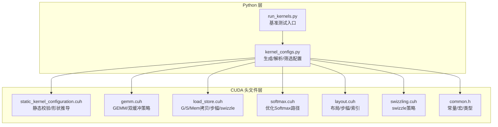
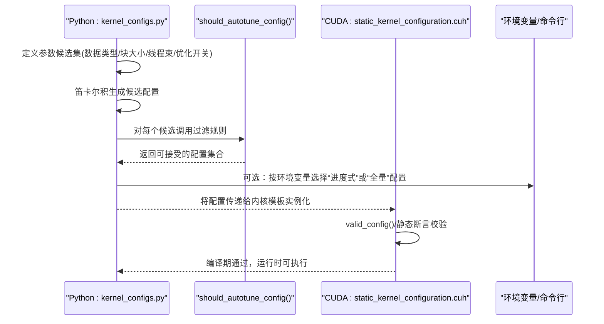
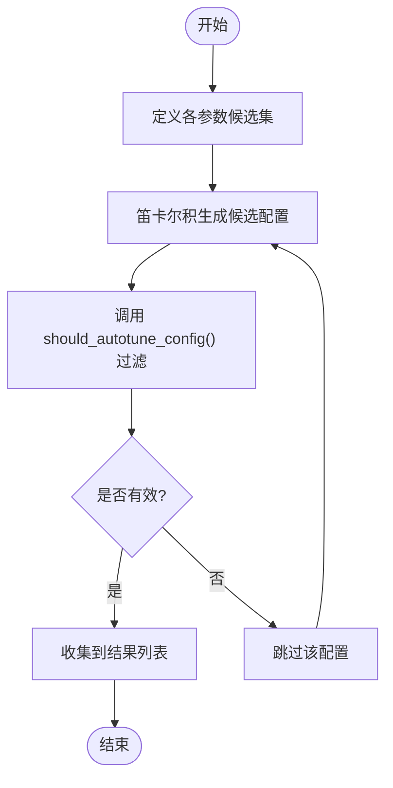
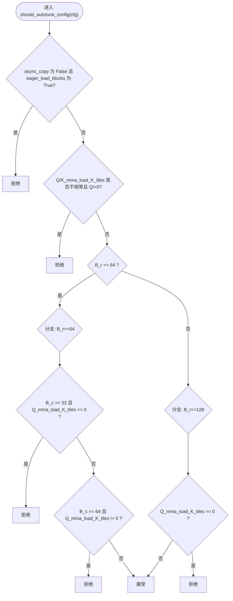
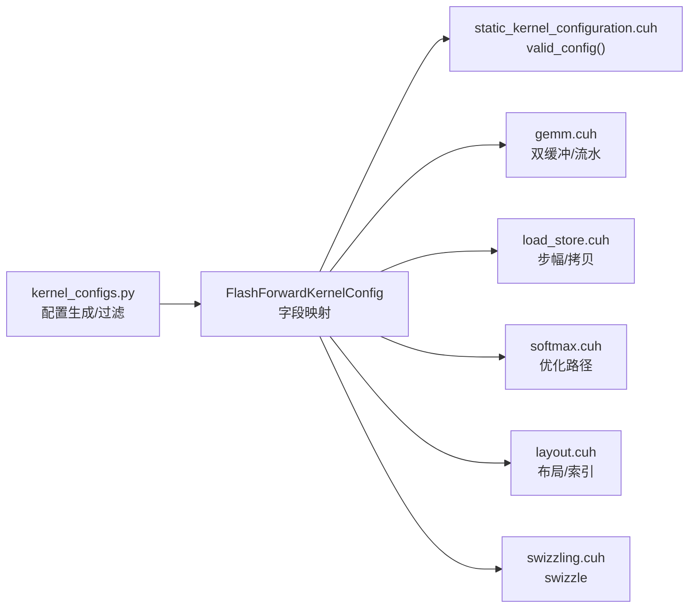

# 配置生成机制

<cite>
**本文引用的文件**
- [kernel_configs.py](file://py/flash_helpers/kernel_configs.py)
- [static_kernel_configuration.cuh](file://src/include/static_kernel_configuration.cuh)
- [common.h](file://src/include/common.h)
- [gemm.cuh](file://src/include/gemm.cuh)
- [load_store.cuh](file://src/include/load_store.cuh)
- [softmax.cuh](file://src/include/softmax.cuh)
- [layout.cuh](file://src/include/layout.cuh)
- [swizzling.cuh](file://src/include/swizzling.cuh)
- [run_kernels.py](file://tools/benchmark/run_kernels.py)
- [README.md](file://README.md)
</cite>

## 目录
1. [引言](#引言)
2. [项目结构](#项目结构)
3. [核心组件](#核心组件)
4. [架构总览](#架构总览)
5. [详细组件分析](#详细组件分析)
6. [依赖关系分析](#依赖关系分析)
7. [性能考量](#性能考量)
8. [故障排查指南](#故障排查指南)
9. [结论](#结论)
10. [附录](#附录)

## 引言
本文件围绕 py/flash_helpers/kernel_configs.py 中的 get_autotuning_kernel_configs() 函数展开，系统性解析其如何基于数据类型（fp16/bf16）、块大小（BLOCK_M/BLOCK_N 对应 B_r/B_c）、线程束数量（n_warps）、以及优化技术（异步复制、双缓冲、优化Softmax 等）构建完整的配置搜索空间。我们将从代码结构、数据流、处理逻辑与依赖关系入手，逐步阐明候选配置组合的维度与规模，并解释不同参数组合对性能的影响；同时给出配置生成过程的示意流程图与扩展新配置选项的方法。

## 项目结构
本仓库包含 Python 层的内核配置工具与 CUDA 前向内核实现。与本主题直接相关的文件包括：
- Python 层：用于生成与解析内核配置、筛选有效配置、导出构建清单
- CUDA 头文件：定义静态内核配置、GEMM/加载存储/布局/swizzling/softmax 等运行时行为

图表来源
- [kernel_configs.py](file://py/flash_helpers/kernel_configs.py#L389-L486)
- [static_kernel_configuration.cuh](file://src/include/static_kernel_configuration.cuh#L22-L35)
- [gemm.cuh](file://src/include/gemm.cuh#L15-L40)
- [load_store.cuh](file://src/include/load_store.cuh#L38-L96)
- [softmax.cuh](file://src/include/softmax.cuh#L85-L106)
- [layout.cuh](file://src/include/layout.cuh#L14-L34)
- [swizzling.cuh](file://src/include/swizzling.cuh#L9-L23)
- [common.h](file://src/include/common.h#L17-L44)
- [run_kernels.py](file://tools/benchmark/run_kernels.py#L1-L159)

章节来源
- [README.md](file://README.md#L1-L63)

## 核心组件
- FlashForwardKernelConfig：封装一次内核实例化的完整配置，包括数据类型、d_head、B_r/B_c、n_warps、异步复制、预加载、swizzle、Q/K/V 的 K 方向分块数、是否双缓冲、是否启用优化 Softmax 等。
- get_autotuning_kernel_configs()：以笛卡尔积方式生成候选配置集合，并通过 should_autotune_config() 进行合法性过滤。
- should_autotune_config()：根据硬件/架构约束与参数间的相互关系进行剪枝，避免无效或不可行的组合。
- 解析与转换：支持从符号名、短形式字符串解析为配置对象，便于日志/报告与自动化工具使用。

章节来源
- [kernel_configs.py](file://py/flash_helpers/kernel_configs.py#L106-L175)
- [kernel_configs.py](file://py/flash_helpers/kernel_configs.py#L389-L424)
- [kernel_configs.py](file://py/flash_helpers/kernel_configs.py#L364-L387)

## 架构总览
下图展示了配置生成与验证在编译期与运行时的交互关系：Python 层生成配置，CUDA 层通过静态断言与模板推导确保配置合法并可执行。

图表来源
- [kernel_configs.py](file://py/flash_helpers/kernel_configs.py#L389-L424)
- [kernel_configs.py](file://py/flash_helpers/kernel_configs.py#L364-L387)
- [static_kernel_configuration.cuh](file://src/include/static_kernel_configuration.cuh#L22-L35)

## 详细组件分析

### get_autotuning_kernel_configs() 实现逻辑
- 参数空间定义
  - 数据类型：fp16/bf16
  - d_head：固定为 128
  - B_r：64 或 128
  - B_c：32 或 64
  - n_warps：4（当前版本仅 4）
  - 异步复制：开启
  - 预加载：开启
  - swizzle：开启
  - Q/K/V 的 K 方向分块数：0 或 2
  - 双缓冲：开启/关闭
  - 优化 Softmax：开启/关闭
- 生成策略
  - 使用笛卡尔积生成所有组合
  - 对每个组合调用 should_autotune_config() 进行过滤
- 返回值
  - 仅包含满足约束的有效配置列表

图表来源
- [kernel_configs.py](file://py/flash_helpers/kernel_configs.py#L389-L424)
- [kernel_configs.py](file://py/flash_helpers/kernel_configs.py#L364-L387)

章节来源
- [kernel_configs.py](file://py/flash_helpers/kernel_configs.py#L389-L424)

### should_autotune_config() 过滤规则详解
该函数通过一系列硬性约束剔除不可能或不合理的配置，主要涉及：
- 异步复制与预加载的互斥/组合关系
- Q/K 的 K 方向分块数一致性要求
- B_r=64 与 B_c、n_warps、Q/K 分块数之间的阈值限制
- B_r=128 的最小分块数要求

图表来源
- [kernel_configs.py](file://py/flash_helpers/kernel_configs.py#L364-L387)

章节来源
- [kernel_configs.py](file://py/flash_helpers/kernel_configs.py#L364-L387)

### 配置维度与规模分析
- 维度构成
  - 数据类型：2
  - d_head：1
  - B_r：2
  - B_c：2
  - n_warps：1
  - 异步复制：1
  - 预加载：1
  - swizzle：1
  - Q/K/V 的 K 方向分块数：2×2×2=8
  - 双缓冲：2
  - 优化 Softmax：2
- 初始组合数：2×1×2×2×1×1×1×8×2×2=128
- 过滤后规模：取决于 should_autotune_config() 的剪枝效果，实际有效配置远小于初始组合数

章节来源
- [kernel_configs.py](file://py/flash_helpers/kernel_configs.py#L389-L424)
- [kernel_configs.py](file://py/flash_helpers/kernel_configs.py#L364-L387)

### 不同参数组合对性能的影响
- 数据类型（fp16/bf16）
  - 计算吞吐与带宽利用率差异；bf16 在部分设备上可能有更优的算力表现，但带宽占用相同。
- 块大小（B_r/B_c）
  - 影响寄存器压力、共享内存占用与访存重叠机会；B_r=64 与 B_r=128 在寄存器/共享内存占用与流水深度上存在权衡。
- 线程束数量（n_warps）
  - n_warps=4 是当前固定值，影响每 warp 负责的行数与负载均衡。
- 异步复制（async_copy）
  - 提升访存与计算重叠，减少等待时间，但需配合合适的 swizzle 与步幅。
- 预加载（eager_load_blocks）
  - 提前将 K/V 加载至共享内存，减少后续循环中的访存延迟，但增加共享内存占用。
- swizzle
  - 打乱共享内存访问模式，提升全局内存带宽利用率，降低冲突。
- Q/K/V 的 K 方向分块数（Q/K/V_mma_load_K_tiles）
  - 控制每次迭代加载的 K 方向片段数，影响寄存器/共享内存占用与访存重叠；Q/K 必须一致或 Q=0。
- 双缓冲（mma_double_buffer_loads）
  - 在加载下一 tile 的同时进行计算，提高流水效率，但需要足够的寄存器/共享内存。
- 优化 Softmax（optimized_softmax）
  - 合并首行与后续行的 softmax 计算路径，减少分支与冗余操作，提升吞吐。

章节来源
- [kernel_configs.py](file://py/flash_helpers/kernel_configs.py#L106-L175)
- [static_kernel_configuration.cuh](file://src/include/static_kernel_configuration.cuh#L22-L35)
- [gemm.cuh](file://src/include/gemm.cuh#L32-L40)
- [load_store.cuh](file://src/include/load_store.cuh#L38-L96)
- [softmax.cuh](file://src/include/softmax.cuh#L85-L106)
- [swizzling.cuh](file://src/include/swizzling.cuh#L9-L23)
- [layout.cuh](file://src/include/layout.cuh#L14-L34)

### 代码示例：配置生成过程（路径引用）
- 生成候选配置集合
  - 路径参考：[get_autotuning_kernel_configs()](file://py/flash_helpers/kernel_configs.py#L389-L424)
- 过滤无效配置
  - 路径参考：[should_autotune_config()](file://py/flash_helpers/kernel_configs.py#L364-L387)
- 解析短形式字符串为配置对象
  - 路径参考：[_parse_short_form_flash_forward_kernel_config()](file://py/flash_helpers/kernel_configs.py#L251-L321)
- 将配置转换为 C++ 结构体字面量
  - 路径参考：[FlashForwardKernelConfig.to_cpp_struct()](file://py/flash_helpers/kernel_configs.py#L148-L164)

章节来源
- [kernel_configs.py](file://py/flash_helpers/kernel_configs.py#L251-L321)
- [kernel_configs.py](file://py/flash_helpers/kernel_configs.py#L148-L164)
- [kernel_configs.py](file://py/flash_helpers/kernel_configs.py#L364-L387)
- [kernel_configs.py](file://py/flash_helpers/kernel_configs.py#L389-L424)

### 如何扩展新的配置选项
- 在 Python 层添加新参数候选集
  - 在 get_autotuning_kernel_configs() 中新增参数候选列表，并将其加入 params 列表
  - 若新增参数与现有参数存在约束关系，应在 should_autotune_config() 中补充相应判断
  - 路径参考：[get_autotuning_kernel_configs()](file://py/flash_helpers/kernel_configs.py#L389-L424)，[should_autotune_config()](file://py/flash_helpers/kernel_configs.py#L364-L387)
- 在 CUDA 层暴露新配置项
  - 将新字段纳入 FlashForwardKernelConfig（若尚未在数据类中定义），并在静态配置模板中使用
  - 若涉及寄存器/共享内存/访存模式变化，需在 static_kernel_configuration.cuh 中更新 valid_config() 与相关模板推导
  - 路径参考：[static_kernel_configuration.cuh](file://src/include/static_kernel_configuration.cuh#L22-L35)
- 更新解析与转换逻辑
  - 若新参数有短形式字符串表示，需在解析函数中支持
  - 路径参考：[_parse_short_form_flash_forward_kernel_config()](file://py/flash_helpers/kernel_configs.py#L251-L321)
- 验证与回归
  - 使用 run_kernels.py 运行基准，验证新配置在目标设备上的正确性与性能
  - 路径参考：[run_kernels.py](file://tools/benchmark/run_kernels.py#L1-L159)

章节来源
- [kernel_configs.py](file://py/flash_helpers/kernel_configs.py#L389-L424)
- [kernel_configs.py](file://py/flash_helpers/kernel_configs.py#L364-L387)
- [kernel_configs.py](file://py/flash_helpers/kernel_configs.py#L251-L321)
- [static_kernel_configuration.cuh](file://src/include/static_kernel_configuration.cuh#L22-L35)
- [run_kernels.py](file://tools/benchmark/run_kernels.py#L1-L159)

## 依赖关系分析
- Python 层依赖 CUDA 头文件提供的静态断言与模板推导，确保生成的配置在编译期即可通过合法性检查
- 关键依赖链
  - FlashForwardKernelConfig 字段与 CUDA 模板参数一一对应
  - should_autotune_config() 的约束与 static_kernel_configuration.cuh 的 valid_config() 保持一致
  - GEMM 双缓冲策略与 load/store 步幅/swizzle 共同决定访存与计算重叠程度

图表来源
- [kernel_configs.py](file://py/flash_helpers/kernel_configs.py#L106-L175)
- [static_kernel_configuration.cuh](file://src/include/static_kernel_configuration.cuh#L22-L35)
- [gemm.cuh](file://src/include/gemm.cuh#L32-L40)
- [load_store.cuh](file://src/include/load_store.cuh#L38-L96)
- [softmax.cuh](file://src/include/softmax.cuh#L85-L106)
- [layout.cuh](file://src/include/layout.cuh#L14-L34)
- [swizzling.cuh](file://src/include/swizzling.cuh#L9-L23)

章节来源
- [kernel_configs.py](file://py/flash_helpers/kernel_configs.py#L106-L175)
- [static_kernel_configuration.cuh](file://src/include/static_kernel_configuration.cuh#L22-L35)
- [gemm.cuh](file://src/include/gemm.cuh#L32-L40)
- [load_store.cuh](file://src/include/load_store.cuh#L38-L96)
- [softmax.cuh](file://src/include/softmax.cuh#L85-L106)
- [layout.cuh](file://src/include/layout.cuh#L14-L34)
- [swizzling.cuh](file://src/include/swizzling.cuh#L9-L23)

## 性能考量
- 寄存器与共享内存占用
  - Q/K/V 的 K 方向分块数越大，单次加载的片段越多，对寄存器/共享内存的压力越大；需结合双缓冲与 swizzle 平衡
- 访存重叠与带宽利用
  - 异步复制 + swizzle + 预加载可显著提升访存重叠，减少等待；但需注意步幅与对齐
- 流水与延迟隐藏
  - 双缓冲与优化 Softmax 路径有助于隐藏访存延迟，提升吞吐
- 块大小与线程束数量
  - B_r/B_c 与 n_warps 决定每 warp 负责的行数与负载均衡；B_r=64 与 B_r=128 在寄存器/共享内存占用与流水深度上存在权衡

章节来源
- [gemm.cuh](file://src/include/gemm.cuh#L32-L40)
- [load_store.cuh](file://src/include/load_store.cuh#L38-L96)
- [softmax.cuh](file://src/include/softmax.cuh#L85-L106)
- [swizzling.cuh](file://src/include/swizzling.cuh#L9-L23)
- [layout.cuh](file://src/include/layout.cuh#L14-L34)

## 故障排查指南
- 常见问题
  - 配置无法通过编译期校验：检查 Q/K_mma_load_K_tiles 是否一致或 Q=0，以及 B_r=64 时的阈值限制
  - 运行时性能异常：确认异步复制与 swizzle 是否匹配，预加载是否导致共享内存不足
  - 解析错误：短形式字符串格式不正确或缺少必要字段
- 排查步骤
  - 使用短形式字符串打印配置，核对字段是否齐全
  - 逐步缩小参数范围，定位导致失败的参数组合
  - 参考解析函数的错误提示，修正输入格式

章节来源
- [kernel_configs.py](file://py/flash_helpers/kernel_configs.py#L251-L321)
- [kernel_configs.py](file://py/flash_helpers/kernel_configs.py#L364-L387)
- [static_kernel_configuration.cuh](file://src/include/static_kernel_configuration.cuh#L22-L35)

## 结论
get_autotuning_kernel_configs() 通过系统化的参数空间设计与严格的过滤规则，为 Flash Attention 前向内核提供了高覆盖率且高效的配置搜索空间。通过对数据类型、块大小、线程束数量与多项优化技术的协同控制，能够在不同硬件平台上获得稳定的高性能表现。扩展新配置选项时，需同步完善 Python 层的候选集与过滤规则，并在 CUDA 层通过静态断言确保可行性，最终通过基准测试验证有效性。

## 附录
- 相关常量与宏（来自 common.h）
  - 线程束大小、向量访问粒度、swizzle tile 尺寸等
- 基准测试入口
  - 通过 run_kernels.py 可以选择特定配置或自动构建配置集合进行测试

章节来源
- [common.h](file://src/include/common.h#L17-L44)
- [run_kernels.py](file://tools/benchmark/run_kernels.py#L1-L159)