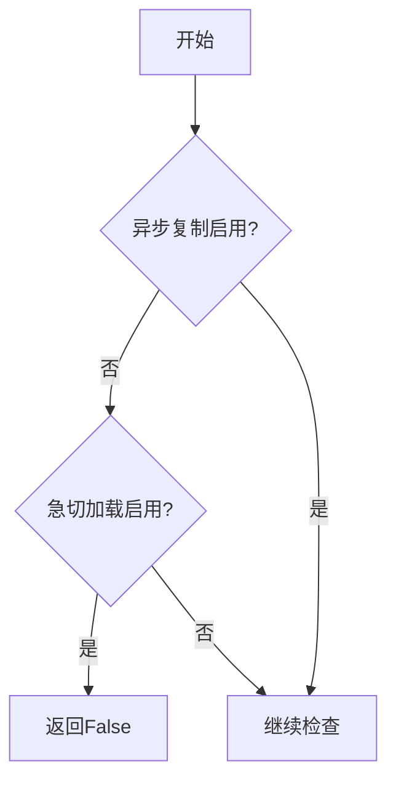
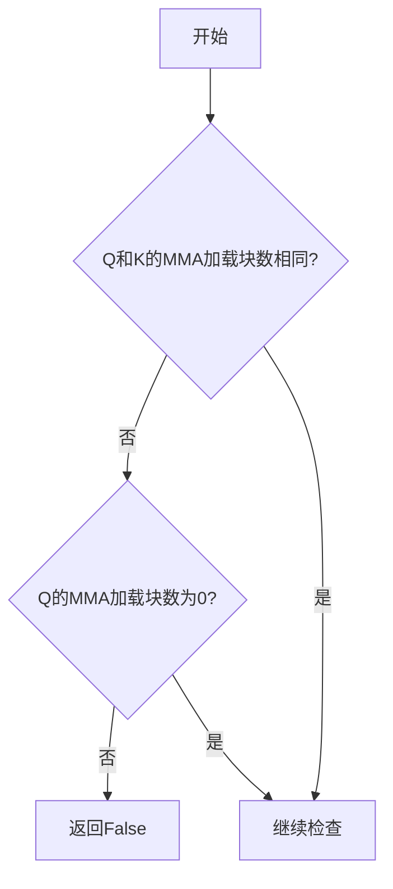
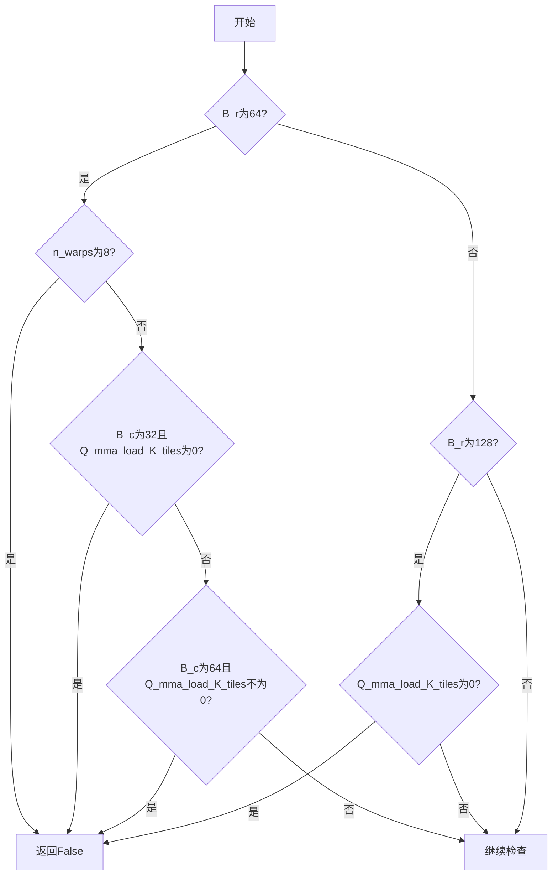
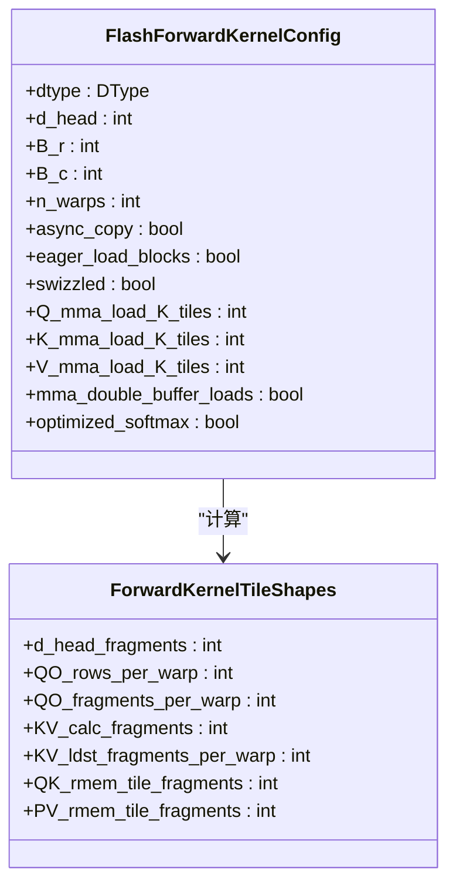
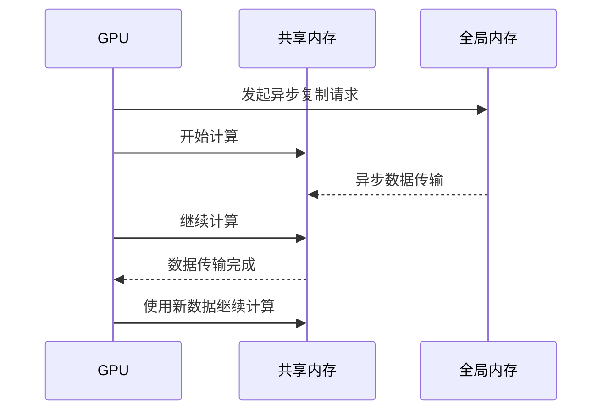

# 配置过滤策略

<cite>
**本文档中引用的文件**   
- [kernel_configs.py](file://py/flash_helpers/kernel_configs.py#L364-L386)
- [static_kernel_configuration.cuh](file://src/include/static_kernel_configuration.cuh#L22-L35)
- [common.h](file://src/include/common.h#L19-L20)
- [gemm.cuh](file://src/include/gemm.cuh#L16-L22)
- [load_store.cuh](file://src/include/load_store.cuh#L17-L28)
- [forward_kernel.cuh](file://src/include/forward_kernel.cuh#L19-L83)
</cite>

## 目录
1. [引言](#引言)
2. [should_autotune_config()函数分析](#should_autotune_config函数分析)
3. [三种主要过滤条件详解](#三种主要过滤条件详解)
4. [硬件约束与性能考量](#硬件约束与性能考量)
5. [结论](#结论)

## 引言
本文档深入分析`py/flash_helpers/kernel_configs.py`文件中`should_autotune_config()`函数的配置过滤规则。该函数在Flash Attention内核的自动调优过程中起着关键作用，通过排除无效或低效的内核配置来优化性能。文档将重点说明三种主要过滤条件：非异步复制但启用急切加载的配置、寄存器使用超限的配置、以及不支持的优化组合，并结合代码实例说明这些限制背后的硬件约束和性能考量。

## should_autotune_config函数分析
`should_autotune_config()`函数是Flash Attention内核自动调优过程中的核心组件，负责过滤掉无效或低效的内核配置。该函数通过一系列条件判断来确保只有符合硬件约束和性能要求的配置才能被保留。

```python
def should_autotune_config(cfg: FlashForwardKernelConfig) -> bool:
    if not cfg.async_copy and cfg.eager_load_blocks:
        return False
    if (
        cfg.Q_mma_load_K_tiles != cfg.K_mma_load_K_tiles
        and cfg.Q_mma_load_K_tiles != 0
    ):
        return False

    if cfg.B_r == 64:
        if cfg.n_warps == 8:
            return False
        elif (
            cfg.B_c == 32 and cfg.Q_mma_load_K_tiles == 0
        ):  # over threshold of # registers for 3 CTA
            return False
        elif cfg.B_c == 64 and cfg.Q_mma_load_K_tiles != 0:
            return False
    elif cfg.B_r == 128:
        if cfg.Q_mma_load_K_tiles == 0:
            return False

    return True
```

该函数首先检查异步复制和急切加载的组合，然后验证Q和K的MMA加载块数是否一致，最后根据不同的块大小（B_r）和线程束数量（n_warps）进行寄存器使用情况的检查。

**Section sources**
- [kernel_configs.py](file://py/flash_helpers/kernel_configs.py#L364-L386)

## 三种主要过滤条件详解

### 非异步复制但启用急切加载的配置
第一个过滤条件检查是否在没有启用异步复制的情况下启用了急切加载。这种配置是无效的，因为急切加载依赖于异步复制机制来实现高效的内存传输。



**Diagram sources**
- [kernel_configs.py](file://py/flash_helpers/kernel_configs.py#L365-L366)

### 寄存器使用超限的配置
第二个过滤条件检查Q和K的MMA加载块数是否一致。如果不一致且Q的MMA加载块数不为0，则该配置会被排除。这是为了确保寄存器使用的平衡性和效率。



**Diagram sources**
- [kernel_configs.py](file://py/flash_helpers/kernel_configs.py#L367-L371)

### 不支持的优化组合
第三个过滤条件根据不同的块大小进行寄存器使用情况的检查。对于B_r为64的情况，如果n_warps为8，或者B_c为32且Q_mma_load_K_tiles为0，或者B_c为64且Q_mma_load_K_tiles不为0，则该配置会被排除。对于B_r为128的情况，如果Q_mma_load_K_tiles为0，则该配置会被排除。



**Diagram sources**
- [kernel_configs.py](file://py/flash_helpers/kernel_configs.py#L373-L385)

## 硬件约束与性能考量

### 寄存器压力对occupancy的影响
寄存器压力是影响GPU内核性能的关键因素之一。当寄存器使用量超过硬件限制时，会导致occupancy降低，从而影响性能。在Flash Attention内核中，通过限制Q和K的MMA加载块数来控制寄存器使用量。



**Diagram sources**
- [static_kernel_configuration.cuh](file://src/include/static_kernel_configuration.cuh#L22-L35)
- [common.h](file://src/include/common.h#L19-L20)

### 异步复制与双缓冲的协同需求
异步复制和双缓冲是提高内存传输效率的重要技术。异步复制允许在计算的同时进行内存传输，而双缓冲则通过交替使用两个缓冲区来实现计算和传输的重叠。



**Diagram sources**
- [load_store.cuh](file://src/include/load_store.cuh#L17-L28)
- [forward_kernel.cuh](file://src/include/forward_kernel.cuh#L19-L83)

## 结论
`should_autotune_config()`函数通过严格的过滤规则确保了Flash Attention内核配置的有效性和高效性。这些规则不仅考虑了硬件约束，还兼顾了性能优化的需求。通过排除无效或低效的配置，该函数为实现高性能的Flash Attention内核提供了重要保障。