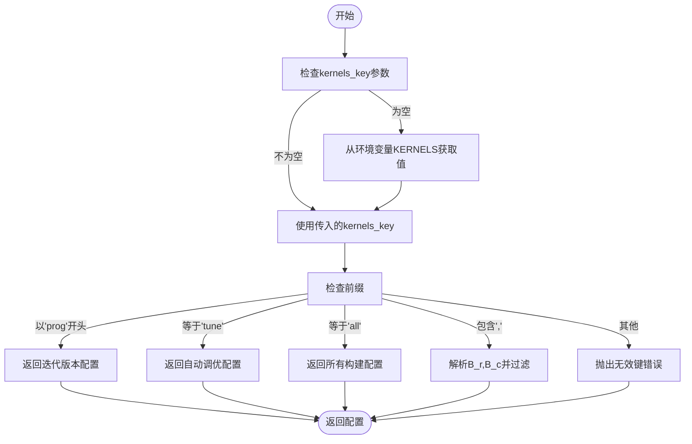
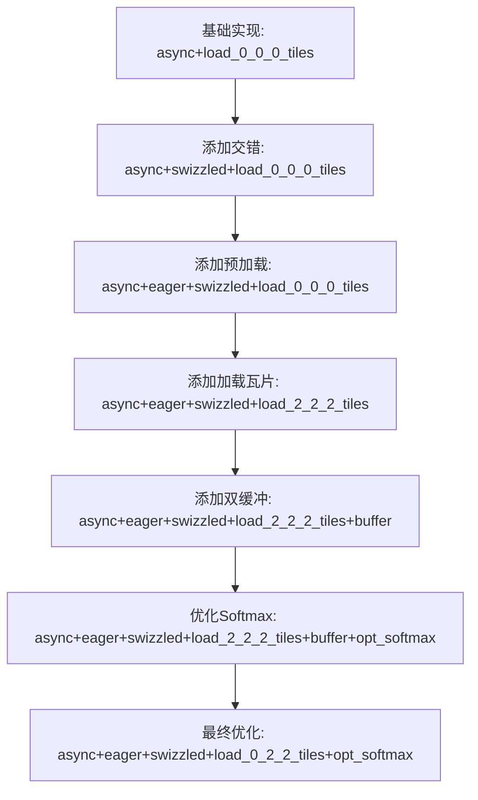
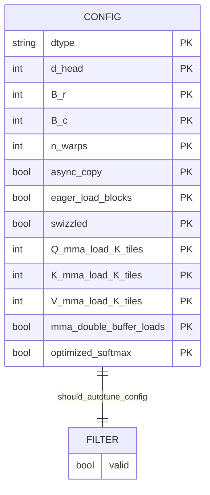
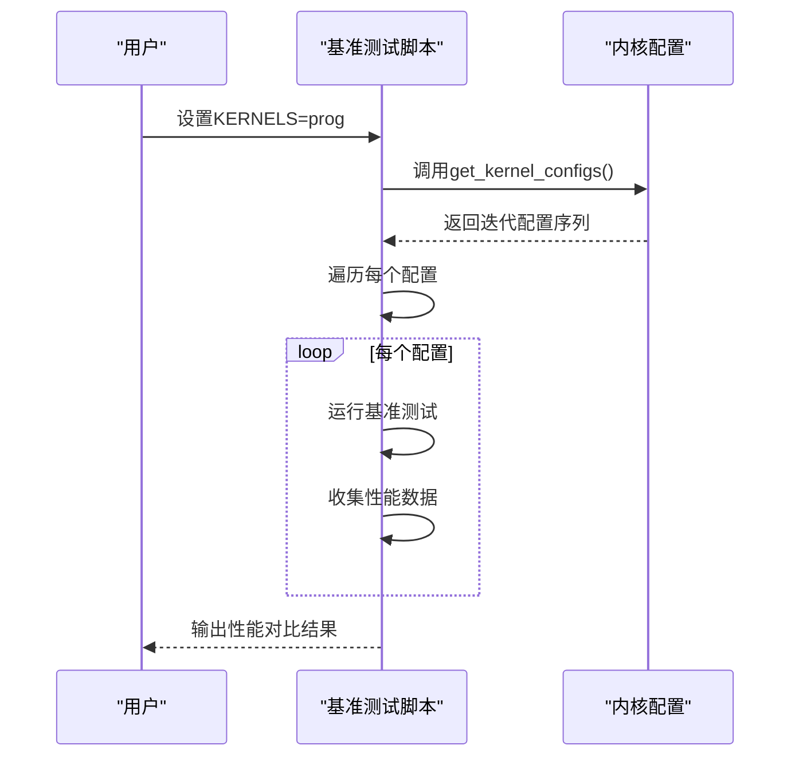

# 配置选择与调度

<cite>
**本文档中引用的文件**  
- [kernel_configs.py](file://py/flash_helpers/kernel_configs.py)
- [run_kernels.py](file://tools/benchmark/run_kernels.py)
- [ncu_bench.py](file://tools/benchmark/ncu_bench.py)
- [benchmark_autotune.sh](file://tools/benchmark/benchmark_autotune.sh)
- [test.py](file://py/flash_helpers/test/test.py)
</cite>

## 目录
1. [引言](#引言)
2. [核心机制分析](#核心机制分析)
3. [配置选择模式](#配置选择模式)
4. [实际使用场景](#实际使用场景)
5. [性能探索与实验设计](#性能探索与实验设计)
6. [结论](#结论)

## 引言
`get_kernel_configs()` 函数是该闪存注意力（Flash Attention）实现中的核心配置调度器，它通过环境变量（如 `KERNELS`）动态选择不同的内核配置集。这种机制支持灵活的实验设计和性能探索，允许研究人员和开发者在不同模式下进行基准测试、版本对比分析和自动调优。本文档详细阐述该函数的工作原理、支持的配置模式以及实际应用示例。

## 核心机制分析
`get_kernel_configs()` 函数通过读取环境变量 `KERNELS` 来决定返回哪一组内核配置。如果未指定 `kernels_key` 参数，则从环境变量中获取默认值。函数根据 `kernels_key` 的值进行分支处理，返回相应的配置集合。这种设计使得用户可以通过简单的环境变量设置来控制实验的配置选择，而无需修改代码。

**核心机制流程图**


**图示来源**
- [kernel_configs.py](file://py/flash_helpers/kernel_configs.py#L465-L485)

**本节来源**
- [kernel_configs.py](file://py/flash_helpers/kernel_configs.py#L465-L485)

## 配置选择模式
`get_kernel_configs()` 支持多种配置选择模式，每种模式对应不同的实验目的和使用场景。

### prog模式：迭代版本分析
当 `kernels_key` 以 "prog" 开头时，函数调用 `get_kernel_progression_configs()` 返回一组预定义的配置，用于分析内核的迭代优化过程。这些配置代表了从基础实现到最终优化版本的逐步改进路径。

**prog模式配置流程**


**图示来源**
- [kernel_configs.py](file://py/flash_helpers/kernel_configs.py#L426-L435)

**本节来源**
- [kernel_configs.py](file://py/flash_helpers/kernel_configs.py#L426-L454)

### tune模式：自动调优
当 `kernels_key` 等于 "tune" 时，函数调用 `get_autotuning_kernel_configs()` 返回一组用于自动调优的配置。这些配置覆盖了多种参数组合，允许系统在运行时选择最优的内核配置。

**tune模式参数空间**


**图示来源**
- [kernel_configs.py](file://py/flash_helpers/kernel_configs.py#L389-L423)

**本节来源**
- [kernel_configs.py](file://py/flash_helpers/kernel_configs.py#L389-L423)

## 实际使用场景
该配置选择机制在实际应用中提供了极大的灵活性，支持多种性能基准测试和版本对比分析。

### 性能基准测试
通过设置 `KERNELS=tune` 环境变量，可以运行自动调优基准测试，评估不同配置的性能表现。

**自动调优脚本示例**
```bash
#!/usr/bin/env bash
seq_lens="${1:-1024,2048,4096,8192,16384}"
KERNELS=tune tools/benchmark/ncu_bench.py --seq_lens="${seq_lens}" --d_heads=128 --runs=1 --csv > profiles/autotune.csv
```

**本节来源**
- [benchmark_autotune.sh](file://tools/benchmark/benchmark_autotune.sh#L1-L4)

### 版本对比分析
通过设置 `KERNELS=prog` 或 `KERNELS=prog-all`，可以运行迭代版本分析，比较不同优化步骤对性能的影响。

**版本对比分析流程**


**图示来源**
- [ncu_bench.py](file://tools/benchmark/ncu_bench.py#L419-L464)
- [pt_bench.py](file://tools/benchmark/pt_bench.py#L402-L412)

**本节来源**
- [ncu_bench.py](file://tools/benchmark/ncu_bench.py#L419-L464)
- [pt_bench.py](file://tools/benchmark/pt_bench.py#L402-L412)

## 性能探索与实验设计
该机制支持灵活的性能探索和实验设计，研究人员可以通过环境变量轻松控制实验的配置选择。

### 自定义配置选择
除了预定义的模式，用户还可以通过逗号分隔的 `B_r,B_c` 值来选择特定的块大小配置。

**自定义配置选择示例**
```python
# 选择B_r=64, B_c=32的配置
configs = get_kernel_configs("64,32")
```

### 综合实验设计
结合不同的配置模式和参数，可以设计复杂的实验来全面评估内核性能。

**综合实验设计表**
| 实验目的 | 环境变量设置 | 配置来源函数 | 说明 |
|---------|------------|-------------|------|
| 基准性能测试 | KERNELS=all | get_kernels_to_build | 测试所有可构建的内核 |
| 自动调优分析 | KERNELS=tune | get_autotuning_kernel_configs | 评估调优参数空间 |
| 优化路径分析 | KERNELS=prog | get_kernel_progression_configs | 分析迭代优化效果 |
| 全尺寸分析 | KERNELS=prog-all | get_kernel_progression_configs | 包含所有块大小的优化路径 |
| 特定配置测试 | KERNELS=64,32 | get_kernel_configs | 测试特定块大小组合 |

**本节来源**
- [kernel_configs.py](file://py/flash_helpers/kernel_configs.py#L465-L485)
- [run_kernels.py](file://tools/benchmark/run_kernels.py#L72-L81)

## 结论
`get_kernel_configs()` 函数通过环境变量实现了灵活的配置选择机制，支持多种实验模式，包括迭代版本分析（'prog'模式）和自动调优（'tune'模式）。这种设计使得研究人员能够轻松地进行性能基准测试和版本对比分析，而无需修改代码。通过简单的环境变量设置，用户可以控制实验的配置选择，从而支持灵活的实验设计和全面的性能探索。